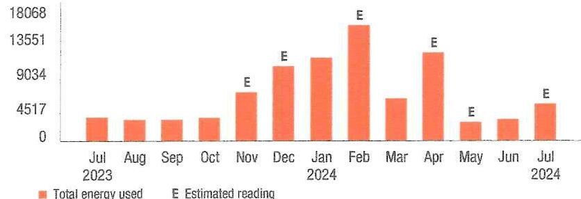

## 50 PSEG

We make things work for you.

## 51-8310-78

## Your energy bill

## (1) Message Center

## - " SHUT-OFF NOTICE * *   1-800-357-2262 (Mon-Fri, 7:30 AM - 8:00 PM)

Your service is currently in danger of being shut off. $\$ 431.87$ is due immediately. Note further that an additional $\$ 3,238.07$ is now past due and must be paid by $8 / 5 / 2024$ or $\$ 3,669.94$ will be required to avoid shut off. A statement of customer rights and fees is shown on the reverse side.

Si en el futuro usted desea recibir la notificación de desconexión de servicio en español, por favor llame al 1-800-357-2262.

This bill reflects BPU-approved changes in the Delivery portion of your gas bill, effective on and after July 1, 2024. The increase in the Delivery portion of your bill is due to changes in the Green Programs Recovery Charge. The overall impact for business customers will vary by individual customer usage. Tariff information can be found at pseg.com.

## - NEXT METER READING August 15, 2024

## How to contact us

## 1-855-BIZ-PSEG (249-7734)

Customer Service: 8am to 5:30pm Mon to Fri, Closed on weekends and holidays
Emergencies / Outages / WorryFree Services: 24/7
TDD/TTY for the hearing impaired: 711
Visit pseg.com/myaccount to access your account anytime
Text us. Register for MyAlerts by texting REG to 4PSEG(47734)
$>$ Text OUT to report an outage.
facobook.com/pseg
twitter.com/psegdelivers

## 5 PSEG

We make change work for you.
PAY YOUR WAY, 24/7
We offer a variety of methods that make it easy to pay your bill. See reverse side for more information.

By checking this box, I authorize PSE\&G to initiate recurring AON/Electronic Debits using the bank account number on the enclosed check.

## 092223000029176

$1 \mid 1_{11} 11 \mid 1_{1} 1_{1} 1_{1} 1_{1} 1_{1} 1_{1} 1_{1} 1_{1} 1_{1} 1_{1} 1_{1} 1_{1} 1_{1} 1_{1} 1_{1} 1_{1} 1_{1} 1_{1} 1_{1} 1_{1} 1_{1} 1_{1} 1_{1} 1_{1} 1_{1} 1_{1} 1_{1} 1_{1} 1_{1} 1_{1} 1_{1} 1_{1} 1_{1} 1_{1} 1_{1} 1_{1} 1_{1} 1_{1} 1_{1} 1_{1}

# STATEMENT OF CUSTOMER'S RIGHTS 

If you have any billing or service questions, you should first call PSE\&G at 1-800-436-7734 between 7am and 8pm, Monday through Friday, or between 7am and 5pm on Saturdays or visit one of our customer service centers. You may have counsel or third party representation when appearing before PSE\&G to contest a bona fide disputed charge.

If you are not able to make a payment, we may be able to help you by setting up a reasonable payment arrangement. You can discuss your options by visiting one of our customer service centers, or by calling our credit and collection center at 1-800-357-2262 between 7:30am and 8 pm , Monday through Friday.

If you are not able to resolve a dispute with us, you may contact the New Jersey Board of Public Utilities to ask them to help you resolve it. PSE\&G operates under the authority of the Board.

The Board's address is:
44 South Clinton Avenue,
Trenton, NJ 08625
Phone: 1609 341-9188,
Toll free 1800 624-0241.

You may also ask for a formal hearing with the Board to discuss your dispute.

If you contact the Board within five days of trying to resolve your dispute with us, we will not shut off service to you because you haven't paid your bill. However, you must pay all other charges that you're not disputing.

## If your service is shut off

If we shut off your service because you fail to pay outstanding charges, we will charge a reconnection fee of $\$ 45.00$ for each service when you do pay the amount you owe. We may not be able to restore your service on the date you make your payment. We may also require you to pay a security deposit.

You can avoid paying a security deposit and earning a poor credit rating with PSE\&G by paying your bills by their due date. A fee of $\$ 30.00$ will be charged if a visit is made to collect past due bills. A late payment fee may be charged for past due bills.

## IT'S YOUR BILL. HOW YOU PAY IS YOUR CHOICE.

My Account Make a payment andime from a checking or savings account stored in My Account Visit: peeg.com/ myaccount

Mobile: Download our Mobile App "PSE\&G"
Pay by text: Text PAY to: 4PSE5 (47734)

Voice: Ask Alena or use Google Assistant.

## ㅇ

Automatic Bill Pay
Automatic payments from your
hawk. Skip checks and stamps. Never worry about due dates.

Enroll at:
peeg.com/autopay

Credit Card
Pay your bill with a credit card online or by phone. Because we don't use customer rates to subsidize the cost of this service, there is a fee.

My Account: peeg.com/myaccount

Phone:
$1-833-277-8710$

## $\Rightarrow$ Phone

Bank Account: 1-800-553-7734

Credit Card: 1-833-277-8710

## $\Rightarrow$ By Mail

Make your check payable to PSE\&G and write your account number on your check.

When you pay by check, you authorize PSE\&G to make a one-time electronic fund transfer from your account, in the amount of your check. If you prefer not to authorize us, call 1-800-436-PSEG.

## $\Delta$ In Person

Payments are accepted at any customer service center or authorized location.

Locations can be found at: peeg.com/tox

## Details of your gas charges

Your rate: Large Volume Gas (LVG)

| Meter \# 2643692 | Usage |
| :--: | :--: |
| Estimated reading Jul 17, 2024 | 32453 |
| Less Actual reading Jun 10, 2024 | 27892 |
| Difference | 4,561 |
| Converted to CCF $\times 1.012$ | $4,615,732$ |
| Converted to therms $\times 1.034$ | $4,772,667$ |
| Total gas you used in 37 days | 4,772,667 therms |

## Delivery charges

| Monthly service charge | $\$ 221.58$ |
| :-- | --: |
| Charges for delivering gas to you: |  |
| For the First | $1,233,000$ therms $\times \$ 0.020681$ |
| For the Next | $3,539,667$ therms $\times \$ 0.038860$ |
| Societal Benefits | $4,772,667$ therms $\times \$ 0.066108$ |
| This charge recovers the cost of government mandated programs | $\$ 315.51$ |
| designed to achieve public policy goals, such as energy conservation. |  |

Total gas delivery charges
$\$ 700.14$
Supply charges
Cost of gas supplied by PSE\&G:
4,772,667 therms $\times \$ 0.540641$
$\$ 2,580.30$
Total gas supply charges
$\$ 2,580.30$
Total gas charges
$\$ 3,280.44$

Your monthly gas use
Therms

The image is a bar chart.

- **Chart Type**: Bar chart
- **X-Axis**: Months from Jul 2023 to Jul 2024
- **Y-Axis**: Energy usage in therms with increments labeled as 0, 4517, 9034, 13551, 18068
- **Legend Entries**: 
  - Orange bars represent "Total energy used"
  - "E" indicates "Estimated reading"
- **Data Points**:
  - Jul 2023: Low usage
  - Aug 2023: Low usage
  - Sep 2023: Low usage
  - Oct 2023: Low usage
  - Nov 2023: Moderate usage, marked with "E"
  - Dec 2023: Higher usage, marked with "E"
  - Jan 2024: Highest usage, marked with "E"
  - Feb 2024: High usage
  - Mar 2024: Moderate usage, marked with "E"
  - Apr 2024: High usage
  - May 2024: Low usage
  - Jun 2024: Low usage
  - Jul 2024: Moderate usage, marked with "E"
- **Yearly Usage Breakdown (Monthly-Based)**: The chart shows monthly energy usage with estimated readings marked for several months.

Visit MyAccount for more details regarding your energy usage.

## Price to compare

A history of PSE\&G's monthly Basic Gas Supply Service (BGSS) prices are located on our website at www.pseg.com.

Your PoD ID is: PG000008889734301547 Your PoD ID is your Point of Delivery Identification within PSE\&G's system.

