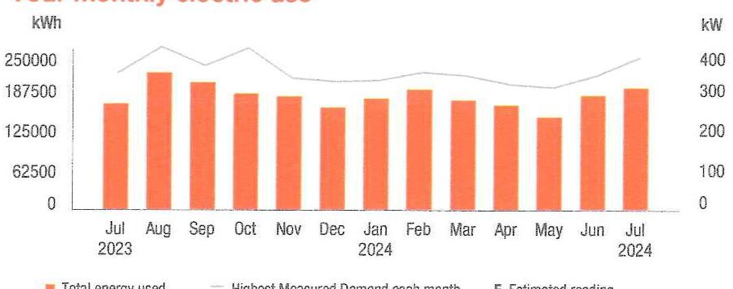

## 52-8060-78

## Your energy bill

## Message Center

This bill reflects BPU-approved changes in the Delivery portion of your electric bill, effective on and after July 1, 2024. The increase in the Delivery portion of your bill is due to changes in the Green Programs Recovery Charge. The overall impact for business customers will vary by individual customer usage. Tariff information may also be found by visiting pseg.com.

Is there a streetlight out in your neighborhood? Report and track an outage with our Streetlight Outage Map. Visit pseg.com/StreetlightMap or download our free app.

Make sure your home's electric wiring is safe. Signs of trouble can include flickering lights and frequently blown circuits. If you suspect a problem, hire a qualified electrician to inspect your home. For more tips, visit pseg.com/ElectricSafetyTips.

NEXT METER READING July 31, 2024

## How to contact us

## 1-855-BIZ-PSEG (249-7734)

Customer Service: 8am to 5:30pm Mon to Fri,
Closed on weekends and holidays
Emergencies / Outages / WorryFree Services: 24/7
TDD/TTY for the hearing impaired: 711
Visit pseg.com/myaccount to access your account anytime
Text us. Register for MyAlerts by texting REG to 4PSEG(47734)
$>$ Text OUT to report an outage.
facebook.com/pseg
twitter.com/psegdelivers

Bill date: July 12, 2024
For the period: June 01, 2024 to June 30, 2024

- ST JOSEPH HOME

FOR THE BLIND
4200577402

## ACCOUNT NUMBER

4200577402

## SERVICE ADDRESS

537 PAVONIA AVE
JERSEY CITY NJ 07306-1803

## Your billing summary

## Balance remaining from your last bill

PSE\&G balance from last bill
\$28.291.47
Lag
Payment received July 11, 2024 - thank you!
\$28.291.47
Balance remaining from your last bill
This month's charges and credits
Electric charges - PSE\&G for 1 meter
\$9.158.06
PloS
Electric supply charges - Smartest Energy US
LLC
This month's charges and credits
Total amount due by Jul 29, 2024
\$32,969.46

Page 1 of 4

## PSEGG

We order to the pseg
PAY YOUR WAY, 24/7
We offer a variety of methods that make it easy to pay your bill. See reverse side for more information.

By checking this box, Iauthorize PSE\&G to initiate recurring AOH/Electronic Debits using the bank account number on the enclosed check.

By checking this box, Iauthorize PSE\&G to enroll me in paperless billing at this email address:

000098000000102

## ST JOSEPH HOME

FOR THE BLIND
537 PAVONIA AVE
JERSEY CITY NJ 07306-1803

Account number
Total amount due by Jul 29, 2024
\$32,969.46
Amount enclosed \$32,969.46
$\mathrm{pr}\left[\mathrm{H}_{1} \mathrm{H}_{1}\right] /\left[\left[\mathrm{p}_{1}\right]\right]\left[\mathrm{p}_{1}\right] /\left[\left(\mathrm{l}_{\mathrm{l}}\right]\right.$
$\left.\mathrm{H}_{1}\right] /\left[\left[\mathrm{l}_{1}\right] /\left[\left[\mathrm{l}_{\mathrm{l}}\right]\right] /\left[\left[\mathrm{l}_{\mathrm{l}}\right]\right] /\left[\left[\mathrm{l}_{1}\right]\right] /\left[\left[\mathrm{l}_{\mathrm{l}}\right]\right] /\left[\left[\left[\mathrm{l}_{1}\right]\right] /\left[\left[\left[\mathrm{l}_{\mathrm{l}}\right]\right]\right] /\left[\left[\left[\mathrm{l}_{1}\right]\right]\right] /\left[\left[\left[\left[\left[\mathrm{l}_{1}\right]\right]\right]\right] /\left[\left[\left[\left[\left[\left[\left[\left[\left[\left[\left[\left[\left[\left[\left[\left[\left[\left[\left[\left[\left[\left[\left[\left[\left[\left[\left[\left[\left[\left[\left[\left[\left[\left[\left[\left[\left[\left[\left[\left[\left[\left[\left[\left[\left[\left[\left[\left[\left[\left[\left[\left[\left[\left[\left[\left[\left[\left[\left[\left[\left[\left[\left[\left[\left[\left[\left[\left[\left[\left[\left[\left[\left[\left[\left[\left[\left[\left[\left[\left[\left[\left[\left[\left[\left[\left[\left[\left[\left[\left[\left[\left[\left[\left[\left[\left[\left[\left[\left[\left[\

## (1) Message Center (Continued from page 1)

Si desea recibir en español una notificación de desconexión del servicio, llame al 1-800-357-2262.

Air conditioning can be a big part of your business's energy costs. To save energy and money, keep thermostats set at the highest comfortable temperature during hotter months. For more tips, visit pseg.com/BizEnergyTips.

Moving? For your convenience, you can open and close your PSE\&G account online by visiting pseg.com/Moving

PSE\&G is installing smart meters that will provide electric customers with a number of benefits, including more detailed electric-use information, near real-time power outage detection, and the elimination of almost all estimated electric bills. To learn more, visit pseg.com/SmartMeters.

Are you ready for summer storms? We work year-round to prepare for severe weather and want you to be prepared, too. Our online Outage Center offers many ways to stay in touch and informed before, during and after a storm. Visit pseg.com/OutageCenter to learn more or see the enclosed "Working for you" newsletter.

At PSE\&G, we are committed to supporting your business needs. That's why we have a dedicated, toll-free phone number to address your energy questions and concerns. PSE\&G's Business Solutions Center is available Monday-Friday, 8:00 a.m. -5:30 p.m. at 1-855-249-7734 (1-855-BIZ-PSEG).

## Don't miss your meter reading

If you'll be away on your meter reading day, use our mobile app to upload a picture of your meter or enter your reading manually, or call 1-800-622-0197.

## Electric \& Gas Rate Information

For news about PSE\&G's rate filing and upcoming public hearings visit www.pseg.com/pseandgfilings. Under applicable tax law, the State Sales and Use Tax and corporate business tax are imposed upon the energy you have used.

# IT'S YOUR BILL. HOW YOU PAY IS YOUR CHOICE. 

My Account Make a payment anytime from a checking or sawings account stored in My Account. Visit pseg.com/ myaccount

Mobile: Download our Mobile App "PSE\&G"
Pay by text: Text PAY to 4PSEG (47734)

Voice: Ask Alexa or use Google Assistant

## Automatic Bill Pay

Automatic payments from your bank. Sign checks and stamps. Never worry about dias dates.

Enroll at:
pseg.com/autopay

Credit Card
Pay your bill with a credit card online or by phone. Because we don't use custome rules to subsidize the cost of this service, there is a fee.

My Account:
pseg.com/myaccount
Phone:
1-833-277-8710

## Phone

Bank Account:
1-800-550-7734
Credit Card:
1-833-277-8710

## $E^{2}$ By Mail

Make your check payable to PSE\&G and write your account number on your check.

When you pay by check, you authorize PSE\&G to make a one-time electronic fund transfer from your account, in the amount of your check. If you prefer not to authorize us, call 1-800-436-PSEG.

## In Person

Payments are accepted at any customer service center or authorized location.

Locations can be found at: pseg.com/csc

## Details of your electric charges

Your rate: Large Power \& Lighting Secondary (LPLS)

| Meter \# 9207321 | Usage |
| :--: | :--: |
| Reading Jun 30, 2024 |  |
| On-Peak Actual | 26270 |
| Reading Jun 1, 2024 |  |
| Leer On-Peak Actual | 26033 |
| Multiplier | 800 |
| Total On kWh | 83,059 |
| Total Off kWh | 106,643 |
| Total kWh | 189,702 |

## Delivery charges

| Monthly service charge | $\$ 370.81$ |
| :--: | :--: |
| Charges for delivering electric to you: |  |
| Annual Demand | $373,700 \mathrm{~kW} \times \$ 4,991303$ |
| The highest Measured Demand in any time period in the current month. |  |
| Summer Demand | $373,700 \mathrm{~kW} \times \$ 9,264196$ |
| The Measured Demand (excluding off-peak) in each billing month of June through September. |  |
| kWh - On-peak | 83,059 kWh $\times \$ 0.009228$ |
| Energy consumed between 8am-10pm, Monday to Friday. |  |
| kWh - Off-peak | 106,643 kWh $\times \$ 0.009228$ |
| Energy consumed outside peak hours. |  |
| Societal Benefits | 189,702 kWh $\times \$ 0.009011$ |
| This charge recovers the cost of government mandated programs designed to achieve public policy goals, such as energy conservation. |  |
| Total electric delivery charges | $\$ 9,158.06$ |
| Total electric charges | \$9,158.06 |

## Your monthly electric use

The image is a bar and line chart.

- **Chart Type**: Bar and line chart
- **X-Axis**: Months from July 2023 to July 2024
- **Y-Axis (Left)**: kWh, ranging from 0 to 250,000
- **Y-Axis (Right)**: kW, ranging from 0 to 400
- **Legend Entries**:
  - Orange bars represent "Total energy used"
  - A gray line represents "Highest Measured Demand each month"
- **Data Points**:
  - The bars show monthly energy usage in kWh, with values varying each month.
  - The line shows the highest measured demand in kW for each month.
- **Yearly Usage Breakdown (Monthly-Based)**: The chart provides a visual representation of energy usage and demand over a year, with monthly data points.
- **Styling**: The bars are in orange, and the line is in gray.

Visit MyAccount for more details regarding your energy usage.

## MEASURED DEMAND

| On-Peak kW | 373.70 |
| :-- | --: |
| Off-Peak2 kW | 347.80 |

Measured Demand is the maximum use of electricity at any time during a monthly time period, as measured by your meter.

## BILLED DEMAND

| Annual Demand kW | 373.70 |
| :-- | --: |
| Summer Demand kW | 373.70 |

## SUPPLY CAPACITY

| Generation kW | 442,169 |
| :-- | --: |
| Transmission kW | 340,313 |

Supply capacity is required to serve the system's annual peak usage. It represents your share of these facilities, in kilowatts (kW). It is calculated based on your peak usage from the previous summer. Supply capacity values are updated periodically throughout the year and are prozated based on your service period.

## Price to compare

You are currently buying your electricity from another supplier. If you had been purchasing your electric supply from PSE\&G, your cost would be $\$ 21,042.74$. This is your price to compare. It varies from month to month depending on your usage.

Your PoD ID is: PE000008913350866006 -
Your PoD ID is your Point of Delivery Identification within PSE\&G's system.

# Electric supply charges - Smartest Energy US LLC 

Through the CHOICE Program, you have chosen to purchase electricity from Smartest Energy US LLC. If you have any questions about the electric supply charges below, please contact them directly at (800) 448-0995.

Adjustments
\$0.00
Current charges
\$23.811.40

Total Smartest Energy US LLC
\$23,811.40
Charges

