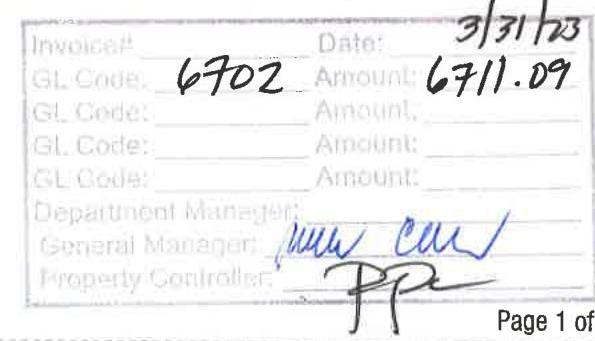
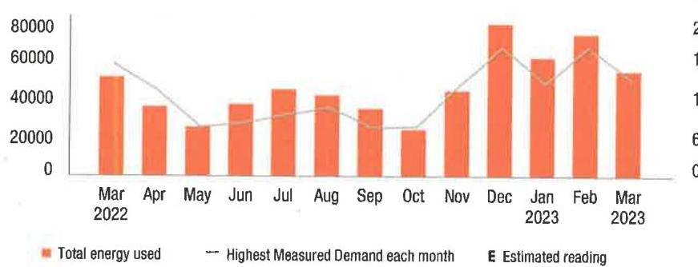

## (1) PSE\&G

We make things work for you.

## Your energy bill

Bill date: March 31, 2023
For the period: March 01, 2023 to March 29, 2023

## Message Center

Smell. Leave. Call. Know what to do if you smell gas. Natural gas has a distinctive odor that smells like rotten eggs. If you smell gas, leave the area immediately. Call 911 or PSE\&G at 800-880-PSEG (7734). Do not assume somebody else has already called. For more information, visit pseg.com/smellgas.

PSE\&G offers a variety of convenient payment options, now including PayPal ${ }^{\circledR}$ and Amazon Pay! To learn more, visit pseg.com/paymentoptions.

At PSE\&G, we make it our business to support your business. That's why we have a dedicated, toll-free phone number to address your energy questions and concerns. PSE\&G's Business Solutions Center is available Monday-Friday, 8:00 a.m. - 5:30 p.m. at 1-855-249-7734 (1-855-BIZ-PSEG).

## NEXT METER READING April 28, 2023

## How to contact us

## 1-855-BIZ-PSEG (249-7734)

Customer Service: 8am to 5:30pm Mon to Fri,
Closed on weekends and holidays
Emergencies / Outages / WorryFree Services: 24/7
TTY for the hearing impaired: 1-800-225-0072
Visit pseg.com/myaccount to access your account anytime
Text us. Register for MyAlerts by texting REG to 4PSEG(47734)
$>$ Text OUT to report an outage.
facebook.com/pseg
twitter.com/psegdelivers

## PSE\&G

The media change work for you.

## PAY YOUR WAY, 24/7

We offer a variety of methods that make it easy to pay your bill. See reverse side for more information.

By checking this box, I authorize PSE\&G to enroll me in paperless billing at this email address:

000141000000192

## FRIENDWELL MANAGEMENT

101 NEW WORLD WAY
SOUTH PLAINFIELD NJ 07080-1104

## $>$ FRIENDWELL MANAGEMENT

## ACCOUNT NUMBER

4200114909

## $>$ SERVICE ADDRESS

101 NEW WORLD WAY
SOUTH PLAINFIELD BORO NJ 07080-1104

## Your billing summary

Balance remaining from your last bill
PSE\&G balance from last bill
Balance remaining from your last bill
This month's charges and credits
Electric charges - PSE\&G for 1 meter
This month's charges and credits
Total amount we'll debit your
account on Apr 17, 2023

The image is a photo of a document section with handwritten and printed text. It includes:

- **Printed Text:**
  - "Invoice#"
  - "Date:"
  - "GL Code:"
  - "Amount:"
  - "Department Manager:"
  - "General Manager:"
  - "Property Controller:"
  - "Page 1 of"

- **Handwritten Text:**
  - Next to "Invoice#": "6702"
  - Next to "Date:": "3/31/23"
  - Next to "Amount:": "6711.09"
  - Signatures or initials next to "General Manager:" and "Property Controller:" sections.

Account number
Automatic bill payment - do not pay

Amount enclosed

## $[$ [H]H[IH[IH[IH[IH[IH[IH[IH[IH[IH[IH[IH[IH[IH]

## (1) Message Center (continued from page 1)

Si desea recibir en español una notificación de desconexión del servicio, llame al 1-800-357-2262.

Smart meters are safe. They use low power radio frequency (RF) that is generally far less than that used by everyday items like baby monitors, cell phones, microwaves, TVs and wireless readers. To learn more about smart meters and their benefits, go to psog.com/smartmeters.

Please precise any inconvenience if you are our crews indelling new gas plans in the street. We're modernizing our gas distribution system to ensure you have safe and reliable service. For a list of towns and streets scheduled for the work, go to psog.com/geswork.

All PSE\&G employees carry identification cards with their picture as it. For your safety, ask to see the IO card of any PSE\&G employee visiting your home or business.

Put our tools to work for your business! For easy access to tips, programs and resources to help your business save energy and money, visit psog.com/bizsavings.

## Don't miss your motor reading

If you'll be away on your meter reading day, use our mobile app to upload a picture of your meter or enter your reading manually, or call 1-800-622-0197.

## Electric \& Gas Rate Information

For news about PSE\&G's rate filing and upcoming public hearings visit www.psog.com/pseudgfilings. Under applicable tax law, the State Sales and Use Tax and corporate business tax are imposed upon the energy you have used.

# IT'S YOUR BILL. HOW YOU PAY IS YOUR CHOICE. 

## 1.1

My Account
Make a payment any time from a checking or savings account closed in 3/2 Account: Visit psog.com/ myaccount

Mobile: Dominant our Mobile App "PSE\&G"

Pay by trust: 1nd $P X Y$ to 4PSEG (67734)

Voice: Ask Aloca or use Google Assistant.

## 2 Automatic BitPay

Automatic payments from your bank. Sign the to and abame. News every about the three.

Email: at: psog.com/bitpay

## Credit Card

Pay your bit with a credit card exists at by phone. Pursuit: we don't use customer rules to withdraw the cost of this service, there is a fee.

My Account: psog.com/mycroant

Phone: 1-800-377-8710

## 3

My Mail
Make your check payable to PSE\&G and write your account number on your check.

When you pay by check, you authorize PSE\&G to make a one-time electronic fund transfer from your account, in the amount of your check. If you prefer not to authorize us, call 1-600-430-PSEG.

## 4

In Person
Pursuati are accepted as any customer service center or unlicensed location.

Locations can be found at: psog.com/ipac

## 5

## In Person

Pursuati are accepted as any customer service center or unlicensed location.

Locations can be found at: psog.com/ipac

## Details of your electric charges

Your rate: Large Power \& Lighting Secondary (LPLS)

## Meter \# 9207259

## Usage

Reading Mar 29, 2023
On-Peak Actual
14087
Reading Mar 1, 2023
Less On-Peak Actual
13955
Multiplier
20,948
Total On kWh
31,797
Total Off kWh
$52,745$

## Delivery charges

Monthly service charge
$52,745 \mathrm{kWh} \times \$ 0.010413$
$549.23$
The highest Measured Demand in any time period in the current month.
$\begin{array}{ll}\text { kWh - On-peak } & 20,948 \mathrm{kWh} \times \$ 0.006029 \\ \text { Energy consumed between 15pm, Monday to Friday. } & \\ \text { kWh - Off-peak } & 31,797 \mathrm{kWh} \times \$ 0.006029\end{array}$
Energy consumed outside peak hours.
Societal Benefits $\quad 52,745 \mathrm{kWh} \times \$ 0.010413$
This charge recovers the cost of government mandated programs designed to achieve public policy goals, such as energy conservation.
Total electric delivery charges
$1,926.56$
Supply charges
BGS Capacity
$\begin{array}{ll}\text { Generation } & 85,115 \mathrm{~kW} \times \$ 3.400223 \\ \text { Transmission } & 83.876 \mathrm{~kW} \times \$ 12.618151\end{array} \$ 289.41$
Cost of electric supplied by PSE\&G:
On-peak
20,948 kWh $\times \$ 0.069513$
Off-peak
31,797 kWh $\times \$ 0.062289$
Total electric supply charges
$1,980.60$
$54,784.53$
Total electric charges
$5,711.09$

Your monthly electric use
kWh

The image is a bar and line chart.

- **Chart Type**: Combination of bar and line chart.
- **X-Axis**: Months from March 2022 to March 2023.
- **Y-Axis**: Energy usage in unspecified units, ranging from 0 to 80,000.
- **Legend Entries**:
  - Orange bars represent "Total energy used."
  - A line represents "Highest Measured Demand each month."
  - "E" indicates "Estimated reading."
- **Data Points**:
  - March 2022: Approximately 55,000
  - April 2022: Approximately 35,000
  - May 2022: Approximately 45,000
  - June 2022: Approximately 30,000
  - July 2022: Approximately 40,000
  - August 2022: Approximately 35,000
  - September 2022: Approximately 40,000
  - October 2022: Approximately 35,000
  - November 2022: Approximately 50,000
  - December 2022: Approximately 70,000
  - January 2023: Approximately 60,000
  - February 2023: Approximately 65,000
  - March 2023: Approximately 55,000
- **Notable Styling**: The bars are in orange, and the line is a thin curve that connects the highest measured demand points for each month.

This chart provides a **yearly usage breakdown (monthly-based)** of energy consumption and demand.

Visit MyAccount for more details regarding your energy usage.

## MEASURED DEMAND

On-Peak kW 141.10
Off-Peak2 kW 154.10
Measured Demand is the maximum use of electricity at any time during a monthly time period, as measured by your meter.

## BILLED DEMAND

Annual Demand kW 154.10

## SUPPLY CAPACITY

Generation kW 85.115
Transmission kW 83.876
Supply capacity is required to serve the system's annual peak usage. It represents your share of these facilities, in kilowatts (kW). It is calculated based on your peak usage from the previous summer. Supply capacity values are updated periodically throughout the year and are prorated based on your service period.

## Price to compare

If you want to consider getting your electric supply from another supplier, compare their price with ours. This month, your cost for energy supply is $\$ 4,784.53$. This price to compare varies month to month, depending on your usage.

Your PoD ID is: PE000008090034342946 Your PoD ID is your Point of Delivery identification within PSE\&G's system. You will need this number if you are considering enrolling with another supplier.

