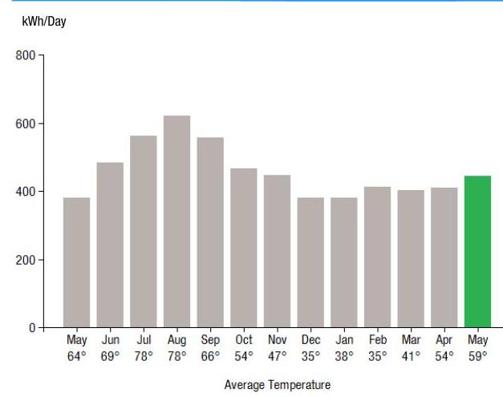
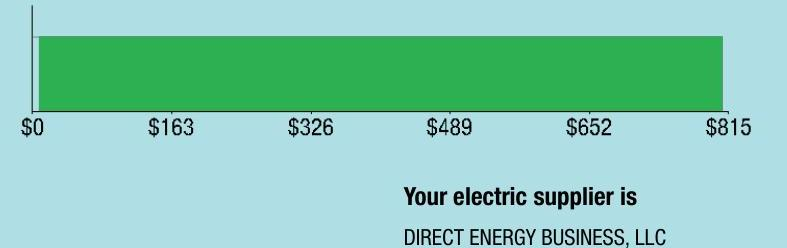
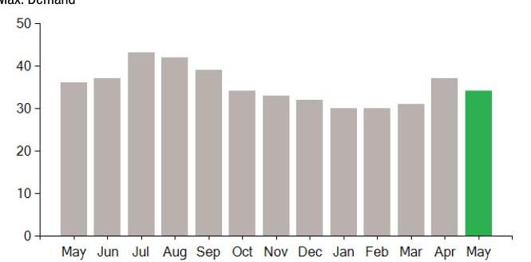

## EVERSEURCE

Account Number: 51330794041
Statement Date: 05/25/23
Service Provided To: NEWFIELD DONUTS LLC

Electric Usage History - Microsoft House (kWh)

The image is a bar chart.

- **Chart Type**: Bar chart
- **Y-Axis Title**: kWh/Day
- **X-Axis Title**: Average Temperature
- **Data Points**:
  - May: 64° / 69°
  - Jun: 69° / 78°
  - Jul: 78° / 78°
  - Aug: 78° / 69°
  - Sep: 66° / 54°
  - Oct: 54° / 47°
  - Nov: 47° / 35°
  - Dec: 35° / 38°
  - Jan: 35° / 35°
  - Feb: 35° / 41°
  - Mar: 41° / 54°
  - Apr: 54° / 59°
  - May: 59° (highlighted in green)

- **Yearly Usage Breakdown (Monthly-Based)**: The chart shows monthly electric usage in kWh per day, with May highlighted in green, indicating a notable emphasis on this month's data.

## Electric Usage Summary

| This month your   average daily   electric use was   444.0 kWh | This month you used   $16.8 \%$ more   than at the   same time last year | 16.8 |
| :-- | :-- | :-- |

## News For You

As we head into the cooling season, you can take steps to reduce your energy use and bill. Take advantage of energy-saving improvements to help you stay comfortable efficiently with Home Energy Solutions. You'll receive on-the-spot services plus recommendations and rebates for additional ways to save. For help with your energy bill and ways to lower your energy use visit Eversource.com/price.

Remit Payment To: Eversource, PO Box 56002, Boston, MA 02205-6002

## EVERSEURCE

Account Number: 51330794041
Non-residential and residential non-hardship customers may be subject to a $1.00 \%$ late payment charge if the "Total Amount Due" is not received by 06/22/23.

## $5950.20

Amount Due On 05/25/23
Last Payment Received On 04/28/23
$913.07
$913.07
$0.00
$850.20

Current Charges for Electricity

| Supply | Delivery |
| :--: | :--: |
| \$0.00 | \$808.39 |
| Your supplier will bill you directly for this charge. | Cost to deliver electricity from Eversource |

The image is a bar chart.

- **Chart Type**: Bar chart
- **X-Axis Labels**: $0, $163, $326, $489, $652, $815
- **Bar Color**: Green
- **Embedded Text**: 
  - "Your electric supplier is"
  - "DIRECT ENERGY BUSINESS, LLC"

Your electric supplier is
DIRECT ENERGY BUSINESS, LLC 1001 LIBERTY AVE
PITTSBURGH PA 15222-3714
888-925-9115

# Eversource 

PO Box 56002
Boston, MA 02205-6002

## EVERSEURCE

Account Number: 51330794041
Customer name key: NEWF
Statement Date: 05/25/23
Service Provided To: NEWFIELD DONUTS LLC

| Svc Adir: 770 |  |  |  |  |  |
| :--: | :--: | :--: | :--: | :--: | :--: |
| UNIT A |  |  |  |  |  |
| MIDDLETOWN CT 06457 |  |  |  |  |  |
| Serv Ref: 035692003 |  |  | Bill Cycle: 19 |  |  |
| Service from 04/27/23 - 05/25/23 |  |  | 28 Days |  |  |
| Next read date on or about: Jun 27, 2023 |  |  |  |  |  |
| Meter   Number | Current   Read | Previous   Read | Current   Usage | Reading   Type |  |
| 091072002 | 93972 | 61548 | 12424 | Actual |  |
| Total Demand Use $=34.90 \mathrm{~kW}$ |  |  |  |  |  |
| Monthly kWh Use |  |  |  |  |  |
| May | Jun | Jul | Aug | Sep | Oct | Nov |
| 11019 | 15475 | 16867 | 19852 | 16724 | 13558 | 14744 |
| Dec | Jan | Feb | Mar | Apr | May |  |
| 11457 | 11036 | 12812 | 11311 | 12730 | 12424 |  |

## Contact Information

Emergency: 800-286-2000
www.eversource.com
Pay by Phone: 888-783-6616
Customer Service: 888-783-6617

## Payment will be sent to bank for processing on 05/26/23

## Electric Account Summary

Amount Due On 05/25/23
Last Payment Received On 04/28/23
Balance Forward
Current Charges/Credits
Electric Supply Services
Delivery Services
Other Charges or Credits
Total Current Charges
Total Amount Due

Total Charges for Electricity

## Delivery

(DISTRIBUTION RATE: 030)
Service Reference: 635692003
Transmission Dmd Chrg
District Cust Srvc Chrg
Distribution Dmd Chrg
Electric Sys Improvements***
Revenue Adj Mechanism
CTA Demand Chrg
FMCC Delivery Chrg
Comb Public Benefit Chrg*
Subtotal Delivery Services
Total Cost of Electricity

## Other Charges or Credits

6.35\% CT Sales Tax after Exemption of $\$ 150.00$
CT Sales Tax Delivery
Subtotal Other Charges or Credits
Total Current Charges
\$913.07
\$913.07
\$0.00
\$0.00
\$0.00
\$808.39
\$41.81
\$850.20

*The Combined Public Benefits Charge represents a combination of three charges formerly known as: Conservation and Load Mgmt Charge, Renewable Energy Investment Charge, and Systems Benefits Charge. This charge also includes the Conservation Adjustment Mechanism approved by the Public Utilities Regulatory Authority in Docket No. 13-11-14.
**Effective January 1, 2007, the Generation Services Charge (GSC) and the Bypassable Federally Mandated Congestion Charge (BFMCC) have been combined into the "GSC Charge" listed in the Supplier Services section of your bill. The GSC reflects all of the cost of procuring energy from Eversource wholesale suppliers. The BFMCC portion of this line item is -\$0.0015 / kWh. If you multiply this BFMCC rate by the number of kWhs on your bill, you can calculate the dollar amount associated with the BFMCC.
***Electric System Improvements: Recovers company investments that protect, strengthen or modernize the electric grid.

# EVERSEURCE 

Account Number: 51330794041
Customer name key: NEWF
Statement Date: 05/25/23
Service Provided To:
NEWFIELD DONUTS LLC

Continued from previous page...

## Demand Profile

Max. Demand

The image is a bar chart.

- **Chart Type**: Bar chart
- **X-Axis**: Months (May, Jun, Jul, Aug, Sep, Oct, Nov, Dec, Jan, Feb, Mar, Apr, May)
- **Y-Axis**: No title, but the scale is from 0 to 50
- **Legend/Color**: The bars from May to April are gray, and the bar for May is green.
- **Data Points**: 
  - May: ~35
  - Jun: ~38
  - Jul: ~42
  - Aug: ~42
  - Sep: ~38
  - Oct: ~35
  - Nov: ~32
  - Dec: ~32
  - Jan: ~32
  - Feb: ~32
  - Mar: ~32
  - Apr: ~35
  - May: ~38

The chart provides a **yearly usage breakdown (monthly-based)**, showing the maximum demand for each month. The green bar highlights the current month, May.

Important Messages About Your Account
Please note: Payment processes differ for each bank. Therefore, it may take longer than the date that appears on your bill for the funds to be deducted from your bank account.

Payment will be sent to bank for processing on 05/26/23

