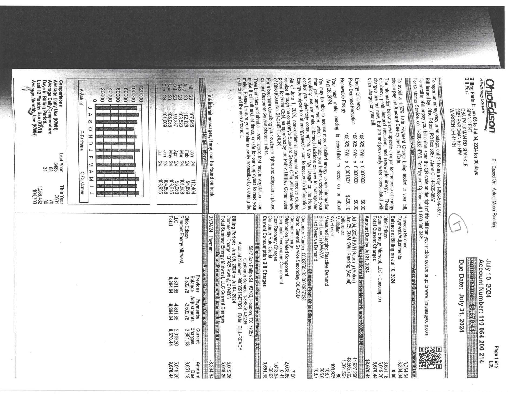

The image is a photo of a utility bill from Ohio Edison. It includes a bar chart and various sections with text and numerical data.

- **Chart Type**: Bar chart
  - **Axis Titles**: 
    - Vertical: "Average Daily Use (KWH)"
    - Horizontal: "J A S O N D J F M A M J J"
  - **Data Points**: 
    - Bars represent monthly energy usage from July to June.
    - Values range from approximately 0 to 1,200 KWH.

- **Embedded Text**:
  - "Ohio Edison"
  - "Bill Based On: Actual Meter Reading"
  - "Account Number: 110 054 200 214"
  - "Due Date: July 31, 2024"
  - "Page 1 of 2"
  - "Amount Due: $160.24"
  - "Energy Efficiency Programs"
  - "Total Current Charges: $160.24"
  - "Billing Period: June 10, 2024 to July 10, 2024"
  - "Service Address: 5877 Sampler St, Warren, OH 44481"
  - "Customer Service: 1-800-633-4766"

- **Spatial Relationships**:
  - The bar chart is located on the left side of the bill.
  - The account and billing information are on the right side.
  - The due date and amount due are prominently displayed near the top right.

The document is structured with clear sections for billing details, usage summary, and contact information.

