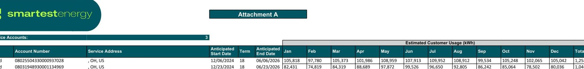

# SALES AGREEMENT 

Ohio

| Customer Name: Sparkle Market South |  |  |  |
| :--: | :--: | :--: | :--: |
| Mailing Address:   4121 South Ave   Youngstown, OH 44512   United States |  | Billing Address (if different): |  |
| Contact Name: Tony M |  | Phone:(330) 502-8101 |  |
| Fax: |  | Email:tonymo56@yahoo.com |  |
| Check Only if Voluntary REC's are requested | $\square$ Voluntary Renewable Energy Product:NA | Check Only if Customer is Tax Exempt | $\square$ Failure to attach will result in Customer being charged tax until a completed form is on file and accepted by the EDC. Customer will also be responsible to arrange for any tax refunds directly with the state taxing authority. |
| EDC/Electric Distribution Company: See Attachment A |  | EDC Account Number(s) and approximate Start Date(s): See Attachment A |  |

| CUSTOMER DISCLOSURE STATEMENT |  |
| :--: | :--: |
| Price | [Fixed Price of $\$ 0.06834 / \mathrm{kWh}$ ] |
| Bill Type | Consolidated Bill |
| How Price is Determined | The Fixed Price includes the components as described in the table below. The Fixed Price does not include any applicable taxes (other than the gross-receipts tax, if applicable), which shall be passed-through to the customer. Components listed as "pass through" in the table below shall be billed using market-based prices or estimates thereof. |
| COMPONENT | Treatment |
| Energy | Fixed |
| Unforced Capacity | Fixed |
| Ancillary Services | Fixed |
| Transmission (NITS, TECs) | N/A |
| Clean Energy - Mandatory RECs (Certified RECs) | Fixed |
| Auction Revenue Rights Credits | Fixed |
| Renewable Energy - voluntary | Not Selected |

Please be aware that SmartestEnergy US LLC reserves the right to pass through costs/credits in accordance with Section 20 - Regulatory or Other Changes.

Upon mutual agreement, Customer has the ability to blend the current rate with a future rate as part of an Agreement extension throughout the term of this Agreement.

PJM has suspended its Unforced Capacity auction for the delivery period beginning June 2025, creating material uncertainty in PJM's capacity price and auction rules from that point forward. Once PJM finalizes these charges, SmartestEnergy US LLC reserves the right to pass through its actual unforced capacity costs/credits beginning June 2025. If its costs change, SmartestEnergy US LLC will have the right to change the prices for components listed in the table above, except for the "Energy" component, beginning 36 months from the execution date of this Agreement.
Start Date and
Supply shall start from first meter read date after the EDC processes your enrollment with SmartestEnergy US LLC (the "Start Date"), which is expected to be during the month of December 2024.
Expiration Date
SmartestEnergy US LLC shall not be held responsible for any delays in the Start Date caused by the actions or

|  | inactions of the EDC. SmartestEnergy US LLC shall not be held responsible for any delays in the Start Date caused by the actions or inactions of the EDC. |
| :--: | :--: |
| Term | This Agreement will begin upon the date the parties executed this Agreement (the "Execution Date"). The Term shall be for a period of 18 months from the Start Date ("Term"). After the end of the Term, this Agreement will automatically renew and continue at a variable rate methodology unless and until this Agreement is terminated by either party as provided in Section 5 - Term, Renewal, Charges and Fees, and Termination. |
| Process Customer May   Use to Rescind Agreement Without Penalty | For Residential and Small Commercial Customers Only: Customer may terminate this Agreement within seven (7) calendar days following the postmark date on the confirmation notice from the EDC by following the instructions on the confirmation notice. Customer may also contact SmartestEnergy US LLC. |
| Amount of Early Termination Fee and Method of Calculation | ETF shall equal the projected amount of electricity to be consumed by customer for the remainder of the Term multiplied by the difference between the contract price in effect for the remainder of the Term and the price at which SmartestEnergy US LLC can sell such electricity following the termination, or $\$ 500$ per non-residential account, whichever is greater.   The projected amount of electricity to be consumed by Customer for the remainder of the Term multiplied by the difference between the contract price in effect for the remainder of the Term and the price at which SmartestEnergy US LLC can sell such electricity following the termination, or $\$ 500$ per account, whichever is greater.   For all residential customers, however, the early termination fee will be no greater than $\$ 100.00$ if there is less than 12 months left of the Term and $\$ 200.00$ if there is 12 months or more left of the Term. See Section 5.c - Early Termination Fees.   For Non-Residential Customers only, Agreement pricing is based on the energy consumption used in the prior year. A deviation of 100\% or more could result in additional fees. See Section 9 - Material Customer Usage Deviation. |
| Amount of Late Payment | If SmartestEnergy US LLC manages billing, Customer shall pay 1.5\%, or the highest percentage or amount allowable by law, per month on overdue balances. If the EDC manages billing, Customer shall be responsible to pay any late fees charged by the EDC on overdue balances. |
| Credit Support | If this Agreement requires Customer to provide a cash deposit, letter of credit, or prepayment, the amounts and due dates of such instrument(s) shall be detailed on Attachment B. If a deposit or prepayment is required, Customer's signature on Attachment B will indicate its authorization for SmartestEnergy US LLC to access the required funds via ACH debit payment. Any cash deposit or prepayment shall also be governed by the terms of Paragraph 23. |
| Renewal | After the end of the Initial Term, this Agreement will automatically continue at a variable rate methodology unless and until this Agreement is terminated by either party.   Residential and Small Commercial Customers only: Prior to the expiration of the Term, you will receive a written notification that will explain your options going forward. The notification will be provided not less than 45 days and no more than 90 days prior to the expiration of the Term in which SmartestEnergy US LLC will notify Customer in writing of the pending contract expiration and switch upon automatic renewal to the variable rate methodology at which SmartestEnergy US LLC will continue to serve Customer. If SmartestEnergy US LLC does not receive notice from Customer, this Agreement will automatically renew and continue in full force and effect until canceled by Customer. See Section 5 -Term, Renewal, Charges and Fees, and Termination. |
| Guaranteed Savings | There are no guaranteed savings from the EDC rate and your rate may be higher than the EDC rate. |
| Self Assessing Mercantile Customers | Pursuant to Public Utility Commission of Ohio order dated 11/21/19 in docket 19-2031-EL-UNC, effective January 1, 2020mercantile customers that are registered as self-assessing purchasers under R.C. 5727.81(C)are exempt from state- mandated renewable energy charges. SmartestEnergy US LLC's charges will include these costs unless mercantile customer provides evidence of such registration. |
| EDC | See Attachment A |

By entering into this Agreement, Customer agrees to the terms above (and those in the attached General Terms and Conditions, in particular, the specific Customer Acknowledgements) and authorizes SmartestEnergy US LLC to act as Customer's agent in dealing with the EDC. If there is any discrepancy between the terms in this "Customer Disclosure Statement" and the ones in General Terms and Conditions, the terms in "Customer Disclosure Statement" shall prevail.

| SmartestEnergy US LLC | CUSTOMER |  |
| :-- | :-- | :-- |
| Printed Name: | Printed Name: Anthony Modarelli |  |
| Signature: | Signature: Anthony C Modarelli |  |
| Title: | Title President |  |
| Date: | Date | $11 / 15 / 2024$ |

SmartestEnergy US LLC
Printed Name
Signature:

Title:
Date:

V.1.2 06.26.2024

1. Definitions.

Commodity - The electricity sold on a volume basis, measured in kilowatt-hours (kWh).
Customer - The individual or company listed on the Sales Agreement cover sheet.
EDC - The electric distribution company(ies) that delivers the electricity to Customer's premises,
Generation Charge - Charge for production of electricity.
PUCO - Public Utilities Commission of Ohio.
Residential Customer - a customer of competitive retail electric service for residential purposes.
Small Commercial Customer - an entity that is not a mercantile customer, namely, not a commercial or industrial customer who consumes electricity for nonresidential use and consumes more than 700,000 kWh per year or is part of a national account involving multiple facilities in one or more states.
Transmission Charge - Charge for moving high voltage electricity from a generation facility to the distribution lines of an electric distribution company.
2. Agreement to Sell and Purchase Energy. The General Terms and Conditions, along with any enrollment form, Customer disclosure statement, and applicable attachments, constitute the agreement between SmartestEnergy US LLC ("SEUS," the "Company," "Seller," "we," or "us"), an independent energy services company, and you ("Customer," "you," or "your") under which Customer authorizes SEUS to initiate electricity supply service and enroll Customer with SEUS (the "Agreement"). Subject to the terms and conditions of this Agreement, SEUS agrees to sell and Customer agrees to purchase and accept all the electricity required to serve Customer's electricity account(s) listed on Attachment A ("Purchase Quantities"). SEUS does not guarantee savings under this Agreement. Customer's electric distribution utility(ies) (the "EDC") will continue to deliver the electricity supplied by SEUS and will be available to respond to outages and/or other emergencies. SEUS is not affiliated with and does not represent Customer's EDC.
3. Information - Release and Authorization. Customer authorizes SEUS to obtain and review information regarding Customer's credit history from credit reporting agencies and information from Customer's EDC, which shall include, but not be limited to the following: consumption history; billing determinants; account numbers; credit information; data applicable to cold weather periods; tax status; and eligibility for economic development or other incentives (collectively, "Customer Information"). This information may be used by SEUS to determine whether it will commence and/or continue to provide energy supply service to Customer and will not be disclosed to a third party unless required by law, required by court order, or with Customer's separate written consent. Customer's execution of this Agreement shall constitute authorization for the release of this information to SEUS. SEUS reserves the right to refuse to provide service to Customer under this Agreement and cancel this Agreement if it is unable to obtain the necessary Customer Information or it obtains Customer Information that it considers unsatisfactory. Customer's authorization for the Customer Information will remain in effect during any initial or renewal term of this

Agreement; provided, however, that Customer may rescind this authorization at any time by providing written notice to SEUS or by calling SEUS toll-free at 1-800-448-0995. SEUS reserves the right to cancel this Agreement in the event Customer rescinds such authorization. The data obtained pursuant to this authorization will be retained by SEUS for a period of four years post-termination of this Agreement and may be used by SEUS in connection with any ongoing business or legal purpose with respect to its obligations under the Agreement, or to offer additional products or services to Customer during the Term.
4. Customer Acknowledgements. CUSTOMER ACKNOWLEDGES THE FOLLOWING: THAT ANY SALES REPRESENTATIVE WITH WHOM CUSTOMER HAS SPOKEN REPRESENTS SEUS, AND IS NOT FROM THE EDC; THAT YOU ARE THE CUSTOMER WHOSE NAME IS ON THE ELECTRICITY ACCOUNT, THE SPOUSE OF THE ACCOUNT HOLDER, OR OVER 18 AND AUTHORIZED TO MAKE DECISIONS CONCERNING THE ACCOUNT; THAT YOUR EDC WILL CONTINUE TO DELIVER YOUR ELECTRICITY AND PROVIDE YOU WITH YOUR ELECTRICITY BILL UNLESS OTHERWISE AGREED TO IN WRITING; THAT YOU HAVE RECEIVED A COPY OF SEUS'S AGREEMENT (TERMS AND CONDITIONS, ENROLLMENT FORM, THE CUSTOMER DISCLOSURE STATEMENT AND ANY APPLICABLE ATTACHMENTS); AND THAT YOU WERE INFORMED THAT THE EDC MAY DISCONNECT YOUR SERVICE AS A RESULT OF ANY FAILURE TO PAY SEUS'S CHARGES.
5. Term, Renewal, Charges and Fees, and Termination.
a. All Products Except Variable. This Agreement will begin upon the date the parties executed this Agreement (the "Execution Date"). It will continue for the period set forth in the Customer Disclosure Statement (the "Term") from the first meter read date after the EDC processes the Customer's enrollment with SEUS (the "Start Date"). SEUS shall not be held responsible for any delays in the Start Date caused by the actions or inactions of the EDC in processing the Customer's enrollment with SEUS.After the end of the Term, this Agreement will automatically continue on a month-tomonth basis at a variable rate methodology unless and until this Agreement is terminated by either party. For Residential and Small Commercial Customers only: As detailed in the Customer Disclosure Statement, not less than 45 days and no more than 90 days prior to the expiration of the Term, SEUS will notify Customer in writing of the pending contract expiration and switch upon automatic renewal to the variable rate methodology at which SEUS will continue to serve Customer. If SEUS does not receive notice from Customer, this Agreement will automatically renew and continue in full force and effect until canceled by Customer. SEUS can renew this Agreement without Customer's affirmative consent, including when there is a change in the rate or other terms and conditions.
i. Variable Rate Methodology: After the Term, the rate for electricity will be a variable rate that may be higher or lower each month and will be set in SEUS's

sole discretion. SEUS considers the following factors when setting variable rates:

- publicly available competitor pricing;
- strategic business objectives;
- customer retention or attrition;
- market volatility or uncertainty;
- anticipated customer usage;
- the cost of procuring power including wholesale prices, ancillary service costs, capacity auctions, utility fees, transmission and distribution losses, and storage costs;
- weather, supply congestion, and infrastructure issues;
- legal or regulatory issues; and
- profit margin.

SEUS may amortize sudden cost increases over multiple billing cycles so that its customers do not bear the burden of such increases in a single month. The variable rate may not correlate with changes in wholesale market prices or your EDC's rates. In addition, the variable rate may be higher than your EDC rate or other suppliers' rates. For Residential and Small Business customers only: Your rate for the first month under a variable rate methodology will be set forth in the second notice sent by SEUS as set forth in the Customer Disclosure Statement. You may obtain the average monthly rates for the previous twenty four (24) months for SEUS's customers in your EDC's service territory who received service on a variable rate ("Historical Rates") by contacting SEUS. Please note that Historical Rates are not indicative of current or future rates.
b. Variable Service. This Agreement will begin on the date the parties executed this Agreement (the "Execution Date") and will continue unless and until this Agreement is terminated by either party. SEUS will begin supplying electricity to Customer on the first meter read date after the EDC processes the Customer's enrollment with SEUS (the "Start Date"). SEUS shall not be held responsible for any delays in the Start Date caused by the actions or inactions of the EDC in processing the Customer's enrollment with SEUS.
c. Early Termination Fees. ETF shall equal the projected amount of electricity to be consumed by customer for the remainder of the Term multiplied by the difference between the contract price in effect for the remainder of the Term and the price at which SmartestEnergy US LLC can sell such electricity following the termination, or $\$ 500$ per non-residential account, whichever is greater. There are no early termination fees for Variable Service customers. For all other products, the early termination fee, if applicable, shall be the projected amount of electricity to be consumed by Customer for the remainder of the Term, multiplied by the difference between the contract price in effect for the remainder of the Term and the price at which SEUS can sell such electricity following the termination, or $\$ 500$ per
account, whichever is greater. For all residential customers, however, the early termination fee will be no greater than $\$ 100.00$ if there is less than 12 months left of the Term and $\$ 200.00$ if there is 12 months or more left of the Term. SEUS may terminate this agreement early for Customer fails to, i.) pay invoices timely ii.) provide performance assurance when requested, as provided in Sections 7 and 22, iii.) provide the notifications of behind the meter generation, net metering transactions or a state power allocation as required in Section 9, or iv.) provide credit support (if applicable) when due as specified in Attachment B or Section 23. If either Party terminates this Agreement early, then Customer shall owe an Early Termination Fee.
d. Other SEUS Charges and Switching Fee. Except to the extent identified in this Agreement, SEUS will not impose other recurring or nonrecurring charges. When applicable, the EDC may charge a switching fee to Customer.
e. EDC Charges Customer will incur delivery charges and other service charges from the EDC for its services.
6. Price. The Price for all electricity under this Agreement shall be calculated as described in the Customer Disclosure Statement. For each billing cycle, the Price shall be applied to the Customer's metered usage for such billing cycle (as reported by the EDC).
7. Renewable Energy Products. This paragraph applies if Customer has chosen to receive a voluntary renewable energy product, as outlined in the Customer Disclosure Label. This product bundles electricity with Renewable Energy Certificates ("RECs") in an amount designed to match the Customer's usage. A REC represents the environmental benefits of 1 megawatt hour (MWh) of renewable energy that can be paired with electricity. This product is Green-e ${ }^{\circledR}$ Energy certified and meets the environmental and consumer-protection standards set forth by the nonprofit Center for Resource Solutions. Learn more at www.green-e.org. Election of this product supports the development of renewable resources, but Customer understands and acknowledges that Customer may not actually be supplied with renewable energy.
8. Billing and Payment. At SEUS's option, Customer may receive a single bill each month for both commodity and delivery costs from either SEUS or the EDC ("Consolidated Bill"), or the EDC and SEUS may each invoice Customer separately ("Dual Bill") each month. SEUS will have the right to change the bill type one time during the term of this Agreement. Customer will pay SEUS for electric supply service based on meter readings and consumption information measured by and/or received from Customer's EDC ("Billing Quantity"). For invoices received from SEUS, Customer will pay each invoice in full within 20 days of the invoice date or be subject to a late payment charge of $1.5 \%$, or the highest percentage or amount allowable by law, per month. For invoices received from the EDC, Customer will pay each invoice in full as required by EDC's tariff, or be subject to a late payment charge or disconnection in accordance with the EDC's tariff. If Customer fails to pay either any EDC invoice or any SEUS invoice when due or fails to meet any agreed-upon payment arrangements, then, in addition to any other remedies that it may have, SEUS may terminate this Agreement upon 15 calendar days' written notice to Customer. A $\$ 35$ fee will be charged for all returned payments.

If any payments made by you directly to us are rejected two (2) times in a one-year period, the only form of payment acceptable thereafter will be a certified check, money order, or electronic funds transfer. If you make a payment for a lesser amount, which includes a statement or letter indicating that the lesser payment constitutes full payment, we may accept such payment without prejudice to any other rights or remedies that we may have against you and we may apply it to your account(s) as a partial payment. Customer has the right to request from SEUS, twice within a 12-month period, up to 24 months of the Customer's payment history without charge.
9. Customer Usage Deviation and Behind the Meter Generation. For all customers except residential: If Customer's metered usage during any billing period exceeds, or falls below, its historic usage during a like billing period by $100 \%$ or more, and such variation results in SEUS incurring additional charges, Customer will be responsible for the payment of such additional charges. Customer agrees to inform SEUS of any existing self-generation unit(s), any net metering transactions or any state power allocations associated with the Customer accounts included in this Agreement prior to execution of this Agreement. If Customer fails to provide such notification, SEUS may change the Customer's price or terminate this Agreement. Subsequent to the execution of this Agreement, Customer agrees to promptly provide SEUS with advanced written notice once Customer decides to implement any of the following: (i) changes its use of selfgeneration unit(s), (ii) installation of additional self-generation unit(s); or (iii) addition or amendment of a net metering transaction or state power allocation. Notwithstanding the foregoing, Customer shall reimburse SEUS for any costs incurred by SEUS as a result of Customer making any of the changes identified in this paragraph or increases in Customer's capacity or transmission tag due to reduced customer generation output during a tag setting period. . For the avoidance of doubt, consumption bandwidth thresholds established above shall not apply in a manner that would duplicate Customer's cost reimbursement obligations when calculating costs pursuant to this section.
10. Delivery Point, Title, and Taxes. All electricity sold pursuant to this Agreement shall be delivered to a location ("Delivery Point"), which shall constitute the point at which the sale occurs and title to the energy passes to you from us. Customer will be liable for and pay all taxes or surcharges, which are imposed with respect to the sale of electricity after its delivery to the Delivery Point. If Customer is exempt from such taxes, Customer is responsible for identifying and requesting any exemption from the collection of the taxes by providing appropriate documentation to SEUS.
11. Emergency Services. The EDC will continue to respond to emergencies. In the event of an electricity emergency or service interruption, contact your EDC at one of the telephone numbers listed below. You should also contact your local emergency personnel. Duke Energy Ohio (866) 216-2136, Dayton Power \& Light (800) 253-5801 for business customers (or (800) 433-8500 for residential customers), Ohio Edison (800) 633-4766, Cleveland Electric Illuminating (800) 589-3101, Toledo Edison (800) 4473333, AEP Ohio Power (888) 710-4237 for business customers (or (800) 672-2231 for residential customers).
12. Return to the EDC. If Customer cancels service under this Agreement and returns to the EDC for commodity supply service, Customer may or may not be served under the same rates, terms, and conditions that apply to other customers served by the EDC. Customer acknowledges that in the event of a cancellation or termination of this Agreement, it may take several billing cycles for Customer to return to the EDC for commodity supply service. Customer remains liable for all SEUS charges until Customer's switch to the EDC or another supplier is effective. A final bill will be rendered within 45 days after the final scheduled meter reading by the EDC or if access is unavailable, an estimate of usage will be used in lieu of the final bill, which will be trued-up when the final meter reading is provided.
13. SEUS Contact Information and Dispute Resolution. Customer may contact SEUS with any questions regarding the terms of service by phone at 18004480995 (toll free), Monday through Friday between the hours of 9:00 A.M. to 5:00 P.M. EST (such hours subject to change), by email at Customer-ServicesUS@smartestenergy.com, or by mail to One Lincoln Centre, 110 West Fayette Street, Suite 400, Syracuse, NY 13202. If your complaint is not resolved after you have called your electric supplier (SEUS) and/or your EDC, or for general utility information, residential and business customers may contact the public utilities commission of Ohio (PUCO) for assistance at 1-800-686-7826 (toll free) from 8:00 A.M. to 5:00 P.M. weekdays, or at http://www.puco.ohio.gov. Hearing or speech impaired customers may contact the PUCO via 7-1-1 (Ohio relay service). The Ohio consumers' counsel (OCC) represents residential utility customers in matters before the PUCO. The OCC can be contacted at 1-877-742-5622 (toll free) from 8:00 A.M. to 5:00 P.M. weekdays, or at http://www.pickocc.org.
14. Ohio Disclosures. For Residential and Small Commercial Customers only:

- Once Customer has enrolled with SEUS, Customer will receive a confirmation notice from Customer's EDC. Customer has the right to rescind Customer's enrollment without penalty within seven calendar days following the postmark date on the confirmation notice by contacting the Customer's EDC and following the instructions in the confirmation notice. Customer's right to rescind applies only when Customer initially enrolls with SEUS, not upon any renewal of this Agreement.
- SEUS may not disclose Customer's social security number and/or electric account number(s) without Customer's consent, except for SEUS' own collections and credit reporting, participation in programs funded by the universal service fund pursuant to Section 4928.52 of the Revised Code, or assigning Customer's contact to another supplier.
- SEUS does not offer, at this time, budget billing for its services under this Agreement.
- SEUS may lower the price per kilowatt-hour charged to Customer, due to a change in market conditions, without Customer's consent so long as there are no other changes to the terms and conditions of this Agreement.
- SEUS' environmental disclosure statement is available for viewing on our website: www.smartestenergy.com.
- Customer has the right to terminate this Agreement without penalty if Customer moves outside of SEUS' service area or into an area where SEUS charges a different price.

- Customer has the right to terminate this Agreement without penalty in the event of a change in governing law or regulation that physically prevents or legally prohibits SEUS from performing under the terms of this Agreement.

15. Indemnification and No Warranties. Customer assumes full responsibility for electricity delivered to Customer at the Delivery Point(s) and on Customer's side of the Delivery Point(s), and agrees to and shall indemnify, defend, and hold harmless SEUS and its personnel from and against claims, losses, expenses, damages, demand, judgements, causes of action and lawsuits, including claims for personal injury, death or damages to property occurring at the Delivery Point or on Customer's side of the Delivery Point(s) and upon the premises, arising out of or related to the electricity and/or Customer's performance under this Agreement. Unless otherwise expressly set forth in this Agreement, SEUS provides and Customer receives no warranties, express or implied, statutory, or otherwise and SEUS specifically disclaims any warranty of merchantability or fitness for a particular purpose.
16. Limitation of Liability. TO THE FULLEST EXTENT PERMITTED BY APPLICABLE OHIO LAW, NEITHER YOU NOR SEUS WILL BE LIABLE TO THE OTHER FOR ANY CONSEQUENTIAL, EXEMPLARY, PUNITIVE, INCIDENTAL, OR INDIRECT DAMAGES ARISING FROM ANY CLAIM OR LEGAL PROCEEDING BETWEEN YOU AND SEUS, INCLUDING, WITHOUT LIMITATION, LOST PROFITS OR LOST REVENUES. THE REMEDY FOR ANY CLAIM OR SUIT AGAINST SEUS WILL BE LIMITED TO DIRECT ACTUAL DAMAGES, WHICH SHALL NOT EXCEED THE AMOUNT OF CUSTOMER'S SINGLE LARGEST MONTHLY INVOICE DURING THE PRECEDING 12 MONTHS. CUSTOMER SHALL NOT PURSUE OR RECOVER ANY ADDITIONAL DAMAGES OR AMOUNTS FROM SEUS, AND HEREBY WAIVES ALL OTHER REMEDIES IN LAW OR EQUITY. THESE LIMITATIONS APPLY WITHOUT REGARD TO THE CAUSE OF ANY LIABILITY OR DAMAGES. CUSTOMER AND SEUS ACKNOWLEDGE THAT THERE ARE NO THIRD-PARTY BENEFICIARIES TO THIS AGREEMENT. IN THE EVENT CUSTOMER FAILS TO REPORT A DISPUTE WITHIN THIRTY (30) DAYS OF THE DISPUTED OCCURRENCE, CUSTOMER WAIVES ANY AND ALL RIGHTS TO ASSERT THE DISPUTE. THIS THIRTY (30) DAY REQUIREMENT SHALL TAKE PRIORITY OVER ALL OTHER PROVISIONS OF THIS AGREEMENT.
17. Disputes, Waiver of Jury Trial, and Participation in Class Actions. ANY COMPLAINT, CLAIM, OR DISPUTE BETWEEN SEUS AND CUSTOMER, WHETHER ARISING IN ANY CONTRACT, STATUTE, REGULATION, TORT, OR OTHERWISE, SHALL, AS THE SOLE AND EXCLUSIVE REMEDY OF SEUS AND CUSTOMER, BE BROUGHT ONLY IN A COURT OF THE STATE OF OHIO SITTING IN FRANKLIN COUNTY, OHIO OR THE UNITED STATES DISTRICT COURT SITTING IN FRANKLIN COUNTY, OHIO, OR IF APPROPRIATE, THE PUBLIC UTILITIES COMMISSION OF OHIO. SEUS AND CUSTOMER SHALL NOT BE PERMITTED TO JOIN OR CONSOLIDATE COMPLAINTS, CLAIMS, OR DISPUTES INVOLVING OTHERS, NOR SHALL ANY COMPLAINTS, CLAIMS, OR DISPUTES BE BROUGHT OR MAINTAINED AS A CLASS ACTION OR IN ANY REPRESENTATIVE CAPACITY. CUSTOMER UNDERSTANDS AND AGREES THAT IT IS KNOWINGLY, VOLUNTARILY, AND WILLINGLY WAIVING THE RIGHT TO PARTICIPATE IN OR BE REPRESENTED IN ANY CLASS ACTION. CUSTOMER UNDERSTANDS AND AGREES TO WAIVE

THE RIGHT TO A TRIAL BY JURY BEFORE ANY COURT HAVING JURISDICTION OVER THIS AGREEMENT.
18. Force Majeure. In the event that either party is rendered unable, wholly or in part, to perform that party's obligations under this Agreement due to events not reasonably anticipated or within either party's control, such as, but not limited to, acts of God, severe weather events, curtailment by Customer's EDC, etc., the Parties agree that such non-performance shall be excused for the duration of the event which caused it. Should the parties have cause to claim force majeure, the claiming party will notify the other party, in writing, of the cause(s) of such event, the anticipated duration of non-performance and the remedies being taken to eliminate the cause. Financial obligations relating to payment for or delivery of electricity under this Agreement cannot be cause for claiming force majeure and obligations cannot be excused as a result of a force majeure event.
19. Applicable/Governing Law. This Agreement is governed by the laws of the State of Ohio without giving effect to any conflict of law principals that otherwise might apply. This Agreement is subject to present and future legislation, orders, rules, regulations, or decisions of a duly constituted governmental authority having jurisdiction over this Agreement or the services to be provided hereunder.
20. Regulatory or Other Changes. SEUS and Customer recognize that a change in any law, rule, regulation, or tariff that results in a change in a cost or requirement applicable to SEUS (each, a "Regulatory Change") could materially impact a term or provision of this Agreement including, but not limited to price. Accordingly, SEUS retains the right to modify this Agreement, including Customer's price, as a result of a Regulatory Change. SEUS shall provide 30 days' prior written notice to Customer of any modification to this Agreement resulting from a Regulatory Change. For the avoidance of doubt, a change in a Network Integration Transmission Service ("NITS"), transmission Enhancement Charge ("TEC") or TEC credit rate shall be considered a Regulatory Change for purposes of Section 20 and SEUS shall change the Customer's contract price to reflect the increased or decreased costs. A change in the Customer's NITS tag shall not be considered a Regulatory Change unless there is a rule change that amends the way such tags are determined.
21. Assignment. You may not assign this Agreement, in whole or in part, or any of your rights or obligations without SEUS's prior written consent. Upon 30 days' written notice to you, we may transfer, sell, pledge, encumber, or assign this Agreement or the accounts, revenues, or proceeds in connection with any financial or billing services agreement and transfer or assign this Agreement, in whole or in part, to an affiliate of SEUS, or any other approved competitive retail electric service supplier or other entity authorized by the PUCO without your consent. This Agreement shall be binding on each party's successors and legal assigns.
22. Performance Assurance. If SEUS has reasonable grounds to believe that Customer's creditworthiness or performance under this Agreement has become unsatisfactory, SEUS will provide Customer with written notice requesting performance assurance in an amount determined by SEUS in a commercially reasonable

manner. Upon receipt of such notice Customer shall have five (5) business days to remedy the situation by providing such performance assurance to SEUS. In the event that Customer fails to provide such performance assurance, or guaranty or other credit assurance acceptable to SEUS within five (5) business days of receipt of notice, then SEUS may terminate this Agreement.
23. Cash Deposits or Prepayments. If a cash deposit or prepayment applies, Customer grants to SEUS all of its' right, title and interest in the cash deposit or prepayment, free of liens or encumbrances. SEUS may, at any time, apply any part of, i.) the cash deposit to any past due amounts owed by Customer or ii.) the prepayment to any amounts owed by Customer. If SEUS makes any such application, it shall provide notice to Customer of any shortage and its intent to replenish the account via ACH debit payment. In the event that the ACH debit payment is unsuccessful, Customer shall have five (5) business days to restore such cash deposit or prepayment. SEUS shall return the cash deposit or prepayment once this Agreement has been terminated in accordance with its terms and all amounts owned by Customer have been paid.
24. Forward Contract. Customer agrees that this Agreement is a "forward contract" within the meaning of the U.S. Bankruptcy Code, as amended, and that SEUS is a "forward contract merchant" within the meaning of the U.S. Bankruptcy Code, as amended.
25. Severability. If any provision of this Agreement is held by a court or regulatory agency of competent jurisdiction to be invalid, void, or unenforceable, the remaining provisions shall continue in full force without being invalidated in any way.
26.

The image is a table extracted from a document, likely a report or spreadsheet, titled "Attachment A." It contains data related to service accounts from "smartestenergy."

- **Columns:**
  - "Account Number"
  - "Service Address"
  - "Anticipated Start Date"
  - "Term"
  - "Anticipated End Date"
  - "Estimated Customer Usage (kWh)" with monthly columns from "Jan" to "Dec" and a "Total" column.

- **Rows:**
  - The first row includes:
    - Account Number: "08025504330000937028"
    - Service Address: ", OH, US"
    - Anticipated Start Date: "12/06/2024"
    - Term: "18"
    - Anticipated End Date: "06/06/2026"
    - Monthly usage from Jan to Dec: "105,818", "97,780", "105,373", "101,986", "108,959", "107,913", "109,952", "108,912", "99,534", "105,248", "102,065", "105,042"
    - Total: "1,258,582"

  - The second row includes:
    - Account Number: "08031948930001134969"
    - Service Address: ", OH, US"
    - Anticipated Start Date: "12/23/2024"
    - Term: "18"
    - Anticipated End Date: "06/23/2026"
    - Monthly usage from Jan to Dec: "82,431", "74,819", "84,319", "88,689", "97,872", "99,526", "96,650", "92,805", "86,242", "85,064", "78,502", "80,036"
    - Total: "1,046,955"

The table provides a **yearly usage breakdown (monthly-based)** for estimated customer usage in kilowatt-hours (kWh).

