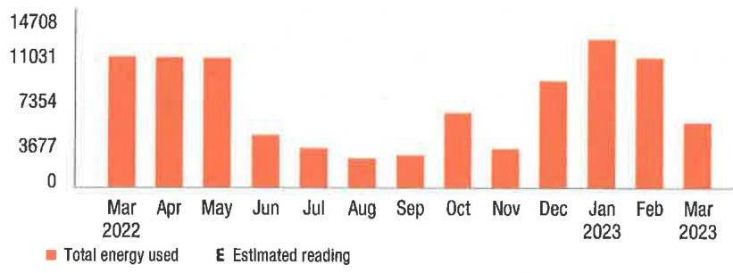
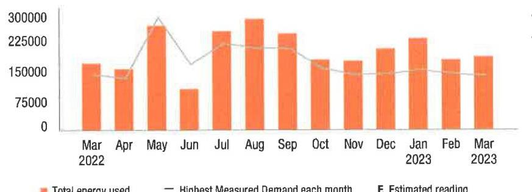

## (1) PSE\&G

We make things work for you.

## Your energy bill

## Message Center

Smell. Leave. Call. Know what to do if you smell gas. Natural gas has a distinctive odor that smells like rotten eggs. If you smell gas, leave the area immediately. Call 911 or PSE\&G at 800-880-PSEG (7734). Do not assume somebody else has already called. For more information, visit pseg.com/smeligas.

PSE\&G offers a variety of convenient payment options, now including PayPal ${ }^{\circledR}$ and Amazon Pay! To learn more, visit pseg.com/paymentoptions.

At PSE\&G, we make it our business to support your business. That's why we have a dedicated, toll-free phone number to address your energy questions and concerns. PSE\&G's Business Solutions Center is available Monday-Friday, 8:00 a.m. - 5:30 p.m. at 1-855-249-7734 (1-855-BIZ-PSEG).

## NEXT METER READING April 17, 2023

## How to contact us

## 1-855-BIZ-PSEG (249-7734)

Customer Service: 8am to 5:30pm Mon to Fri,
Closed on weekends and holidays
Emergencies / Outages / WorryFree Services: 24/7
TTY for the hearing impaired: 1-800-225-0072
Visit pseg.com/myaccount to access your account anytime
Text us. Register for MyAlerts by texting REG to 4PSEG(47734)
$>$ Text OUT to report an outage.
facebook.com/pseg
twitter.com/psegdelivers

## PSE\&G

This month's charges and credits
Gas charges - PSE\&G' for 1 meter
Ple Electric charges - PSE\&G for 1 meter
This month's charges and credits
Total amount due by Apr 4, 2023
\$2.510.39

Ple
Ple
Total amount due by Apr 4, 2023
\$25,430.03

## Amount enclosed

By checking this box, I authorize PSE\&G to initiate recurring ACH/Electronic Debits using the bank account number on the enclosed check.

By checking this box, I authorize PSE\&G to enroll me in paperless billing at this email address:

000493000000066

PISCATAWAY SUITES LLC
121 CENTENNIAL AVE
PISCATAWAY NJ 08854-8103

## SERVICE ADDRESS

121 CENTENNAL AVE
PISCATAWAY TWP NJ 08854-3907

## Your billing summary

Balance remaining from your last bill
PSE\&G balance from last bill
\$8,311.40
\$8,311.40
Balance remaining from your last bill
This month's charges and credits

The image is a photo of a section of a document, likely a bill or invoice. It contains handwritten and printed text. The printed text includes:

- "Invoice#"
- "Date: 3/20/23"
- "GL Code: 6702"
- "Amount: 22,919.64"
- "GL Code: 6703"
- "Amount: 2,510.39"
- "Department Manager:"
- "General Manager:"
- "Property Controller:"

There is a handwritten signature in the section labeled "Property Controller." The layout is structured with labels on the left and corresponding handwritten or printed information on the right.

Account number
Total amount due by Apr 4, 2023
\$25,430.03

## Amount enclosed

$\mathrm{m}^{1} / \mathrm{H}_{1} / \mathrm{H}_{1} / \mathrm{H}_{1} / \mathrm{H}_{1} / \mathrm{H}_{1} / \mathrm{H}_{1} / \mathrm{L}^{1} / \mathrm{H}_{1} / \mathrm{H}_{1} / \mathrm{H}_{1} / \mathrm{H}_{1} / \mathrm{H}_{1} / \mathrm{H}_{1} / \mathrm{H}_{1} / \mathrm{H}_{1} / \mathrm{H}_{1} / \mathrm{H}_{1} / \mathrm{H}_{1} / \mathrm{H}_{1} / \mathrm{H}_{1} / \mathrm{H}_{1} / \mathrm{H}_{1} / \mathrm{H}_{1} / \mathrm{H}_{1} / \mathrm{H}_{1} / \mathrm{H}_{1} / \mathrm{H}_{1} / \mathrm{H}_{1} / \mathrm{H}_{1} / \mathrm{H}_{1} / \mathrm{H}_{1} / \mathrm{H}_{1} / \mathrm{H}_{1} / \mathrm{H}_{1} / \mathrm{H}_{1} / \mathrm{H}_{1} / \mathrm{H}_{1} / \mathrm{H}_{1} / \mathrm{H}_{1} / \mathrm{H}_{1} / \mathrm{H}_{1} / \mathrm{H}_{1} / \mathrm{H}_{1} / \mathrm{H}_{1} / \mathrm{H}_{1} / \mathrm{H}_{1} / \mathrm{H}_{1} / \mathrm{H}_{1} / \mathrm{H}_{1} / \mathrm{H}_{1} / \mathrm{H}_{1} / \mathrm{H}_{1} / \mathrm{H}_{1} / \mathrm{H}_{1} / \mathrm{H}_{1} / \mathrm{H}_{1} / \mathrm{H}_{1} / \mathrm{H}_{1} / \mathrm{H}_{1} / \mathrm{H}_{1} / \mathrm{H}_{1} / \mathrm{H}_{1} / \mathrm{H}_{1} / \mathrm{H}_{1} / \mathrm{H}_{1} / \mathrm{H}_{1} / \mathrm{H}_{1} / \mathrm{H}_{1} / \mathrm{H}_{1} / \mathrm{H}_{1} / \mathrm{H}_{1} / \mathrm{H}_{1} / \mathrm{H}_{1} / \mathrm{H}_{1} / \mathrm{H}_{1} / \mathrm{H}_{1} / \mathrm{H}_{1} / \mathrm{H}_{1} / \mathrm{H}_{1} / \mathrm{H}_{1} / \mathrm{H}_{1} / \mathrm{H}_{1} / \mathrm{H}_{1} / \mathrm{H}_{1} / \mathrm{H}_{1} / \mathrm{H}_{1} / \mathrm{H}_{1} / \mathrm{H}_{1} / \mathrm{H}_{1} / \mathrm{H}_{1} / \mathrm{H}_{1} / \mathrm{H}_{1} / \mathrm{H}_{1} / \mathrm{H}_{1} / \mathrm{H}_{1} / \mathrm{H}_{1} / \mathrm{H}_{1} / \mathrm{H}_{1} / \mathrm{H}_{1} / \mathrm{H}_{1} / \mathrm{H}_{1} / \mathrm{H}_{1} / \mathrm{H}_{1} / \mathrm{H}_{1} / \mathrm{H}_{1} / \mathrm{H}_{1} / \mathrm{H}_{1} / \mathrm{H}_{1} / \mathrm{H}_{1} / \mathrm{H}_{1} / \mathrm{H}_{1} / \mathrm{H}_{1} / \mathrm{H}_{1} / \mathrm{H}_{1} / \mathrm{H}_{1} / \mathrm{H}_{1} / \mathrm{H}_{1} / \mathrm{H}_{1} / \mathrm{H}_{1} / \mathrm{H}_{1} / \mathrm{H}_{1} / \mathrm{H}_{1} / \mathrm{H}_{1} / \mathrm{H}_{1} / \mathrm{H}_{1} / \mathrm{H}_{1} / \mathrm{H}_{1} / \mathrm{H}_{1} / \mathrm{H}_{1} / \mathrm{H}_{1} / \mathrm{H}_{1} / \mathrm{H}_{1} / \mathrm{H}_{1} / \mathrm{H}_{1} / \mathrm{H}_{1} / \mathrm{H}_{1} / \mathrm{H}_{1} / \mathrm{H}_{1} / \mathrm{H}_{1} / \mathrm{H}_{1} / \mathrm{H}_{1} / \mathrm{H}_{1} / \mathrm{H}_{1} / \mathrm{H}_{1} / \mathrm{H}_{1} / \mathrm{H}_{1} / \mathrm{H}_{1} / \mathrm{H}_{1} / \mathrm{H}_{1} / \mathrm{H}_{1} / \mathrm{H}_{1} / \mathrm{H}_{1} / \mathrm{H}_{1} / \mathrm{H}_{1} / \mathrm{H}_{1} / \mathrm{H}_{1} / \mathrm{H}_{1} / \mathrm{H}_{1} / \mathrm{H}_{1} / \mathrm{H}_{1} / \mathrm{H}_{1} / \mathrm{H}_{1} / \mathrm{H}_{1} / \mathrm{H}_{1} / \mathrm{H}_{1} / \mathrm{H}_{1} / \mathrm{H}_{1} / \mathrm{H}_{1} / \mathrm{H}_{1} / \mathrm{H}_{1} / \mathrm{H}_{1} / \mathrm{H}_{1} / \mathrm{H}_{1} / \mathrm{H}_{1} / \mathrm{H}_{1} / \mathrm{H}_{1} / \mathrm{H}_{1} / \mathrm{H}_{1} / \mathrm{H}_{1} / \mathrm{H}_{1} / \mathrm{H}_{1} / \mathrm{H}_{1} / \mathrm{H}_{1} / \mathrm{H}_{1} / \mathrm{H}_{1} / \mathrm{H}_{1} / \mathrm{H}_{1} / \mathrm{H}_{1} / \mathrm{H}_{1} / \mathrm{H}_{1} / \mathrm{H}_{1} / \mathrm{H}_{1} / \mathrm{H}_{1} / \mathrm{H}_{1} / \mathrm{H}_{1} / \mathrm{H}_{1} / \mathrm{H}_{1} / \mathrm{H}_{1} / \mathrm{H}_{1} / \mathrm{H}_{1} / \mathrm{H}_{1} / \mathrm{H}_{1} / \mathrm{H}_{1} / \mathrm{H}_{1} / \mathrm{H}_{1} / \mathrm{H}_{1} / \mathrm{H}_{1} / \mathrm{H}_{1} / \mathrm{H}_{1} / \mathrm{H}_{1} / \mathrm{H}_{1} / \mathrm{H}_{1} / \mathrm{H}_{1} / \mathrm{H}_{1} / \mathrm{H}_{1} / \mathrm{H}_{1} / \mathrm{H}_{1} / \mathrm{H}_{1} / \mathrm{H}_{1} / \mathrm{H}_{1} / \mathrm{H}_{1} / \mathrm{H}_{1} / \mathrm{H}_{1} / \mathrm{H}_{1} / \mathrm{H}_{1} / \mathrm{H}_{1} / \mathrm{H}_{1} / \mathrm{H}_{1} / \mathrm{H}_{1} / \mathrm{H}_{1} / \mathrm{H}_{1} / \mathrm{H}_{1} / \mathrm{H}_{1} / \mathrm{H}_{1} / \mathrm{H}_{1} / \mathrm{H}_{1} / \mathrm{H}_{1} / \mathrm{H}_{1} / \mathrm{H}_{1} / \mathrm{H}_{1} / \mathrm{H}_{1} / \mathrm{H}_{1} / \mathrm{H}_{1} / \mathrm{H}_{1} / \mathrm{H}_{1} / \mathrm{H}_{1} / \mathrm{H}_{1} / \mathrm{H}_{1} / \mathrm{H}_{1} / \mathrm{H}_{1} / \mathrm{H}_{1} / \mathrm{H}_{1} / \mathrm{H}_{1} / \mathrm{H}_{1} / \mathrm{H}_{1} / \mathrm{H}_{1} / \mathrm{H}_{1} / \mathrm{H}_{1} / \mathrm{H}_{1} / \mathrm{H}_{1} / \mathrm{H}_{1} / \mathrm{H}_{1} / \mathrm{H}_{1} / \mathrm{H}_{1} / \mathrm{H}_{1} / \mathrm{H}_{1} / \mathrm{H}_{1} / \mathrm{H}_{1} / \mathrm{H}_{1} / \mathrm{H}_{1} / \mathrm{H}_{1} / \mathrm{H}_{1} / \mathrm{H}_{1} / \mathrm{H}_{1} / \mathrm{H}_{1} / \mathrm{H}_{1} / \mathrm{H}_{1} / \mathrm{H}_{1} / \mathrm{H}_{1} / \mathrm{H}_{1} / \mathrm{H}_{1} / \mathrm{H}_{1} / \mathrm{H}_{1} / \mathrm{H}_{1} / \mathrm{H}_{1} / \mathrm{H}_{1} / \mathrm{H}_{1} / \mathrm{H}_{1} / \mathrm{H}_{1} / \mathrm{H}_{1} / \mathrm{H}_{1} / \mathrm{H}_{1} / \mathrm{H}_{1} / \mathrm{H}_{1} / \mathrm{H}_{1} / \mathrm{H}_{1} / \mathrm{H}_{1} / \mathrm{H}_{1} / \mathrm{H}_{1} / \mathrm{H}_{1} / \mathrm{H}_{1} / \mathrm{H}_{1} / \mathrm{H}_{1} / \mathrm{H}_{1} / \mathrm{H}_{1} / \mathrm{H}_{1} / \mathrm{H}_{1} / \mathrm{H}_{1} / \mathrm{H}_{1} / \mathrm{H}_{1} / \mathrm{H}_{1} / \mathrm{H}_{1} / \mathrm{H}_{1} / \mathrm{H}_{1} / \mathrm{H}_{1} / \mathrm{H}_{1} / \mathrm{H}_{1} / \mathrm{H}_{1} / \mathrm{H}_{1} / \mathrm{H}_{1} / \mathrm{H}_{1} / \mathrm{H}_{1} / \mathrm{H}_{1} / \mathrm{H}_{1} / \mathrm{H}_{1} / \mathrm{H}_{1} / \mathrm{H}_{1} / \mathrm{H}_{1} / \mathrm{H}_{1} / \mathrm{H}_{1} / \mathrm{H}_{1} / \mathrm{H}_{1} / \mathrm{H}_{1} / \mathrm{H}_{1} / \mathrm{H}_{1} / \mathrm{H}_{1} / \mathrm{H}_{1} / \mathrm{H}_{1} / \mathrm{H}_{1} / \mathrm{H}_{1} / \mathrm{H}_{1} / \mathrm{H}_{1} / \mathrm{H}_{1} / \mathrm{H}_{1} / \mathrm{H}_{1} / \mathrm{H}_{1} / \mathrm{H}_{1} / \mathrm{H}_{1} / \mathrm{H}_{1} / \mathrm{H}_{1} / \mathrm{H}_{1} / \mathrm{H}_{1} / \mathrm{H}_{1} / \mathrm{H}_{1} / \mathrm{H}_{1} / \mathrm{H}_{1} / \mathrm{H}_{1} / \mathrm{H}_{1} / \mathrm{H}_{1} / \mathrm{H}_{1} / \mathrm{H}_{1} / \mathrm{H}_{1} / \mathrm{H}_{1} / \mathrm{H}_{1} / \mathrm{H}_{1} / \mathrm{H}_{1} / \mathrm{H}_{1} / \mathrm{H}_{1} / \mathrm{H}_{1} / \mathrm{H}_{1} / \mathrm{H}_{1} / \mathrm{H}_{1} / \mathrm{H}_{1} / \mathrm{H}_{1} / \mathrm{H}_{1} / \mathrm{H}_{1} / \mathrm{H}_{1} / \mathrm{H}_{1} / \mathrm{H}_{1} / \mathrm{H}_{1} / \mathrm{H}_{1} / \mathrm{H}_{1} / \mathrm{H}_{1} / \mathrm{H}_{1} / \mathrm{H}_{1} / \mathrm{H}_{1} / \mathrm{H}_{1} / \mathrm{H}_{1} / \mathrm{H}_{1} / \mathrm{H}_{1} / \mathrm{H}_{1} / \mathrm{H}_{1} / \mathrm{H}_{1} / \mathrm{H}_{1} / \mathrm{H}_{1} / \mathrm{H}_{1} / \mathrm{H}_{1} / \mathrm{H}_{1} / \mathrm{H}_{1} / \mathrm{H}_{1} / \mathrm{H}_{1} / \mathrm{H}_{1} / \mathrm{H}_{1} / \mathrm{H}_{1} / \mathrm{H}_{1} / \mathrm{H}_{1} / \mathrm{H}_{1} / \mathrm{H}_{1} / \mathrm{H}_{1} / \mathrm{H}_{1} / \mathrm{H}_{1} / \mathrm{H}_{1} / \mathrm{H}_{1} / \mathrm{H}_{1} / \mathrm{H}_{1} / \mathrm{H}_{1} / \mathrm{H}_{1} / \mathrm{H}_{1} / \mathrm{H}_{1} / \mathrm{H}_{1} / \mathrm{H}_{1} / \mathrm{H}_{1} / \mathrm{H}_{1} / \mathrm{H}_{1} / \mathrm{H}_{1} / \mathrm{H}_{1} / \mathrm{H}_{1} / \mathrm{H}_{1} / \mathrm{H}_{1} / \mathrm{H}_{1} / \mathrm{H}_{1} / \mathrm{H}_{1} / \mathrm{H}_{1} / \mathrm{H}_{1} / \mathrm{H}_{1} / \mathrm{H}_{1} / \mathrm{H}_{1} / \mathrm{H}_{1} / \mathrm{H}_{1} / \mathrm{H}_{1} / \mathrm{H}_{1} / \mathrm{H}_{1} / \mathrm{H}_{1} / \mathrm{H}_{1} / \mathrm{H}_{1} / \mathrm{H}_{1} / \mathrm{H}_{1} / \mathrm{H}_{1} / \mathrm{H}_{1} / \mathrm{H}_{1} / \mathrm{H}_{1} / \mathrm{H}_{1} / \mathrm{H}_{1} / \mathrm{H}_{1} / \mathrm{H}_{1} / \mathrm{H}_{1} / \mathrm{H}_{1} / \mathrm{H}_{1} / \mathrm{H}_{1} / \mathrm{H}_{1} / \mathrm{H}_{1} / \mathrm{H}_{1} / \mathrm{H}_{1} / \mathrm{H}_{1} / \mathrm{H}_{1} / \mathrm{H}_{1} / \mathrm{H}_{1} / \mathrm{H}_{1} / \mathrm{H}_{1} / \mathrm{H}_{1} / \mathrm{H}_{1} / \mathrm{H}_{1} / \mathrm{H}_{1} / \mathrm{H}_{1} / \mathrm{H}_{1} / \mathrm{H}_{1} / \mathrm{H}_{1} / \mathrm{H}_{1} / \mathrm{H}_{1} / \mathrm{H}_{1} / \mathrm{H}_{1} / \mathrm{H}_{1} / \mathrm{H}_{1} / \mathrm{H}_{1} / \mathrm{H}_{1} / \mathrm{H}_{1} / \mathrm{H}_{1} / \mathrm{H}_{1} / \mathrm{H}_{1} / \mathrm{H}_{1} / \mathrm{H}_{1} / \mathrm{H}_{1} / \mathrm{H}_{1} / \mathrm{H}_{1} / \mathrm{H}_{1} / \mathrm{H}_{1} / \mathrm{H}_{1} / \mathrm{H}_{1} / \mathrm{H}_{1} / \mathrm{H}_{1} / \mathrm{H}_{1} / \mathrm{H}_{1} / \mathrm{H}_{1} / \mathrm{H}_{1} / \mathrm{H}_{1} / \mathrm{H}_{1} / \mathrm{H}_{1} / \mathrm{H}_{1} / \mathrm{H}_{1} / \mathrm{H}_{1} / \mathrm{H}_{1} / \mathrm{H}_{1} / \mathrm{H}_{1} / \mathrm{H}_{1} / \mathrm{H}_{1} / \mathrm{H}_{1} / \mathrm{H}_{1} / \mathrm{H}_{1} / \mathrm{H}_{1} / \mathrm{H}_{1} / \mathrm{H}_{1} / \mathrm{H}_{1} / \mathrm{H}_{1} / \mathrm{H}_{1} / \mathrm{H}_{1} / \mathrm{H}_{1} / \mathrm{H}_{1} / \mathrm{H}_{1} / \mathrm{H}_{1} / \mathrm{H}_{1} / \mathrm{H}_{1} / \mathrm{H}_{1} / \mathrm{H}_{1} / \mathrm{H}_{1} / \mathrm{H}_{1} / \mathrm{H}_{1} / \mathrm{H}_{1} / \mathrm{H}_{1} / \mathrm{H}_{1} / \mathrm{H}_{1} / \mathrm{H}_{1} / \mathrm{H}_{1} / \mathrm{H}_{1} / \mathrm{H}_{1} / \mathrm{H}_{1} / \mathrm{H}_{1} / \mathrm{H}_{1} / \mathrm{H}_{1} / \mathrm{H}_{1} / \mathrm{H}_{1} / \mathrm{H}_{1} / \mathrm{H}_{1} / \mathrm{H}_{1} / \mathrm{H}_{1} / \mathrm{H}_{1} / \mathrm{H}_{1} / \mathrm{H}_{1} / \mathrm{H}_{1} / \mathrm{H}_{1} / \mathrm{H}_{1} / \mathrm{H}_{1} / \mathrm{H}_{1} / \mathrm{H}_{1} / \mathrm{H}_{1} / \mathrm{H}_{1} / \mathrm{H}_{1} / \mathrm{H}_{1} / \mathrm{H}_{1} / \mathrm{H}_{1} / \mathrm{H}_{1} / \mathrm{H}_{1} / \mathrm{H}_{1} / \mathrm{H}_{1} / \mathrm{H}_{1} / \mathrm{H}_{1} / \mathrm{H}_{1} / \mathrm{H}_{1} / \mathrm{H}_{1} / \mathrm{H}_{1} / \mathrm{H}_{1} / \mathrm{H}_{1} / \mathrm{H}_{1} / \mathrm{H}_{1} / \mathrm{H}_{1} / \mathrm{H}_{1} / \mathrm{H}_{1} / \mathrm{H}_{1} / \mathrm{H}_{1} / \mathrm{H}_{1} / \mathrm{H}_{1} / \mathrm{H}_{1} / \mathrm{H}_{1} / \mathrm{H}_{1} / \mathrm{H}_{1} / \mathrm{H}_{1} / \mathrm{H}_{1} / \mathrm{H}_{1} / \mathrm{H}_{1} / \mathrm{H}_{1} / \mathrm{H}_{1} / \mathrm{H}_{1} / \mathrm{H}_{1} / \mathrm{H}_{1} / \mathrm{H}_{1} / \mathrm{H}_{1} / \mathrm{H}_{1} / \mathrm{H}_{1} / \mathrm{H}_{1} / \mathrm{H}_{1} / \mathrm{H}_{1} / \mathrm{H}_{1} / \mathrm{H}_{1} / \mathrm{H}_{1} / \mathrm{H}_{1} / \mathrm{H}_{1} / \mathrm{H}_{1} / \mathrm{H}_{1} / \mathrm{H}_{1} / \mathrm{H}_{1} / \mathrm{H}_{1} / \mathrm{H}_{1} / \mathrm{H}_{1} / \mathrm{H}_{1} / \mathrm{H}_{1} / \mathrm{H}_{1} / \mathrm{H}_{1} / \mathrm{H}_{1} / \mathrm{H}_{1} / \mathrm{H}_{1} / \mathrm{H}_{1} / \mathrm{H}_{1} / \mathrm{H}_{1} / \mathrm{H}_{1} / \mathrm{H}_{1} / \mathrm{H}_{1} / \mathrm{H}_{1} / \mathrm{H}_{1} / \mathrm{H}_{1} / \mathrm{H}_{1} / \mathrm{H}_{1} / \mathrm{H}_{1} / \mathrm{H}_{1} / \mathrm{H}_{1} / \mathrm{H}_{1} / \mathrm{H}_{1} / \mathrm{H}_{1} / \mathrm{H}_{1} / \mathrm{H}_{1} / \mathrm{H}_{1} / \mathrm{H}_{1} / \mathrm{H}_{1} / \mathrm{H}_{1} / \mathrm{H}_{1} / \mathrm{H}_{1} / \mathrm{H}_{1} / \mathrm{H}_{1} / \mathrm{H}_{1} / \mathrm{H}_{1} / \mathrm{H}_{1} / \mathrm{H}_{1} / \mathrm{H}_{1} / \mathrm{H}_{1} / \mathrm{H}_{1} / \mathrm{H}_{1} / \mathrm{H}_{1} / \mathrm{H}_{1} / \mathrm{H}_{1} / \mathrm{H}_{1} / \mathrm{H}_{1} / \mathrm{H}_{1} / \mathrm{H}_{1} / \mathrm{H}_{1} / \mathrm{H}_{1} / \mathrm{H}_{1} / \mathrm{H}_{1} / \mathrm{H}_{1} / \mathrm{H}_{1} / \mathrm{H}_{1} / \mathrm{H}_{1} / \mathrm{H}_{1} / \mathrm{H}_{1} / \mathrm{H}_{1} / \mathrm{H}_{1} / \mathrm{H}_{1} / \mathrm{H}_{1} / \mathrm{H}_{1} / \mathrm{H}_{1} / \mathrm{H}_{1} / \mathrm{H}_{1} / \mathrm{H}_{1} / \mathrm{H}_{1} / \mathrm{H}_{1} / \mathrm{H}_{1} / \mathrm{H}_{1} / \mathrm{H}_{1} / \mathrm{H}_{1} / \mathrm{H}_{1} / \mathrm{H}_{1} / \mathrm{H}_{1} / \mathrm{H}_{1} / \mathrm{H}_{1} / \mathrm{H}_{1} / \mathrm{H}_{1} / \mathrm{H}_{1} / \mathrm{H}_{1} / \mathrm{H}_{1} / \mathrm{H}_{1} / \mathrm{H}_{1} / \mathrm{H}_{1} / \mathrm{H}_{1} / \mathrm{H}_{1} / \mathrm{H}_{1} / \mathrm{H}_{1} / \mathrm{H}_{1} / \mathrm{H}_{1} / \mathrm{H}_{1} / \mathrm{H}_{1} / \mathrm{H}_{1} / \mathrm{H}_{1} / \mathrm{H}_{1} / \mathrm{H}_{1} / \mathrm{H}_{1} / \mathrm{H}_{1} / \mathrm{H}_{1} / \mathrm{H}_{1} / \mathrm{H}_{1} / \mathrm{H}_{1} / \mathrm{H}_{1} / \mathrm{H}_{1} / \mathrm{H}_{1} / \mathrm{H}_{1} / \mathrm{H}_{1} / \mathrm{H}_{1} / \mathrm{H}_{1} / \mathrm{H}_{1} / \mathrm{H}_{1} / \mathrm{H}_{1} / \mathrm{H}_{1} / \mathrm{H}_{1} / \mathrm{H}_{1} / \mathrm{H}_{1} / \mathrm{H}_{1} / \mathrm{H}_{1} / \mathrm{H}_{1} / \mathrm{H}_{1} / \mathrm{H}_{1} / \mathrm{H}_{1} / \mathrm{H}_{1} / \mathrm{H}_{1} / \mathrm{H}_{1} / \mathrm{H}_{1} / \mathrm{H}_{1} / \mathrm{H}_{1} / \mathrm{H}_{1} / \mathrm{H}_{1} / \mathrm{H}_{1} / \mathrm{H}_{1} / \mathrm{H}_{1} / \mathrm{H}_{1} / \mathrm{H}_{1} / \mathrm{H}_{1} / \mathrm{H}_{1} / \mathrm{H}_{1} / \mathrm{H}_{1} / \mathrm{H}_{1} / \mathrm{H}_{1} / \mathrm{H}_{1} / \mathrm{H}_{1} / \mathrm{H}_{1} / \mathrm{H}_{1} / \mathrm{H}_{1} / \mathrm{H}_{1} / \mathrm{H}_{1} / \mathrm{H}_{1} / \mathrm{H}_{1} / \mathrm{H}_{1} / \mathrm{H}_{1} / \mathrm{H}_{1} / \mathrm{H}_{1} / \mathrm{H}_{1} / \mathrm{H}_{1} / \mathrm{H}_{1} / \mathrm{H}_{1} / \mathrm{H}_{1} / \mathrm{H}_{1} / \mathrm{H}_{1} / \mathrm{H}_{1} / \mathrm{H}_{1} / \mathrm{H}_{1} / \mathrm{H}_{1} / \mathrm{H}_{1} / \mathrm{H}_{1} / \mathrm{H}_{1} / \mathrm{H}_{1} / \mathrm{H}_{1} / \mathrm{H}_{1} / \mathrm{H}_{1} / \mathrm{H}_{1} / \mathrm{H}_{1} / \mathrm{H}_{1} / \mathrm{H}_{1} / \mathrm{H}_{1} / \mathrm{H}_{1} / \mathrm{H}_{1} / \mathrm{H}_{1} / \mathrm{H}_{1} / \mathrm{H}_{1} / \mathrm{H}_{1} / \mathrm{H}_{1} / \mathrm{H}_{1} / \mathrm{H}_{1} / \mathrm{H}_{1} / \mathrm{H}_{1} / \mathrm{H}_{1} / \mathrm{H}_{1} / \mathrm{H}_{1} / \mathrm{H}_{1} / \mathrm{H}_{1} / \mathrm{H}_{1} / \mathrm{H}_{1} / \mathrm{H}_{1} / \mathrm{H}_{1} / \mathrm{H}_{1} / \mathrm{H}_{1} / \mathrm{H}_{1} / \mathrm{H}_{1} / \mathrm{H}_{1} / \mathrm{H}_{1} / \mathrm{H}_{1} / \mathrm{H}_{1} / \mathrm{H}_{1} / \mathrm{H}_{1} / \mathrm{H}_{1} / \mathrm{H}_{1} / \mathrm{H}_{1} / \mathrm{H}_{1} / \mathrm{H}_{1} / \mathrm{H}_{1} / \mathrm{H}_{1} / \mathrm{H}_{1} / \mathrm{H}_{1} / \mathrm{H}_{1} / \mathrm{H}_{1} / \mathrm{H}_{1} / \mathrm{H}_{1} / \mathrm{H}_{1} / \mathrm{H}_{1} / \mathrm{H}_{1} / \mathrm{H}_{1} / \mathrm{H}_{1} / \mathrm{H}_{1} / \mathrm{H}_{1} / \mathrm{H}_{1} / \mathrm{H}_{1} / \mathrm{H}_{1} / \mathrm{H}_{1} / \mathrm{H}_{1} / \mathrm{H}_{1} / \mathrm{H}_{1} / \mathrm{H}_{1} / \mathrm{H}_{1} / \mathrm{H}_{1} / \mathrm{H}_{1} / \mathrm{H}_{1} / \mathrm{H}_{1} / \mathrm{H}_{1} / \mathrm{H}_{1} / \mathrm{H}_{1} / \mathrm{H}_{1} / \mathrm{H}_{1} / \mathrm{H}_{1} / \mathrm{H}_{1} / \mathrm{H}_{1} / \mathrm{H}_{1} / \mathrm{H}_{1} / \mathrm{H}_{1} / \mathrm{H}_{1} / \mathrm{H}_{1} / \mathrm{H}_{1} / \mathrm{H}_{1} / \mathrm{H}_{1} / \mathrm{H}_{1} / \mathrm{H}_{1} / \mathrm{H}_{1} / \mathrm{H}_{1} / \mathrm{H}_{1} / \mathrm{H}_{1} / \mathrm{H}_{1} / \mathrm{H}_{1} / \mathrm{H}_{1} / \mathrm{H}_{1} / \mathrm{H}_{1} / \mathrm{H}_{1} / \mathrm{H}_{1} / \mathrm{H}_{1} / \mathrm{H}_{1} / \mathrm{H}_{1} / \mathrm{H}_{1} / \mathrm{H}_{1} / \mathrm{H}_{1} / \mathrm{H}_{1} / \mathrm{H}_{1} / \mathrm{H}_{1} / \mathrm{H}_{1} / \mathrm{H}_{1} / \mathrm{H}_{1} / \mathrm{H}_{1} / \mathrm{H}_{1} / \mathrm{H}_{1} / \mathrm{H}_{1} / \mathrm{H}_{1} / \mathrm{H}_{1} / \mathrm{H}_{1} / \mathrm{H}_{1} / \mathrm{H}_{1} / \mathrm{H}_{1} / \mathrm{H}_{1} / \mathrm{H}_{1} / \mathrm{H}_{1} / \mathrm{H}_{1} / \mathrm{H}_{1} / \mathrm{H}_{1} / \mathrm{H}_{1} / \mathrm{H}_{1} / \mathrm{H}_{1} / \mathrm{H}_{1} / \mathrm{H}_{1} / \mathrm{H}_{1} / \mathrm{H}_{1} / \mathrm{H}_{1} / \mathrm{H}_{1} / \mathrm{H}_{1} / \mathrm{H}_{1} / \mathrm{H}_{1} / \mathrm{H}_{1} / \mathrm{H}_{1} / \mathrm{H}_{1} / \mathrm{H}_{1} / \mathrm{H}_{1} / \mathrm{H}_{1} / \mathrm{H}_{1} / \mathrm{H}_{1} / \mathrm{H}_{1} / \mathrm{H}_{1} / \mathrm{H}_{1} / \mathrm{H}_{1} / \mathrm{H}_{1} / \mathrm{H}_{1} / \mathrm{H}_{1} / \mathrm{H}_{1} / \mathrm{H}_{1} / \mathrm{H}_{1} / \mathrm{H}_{1} / \mathrm{H}_{1} / \mathrm{H}_{1} / \mathrm{H}_{1} / \mathrm{H}_{1} / \mathrm{H}_{1} / \mathrm{H}_{1} / \mathrm{H}_{1} / \mathrm{H}_{1} / \mathrm{H}_{1} / \mathrm{H}_{1} / \mathrm{H}_{1} / \mathrm{H}_{1} / \mathrm{H}_{1} / \mathrm{H}_{1} / \mathrm{H}_{1} / \mathrm{H}_{1} / \mathrm{H}_{1} / \mathrm{H}_{1} / \mathrm{H}_{1} / \mathrm{H}_{1} / \mathrm{H}_{1} / \mathrm{H}_{1} / \mathrm{H}_{1} / \mathrm{H}_{1} / \mathrm{H}_{1} / \mathrm{H}_{1} / \mathrm{H}_{1} / \mathrm{H}_{1} / \mathrm{H}_{1} / \mathrm{H}_{1} / \mathrm{H}_{1} / \mathrm{H}_{1} / \mathrm{H}_{1} / \mathrm{H}_{1} / \mathrm{H}_{1} / \mathrm{H}_{1} / \mathrm{H}_{1} / \mathrm{H}_{1} / \mathrm{H}_{1} / \mathrm{H}_{1} / \mathrm{H}_{1} / \mathrm{H}_{1} / \mathrm{H}_{1} / \mathrm{H}_{1} / \mathrm{H}_{1} / \mathrm{H}_{1} / \mathrm{H}_{1} / \mathrm{H}_{1} / \mathrm{H}_{1} / \mathrm{H}_{1} / \mathrm{H}_{1} / \mathrm{H}_{1} / \mathrm{H}_{1} / \mathrm{H}_{1} / \mathrm{H}_{1} / \mathrm{H}_{1} / \mathrm{H}_{1} / \mathrm{H}_{1} / \mathrm{H}_{1} / \mathrm{H}_{1} / \mathrm{H}_{1} / \mathrm{H}_{1} / \mathrm{H}_{1} / \mathrm{H}_{1} / \mathrm{H}_{1} / \mathrm{H}_{1} / \mathrm{H}_{1} / \mathrm{H}_{1} / \mathrm{H}_{1} / \mathrm{H}_{1} / \mathrm{H}_{1} / \mathrm{H}_{1} / \mathrm{H}_{1} / \mathrm{H}_{1} / \mathrm{H}_{1} / \mathrm{H}_{1} / \mathrm{H}_{1} / \mathrm{H}_{1} / \mathrm{H}_{1} / \mathrm{H}_{1} / \mathrm{H}_{1} / \mathrm{H}_{1} / \mathrm{H}_{1} / \mathrm{H}_{1} / \mathrm{H}_{1} / \mathrm{H}_{1} / \mathrm{H}_{1} / \mathrm{H}_{1} / \mathrm{H}_{1} / \mathrm{H}_{1} / \mathrm{H}_{1} / \mathrm{H}_{1} / \mathrm{H}_{1} / \mathrm{H}_{1} / \mathrm{H}_{1} / \mathrm{H}_{1} / \mathrm{H}_{1} / \mathrm{H}_{1} / \mathrm{H}_{1} / \mathrm{H}_{1} / \mathrm{H}_{1} / \mathrm{H}_{1} / \mathrm{H}_{1} / \mathrm{H}_{1} / \mathrm{H}_{1} / \mathrm{H}_{1} / \mathrm{H}_{1} / \mathrm{H}_{1} / \mathrm{H}_{1} / \mathrm{H}_{1} / \mathrm{H}_{1} / \mathrm{H}_{1} / \mathrm{H}_{1} / \mathrm{H}_{1} / \mathrm{H}_{1} / \mathrm{H}_{1} / \mathrm{H}_{1} / \mathrm{H}_{1} / \mathrm{H}_{1} / \mathrm{H}_{1} / \mathrm{H}_{1} / \mathrm{H}_{1} / \mathrm{H}_{1} / \mathrm{H}_{1} / \mathrm{H}_{1} / \mathrm{H}_{1} / \mathrm{H}_{1} / \mathrm{H}_{1} / \mathrm{H}_{1} / \mathrm{H}_{1} / \mathrm{H}_{1} / \mathrm{H}_{1} / \mathrm{H}_{1} / \mathrm{H}_{1} / \mathrm{H}_{1} / \mathrm{H}_{1} / \mathrm{H}_{1} / \mathrm{H}_{1} / \mathrm{H}_{1} / \mathrm{H}_{1} / \mathrm{H}_{1} / \mathrm{H}_{1} / \mathrm{H}_{1} / \mathrm{H}_{1} / \mathrm{H}_{1} / \mathrm{H}_{1} / \mathrm{H}_{1} / \mathrm{H}_{1} / \mathrm{H}_{1} / \mathrm{H}_{1} / \mathrm{H}_{1} / \mathrm{H}_{1} / \mathrm{H}_{1} / \mathrm{H}_{1} / \mathrm{H}_{1} / \mathrm{H}_{1} / \mathrm{H}_{1} / \mathrm{H}_{1} / \mathrm{H}_{1} / \mathrm{H}_{1} / \mathrm{H}_{1} / \mathrm{H}_{1} / \mathrm{H}_{1} / \mathrm{H}_{1} / \mathrm{H}_{1} / \mathrm{H}_{1} / \mathrm{H}_{1} / \mathrm{H}_{1} / \mathrm{H}_{1} / \mathrm{H}_{1} / \mathrm{H}_{1} / \mathrm{H}_{1} / \mathrm{H}_{1} / \mathrm{H}_{1} / \mathrm{H}_{1} / \mathrm{H}_{1} / \mathrm{H}_{1} / \mathrm{H}_{1} / \mathrm{H}_{1} / \mathrm{H}_{1} / \mathrm{H}_{1} / \mathrm{H}_{1} / \mathrm{H}_{1} / \mathrm{H}_{1} / \mathrm{H}_{1} / \mathrm{H}_{1} / \mathrm{H}_{1} / \mathrm{H}_{1} / \mathrm{H}_{1} / \mathrm{H}_{1} / \mathrm{H}_{1} / \mathrm{H}_{1} / \mathrm{H}_{1} / \mathrm{H}_{1} / \mathrm{H}_{1} / \mathrm{H}_{1} / \mathrm{H}_{1} / \mathrm{H}_{1} / \mathrm{H}_{1} / \mathrm{H}_{1} / \mathrm{H}_{1} / \mathrm{H}_{1} / \mathrm{H}_{1} / \mathrm{H}_{1} / \mathrm{H}_{1} / \mathrm{H}_{1} / \mathrm{H}_{1} / \mathrm{H}_{1} / \mathrm{H}_{1} / \mathrm{H}_{1} / \mathrm{H}_{1} / \mathrm{H}_{1} / \mathrm{H}_{1} / \mathrm{H}_{1} / \mathrm{H}_{1} / \mathrm{H}_{1} / \mathrm{H}_{1} / \mathrm{H}_{1} / \mathrm{H}_{1} / \mathrm{H}_{1} / \mathrm{H}_{1} / \mathrm{H}_{1} / \mathrm{H}_{1} / \mathrm{H}_{1} / \mathrm{H}_{1} / \mathrm{H}_{1} / \mathrm{H}_{1} / \mathrm{H}_{1} / \mathrm{H}_{1} / \mathrm{H}_{1} / \mathrm{H}_{1} / \mathrm{H}_{1} / \mathrm{H}_{1} / \mathrm{H}_{1} / \mathrm{H}_{1} / \mathrm{H}_{1} / \mathrm{H}_{1} / \mathrm{H}_{1} / \mathrm{H}_{1} / \mathrm{H}_{1} / \mathrm{H}_{1} / \mathrm{H}_{1} / \mathrm{H}_{1} / \mathrm{H}_{1} / \mathrm{H}_{1} / \mathrm{H}_{1} / \mathrm{H}_{1} / \mathrm{H}_{1} / \mathrm{H}_{1} / \mathrm{H}_{1} / \mathrm{H}_{1} / \mathrm{H}_{1} / \mathrm{H}_{1} / \mathrm{H}_{1} / \mathrm{H}_{1} / \mathrm{H}_{1} / \mathrm{H}_{1} / \mathrm{H}_{1} / \mathrm{H}_{1} / \mathrm{H}_{1} / \mathrm{H}_{1} / \mathrm{H}_{1} / \mathrm{H}_{1} / \mathrm{H}_{1} / \mathrm{H}_{1} / \mathrm{H}_{1} / \mathrm{H}_{1} / \mathrm{H}_{1} / \mathrm{H}_{1} / \mathrm{H}_{1} / \mathrm{H}_{1} / \mathrm{H}_{1} / \mathrm{H}_{1} / \mathrm{H}_{1} / \mathrm{H}_{1} / \mathrm{H}_{1} / \mathrm{H}_{1} / \mathrm{H}_{1} / \mathrm{H}_{1} / \mathrm{H}_{1} / \mathrm{H}_{1} / \mathrm{H}_{1} / \mathrm{H}_{1} / \mathrm{H}_{1} / \mathrm{H}_{1} / \mathrm{H}_{1} / \mathrm{H}_{1} / \mathrm{H}_{1} / \mathrm{H}_{1} / \mathrm{H}_{1} / \mathrm{H}_{1} / \mathrm{H}_{1} / \mathrm{H}_{1} / \mathrm{H}_{1} / \mathrm{H}_{1} / \mathrm{H}_{1} / \mathrm{H}_{1} / \mathrm{H}_{1} / \mathrm{H}_{1} / \mathrm{H}_{1} / \mathrm{H}_{1} / \mathrm{H}_{1} / \mathrm{H}_{1} / \mathrm{H}_{1} / \mathrm{H}_{1} / \mathrm{H}_{1} / \mathrm{H}_{1} / \mathrm{H}_{1} / \mathrm{H}_{1} / \mathrm{H}_{1} / \mathrm{H}_{1} / \mathrm{H}_{1} / \mathrm{H}_{1} / \mathrm{H}_{1} / \mathrm{H}_{1} / \mathrm{H}_{1} / \mathrm{H}_{1} / \mathrm{H}_{1} / \mathrm{H}_{1} / \mathrm{H}_{1} / \mathrm{H}_{1} / \mathrm{H}_{1} / \mathrm{H}_{1} / \mathrm{H}_{1} / \mathrm{H}_{1} / \mathrm{H}_{1} / \mathrm{H}_{1} / \mathrm{H}_{1} / \mathrm{H}_{1} / \mathrm{H}_{1} / \mathrm{H}_{1} / \mathrm{H}_{1} / \mathrm{H}_{1} / \mathrm{H}_{1} / \mathrm{H}_{1} / \mathrm{H}_{1} / \mathrm{H}_{1} / \mathrm{H}_{1} / \mathrm{H}_{1} / \mathrm{H}_{1} / \mathrm{H}_{1} / \mathrm{H}_{1} / \mathrm{H}_{1} / \mathrm{H}_{1} / \mathrm{H}_{1} / \mathrm{H}_{1} / \mathrm{H}_{1} / \mathrm{H}_{1} / \mathrm{H}_{1} / \mathrm{H}_{1} / \mathrm{H}_{1} / \mathrm{H}_{1} / \mathrm{H}_{1} / \mathrm{H}_{1} / \mathrm{H}_{1} / \mathrm{H}_{1} / \mathrm{H}_{1} / \mathrm{H}_{1} / \mathrm{H}_{1} / \mathrm{H}_{1} / \mathrm{H}_{1} / \mathrm{H}_{1} / \mathrm{H}_{1} / \mathrm{H}_{1} / \mathrm{H}_{1} / \mathrm{H}_{1} / \mathrm{H}_{1} / \mathrm{H}_{1} / \mathrm{H}_{1} / \mathrm{H}_{1} / \mathrm{H}_{1} / \mathrm{H}_{1} / \mathrm{H}_{1} / \mathrm{H}_{1} / \mathrm{H}_{1} / \mathrm{H}_{1} / \mathrm{H}_{1} / \mathrm{H}_{1} / \mathrm{H}_{1} / \mathrm{H}_{1} / \mathrm{H}_{1} / \mathrm{H}_{1} / \mathrm{H}_{1} / \mathrm{H}_{1} / \mathrm{H}_{1} / \mathrm{H}_{1} / \mathrm{H}_{1} / \mathrm{H}_{1} / \mathrm{H}_{1} / \mathrm{H}_{1} / \mathrm{H}_{1} / \mathrm{H}_{1} / \mathrm{H}_{1} / \mathrm{H}_{1} / \mathrm{H}_{1} / \mathrm{H}_{1} / \mathrm{H}_{1} / \mathrm{H}_{1} / \mathrm{H}_{1} / \mathrm{H}_{1} / \mathrm{H}_{1} / \mathrm{H}_{1} / \mathrm{H}_{1} / \mathrm{H}_{1} / \mathrm{H}_{1} / \mathrm{H}_{1} / \mathrm{H}_{1} / \mathrm{H}_{1} / \mathrm{H}_{1} / \mathrm{H}_{1} / \mathrm{H}_{1} / \mathrm{H}_{1} / \mathrm{H}_{1} / \mathrm{H}_{1} / \mathrm{H}_{1} / \mathrm{H}_{1} / \mathrm{H}_{1} / \mathrm{H}_{1} / \mathrm{H}_{1} / \mathrm{H}_{1} / \mathrm{H}_{1} / \mathrm{H}_{1} / \mathrm{H}_{1} / \mathrm{H}_{1} / \mathrm{H}_{1} / \mathrm{H}_{1} / \mathrm{H}_{1} / \mathrm{H}_{1} / \mathrm{H}_{1} / \mathrm{H}_{1} / \mathrm{H}_{1} / \mathrm{H}_{1} / \mathrm{H}_{1} / \mathrm{H}_{1} / \mathrm{H}_{1} / \mathrm{H}_{1} / \mathrm{H}_{1} / \mathrm{H}_{1} / \mathrm{H}_{1} / \mathrm{H}_{1} / \mathrm{H}_{1} / \mathrm{H}_{1} / \mathrm{H}_{1} / \mathrm{H}_{1} / \mathrm{H}_{1} / \mathrm{H}_{1} / \mathrm{H}_{1} / \mathrm{H}_{1} / \mathrm{H}_{1} / \mathrm{H}_{1} / \mathrm{H}_{1} / \mathrm{H}_{1} / \mathrm{H}_{1} / \mathrm{H}_{1} / \mathrm{H}_{1} / \mathrm{H}_{1} / \mathrm{H}_{1} / \mathrm{H}_{1} / \mathrm{H}_{1} / \mathrm{H}_{1} / \mathrm{H}_{1} / \mathrm{H}_{1} / \mathrm{H}_{1} / \mathrm{H}_{1} / \mathrm{H}_{1} / \mathrm{H}_{1} / \mathrm{H}_{1} / \mathrm{H}_{1} / \mathrm{H}_{1} / \mathrm{H}_{1} / \mathrm{H}_{1} / \mathrm{H}_{1} / \mathrm{H}_{1} / \mathrm{H}_{1} / \mathrm{H}_{1} / \mathrm{H}_{1} / \mathrm{H}_{1} / \mathrm{H}_{1} / \mathrm{H}_{1} / \mathrm{H}_{1} / \mathrm{H}_{1} / \mathrm{H}_{1} / \mathrm{H}_{1} / \mathrm{H}_{1} / \mathrm{H}_{1} / \mathrm{H}_{1} / \mathrm{H}_{1} / \mathrm{H}_{1} / \mathrm{H}_{1} / \mathrm{H}_{1} / \mathrm{H}_{1} / \mathrm{H}_{1} / \mathrm{H}_{1} / \mathrm{H}_{1} / \mathrm{H}_{1} / \mathrm{H}_{1} / \mathrm{H}_{1} / \mathrm{H}_{1} / \mathrm{H}_{1} / \mathrm{H}_{1} / \mathrm{H}_{1} / \mathrm{H}_{1} / \mathrm{H}_{1} / \mathrm{H}_{1} / \mathrm{H}_{1} / \mathrm{H}_{1} / \mathrm{H}_{1} / \mathrm{H}_{1} / \mathrm{H}_{1} / \mathrm{H}_{1} / \mathrm{H}_{1} / \mathrm{H}_{1} / \mathrm{H}_{1} / \mathrm{H}_{1} / \mathrm{H}_{1} / \mathrm{H}_{1} / \mathrm{H}_{1} / \mathrm{H}_{1} / \mathrm{H}_{1} / \mathrm{H}_{1} / \mathrm{H}_{1} / \mathrm{H}_{1} / \mathrm{H}_{1} / \mathrm{H}_{1} / \mathrm{H}_{1} / \mathrm{H}_{1} / \mathrm{H}_{1} / \mathrm{H}_{1} / \mathrm{H}_{1} / \mathrm{H}_{1} / \mathrm{H}_{1} / \mathrm{H}_{1} / \mathrm{H}_{1} / \mathrm{H}_{1} / \mathrm{H}_{1} / \mathrm{H}_{1} / \mathrm{H}_{1} / \mathrm{H}_{1} / \mathrm{H}_{1} / \mathrm{H}_{1} / \mathrm{H}_{1} / \mathrm{H}_{1} / \mathrm{H}_{1} / \mathrm{H}_{1} / \mathrm{H}_{1} / \mathrm{H}_{1} / \mathrm{H}_{1} / \mathrm{H}_{1} / \mathrm{H}_{1} / \mathrm{H}_{1} / \mathrm{H}_{1} / \mathrm{H}_{1} / \mathrm{H}_{1} / \mathrm{H}_{1} / \mathrm{H}_{1} / \mathrm{H}_{1} / \mathrm{H}_{1} / \mathrm{H}_{1} / \mathrm{H}_{1} / \mathrm{H}_{1} / \mathrm{H}_{1} / \mathrm{H}_{1} / \mathrm{H}_{1} / \mathrm{H}_{1} / \mathrm{H}_{1} / \mathrm{H}_{1} / \mathrm{H}_{1} / \mathrm{H}_{1} / \mathrm{H}_{1} / \mathrm{H}_{1} / \mathrm{H}_{1} / \mathrm{H}_{1} / \mathrm{H}_{1} / \mathrm{H}_{1} / \mathrm{H}_{1} / \mathrm{H}_{1} / \mathrm{H}_{1} / \mathrm{H}_{1} / \mathrm{H}_{1} / \mathrm{H}_{1} / \mathrm{H}_{1} / \mathrm{H}_{1} / \mathrm{H}_{1} / \mathrm{H}_{1} / \mathrm{H}_{1} / \mathrm{H}_{1} / \mathrm{H}_{1} / \mathrm{H}_{1} / \mathrm{H}_{1} / \mathrm{H}_{1} / \mathrm{H}_{1} / \mathrm{H}_{1} / \mathrm{H}_{1} / \mathrm{H}_{1} / \mathrm{H}_{1} / \mathrm{H}_{1} / \mathrm{H}_{1} / \mathrm{H}_{1} / \mathrm{H}_{1} / \mathrm{H}_{1} / \mathrm{H}_{1} / \mathrm{H}_{1} / \mathrm{H}_{1} / \mathrm{H}_{1} / \mathrm{H}_{1} / \mathrm{H}_{1} / \mathrm{H}_{1} / \mathrm{H}_{1} / \mathrm{H}_{1} / \mathrm{H}_{1} / \mathrm{H}_{1} / \mathrm{H}_{1} / \mathrm{H}_{1} / \mathrm{H}_{1} / \mathrm{H}_{1} / \mathrm{H}_{1} / \mathrm{H}_{1} / \mathrm{H}_{1} / \mathrm{H}_{1} / \mathrm{H}_{1} / \mathrm{H}_{1} / \mathrm{H}_{1} / \mathrm{H}_{1} / \mathrm{H}_{1} / \mathrm{H}_{1} / \mathrm{H}_{1} / \mathrm{H}_{1} / \mathrm{H}_{1} / \mathrm{H}_{1} / \mathrm{H}_{1} / \mathrm{H}_{1} / \mathrm{H}_{1} / \mathrm{H}_{1} / \mathrm{H}_{1} / \mathrm{H}_{1} / \mathrm{H}_{1} / \mathrm{H}_{1} / \mathrm{H}_{1} / \mathrm{H}_{1} / \mathrm{H}_{1} / \mathrm{H}_{1} / \mathrm{H}_{1} / \mathrm{H}_{1} / \mathrm{H}_{1} / \mathrm{H}_{1} / \mathrm{H}_{1} / \mathrm{H}_{1} / \mathrm{H}_{1} / \mathrm{H}_{1} / \mathrm{H}_{1} / \mathrm{H}_{1} / \mathrm{H}_{1} / \mathrm{H}_{1} / \mathrm{H}_{1} / \mathrm{H}_{1} / \mathrm{H}_{1} / \mathrm{H}_{1} / \mathrm{H}_{1} / \mathrm{H}_{1} / \mathrm{H}_{1} / \mathrm{H}_{1} / \mathrm{H}_{1} / \mathrm{H}_{1} / \mathrm{H}_{1} / \mathrm{H}_{1} / \mathrm{H}_{1} / \mathrm{H}_{1} / \mathrm{H}_{1} / \mathrm{H}_{1} / \mathrm{H}_{1} / \mathrm{H}_{1} / \mathrm{H}_{1} / \mathrm{H}_{1} / \mathrm{H}_{1} / \mathrm{H}_{1} / \mathrm{H}_{1} / \mathrm{H}_{1} / \mathrm{H}_{1} / \mathrm{H}_{1} / \mathrm{H}_{1} / \mathrm{H}_{1} / \mathrm{H}_{1} / \mathrm{H}_{1} / \mathrm{H}_{1} / \mathrm{H}_{1} / \mathrm{H}_{1} / \mathrm{H}_{1} / \mathrm{H}_{1} / \mathrm{H}_{1} / \mathrm{H}_{1} / \mathrm{H}_{1} / \mathrm{H}_{1} / \mathrm{H}_{1} / \mathrm{H}_{1} / \mathrm{H}_{1} / \mathrm{H}_{1} / \mathrm{H}_{1} / \mathrm{H}_{1} / \mathrm{H}_{1} / \mathrm{H}_{1} / \mathrm{H}_{1} / \mathrm{H}_{1} / \mathrm{H}_{1} / \mathrm{H}_{1} / \mathrm{H}_{1} / \mathrm{H}_{1} / \mathrm{H}_{1} / \mathrm{H}_{1} / \mathrm{H}_{1} / \mathrm{H}_{1} / \mathrm{H}_{1} / \mathrm{H}_{1} / \mathrm{H}_{1} / \mathrm{H}_{1} / \mathrm{H}_{1} / \mathrm{H}_{1} / \mathrm{H}_{1} / \mathrm{H}_{1} / \mathrm{H}_{1} / \mathrm{H}_{1} / \mathrm{H}_{1} / \mathrm{H}_{1} / \mathrm{H}_{1} / \mathrm{H}_{1} / \mathrm{H}_{1} / \mathrm{H}_{1} / \mathrm{H}_{1} / \mathrm{H}_{1} / \mathrm{H}_{1} / \mathrm{H}_{1} / \mathrm{H}_{1} / \mathrm{H}_{1} / \mathrm{H}_{1} / \mathrm{H}_{1} / \mathrm{H}_{1} / \mathrm{H}_{1} / \mathrm{H}_{1} / \mathrm{H}_{1} / \mathrm{H}_{1} / \mathrm{H}_{1} / \mathrm{H}_{1} / \mathrm{H}_{1} / \mathrm{H}_{1} / \mathrm{H}_{1} / \mathrm{H}_{1} / \mathrm{H}_{1} / \mathrm{H}_{1} / \mathrm{H}_{1} / \mathrm{H}_{1} / \mathrm{H}_{1} / \mathrm{H}_{1} / \mathrm{H}_{1} / \mathrm{H}_{1} / \mathrm{H}_{1} / \mathrm{H}_{1} / \mathrm{H}_{1} / \mathrm{H}_{1} / \mathrm{H}_{1} / \mathrm{H}_{1} / \mathrm{H}_{1} / \mathrm{H}_{1} / \mathrm{H}_{1} / \mathrm{H}_{1} / \mathrm{H}_{1} / \mathrm{H}_{1} / \mathrm{H}_{1} / \mathrm{H}_{1} / \mathrm{H}_{1} / \mathrm{H}_{1} / \mathrm{H}_{1} / \mathrm{H}_{1} / \mathrm{H}_{1} / \mathrm{H}_{1} / \mathrm{H}_{1} / \mathrm{H}_{1} / \mathrm{H}_{1} / \mathrm{H}_{1} / \mathrm{H}_{1} / \mathrm{H}_{1} / \mathrm{H}_{1} / \mathrm{H}_{1} / \mathrm{H}_{1} / \mathrm{H}_{1} / \mathrm{H}_{1} / \mathrm{H}_{1} / \mathrm{H}_{1} / \mathrm{H}_{1} / \mathrm{H}_{1} / \mathrm{H}_{1} / \mathrm{H}_{1} / \mathrm{H}_{1} / \mathrm{H}_{1} / \mathrm{H}_{1} / \mathrm{H}_{1} / \mathrm{H}_{1} / \mathrm{H}_{1} / \mathrm{H}_{1} / \mathrm{H}_{1} / \mathrm{H}_{1} / \mathrm{H}_{1} / \mathrm{H}_{1} / \mathrm{H}_{1} / \mathrm{H}_{1} / \mathrm{H}_{1} / \mathrm{H}_{1} / \mathrm{H}_{1} / \

## Message Center (Continued from page 1)

Si desea recibir en español una notificación de desconexión del servicio, llame al 1-800-357-2262.

Smart meters are safe. They use low power radio frequency (RF) that is generally far less than that used by everyday items like baby monitors, cell phones, microwaves, TVs and wireless routers. To learn more about smart meters and their benefits, go to pseg.com/smartmeters.

Please pardon any inconvenience if you see our crews installing new gas pipes in the street. We're modernizing our gas distribution system to ensure you have safe and reliable service. For a list of towns and streets scheduled for the work, go to pseg.com/gaswork.

All PSE\&G employees carry identification cards with their picture on it. For your safety, ask to see the IU card of any PSE\&G employee visiting your home or business.

Put our tools to work for your business! For easy access to tips, programs and resources to help your business save energy and money, visit pseg.com/bizsavings.

## Don't miss your meter reading

If you'll be away on your meter reading day, use our mobile app to upload a picture of your meter or enter your reading manually, or call 1-800-622-0197.

## Electric \& Gas Rate Information

For news about PSE\&G's rate filing and upcoming public hearings visit www.pseg.com/pseandgfilings. Under applicable tax law, the State Sales and Use Tax and corporate business tax are imposed upon the energy you have used.

# IT'S YOUR BILL. HOW YOU PAY IS YOUR CHOICE. 

## My Account

Make a payment anytime from a checking or savings account stored in My Account Visit pseg.com/ myaccount

Mobile: Download our Mobile App "PSE\&G"

Pay by text: Text PAY to 4PSEG (47734)

Voice: Ask Alexa or use Google Assistant

## ㅇ Automatic BillPay

Automatic payments from your bank. Skip checks and stamps. Never worry about due dates.

## E-mail at:

pseg.com/autopsy

## Credit Card

Pay your bill with a credit card online or by phone. Because we don't use customer rates to subsidize the cost of this service, there is a fee.

## My Account:

pseg.com/myaccount
Phone:
1-800-277-8710

## Phone

Bank Account: 1-800-553-7734

## Credit Card:

1-803-277-8710

## $\square$ By Mail

Make your check payable to PSE\&G and write your account number on your check.

When you pay by check, you authorize PSE\&G to make a one-time electronic fund transfer from your account, in the amount of your check. If you prefer not to authorize us, call 1-800-436-PSEG.

## $\Delta$ In Person

Payments are accepted at any customer service center or authorized location.

## Locations can be found at:

pseg.com/clac

# Details of your gas charges 

Your rate: Large Volume Gas (LVG)

| Meter \# 4950667 | Usage |
| :--: | :--: |
| Actual reading Mar 14, 2023 | 28460 |
| Actual reading Mar 13, 2023 | 28460 |
| Actual reading Feb 9, 2023 | 23366 |
| Difference | 5,094 |
| Converted to CCF $\times 1,012$ | $5,155.128$ |
| Converted to therms $\times 1,037$ | $5,345.868$ |
| Total gas you used in 33 days | $5,345.868$ therms |

## Delivery charges

| Monthly service charge | $\$ 175.92$ |
| :-- | --: |
| Charges for delivering gas to you: |  |
| For the First | $1,000.000$ therms $\times \$ 0.021930$ |
| For the Next | $4,345.868$ therms $\times \$ 0.036814$ |
| Demand | $\$ 69.663$ therms $\times \$ 4.610605$ |
| The highest average daily use of gas over the most recent billing |  |
| months of November to March. | $\$ 1,704.37$ |
| Balancing Charge | $1,892.352$ therms $\times \$ 0.100690$ |
| Societal Benefits | $5,345.868$ therms $\times \$ 0.048194$ |
| This charge recovers the cost of government mandated programs | $\$ 257.64$ |
| designed to achieve public policy goals, such as energy conservation. |  |

Total gas delivery charges
$\$ 2,510.39$
Total gas charges
$\$ 2,510.39$

## Your monthly gas use

Therms

The image is a bar chart showing a **yearly usage breakdown (monthly-based)** of gas consumption from March 2022 to March 2023. 

- **X-axis**: Months from "Mar 2022" to "Mar 2023".
- **Y-axis**: Energy usage with units marked at "0", "3677", "7354", "11031", and "14708".
- **Legend**: 
  - Orange bars represent "Total energy used".
  - A symbol for "Estimated reading" is included but not shown in the data.

The chart displays varying levels of energy usage across the months, with higher usage in the winter months (December, January, February) and lower usage in the summer months (June, July, August).

Visit MyAccount for more details regarding your energy usage.

## Gas Deliveries

Bill Period deliveries
12,776.19
Imbalance
$-7,430.32$
The imbalance of -7430.32 will be applied to your Gas Deliveries in the month of May. The amount and month applied may differ if you are switching third party suppliers or your account requires an adjustment.

## About the balancing charge

The balancing charge includes pipeline, storage and other costs associated with seasonal peaks in usage. It applies from October to May.

## Price to compare

A history of PSE\&G's monthly Basic Gas Supply Service (BGSS) prices are located on our website at www.pseg.com.

Your PoD ID is: PG000011146285903139 -
Your PoD ID is your Point of Delivery identification within PSE\&G's system.

Details of your electric charges
Your rate: Large Power \& Lighting Secondary (LPLS)

## Meter \# 9204585

## Usage

Reading Mar 16, 2023
On-Peak Actual
26421
Reading Feb 15, 2023
Less On-Peak Actual
26198
Multiplier
800
Total On kWh
76,233
Total Off kWh
101,944
Total kWh
178,177

## Delivery charges

Monthly service charge
Charges for delivering electric to you:
Annual Demand
The highest Measured Demand in any time period in the current month.
kWh - On-peak
$76,233 \mathrm{kWh} \times \$ 0.006029$
Energy consumed between 8am-10pm. Monday to Friday.
kWh - Off-peak
101,944 kWh $\times \$ 0.006029$
Energy consumed outside peak hours
S 1,855.36

Social Benefits
Total electric delivery charges
Supply charges
BGS Capacity
Generation
Transmission
Cost of electric supplied by PSE\&G:
On-peak
For the first
For the next
Off-peak
For the first
For the next
Total electric supply charges
\$4,809.24
\$1,576.19
\$5,190.87
\$2,313.47
\$2,858.65
\$2,898.12
\$3,273.10
\$18,110.40
\$22,919.64

Your monthly electric use
kWh

The image is a bar and line chart.

- **Chart Type**: Bar and line chart
- **X-Axis**: Months from "Mar 2022" to "Mar 2023"
- **Y-Axis**: Numerical values ranging from 0 to 300,000
- **Legend Entries**:
  - Orange bars: "Total energy used"
  - Gray line: "Highest Measured Demand each month"
  - "E": "Estimated reading"
- **Data Points**:
  - The orange bars represent the total energy used each month.
  - The gray line represents the highest measured demand each month.
- **Yearly Usage Breakdown (Monthly-Based)**: The chart shows monthly energy usage and demand over a year.
- **Styling**: Orange bars for energy usage, gray line for demand, with estimated readings marked as "E".

Visit MyAccount for more details regarding your energy usage.

## MEASURED DEMAND

On-Peak kW
327.60

Off-Peak2 kW
337.70

Measured Demand is the maximum use of electricity at any time during a monthly time period, as measured by your meter.

## BILLED DEMAND

Annual Demand kW
337.70

## SUPPLY CAPACITY

Generation kW
Transmission kW
463.558

Supply capacity is required to serve the system's annual peak usage. It represents your share of these facilities, in kilowatts (kW). It is calculated based on your peak usage from the previous summer. Supply capacity values are updated periodically throughout the year and are prorated based on your service period.

## Price to compare

If you want to consider getting your electric supply from another supplier, compare their price with ours. This month, your cost for energy supply is $\$ 18,110.40$. This price to compare varies month to month, depending on your usage.

Your PoD ID is: PE000011146286703139 -
Your PoD ID is your Point of Delivery Identification within PSE\&G's system. You will need this number if you are considering enrolling with another supplier.

