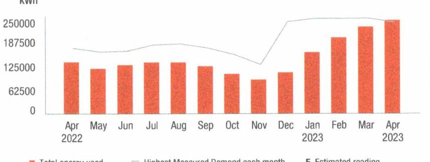

## Y

## PSIG

We make things work for you.

## Your energy bill

Message Center

## " " SHUT-OFF NOTICE " "

1-800-357-2262 (Mon-Fri, 7:30 AM - 8:00 PM)
Your bill is now past due. Payment of $\$ 23,586.62$ must be received by $4 / 18 / 2023$ or service may be shut off. A security deposit may be required if late payments continue. A statement of customer rights and fees is shown on the reverse side.

Si en el futuro usted desea recibir la notificación de desconexión de servicio en español, por favor llame al 1-800-357-2262.

## (2) NEXT METER READING April 30, 2023

## How to contact us

## 1-855-BIZ-PSEG (249-7734)

Customer Service: 8am to 5:30pm Mon to Fri,
Closed on weekends and holidays
Emergencies / Outages / WorryFree Services: 24/7
TTY for the hearing impaired: 1-800-225-0072
Visit pseg.com/myaccount to access your account anytime
Text us. Register for MyAlerts by texting REG to 4PSEG(47734)
Text OUT to report an outage.
facebook.com/pseg
twitter.com/psegdelivers

## $*$   $*$   $*$   $*$   $*$   $*$   $*$   $*$   $*$   $*$   $*$   $*$   $*$   $*$   $*$   $*$   $*$   $*$   $*$   $*$   $*$   $*$   $*$   $*$   $*$   $*$   $*$   $*$   $*$   $*$   $*$   $*$   $*$   $*$   $*$   $*$   $*$   $*$   $*$   $*$   $*$   $*$   $*$   $*$   $*$   $*$   $*$   $*$   $*$   $*$   $*$   $*$   $*$   $*$   $*$   $*$   $*$   $*$   $*$   $*$   $*$   $*$   $*$   $*$   $*$   $*$   $*$   $*$   $*$   $*$   $*$   $*$   $*$   $*$   $*$   $*$   $*$   $*$   $*$   $*$   $*$   $*$   $*$   $*$   $*$   $*$   $*$   $*$   $*$   $*$   $*$   $*$   $*$   $*$   $*$   $*$   $*$   $*$   $*$   $*$   $*$   $*$   $*$   $*$   $*$   $*$   $*$   $*$   $*$   $*$   $*$   $*$   $*$   $*$   $*$   $*$   $*$   $*$   $*$   $*$   $*$   $*$   $*$   $*$   $*$   $*$   $*$   $*$   $*$   $*$   $*$   $*$   $*$   $*$   $*$   $*$   $*$   $*$   $*$   $*$   $*$   $*$   $*$   $*$   $*$   $*$   $*$   $*$   $*$   $*$   $*$   $*$   $*$   $*$   $*$   $*$   $*$   $*$   $*$   $*$   $*$   $*$   $*$   $*$   $*$   $*$   $*$   $*$   $*$   $*$   $*$   $*$   $*$   $*$   $*$   $*$   $*$   $*$   $*$   $*$   $*$   $*$   $*$   $*$   $*$   $*$   $*$   $*$   $*$   $*$   $*$   $*$   $*$   $*$   $*$   $*$   $*$   $*$   $*$   $*$   $*$   $*$   $*$   $*$   $*$   $*$   $*$   $*$   $*$   $*$   $*$   $*$   $*$   $*$   $*$   $*$   $*$   $*$   $*$   $*$   $*$   $*$   $*$   $*$   $*$   $*$   $*$   $*$   $*$   $*$   $*$   $*$   $*$   $*$   $*$   $*$   $*$   $*$   $*$   $*$   $*$   $*$   $*$   $*$   $*$   $*$   $*$   $*$   $*$   $*$   $*$   $*$   $*$   $*$   $*$   $*$   $*$   $*$   $*$   $*$   $*$   $*$   $*$   $*$   $*$   $*$   $*$   $*$   $*$   $*$   $*$   $*$   $*$   $*$   $*$   $*$   $*$   $*$   $*$   $*$   $*$   $*$   $*$   $*$   $*$   $*$   $*$   $*$   $*$   $*$   $*$   $*$   $*$   $*$   $*$   $*$   $*$   $*$   $*$   $*$   $*$   $*$   $*$   $*$   $*$   $*$   $*$   $*$   $*$   $*$   $*$   $*$   $*$   $*$   $*$   $*$   $*$   $*$   $*$   $*$   $*$   $*$   $*$   $*$   $*$   $*$   $*$   $*$   $*$   $*$   $*$   $*$   $*$   $*$   $*$   $*$   $*$   $*$   $*$   $*$   $*$   $*$   $*$   $*$   $*$   $*$   $*$   $*$   $*$   $*$   $*$   $*$   $*$   $*$   $*$   $*$   $*$   $*$   $*$   $*$   $*$   $*$   $*$   $*$   $*$   $*$   $*$   $*$   $*$   $*$   $*$   $*$   $*$   $*$   $*$   $*$   $*$   $*$   $*$   $*$   $*$   $*$   $*$   $*$   $*$   $*$   $*$   $*$   $*$   $*$   $*$   $*$   $*$   $*$   $*$   $*$   $*$   $*$   $*$   $*$   $*$   $*$   $*$   $*$   $*$   $*$   $*$   $*$   $*$   $*$   $*$   $*$   $*$   $*$   $*$   $*$   $*$   $*$   $*$   $*$   $*$   $*$   $*$   $*$   $*$   $*$   $*$   $*$   $*$   $*$   $*$   $*$   $*$   $*$   $*$   $*$   $*$   $*$   $*$   $*$   $*$   $*$   $*$   $*$   $*$   $*$   $*$   $*$   $*$   $*$   $*$   $*$   $*$   $*$   $*$   $*$   $*$   $*$   $*$   $*$   $*$   $*$   $*$   $*$   $*$   $*$   $*$   $*$   $*$   $*$   $*$   $*$   $*$   $*$   $*$   $*$   $*$   $*$   $*$   $*$   $*$   $*$   $*$   $*$   $*$   $*$   $*$   $*$   $*$   $*$   $*$   $*$   $*$   $*$   $*$   $*$   $*$   $*$   $*$   $*$   $*$   $*$   $*$   $*$   $*$   $*$   $*$   $*$   $*$   $*$   $*$   $*$   $*$   $*$   $*$   $*$   $*$   $*$   $*$   $*$   $*$   $*$   $*$   $*$   $*$   $*$   $*$   $*$   $*$   $*$   $*$   $*$   $*$   $*$   $*$   $*$   $*$   $*$   $*$   $*$   $*$   $*$   $*$   $*$   $*$   $*$   $*$   $*$   $*$   $*$   $*$   $*$   $*$   $*$   $*$   $*$   $*$   $*$   $*$   $*$   $*$   $*$   $*$   $*$   $*$   $*$   $*$   $*$   $*$   $*$   $*$   $*$   $*$   $*$   $*$   $*$   $*$   $*$   $*$   $*$   $*$   $*$   $*$   $*$   $*$   $*$   $*$   $*$   $*$   $*$   $*$   $*$   $*$   $*$   $*$   $*$   $*$   $*$   $*$   $*$   $*$   $*$   $*$   $*$   $*$   $*$   $*$   $*$   $*$   $*$   $*$   $*$   $*$   $*$   $*$   $*$   $*$   $*$   $*$   $*$   $*$   $*$   $*$   $*$   $*$   $*$   $*$   $*$   $*$   $*$   $*$   $*$   $*$   $*$   $*$   $*$   $*$   $*$   $*$   $*$   $*$   $*$   $*$   $*$   $*$   $*$   $*$   $*$   $*$   $*$   $*$   $*$   $*$   $*$   $*$   $*$   $*$   $*$   $*$   $*$   $*$   $*$   $*$   $*$   $*$   $*$   $*$   $*$   $*$   $*$   $*$   $*$   $*$   $*$   $*$   $*$   $*$   $*$   $*$   $*$   $*$   $*$   $*$   $*$   $*$   $*$   $*$   $*$   $*$   $*$   $*$   $*$   $*$   $*$   $*$   $*$   $*$   $*$   $*$   $*$   $*$   $*$   $*$   $*$   $*$   $*$   $*$   $*$   $*$   $*$   $*$   $*$   $*$   $*$   $*$   $*$   $*$   $*$   $*$   $*$   $*$   $*$   $*$   $*$   $*$   $*$   $*$   $*$   $*$   $*$   $*$   $*$   $*$   $*$   $*$   $*$   $*$   $*$   $*$   $*$   $*$   $*$   $*$   $*$   $*$   $*$   $*$   $*$   $*$   $*$   $*$   $*$   $*$   $*$   $*$   $*$   $*$   $*$   $*$   $*$   $*$   $*$   $*$   $*$   $*$   $*$   $*$   $*$   $*$   $*$   $*$   $*$   $*$   $*$   $*$   $*$   $*$   $*$   $*$   $*$   $*$   $*$   $*$   $*$   $*$   $*$   $*$   $*$   $*$   $*$   $*$   $*$   $*$   $*$   $*$   $*$   $*$   $*$   $*$   $*$   $*$   $*$   $*$   $*$   $*$   $*$   $*$   $*$   $*$   $*$   $*$   $*$   $*$   $*$   $*$   $*$   $*$   $*$   $*$   $*$   $*$   $*$   $*$   $*$   $*$   $*$   $*$   $*$   $*$   $*$   $*$   $*$   $*$   $*$   $*$   $*$   $*$   $*$   $*$   $*$   $*$   $*$   $*$   $*$   $*$   $*$   $*$   $*$   $*$   $*$   $*$   $*$   $*$   $*$   $*$   $*$   $*$   $*$   $*$   $*$   $*$   $*$   $*$   $*$   $*$   $*$   $*$   $*$   $*$   $*$   $*$   $*$   $*$   $*$   $*$   $*$   $*$   $*$   $*$   $*$   $*$   $*$   $*$   $*$   $*$   $*$   $*$   $*$   $*$   $*$   $*$   $*$   $*$   $*$   $*$   $*$   $*$   $*$   $*$   $*$   $*$   $*$   $*$   $*$   $*$   $*$   $*$   $*$   $*$   $*$   $*$   $*$   $*$   $*$   $*$   $*$   $*$   $*$   $*$   $*$   $*$   $*$   $*$   $*$   $*$   $*$   $*$   $*$   $*$   $*$   $*$   $*$   $*$   $*$   $*$   $*$   $*$   $*$   $*$   $*$   $*$   $*$   $*$   $*$   $*$   $*$   $*$   $*$   $*$   $*$   $*$   $*$   $*$   $*$   $*$   $*$   $*$   $*$   $*$   $*$   $*$   $*$   $*$   $*$   $*$   $*$   $*$   $*$   $*$   $*$   $*$   $*$   $*$   $*$   $*$   $*$   $*$   $*$   $*$   $*$   $*$   $*$   $*$   $*$   $*$   $*$   $*$   $*$   $*$   $*$   $*$   $*$   $*$   $*$   $*$   $*$   $*$   $*$   $*$   $*$   $*$   $*$   $*$   $*$   $*$   $*$   $*$   $*$   $*$   $*$   $*$   $*$   $*$   $*$   $*$   $*$   $*$   $*$   $*$   $*$   $*$   $*$   $*$   $*$   $*$   $*$   $*$   $*$   $*$   $*$   $*$   $*$   $*$   $*$   $*$   $*$   $*$   $*$   $*$   $*$   $*$   $*$   $*$   $*$   $*$   $*$   $*$   $*$   $*$   $*$   $*$   $*$   $*$   $*$   $*$   $*$   $*$   $*$   $*$   $*$   $*$   $*$   $*$   $*$   $*$   $*$   $*$   $*$   $*$   $*$   $*$   $*$   $*$   $*$   $*$   $*$   $*$   $*$   $*$   $*$   $*$   $*$   $*$   $*$   $*$   $*$   $*$   $*$   $*$   $*$   $*$   $*$   $*$   $*$   $*$   $*$   $*$   $*$   $*$   $*$   $*$   $*$   $*$   $*$   $*$   $*$   $*$   $*$   $*$   $*$   $*$   $*$   $*$   $*$   $*$   $*$   $*$   $*$   $*$   $*$   $*$   $*$   $*$   $*$   $*$   $*$   $*$   $*$   $*$   $*$   $*$   $*$   $*$   $*$   $*$   $*$   $*$   $*$   $*$   $*$   $*$   $*$   $*$   $*$   $*$   $*$   $*$   $*$   $*$   $*$   $*$   $*$   $*$   $*$   $*$   $*$   $*$   $*$   $*$   $*$   $*$   $*$   $*$   $*$   $*$   $*$   $*$   $*$   $*$   $*$   $*$   $*$   $*$   $*$   $*$   $*$   $*$   $*$   $*$   $*$   $*$   $*$   $*$   $*$   $*$   $*$   $*$   $*$   $*$   $*$   $*$   $*$   $*$   $*$   $*$   $*$   $*$   $*$   $*$   $*$   $*$   $*$   $*$   $*$   $*$   $*$   $*$   $*$   $*$   $*$   $*$   $*$   $*$   $*$   $*$   $*$   $*$   $*$   $*$   $*$   $*$   $*$   $*$   $*$   $*$   $*$   $*$   $*$   $*$   $*$   $*$   $*$   $*$   $*$   $*$   $*$   $*$   $*$   $*$   $*$   $*$   $*$   $*$   $*$   $*$   $*$   $*$   $*$   $*$   $*$   $*$   $*$   $*$   $*$   $*$   $*$   $*$   $*$   $*$   $*$   $*$   $*$   $*$   $*$   $*$   $*$   $*$   $*$   $*$   $*$   $*$   $*$   $*$   $*$   $*$   $*$   $*$   $*$   $*$   $*$   $*$   $*$   $*$   $*$   $*$   $*$   $*$   $*$   $*$   $*$   $*$   $*$   $*$   $*$   $*$   $*$   $*$   $*$   $*$   $*$   $*$   $*$   $*$   $*$   $*$   $*$   $*$   $*$   $*$   $*$   $*$   $*$   $*$   $*$   $*$   $*$   $*$   $*$   $*$   $*$   $*$   $*$   $*$   $*$   $*$   $*$   $*$   $*$   $*$   $*$   $*$   $*$   $*$   $*$   $*$   $*$   $*$   $*$   $*$   $*$   $*$   $*$   $*$   $*$   $*$   $*$   $*$   $*$   $*$   $*$   $*$   $*$   $*$   $*$   $*$   $*$   $*$   $*$   $*$   $*$   $*$   $*$   $*$   $*$   $*$   $*$   $*$   $*$   $*$   $*$   $*$   $*$   $*$   $*$   $*$   $*$   $*$   $*$   $*$   $*$   $*$   $*$   $*$   $*$   $*$   $*$   $*$   $*$   $*$   $*$   $*$   $*$   $*$   $*$   $*$   $*$   $*$   $*$   $*$   $*$   $*$   $*$   $*$   $*$   $*$   $*$   $*$   $*$   $*$   $*$   $*$   $*$   $*$   $*$   $*$   $*$   $*$   $*$   $*$   $*$   $*$   $*$   $*$   $*$   $*$   $*$   $*$   $*$   $*$   $*$   $*$   $*$   $*$   $*$   $*$   $*$   $*$   $*$   $*$   $*$   $*$   $*$   $*$   $*$   $*$   $*$   $*$   $*$   $*$   $*$   $*$   $*$   $*$   $*$   $*$   $*$   $*$   $*$   $*$   $*$   $*$   $*$   $*$   $*$   $*$   $*$   $*$   $*$   $*$   $*$   $*$   $*$   $*$   $*$   $*$   $*$   $*$   $*$   $*$   $*$   $*$   $*$   $*$   $*$   $*$   $*$   $*$   $*$   $*$   $*$   $*$   $*$   $*$   $*$   $*$   $*$   $*$   $*$   $*$   $*$   $*$   $*$   $*$   $*$   $*$   $*$   $*$   $*$   $*$   $*$   $*$   $*$   $*$   $*$   $*$   $*$   $*$   $*$   $*$   $*$   $*$   $*$   $*$   $*$   $*$   $*$   $*$   $*$   $*$   $*$   $*$   $*$   $*$   $*$   $*$   $*$   $*$   $*$   $*$   $*$   $*$   $*$   $*$   $*$   $*$   $*$   $*$   $*$   $*$   $*$   $*$   $*$   $*$   $*$   $*$   $*$   $*$   $*$   $*$   $*$   $*$   $*$   $*$   $*$   $*$   $*$   $*$   $*$   $*$   $*$   $*$   $*$   $*$   $*$   $*$   $*$   $*$   $*$   $*$   $*$   $*$   $*$   $*$   $*$   $*$   $*$   $*$   $*$   $*$   $*$   $*$   $*$   $*$   $*$   $*$   $*$   $*$   $*$   $*$   $*$   $*$   $*$   $*$   $*$   $*$   $*$   $*$   $*$   $*$   $*$   $*$   $*$   $*$   $*$   $*$   $*$   $*$   $*$   $*$   $*$   $*$   $*$   $*$   $*$   $*$   $*$   $*$   $*$   $*$   $*$   $*$   $*$   $*$   $*$   $*$   $*$   $*$   $*$   $*$   $*$   $*$   $*$   $*$   $*$   $*$   $*$   $*$   $*$   $*$   $*$   $*$   $*$   $*$   $*$   $*$   $*$   $*$   $*$   $*$   $*$   $*$   $*$   $*$   $*$   $*$   $*$   $*$   $*$   $*$   $*$   $*$   $*$   $*$   $*$   $*$   $*$   $*$   $*$   $*$   $*$   $*$   $*$   $*$   $*$   $*$   $*$   $*$   $*$   $*$   $*$   $*$   $*$   $*$   $*$   $*$   $*$   $*$   $*$   $*$   $*$   $*$   $*$   $*$   $*$   $*$   $*$   $*$   $*$   $*$   $*$   $*$   $*$   $*$   $*$   $*$   $*$   $*$   $*$   $*$   $*$   $*$   $*$   $*$   $*$   $*$   $*$   $*$   $*$   $*$   $*$   $*$   $*$   $*$   $*$   $*$   $*$   $*$   $*$   $*$   $*$   $*$   $*$   $*$   $*$   $*$   $*$   $*$   $*$   $*$   $*$   $*$   $*$   $*$   $*$   $*$   $*$   $*$   $*$   $*$   $*$   $*$   $*$   $*$   $*$   $*$   $*$   $*$   $*$   $*$   $*$   $*$   $*$   $*$   $*$   $*$   $*$   $*$   $*$   $*$   $*$   $*$   $*$   $*$   $*$   $*$   $*$   $*$   $*$   $*$   $*$   $*$   $*$   $*$   $*$   $*$   $*$   $*$   $*$   $*$   $*$   $*$   $*$   $*$   $*$   $*$   $*$   $*$   $*$   $*$   $*$   $*$   $*$   $*$   $*$   $*$   $*$   $*$   $*$   $*$   $*$   $*$   $*$   $*$   $*$   $*$   $*$   $*$   $*$   $*$   $*$   $*$   $*$   $*$   $*$   $*$   $*$   $*$   $*$   $*$   $*$   $*$   $*$   $*$   $*$   $*$   $*$   $*$   $*$   $*$   $*$   $*$   $*$   $*$   $*$   $*$   $*$   $*$   $*$   $*$   $*$   $*$   $*$   $*$   $*$   $*$   $*$   $*$   $*$   $*$   $*$   $*$   $*$   $*$   $*$   $*$   $*$   $*$   $*$   $*$   $*$   $*$   $*$   $*$   $*$   $*$   $*$   $*$   $*$   $*$   $*$   $*$   $*$   $*$   $*$   $*$   $*$   $*$   $*$   $*$   $*$   $*$   $*$   $*$   $*$   $*$   $*$   $*$   $*$   $*$   $*$   $*$   $*$   $*$   $*$   $*$   $*$   $*$   $*$   $*$   $*$   $*$   $*$   $*$   $*$   $*$   $*$   $*$   $*$   $*$   $*$   $*$   $*$   $*$   $*$   $*$   $*$   $*$   $*$   $*$   $*$   $*$   $*$   $*$   $*$   $*$   $*$   $*$   $*$   $*$   $*$   $*$   $*$   $*$   $*$   $*$   $*$   $*$   $*$   $*$   $*$   $*$   $*$   $*$   $*$   $*$   $*$   $*$   $*$   $*$   $*$   $*$   $*$   $*$   $*$   $*$   $*$   $*$   $*$   $*$   $*$   $*$   $*$   $*$   $*$   $*$   $*$   $*$   $*$   $*$   $*$   $*$   $*$   $*$   $*$   $*$   $*$   $*$   $*$   $*$   $*$   $*$   $*$   $*$   $*$   $*$   $*$   $*$   $*$   $*$   $*$   $*$   $*$   $*$   $*$   $*$   $*$   $*$   $*$   $*$   $*$   $*$   $*$   $*$   $*$   $*$   $*$   $*$   $*$   $*$   $*$   $*$   $*$   $*$   $*$   $*$   $*$   $*$   $*$   $*$   $*$   $*$   $*$   $*$   $*$   $*$   $*$   $*$   $*$   $*$   $*$   $*$   $*$   $*$   $*$   $*$   $*$   $*$   $*$   $*$   $*$   $*$   $*$   $*$   $*$   $*$   $*$   $*$   $*$   $*$   $*$   $*$   $*$   $*$   $*$   $*$   $*$   $*$   $*$   $*$   $*$   $*$   $*$   $*$   $*$   $*$   $*$   $*$   $*$   $*$   $*$   $*$   $*$   $*$   $*$   $*$   $*$   $*$   $*$   $*$   $*$   $*$   $*$   $*$   $*$   $*$   $*$   $*$   $*$   $*$   $*$   $*$   $*$   $*$   $*$   $*$   $*$   $*$   $*$   $*$   $*$   $*$   $*$   $*$   $*$   $*$   $*$   $*$   $*$   $

# STATEMENT OF CUSTOMER'S RIGHTS 

If you have any billing or service questions, you should first call PSE\&G at 1-800-436-7734 between 7am and 8pm, Monday through Friday, or between 7am and 5pm on Saturdays or visit one of our customer service centers. You may have counsel or third party representation when appearing before PSE\&G to contest a bona fide disputed charge.

If you are not able to make a payment, we may be able to help you by setting up a reasonable payment arrangement. You can discuss your options by visiting one of our customer service centers, or by calling our credit and collection center at 1-800-357-2262 between 7:30am and 8 pm , Monday through Friday.

If you are not able to resolve a dispute with us, you may contact the New Jersey Board of Public Utilities to ask them to help you resolve it. PSE\&G operates under the authority of the Board.

The Board's address is:
44 South Clinton Avenue,
Trenton, NJ 08625
Phone: 1609 341-9188,
Toll free 1800 624-0241.

You may also ask for a formal hearing with the Board to discuss your dispute.

If you contact the Board within five days of trying to resolve your dispute with us, we will not shut off service to you because you haven't paid your bill. However, you must pay all other charges that you're not disputing.

## If your service is shut off

If we shut off your service because you fail to pay outstanding charges, we will charge a reconnection fee of $\$ 45.00$ for each service when you do pay the amount you owe. We may not be able to restore your service on the date you make your payment. We may also require you to pay a security deposit.

You can avoid paying a security deposit and earning a poor credit rating with PSE\&G by paying your bills by their due date. A fee of $\$ 30.00$ will be charged if a visit is made to collect past due bills. A late payment fee may be charged for past due bills.

Page 2 of 3

IT'S YOUR BILL. HOW YOU PAY IS YOUR CHOICE.

| My Account | 囯 Automatic BillPay | 囯 Credit Card | 囯 Phone | 囯 By Mail |
| :--: | :--: | :--: | :--: | :--: |
| Make a payment anytime | Automatic payments from your | Pay your bill with a credit | Make your check payable to | Make your check payable to |
| from a checking or savings account stored in My | bank. Skip checks and stamps. | card online or by phone. | PSE\&G and write your account | PSE\&G and write your account |
| Account Visit pseg.com/ myaccount | Never worry about due dates. | Because we don't use | number on your check. |  |
| Mobile: Download our Mobile App "PSE\&G" |  | customer rates to |  |  |
| Pay by text: Text PAY to | Enroll at: | acosolize the cost of this |  |  |
| 4PSEG (47734) | 4PSEG (47734) | service, there is a fee. |  |  |
|  |  | My Account: |  |  |
|  |  | pseg.com/myaccount |  |  |
| Phone: |  | Phone: |  |  |
| 1800 550-1734 |  | 1800 277-8710 |  |  |
|  |  |  |  |  |
|  |  |  |  |  |
| Note: Ask Alexa or use Google Assistant. |  |  |  |  |
|  |  |  |  |  |
|  |  |  |  |  |
|  |  |  |  |  |
|  |  |  |  |  |
|  |  |  |  |  |
|  |  |  |  |  |
|  |  |  |  |  |
|  | Automatic BillPay | 囯 Credit Card | 囯 Phone | 囯 PSEG |
|  | Automatic payments | 1800 550-1734 | Bank Account: |  |
|  | 1800 550-1734 | 1800 550-1734 | Credit Card: |  |
|  |  |  | Credit Card: |  |
|  |  | Credit Card: | 1800-277-8710 |  |
|  | 1800-277-8710 | 1800-277-8710 |  |  |
|  |  |  |  |  |
|  |  |  |  |  |
|  |  |  |  |  |
|  |  |  |  |  |
|  |  |  |  |  |
|  |  |  |  |  |
|  |  |  |  |  |
|  |  |  |  |  |
|  |  |  |  |  |
| My Account:   pseg.com/myaccount |  |  |  |  |
|  | Phone: |  |  |  |
| 1800-277-8710 |  |  |  |  |
|  |  |  |  |  |
|  |  |  |  |  |
|  |  |  |  |  |
|  |  |  |  |  |
|  |  |  |  |  |
|  |  |  |  |  |
|  |  |  |  |  |
|  | Phone |  |  |  |
| Bank Account: | 1800-550-1734 |  |  |  |
| 1800-550-1734 |  |  |  |  |
|  |  | Credit Card: |  |  |
|  | 1800-277-8710 |  |  |  |
| Credit Card: |  |  |  |  |
| 1800-277-8710 |  |  |  |  |
|  |  |  |  |  |
|  |  |  |  |  |
|  |  |  |  |  |
|  |  |  |  |  |
|  |  |  |  |  |
|  |  |  |  |  |
|  |  |  |  |  |
|  |  |  |  |  |
|  |  |  |  |  |
|  |  |  |  |  |
|  |  |  |  |  |
|  |  |  |  |  |
|  |  |  |  |  |
|  |  |  |  |  |
|  |  |  |  |  |
|  |  |  |  |  |
|  |  |  |  |  |
|  |  |  |  |  |
|  |  |  |  |  |
|  |  |  |  |  |
|  |  |  |  |  |
|  |  |  |  |  |
|  |  |  |  |  |
|  |  |  |  |  |
|  |  |  |  |  |
|  |  |  |  |  |
|  |  |  |  |  |
|  |  |  |  |  |
|  |  |  |  |  |
|  |  |  |  |  |
|  |  |  |  |  |

## Details of your electric charges

Your rate: Large Power \& Lighting Secondary (LPLS)

## Meter \# 9213706

## Usage

Reading Mar 31, 2023
On-Peak Actual
35293

## Reading Mar 1, 2023

Less On-Peak Actual
Multplier
Total On kWh
Total Off kWh
Total kWh
239,020

## Delivery charges

Monthly service charge
Charges for delivering electric to you:
Annual Demand
The highest Measured Demand in any time period in the current month
kWh - On-peak
107,031 kWh $\times \$ 0.006029$
Energy consumed between 6am-10pm. Monday to Friday.
kWh - Off-peak
131,989 kWh $\times \$ 0.006029$
Energy consumed outside peak hours.
Societal Benefits
239,020 kWh $\times \$ 0.010413$
This charge recovers the cost of government mandated programs designed to achieve public policy goals, such as energy conservation.

## Total electric delivery charges

## Supply charges

BGS Capacity
Generation
Transmission
Cost of electric supplied by PSE\&G:
On-peak
Off-peak
Total electric supply charges
\$5,941.43

## $299,748 \mathrm{~kW} \times \$ 3,400189$

\$1,019.20
\$3,124.15
\$7,440.05
\$8,221.46
\$19,804.86

## Your monthly electric use

kWh

The image is a bar chart.

- **Chart Type**: Bar chart with a line overlay.
- **X-Axis**: Months from April 2022 to April 2023.
- **Y-Axis**: kWh, ranging from 0 to 250,000.
- **Legend Entries**:
  - Red bars: Total energy used
  - Gray line: Highest Measured Demand each month
  - "E" symbol: Estimated reading
- **Data Points**:
  - April 2022 to December 2022: Consistent energy usage with slight fluctuations.
  - January 2023: Increase in energy usage.
  - February 2023: Further increase.
  - March 2023: Slight decrease.
  - April 2023: Highest energy usage.
- **Styling**: Red bars represent energy usage, and a gray line indicates the highest measured demand. An "E" symbol marks estimated readings.
- **Yearly Usage Breakdown (Monthly-Based)**: The chart provides a visual representation of monthly energy usage over a year.

Visit MyAccount for more details regarding your energy usage.

## MEASURED DEMAND

On-Peak kW
367.20

Off-Peak2 kW
344.50

Measured Demand is the maximum use of electricity at any time during a monthly time period, as measured by your meter.

## BILLED DEMAND

Annual Demand kW
367.20

## SUPPLY CAPACITY

Generation kW
299.748

Transmission kW
247.593

Supply capacity is required to serve the system's annual peak usage. It represents your share of these facilities, in kilowatts (kW). It is calculated based on your peak usage from the previous summer. Supply capacity values are updated periodically throughout the year and are prorated based on your service period.

## Price to compare

If you want to consider getting your electric supply from another supplier, compare their price with ours. This month, your cost for energy supply is $\$ 19,804.86$. This price to compare varies month to month, depending on your usage.

Your PoD ID is: PE000009196007035626 -
Your PoD ID is your Point of Delivery identification within PSE\&G's system. You will need this number if you are considering enrolling with another supplier.

pa.pypg.110p0a01 ipg0o0 202304041837.ras-1088-000000118

