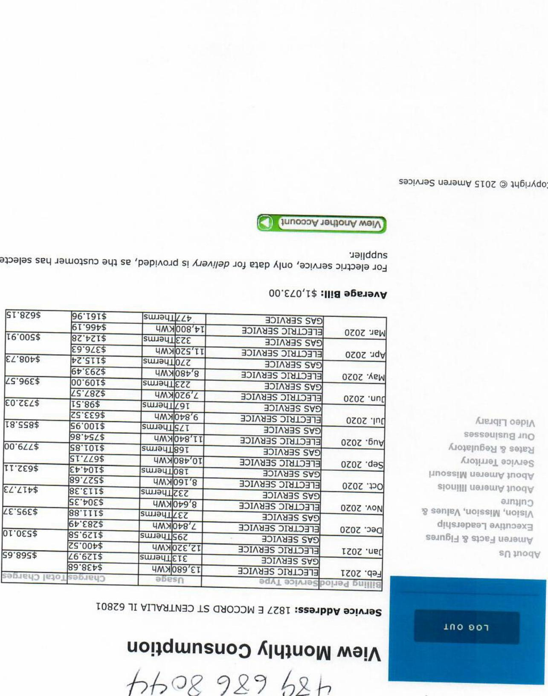
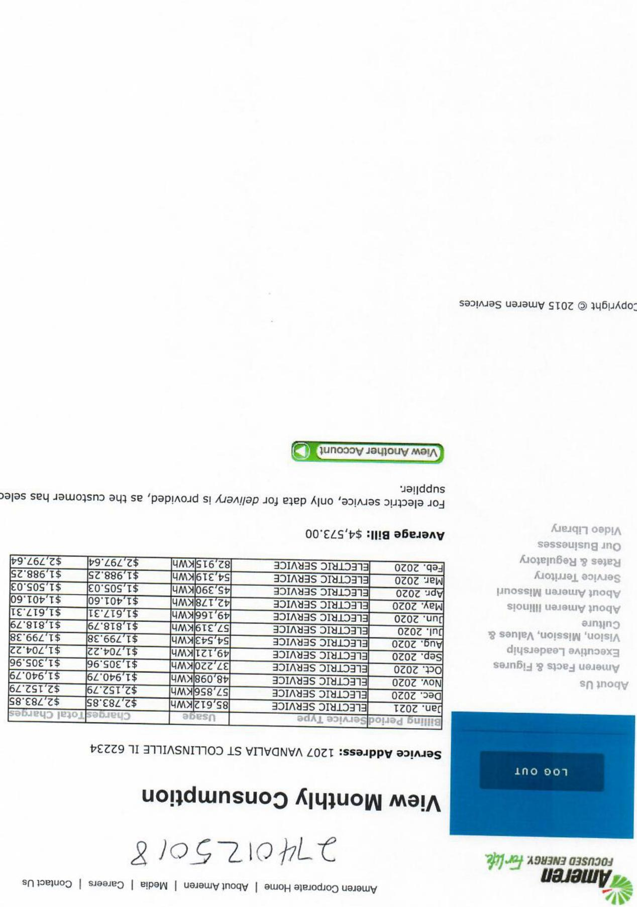
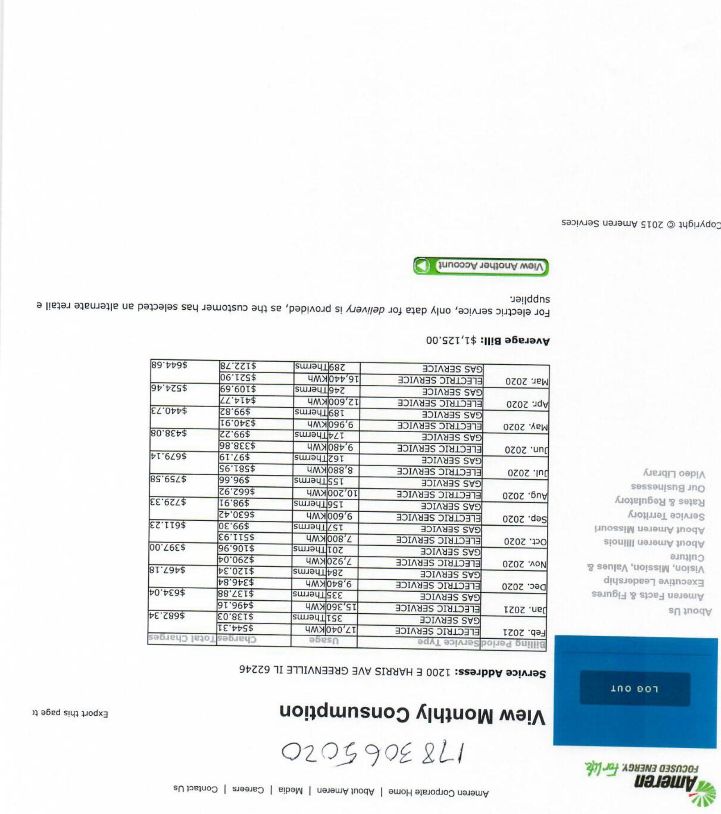
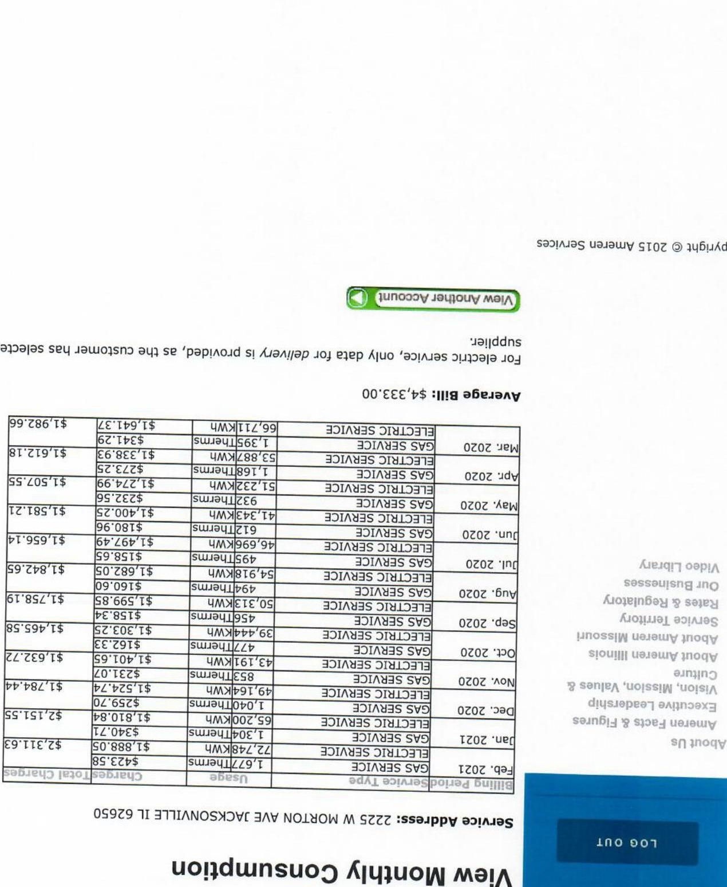
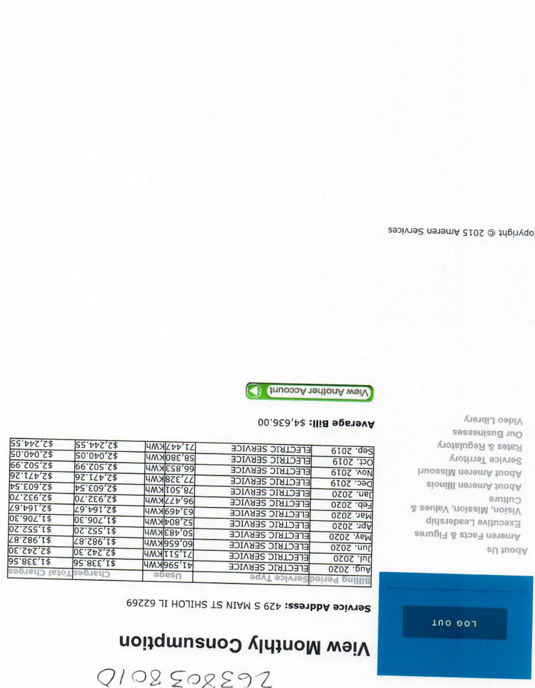
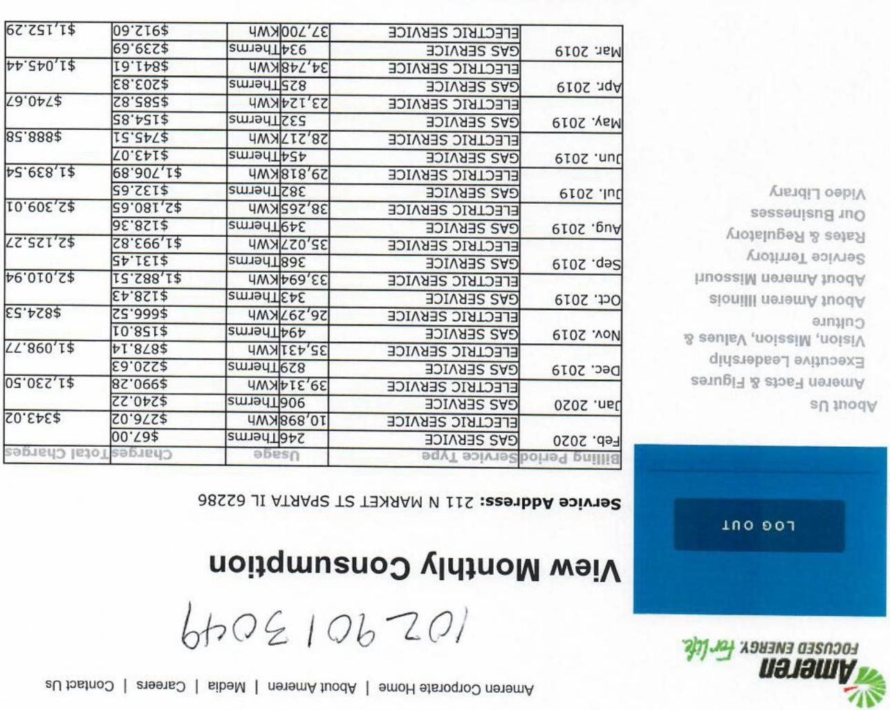
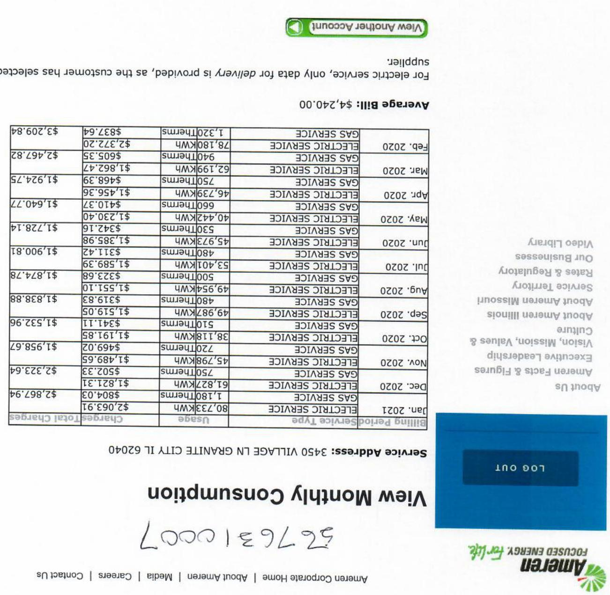
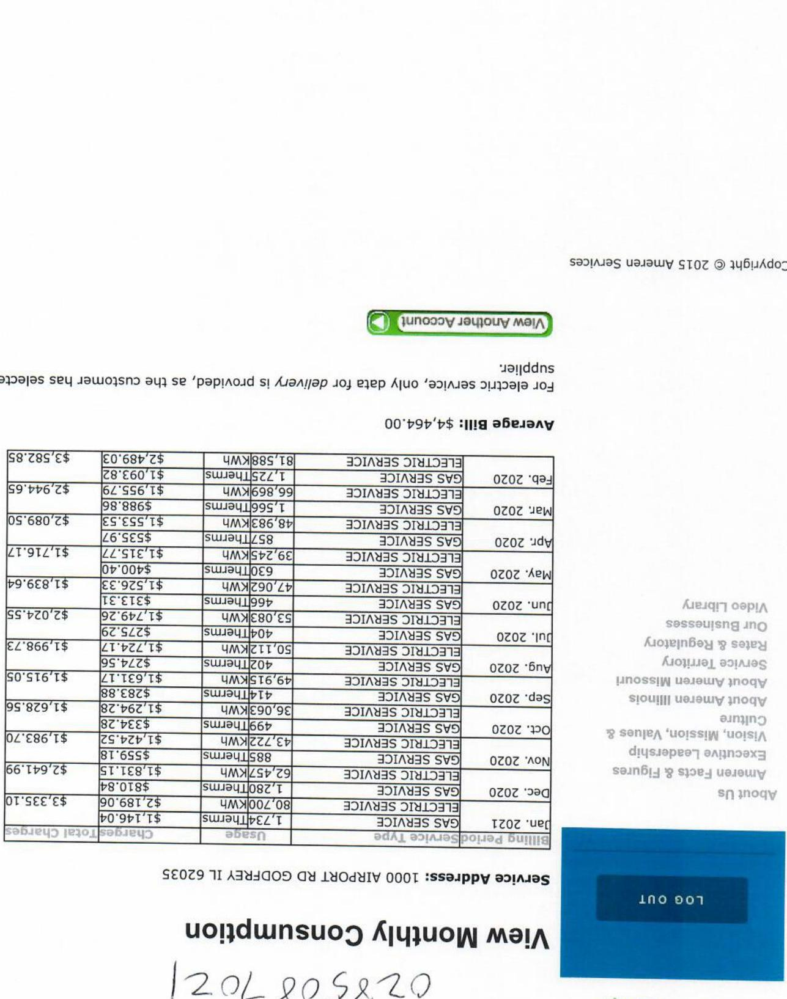
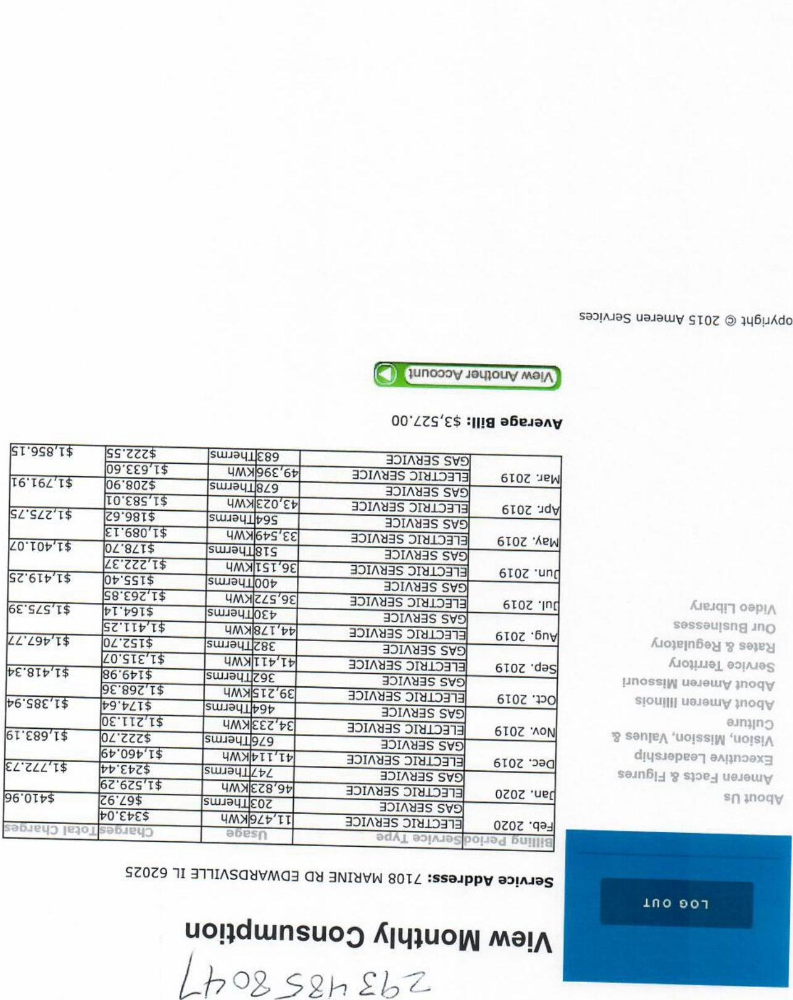

The image is a photo of a printed document, possibly a utility bill summary. It contains a table with columns for dates, service types, usage, and costs. The table includes entries from March 2020 to May 2021, detailing gas and electric services. Each row lists the month, year, service type, usage in therms or kWh, and the cost in dollars. The average bill is noted as $1,073.00. There is a "View Another Account" button and a "Log Out" button visible. The document also includes text about the service address, copyright, and various informational sections like "About Us" and "Service Territory." The text is oriented upside down in the image.

The image is a photo of a document displaying a table of monthly consumption data for electric service. The table includes the following columns: 

- "Billing Date"
- "Service Type"
- "kWh"
- "Amount"

The data entries are as follows:

- Feb 2020: 82.4 kWh, $2,749.64
- Jan 2020: 54.3 kWh, $1,988.25
- Dec 2019: 54.3 kWh, $1,988.25
- Nov 2019: 51.5 kWh, $1,905.73
- Oct 2019: 51.5 kWh, $1,905.73
- Sep 2019: 51.4 kWh, $1,901.60
- Aug 2019: 45.3 kWh, $1,674.71
- Jul 2019: 45.3 kWh, $1,674.71
- Jun 2019: 43.6 kWh, $1,612.44
- May 2019: 43.6 kWh, $1,612.44
- Apr 2019: 34.9 kWh, $1,290.38
- Mar 2019: 34.9 kWh, $1,290.38
- Feb 2019: 28.9 kWh, $1,073.29

Additional text includes:

- "Average Bill: $4,573.00"
- "View Another Account"
- "View Monthly Consumption"
- "Service Address: 1207 VANDALIA ST COLLINSVILLE IL 62234"
- "Log Out"
- "Copyright © 2015 Ameren Services"

The document is oriented upside down.

The image is a photo of a printed document showing a table with monthly data. The table includes the following columns: 

- "Date"
- "Type"
- "Usage"
- "Charge"

The data entries are:

- Jan 2020: ELECTRIC SERVICE, 9.88 Therms, $81.95
- Feb 2020: ELECTRIC SERVICE, 9.88 Therms, $81.95
- Mar 2020: ELECTRIC SERVICE, 16.94 Therms, $231.90
- Apr 2020: GAS SERVICE, 2.46 Therms, $104.69
- May 2020: ELECTRIC SERVICE, 9.96 Therms, $290.91
- Jun 2020: ELECTRIC SERVICE, 7.78 Therms, $338.86
- Jul 2020: ELECTRIC SERVICE, 9.94 Therms, $299.46
- Aug 2020: ELECTRIC SERVICE, 9.94 Therms, $299.46
- Sep 2020: ELECTRIC SERVICE, 9.94 Therms, $299.46
- Oct 2020: ELECTRIC SERVICE, 9.94 Therms, $299.46
- Nov 2020: ELECTRIC SERVICE, 9.94 Therms, $299.46
- Dec 2020: ELECTRIC SERVICE, 9.94 Therms, $299.46

Additional text includes:

- "Average Bill: $1,125.00"
- "View Monthly Consumption"
- "Service Address: 1200 E HARRIS AVE GREENVILLE IL 62246"
- "Copyright © 2015 Ameren Services"
- "Log Out" button

The document is oriented upside down.

The image is a photo of a table displaying monthly consumption data for gas and electric services. The table includes the following columns: "Date," "Usage," "Service Type," and "Amount." 

- **Date**: Ranges from Feb 2020 to Mar 2021.
- **Usage**: Measured in "kWh" for electric service and "therms" for gas service.
- **Service Type**: Alternates between "ELECTRIC SERVICE" and "GAS SERVICE."
- **Amount**: Displays dollar amounts for each entry.

Some specific entries include:
- Mar 2020: 1,399 therms, GAS SERVICE, $3,341.29
- Apr 2020: 2,388 kWh, ELECTRIC SERVICE, $1,912.18
- Jan 2021: 1,399 therms, GAS SERVICE, $3,341.29

The table is titled "View Monthly Consumption," and there is a note about the average bill being $4,333.00. The image also includes a "View Another Account" button and a copyright notice from 2015 Ameren Services. The table is oriented upside down in the image.

The image is a photo of a document showing a table and some additional text. The table lists monthly consumption data for an electric service, with the following columns: "Date," "Usage," and "Service Type." The dates range from September 2019 to August 2020, with usage measured in kWh. The service type is consistently "ELECTRIC SERVICE." The usage values range from 41.596 kWh to 98.360 kWh. 

Above the table, there is a green button labeled "View Another Account." Below the table, the text "Average Bill: $4,536.00" is displayed. The service address is "429 S MAIN ST SHILOH IL 62269." 

The document also includes text on the right side, mentioning "View Monthly Consumption," "Log Out," and a copyright notice: "Copyright © 2015 Ameren Services." The text is oriented upside down in the image.

The image is a photo of a document showing a table with monthly utility consumption and charges. The table includes columns for the month and year, service type, usage, and charges. 

- **Columns:**
  - **Month/Year:** Lists months from March 2019 to February 2020.
  - **Service Type:** Alternates between "ELECTRIC SERVICE" and "GAS SERVICE."
  - **Usage:** Measured in kWh for electric and therms for gas.
  - **Charges:** Dollar amounts for each service.

- **Data Points:**
  - **Mar. 2019:** Electric, 937 kWh, $92.70
  - **Apr. 2019:** Gas, 39 therms, $41.05
  - **May 2019:** Electric, 848 kWh, $91.69
  - **Jun. 2019:** Electric, 888 kWh, $88.88
  - **Jul. 2019:** Electric, 1,045 kWh, $115.43
  - **Aug. 2019:** Electric, 1,049 kWh, $115.29
  - **Sep. 2019:** Gas, 13 therms, $13.45
  - **Oct. 2019:** Gas, 20 therms, $20.93
  - **Nov. 2019:** Gas, 26 therms, $28.82
  - **Dec. 2019:** Gas, 36 therms, $36.58
  - **Jan. 2020:** Gas, 87 therms, $87.19
  - **Feb. 2020:** Gas, 57 therms, $59.67

- **Additional Text:**
  - "View Monthly Consumption"
  - "Service Address: 211 N MARKET ST SPARTA IL 62286"
  - "LOG OUT"
  - "Ameren Focused Energy For Life"
  - "About Ameren Illinois"
  - "Mission, Vision, Values"
  - "Executive Leadership"
  - "Service Territory"
  - "Rates & Regulatory"
  - "Video Library"
  - "Contact Us"
  - "Careers"
  - "Media"
  - "Corporate Home"
  - "About Ameren"
  - "Figures & Facts"

The table is oriented upside down in the image.

The image is a photo of a document showing a table of monthly utility consumption and billing details. The table includes columns for the month, type of service, consumption in kilowatt-hours or therms, and the cost in dollars. The months range from January 2020 to February 2021. The services listed are "ELECTRIC SERVICE" and "GAS SERVICE." 

The table entries are as follows:

- Feb 2020: ELECTRIC SERVICE, 1,320 kWh, $93.64
- Feb 2020: GAS SERVICE, 28 therms, $32.20
- Mar 2020: ELECTRIC SERVICE, 1,080 kWh, $75.35
- Mar 2020: GAS SERVICE, 62 therms, $60.35
- Apr 2020: ELECTRIC SERVICE, 750 kWh, $52.82
- Apr 2020: GAS SERVICE, 39 therms, $46.39
- May 2020: ELECTRIC SERVICE, 660 kWh, $41.77
- May 2020: GAS SERVICE, 30 therms, $40.37
- Jun 2020: ELECTRIC SERVICE, 1,440 kWh, $92.14
- Jun 2020: GAS SERVICE, 37 therms, $34.16
- Jul 2020: ELECTRIC SERVICE, 1,970 kWh, $137.98
- Jul 2020: GAS SERVICE, 33 therms, $32.14
- Aug 2020: ELECTRIC SERVICE, 2,110 kWh, $153.79
- Aug 2020: GAS SERVICE, 25 therms, $29.33
- Sep 2020: ELECTRIC SERVICE, 1,950 kWh, $138.78
- Sep 2020: GAS SERVICE, 23 therms, $28.14
- Oct 2020: ELECTRIC SERVICE, 1,490 kWh, $98.86
- Oct 2020: GAS SERVICE, 21 therms, $27.11
- Nov 2020: ELECTRIC SERVICE, 1,191 kWh, $79.05
- Nov 2020: GAS SERVICE, 41 therms, $49.85
- Dec 2020: ELECTRIC SERVICE, 1,181 kWh, $78.45
- Dec 2020: GAS SERVICE, 79 therms, $82.05
- Jan 2021: ELECTRIC SERVICE, 1,491 kWh, $98.86
- Jan 2021: GAS SERVICE, 80 therms, $83.94

The document also includes the following text:

- "Average Bill: $142.00"
- "View Another Account"
- "Log Out"
- "View Monthly Consumption"
- "Service Address: 3450 VILLAGE LN GRANITE CITY IL 62040"
- "Account Number: 0000136752"

The document appears to be from "Ameren" with a logo at the bottom right corner. The text is oriented upside down in the image.

The image is a photo of a printed document, possibly a utility bill or consumption statement. It includes a table with the following details:

- **Columns:**
  - "Billing Period/Service Type"
  - "Usage"
  - "Total Charges"

- **Rows:**
  - Jan. 2020: Electric Service, 43.7 kWh, $2.88
  - Feb. 2020: Gas Service, 1.72 therms, $1.09
  - Mar. 2020: Electric Service, 66.6 kWh, $4.95
  - Apr. 2020: Gas Service, 1.95 therms, $1.24
  - May. 2020: Electric Service, 89.9 kWh, $6.68
  - Jun. 2020: Gas Service, 2.94 therms, $1.87
  - Jul. 2020: Electric Service, 98.8 kWh, $7.34
  - Aug. 2020: Gas Service, 3.26 therms, $2.08
  - Sep. 2020: Electric Service, 57.7 kWh, $4.29
  - Oct. 2020: Gas Service, 2.04 therms, $1.30
  - Nov. 2020: Electric Service, 49.4 kWh, $3.71
  - Dec. 2020: Gas Service, 1.47 therms, $0.94
  - Jan. 2021: Electric Service, 80.2 kWh, $6.02
  - Feb. 2021: Gas Service, 1.73 therms, $1.46

- **Additional Text:**
  - "Average Bill: $4.46"
  - "View Another Account"
  - "Service Address: 1000 Airport Rd Godfrey IL 62035"
  - "View Monthly Consumption"
  - "Log Out"
  - Copyright © 2015 Ameren Services

The document appears to be rotated, and the text is upside down.

The image is a photo of a printed table showing monthly utility consumption data. The table includes columns for the month and year, service type, usage, and cost. The data spans from March 2019 to April 2020, alternating between "GAS SERVICE" and "ELECTRIC SERVICE."

- **Months and Years**: March 2019 to April 2020
- **Service Types**: GAS SERVICE, ELECTRIC SERVICE
- **Usage Units**: Therms for gas, kWh for electric
- **Cost**: Listed in dollars

The table is organized with the most recent month at the top. At the bottom, there is a handwritten note: "View Monthly Consumption" and a number "293 485 8047." 

Additional text includes:
- "Average Bill: $53.57"
- "View Another Account" button
- "Service Address: 1208 MARINE RD EDWARDSVILLE IL 62025"
- "Copyright © 2015 Ameren Services"

The table is oriented upside down in the image.

