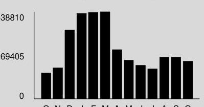

## comEd

An Exelon Company

## comed.com

Customer Service / Power Outage English
1-877-4COMED1 (1-877-426-6331)

## Español

1-800-95-LUCES (1-800-955-8237)
Hearing/Speech Impaired
1-800-572-5789 (TTY)
For Electric Supply Choices visit pluginillinois.org

## Your Usage Profile

13-Month Usage (Total kWh)

The image is a bar chart.

- **Chart Type**: Bar chart
- **Axes**:
  - **Y-axis**: No title visible, but numerical values are shown (0, 69405, 38810)
  - **X-axis**: Labels are partially visible, showing months as initials (O, N, D, J, F, M, A, M, J, J, A, S, O)
- **Data Points**: The chart visually represents monthly data with bars corresponding to each month.
- **Styling**: The bars are black, and the chart has a gray background.
- **Description**: This chart provides a **yearly usage breakdown (monthly-based)**, showing variations in usage over a 13-month period.

Electric Usage

| Month | kWh |
| :-- | :-- |
| Oct-14 | 160829 |
| Nov-14 | 192435 |
| Dec-14 | 426896 |
| Jan-15 | 528658 |
| Feb-15 | 534193 |
| Mar-15 | 538809 |
| Apr-15 | 304615 |
| May-15 | 238180 |
| Jun-15 | 207364 |
| Jul-15 | 186094 |
| Aug-15 | 258201 |
| Sep-15 | 257995 |
| Oct-15 | 232752 |

## Month Billed

Last Year
Last Month
Current Month
257995
232752

## Average Daily

| kWh | Temp |
| :--: | :--: |
| 5545.8 | 60 |
| 8322.4 | 72 |
| 7053.1 | 66 |

Page 1 of 5
Account Number 1572089056
Name
SELLER MANAGEMENT CORP
Service Location UNIT 1505200 OLD ORCHARD RD SKOKIE
Phone Number 847-745-5760

## Bill Summary

Previous Balance
Total Payments
Amount Due on November 17, 2015

## 33.33

\$0.00

## 4495

\$14,017.81

Issue Date
November 2, 2015

| Meter Information |  |  |  |  |  |  |  |  |
| :--: | :--: | :--: | :--: | :--: | :--: | :--: | :--: | :--: |
| Read Date | Meter   Number | Load Type | Reading Type | Previous | Meter Reading Present | Difference | Multiplier $\times$ | Usage |
| 9/29 | 097181961 | General Service | Off Pk kWh | Actual | Actual |  |  | 3054 |
| 9/29 | 097181961 | General Service | Total kWh | Actual | Actual |  |  | 4495 |
| 9/29 | 097181961 | General Service | On Pk kW | Actual | Actual |  |  | 6.82 |
| 9/29 | 140481940 | General Service | Off Pk kWh | Actual | Actual |  |  | 3705 |
| 9/29 | 140481940 | General Service | Total kWh | Actual | Actual |  |  | 7812 |
| 9/29 | 140481940 | General Service | On Pk kW | Actual | Actual |  |  | 49.10 |
| 9/29 | 141387905 | General Service | Off Pk kWh | Actual | Actual |  |  | 5587 |
| 9/29 | 141387905 | General Service | Total kWh | Actual | Actual |  |  | 8807 |
| 9/29 | 141387905 | General Service | On Pk kW | Actual | Actual |  |  | 17.46 |
| 9/29 | 141401653 | General Service | Off Pk kWh | Actual | Actual |  |  | 3357 |
| 9/29 | 141401653 | General Service | Total kWh | Actual | Actual |  |  | 6832 |
| 9/29 | 141401653 | General Service | On Pk kW | Actual | Actual |  |  | 38.56 |
| 9/29 | 141401656 | Space Heat | Off Pk kWh | Actual | Actual |  |  | 18595 |
| 9/29 | 141401656 | Space Heat | Total kWh | Actual | Actual |  |  | 36966 |
| 9/29 | 141401656 | Space Heat | On Pk kW | Actual | Actual |  |  | 229.90 |
| 9/29 | 141516240 | Space Heat | Off Pk kWh | Actual | Actual |  |  | 13891 |
| 9/29 | 141516240 | Space Heat | Total kWh | Actual | Actual |  |  | 27373 |
| 9/29 | 141516240 | Space Heat | On Pk kW | Actual | Actual |  |  | 178.13 |
| 9/29 | 141602819 | General Service | Off Pk kWh | Actual | Actual |  |  | 820 |
| 9/29 | 141602819 | General Service | Total kWh | Actual | Actual |  |  | 1745 |
| 9/29 | 141602819 | General Service | On Pk kW | Actual | Actual |  |  | 12.68 |
| 10/1 | 141602820 | General Service | Off Pk kWh | Actual | Actual |  |  | 13 |
| 10/1 | 141602820 | General Service | Total kWh | Actual | Actual |  |  | 13 |
| 10/1 | 141602820 | General Service | On Pk kW | Actual | Actual |  |  | 0.03 |
| 10/1 | 141602821 | General Service | Off Pk kWh | Actual | Actual |  |  | 10 |
| 10/1 | 141602821 | General Service | Total kWh | Actual | Actual |  |  | 15 |
| 10/1 | 141602821 | General Service | On Pk kW | Actual | Actual |  |  | 0.03 |
| 10/1 | 141682913 | Space Heat | Off Pk kWh | Actual | Actual |  |  | 19884 |
| 10/1 | 141682913 | Space Heat | Total kWh | Actual | Actual |  |  | 44000 |

(continued on next page)
Return only this portion with your check made payable to ComEd. Please write your account number on your check.

# ComEd 

An Exelon Company

To pay by phone call 1-800-588-9477.
A convenience fee will apply.

2002152 02 AV 0.685 **AUTO T1 21049 60077-440799 -C76-B1-P000004
$\left.\mathrm{P} / \mathrm{P} / \mathrm{I} / \mathrm{I} / \mathrm{P} / \mathrm{I} / \mathrm{P} / \mathrm{P} / \mathrm{I} / \mathrm{I} / \mathrm{I} / \mathrm{I} / \mathrm{I} / \mathrm{I} / \mathrm{I} / \mathrm{I} / \mathrm{I} / \mathrm{I} / \mathrm{I} / \mathrm{I} / \mathrm{I} / \mathrm{I} / \mathrm{I} / \mathrm{I} / \mathrm{I} / \mathrm{I} / \mathrm{I} / \mathrm{I} / \mathrm{I} / \mathrm{I} / \mathrm{I} / \mathrm{I} / \mathrm{I} / \mathrm{I} / \mathrm{I} / \mathrm{I} / \mathrm{I} / \mathrm{I} / \mathrm{I} / \mathrm{I} / \mathrm{I} / \mathrm{I} / \mathrm{I} / \mathrm{I} / \mathrm{I} / \mathrm{I} / \mathrm{I} / \mathrm{I

| Meter Information |  |  |  |  |  |  |  |  |
| :--: | :--: | :--: | :--: | :--: | :--: | :--: | :--: | :--: |
| Read Date | Meter Number | Load   Type | Reading Type | Previous | Meter Reading Present | Difference | Multiplier   $X$ | Usage |
| 10/1 | 141682913 | Space Heat | On Pk kW | Actual | Actual |  |  | 248.83 |
| 10/1 | 141682914 | General Service | Off Pk kWh | Actual | Actual |  |  | 630 |
| 10/1 | 141682914 | General Service | Total kWh | Actual | Actual |  |  | 1146 |
| 10/1 | 141682914 | General Service | On Pk kW | Actual | Actual |  |  | 4.32 |
| 10/1 | 141723511 | General Service | Off Pk kWh | Actual | Actual |  |  | 6514 |
| 10/1 | 141723511 | General Service | Total kWh | Actual | Actual |  |  | 9673 |
| 10/1 | 141723511 | General Service | On Pk kW | Actual | Actual |  |  | 12.96 |
| 10/1 | 141723512 | General Service | Off Pk kWh | Actual | Actual |  |  | 5479 |
| 10/1 | 141723512 | General Service | Total kWh | Actual | Actual |  |  | 8938 |
| 10/1 | 141723512 | General Service | On Pk kW | Actual | Actual |  |  | 18.36 |
| 10/1 | 141723525 | General Service | Off Pk kWh | Actual | Actual |  |  | 274 |
| 10/1 | 141723525 | General Service | Total kWh | Actual | Actual |  |  | 433 |
| 10/1 | 141723525 | General Service | On Pk kW | Actual | Actual |  |  | 0.65 |
| 10/7 | 230009724 | Space Heat | Off Pk kWh | Actual | Actual |  |  | 6886 |
| 10/7 | 230009724 | Space Heat | Total kWh | Actual | Actual |  |  | 27220 |
| 10/7 | 230009724 | Space Heat | On Pk kW | Actual | Actual |  |  | 284.74 |
| 10/7 | 230009725 | General Service | Off Pk kWh | Actual | Actual |  |  | 1807 |
| 10/7 | 230009725 | General Service | Total kWh | Actual | Actual |  |  | 4070 |
| 10/7 | 230009725 | General Service | On Pk kW | Actual | Actual |  |  | 9.92 |
| 10/7 | 230012436 | General Service | Off Pk kWh | Actual | Actual |  |  | 52 |
| 10/7 | 230012436 | General Service | Total kWh | Actual | Actual |  |  | 86 |
| 10/7 | 230012436 | General Service | On Pk kW | Actual | Actual |  |  | 0.09 |
| 10/7 | 230012458 | General Service | Off Pk kWh | Actual | Actual |  |  | 625 |
| 10/7 | 230012458 | General Service | Total kWh | Actual | Actual |  |  | 1251 |
| 10/7 | 230012458 | General Service | On Pk kW | Actual | Actual |  |  | 2.44 |
| 10/7 | 230012459 | General Service | Off Pk kWh | Actual | Actual |  |  | 4245 |
| 10/7 | 230012459 | General Service | Total kWh | Actual | Actual |  |  | 6639 |
| 10/7 | 230012459 | General Service | On Pk kW | Actual | Actual |  |  | 8.27 |
| 10/7 | 230012460 | General Service | Off Pk kWh | Actual | Actual |  |  | 1734 |
| 10/7 | 230012460 | General Service | Total kWh | Actual | Actual |  |  | 3322 |
| 10/7 | 230012460 | General Service | On Pk kW | Actual | Actual |  |  | 9.05 |
| 10/7 | 230012494 | General Service | Off Pk kWh | Actual | Actual |  |  | 0 |
| 10/7 | 230012494 | General Service | Total kWh | Actual | Actual |  |  | 0 |
| 10/7 | 230012494 | General Service | On Pk kW | Actual | Actual |  |  | 0.00 |
| 10/7 | 230012495 | General Service | Off Pk kWh | Actual | Actual |  |  | 7508 |
| 10/7 | 230012495 | General Service | Total kWh | Actual | Actual |  |  | 11761 |

(continued on next page)

## comed.com

Customer Service / Power Outage English
1-877-4COMED1 (1-877-426-6331)

## Español

1-800-95-LUCES (1-800-955-8237)
Hearing/Speech Impaired
1-800-572-5789 (TTY)
For Electric Supply Choices visit pluginillinois.org

Page 3 of 5
Account Number 1572089056

| Meter Information |  |  |  |  |  |  |  |  |  |
| :--: | :--: | :--: | :--: | :--: | :--: | :--: | :--: | :--: | :--: |
| Read Date | Meter   Number | Load Type | Reading Type | Previous | Meter Reading Present | Difference | Multiplier   $X$ | Usage |  |
| 10/7 | 230012495 | General Service | On Pk kW | Actual | Actual |  |  | 14.83 |  |
| 10/7 | 230012496 | General Service | Off Pk kWh | Actual | Actual |  |  | 0 |  |
| 10/7 | 230012496 | General Service | Total kWh | Actual | Actual |  |  | 22 |  |
| 10/7 | 230012496 | General Service | On Pk kW | Actual | Actual |  |  | 0.00 |  |
| 10/7 | 230012497 | General Service | Off Pk kWh | Actual | Actual |  |  | 0 |  |
| 10/7 | 230012497 | General Service | Total kWh | Actual | Actual |  |  | 7 |  |
| 10/7 | 230012497 | General Service | On Pk kW | Actual | Actual |  |  | 0.00 |  |
| 10/7 | 230013895 | General Service | Off Pk kWh | Actual | Estimate |  |  | 2 |  |
| 10/7 | 230013895 | General Service | Total kWh | Actual | Estimate |  |  | 4 |  |
| 10/7 | 230013895 | General Service | On Pk kW | Actual | Estimate |  |  | 0.03 |  |
| 10/7 | 230013896 | General Service | Off Pk kWh | Actual | Estimate |  |  | 2 |  |
| 10/7 | 230013896 | General Service | Total kWh | Actual | Estimate |  |  | 3 |  |
| 10/7 | 230013896 | General Service | On Pk kW | Actual | Estimate |  |  | 0.03 |  |
| 10/7 | 230014616 | General Service | Off Pk kWh | Actual | Actual |  |  | 9 |  |
| 10/7 | 230014616 | General Service | Total kWh | Actual | Actual |  |  | 9 |  |
| 10/7 | 230014616 | General Service | On Pk kW | Actual | Actual |  |  | 0.02 |  |
| 10/7 | 230014617 | General Service | Off Pk kWh | Actual | Actual |  |  | 873 |  |
| 10/7 | 230014617 | General Service | Total kWh | Actual | Actual |  |  | 1873 |  |
| 10/7 | 230014617 | General Service | On Pk kW | Actual | Actual |  |  | 17.05 |  |
| 10/7 | 230016054 | General Service | Off Pk kWh | Actual | Estimate |  |  | 154 |  |
| 10/7 | 230016054 | General Service | Total kWh | Actual | Estimate |  |  | 419 |  |
| 10/7 | 230016054 | General Service | On Pk kW | Actual | Estimate |  |  | 6.05 |  |
| 10/7 | 230076639 | General Service | Off Pk kWh | Actual | Estimate |  |  | 1100 |  |
| 10/7 | 230076639 | General Service | Total kWh | Actual | Estimate |  |  | 1684 |  |
| 10/7 | 230076639 | General Service | On Pk kW | Actual | Estimate |  |  | 11.88 |  |
| 10/7 | 230083578 | General Service | Off Pk kWh | Actual | Estimate |  |  | 1452 |  |
| 10/7 | 230083578 | General Service | Total kWh | Actual | Estimate |  |  | 2447 |  |
| 10/7 | 230083578 | General Service | On Pk kW | Actual | Estimate |  |  | 13.94 |  |
| 10/7 | 230083579 | General Service | Off Pk kWh | Actual | Estimate |  |  | 850 |  |
| 10/7 | 230083579 | General Service | Total kWh | Actual | Estimate |  |  | 1353 |  |
| 10/7 | 230083579 | General Service | On Pk kW | Actual | Estimate |  |  | 6.59 |  |
| 10/7 | 230083610 | General Service | Off Pk kWh | Actual | Estimate |  |  | 379 |  |
| 10/7 | 230083610 | General Service | Total kWh | Actual | Estimate |  |  | 1233 |  |
| 10/7 | 230083610 | General Service | On Pk kW | Actual | Estimate |  |  | 33.28 |  |
| 10/7 | 230083611 | General Service | Off Pk kWh | Actual | Estimate |  |  | 426 |  |
| 10/7 | 230083611 | General Service | Total kWh | Actual | Estimate |  |  | 986 |  |

| Meter Information |  |  |  |  |  |  |  |  |
| :--: | :--: | :--: | :--: | :--: | :--: | :--: | :--: | :--: |
| Read Date | Meter   Number | Load   Type | Reading Type | Previous | Meter Reading Present | Difference | Multiplier   $X$ | Usage |
| 10/7 | 230083611 | General Service | On Pk kW | Actual | Estimate |  |  | 36.29 |
| 10/7 | 230083612 | Space Heat | Off Pk kWh | Actual | Estimate |  |  | 437 |
| 10/7 | 230083612 | Space Heat | Total kWh | Actual | Estimate |  |  | 2268 |
| 10/7 | 230083612 | Space Heat | On Pk kW | Actual | Estimate |  |  | 147.46 |
| 10/7 | 230083613 | Space Heat | Off Pk kWh | Actual | Estimate |  |  | 831 |
| 10/7 | 230083613 | Space Heat | Total kWh | Actual | Estimate |  |  | 3802 |
| 10/7 | 230083613 | Space Heat | On Pk kW | Actual | Estimate |  |  | 190.68 |
| 10/7 | 230083654 | General Service | Off Pk kWh | Actual | Estimate |  |  | 1259 |
| 10/7 | 230083654 | General Service | Total kWh | Actual | Estimate |  |  | 1815 |
| 10/7 | 230083654 | General Service | On Pk kW | Actual | Estimate |  |  | 11.45 |
| 10/7 | 230083655 | General Service | Off Pk kWh | Actual | Estimate |  |  | 90 |
| 10/7 | 230083655 | General Service | Total kWh | Actual | Estimate |  |  | 192 |
| 10/7 | 230083655 | General Service | On Pk kW | Actual | Estimate |  |  | 3.46 |
| 10/7 | 230083656 | Space Heat | Off Pk kWh | Actual | Estimate |  |  | 490 |
| 10/7 | 230083656 | Space Heat | Total kWh | Actual | Estimate |  |  | 1946 |
| 10/7 | 230083656 | Space Heat | On Pk kW | Actual | Estimate |  |  | 221.62 |
| 10/7 | 230083657 | General Service | Off Pk kWh | Actual | Estimate |  |  | 52 |
| 10/7 | 230083657 | General Service | Total kWh | Actual | Estimate |  |  | 77 |
| 10/7 | 230083657 | General Service | On Pk kW | Actual | Estimate |  |  | 0.65 |

# Service from 9/4/2015 to 10/7/2015 - 33 Days 

Retail Delivery Service - 1000 kW to 10 MW

## Delivery Services - ComEd

$* 11,690.43$
Customer Charge
Standard Metering Charge
Distribution Facilities Charge
IL Electricity Distribution Charge
Meter Lease
Nonstandard Facilities Charge

585.24
27.74
6,889.30
276.97
290.18
3,621.00

Taxes and Other
$* 2,324.00$
Environmental Cost Recovery Adj
232,752 kWh
X
$-0.00005$
$-11.64$
(continued on next page)

## comed.com

Customer Service / Power Outage English
1-877-4COMED1 (1-877-426-6331)

## Español

1-800-95-LUCES (1-800-955-8237)
Hearing/Speech Impaired
1-800-572-5789 (TTY)
For Electric Supply Choices visit pluginillinois.org

Page 5 of 5
Account Number 1572089056

| Energy Efficiency Programs | 232,752 kWh | X | 0.00135 | 314.22 |
| :-- | --: | :-- | :-- | --: |
| Franchise Cost | $\$ 11,685.13$ | X | $3.77300 \%$ | 440.88 |
| State Tax |  |  |  | 705.49 |
| Municipal Tax |  |  |  | 875.05 |

Total Current Charges
$\$ 14,014.43$

Miscellaneous
$\$ 3.38$

Charges from previous bill
Current late payment charge (s) - electric
Total Amount Due
$\$ 14,017.81$

# Message Center 

## ComEd

- SMALL BUSINESS ENERGY SAVINGS: Reduce electricity usage and provide safe, secure illumination around your business. ComEd Smart Ideas ( R ) Energy Efficiency Program offers many energy-efficient light fixture and control options. Get started today - Call 855-433-2700 or ComEd.com/SmallBiz. Visit us at ComEd.com/Pay to view all available bill payment options.

