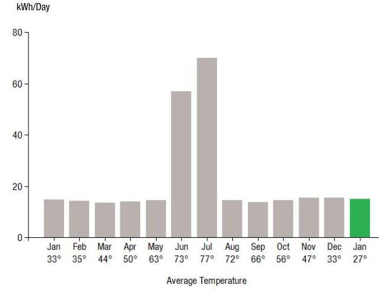
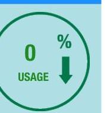
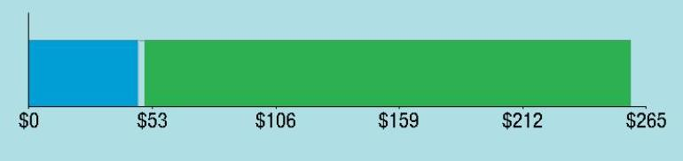
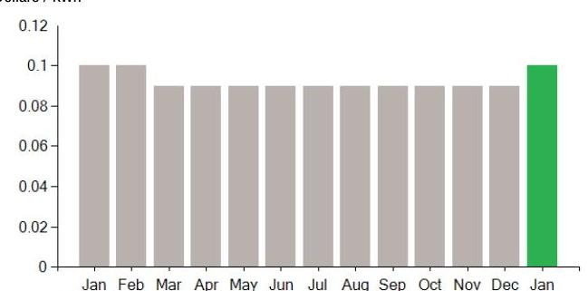
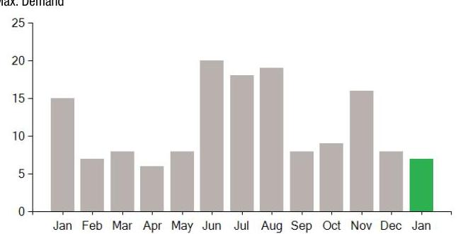

## EVERSEURCE

Account Number: 51878842046
Statement Date: 01/24/25
Service Provided To:
DUNN PAPER-EAST HARTFORD, LLC.

Electric Usage History - Kilowarth House (KWh)

The image is a bar chart.

- **Chart Type**: Bar chart
- **X-Axis**: Average Temperature (°F)
  - Labels: Jan 33°, Feb 35°, Mar 44°, Apr 50°, May 63°, Jun 73°, Jul 77°, Aug 72°, Sep 66°, Oct 56°, Nov 47°, Dec 33°, Jan 27°
- **Y-Axis**: kWh/Day
  - Range: 0 to 80
- **Data Points**:
  - Jan: ~15 kWh
  - Feb: ~15 kWh
  - Mar: ~15 kWh
  - Apr: ~15 kWh
  - May: ~15 kWh
  - Jun: ~50 kWh
  - Jul: ~70 kWh
  - Aug: ~50 kWh
  - Sep: ~15 kWh
  - Oct: ~15 kWh
  - Nov: ~15 kWh
  - Dec: ~15 kWh
  - Jan: ~15 kWh (highlighted in green)
- **Styling**: The bar for January is highlighted in green, while the others are in gray.
- **Yearly Usage Breakdown (Monthly-Based)**: The chart shows a significant increase in usage during the summer months (June, July, August) compared to the rest of the year.

## Electric Usage Summary

| This month your   average daily   electric use was   15.0 kWh | This month your   usage stayed the   same compared to   same time last year. | 

The image is a graphic illustration.

- It features a circular design with a green outline.
- Inside the circle, there is a large "0" followed by a percentage symbol ("%").
- Below the "0%", the word "USAGE" is written in green.
- There is a green downward arrow next to the text, indicating a decrease or no change in usage. |
| :--: | :--: | :--: |

## THE DOUGH AND THE EVERSED

This month your
usage stayed the same compared to
same time last year.

## 5241.85

Amount Due On 01/21/25
Last Payment Received On 01/16/25
$273.28$
Balance Forward
$0.00
Total Current Charges
$241.85

Current Charges for Electricity

| Supply | Delivery |
| :--: | :--: |
| \$47.11 | \$210.93 |
| Cost of electricity from NEXTERA ENERGY SERVICES CONN | Cost to deliver electricity from Eversource |

The image is a bar chart.

- **Chart Type**: Horizontal bar chart
- **X-Axis**: Dollar amounts
  - Labels: $0, $53, $106, $159, $212, $265
- **Bar Segments**:
  - A blue segment from $0 to $53
  - A green segment from $53 to $265
- **Styling**: The chart has a light blue background with a blue segment at the start and a larger green segment following it.

Your electric supplier is
NEXTERA ENERGY SERVICES CONN
20455 STATE HIGHWAY 249
HOUSTON TX 77070-2757
800-882-1276

# News For You 

Beginning Jan. 1, if you've chosen Eversource as your energy supplier, the Standard Service supply rate will increase compared to December. This is consistent with the typical summer to winter upward adjustment. The price of energy from power generators usually increases in the winter due to the demand for natural gas, which is used for heating and to produce roughly half of New England's electricity. To learn about programs we offer to manage your energy use and help you pay your bill this winter, visit Eversource.com/winter-bill.

Remit Payment To: Eversource, PO Box 56002, Boston, MA 02205-6002
CE. 250124PROD.TXT
Please make your check payable to Eversource and consider adding $\$ 1$ for Operation Fuel.
You can also add $\$ 2$ or $\$ 3$ when paying your bill online. $100 \%$ of your tax-deductible donation provides energy assistance grants. If mailing, please allow up to 5 business days to post.

## THE DOUGH AND THE EVERSED

Account Number: 51878842046
Non-residential and residential non-hardship customers may be subject to a $1.00 \%$ late payment charge if the "Total Amount Due" is not received by $02 / 21 / 25$.

DUNN PAPER-EAST HARTFORD, LLC.
C/O DUNN PAPER
2 FORBES ST
EAST HARTFORD CT 06108-3727

Eversource
PO Box 56002
Boston, MA 02205-6002

## EVERSEURCE

Account Number: 51878842046
Customer name key: DUNN
Statement Date: 01/24/25
Service Provided To:
DUNN PAPER-EAST HARTFORD, LLC.

| Sye Addr: 2 EIRGIES ST |  |  |  |  |  |
| :--: | :--: | :--: | :--: | :--: | :--: |
| EAST HARTFORD CT 05108 |  |  |  |  |  |
| Serv Ref: 109171007 |  |  | Bill Cycle: 16 |  |  |
| Service from 12/23/24 - 01/24/25 |  |  | 32 Days |  |  |
| Next read date on or about: Feb 24, 2025 |  |  |  |  |  |
| Meter   Number | Current   Read | Previous   Read | Current   Usage | Reading   Type |  |
| 889990392 | 33633 | 33149 | 484 | Actual |  |
| Total Demand Use $=7.10 \mathrm{~kW}$ |  |  |  |  |  |
| Monthly kWh Use |  |  |  |  |  |
| Jan | Feb | Mar | Apr | May | Jun | Jul |
| 488 | 426 | 396 | 463 | 405 | 1708 | 2308 |
| Aug | Sep | Oct | Nov | Dec | Jan |  |
| 434 | 443 | 425 | 451 | 498 | 484 |  |

## Contact Information

Emergency: 800-286-2000
www.eversource.com
Pay by Phone: 888-783-6618
Customer Service: 888-783-6617

## Total Amount Due by 02/21/25

## $241.85

## Electric Account Summary

Amount Due On 01/21/25
Last Payment Received On 01/16/25
Balance Forward
Current Charges/Credits
Electric Supply Services
Delivery Services
Other Charges or Credits
Total Current Charges
Total Amount Due

Total Charges for Electricity

## Supplier

NEXTERA ENERGY
Service Reference: 109171007
Supply
Subtotal Supplier Services

## Delivery

(DISTRIBUTION RATE: 030)
Service Reference: 109171007
Transmission Demand Chrg
Fixed Monthly Charge
Local Delivery Demand Chrg
Local Delivery Improvements
Revenue Decoupling
CTA Demand Chrg
FMCC Charge
Comb Public Benefit Chrg
Subtotal Delivery Services
Total Cost of Electricity

## $241.85

$273.28$
$-$ 273.28
\$0.00
\$47.11
\$210.93
$-$ \$16.19
\$241.85

## Total Charges for Electricity

## $247.11$

\$210.93
\$241.85

## Total Charges for Electricity

## $484.00 \mathrm{kWh} \times \$ 0.09734$

## $47.11$

\$44.12
\$44.00
\$72.52
\$18.67
\$0.94
\$0.56
\$20.44
\$9.68

Other Charges or Credits

## EVERSEURCE

Account Number: 51878842046
Customer name key: DUNN
Statement Date: 01/24/25
Service Provided To:
DUNN PAPER-EAST HARTFORD, LLC.

## Continued from previous page...

## Supply Rate

Dollars / kWh

The image is a bar chart.

- **Chart Type**: Bar chart
- **X-Axis**: Months (Jan, Feb, Mar, Apr, May, Jun, Jul, Aug, Sep, Oct, Nov, Dec, Jan)
- **Y-Axis**: Dollars / kWh (ranging from 0 to 0.12)
- **Legend/Highlight**: The bar for the second January is highlighted in green, while all other bars are in gray.
- **Data Points**: Each month has a bar representing a value slightly above 0.08, with the second January bar slightly higher, close to 0.1.
- **Yearly Usage Breakdown (Monthly-Based)**: The chart shows a consistent supply rate throughout the year with a slight increase in the second January.

## Demand Profile

Max. Demand

The image is a bar chart.

- **Chart Type**: Bar chart
- **X-Axis**: Months (Jan, Feb, Mar, Apr, May, Jun, Jul, Aug, Sep, Oct, Nov, Dec, Jan)
- **Y-Axis**: Max. Demand (ranging from 0 to 25)
- **Legend/Highlight**: The bar for the second January is highlighted in green, while all other bars are in gray.
- **Data Points**: 
  - January: ~15
  - February, March, April: ~5
  - May: ~10
  - June: ~22
  - July: ~20
  - August: ~18
  - September: ~10
  - October: ~12
  - November: ~15
  - December: ~10
  - Second January: ~7
- **Notable Styling**: The second January bar is highlighted in green, indicating a notable change or emphasis compared to the other months.

Important Messages About Your Account
Thank you for your payments during 2024. We look forward to serving you in 2025.

This meter is tax exempt

## Total Amount Due by 02/21/25

Continued from previous page...

Gross earnings tax credit on $\$ 190.49$
$-\$ 16.19$
Subtotal Other Charges or Credits
$-\$ 16.19$
Total Current Charges $\$ 241.85$

