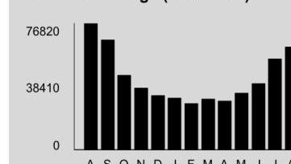

## Unit ComEd.com

Customer Service / Power Outage English
1.877.4COMED1 (1.877.426.6331)

## Español

1.800.95.LUCES (1.800.955.8237)

## Hearing/Speech Impaired

1.800.572.5789 (TTY)

Your Usage Profile
13-Month Usage (Total kWh)

The image is a bar chart.

- **Chart Type**: Bar chart
- **Axes**:
  - **Y-axis**: Labeled with values "0", "38410", and "76820".
  - **X-axis**: Labeled with months "A S O N D J F M A M J J A".
- **Data Representation**: The bars represent monthly kWh usage.
- **Yearly Usage Breakdown (Monthly-Based)**: The chart shows a breakdown of electricity usage over a 13-month period.
- **Styling**: The bars are black, and the background is gray.

Electric Usage

| Month | kWh |
| :-- | :-- |
| Aug-20 | 76816 |
| Sep-20 | 66842 |
| Oct-20 | 45255 |
| Nov-20 | 37461 |
| Dec-20 | 33102 |
| Jan-21 | 31454 |
| Feb-21 | 28233 |
| Mar-21 | 30834 |
| Apr-21 | 29620 |
| May-21 | 34534 |
| Jun-21 | 40134 |
| Jul-21 | 55306 |
| Aug-21 | 62611 |

| Month Billed | Average Daily kWh |  | Temp |
| :--: | :--: | :--: | :--: |
| Last Year | 2400.5 |  | 77 |
| Last Month | 1907.1 |  | 74 |
| Current Month | 1956.6 | 69 |  |

Page 1 of 2
Account Number 1528234023
Name
Service Location 350 W HUBBARD ST CHICAGO
Phone Number 312-595-3281

## Bill Summary

Previous Balance
Total Payments - Thank You
Amount Due on August 19, 2021
\$5,316.26
\$8,171.13

Issue Date
August 4, 2021

| Meter Information |  |  |  |  |  |  |  |  |
| :--: | :--: | :--: | :--: | :--: | :--: | :--: | :--: | :--: |
| Read   Dates | Meter   Number | Load   Type | Reading   Type | Previous | Meter Reading Present | Difference | Multiplier   $x$ | Usage |
| $\begin{aligned} & \text { T-2- } \\ & \text { 63 } \end{aligned}$ | 230159463 | General Service | Total kWh | Actual | Actual |  |  | 2576 |
| $\begin{aligned} & \text { T-2- } \\ & \text { 63 } \end{aligned}$ | 230159463 | General Service | On Pk kW | Actual | Actual |  |  | 4.01 |
| $\begin{aligned} & \text { T-3- } \\ & \text { 63 } \end{aligned}$ | 230162248 | General Service | Total kWh | Actual | Actual |  |  | 14 |
| $\begin{aligned} & \text { T-2- } \\ & \text { 63 } \end{aligned}$ | 230162248 | General Service | On Pk kW | Actual | Actual |  |  | 0.02 |
| $\begin{aligned} & \text { T-2- } \\ & \text { 63 } \end{aligned}$ | 230181800 | General Service | Total kWh | Actual | Actual |  |  | 60020 |
| $\begin{aligned} & \text { T-2- } \\ & \text { 63 } \end{aligned}$ | 230181800 | General Service | On Pk kW | Actual | Actual |  |  | 234.58 |

Service from 7/2/2021 to 8/3/2021 - 32 Days
Commercial Hourly - 100 kW to 400 kW

Electricity Supply Services
Electricity Supply Charge
289.24 kW
$X$
62,611 kWh
$X$
610086
$1,764.61$
Transmission Services Charge
62,611 kWh
$X$
0.00867
542.84

Misc Procurement Component Chg
62,611 kWh
$X$
0.00092
57.60

Purchased Electricity Adjustment

Delivery Services - ComEd
26.41

Standard Metering Charge
238.60 kW
$X$
7.66000
11.51

Distribution Facilities Charge
238.60 kW
$X$
7.66000
1,827.68

IL Electricity Distribution Charge
62,611 kWh
$X$
0.00122
76.39

For Electric Supply Choices visit
pluginillinois.org
(continued on next page)
Return only this portion with your check made payable to ComEd. Please write your account number on your check.

## ComEd.

An Exelion Company

To pay by phone call 1-800-588-9477.
A convenience fee will apply.

0104647 O1 AV 0.395 **AUTO TB 01154 60654-693925 -C05-B1-P00000-11
$\mathrm{pd} \mid \mathrm{p} \mid \mathrm{h} \mid \mathrm{h} \mathrm{l} \mid \mathrm{l} \mid \mathrm{p} \mid \mathrm{p} \mid \mathrm{p} \mid \mathrm{p} \mid \mathrm{p} \mid \mathrm{p} \mid \mathrm{p} \mid \mathrm{p} \mid \mathrm{p} \mid \mathrm{p} \mid \mathrm{l}$

KINGSBURY CENTER
C/O KATHERINE ELLIOT
350 W HUBBARD ST STE 500
CHICAGO, IL 60654-6939

PAPER
PO BOX 6111
CAROL STREAM, IL 60197-6111
To pay by phone call 1-800-588-9477.
A convenience fee will apply.

Account Number
1528234023
Payment Amount

Please pay this
amount by 8/19/2021
\$8,171.13

| $\underline{\text { Taxes and Other }}$ |  |  |  | $\$ 1,089.71$ |
| :-- | :-- | :-- | :-- | --: |
| Environmental Cost Recovery Adj | $62,611 \mathrm{kWh}$ | X | 0.00022 | 13.77 |
| Renewable Portfolio Standard | $62,611 \mathrm{kWh}$ | X | 0.00189 | 118.33 |
| Zero Emission Standard | $62,611 \mathrm{kWh}$ | X | 0.00195 | 122.09 |
| Energy Efficiency Programs | $62,611 \mathrm{kWh}$ | X | 0.00260 | 162.79 |
| Franchise Cost |  |  |  | 217.69 |
| State Tax |  |  |  | 197.93 |
| Municipal Tax |  |  |  | 257.11 |

# Total Current Charges 

$\$ 8,171.13$

Thank you for your payment of $\$ 5,316.26$ on July 21, 2021

## Total Amount Due

## Message Center

## ComEd

- THE SUPPORT TO STOP A SCAM: Sometimes knowing someone is in your corner is all you need for a little boost of confidence. If you're worried about energy scams, we have tips to keep you protected and hints on how to recognize scammers. Learn more: ComEd.com/ScamAlert.
- MYLAR BALLOONS \& POWER LINES DON'T MIX! Every year, thousands of residents across northern Illinois are affected by power outages caused by foil balloons. If a foil or Mylar balloon touches a power line, it can cause power surges or service interruptions. Keep balloons tied securely while outside! If you see a balloon, or any object, caught in a power line, do not attempt to retrieve it. Call ComEd at 1-800-EDISON-1.
- WAYS TO PAY: Looking for ways to pay your bill? Visit ComEd.com/PAY
- RESOLVING DISPUTES: The Illinois Commerce Commission Consumer Division is available at 800-524-0795 to help resolve disputes with ComEd. However, customers should contact ComEd before seeking assistance from the ICC.

