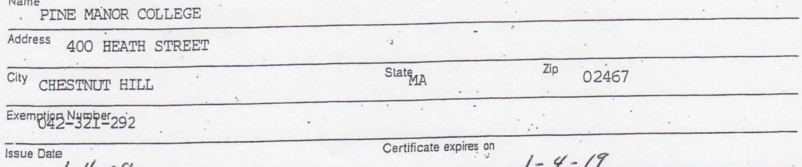
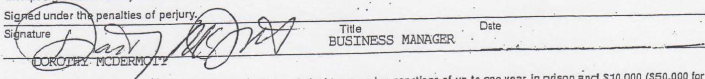
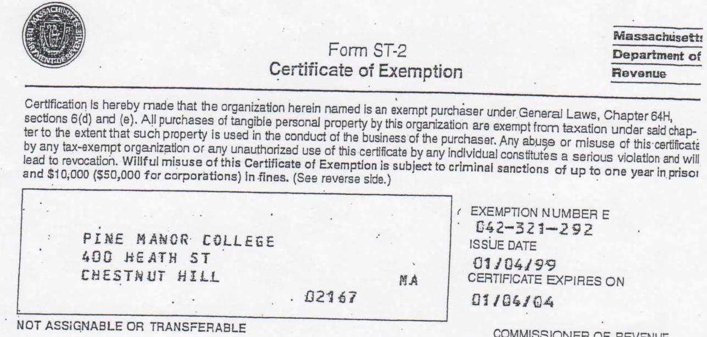

# NAVJEET K. BAL, COMMISSIONER TERESA O'BRIEN-HORAN, DEPUTY COMMISSIONER 

879C

PINE MANOR COLLEGE 400 HEATH ST CHESTNUT HILL MA 02467-2332

Notice
Exemption
Number
Date
Bureau
Phone
$30048$
$042321292$
$12 / 01 / 08$
TSD MGT SERV
(617) 887-6367

Dear Taxpayer,
A review of our records indicates that the Massachusetts sales/use tax exemption for PINE MANOR COLLEGE, a tax-exempt 501(c) (3) organization, will expire on 01/04/09.

The Department of Revenue is issuing this notice in lieu of a new Form St-2, "Certificate of Exemption". The notice verifies that the Massachusetts Department of Revenue has renewed the sales/use tax exemption for PINE MANOR COLLEGE subject to the conditions stated in Massachusetts General Laws, Chapter 64H, sections 6(d) or (e), as applicable.

The organization remains responsible for maintaining its exempt status and for reporting any loss or change of its status to the Department of Revenue. Absent the Department of Revenue's receipt of information from the taxpayer by the expiration date of the current certificate that the entity no longer holds exempt status under the above provisions, the taxpayer's certificate is renewed. This renewal will expire on 01/04/19.

The taxpayer's existing Form ST-2, in combination with this renewal notice may be presented as evidence of the entity's continuing exempt status. Provided that this requirement is met, all purchases of tangible personal property by the taxpayer are exempt from sales/use taxation under Chapter 64 H or I respectively, to the extent that such property is used in the conduct of the purchaser's business.

Any abuse or misuse of this notice by any tax-exempt organization or any unauthorized use by any individual constitutes a serious violation and will lead to revocation. Willful misuse of this notice is subject to criminal sanctions of up to one year in prison and $\$ 10,000$ in fines ( $\$ 50,000$ for corporations).

This notice may be reproduced.
Sincerely,

Navjeet K. Bal
Commissioner of Revenue

To Be Completed by Exempt Organization

The image is a photo of a form section with the following details:

- **Name:** PINE MANOR COLLEGE
- **Address:** 400 HEATH STREET
- **City:** CHESTNUT HILL
- **State:** MA
- **Zip:** 02467
- **Exemption Number:** 042-321-292
- **Issue Date:** (not fully visible)
- **Certificate expires on:** 1-4-19

Certification is hereby made that the organization named above is an exempt purchaser under Massachusetts General Lewis, Chapter 64H, sections 6 (d) or 6(e). All purchases of tangible personal property or services by this organization are exempt from taxation under said chapter to the extent that such property or services are used in the conduct of the business of the purchaser. Any abuse or misuse of this certificate by any taxexempt organization or any unauthorized use of this certificate by any individual constitutes a serious violation and will lead to revocation.

The image is a photo of a section of a form. It includes a signature line with the following details:

- **Text above the line:** "Signed under the penalties of perjury."
- **Signature:** Present but not legible.
- **Printed Name:** "DOROTHY MCDERMOTT"
- **Title:** "BUSINESS MANAGER"
- **Date:** Not filled in.

Warning: Wilful misuse of this certificate may result in criminal tax evasion sancllens of up to one year in prison and $\$ 10,000$ ( $\$ 50,000$ for corporations) in fines.

# To Be Completed by Vendor 

Vendor's name

Check applicable box: $\square$ Single Purchase Certificate $\square$ Blanket Certificate

Attach detailed receipts/involces or describe property on the back of this form.

## General Instructions

The organization or agency must have obtained a Certificate of Exemption (Form ST-2) from the Commissioner of Revenue, certifying that it is entitled to exemption and must attach a photocopy of Form ST-2 to this certificate. The vendor must retain a completed Form ST-5 accompanied by a copy of Form ST-2 in the same manner as other sales tax records. For further information regarding the requirements for retaining records, see Massachusetts Regulation 830 CMR 62C.25:1.

## Notice to Vendors

Vendors must obtain a copy of the Certificate of Exemption (Form ST-2) at the time of any sale to an exempt organization. Vendors should verify the validity of the certificate presented to them by checking the expiration date on the certificate. Vendors must not honor a Certificate of Exemption that has expired. Stable a copy of Form ST-2 to this form. NOTE: Governmental agencies maintain ST-2 Certificates of Exemption that have an expiration date of "NONE."
Vendors should call the Taxpayer Assistance Bureau at (617) 621-5251 if they have any questions regarding a Certificate of Exemption which is presented to them.
If you have any questions about completing this certificate, please contact:
Massachusetts Department of Revenue
Taxpayer Assistance Bureau
215 First Street
Cambridge, MA 02142
(617) 621-5251

The image is a photo of a document titled "Form ST-2 Certificate of Exemption" from the Massachusetts Department of Revenue. It certifies that the organization named is an exempt purchaser under General Laws, Chapter 64H, sections 6(d) and (e). The document warns against misuse, which can lead to criminal sanctions and fines.

Text on the document includes:

- "PINE MANOR COLLEGE"
- "400 HEATH ST"
- "CHESTNUT HILL"
- "MA 02167"
- "EXEMPTION NUMBER E 042-321-292"
- "ISSUE DATE 01/04/99"
- "CERTIFICATE EXPIRES ON 01/06/04"
- "NOT ASSIGNABLE OR TRANSFERABLE"

The document also features a seal and the name "MITCHELL ADAMS" as the Commissioner of Revenue.

NOT ASSIGNABLE OR TRANSFERABLE

COMMSSIONER OF REVENUE
MITCHELL ADAMS

