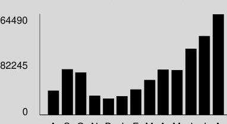

## Visit ComEd.com

Customer Service / Power Outage English
1.877.4COMED1 (1.877.426.6331)

## Español

1.800.95.LUCES (1.800.955.8237)

Hearing/Speech Impaired
1.800.572.5789 (TTY)

Your Usage Profile 13-Month Usage (Total kWh)

The image is a bar chart. 

- **Chart Type**: Bar chart
- **Axes**:
  - **Y-Axis**: No title visible, but numerical values are shown (0, 82245, 164490).
  - **X-Axis**: Labeled with months (A S O N D J F M A M J J A).
- **Data Representation**: The bars represent electric usage in kWh over a 13-month period.
- **Yearly Usage Breakdown (Monthly-Based)**: The chart visually represents the monthly electric usage, with the bars increasing in height from left to right, indicating higher usage in the later months.
- **Styling**: The bars are black against a gray background.

A S O N D J F M A M J J A

Electric Usage

| Month | kWh |
| :-- | :--: |
| Aug-21 | 39673 |
| Sep-21 | 74386 |
| Oct-21 | 69525 |
| Nov-21 | 31391 |
| Dec-21 | 27045 |
| Jan-22 | 30909 |
| Feb-22 | 41454 |
| Mar-22 | 56893 |
| Apr-22 | 73994 |
| May-22 | 73220 |
| Jun-22 | 107863 |
| Jul-22 | 128835 |
| Aug-22 | 164482 |

## Month Billed

Last Year
Last Month
Current Month
Average Daily kWh Temp
$1416.9 \quad 69$
$4442.6 \quad 72$
$5482.7 \quad 75$

## Bit Summary

Previous Balance
Total Payments - Thank You
Amount Due on August 16, 2022

## 14,517.02

$\$ 14,517.02$
$\$ 16,768.99

| Meter information |  |  |  |  |  |  |  |  |
| :--: | :--: | :--: | :--: | :--: | :--: | :--: | :--: | :--: |
| Read   Dates | Meter   Number | Load   Type | Reading   Type | Previous | Meter Reading Present | Difference | Multiplier | Usage |
| 6:29 | 230258474 | General Service | Total kWh | Actual | Actual |  |  | 121498 |
| 7:29 | 230258474 | General Service | On Pk kW | Actual | Actual |  |  | 237.44 |
| 6:29- | 230318770 | General Service | Total kWh | Actual | Actual |  |  | 27 |
| 7:29 | 230318770 | General Service | On Pk kW | Actual | Actual |  |  | 0.04 |
| 6:29- | 230340612 | General Service | Total kWh | Actual | Actual |  |  | 42956 |
| 7:29 | 230340612 | General Service | On Pk kW | Actual | Actual |  |  | 80.26 |
| 6:29- | 230340612 | General Service |  |  |  |  |  |  |
| 7:29 | 230340612 | General Service | On Pk kW | Actual | Actual |  |  | 80.26 |

Service from 6/29/2022 to 7/29/2022 - 30 Days
Commercial Hourly - 100 kW to 400 kW

Electricity Supply Services
\$17,088.82

Electricity Supply Charge
Capacity Charge
Transmission Services Charge
Misc Procurement Component Chg
Purchased Electricity Adjustment

Delivery Services - ComEd
Customer Charge
Standard Metering Charge
Distribution Facilities Charge
IL Electricity Distribution Charge

164,482 kWh
193.22 kW X X 2.03025
164,482 kWh X X 0.00892
164,482 kWh X X 0.00136
1,467.18
223.70
822.41

26.56

9.69

2,678.46
203.96

For Electric Supply Choices visit
pluginillinois.org
(continued on next page)

Return only this portion with your check made payable to ComEd. Please write your account number on your check.

## ComEd

An Exelon Company

2010620 01 AV 0.455 **AUTO T6 01150 60654-693925 -C05-B1-P00000-t1
$\|l_{1} \| l_{1} \|_{l} \|_{l} \|_{l}\left\|\|_{l} \|_{l}\|l\|_{l}\left\|_{l}\left\|_{l}\left\|_{l}\left\|_{l}\left\|_{l}\left\|_{l}\right\|_{l}\right\|_{l}\right\|_{l}\right\|_{l}\right\|_{l}\right\|_{l}\|l\|_{l}\|l\|_{l}\|l\|$

OGDEN WASHTENAW LV LLC SUITE 500
350 W HUBBARD ST CHICAGO, IL 60654-6939

To pay by phone call 1-800-588-9477.
A convenience fee will apply.

|  |  |
| :-- | :-- |
| Account Number |  |
| 1347119314 |  |
| Payment Amount |  |
|  |  |
|  |  |

Please pay this
amount by 8/16/2022
$\$ 16,768.99$

| Taxes and Other |  |  |  | $-\$ 3,475.16$ |
| :--: | :--: | :--: | :--: | :--: |
| Environmental Cost Recovery Adj | 164,482 kWh | $X$ | 0.00041 | 67.44 |
| Renewable Portfolio Standard | 164,482 kWh | $X$ | 0.00502 | 825.70 |
| Zero Emission Standard | 164,482 kWh | $X$ | 0.00195 | 320.74 |
| Carbon-Free Energy Resource Adj | 164,482 kWh | $X$ | $-0.04306$ | $-7,082.59$ |
| Energy Efficiency Programs | 164,482 kWh | $X$ | 0.00363 | 597.07 |
| Energy Transition Assistance | 164,482 kWh | $X$ | 0.00082 | 134.88 |
| Franchise Cost |  |  |  | 530.27 |
| State Tax |  |  |  | 502.73 |
| Municipal Tax |  |  |  | 628.60 |

Total Current Charges
\$16,551.24

Miscellaneous
\$217.75
Current late payment charge (s) - electric
217.75

Thank you for your payment of $\$ 14,517.02$ on July 27, 2022

Total Amount Due
\$16,768.99

# Message Center 

## ComEd

- THE SUPPORT TO STOP A SCAM: The ability to send money through mobile-pay apps like QuickPay, Zelle and Venmo makes it easier to fall for scam attempts. These apps have higher limits and are often linked to your personal bank account or credit card. Scammers claim they didn't see the transaction and ask it to be sent again - scamming you twice. Take steps to protect yourself from energy fraud. We can help with tips and hints to recognize potential scams and legitimate ComEd employees. Learn more: ComEd.Com/ScamAlert
- MYLAR BALLOONS \& POWER LINES DON'T MIX! Every year, thousands of residents across northern Illinois are affected by power outages caused by foil balloons. If a foil or Mylar balloon touches a power line, it can cause power surges or service interruptions. Keep balloons tied securely while outside! If you see a balloon, or any object, caught in a power line, do not attempt to retrieve it. Call ComEd at 1-800-EDISON-1.
(continued on next page)

## Visit ComEd.com

Customer Service / Power Outage English
1.877.4COMED1 (1.877.426.6331)

## Español

1.800.95.LUCES (1.800.955.8237)

Hearing/Speech Impaired
1.800.572.5789 (TTY)

Page 3 of 3
Account Number 1347119314

## Mescarre Center

- WAYS TO PAY: Looking for ways to pay your bill? Visit ComEd.com/PAY
- RESOLVING DISPUTES: The Illinois Commerce Commission Consumer Division is available at 800-524-0795 to help resolve disputes with ComEd. However, customers should contact ComEd before seeking assistance from the ICC.

