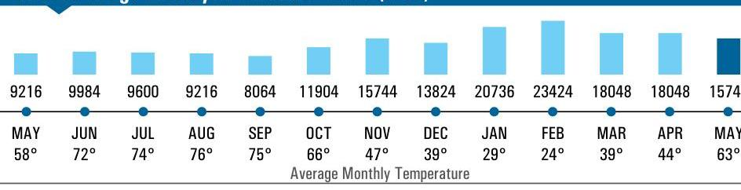
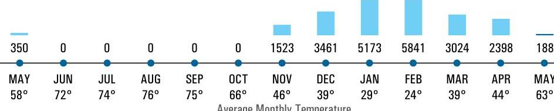

Account Number Customer Name Service Address

1487102050
MIDSTATE MANUFACTURING
998 W 4TH ST
GALESBURG, IL 61401

## Current Charge Summary for Statement 05/24/2022

Total Electric Charge
Total Gas Charge

$1,552.10
\$563.95$

Subtotal Current Charges
Total Amount Due
$2,116.05

## Electric Usage History in Kilowart Hours (kWh)

The image is a bar chart showing the **yearly usage breakdown (monthly-based)** for electric usage in kilowatt hours (kWh) along with average monthly temperatures.

- **X-axis (Months and Temperatures):**
  - MAY: 9216 kWh, 58°
  - JUN: 9984 kWh, 72°
  - JUL: 9600 kWh, 74°
  - AUG: 9216 kWh, 76°
  - SEP: 8064 kWh, 75°
  - OCT: 11904 kWh, 66°
  - NOV: 15744 kWh, 47°
  - DEC: 13824 kWh, 39°
  - JAN: 20736 kWh, 29°
  - FEB: 23424 kWh, 24°
  - MAR: 18048 kWh, 39°
  - APR: 18048 kWh, 44°
  - MAY: 15744 kWh, 63°

- **Y-axis:** Represents electric usage in kilowatt hours (kWh).

- **Styling:** The bars are in varying shades of blue, with each month having a corresponding bar height representing the kWh usage. The temperatures are listed below each month.

## Average Daily Electric Use (kWh)

| TIME PERIOD | AVG. DAILY USE |
| :-- | :-- |
| CURRENT MONTH | 507.87 kWh |
| LAST MONTH | 601.60 kWh |
| LAST YEAR | 317.79 kWh |

## Gas Usage History in Therm

The image is a bar chart.

- **Chart Type:** Bar chart
- **X-axis (Months and Temperatures):**
  - MAY: 350, 58°
  - JUN: 0, 72°
  - JUL: 0, 74°
  - AUG: 0, 76°
  - SEP: 0, 75°
  - OCT: 0, 66°
  - NOV: 1523, 46°
  - DEC: 3461, 39°
  - JAN: 5173, 29°
  - FEB: 5841, 24°
  - MAR: 3024, 39°
  - APR: 2398, 44°
  - MAY: 188, 63°

- **Y-axis:** Represents gas usage in Therm.
- **Styling:** Bars are in blue, with each month having a corresponding bar height representing the gas usage in Therm. The temperatures are listed below each month.

| 350 | 0 | 0 | 0 | 0 | 0 | 1523 | 3461 | 5173 | 5841 | 3024 | 2398 | 188 |
| :-- | :-- | :-- | :-- | :-- | :-- | :-- | :-- | :-- | :-- | :-- | :-- | :-- |
| MAY | JUN | JUL | AUG | SEP | OCT | NOV | DEC | JAN | FEB | MAR | APR | MAY |
| $58^{\circ}$ | $72^{\circ}$ | $74^{\circ}$ | $76^{\circ}$ | $75^{\circ}$ | $66^{\circ}$ | $46^{\circ}$ | $39^{\circ}$ | $29^{\circ}$ | $24^{\circ}$ | $39^{\circ}$ | $44^{\circ}$ | $63^{\circ}$ |

See page 2 for account messages and tips from Ameren Illinois.
Page 1 of 4
Please detach stub and return this portion with your payment.

| Account Number | 1487102050 |
| :-- | :-- |
| Amount Due | $\$ 2,116.05$ |
| Due Date | 06/07/2022 |
| Amount Enclosed |  |

>003030 20723b8 00b2 092139 102
MIDSTATE MANUFACTURING
750 W 3RD ST
GALESBURG, IL 61401-5829

AMEREN ILLINOIS
PO BOX 88034
CHICAGO IL 60680-1034

# (1) Account Messages from Ameren Illinois 

Auto Pay makes paying bills easier. To learn more or enroll, please visit AmerenIllinois.com/AutoPay.

## Safety Messages from Ameren Illinois

Important Message for Gas Customers - Be Safe If you ever smell gas, call Ameren Illinois at 1.800.755.5000 to investigate the problem. We respond to gas odors 24 hours a day, 7 days a week and there is no charge.

Put safety first when tackling those outdoor home and yard projects! Working near electrical wires or equipment can be extremely dangerous, so never use tall ladders or long tools around power lines.

## 2 Tips from Ameren Illinois

Incentives for custom or unique energy efficient upgrades have increased by 30\%! Visit AmerenIllinoisSavings.com/Custom to learn more or submit an application.

Questions? Contact Ameren Illinois at 1.800.232.2477 or visit Ameren.com/Illinois/contact-us to connect with customer service online. * Please contact your utility provider for assistance before calling the Illinois Commerce Commission (ICC) at 1.800.524.0795.

Address Update

ADDRESS
CITY, STATE, ZIP
PHONE NUMBER

## Ways to Pay

The image is a photo/illustration showing different ways to pay a bill. It includes icons and text for each payment method:

1. **Online E-Check**: An icon of a check with a dollar sign.
2. **Phone**: An icon of a phone with the number "888.777.3108".
3. **In Person**: An icon of a person with the text "FIND A PAY STATION AT AMERENILLINOIS.COM/PAYSTATION".
4. **Online Credit Card**: An icon of a credit card.
5. **Mail**: An icon of an envelope with the text "STUB & CHECK". 

The icons are arranged in a horizontal line, each with its corresponding text below or beside it.

| 4 Ameren | f AmerenIllinois.com Customer Service 1.800.232.2477 | Statement Issued | 05/24/2022 |
| :--: | :--: | :--: | :--: |
| ILLINOIS |  | Amount Due | \$2,116.05 |
| Account Number | 1487102050 | Due Date | Jun 7, 2022 |
| Customer Name Service Address | MIDSTATE MANUFACTURING 998 W 4TH ST   GALESBURG, IL 61401 |  |  |

# Payment Details 

DATE
AMOUNT
Payment Received
May 9, 2022
\$4,561.48
Electric Service Non Residential Billing Detail - Rate Zone III
04/21/2022 - 05/22/2022 (31 days)

| EIER NUMBER | CURRENT METER READ | PREVIOUS METER READ | READ DIFFERENCE | MULTIPLIER | USAGE |
| :--: | :--: | :--: | :--: | :--: | :--: |
| 72305884 | 959.0000 Actual | 918.0000 Actual | 41.0000 | 384.0000 | 15744.0000 |

## Usage Summary

Total kWh
15744.0000 Non-Summer kWh
15744.0000

Smart Meter

|  | CHARGE DESCRIPTION | USAGE | UNIT | RATE | CHARGE |
| :--: | :--: | :--: | :--: | :--: | :--: |
| Electric Delivery | Customer Charge |  |  |  | \$19.88 |
| Ameren Illinois | Meter Charge |  |  |  | \$7.03 |
| DS-2 Small General Delivery | Distribution Delivery Charge Non-Summer | 2,000.00 kWh | @ \$ 0.02768000 |  | \$55.36 |
| Service | Distribution Delivery Charge Non-Summer | 13,744.00 kWh | @ \$ 0.01418000 |  | \$194.89 |
|  |  |  | Electric Delivery |  | \$277.16 |
| Electric Supply | Purchased Electric Non-Summer | 2,000.00 kWh | @ \$ 0.04724000 |  | \$94.48 |
| Ameren Illinois | Purchased Electric Non-Summer | 13,744.00 kWh | @ \$ 0.04724000 |  | \$649.27 |
| BGS-2 Basic Generation | Purchased Electricity Adjustment | 15,744.00 kWh | @ \$ 0.00070611 |  | \$11.12 |
| Service | Supply Cost Adjustment | 15,744.00 kWh | @ \$ 0.00072000 |  | \$11.34 |
|  | Transmission Service Charge | 15,744.00 kWh | @ \$ 0.01261000 |  | \$198.53 |
|  |  |  | Electric Supply |  | \$942.50 |
| State and Local Taxes and Other Mandated Charges | Customer Generation Charge |  |  |  | \$0.32 |
|  | Clean Energy Assistance Charge | 15,744.00 kWh | @ \$ 0.00181000 |  | \$28.50 |
|  | Renewable Energy Adjustment* | 15,744.00 kWh | @ \$ 0.00458000 |  | \$72.11 |
|  | EDT Cost Recovery | 15,744.00 kWh | @ \$ 0.00124840 |  | \$19.65 |
|  | Electric Environmental Adjustment | 15,744.00 kWh | @ \$ 0.00153710 |  | \$24.20 |
|  | Energy Efficiency Programs Charge | 15,744.00 kWh | @ \$ 0.00360000 |  | \$56.68 |
|  | Energy Transition Assistance Charge* | 15,744.00 kWh | @ \$ 0.00072000 |  | \$11.34 |
|  | Galesburg Municipal Tax |  |  |  | \$69.20 |
|  | Illinois State Electricity Excise Tax |  |  |  | \$50.44 |
|  |  | Total Taxes and Other Charges |  |  | \$332.44 |

[^0]
[^0]:    *Includes mandated charges and programs, and other changes resulting
    $1552.10$ from the 2021 state energy law.

# Details From Your Electric Supplier 

For more information about your electric supply choices, visit www.pluginIllinois.org.

| Gas Service Non Residential Billing Detail - Rate Zone III |  |  |  |  | 04/21/2022 - 05/20/2022 (29 days) |  |
| :--: | :--: | :--: | :--: | :--: | :--: | :--: |
| Gas Meter Read for 04/21/2022 - 05/20/2022 (29 days) |  |  |  |  |  |  |
| READ TYPE | METER NUMBER | CURRENT METER READ PREVIOUS METER READ |  | READ DIFFERENCE MULTIPLIER |  | $\begin{gathered} \text { USAGE } \\ 188.0900 \end{gathered}$ |
| Total Therm | 01244685 | 33669.0000 Actual | 33500.0000 Actual |  | 169.0000 |  |
| Usage Summary |  |  |  |  |  |  |
| Total Therms |  |  |  |  |  |  |

Smart Meter

|  | CHARGE DESCRIPTION |  | USAGE | UNIT |  | RATE | CHARGE |
| :--: | :--: | :--: | :--: | :--: | :--: | :--: | :--: |
| Gas Delivery | Customer Charge |  |  |  |  |  | \$327.64 |
| Ameren Illinois | Distribution Delivery Charge |  | 188.09 | Therms | @ | \$ 0.23786000 | \$44.74 |
| GDS-3 Intermediate Gas | Qualifying Infrastructure Plant Surchg |  | \$369.21 |  | @ | 6.230000\% | \$23.00 |
| Delivery Space Heat | Invested Capital Tax Adjustment |  | \$369.21 |  | @ | 1.080000\% | \$3.99 |
|  |  |  |  |  | Gas Delivery | \$399.37 |  |
| Gas Supply   Ameren Illinois | Purchased Gas Adjustment Charge |  | 188.09 | Therms | @ | \$ 0.69538512 | \$130.79 |
|  |  |  |  |  | Gas Supply | \$130.79 |  |
| State and Local Taxes and Other Mandated Charges | Energy Efficiency Programs Charge |  | 188.09 | Therms | @ | $\$ 0.01413000$ | \$-2.66 |
|  | Gas Environmental Adjustment |  | 188.09 | Therms | @ | \$ 0.02148750 | \$4.04 |
|  | Illinois State Gas Revenue Tax |  |  |  |  |  | \$4.51 |
|  | Illinois State Commerce Commission Tax |  |  |  |  |  | \$0.53 |
|  | Galesburg Municipal Gross Revenue |  |  |  |  |  | \$27.37 |
|  |  |  | Total Taxes and Other Charges |  |  |  | \$33.79 |

Total Gas Charges $\$ 563.95$

