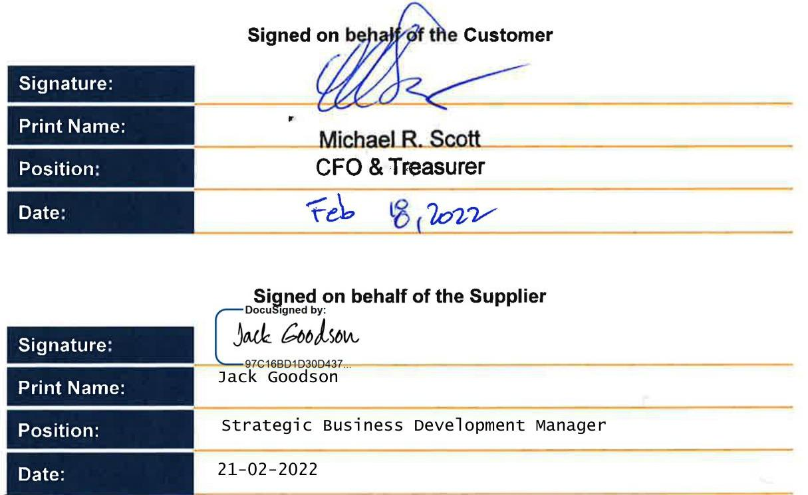
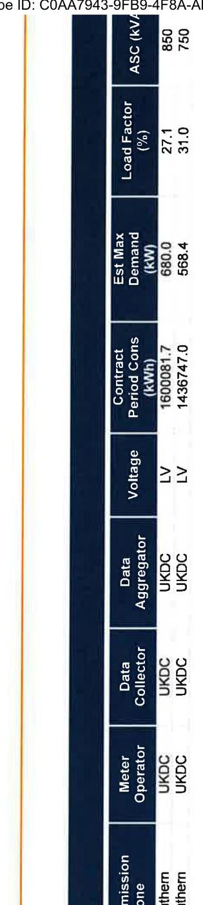
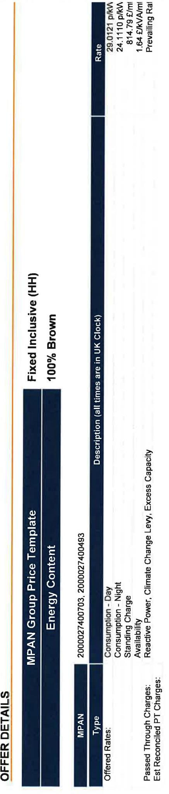

# Corona Energy Electricity Supply Contract 

PARTICULARS OF CONTRACT

| Customer Name: | H+S Aviation Limited |
| :-- | :-- |
| Customer Address: | Airport Service Road |
|  | Portsmouth |
|  | Hampshire |
|  | PO3 5PJ |
| Company/Charity Registration |  |
| Number: | Registered in England Number: 422128 |
| Contract Reference: | 208549-29/1 |
| Customer Reference: | 60074388 |
| Start Date: | $25 / 02 / 2022$ |
| End Date: | $31 / 01 / 2023$ |
| Product: | KAM Fixed 1 |
| Number of Sites: | 2 (as detailed in Proposal Details Section) |
| Payment Terms: | 21 |
| Payment Method: | BACS Transfer |

# TERMS AND CONDITIONS 

The Corona Energy Electricity Supply Contract is subject to the acceptance of Corona Energy's Terms and Conditions relating to the Product stated on Page 1 of this document.

Please be aware any Products that relate to an SME Product agreement; if termination has not been served by either party 30 days before the End Date, we will automatically renew your supply for a further twelve month period.

Corona Energy has the right to withdraw this offer at any time prior to issuing written confirmation that the agreement has been accepted on these terms. If the contract is terminated early, additional charges may apply, please ensure you are familiar with all clauses relating to Termination, Change of Ownership/Isolation, Liability and Force Majeure; all of which are highlighted in bold within the terms and conditions.

Our prices are subject to VAT \& Climate Change Levy, signed acceptance, credit approval and successful transfer of the supply point on the agreed start date in the event of a new business supply

The supply contract is a legal document, and as such is binding on both parties once entered into.

The image is a photo of a document with signature sections for both the customer and the supplier.

- **Signed on behalf of the Customer**
  - **Signature:** [Signature present]
  - **Print Name:** Michael R. Scott
  - **Position:** CFO & Treasurer
  - **Date:** Feb 18, 2022

- **Signed on behalf of the Supplier**
  - **DocuSigned by:** Jack Goodson
  - **Signature:** [Signature present]
  - **Print Name:** Jack Goodson
  - **Position:** Strategic Business Development Manager
  - **Date:** 21-02-2022

[^0]
[^0]:    Corona Energy, PO BOX 4934, Slough, SL1 5JQ.
    108008048589 e powercs@coronaenergy.co.uk w www.coronaenergy.co.uk
    Corona Energy Retail 4 Limited. Registered Office: Building 2, Croxley Park, Watford, Registered in England and Wales. Company registration number: 02798334.

The image is a photo of a table with the following text:

- **ASC (kV):** 850, 750
- **Load Factor (%):** 27.1, 31.0
- **Est Max Demand (kW):** 680.0, 568.4
- **Contract Period Cons (kWh):** 1680081.7, 1436747.0
- **Voltage:** LV, LV
- **Data Aggregator:** UKDC, UKDC
- **Data Collector:** UKDC, UKDC
- **Meter Operator:** UKDC, UKDC
- **Transmission System Operator:** Northern, Northern

The table is oriented vertically, with each category listed on the left and corresponding values on the right.

Corona Energy, PO BGX 4934, Slough, SLT GJQ,
168008048589 e powercellcoronaenergy.co.uk $\quad$ www.coronaenergy.co.uk Corona Energy Retail 4 Limited. Registered Office: Building 2, Crooley Park, Watford. . Registered in England and Wales. Company registration number: 02798334.

The image is a photo or illustration of a document with a table layout. It contains the following text:

- OFFER DETAILS
- MPAN Group Price Template
- Fixed Inclusive (HH)
- 100% Brown
- Energy Content
- Rate
- 29.0121 p/kWh
- 24.1110 p/kWh
- 814.79 £/mth
- 1.64 £/kVA/mth
- Prevailing Rate
- Description (all times are in UK Clock)
- MPAN
- Type
- 2000027400703
- 2000027400493
- Offered Rates
- Consumption - Day
- Consumption - Night
- Standing Charge
- Availability Charge
- Reactive Power
- Passed Through Charges:
- Climate Change Levy, Excess Capacity
- Est Reconciled PT Charges:

The table is organized with headings and corresponding data entries. The text is oriented vertically.

# TERMINOLOGY 

| Activity/Form | Meaning |
| :--: | :--: |
| MPAN | Meter Point Administration Number - a 13 digit unique reference for your supply point. |
| SSC | Standard Settlement Configuration - for meters that do not take half hourly measurements of consumption this is a 4 digit code that represents the periods of use that your meter is capable of measuring. This will not be displayed for half hourly meters. |
| Site | A geographic location in the United Kingdom. |
| Price Group | A grouping of the supplies for which you are being provided a quotation based on their sharing the same pricing template, rate structure and energy content. |
| Offered Rates | These are the rates that are being offered to you. |
| Passed Through Charges | These are rates that we are either directly charged for your supply (e.g. Distribution costs) or are charged on billed values (e.g. CCL and VAT). These charges will be passed onto you and charged in addition to the "Offered Rates". |
| Est Reconciled PT Charges | Estimated Reconciled Passed-Through Charges - these are Pass-Through charges for which the amount is not known until after the event e.g. TNUsS TRIAD rates. We will charge an estimated amount, based on your forecast usage, up until the actual amount is known and at this point a reconciliation will be performed. The difference between the estimated charges that have been charged up until this point and the actual amount due is calculated by the reconciliation and is then included on your next bill. |
| Estimated Annual Cons (kWh) | An estimate of the amount of electricity that will be used over the next annual period. The value is expressed in kWh and it is based on this prediction of your use that this quote has been provided. If you believe the value displayed is not an accurate estimation of your predicted use please let us know. |
| Contract Period Cons (kWh) | The estimated total consumption over the contract term for an individual supply point on the basis of which the offered rates have been calculated. |
| Est Max Demand (kW) | An estimation of the maximum demand that will be applicable for a supply. |
| Load Factor (\%) | A ratio of the average load on the supply point divided by the peak load. |
| ASC (kVA) | Available Supply Capacity. The amount of electricity that the Distribution Network Operator (DNO) makes available for use through your supply. |
| Metering Point | The term Metering Point relates to the electricity usage at your meter point. Due to losses over the transmission and distribution networks the energy actually used at a meter point is less than the total energy that needs to be generated in order to supply it to you. |
| Grid Supply Point | The term Grid Supply Point relates to the volume of electricity that needs to be delivered to the grid supply point in order to then be distributed to your supply to provide the metering point consumption. The Grid Supply Point consumption is the sum of the Metering Point consumption and distribution losses. |
| Notional Balancing Point | The term Notional Balancing Point relates to the volume of electricity that needs to be generated in order to transmit and distribute the electricity to supply and provide the Metering Point consumption. The Notional Balancing Point consumption is the sum of the Metering Point consumption, distribution losses and transmission losses. |

## MARKET PARTICIPANTS

| Participant Code | Role | Trading As |
| :--: | :--: | :--: |
| SOUT | Distributor | SSE Power Distribution |
| UKDC | Meter Operator | IMServ Europe Ltd |
| UKDC | Data Collector | IMServ Europe Ltd |
| UKDC | Data Aggregator | IMServ Europe Ltd |

