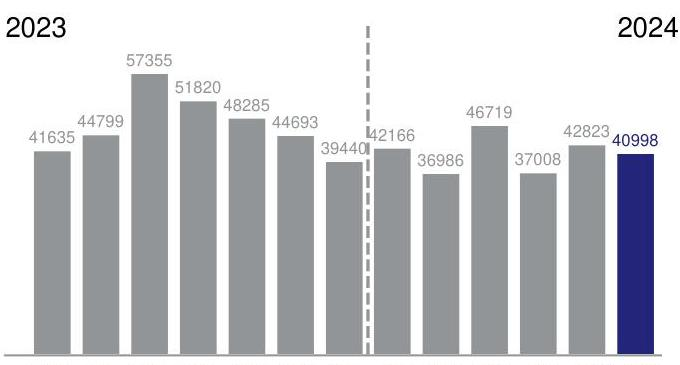
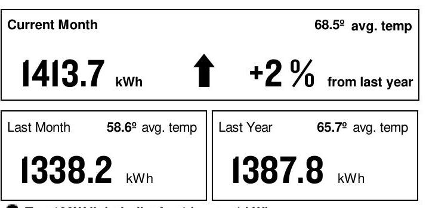
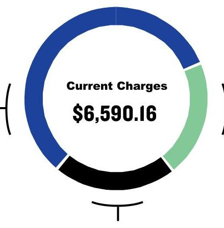

AN EXELON COMPANY
SERVICE FROM 5/7/24 THROUGH 6/5/24 (29 DAYS) Retail Delivery Service - 100 kW to 400 kW

Hssv LLC
164 E Grand Ave *Bldg Chicago, IL 60611
(847) 525-8452

## TOTAL USAGE (kWh)

The image is a bar chart showing a yearly usage breakdown (monthly-based) of electricity consumption in kilowatt-hours (kWh) for the years 2023 and 2024. 

- **2023 Data Points:**
  - January: 41,635 kWh
  - February: 44,799 kWh
  - March: 57,355 kWh
  - April: 51,820 kWh
  - May: 48,285 kWh
  - June: 44,693 kWh
  - July: 39,440 kWh
  - August: 42,166 kWh

- **2024 Data Points:**
  - September: 36,986 kWh
  - October: 46,719 kWh
  - November: 37,008 kWh
  - December: 42,823 kWh
  - January: 40,998 kWh

The chart uses gray bars for most months, with the bar for June 2024 highlighted in blue. A dashed vertical line separates the data for 2023 and 2024.

JUN JUL AUG SEP OCT NOV DEC JAN FEB MAR APR MAY JUN Current month's reading is Actual.

## Payment Deducted on 6/21/24 \$6,590.16

Thank you for your payments totaling \$6,960.24.

## AVERAGE DAILY USE (monthly usage/days in period)

The image is a section of a utility bill showing electricity usage statistics.

- **Current Month**: 
  - Usage: 1413.7 kWh
  - Average Temperature: 68.5º
  - Change: +2% from last year
  - An upward arrow indicates an increase.

- **Last Month**: 
  - Usage: 1338.2 kWh
  - Average Temperature: 58.6º

- **Last Year**: 
  - Usage: 1387.8 kWh
  - Average Temperature: 65.7º

The layout includes a larger box for the current month at the top, with two smaller boxes below for last month and last year.

Ten 100W light bulbs for 1 hour $=1 \mathrm{kWh}$

## CURRENT CHARGES SUMMARY

See reverse side for details

## SUPPLY

\$3,816.54

## Freepoint Energy Solutions provides

your energy.
1.713.239.8000

For Electric Supply Choices visit pluginillinois.org

The image is a circular chart illustrating the breakdown of current charges.

- **Center Text**: "Current Charges $6,590.16"
- The circle is divided into segments with different colors:
  - A blue segment
  - A green segment
  - A black segment

The segments are evenly spaced around the circle, but specific values or labels for each segment are not provided.

TAXES \& FEES \$1,424.21

Return only this portion with your check made payable to ComEd. Please write your account number on your check.

## comed

AN EXELON COMPANY

2100148 01 AV 0.507 **AUTO T1 01122 60654-442199 -C06-00-P00000-I 2 |||||||||||||||||||||||||||||||||||||||||||||||||||||||||||||||||||||||||||||||||||

HSSV LLC
STE 009
414 N ORLEANS ST
CHICAGO, IL 60654-4421

| 11111111111111111111111111111111111111111111111111111111111111111111111111111111111111111111111111111111111111111111111111111111111111111111111111111111111111111111111111111111111111111111111111111111

For Questions, Support, and Outages visit ComEd.com

English
Español
Hearing/Speech Impaired
Federal Video Relay Services (VRS)
I.877.4COMEDI (I.877.426.633I)
I.800.95.LUCES (I.800.955.8237)
I.800.572.5789 (TTY)

Fedvrs.us/session/new

## 1

SERVICE ADDRESS 164 E Grand Ave *Bldg Chicago, IL 60611

Electric Choice ID: 0647674740 Electric Choice ID: 0642444696

# METER INFORMATION 

| Read Dates | Meter Number | Load Type | Reading Type | Previous | Present | Difference | Multiplier | Usage |
| :--: | :--: | :--: | :--: | :--: | :--: | :--: | :--: | :--: |
| 5/7-6/5 | 230204022 | General Service | Off Pk kW | Actual | Actual |  |  | 106.08 |
| 5/7-6/5 | 230204022 | General Service | On Pk kW | Actual | Actual |  |  | 104.81 |
| 5/7-6/5 | 230204022 | General Service | Total kWh | Actual | Actual |  |  | 40998 |
| CHARGE DETAILS |  |  |  | Municipal Tax |  |  |  | \$173.23 |
| Retail Delivery Service - 100 kW to 400 kW 5/7/24 - 6/5/24 (29 Days) |  |  |  | Service Period Total |  |  |  | \$6,590.16 |
| SUPPLY - FREEPOINT ENERGY SOLUTIONS |  | \$3,816.54 |  | MISCELLANEOUS |  |  |  | \$0.00 |
| ENERGY CHAR: 40998@.0899 PER KWH |  |  | \$3,683.67 | Charges/Credits from previous bill |  |  |  | \$6,960.24 |
| TRANSMISSION CHARGE |  |  | \$132.87 | Thank You for Your Payment of \$6,960.24 on May 23, 2024 |  |  |  |  |
| DELIVERY - ComEd |  |  | \$1,349.41 | Total Amount Due |  |  |  | \$6,590.16 |
| Customer Charge |  |  |  | $\$ 28.90$ | UPDATES |  |  |  |
| Standard Metering Charge |  |  |  | $\$ 11.31$ |  |  |  |  |
| Distribution Facility Charge |  | 104.81 kW X 12.01000 |  | \$1,258.77 |  |  |  |  |
| IL Electricity Distribution Charge |  | 40,998 kWh X 0.00123 |  | \$50.43 |  |  |  |  |
| TAXES \& FEES |  |  | \$1,424.21 |  |  |  |  |  |
| Environmental Cost Recovery Adj |  | 40,998 kWh X 0.00033 |  | \$13.53 |  |  |  |  |
| Renewable Portfolio Standard |  | 40,998 kWh X 0.00502 |  | \$205.81 |  |  |  |  |
| Zero Emission Standard |  | 40,998 kWh X 0.00195 |  | \$79.95 |  |  |  |  |
| Carbon-Free Energy Resource Adj |  | 40,998 kWh X 0.00880 |  | \$360.78 |  |  |  |  |
| Energy Efficiency Programs |  | 40,998 kWh X 0.00691 |  | \$283.30 |  |  |  |  |
| Energy Transition Assistance |  | 40,998 kWh X 0.00072 |  | \$283.52 |  |  |  |  |
| Franchise Cost |  |  |  | $\$ 147.09$ |  |  |  |  |
| State Tax |  |  |  | $\$ 131.00$ |  |  |  |  |

## A VARIETY OF METHODS TO PAY YOUR BILL

Visit ComEd.com/PAY for more information including applicable fees for some transactions.

Online

Set up an automatic payment, enroll in paperless billing, or make a convenience payment at ComEd.com/Pay.

## Mobile App

Download the ComEd mobile app on your Appleffi or Android ${ }^{\text {TM }}$ device to view and pay your bill, or manage your account.

## Phone

Call us to make a convenience payment with a credit card, ATM card, or your bank account: 1.800.588.9477.

Pay your bill in-person at many ComEd authorized agents located throughout the region. Visit ComEd.com/Pay for details.

- POWERLINE SAFETY: Water and electricity don't mix - that's why it's important to be aware of your surroundings and watch out for electrical hazards when working or playing around water recreation areas. Look for overhead power lines before performing activities such as casting a fishing line, using a pool skimming tool or raising a boat mast, and NEVER swim around docks with electrical equipment or boats plugged into shore power. Always keep yourself or any conductive material a minimum of 10 feet away from any power line. Call 1-800-Edison-1 before working near power lines. Learn more at ComEd.com/Safety.
- THE SUPPORT TO STOP A SCAM: The ability to send money through mobile-pay apps linked to your personal bank account or credit card like QuickPay, Zelle and Venmo make it easier to fall for scam attempts. Scammers claim they didn't see the transaction and ask it to be sent again - scamming you twice. Take steps to protect yourself from energy fraud. We can help with tips and hints to recognize potential scams and legitimate ComEd employees. Learn more: ComEd.Com/ScamAlert
- WAYS TO PAY: Looking for ways to pay your bill? Visit ComEd.com/PAY
- ILLINOIS COMMERCE COMMISSION CONSUMER DIVISION: The Consumer Services Division is available at 800-524-0795 to help resolve disputes with ComEd. However, customers should contact ComEd before seeking assistance from the ICC.

