## UnitComEd.com

Customer Service / Power Outage English
1.877.4COMED1 (1.877.426.6331)

## Español

1.800.95.LUCES (1.800.955.8237)

Hearing/Speech Impaired
1.800.572.5789 (TTY)

Your Usage Profile
13-Month Usage (Total kWh)
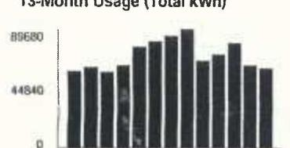

The image is a bar chart titled "13-Month Usage (Total kWh)." 

- **Y-axis**: The scale is marked with values 0, 44840, and 89680.
- **X-axis**: Displays months labeled as A, S, O, N, D, J, F, M, A, M, J, J, A.
- **Bars**: Represent monthly electricity usage in kWh over a 13-month period.
- **Yearly usage breakdown (monthly-based)**: The bars show varying heights, indicating different levels of electricity consumption each month. The highest bar appears around the middle months, suggesting peak usage during that period.

A S O N D J F M A M J J A

| Electric Usage |  |
| :-- | :-- |
| Month | kWh |
| Aug-16 | 58162 |
| Sep-16 | 60950 |
| Oct-16 | 57664 |
| Nov-16 | 62445 |
| Dec-16 | 76343 |
| Jan-17 | 80241 |
| Feb-17 | 84556 |
| Mar-17 | 89671 |
| Apr-17 | 65934 |
| May-17 | 70571 |
| Jun-17 | 75399 |
| Jul-17 | 62553 |
| Aug-17 | 60438 |

| Average Daily |  |  |  |  |  |  |  |  |
| :--: | :--: | :--: | :--: | :--: | :--: | :--: | :--: | :--: |
| Month Billed | kWh | Temp. |  |  |  |  |  |  |
| Last Year | 1938.7 | 75 |  |  |  |  |  |  |
| Last Month | 2157.0 | 72 |  |  |  |  |  |  |
| Current Month | 2014.6 | 74 |  |  |  |  |  |  |

| Bill Summary |  |  |
| :--: | :--: | :--: |
| Previous Balance |  | \$4,766.56 |
| Total Payments - Thank You |  | \$4,766.56 |
| Amount Due on August 15, 2017 |  | \$4,315.83 |

Issue Data July 31, 2017

| Meter Information |  |  |  |  |  |  |  |  |
| :--: | :--: | :--: | :--: | :--: | :--: | :--: | :--: | :--: |
| Read   Dates | Meter   Number | Load   Type | Reading   Type | Previous | Meter Reading   Present | Difference | Multiplier   $\times$ | Usage |
| $\begin{aligned} & 929- \\ & 1028 \end{aligned}$ | 230183277 | General Service | Total kWh | Actual | Actual |  |  | 60438 |
| $\begin{aligned} & 928- \\ & 1028 \end{aligned}$ | 230182277 | General Service | On Pk kW | Actual | Actual |  |  | 89.81 |

Service from 6/28/2017 to 7/28/2017 - 30 Days Commercial Hourly - 100 kW to 400 kW

Electricity Supply Services
\$2,753.18

| Electricity Supply Charge | 60,438 kWh |  |  | 1,926.37 |
| :--: | :--: | :--: | :--: | :--: |
| Transmission Services Charge | 60,438 kWh | X | 0.00844 | 510.10 |
| Capacity Charge | 105.18 kW | X | 4.69477 | 493.80 |
| Purchased Electricity Adjustment |  |  |  | $-243.57$ |
| Misc Procurement Component Chg | 60,438 kWh | X | 0.00110 | 66.48 |
| Delivery Services - ComEd |  |  |  | \$733.61 |
| Customer Charge |  |  |  | 24.55 |
| Standard Metering Charge |  |  |  | 29.14 |
| Distribution Facilities Charge | 89.81 kW | X | 6.79000 | 609.81 |
| IL Electricity Distribution Charge | 60,438 kWh | X | 0.00116 | 70.11 |
| Taxes and Other |  |  |  | \$829.04 |
| Environmental Cost Recovery Adj | 60,438 kWh | X | 0.00005 | 3.02 |
| Renewable Portfolio Standard | 60,438 kWh | X | 0.00094 | 56.81 |
| Zero Emission Standard | 60,438 kWh | X | 0.00195 | 117.85 |
| For Electric Supply Choices visit pluginillinois.org |  |  |  | (continued on next page) |

Return only this portion with your check made payable to ComEd. Please write your account number on your check.

## ComEd.

An Fation Company
To pay by phone call 1-800-588-9477.
A convenience fee will apply.

| 01019/201 AV 0.370 **AUTO 7901151 60816-173099 -C05-B1-P01973-11 |
| :--: |
|  |  |
| THE HABITAT CO LG GRV HSE |
| ATTN: MGMT OFC |
| 2001 S MICHIGAN AVE |
| CHICAGO, IL 60616-1735 |

Account Number
4035256005
Payment Amount

Please pay this
amount by $\$ / 15 / 2017$
\$4,315.83
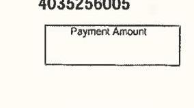

The image is a photo of a section of a document. It contains the following text:

- "4035256005"
- "Payment Amount"

There is a rectangular box below the text "Payment Amount."

## ComEd

An Ecelan Company

## Visit ComEd.com

Customer Service / Power Outage
English
1.8774COMED1 (1.877.426.6331)

## Español

1.800.95 LUCES (1.800.955.8237)

Hearing/Speech Impaired
$1.800 .572 .5789$ (TTY)

Your Usage Profile 13-Month Usage (Total kWh)

96356
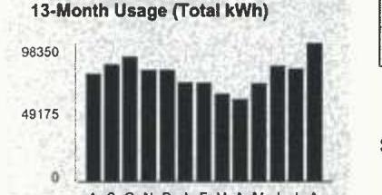

The image is a bar chart.

- **Title**: 13-Month Usage (Total kWh)
- **Y-Axis**: 
  - Title: Not explicitly labeled
  - Units: kWh
  - Scale: 0 to 98350, with a midpoint at 49175
- **X-Axis**: 
  - Labels: A S O N D J F M A M J J A
- **Data Representation**: 
  - Bars represent monthly electricity usage in kWh.
  - The bars vary in height, with the highest bar reaching close to 98350 kWh.
- **Notable Styling**: 
  - The bars are uniformly colored in black.
  
This chart provides a **yearly usage breakdown (monthly-based)** of electricity consumption over a 13-month period.

A S O N G J F M A M J J A

Electric Usage

| Month | kWh |
| :-- | :-- |
| Aug-16 | 76519 |
| Sep-16 | 82932 |
| Oct-16 | 86686 |
| Nov-16 | 79189 |
| Dec-16 | 79193 |
| Jan-17 | 70497 |
| Feb-17 | 69927 |
| Mar-17 | 62101 |
| Apr-17 | 58604 |
| May-17 | 69543 |
| Jun-17 | 82074 |
| Jul-17 | 80154 |
| Aug-17 | 98348 |

## Electricity Supply Services

Electricity Supply Charge
Transmission Services Charge
Capacity Charge
Purchased Electricity Adjustment
Misc Procurement Component Chg

Delivery Services - ComEd

Customer Charge
Standard Metering Charge
Distribution Facilities Charge
IL Electricity Distribution Charge

## Savings

## ComEd

| An Ecelan Company |  |  |  |  |  |
| :--: | :--: | :--: | :--: | :--: | :--: |
| 0008111 | SL | H 115560654 | -C76-B1-P00000-1 |  |  |
| NEWBERRY PLAZA |  |  |  |  |  |
| ATTN: MATT MARTIN |  |  |  |  |  |
| 350 W HUBBARD ST STE 500 |  |  |  |  |  |
| CHICAGO, IL 60654 |  |  |  |  |  |

## $0008111$ SL H 115560654 -C76-B1-P00000-1

## NEWBERRY PLAZA

ATTN: MATT MARTIN
350 W HUBBARD ST STE 500
CHICAGO, IL 60654

| Bill Summary |  |
| :--: | :--: |
| Previous Balance | $\$ 8,136.20$ |
| Total Payments - Thank You | $\$ 6,136.20$ |
| Amount Due on August 21, 2017 | $\$ 7,327.53$ |

Issue Date August 4, 2017

| Meter Information |  |  |  |  |  |  |  |
| :--: | :--: | :--: | :--: | :--: | :--: | :--: | :--: |
| Read   Dates | Meter   Number | Load   Type | Reading   Type | Previous | Meter Reading Present | Difference | Multiplier   $X$ | Usage |
| $\begin{aligned} & \text { TR- } \\ & \text { B3 } \end{aligned}$ | 230170200 | General Service | Total kWh | Actual | Actual |  |  | 98348 |
| $\begin{aligned} & \text { TR- } \\ & \text { B3 } \end{aligned}$ | 230170200 | General Service | On Pk kW | Actual | Actual |  |  | 183.60 |

## $X 599.59$

$3,264.79$
$3,264.79$
$830.06$
$4.69477 \quad 792.90$
$396.34$
$0.00110 \quad 108.18$
$24.55$
$29.14$
$1.246 .64$
$114.06$

| Taxes and Other |  |  |  |  | \$1,313.53 |
| :--: | :--: | :--: | :--: | :--: | :--: |
| Environmental Cost Recovery Adj | 98,348 kWh | X | 0.00005 |  | 4.92 |
| Renewable Portfolio Standard | 98,348 kWh | X | 0.00094 |  | 92.45 |
| Zero Emission Standard | 98,348 kWh | X | 0.00195 |  | 191.78 |
| For Electric Supply Choices visit pluginillinois.org |  |  |  |  |  |

(continued on next page)
Return only this portion with your check made payable to ComEd. Please write your account number on your check.

## ComEd.

An Ecelan Company
0008111 SL
H 115560654

To pay by phone call 1-800-588-9477.
A convenience fee will apply.

Account Number
7241659000
Payment Amount

Please pay this
amount by $\$ / 212017$
\$7,327.53

# Chapter 2 of 2 

| Franchise Cost | 328.48 |
| :-- | --: |
| State Tax | 306.21 |
| Municipal Tax | 389.69 |

## Total Current Charges

$\$ 7,327.53$

## Thank you for your payment of $\$ 6,136.20$ on July 18, 2017

## Message Center

## ComEd

- BUSINESS ENERGY SAVINGS: Are you a small business owner interested in saving money? ComEd Energy Efficiency Program offers: a free assessment of your energy efficiency options, free products, a price quote with instant incentives and full installation services. Visit ComEd.com/SmallBiz.
- ILLINOIS COMMERCE COMMISSION CONSUMER DIVISION: (800-524-0795): The Consumer Services Division is available to help resolve disputes with ComEd. However, customers should contact ComEd first before seeking assistance from the ICC.
- DON'T GET SCAMMED: If you are contacted by someone requesting cash or asking that you buy a prepaid credit card to pay your bill or your service will be immediately disconnected, it is not ComEd calling you! It is an imposter. If this happens, please notify us at 1-800-334-7661. Do not return the imposter's call. Find out more at ComEd.com/ScamAlert.
- WAYS TO PAY: Looking for ways to pay your bill? Visit ComEd.com/Pay.

## ComEd

An Exelon Company

## Visit ComEd.com

Customer Service / Power Outage English
1.877.4COMED1 (1.877.426.6331)

## Español

1.800.95.LICES (1.800.955.8237)

Hearing/Speech Impaired
1.800.572.5789 (TTY)

Your Usage Profile
13-Month Usage (Total kWh)
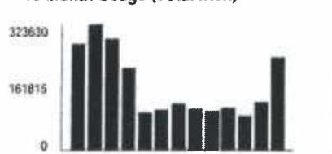

The image is a bar chart.

- **Chart Type**: Bar chart
- **Y-Axis Title**: Not explicitly labeled, but values are shown (0, 161815, 323630)
- **X-Axis Title**: Not visible
- **Data Points**: 
  - Bars represent monthly kWh usage.
  - Highest bar value is approximately 323630 kWh.
  - Midpoint value is approximately 161815 kWh.
  - Lowest value is 0 kWh.
- **Yearly Usage Breakdown (Monthly-Based)**: The chart visually represents monthly electricity usage over a year.
- **Styling**: Bars are uniformly colored in black.

Electric Usage

| Month | kWh |
| :-- | :-- |
| Jul-16 | 273647 |
| Aug-16 | 323628 |
| Sep-16 | 285598 |
| Oct-16 | 211793 |
| Nov-16 | 96676 |
| Dec-16 | 104414 |
| Jan-17 | 119800 |
| Feb-17 | 106978 |
| Mar-17 | 102531 |
| Apr-17 | 110168 |
| May-17 | 89213 |
| Jun-17 | 125389 |
| Jul-17 | 238926 |

|  | Average Daily |  |  |  |  |  |  |  |
| :--: | :--: | :--: | :--: | :--: | :--: | :--: | :--: | :--: |
| Month Billed | kWh |  |  |  |  |  |  |  |
| Last Year | 5621.3 |  | 73 |  |  |  |  |  |
| Last Month | 4644.0 |  | 64 |  |  |  |  |  |
| Current Month | 7984.2 |  | 73 |  |  |  |  |  |

|  |  |
| :-- | :-- |
|  |  |
|  |  |
|  |  |
|  |  |
|  |  |
|  |  |
|  |  |
|  |  |
|  |  |
|  |  |
|  |  |
|  |  |
|  |  |
|  |  |
|  |  |
|  |  |
|  |  |
|  |  |
|  |  |
|  |  |
|  |  |
|  |  |

| Bill Summary |  |
| :--: | :--: |
| Previous Balance | \$12,155.67 |
| Total Payments - Thank You | \$12,155.67 |
| Amount Due on July 24, 2017 | \$18,407.69 |

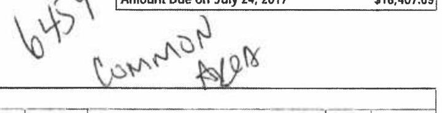

The image is a photo or scanned document with handwritten text. The visible text reads:

"6457
Common
Area"

| Meter Information |  |  |  |  |  |  |  |  |
| :--: | :--: | :--: | :--: | :--: | :--: | :--: | :--: | :--: |
| Read   Dates | Mean   Number | Load   Type | Reading   Type | Previous | Meter Reading   Present | Difference | Multiplier | Usage |
| 5/6   1/6 | 230163271 | General Service | Total kWh | Actual | Actual |  |  | 228 |
| 6/6   1/6 | 230163271 | General Service | On Pk kW | Actual | Actual |  |  | 0.02 |
| 6/6   1/6 | 230163272 | General Service | Total kWh | Actual | Actual |  |  | 4949 |
| 6/6   1/6 | 230163273 | General Service | On Pk kW | Actual | Actual |  |  | 6.91 |
| 6/6   1/6 | 230165344 | General Service | Total kWh | Actual | Actual |  |  | 2 |
| 5/6   1/6 | 230165344 | General Service | On Pk kW | Actual | Actual |  |  | 0.00 |
| 6/6   7/6 | 230277123 | General Service | Total kWh | Actual | Actual |  |  | 233747 |
| 6/6   7/6 | 230277123 | General Service | On Pk kW | Actual | Actual |  |  | 368.76 |

## Service from 6/6/2017 to 7/6/2017 - 30 Days Commercial Hourly - 400 kW to 1000 kW

Electricity Supply Services \$11,942.64

| Electricity Supply Charge | 238,926 kWh |  | 6,896.12 |
| :-- | --: | --: | --: |
| Transmission Services Charge | 238,926 kWh | X | 0.00844 |
| Capacity Charge | 605.70 kW | X | 4.69477 |
| Purchased Electricity Adjustment |  |  |  |
| Misc Procurement Component Chg | 238,926 kWh | X | 0.00110 |

## Delivery Services - ComEd

Customer Charge
For Electric Supply Choices visit
pluginfilireis.org
(continued on next page)

Return only this portion with your check made payable to ComEd. Please write your account number on your check.

## ComEd.

An Exelon Company

To pay by phone call 1-800-588-9477.
A convenience fee will apply.

| 010291101 AV 0.370 | "AUTO T1 0 1138 60819-303775 | $\cdot$CO4-B1-P02913-11 |
| :--: | :--: | :--: |
| $\left\|\mid\|_{1}\| | \mid\|_{1}\| \mid\|_{1}\| \|_{1}\| \|_{1}\| \|_{1}\| \|_{1}\| \|_{1}\right\|_{1}\| | \|1\| | \|1\| |
|  |  |  |
|  |  |  |
|  |  |  |
|  |  |  |

|  |  |  |
| :-- | :-- | :-- |
|  |  |  |
|  |  |  |
|  |  |  |
|  |  |  |
|  |  |  |
|  |  |  |
|  |  |  |
|  |  |  |
|  |  |  |
|  |  |  |
|  |  |  |
|  |  |  |
|  |  |  |
|  |  |  |
|  |  |  |
|  |  |  |
|  |  |  |
|  |  |  |
|  |  |  |
|  |  |  |
|  |  |  |
|  |  |  |
|  |  |  |
|  |  |  |
|  |  |  |
|  |  |  |
|  |  |  |
|  |  |  |
|  |  |  |
|  |  |  |
|  |  |  |

## Visit ComEd.com

Customer Service / Power Outage English
1.877.4COMED1 (1.877.426.6331)

## Experhel

1.800.95.LUCES (1.800.955.8237)

Hearing/Speech Impaired
1.800.572.5789 (TTY)

## Message Center

## ComEd

BUSINESS ENERGY SAVINGS: Purchase high efficiency bulb/lemps on qualified products purchased through participating electrical distributors. Price reductions are given at the time of purchase with no application or preapproval required. Find a participating distributor at ComEd.com/InstantDiscounts.

- YOUR ComEd BILL: Need help understanding your bill line item definitions? Please visit us at ComEd.com/Understand/bill or call us at 877-426-6331.
- ENVIRONMENTAL DISCLOSURE STATEMENT: ComEd's Environmental Disclosure Statement can now be found online at ComEd.com/EnvironmentalDisclosure.
- WAYS TO PAY: Looking for ways to pay your bill? Visit ComEd.com/Pay.
- ILLINOIS COMMERCE COMMISSION CONSUMER DIVISION (800-524-0795): The Consumer Services Division is available to help resolve disputes with ComEd. However, customers should contact ComEd first before seeking assistance from the ICC.
- POWERLINE SAFETY: Water and electricity don't mix-that's why it's important to be aware of your surroundings and watch out for electrical hazards when working or playing around water recreation areas. Look for overhead power lines before performing activities such as casting a fishing line, using a pool skimming tool or raising a boat mast, and NEVER swim around docks with electrical equipment or boats plugged into shore power. Always keep yourself or any conductive material a minimum of 10 feet away from any power line. Call 1-800-EDISON-1 before working near power lines. Learn more at ComEd.com/Safety.

## ComEd

An Exelon Company

## Visit ComEd.com

Customer Service / Power Outage English
1.877.4COMED1 (1.877.426.6331)

## Expehd

1.800.96.LUCE5 (1.800.955.8237)

## Hearing/Speech Impaired

1.800.572.5789 (TTY)

Your Usage Profile
13-Month Usage (Total kWh)
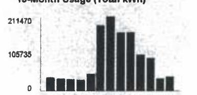

The image is a bar chart.

- **Chart Title**: 13-Month Usage (Total kWh)
- **Y-Axis**: No title visible, but labeled with values 0, 105735, and 211470.
- **X-Axis**: No title visible, but represents months.
- **Data Points**:
  - Bars are shown for each month, with varying heights.
  - The highest bar corresponds to the month with the highest usage, which aligns with the data provided in the Markdown (e.g., Jan-17 with 196283 kWh).
- **Yearly usage breakdown (monthly-based)**: The chart visually represents the monthly electric usage over a 13-month period, with a noticeable peak in the middle months.
- **Styling**: The bars are uniformly colored in black.

A S G N D J F M A M J A

| Electric Usage |  |  |
| :-- | :--: | :-- |
| Month | kWh |  |
| Aug-16 | 37788 |  |
| Sep-16 | 35638 |  |
| Oct-16 | 32523 |  |
| Nov-16 | 31388 |  |
| Dec-16 | 47529 |  |
| Jan-17 | 196283 |  |
| Feb-17 | 211465 |  |
| Mar-17 | 165846 |  |
| Apr-17 | 165914 |  |
| May-17 | 102075 |  |
| Jun-17 | 93039 |  |
| Jul-17 | 35258 |  |
| Aug-17 | 48480 |  |

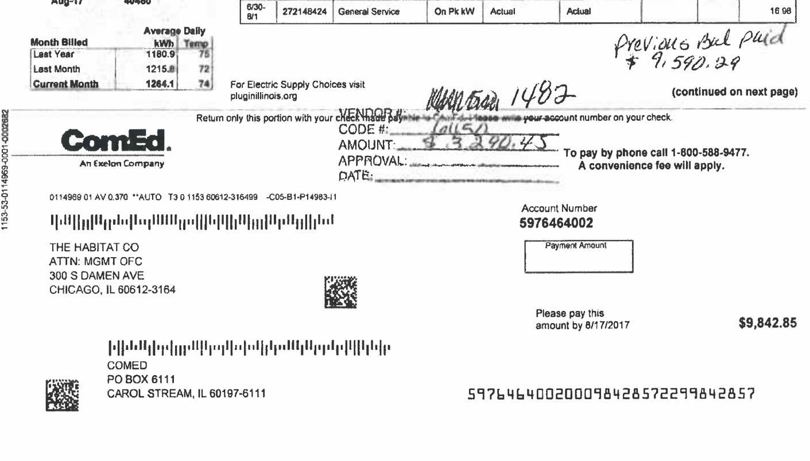

The image is a photo of a utility bill from ComEd, an Exelon Company. It includes various details:

- **Account Information**: 
  - Account Number: 5976464002
  - Payment Amount: $9,842.85
  - Due Date: 8/17/2017

- **Customer Information**:
  - THE HABITAT CO
  - ATTN: MGMT OFC
  - 300 S DAMEN AVE
  - CHICAGO, IL 60612-3164

- **Billing Details**:
  - Month Billed: Current Month
  - Average Daily kWh: 1286.1
  - Average Daily Temp: 74

- **Previous Balance**: 
  - Previous Balance Paid: $9,590.29

- **Vendor Information**:
  - VENDOR #: 1487
  - CODE #: (illegible)
  - AMOUNT: $3,290.43

- **Contact Information**:
  - For Electric Supply Choices visit pluginillinois.org
  - To pay by phone call 1-800-588-9477. A convenience fee will apply.

- **Barcodes and QR Code**: Present for processing and identification.

- **Other Details**:
  - Return only this portion with your check made payable to ComEd.
  - The document includes handwritten notes and markings.

Service from 6/30/2017 to 8/1/2017 - 32 Days
Commercial Hourly - 400 kW to 1000 kW

| Electricity Supply Services |  |  |  | \$1,923.46 |
| :--: | :--: | :--: | :--: | :--: |
| Electricity Supply Charge | 40,449 kWh |  |  | 1,332.22 |
| Transmission Services Charge | 40,450 kWh | $X$ | 0.00844 | 341.40 |
| Capacity Charge | 78.46 kW | X | 4.69477 | 368.35 |
| Purchased Electricity Adjustment |  |  |  | $-163.01$ |
| Misc Procurement Component Chg | 40,450 kWh | X | 0.00110 | 44.50 |
| Delivery Services - ComEd |  |  |  | \$704.38 |
| Customer Charge |  |  |  | 96.35 |
| Standard Metering Charge |  |  |  | 30.19 |
| Distribution Facilities Charge | 70.62 kW | X | 7.05000 | 497.87 |
| IL Electricity Distribution Charge | 40,450 kWh | X | 0.00116 | 46.92 |
| Meter Lease |  |  |  | 33.05 |
| Taxes and Other |  |  |  | \$664.33 |
| Environmental Cost Recovery Adj | 40,450 kWh | X | 0.00005 | 2.02 |
| Renewable Portfolio Standard | 40,450 kWh | X | 0.00094 | 38.02 |
| Zero Emission Standard | 40,450 kWh | X | 0.00195 | 78.88 |
| Franchise Cost |  |  |  | 145.18 |
| State Tax |  |  |  | 129.26 |
| Municipal Tax |  |  |  | 170.97 |
| Total Current Charges |  |  |  | \$3,192.17 |
| Miscellaneous |  |  |  | \$6,650.68 |
| Charges from previous bill |  |  |  | 0.454.11 |
| Current late payment charge (s) - electric |  |  |  | 06.28 |
| Previous late payment charge (s) - electric |  |  |  | 98.29 |

Thank you for your payment of $\$ 3,037.89$ on July 18, 2017

Visit ComEd.com
Customer Service / Power Outage
English
1.877.4COMED1 (1.877.426.6331)

## Expatio!

1.800.95 LUCES (1.800.955.8237)

Hearing/Speech Impaired
$1.800 .572 .5789$ (TTY)

Page 3 of 3
Account Number 5976464002

## Total Amount Due

## DEPOSIT

Deposit on Hand
Deposit Interest Acorued

## Message Center

## ComEd

- BUSINESS ENERGY SAVINGS: Are you a small business owner interested in saving money? ComEd Energy Efficiency Program offers a free assessment of your energy efficiency options, free products, a price quote with instant incentives and full installation services. Visit ComEd com/SmallSq.
- ILLINOIS COMMERCE COMMISSION CONSUMER DIVISION (800-524-0795): The Consumer Services Division is available to help resolve disputes with ComEd. However, customers should contact ComEd first before seeking assistance from the ICC.
- DON'T GET SCAMMED: If you are contacted by someone requesting cash or asking that you buy a prepaid credit card to pay your bill or your service will be immediately desconneded, it is not ComEd calling you! It is an imposter. If this happens, please notify us at 1-800-334-7661. Do not return the imposter's call. Find out more at ComEd.com/ScamAlert.
- WAYS TO PAY: Looking for ways to pay your bill? Visit ComEd.com/Pay.

## ComEd

An Exeion Company

## Visit ComEd.com

Customer Service / Power Outage English
1.877.4COMED1 (1.877.426.6331)

## Expatriol

1.800.95.LUCES (1.800.955.8237)

Hearing/Speech Impaired
1.800.572.5789 (TTY)

## Your Usage Profile

13-Month Usage (Total kWh)
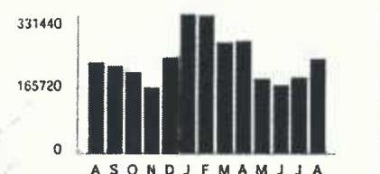

The image is a bar chart representing a **yearly usage breakdown (monthly-based)** of electric usage in kilowatt-hours (kWh) over a 13-month period. 

- **X-axis**: Labeled with the months "A S O N D J F M A M J J A".
- **Y-axis**: Labeled with values "0", "165720", and "331440".
- The bars show varying heights corresponding to the electric usage for each month, with the highest bar in January and lower bars in the summer months.

A S O N D J F M A M J J A

Electric Usage

| Month | kWh |
| :-- | :-- |
| Aug-16 | 216097 |
| Sep-16 | 208009 |
| Oct-16 | 193142 |
| Nov-16 | 156728 |
| Dec-16 | 228474 |
| Jan-17 | 331438 |
| Feb-17 | 328482 |
| Mar-17 | 263908 |
| Apr-17 | 267580 |
| May-17 | 177139 |
| Jun-17 | 161686 |
| Jul-17 | 181049 |
| Aug-17 | 223932 |

## Month Billed

| Last Year | kWh | Time |
| :--: | :--: | :--: |
|  | 6807.0 |  |
| Last Month | 6243.1 | 72 |
| Current Month | 7060.4 | 74 |

| Bill Summary |  |
| :--: | :--: |
| Previous Balance | \$15,156.69 |
| Total Payments - Thank You | \$15,156.69 |
| Amount Due on August 17, 2017 | \$17,302.14 |

Issue Date
August 2, 2017

| Meter Information |  |  |  |  |  |  |  |  |  |
| :--: | :--: | :--: | :--: | :--: | :--: | :--: | :--: | :--: | :--: |
| Road   Dates | Meter   Number | Load   Type | Reading   Type | Previous | Meter Roeding   Present | Difference | Multipler   S | Usage |  |
| 9/20   8/1 | 230102485 | General Service | Total kWh | Actual | Actual |  |  | 111 |  |
| 9/20   8/1 | 230102485 | General Service | On Pk kW | Actual | Actual |  |  | 0.07 |  |
| 9/20   8/1 | 230134314 | General Service | Total kWh | Actual | Actual |  |  | 35576 |  |
| 9/30   8/1 | 230134314 | General Service | On Pk kW | Actual | Actual |  |  | 48.34 |  |
| 9/30   8/1 | 230138410 | General Service | Total kWh | Actual | Actual |  |  | 102832 |  |
| 9/30   8/1 | 230138410 | General Service | On Pk kW | Actual | Actual |  |  | 235.54 |  |
| 9/30   8/1 | 230138411 | General Service | Total kWh | Actual | Actual |  |  | 52603 |  |
| 9/30   8/1 | 230138411 | General Service | On Pk kW | Actual | Actual |  |  | 51.50 |  |
| 9/30   8/1 | 230138412 | General Service | Total kWh | Actual | Actual |  |  | 5123 |  |
| 9/30   8/1 | 230138412 | General Service | On Pk kW | Actual | Actual |  |  | 7.46 |  |
| 9/30   8/1 | 230138413 | General Service | Total kWh | Actual | Actual |  |  | 25612 |  |
| 9/30   8/1 | 230138413 | General Service | On Pk kW | Actual | Actual |  |  | 38.46 |  |
| 9/30   8/1 | 230158955 | General Service | Total kWh | Actual | Actual |  |  | 18 |  |
| 9/30   8/1 | 230158955 | General Service | On Pk kW | Actual | Actual |  |  | 0.00 |  |
| 9/30   8/1 | 230158957 | General Service | Total kWh | Actual | Actual |  |  | 57 |  |
| 9/30   8/1 | 230158957 | General Service | On Pk kW | Actual | Actual |  |  | 0.06 |  |

# RECEIVED 

For Electric Supply Choices visit
plugmillinois.org
(continued on next page)
Return only this portion with your check made payable to ComEd. Please write your account number on your check.

## ComEd.

An Exeion Company

To pay by phone call 1-800-588-9477.
A convenience fee will apply.
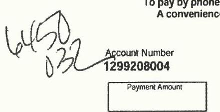

The image is a photo of a section of a bill or statement. It includes handwritten numbers "6450 032" and printed text:

- "Account Number 1299208004"
- "Payment Amount"

The layout suggests a space for entering a payment amount, typically found on a payment slip.

Please pay this
amount by 8/17/2017
\$17,302.14
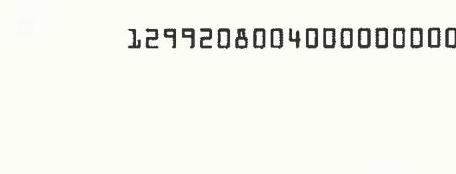

The image is a photo of a section of a document displaying a long string of numbers: "12992080040000000000". There are no other visible elements or text in the image.

| Service from 6/30/2017 to 8/1/2017 - 32 Days | Commercial Hourly - 400 kW to 1000 kW |  |  |  |
| --- | --- | --- | --- | --- |
|  | Electricity Supply Services |  |  | \$10,867.29 |
| Electricity Supply Charge | 225,932 kWh |  |  | 7,557.59 |
| Transmission Services Charge | 225,932 kWh | X | 0.00844 | 1,906.07 |
| Capacity Charge | 439.81 kW | X | 4.69477 | 2,064.81 |
| Purchased Electricity Adjustment |  |  |  | -910.51 |
| Misc Procurement Component Chg | 225,932 kWh | X | 0.00110 | 248.53 |
| Delivery Services - ComEd |  |  |  | \$3,517.24 |
| Customer Charge |  |  |  | 96.35 |
| Standard Metering Charge |  |  |  | 30.19 |
| Distribution Facilities Charge | 381.54 kW | X | 7.05000 | 2,689.86 |
| IL Electricity Distribution Charge | 225,932 kWh | X | 0.00116 | 262.08 |
| Meter Lease |  |  |  | 80.48 |
| Nonstandard Facilities Charge |  |  |  | 378.26 |
| Taxes and Other |  |  |  | \$2,917.61 |
| Environmental Cost Recovery Adj | 225,932 kWh | X | 0.00005 | 11.30 |
| Renewable Portfolio Standard | 225,932 kWh | X | 0.00094 | 212.38 |
| Zero Emission Standard | 225,932 kWh | X | 0.00195 | 440.57 |
| Franchise Cost |  |  |  | 717.69 |
| State Tax |  |  |  | 685.24 |
| Municipal Tax |  |  |  | 850.43 |
| Total Current Charges |  |  |  | \$17,302.14 |
| Thank you for your payment of \$15,156.69 on July 17, 2017 |  |  |  |  |
| Total Amount Due |  |  |  | \$17,302.14 |
| (continued on next page |  |  |  |  |

## ComEd

An Eacion Company

## Visit ComEd.com

Customer Service / Power Outage English
1.877.4COMED1 (1.877.426.6331)

## Expañol

1.800.95.LUCES (1.800.955.8237)

Hearing/Speech Impaired
1.800.572.5789 (TTY)

Your Usage Profile
13-Month Usage (Total kWh)
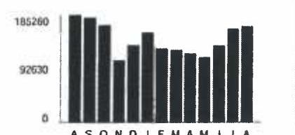

The image is a bar chart.

- **Chart Type**: Bar chart
- **Axes**:
  - Y-axis: No title visible, but it shows numerical values with labels "185260" and "92630".
  - X-axis: Labeled with months using initials "A S O N D J F M A M J J A".
- **Data Representation**: Each bar represents the total kWh usage for a month.
- **Yearly Usage Breakdown (Monthly-Based)**: The chart displays monthly electricity usage over a 13-month period.
- **Styling**: The bars are uniformly colored in black. The height of each bar corresponds to the kWh usage for that month.

Electric Usage

| Month | kWh |
| :-- | :-- |
| Aug-16 | 185259 |
| Sep-16 | 180227 |
| Oct-16 | 187658 |
| Nov-16 | 107354 |
| Dec-18 | 133650 |
| Jan-17 | 155120 |
| Feb-17 | 127440 |
| Mar-17 | 125309 |
| Apr-17 | 119786 |
| May-17 | 112213 |
| Jun-17 | 132280 |
| Jul-17 | 161961 |
| Aug-17 | 166186 |

Page 1 of 3

## Account Number 0935332031

Name
HABITAT-ASBURY PLAZA
Service Location 750 N DEARBORN ST CHCAGO
Phone Number 312-943-4800

| Bill Summary |  |  |  |  |  |  |  |  |
| :--: | :--: | :--: | :--: | :--: | :--: | :--: | :--: | :--: |
| Previous Balance |  |  |  |  |  |  |  |  |
| Total Payments - Thank You |  |  |  |  |  |  |  |  |
|  |  |  |  |  |  |  |  | $12,764.59$ |
| Issue Date | August 4, 2017 |  |  |  |  |  |  |  |
|  |  |  |  |  |  |  |  |  |

## Meter Information

| Read   Dates | Meter   Number | Load   Type | Reading   Type | Previous | Meter Reading   Present | Difference | Multiplier   $p$ | Usage |
| :--: | :--: | :--: | :--: | :--: | :--: | :--: | :--: | :--: |
| 25-   8/3 | 230012698 | General Service | Total kWh | Actual | Actual |  |  | 19 |
| 15-   8/3 | 230012698 | General Service | On Pk kW | Actual | Actual |  |  | 0.03 |
| 15-   8/3 | 230012700 | General Service | Total kWh | Actual | Actual |  |  | 16 |
| 15-   8/3 | 230012700 | General Service | On Pk kW | Actual | Actual |  |  | 0.02 |
| 15-   8/3 | 230041754 | General Service | Total kWh | Actual | Actual |  |  | 29743 |
| 15-   8/3 | 230041754 | General Service | On Pk kW | Actual | Actual |  |  | 43.78 |
| 15-   8/3 | 230041778 | General Service | Total kWh | Actual | Actual |  |  | 133875 |
| 15-   8/3 | 230041778 | General Service | On Pk kW | Actual | Actual |  |  | 242.04 |
| 15-   8/3 | 230057545 | General Service | Total kWh | Actual | Actual |  |  | 2532 |
| 15-   8/3 | 230057548 | General Service | On Pk kW | Actual | Actual |  |  | 54.88 |
| 15-   8/3 | 230131095 | General Service | Total kWh | Actual | Actual |  |  | 0 |
| 15-   8/3 | 230131095 | General Service | On Pk kW | Actual | Actual |  |  | 0.00 |

Service from 7/5/2017 to 8/3/2017 - 29 Days
Commercial Hourly - 100 kW to 400 kW
Electricity Supply Services
\$8,367.97
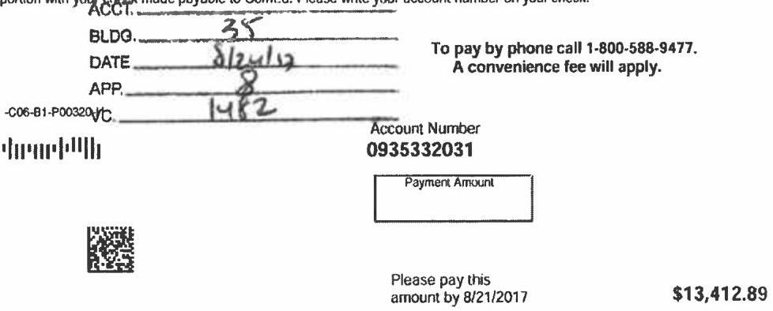

The image is a photo of a payment slip or bill statement. It includes the following details:

- **Account Information**:
  - Account Number: 0935332031

- **Payment Instructions**:
  - To pay by phone call 1-800-588-9477. A convenience fee will apply.

- **Payment Amount**:
  - $13,412.89

- **Additional Details**:
  - ACC#: 35
  - DATE: 8/21/17
  - APP: 8
  - VC: 1482

- **Payment Due**:
  - Please pay this amount by 8/21/2017.

There is a barcode and a QR code present on the slip.
$\$ 13,412.89$
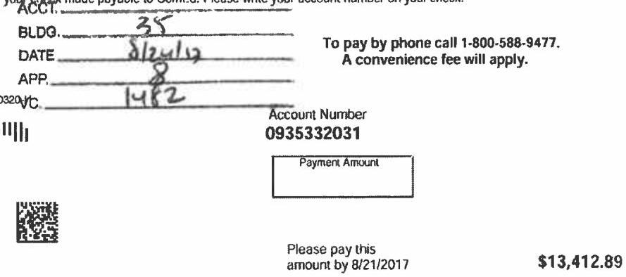

The image is a photo of a payment slip or bill statement. It includes the following details:

- **Account Information**:
  - Account Number: 0935332031

- **Payment Instructions**:
  - To pay by phone call 1-800-588-9477. A convenience fee will apply.

- **Payment Amount**:
  - $13,412.89

- **Additional Details**:
  - ACC#: 35
  - DATE: 8/21/17
  - APP: 8
  - VC: 1482

- **Payment Due**:
  - Please pay this amount by 8/21/2017.

There is a barcode and a QR code present on the slip.

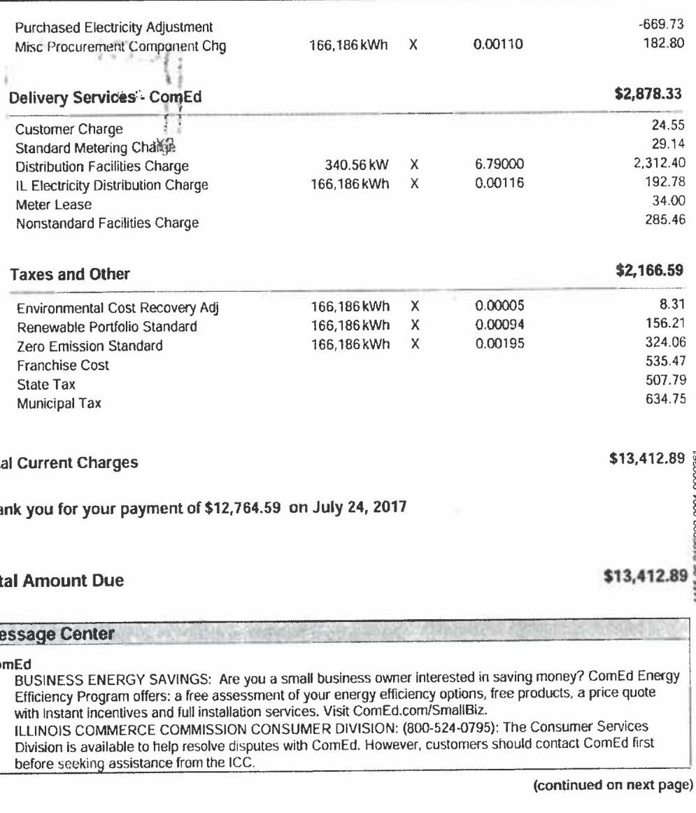

The image is a photo of a utility bill statement. 

Embedded text includes:

- **Purchased Electricity Adjustment**
- **Misc Procurement Component Chg**: 166,186 kWh X 0.00110 = 182.80
- **Delivery Services: ComEd**
  - Customer Charge: 24.55
  - Standard Metering Charge: 29.14
  - Distribution Facilities Charge: 340.56 kW X 6.79000 = 2,312.40
  - IL Electricity Distribution Charge: 166,186 kWh X 0.00116 = 192.78
  - Meter Lease: 34.00
  - Nonstandard Facilities Charge: 285.46
- **Total**: $2,878.33
- **Taxes and Other**
  - Environmental Cost Recovery Adj: 166,186 kWh X 0.00005 = 8.31
  - Renewable Portfolio Standard: 166,186 kWh X 0.00094 = 156.21
  - Zero Emission Standard: 166,186 kWh X 0.00195 = 324.06
  - Franchise Cost: 535.47
  - State Tax: 507.79
  - Municipal Tax: 634.75
- **Total**: $2,166.59
- **Total Current Charges**: $13,412.89
- **Thank you for your payment of $12,764.59 on July 24, 2017**
- **Total Amount Due**: $13,412.89
- **Message Center**
  - **ComEd**
  - BUSINESS ENERGY SAVINGS: Are you a small business owner interested in saving money? ComEd Energy Efficiency Program offers: a free assessment of your energy efficiency options, free products, a price quote with instant incentives and full installation services. Visit ComEd.com/SmallBiz.
  - ILLINOIS COMMERCE COMMISSION CONSUMER DIVISION: (800-524-0795): The Consumer Services Division is available to help resolve disputes with ComEd. However, customers should contact ComEd first before seeking assistance from the ICC.
- **(continued on next page)**

Spatial relationships:
- The charges and taxes are listed in a structured format with descriptions on the left and corresponding values on the right.
- The "Message Center" is located at the bottom of the image.

## Unit ComEd.com

Customer Service / Power Outage
English
$1,877.900 \mathrm{MED} 1(1,877,426,6331)$
Expand
$1,800.95$ LUCES (1,800,955,8237)
Hearing/Speech Impaired
$1,800.572 .9789$ (TTY)

Your Usage Profile
13-Month Usage (Total kWh)
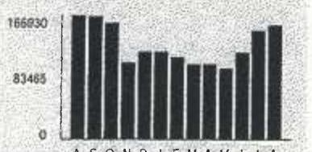

The image is a bar chart.

- **Chart Type**: Bar chart
- **Axes Titles and Units**: 
  - Y-axis: No title visible, but numerical values are present (166930, 83485, 0).
  - X-axis: No title visible, but months are indicated (A, S, O, N, D, J, F, M, A, M, J, J, A).
- **Data Points**: 
  - The bars represent monthly data, likely corresponding to the months from August to August of the following year.
- **Styling**: 
  - The bars are uniformly colored in black.
- **Yearly Usage Breakdown (Monthly-Based)**: The chart displays a breakdown of usage over a 13-month period, with each bar representing a month's data.

Elecitric Usage

| Month | kWh |
| :-- | :--: |
| Aug 16 | 166822 |
| Sep 16 | 165981 |
| Oct 16 | 156946 |
| Nov 16 | 163275 |
| Dec 16 | 133943 |
| Jan 17 | 118210 |
| Feb 17 | 111047 |
| Mar 17 | 102952 |
| Apr 17 | 100821 |
| May 17 | 89876 |
| Jun 17 | 117033 |
| Jul 17 | 149921 |
| Aug 17 | 154420 |

|  | Average Daily |  |  |  |  |  |  |
| :--: | :--: | :--: | :--: | :--: | :--: | :--: | :--: |
| Month | kWh | Total |  |  |  |  |  |
| Aug 16 | 166822 |  |  |  |  |  |  |
| Sep 16 | 165981 |  |  |  |  |  |  |
| Oct 16 | 156946 |  |  |  |  |  |  |
| Nov 16 | 163275 |  |  |  |  |  |  |
| Dec 16 | 133943 |  |  |  |  |  |  |
| Jan 17 | 118210 |  |  |  |  |  |  |
| Feb 17 | 111047 |  |  |  |  |  |  |
| Mar 17 | 102952 |  |  |  |  |  |  |
| Apr 17 | 100821 |  |  |  |  |  |  |
| May 17 | 89876 |  |  |  |  |  |  |
| Jun 17 | 117033 |  |  |  |  |  |  |
| Jul 17 | 149921 |  |  |  |  |  |  |
| Aug 17 | 154420 |  |  |  |  |  |  |

|  | Average Daily |  |  |  |  |  |  |
| :--: | :--: | :--: | :--: | :--: | :--: | :--: | :--: |
| Month | kWh | Total |  |  |  |  |  |
| Aug 16 | 166822 |  |  |  |  |  |  |
| Sep 16 | 165981 |  |  |  |  |  |  |
| Oct 16 | 156946 |  |  |  |  |  |  |
| Nov 16 | 163275 |  |  |  |  |  |  |
| Dec 16 | 133943 |  |  |  |  |  |  |
| Jan 17 | 118210 |  |  |  |  |  |  |
| Feb 17 | 111047 |  |  |  |  |  |  |
| Mar 17 | 102952 |  |  |  |  |  |  |
| Apr 17 | 100821 |  |  |  |  |  |  |
| May 17 | 89876 |  |  |  |  |  |  |
| Jun 17 | 117033 |  |  |  |  |  |  |
| Jul 17 | 149921 |  |  |  |  |  |  |
| Aug 17 | 154420 |  |  |  |  |  |  |

|  | Average Daily |  |  |  |  |  |  |
| :--: | :--: | :--: | :--: | :--: | :--: | :--: | :--: |
| Month | kWh | Total |  |  |  |  |  |
| Aug 16 | 166822 |  |  |  |  |  |  |
| Sep 16 | 165981 |  |  |  |  |  |  |
| Oct 16 | 156946 |  |  |  |  |  |  |
| Nov 16 | 163275 |  |  |  |  |  |  |
| Dec 16 | 133943 |  |  |  |  |  |  |
| Jan 17 | 118210 |  |  |  |  |  |  |
| Feb 17 | 111047 |  |  |  |  |  |  |
| Mar 17 | 102952 |  |  |  |  |  |  |
| Apr 17 | 100821 |  |  |  |  |  |  |
| May 17 | 89876 |  |  |  |  |  |  |
| Jun 17 | 117033 |  |  |  |  |  |  |
| Jul 17 | 149921 |  |  |  |  |  |  |
| Aug 17 | 154420 |  |  |  |  |  |  |

|  | Average Daily |  |  |  |  |  |  |
| :--: | :--: | :--: | :--: | :--: | :--: | :--: | :--: |
| Month | kWh | Total |  |  |  |  |  |
| Aug 16 | 166822 |  |  |  |  |  |  |
| Sep 16 | 165981 |  |  |  |  |  |  |
| Oct 16 | 156946 |  |  |  |  |  |  |
| Nov 16 | 163275 |  |  |  |  |  |  |
| Dec 16 | 133943 |  |  |  |  |  |  |
| Jan 17 | 118210 |  |  |  |  |  |  |
| Feb 17 | 111047 |  |  |  |  |  |  |
| Mar 17 | 102952 |  |  |  |  |  |  |
| Apr 17 | 100821 |  |  |  |  |  |  |
| May 17 | 89876 |  |  |  |  |  |  |
| Jun 17 | 117033 |  |  |  |  |  |  |
| Jul 17 | 149921 |  |  |  |  |  |  |
| Aug 17 | 154420 |  |  |  |  |  |  |

|  | Average Daily |  |  |  |  |  |  |
| :--: | :--: | :--: | :--: | :--: | :--: | :--: | :--: |
| Month | kWh | Total |  |  |  |  |  |
| Aug 16 | 166822 |  |  |  |  |  |  |
| Sep 16 | 165981 |  |  |  |  |  |  |
| Oct 16 | 156946 |  |  |  |  |  |  |
| Nov 16 | 163275 |  |  |  |  |  |  |
| Dec 16 | 133943 |  |  |  |  |  |  |
| Jan 17 | 118210 |  |  |  |  |  |  |
| Feb 17 | 111047 |  |  |  |  |  |  |
| Mar 17 | 102952 |  |  |  |  |  |  |
| Apr 17 | 100821 |  |  |  |  |  |  |
| May 17 | 89876 |  |  |  |  |  |  |
| Jun 17 | 117033 |  |  |  |  |  |  |
| Jul 17 | 149921 |  |  |  |  |  |  |
| Aug 17 | 154420 |  |  |  |  |  |  |

|  | Average Daily |  |  |  |  |  |  |
| :--: | :--: | :--: | :--: | :--: | :--: | :--: | :--: |
| Month | kWh | Total |  |  |  |  |  |
| Aug 16 | 166822 |  |  |  |  |  |  |
| Sep 16 | 165981 |  |  |  |  |  |  |
| Oct 16 | 156946 |  |  |  |  |  |  |
| Nov 16 | 163275 |  |  |  |  |  |  |
| Dec 16 | 133943 |  |  |  |  |  |  |
| Jan 17 | 118210 |  |  |  |  |  |  |
| Feb 17 | 111047 |  |  |  |  |  |  |
| Mar 17 | 102952 |  |  |  |  |  |  |
| Apr 17 | 100821 |  |  |  |  |  |  |
| May 17 | 89876 |  |  |  |  |  |  |
| Jun 17 | 117033 |  |  |  |  |  |  |
| Jul 17 | 149921 |  |  |  |  |  |  |
| Aug 17 | 154420 |  |  |  |  |  |  |

|  | Average Daily |  |  |  |  |  |  |
| :--: | :--: | :--: | :--: | :--: | :--: | :--: | :--: |
| Month | kWh | Total |  |  |  |  |  |
| Aug 16 | 166822 |  |  |  |  |  |  |
| Sep 16 | 165981 |  |  |  |  |  |  |
| Oct 16 | 156946 |  |  |  |  |  |  |
| Nov 16 | 163275 |  |  |  |  |  |  |
| Dec 16 | 133943 |  |  |  |  |  |  |
| Jan 17 | 100821 |  |  |  |  |  |  |
| Mar 17 | 102952 |  |  |  |  |  |  |
| Apr 17 | 100821 |  |  |  |  |  |  |
| May 17 | 89876 |  |  |  |  |  |  |
| Jun 17 | 117033 |  |  |  |  |  |  |
| Jul 17 | 149921 |  |  |  |  |  |  |
| Aug 17 | 154420 |  |  |  |  |  |  |

|  | Average Daily |  |  |  |  |  |  |
| :--: | :--: | :--: | :--: | :--: | :--: | :--: |
| Month | kWh | Total |  |  |  |  |  |
| Aug 16 | 166822 |  |  |  |  |  |  |
| Sep 16 | 165981 |  |  |  |  |  |  |
| Oct 16 | 156946 |  |  |  |  |  |  |
| Nov 16 | 102952 |  |  |  |  |  |  |
| Jan 17 | 100821 |  |  |  |  |  |  |
| Mar 17 | 102952 |  |  |  |  |  |  |
| Apr 17 | 100821 |  |  |  |  |  |  |
| May 17 | 102952 |  |  |  |  |  |  |
| Jun 17 | 100821 |  |  |  |  |  |  |
| Mar 17 | 102952 |  |  |  |  |  |  |
| Apr 17 | 100821 |  |  |  |  |  |  |
| Mar 17 | 102952 |  |  |  |  |  |  |
| Jun 17 | 100821 |  |  |  |  |  |  |
| Mar 17 | 102952 |  |  |  |  |  |  |
| Jun 17 | 100821 |  |  |  |  |  |  |
| Mar 17 | 102952 |  |  |  |  |  |  |
| Jun 17 | 100821 |  |  |  |  |  |  |
| Mar 17 | 102952 |  |  |  |  |  |  |
| Jun 17 | 100821 |  |  |  |  |  |  |
| Mar 17 | 102952 |  |  |  |  |  |  |
| Jun 17 | 100821 |  |  |  |  |  |  |
| Mar 17 | 102952 |  |  |  |  |  |  |
| Jun 17 | 100821 |  |  |  |  |  |  |
| Mar 17 | 102952 |  |  |  |  |  |  |
| Jun 17 | 100821 |  |  |  |  |  |  |
| Mar 17 | 102952 |  |  |  |  |  |  |
| Jun 17 | 100821 |  |  |  |  |  |  |
| Mar 17 | 102952 |  |  |  |  |  |  |
| Jun 17 | 100821 |  |  |  |  |  |  |
| Mar 17 | 102952 |  |  |  |  |  |  |
| Jun 17 | 100821 |  |  |  |  |  |  |
| Mar 17 | 102952 |  |  |  |  |  |  |
| Jun 17 | 100821 |  |  |  |  |  |  |
| Mar 17 | 102952 |  |  |  |  |  |  |
| Jun 17 | 100821 |  |  |  |  |  |  |
| Mar 17 | 102952 |  |  |  |  |  |  |
| Jun 17 | 100821 |  |  |  |  |  |  |
| Mar 17 | 102952 |  |  |  |  |  |  |
| Jun 17 | 100821 |  |  |  |  |  |  |
| Mar 17 | 102952 |  |  |  |  |  |  |
| Jun 17 | 100821 |  |  |  |  |  |  |
| Mar 17 | 102952 |  |  |  |  |  |  |
| Jun 17 | 100821 |  |  |  |  |  |  |
| Mar 17 | 102952 |  |  |  |  |  |  |
| Jun 17 | 100821 |  |  |  |  |  |  |
| Mar 17 | 102952 |  |  |  |  |  |  |
| Jun 17 | 100821 |  |  |  |  |  |  |
| Mar 17 | 102952 |  |  |  |  |  |  |
| Jun 17 | 100821 |  |  |  |  |  |  |
| Mar 17 | 102952 |  |  |  |  |  |  |
| Jun 17 | 100821 |  |  |  |  |  |  |
| Mar 17 | 102952 |  |  |  |  |  |  |
| Jun 17 | 100821 |  |  |  |  |  |  |
| Mar 17 | 102952 |  |  |  |  |  |  |
| Jun 17 | 100821 |  |  |  |  |  |  |
| Mar 17 | 102952 |  |  |  |  |  |  |
| Jun 17 | 100821 |  |  |  |  |  |  |
| Mar 17 | 102952 |  |  |  |  |  |  |
| Jun 17 | 100821 |  |  |  |  |  |  |
| Mar 17 | 102952 |  |  |  |  |  |  |
| Jun 17 | 100821 |  |  |  |  |  |  |
| Mar 17 | 102952 |  |  |  |  |  |  |
| Jun 17 | 100821 |  |  |  |  |  |  |
| Mar 17 | 102952 |  |  |  |  |  |  |
| Jun 17 | 100821 |  |  |  |  |  |  |
| Mar 17 | 102952 |  |  |  |  |  |  |
| Jun 17 | 100821 |  |  |  |  |  |  |
| Mar 17 | 102952 |  |  |  |  |  |  |
| Jun 17 | 100821 |  |  |  |  |  |  |
| Mar 17 | 102952 |  |  |  |  |  |  |
| Jun 17 | 100821 |  |  |  |  |  |  |
| Mar 17 | 102952 |  |  |  |  |  |  |
| Jun 17 | 100821 |  |  |  |  |  |  |
| Mar 17 | 102952 |  |  |  |  |  |  |
| Jun 17 | 100821 |  |  |  |  |  |  |
| Mar 17 | 102952 |  |  |  |  |  |  |
| Jun 17 | 100821 |  |  |  |  |  |  |
| Mar 17 | 102952 |  |  |  |  |  |  |
| Jun 17 | 100821 |  |  |  |  |  |  |
| Mar 17 | 102952 |  |  |  |  |  |  |
| Jun 17 | 100821 |  |  |  |  |  |  |
| Mar 17 | 102952 |  |  |  |  |  |  |
| Jun 17 | 100821 |  |  |  |  |  |  |
| Mar 17 | 102952 |  |  |  |  |  |  |
| Jun 17 | 100821 |  |  |  |  |  |  |
| Mar 17 | 102952 |  |  |  |  |  |  |
| Jun 17 | 100821 |  |  |  |  |  |  |
| Mar 17 | 102952 |  |  |  |  |  |  |
| Jun 17 | 100821 |  |  |  |  |  |  |
| Mar 17 | 102952 |  |  |  |  |  |  |
| Jun 17 | 100821 |  |  |  |  |  |  |
| Mar 17 | 102952 |  |  |  |  |  |  |
| Jun 17 | 100821 |  |  |  |  |  |  |
| Mar 17 | 102952 |  |  |  |  |  |  |
| Jun 17 | 100821 |  |  |  |  |  |  |
| Mar 17 | 102952 |  |  |  |  |  |  |
| Jun 17 | 100821 |  |  |  |  |  |  |
| Mar 17 | 102952 |  |  |  |  |  |  |
| Jun 17 | 100821 |  |  |  |  |  |  |
| Mar 17 | 102952 |  |  |  |  |  |  |
| Jun 17 | 100821 |  |  |  |  |  |  |
| Mar 17 | 102952 |  |  |  |  |  |  |
| Jun 17 | 100821 |  |  |  |  |  |  |
| Mar 17 | 102952 |  |  |  |  |  |  |
| Jun 17 | 100821 |  |  |  |  |  |  |
| Mar 17 | 102952 |  |  |  |  |  |  |
| Jun 17 | 100821 |  |  |  |  |  |  |
| Mar 17 | 102952 |  |  |  |  |  |  |
| Jun 17 | 100821 |  |  |  |  |  |  |
| Mar 17 | 102952 |  |  |  |  |  |  |
| Jun 17 | 100821 |  |  |  |  |  |  |
| Mar 17 | 102952 |  |  |  |  |  |  |
| Jun 17 | 100821 |  |  |  |  |  |  |
| Mar 17 | 102952 |  |  |  |  |  |  |
| Jun 17 | 100821 |  |  |  |  |  |  |
| Mar 17 | 102952 |  |  |  |  |  |  |
| Jun 17 | 100821 |  |  |  |  |  |  |
| Mar 17 | 102952 |  |  |  |  |  |  |
| Jun 17 | 100821 |  |  |  |  |  |  |
| Mar 17 | 102952 |  |  |  |  |  |  |
| Jun 17 | 100821 |  |  |  |  |  |  |
| Mar 17 | 102952 |  |  |  |  |  |  |
| Jun 17 | 100821 |  |  |  |  |  |  |
| Mar 17 | 102952 |  |  |  |  |  |  |
| Jun 17 | 100821 |  |  |  |  |  |  |
| Mar 17 | 102952 |  |  |  |  |  |  |
| Jun 17 | 100821 |  |  |  |  |  |  |
| Mar 17 | 102952 |  |  |  |  |  |  |
| Jun 17 | 100821 |  |  |  |  |  |  |
| Mar 17 | 102952 |  |  |  |  |  |  |
| Jun 17 | 100821 |  |  |  |  |  |  |
| Mar 17 | 102952 |  |  |  |  |  |  |
| Jun 17 | 100821 |  |  |  |  |  |  |
| Mar 17 | 102952 |  |  |  |  |  |  |
| Jun 17 | 100821 |  |  |  |  |  |  |
| Mar 17 | 102952 |  |  |  |  |  |  |
| Jun 17 | 100821 |  |  |  |  |  |  |
| Mar 17 | 102952 |  |  |  |  |  |  |
| Jun 17 | 100821 |  |  |  |  |  |  |
| Mar 17 | 102952 |  |  |  |  |  |  |
| Jun 17 | 100821 |  |  |  |  |  |  |
| Mar 17 | 102952 |  |  |  |  |  |  |
| Jun 17 | 100821 |  |  |  |  |  |  |
| Mar 17 | 102952 |  |  |  |  |  |  |
| Jun 17 | 100821 |  |  |  |  |  |  |
| Mar 17 | 102952 |  |  |  |  |  |  |
| Jun 17 | 100821 |  |  |  |  |  |  |
| Mar 17 | 102952 |  |  |  |  |  |  |
| Jun 17 | 100821 |  |  |  |  |  |  |
| Mar 17 | 102952 |  |  |  |  |  |  |
| Jun 17 | 100821 |  |  |  |  |  |  |
| Mar 17 | 102952 |  |  |  |  |  |  |
| Jun 17 | 100821 |  |  |  |  |  |  |
| Mar 17 | 102952 |  |  |  |  |  |  |
| Jun 17 | 100821 |  |  |  |  |  |  |
| Mar 17 | 102952 |  |  |  |  |  |  |
| Jun 17 | 100821 |  |  |  |  |  |  |
| Mar 17 | 102952 |  |  |  |  |  |  |
| Jun 17 | 100821 |  |  |  |  |  |  |
| Mar 17 | 102952 |  |  |  |  |  |  |
| Jun 17 | 100821 |  |  |  |  |  |  |
| Mar 17 | 102952 |  |  |  |  |  |  |
| Jun 17 | 100821 |  |  |  |  |  |  |
| Mar 17 | 102952 |  |  |  |  |  |  |
| Jun 17 | 100821 |  |  |  |  |  |  |
| Mar 17 | 102952 |  |  |  |  |  |  |
| Jun 17 | 100821 |  |  |  |  |  |  |
| Mar 17 | 102952 |  |  |  |  |  |  |
| Jun 17 | 100821 |  |  |  |  |  |  |
| Mar 17 | 102952 |  |  |  |  |  |  |
| Jun 17 | 100821 |  |  |  |  |  |  |
| Mar 17 | 102952 |  |  |  |  |  |  |
| Jun 17 | 100821 |  |  |  |  |  |  |
| Mar 17 | 102952 |  |  |  |  |  |  |
| Jun 17 | 100821 |  |  |  |  |  |  |
| Mar 17 | 102952 |  |  |  |  |  |  |
| Jun 17 | 100821 |  |  |  |  |  |  |
| Mar 17 | 102952 |  |  |  |  |  |  |
| Jun 17 | 100821 |  |  |  |  |  |  |
| Mar 17 | 102952 |  |  |  |  |  |  |
| Jun 17 | 100821 |  |  |  |  |  |  |
| Mar 17 | 102952 |  |  |  |  |  |  |
| Jun 17 | 102952 |  |  |  |  |  |  |
| Mar 17 | 102952 |  |  |  |  |  |  |
| Jun 17 | 102952 |  |  |  |  |  |  |
| Mar 17 | 102952 |  |  |  |  |  |  |
| Jun 17 | 102952 |  |  |  |  |  |  |
| Mar 17 | 102952 |  |  |  |  |  |  |
| Jun 17 | 102952 |  |  |  |  |  |  |
| Mar 17 | 102952 |  |  |  |  |  |  |
| Jun 17 | 102952 |  |  |  |  |  |  |
| Mar 17 | 102952 |  |  |  |  |  |  |
| Jun 17 | 102952 |  |  |  |  |  |  |
| Mar 17 | 102952 |  |  |  |  |  |  |
| Jun 17 | 102952 |  |  |  |  |  |  |
| Mar 17 | 102952 |  |  |  |  |  |  |
| Jun 17 | 102952 |  |  |  |  |  |  |
| Mar 17 | 102952 |  |  |  |  |  |  |
| Jun 17 | 102952 |  |  |  |  |  |  |
| Mar 17 | 102952 |  |  |  |  |  |  |
| Jun 17 | 102952 |  |  |  |  |  |  |
| Mar 17 | 102952 |  |  |  |  |  |  |
| Jun 17 | 102952 |  |  |  |  |  |  |
| Mar 17 | 102952 |  |  |  |  |  |  |
| Jun 17 | 102952 |  |  |  |  |  |  |
| Mar 17 | 102952 |  |  |  |  |  |  |
| Jun 17 | 102952 |  |  |  |  |  |  |
| Mar 17 | 102952 |  |  |  |  |  |  |
| Jun 17 | 102952 |  |  |  |  |  |  |
| Mar 17 | 102952 |  |  |  |  |  |  |
| Jun 17 | 102952 |  |  |  |  |  |  |
| Mar 17 | 102952 |  |  |  |  |  |  |
| Jun 17 | 102952 |  |  |  |  |  |  |
| Mar 17 | 102952 |  |  |  |  |  |  |
| Jun 17 | 102952 |  |  |  |  |  |  |
| Mar 17 | 102952 |  |  |  |  |  |  |
| Jun 17 | 102952 |  |  |  |  |  |  |
| Mar 17 | 102952 |  |  |  |  |  |  |
| Jun 17 | 102952 |  |  |  |  |  |  |
| Mar 17 | 102952 |  |  |  |  |  |  |
| Jun 17 | 102952 |  |  |  |  |  |  |
| Mar 17 | 102952 |  |  |  |  |  |  |
| Jun 17 | 102952 |  |  |  |  |  |  |
| Mar 17 | 102952 |  |  |  |  |  |  |
| Jun 17 | 102952 |  |  |  |  |  |  |
| Mar 17 | 102952 |  |  |  |  |  |  |
| Jun 17 | 102952 |  |  |  |  |  |  |
| Mar 17 | 102952 |  |  |  |  |  |  |
| Jun 17 | 102952 |  |  |  |  |  |  |
| Mar 17 | 102952 |  |  |  |  |  |  |
| Jun 17 | 102952 |  |  |  |  |  |  |
| Mar 17 | 102952 |  |  |  |  |  |  |
| Jun 17 | 102952 |  |  |  |  |  |  |
| Mar 17 | 102952 |  |  |  |  |  |  |
| Jun 17 | 102952 |  |  |  |  |  |  |
| Mar 17 | 102952 |  |  |  |  |  |  |
| Jun 17 | 102952 |  |  |  |  |  |  |
| Mar 17 | 102952 |  |  |  |  |  |  |
| Jun 17 | 102952 |  |  |  |  |  |  |
| Mar 17 | 102952 |  |  |  |  |  |  |
| Jun 17 | 102952 |  |  |  |  |  |  |
| Mar 17 | 102952 |  |  |  |  |  |  |
| Jun 17 | 102952 |  |  |  |  |  |  |
| Mar 17 | 102952 |  |  |  |  |  |  |
| Jun 17 | 102952 |  |  |  |  |  |  |
| Mar 17 | 102952 |  |  |  |  |  |  |
| Jun 17 | 102952 |  |  |  |  |  |  |
| Mar 17 | 102952 |  |  |  |  |  |  |
| Jun 17 | 102952 |  |  |  |  |  |  |
| Mar 17 | 102952 |  |  |  |  |  |  |
| Jun 17 | 102952 |  |  |  |  |  |  |
| Mar 17 | 102952 |  |  |  |  |  |  |
| Jun 17 | 102952 |  |  |  |  |  |  |
| Mar 17 | 102952 |  |  |  |  |  |  |
| Jun 17 | 102952 |  |  |  |  |  |  |
| Mar 17 | 102952 |  |  |  |  |  |  |
| Jun 17 | 102952 |  |  |  |  |  |  |
| Mar 17 | 102952 |  |  |  |  |  |  |
| Jun 17 | 102952 |  |  |  |  |  |  |
| Mar 17 | 102952 |  |  |  |  |  |  |
| Jun 17 | 102952 |  |  |  |  |  |  |
| Mar 17 | 102952 |  |  |  |  |  |  |
| Jun 17 | 102952 |  |  |  |  |  |  |
| Mar 17 | 102952 |  |  |  |  |  |  |
| Jun 17 | 102952 |  |  |  |  |  |  |
| Mar 17 | 102952 |  |  |  |  |  |  |
| Jun 17 | 102952 |  |  |  |  |  |  |
| Mar 17 | 102952 |  |  |  |  |  |  |
| Jun 17 | 102952 |  |  |  |  |  |  |
| Mar 17 | 102952 |  |  |  |  |  |  |
| Jun 17 | 102952 |  |  |  |  |  |  |
| Mar 17 | 102952 |  |  |  |  |  |  |
| Jun 17 | 102952 |  |  |  |  |  |
| Mar 17 | 102952 |  |  |  |  |  |
| Jun 17 | 102952 |  |  |  |  |  |
| Mar 17 | 102952 |  |  |  |  |  |
| Jun 17 | 102952 |  |  |  |  |  |
| Mar 17 | 102952 |  |  |  |  |  |
| Jun 17 | 102952 |  |  |  |  |  |
| Mar 17 | 102952 |  |  |  |  |  |
| Jun 17 | 102952 |  |  |  |  |  |
| Mar 17 | 102952 |  |  |  |  |  |
| Jun 17 | 102952 |  |  |  |  |  |
| Mar 17 | 102952 |  |  |  |  |  |
| Jun 17 | 102952 |  |  |  |  |  |
| Mar 17 | 102952 |  |  |  |  |  |
| Jun 17 | 102952 |  |  |  |  |  |
| Mar 17 | 102952 |  |  |  |  |  |
| Jun 17 | 102952 |  |  |  |  |  |
| Mar 17 | 102952 |  |  |  |  |  |
| Jun 17 | 102952 |  |  |  |  |  |
| Mar 17 | 102952 |  |  |  |  |  |
| Jun 17 | 102952 |  |  |  |  |  |
| Mar 17 | 102952 |  |  |  |  |  |
| Jun 17 | 102952 |  |  |  |  |  |
| Jun 17 | 102952 |  |  |  |  |  |
| Mar 17 | 102952 |  |  |  |  |  |
| Jun 17 | 102952 |  |  |  |  |  |
| Mar 17 | 102952 |  |  |  |  |  |
| Jun 17 | 102952 |  |  |  |  |  |
| Mar 17 | 102952 |  |  |  |  |  |
| Jun 17 | 102952 |  |  |  |  |  |
| Mar 17 | 102952 |  |  |  |  |  |
| Jun 17 | 102952 |  |  |  |  |  |
| Mar 17 | 102952 |  |  |  |  |  |
| Jun 17 | 102952 |  |  |  |  |  |
| Mar 17 | 102952 |  |  |  |  |  |
| Jun 17 | 102952 |  |  |  |  |  |
| Mar 17 | 102952 |  |  |  |  |  |
| Jun 17 | 102952 |  |  |  |  |  |
| Mar 17 | 102952 |  |  |  |  |  |
| Jun 17 | 102952 |  |  |  |  |  |
| Mar 17 | 102952 |  |  |  |  |  |
| Jun 17 | 102952 |  |  |  |  |  |
| Mar 17 | 102952 |  |  |  |  |  |
| Jun 17 | 102952 |  |  |  |  |  |
| Mar 17 | 102952 |  |  |  |  |  |
| Jun 17 | 102952 |  |  |  |  |  |
| Mar 17 | 102952 |  |  |  |  |  |
| Jun 17 | 102952 |  |  |  |  |  |
| Mar 17 | 102952 |  |  |  |  |  |
| Jun 17 | 102952 |  |  |  |  |  |
| Mar 17 | 102952 |  |  |  |  |  |
| Jun 17 | 102952 |  |  |  |  |  |
| Mar 17 | 102952 |  |  |  |  |  |
| Jun 17 | 102952 |  |  |  |  |  |
| Mar 17 | 102952 |  |  |  |  |  |
| Jun 17 | 102952 |  |  |  |  |  |
| Mar 17 | 102952 |  |  |  |  |  |
| Jun 17 | 102952 |  |  |  |  |  |
| Mar 17 | 102952 |  |  |  |  |  |
| Jun 17 | 102952 |  |  |  |  |  |
| Mar 17 | 102952 |  |  |  |  |  |
| Jun 17 | 102952 |  |  |  |  |  |
| Mar 17 | 102952 |  |  |  |  |  |
| Jun 17 | 102952 |  |  |  |  |  |
| Mar 17 | 102952 |  |  |  |  |  |
| Jun 17 | 102952 |  |  |  |  |  |
| Mar 17 | 102952 |  |  |  |  |  |
| Jun 17 | 102952 |  |  |  |  |  |
| Mar 17 | 102952 |  |  |  |  |  |
| Mar 17 | 102952 |  |  |  |  |  |
| Jun 17 | 102952 |  |  |  |  |  |
| Mar 17 | 102952 |  |  |  |  |  |
| Jun 17 | 102952 |  |  |  |  |  |
| Mar 17 | 102952 |  |  |  |  |  |
| Jun 17 | 102952 |  |  |  |  |  |
| Mar 17 | 102952 |  |  |  |  |  |
| Jun 17 | 102952 |  |  |  |  |  |
| Mar 17 | 102952 |  |  |  |  |  |
| Mar 17 | 102952 |  |  |  |  |  |
| Jun 17 | 102952 |  |  |  |  |  |
| Mar 17 | 102952 |  |  |  |  |  |
| Mar 17 | 102952 |  |  |  |  |  |
| Mar 17 | 102952 |  |  |  |  |
| Jun 17 | 102952 |  |  |  |  |  |
| Mar 17 | 102952 |  |  |  |  |
| Jun 17 | 102952 |  |  |  |  |  |
| Mar 17 | 102952 |  |  |  |  |  |
| Mar 17 | 102952 |  |  |  |  |  |
| Mar 17 | 102952 |  |  |  |  |  |
| Mar 17 | 102952 |  |  |  |  |
| Jun 17 | 102952 |  |  |  |  |  |
| Mar 17 | 102952 |  |  |  |  |
| Mar 17 | 102952 |  |  |  |  |
| Mar 17 | 102952 |  |  |  |
| Mar 17 | 102952 |  |  |  |  |
| Mar 17 | 102952 |  |  |  |  |
| Mar 17 | 102952 |  |  |  |  |
| Mar 17 | 102952 |  |  |  |
| Mar 17 | 102952 |  |  |  |  |
| Mar 17 | 102952 |  |  |  |
| Mar 17 | 102952 |  |  |  |
| Mar 17 | 102952 |  |  |  |
| Mar 17 | 102952 |  |  |  |
| Mar 17 | 102952 |  |  |  |
| Mar 17 | 102952 |  |  |  |
| Mar 17 | 102952 |  |  |  |
| Mar 17 | 102952 |  |  |  |
| Mar 17 | 102952 |  |  |  |
| Mar 17 | 102952 |  |  |  |
| Mar 17 | 102952 |  |  |  |
| Mar 17 | 102952 |  |  |  |
| Mar 17 | 102952 |  |  |  |
| Mar 17 | 102952 |  |  |  |
| Mar 17 | 102952 |  |  |  |
| Mar 17 | 102952 |  |  |  |
| Mar 17 | 102952 |  |  |  |
| Mar 17 | 102952 |  |  |  |
| Mar 17 | 102952 |  |  |  |
| Mar 17 | 102952 |  |  |  |
| Mar 17 | 102952 |  |  |  |
| Mar 17 | 102952 |  |  |  |
| Mar 17 | 102952 |  | 

## ComEd

An Exeion Company

## Visit ComEd.com

Customer Service / Power Outage English
1.877.4COMED1 (1.877.426.6331)

## Español

1.800.95.LUCES (1.800.955.8237)

Hearing/Speech Impaired
1.800.572.5789 (TTY)

Your Usage Profile
13-Month Usage (Total kWh)
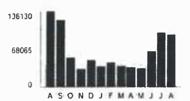

The image is a bar chart.

- **Chart Type**: Bar chart
- **Axes**:
  - Y-axis: No title, but labeled with values 0, 68065, and 136130.
  - X-axis: Labeled with months: A, S, O, N, D, J, F, M, A, M, J, J, A.
- **Data Points**: The bars represent monthly usage in kilowatt-hours (kWh) over a 13-month period.
- **Yearly Usage Breakdown (Monthly-Based)**: 
  - The highest usage is in the first month (A) and the last two months (J, A).
  - The lowest usage is in the middle months (J, F, M).
- **Styling**: All bars are uniformly colored in dark gray/black.

A S O N D I F M A N J J A

Page 1 of 2
Account Number 4921260008
Name KENMORE PLAZA
Service Location \$225 N KENMORE AVE BD CHICAGO
Phone Number 773-728-4211

| Bill Summary |  |  |  |
| :--: | :--: | :--: | :--: |
| Previous Balance |  |  |  |
| Total Payments - Thank You |  | \$8,631.72 |  |
| Amount Due on September 8, 2017 |  | \$7,888.64 |  |

Issue Date
August 24, 2017
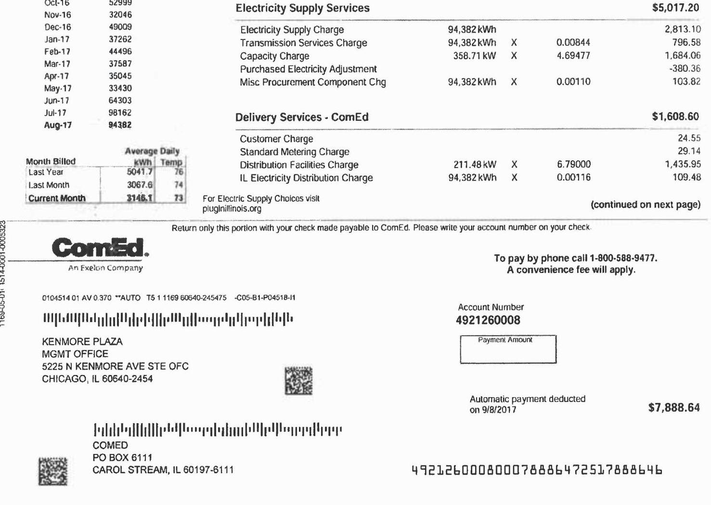

The image is a photo of a utility bill from ComEd, an Exelon Company. It includes details about electricity supply and delivery services, charges, and payment information.

- **Electricity Supply Services**:
  - Electricity Supply Charge: 94,382 kWh, $2,813.10
  - Transmission Services Charge: 94,382 kWh x 0.00844, $796.58
  - Capacity Charge: 358.71 kW x 4.69477, $1,684.06
  - Purchased Electricity Adjustment: -$380.36
  - Misc Procurement Component Chg: 94,382 kWh x 0.00110, $103.82
  - Total: $5,017.20

- **Delivery Services - ComEd**:
  - Customer Charge: $24.55
  - Standard Metering Charge: $29.14
  - Distribution Facilities Charge: 211.48 kW x 6.79000, $1,435.95
  - IL Electricity Distribution Charge: 94,382 kWh x 0.00116, $109.48
  - Total: $1,608.60

- **Account Information**:
  - Account Number: 4921260008
  - Service Location: 5225 N Kenmore Ave Ste Ofc, Chicago, IL 60640-2454
  - Payment Amount: $7,888.64
  - Automatic payment deducted on 9/8/2017

- **Additional Information**:
  - For Electric Supply Choices visit pluginillinois.org
  - To pay by phone call 1-800-588-9477 (a convenience fee will apply).

- **Return Address**:
  - ComEd, PO Box 6111, Carol Stream, IL 60197-6111

- **Barcodes and QR codes** are present for processing and identification.

# Taxes and Other 

| Environmental Cost Recovery Adj | $94,382 \mathrm{kWh}$ | $X$ | 0.00005 | 4.72 |
| :-- | :-- | :-- | :-- | --: |
| Renewable Portfolio Standard | $94,382 \mathrm{kWh}$ | $X$ | 0.00094 | 88.72 |
| Zero Emission Standard | $94,382 \mathrm{kWh}$ | $X$ | 0.00195 | 184.04 |
| Franchise Cost |  |  |  | 316.18 |
| State Tax |  |  |  | 294.20 |
| Municipal Tax |  |  |  | 374.98 |

## Total Current Charges

Thank you for your payment of $\$ 8,631.72$ on August 9, 2017

## Total Amount Due

## Message Center

## ComEd

- BUSINESS ENERGY SAVINGS: Are you a small business owner interested in saving money? ComEd Energy Efficiency Program offers a free assessment of your energy efficiency options, free products, a price quote with instant incentives and full installation services. Visit ComEd.com/SmallBiz.
- ILLINOIS COMMERCE COMMISSION CONSUMER DIVISION: (800-524-0795): The Consumer Services Division is available to help resolve disputes with ComEd. However, customers should contact ComEd first before seeking assistance from the ICC.
- DON'T GET SCAMMED: If you are contacted by someone requesting cash or asking that you buy a prepaid credit card to pay your bill or your service will be immediately disconnected, it is not ComEd calling you! It is an imposter. If this happens, please notify us at 1-800-334-7661. Do not return the imposter's call. Find out more at ComEd.com/ScamAlon.
- WAYS TO PAY: Looking for ways to pay your bill? Visit ComEd.com/Pay.
- The amount of this bill will be automatically deducted from your bank account on September 8, 2017.

## ComEd

An Ecelor Company

## Visit ComEd.com

Customer Service / Power Outage

## English

1.877.4COMED1 (1.877.426.6331)

## Español

1.800.98.LUCES (1.800.955.8237)

Hearing/Speech Impaired
1.800.572.5789 (TTY)

Your Usage Profile
13-Month Usage (Total kWh)
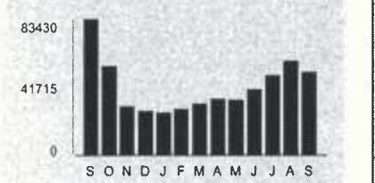

The image is a bar chart.

- **Chart Type**: Bar chart
- **Axes**:
  - **Y-Axis**: No title, but labeled with values "0", "41715", "83430".
  - **X-Axis**: Labeled with months "S", "O", "N", "D", "J", "F", "M", "A", "M", "J", "J", "A", "S".
- **Data Representation**: Each bar represents the total kWh usage for a month.
- **Yearly Usage Breakdown (Monthly-Based)**: The chart visually represents the monthly electricity usage over a year.
- **Styling**: The bars are uniformly colored in black.

Electric Usage

| Month | kWh |
| :-- | :-- |
| Sep-16 | 63425 |
| Oct-16 | 54495 |
| Nov-16 | 29996 |
| Dec-16 | 26970 |
| Jan-17 | 25941 |
| Feb-17 | 28421 |
| Mar-17 | 31519 |
| Apr-17 | 34615 |
| May-17 | 34016 |
| Jun-17 | 40506 |
| Jul-17 | 49068 |
| Aug-17 | 57751 |
| Sep-17 | 51021 |

| Month Billed | Average Daily kWh | Temp |
| :--: | :--: | :--: |
| Last Year | 2528.0 | 75 |
| Last Month | 1991.4 | 75 |
| Current Month | 1759.3 | 71 |

| 8013536 | SL | H | 117760654 |
| :--: | :--: | :--: | :--: |

KINOSBURY CENTER
C/O KATHERINE ELLIOT
350 W HUBBARD ST STE 500
CHICAGO, IL 60654

Page 1 of 2
Account Number 1528234023
Name KINGSBURY CENTER
Service Location 350 W HUBBARD ST CHICAGO Phone Number 312-595-3281

## Bill Summary

Previous Balance $\$ 6,013.66$
Total Payments - Thank You \$6,013.66
Amount Due on September 20, 2017 \$5,083.76

Issue Date September 5, 2017

| Meter Information |  |  |  |  |  |  |  |  |
| :--: | :--: | :--: | :--: | :--: | :--: | :--: | :--: | :--: |
| Read   Dates | Meter   Number | Load   Type | Reading   Type | Previous | Meter Reading   Present | Difference | Multiplier   $X$ | Usage |
| $\begin{aligned} & 80- \\ & 91- \\ & 91 \end{aligned}$ | 230159463 | General Service | Total kWh | Actual | Actual |  |  | 2550 |
|  | 230159463 | General Service | On Pk kW | Actual | Actual |  |  | 4.15 |
| $\begin{aligned} & 80- \\ & 91- \\ & 91 \end{aligned}$ | 230162248 | General Service | Total kWh | Actual | Actual |  |  | 22 |
|  | 230162248 | General Service | On Pk kW | Actual | Actual |  |  | 0.03 |
| $\begin{aligned} & 80- \\ & 91- \\ & 91 \end{aligned}$ | 230181800 | General Service | Total kWh | Actual | Actual |  |  | 48449 |
|  | 230181800 | General Service | On Pk kW | Actual | Actual |  |  | 174.96 |

## $80-$

Service from 8/3/2017 to 9/1/2017 - 29 Days
Commercial Hourly - 100 kW to 400 kW

## Electricity Supply Services

## Electricity Supply Charge

Transmission Services Charge
Capacity Charge
Purchased Electricity Adjustment
Misc Procurement Component Chg
$51,021 \mathrm{kWh} \quad \mathrm{X} \quad 0.00110$
$56.12$

Delivery Services - ComEd
24.55

Standard Metering Charge
Distribution Facilities Charge
$179.14 \mathrm{~kW} \quad \mathrm{X} \quad 6.79000$
$51,021 \mathrm{kWh} \quad \mathrm{X} \quad 0.00116$
$59.18$

For Electric Supply Choices visit
plugintilnoira.org
(continued on next page)

Return only this portion with your check made payable to ComEd. Please write your account number on your check.

## ComEd.

An Evelon Company

2003536 SL H 117760654 -C75-B1-P90000-1

KINOSBURY CENTER
C/O KATHERINE ELLIOT
350 W HUBBARD ST STE 500
CHICAGO, IL 60654

To pay by phone call 1-800-588-9477.
A convenience fee will apply.

Account Number
1528234023
Payment Amount

Please pay this
amount by $9 / 20 / 2017$
\$5,083.76
$\mathrm{HH}\left[\mathrm{H}_{\mathrm{H}}\right.$ H $\left.\mathrm{H}_{\mathrm{H}}\right]$ H! $\left.\mathrm{H}_{\mathrm{H}}\right|^{\mathrm{H}} \mathrm{H}^{\mathrm{H}} \mathrm{H}^{\mathrm{H}} \mathrm{H}^{\mathrm{H}} \mathrm{H}^{\mathrm{H}} \mathrm{H}^{\mathrm{H}} \mathrm{H}^{\mathrm{H}} \mathrm{H}^{\mathrm{H}} \mathrm{H}^{\mathrm{H}} \mathrm{H}^{\mathrm{H}} \mathrm{H}^{\mathrm{H}}$ COMED
PO BOX 6111
CAROL STREAM, IL 60197-6111
$1.52823402300050837672635083768$

| Taxes and Other |  |  |  | $\$ 708.69$ |
| :-- | --: | :-- | --: | --: |
| Environmental Cost Recovery Adj | $51,021 \mathrm{kWh}$ | X | 0.00005 | 2.55 |
| Renewable Portfolio Standard | $51,021 \mathrm{kWh}$ | X | 0.00094 | 47.96 |
| Zero Emission Standard | $51,021 \mathrm{kWh}$ | X | 0.00195 | 99.49 |
| Franchise Cost |  |  |  | 181.77 |
| Stale Tax |  |  |  | 162.81 |
| Municipal Tax |  |  |  | 214.11 |

# Total Current Charges 

$\$ 5,083.76$

## Thank you for your payment of $\$ 6,013.68$ on August 14, 2017

## $\$ 5,083.76$

## Message Center

## ComEd

- BUSINESS ENERGY SAVINGS: When is the last time you had your rooftop unit performance checked? Schedule your appointment to get your unit optimized. Call 855.433.2700.
- BEST TIMES TO CALL: Experience shorter wait times by contacting us from Tuesday to Friday between 11:00am and 4:00pm. Longer wait times can be expected on Mondays, the first business day after a holiday, and the first business day of the month. Visit us at www.ComEd.com to learn more.
- WAYS TO PAY: Locking for ways to pay your bill? Visit ComEd.com/Pay.
- ILLINOIS COMMERCE COMMISSION CONSUMER DIVISION: (800-524-0795): The Consumer Services Division is available to help resolve disputes with ComEd. However, customers should contact ComEd first before seeking assistance from the ICC.

## ComEd

An Ecelon Company

## Visit ComEd.com

Customer Service / Power Outage
English
1.877.4COMED1 (1.877.426.6331)

## Español

1.800.95.LUCES (1.800.955.8237)

Hearing/Speech Impaired
1.800.572.5789 (TTY)

Your Usage Profile
13-Month Usage (Total kWh)

## 23860

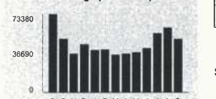

The image is a bar chart.

- **Chart Type**: Bar chart
- **Axes**:
  - **Y-Axis**: Labeled with values "73380" and "36690"
  - **X-Axis**: No visible labels
- **Data Representation**: The bars represent monthly data points, with varying heights indicating different values.
- **Notable Styling**: The bars are uniformly colored in black.
- **Description**: The chart visually represents data points that likely correspond to monthly electricity usage, showing variations in consumption over a period. The highest value on the y-axis is 73380, and the lowest is 36690, suggesting a range of usage levels.

Electric Usage

| Month | kWh |
| :-- | :-- |
| Sep-16 | 73377 |
| Oct-16 | 50294 |
| Nov-16 | 36035 |
| Dec-16 | 45122 |
| Jan-17 | 39448 |
| Feb-17 | 40200 |
| Mar-17 | 35167 |
| Apr-17 | 36213 |
| May-17 | 37414 |
| Jun-17 | 41179 |
| Jul-17 | 55262 |
| Aug-17 | 60432 |
| Sep-17 | 49864 |

## Electricity Supply Services

| Electricity Supply Charge | 49,984 kWh |  |  | 1,346.49 |
| :--: | :--: | :--: | :--: | :--: |
| Transmission Services Charge | 49,984 kWh | X | 0.00843 | 421.37 |
| Capacity Charge | 156.79 kW | X | 4.69146 | 735.57 |
| Purchased Electricity Adjustment |  |  |  | $-212.93$ |
| Misc Procurement Component Chg | 49,984 kWh | X | 0.00110 | 54.98 |

## Delivery Services - ComEd

| Customer Charge |  |  |  | 24.55 |
| :--: | :--: | :--: | :--: | :--: |
| Standard Metering Charge |  |  |  | 29.12 |
| Distribution Facilities Charge | 106.94 kW | X | 6.79000 | 726.12 |
| IL Electricity Distribution Charge | 49,984 kWh | X | 0.00116 | 57.98 |

## Taxes and Other

|  |  |  |  |  |  |  |  |  |  |  |  |  |  |  |  |  |
| :--: | :--: | :--: | :--: | :--: | :--: | :--: | :--: | :--: | :--: | :--: | :--: | :--: | :--: | :--: | :--: | :--: | :--: |
| Environment | Cost Recovery Adj | 49,984 kWh | X | 0.00005 | 2.50 |  |  |  |  |  |  |  |  |  |  |  |
| Renewable Portfolio Standard | 49,984 kWh | X | 0.00094 | 46.98 |  |  |  |  |  |  |  |  |  |  |  |  |
| Zero Emission Standard | 49,984 kWh | X | 0.00195 | 97.47 |  |  |  |  |  |  |  |  |  |  |  |  |
|  |  |  |  |  |  |  |  |  |  |  |  |  |  |  |  |  |
| For Electric Supply Choices visit   pluginiliinola.org |  |  |  |  |  |  |  |  |  |  |  |  |  |  |  |  |  |

|  |  |  |  |  |  |  |  |  |  |  |  |  |  |  |  |  |  |  |
| :--: | :--: | :--: | :--: | :--: | :--: | :--: | :--: | :--: | :--: | :--: | :--: | :--: | :--: | :--: | :--: | :--: | :--: |
|  |  |  |  |  |  |  |  |  |  |  |  |  |  |  |  |  |  |
|  |  |  |  |  |  |  |  |  |  |  |  |  |  |  |  |  |  |
|  |  |  |  |  |  |  |  |  |  |  |  |  |  |  |  |  |  |
|  |  |  |  |  |  |  |  |  |  |  |  |  |  |  |  |  |  |
|  |  |  |  |  |  |  |  |  |  |  |  |  |  |  |  |  |  |
|  |  |  |  |  |  |  |  |  |  |  |  |  |  |  |  |  |  |
|  |  |  |  |  |  |  |  |  |  |  |  |  |  |  |  |  |  |
|  |  |  |  |  |  |  |  |  |  |  |  |  |  |  |  |  |  |
|  |  |  |  |  |  |  |  |  |  |  |  |  |  |  |  |  |  |
|  |  |  |  |  |  |  |  |  |  |  |  |  |  |  |  |  |  |
|  |  |  |  |  |  |  |  |  |  |  |  |  |  |  |  |  |  |
|  |  |  |  |  |  |  |  |  |  |  |  |  |  |  |  |  |  |
|  |  |  |  |  |  |  |  |  |  |  |  |  |  |  |  |  |  |
|  |  |  |  |  |  |  |  |  |  |  |  |  |  |  |  |  |  |
|  |  |  |  |  |  |  |  |  |  |  |  |  |  |  |  |  |  |
|  |  |  |  |  |  |  |  |  |  |  |  |  |  |  |  |  |  |
|  |  |  |  |  |  |  |  |  |  |  |  |  |  |  |  |  |  |
|  |  |  |  |  |  |  |  |  |  |  |  |  |  |  |  |  |  |
|  |  |  |  |  |  |  |  |  |  |  |  |  |  |  |  |  |  |
|  |  |  |  |  |  |  |  |  |  |  |  |  |  |  |  |  |  |
|  |  |  |  |  |  |  |  |  |  |  |  |  |  |  |  |  |  |
|  |  |  |  |  |  |  |  |  |  |  |  |  |  |  |  |  |  |
|  |  |  |  |  |  |  |  |  |  |  |  |  |  |  |  |  |  |
|  |  |  |  |  |  |  |  |  |  |  |  |  |  |  |  |  |  |
|  |  |  |  |  |  |  |  |  |  |  |  |  |  |  |  |  |  |
|  |  |  |  |  |  |  |  |  |  |  |  |  |  |  |  |  |  |
|  |  |  |  |  |  |  |  |  |  |  |  |  |  |  |  |  |  |
|  |  |  |  |  |  |  |  |  |  |  |  |  |  |  |  |  |  |
|  |  |  |  |  |  |  |  |  |  |  |  |  |  |  |  |  |  |
|  |  |  |  |  |  |  |  |  |  |  |  |  |  |  |  |  |  |
|  |  |  |  |  |  |  |  |  |  |  |  |  |  |  |  |  |  |

# Chapter 2 

| Franchise Cost | 178.54 |
| :-- | --: |
| State Tax | 159.67 |
| Municipal Tax | 210.26 |

## Total Current Charges

$\$ 3,878.67$
Thank you for your payment of $\$ 4,898.19$ on August 14, 2017

## Message Center

## ComEd

- BUSINESS ENERGY SAVINGS: When is the last time you had your rooftop unit performance checked? Schedule your appointment to get your unit optimized. Call 855.433.2700.
- BEST TIMES TO CALL: Experience shorter wait times by contacting us from Tuesday to Friday between 11:00am and 4:00pm. Longer wait times can be expected on Mondays, the first business day after a holiday. and the first business day of the month. Visit us at www.ComEd.com to learn more.
- WAYS TO PAY: Looking for ways to pay your bill? Visit ComEd.com/Pay.
- ILLINOIS COMMERCE COMMISSION CONSUMER DIVISION: (800-524-0795): The Consumer Services Division is available to help resolve disputes with ComEd. However, customers should contact ComEd first before seeking assistance from the ICC.

## ComEd

An Exelon Company

## Visit ComEd.com

Customer Service / Power Outage

## English

1.877.4COMED1 (1.877.426.6331)

## Español

1.800.95.LUCES (1.800.955.8237)

## Hearing/Speech Impaired

1.800.572.5789 (TTY)

Your Usage Profile
13-Month Usage (Total kWh)
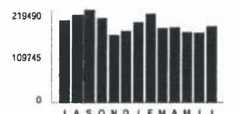

The image is a bar chart.

- **Chart Type**: Bar chart
- **Axes Titles and Units**:
  - Y-axis: No explicit title, but numerical values are shown (0, 109745, 219490).
  - X-axis: Labeled with months (J, A, S, O, N, D, J, F, M, A, M, J, J).
- **Legend Entries**: None
- **Data Points**: The chart shows monthly kWh usage, with the highest value around 219490 and a mid-point at 109745.
- **Yearly Usage Breakdown (Monthly-Based)**: The chart represents electricity usage over a 13-month period, with each bar corresponding to a month.
- **Styling**: The bars are uniformly colored in dark shades.

Electric Usage

| Month | kWh |
| :-- | :-- |
| Jul-16 | 194226 |
| Aug-16 | 208092 |
| Sep-16 | 219482 |
| Oct-16 | 199070 |
| Nov-16 | 160063 |
| Dec-16 | 169079 |
| Jan-17 | 169828 |
| Feb-17 | 205452 |
| Mar-17 | 175984 |
| Apr-17 | 177761 |
| May-17 | 166139 |
| Jun-17 | 164897 |
| Jul-17 | 179446 |

| Month Billed | kWh | 70 m |
| :--: | :--: | :--: |
| Last Year | 6057.4 | 72 |
| Last Month | 5498.6 | 56 |
| Current Month | 6187.8 | 72 |

Page 1 of 3
Account Number 1005024056
Name
LEND LEASE INC
Service Location BLDG 1000 S CLARK ST CHICAGO
Phone Number 312-396-5579

| Bill Summary |  |
| :--: | :--: |
| Previous Balance | \$12,478.50 |
| Total Payments | \$0.00 |
| Amount Due on July 17, 2017 | \$27,393.86 |

Issue Date June 30, 2017

| Meter Information |  |  |  |  |  |  |  |  |
| :--: | :--: | :--: | :--: | :--: | :--: | :--: | :--: | :--: |
| Read   Dates | Meter   Number | Load   Type | Reading   Type | Previous | Meter Reading   Present | Difference | Multiplier | Usage |
| 9/21-   6/29 | 230041762 | General Service | Total kWh | Actual | Actual |  |  | 100250 |
| 9/31-   6/29 | 230041762 | General Service | On Pk kW | Actual | Actual |  |  | 239.62 |
| 9/31-   6/29 | 230045894 | General Service | Total kWh | Actual | Actual |  |  | 33 |
| 9/31-   6/29 | 230045894 | General Service | On Pk kW | Actual | Actual |  |  | 0.00 |
| 9/31-   6/29 | 230058449 | General Service | Total kWh | Actual | Actual |  |  | 10 |
| 9/31-   6/29 | 230058449 | General Service | On Pk kW | Actual | Actual |  |  | 0.02 |
| 9/31-   6/29 | 230069071 | General Service | Total kWh | Actual | Actual |  |  | 461 |
| 9/31-   6/29 | 230069071 | General Service | On Pk kW | Actual | Actual |  |  | 1.84 |
| 9/31-   6/29 | 230062686 | General Service | Total kWh | Actual | Actual |  |  | 68638 |
| 9/31-   6/29 | 230062686 | General Service | On Pk kW | Actual | Actual |  |  | 104.81 |

Service from 5/31/2017 to 6/29/2017 - 29 Days
Commercial Hourly - 400 kW to 1000 kW

Electricity Supply Services
\$9,554.30

Electricity Supply Charge
Transmission Services Charge
Capacity Charge
Purchased Electricity Adjustment

179,446 kWh
179,446 kWh
480.72 kW
X
179,446 kWh
X
X 0.00844
4.69477
5.642.94

1.514.52
2.256.87
$-57.42$

For Electric Supply Choices visit
pkginillincis.org
(continued on next page)

Return only this portion with your check made payable to ComEd. Please write your account number on your check.

## ComEd

An Exelon Company

| 0122381 OI AV 0.370 | $\rightarrow$ WUTO | T1 01130 90805-215599 | -C05-81-P02383-It |
| :--: | :--: | :--: | :--: |
| $\eta \mathrm{H}(\mathrm{H})$ | $\left.\mathrm{H}_{\text {I }}(\mathrm{H})\right\|_{\mathrm{H}}$ | $\left.\mathrm{H}(\mathrm{H})\right\|_{\mathrm{H}}$ | $\left.\mathrm{H}_{\mathrm{H}}\right\|_{\mathrm{H}}$ |
| LEND LEASE INC |  |  |  |
| BLDG |  |  |  |
| 1000 S CLARK ST |  |  |  |
| CHICAGO, IL 60605-2155 |  |  |  |

To pay by phone call 1-800-588-9477.
A convenience fee will apply.

| Account Number 1005024056 |  |
| :--: | :--: |
| Payment Amount |  |
| Please pay this amount by 7/17/2017 | $\$ 27,393.86$ |

| Misc Procurement Component Chg | 179,446 kWh | $x$ | 0.00110 | 197.39 |
| :--: | :--: | :--: | :--: | :--: |
| Delivery Services - ComEd |  |  |  | \$2,802.83 |
| Customer Charge |  |  |  | 96.35 |
| Standard Metering Charge |  |  |  | 30.19 |
| Distribution Facilities Charge | 346.28 kW | $x$ | 7.05000 | 2,441.27 |
| IL Electricity Distribution Charge | 179,446 kWh | $x$ | 0.00116 | 208.16 |
| Meter Lease |  |  |  | 26.86 |
| Taxes and Other |  |  |  | \$2,370.96 |
| Environmental Cost Recovery Adj | 179,446 kWh | $x$ | 0.00026 | 46.66 |
| Renewable Portfolio Standard | 179,446 kWh | $x$ | 0.00094 | 168.68 |
| Zero Emission Standard | 179,446 kWh | $x$ | 0.00195 | 349.92 |
| Franchise Cost |  |  |  | 575.91 |
| State Tax |  |  |  | 547.17 |
| Municipal Tax |  |  |  | 682.62 |

Total Current Charges
\$14,728.09

| Miscellaneous | 12,665.77 |
| :--: | :--: |
| Charges from previous bill Current late payment charge (s) - electric | 12,478.59   187.18 |

Total Amount Due
\$27,393.86

# Message Center 

## ComEd

- BUSINESS ENERGY SAVINGS: Purchase high efficiency bulb/lamps on qualified products purchased through participating electrical distributors. Price reductions are given at the time of purchase with no application or preapproval required. Find a participating distributor at ComEd.com/iristantDiscounts.
- YOUR ComEd BILL: Need help understanding your bill line item definitions? Please visit us at ComEd.com/UnderstandBill or call us at 877-426-6331.
(continued on next page)

## Visit ComEd.com

Customer Service / Power Outage

## English

1.877.4COMED1 (1.877.426.6331)

## Español

1.800.95.LUCES (1.800.955.8237)

Hearing/Speech Impaired
1.800.572.5789 (TTY)

## Message Center

- ENVIRONMENTAL DISCLOSURE STATEMENT: ComEd's Environmental Disclosure Statement can now be found online at ComEd.com/EnvironmentalDisclosure.
- WAYS TO PAY: Looking for ways to pay your bill? Visit ComEd.com/Pay.
- ILLINOIS COMMERCE COMMISSION CONSUMER DIVISION (800-524-0795): The Consumer Services Division is available to help resolve disputes with ComEd. However, customers should contact ComEd first before seeking assistance from the ICC.
- POWERLINE SAFETY: Water and electricity don't mix-that's why it's important to be aware of your surroundings and watch out for electrical hazards when working or playing around water recreation areas. Look for overhead power lines before performing activities such as casting a fishing line, using a pool skimming tool or raising a boat mast, and NEVER swim around docks with electrical equipment or boats plugged into shore power. Always keep yourself or any conductive material a minimum of 10 feet away from any power line. Call 1-800-EDISON-1 before working near power lines. Learn more at ComEd.com/Safety.

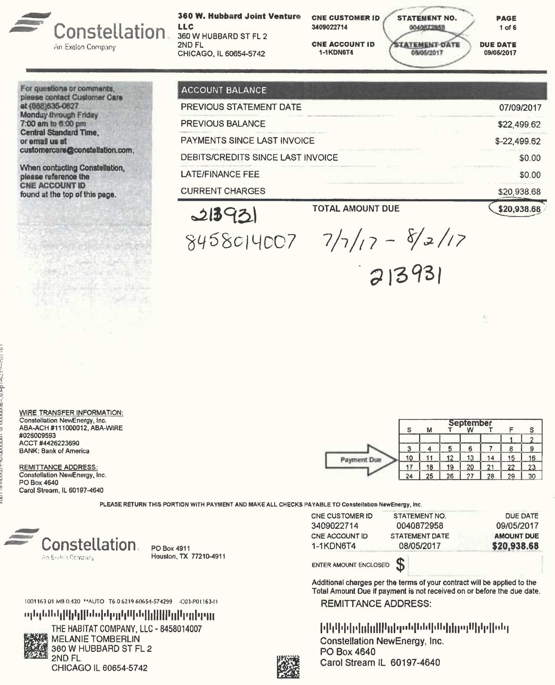

The image is a photo of a billing statement from Constellation, an Exelon Company. It includes the following details:

- **Header Information:**
  - Constellation logo and address: 360 W. Hubbard St FL 2, Chicago, IL 60654-5742.
  - CNE Customer ID: 3409022714.
  - CNE Account ID: 1-1KDN6T4.
  - Statement No.: 0040872958.
  - Statement Date: 08/05/2017.
  - Due Date: 09/05/2017.
  - Page: 1 of 6.

- **Account Balance Section:**
  - Previous Statement Date: 07/09/2017.
  - Previous Balance: $22,499.62.
  - Payments Since Last Invoice: -$22,499.62.
  - Debits/Credits Since Last Invoice: $0.00.
  - Late/Finance Fee: $0.00.
  - Current Charges: $20,938.68.
  - Total Amount Due: $20,938.68.

- **Wire Transfer Information:**
  - Constellation NewEnergy, Inc.
  - ABA-ACH: 111000012, ABA-WIRE: 026009593.
  - Acct: 9446223690.
  - Bank: Bank of America.

- **Remittance Address:**
  - Constellation NewEnergy, Inc.
  - PO Box 4640, Carol Stream, IL 60197-4640.

- **Additional Information:**
  - Contact details for customer care: (866) 835-6267, customercare@constellation.com.
  - Reference to CNE Account ID when contacting.
  - Payment due calendar for September with a highlighted "Payment Due" on the 5th.
  - Handwritten notes: "213931", "8458014007", "7/1/17 - 8/2/17", "213931".

- **Footer Information:**
  - Constellation NewEnergy, Inc. address: PO Box 4911, Houston, TX 77210-4911.
  - The Habitat Company, LLC - 8458014007.
  - Melanie Tomberlin, 360 W Hubbard St FL 2, Chicago, IL 60654-5742.

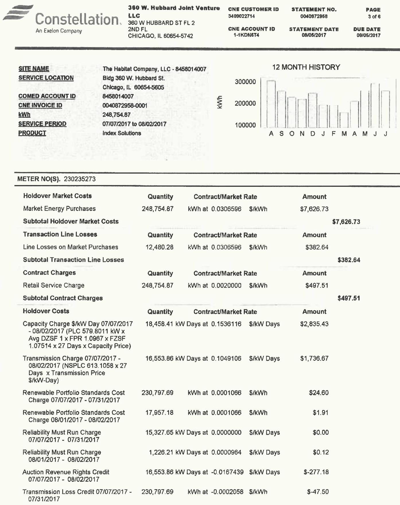

The image is a photo of a utility bill from Constellation, an Exelon Company. It includes various sections detailing energy costs and usage.

- **Header Information:**
  - **Company Name:** Constellation, 360 W. Hubbard Joint Venture LLC
  - **Address:** 360 W Hubbard St FL 2, Chicago, IL 60654-5742
  - **CNE Customer ID:** 3409022714
  - **Statement No.:** 0040872958
  - **Page:** 3 of 6
  - **CNE Account ID:** 1-KDNET4
  - **Statement Date:** 08/05/2017
  - **Due Date:** 09/05/2017

- **Site Information:**
  - **Site Name:** The Habitat Company, LLC - 8458014007
  - **Service Location:** Bldg 360 W. Hubbard St., Chicago, IL 60654-5605
  - **ComEd Account ID:** 8458014007
  - **CNE Invoice ID:** 0040872958-0001
  - **kWh:** 248,754.87
  - **Service Period:** 07/07/2017 to 08/02/2017
  - **Product:** Index Solutions

- **12 Month History Graph:**
  - Displays a bar graph of kWh usage over 12 months labeled A, S, O, N, D, J, F, M, A, M, J, J.

- **Meter No(s):** 230235273

- **Cost Breakdown:**
  - **Holdover Market Costs:**
    - Market Energy Purchases: 248,754.87 kWh at $0.0306596 $/kWh, Amount: $7,626.73
    - Subtotal: $7,626.73
  - **Transaction Line Losses:**
    - Line Losses on Market Purchases: 12,480.28 kWh at $0.0306596 $/kWh, Amount: $382.64
    - Subtotal: $382.64
  - **Contract Charges:**
    - Retail Service Charge: 248,754.87 kWh at $0.0020000 $/kWh, Amount: $497.51
    - Subtotal: $497.51
  - **Holdover Costs:**
    - Capacity Charge: 18,458.41 kW Days at 0.1536116 $/kW Days, Amount: $2,835.43
    - Transmission Charge: 16,553.86 kW Days at 0.1049106 $/kW Days, Amount: $1,736.67
    - Renewable Portfolio Standards Cost: 230,797.69 kWh at 0.0001066 $/kWh, Amount: $24.60
    - Additional Renewable Portfolio Standards Cost: 17,957.18 kWh at 0.0001066 $/kWh, Amount: $1.91
    - Reliability Must Run Charge: 15,327.65 kW Days at 0.0000000 $/kW Days, Amount: $0.00
    - Additional Reliability Must Run Charge: 1,226.21 kW Days at 0.0000964 $/kW Days, Amount: $0.12
    - Auction Revenue Rights Credit: 16,553.86 kW Days at -0.0167439 $/kW Days, Amount: -$277.18
    - Transmission Loss Credit: 230,797.69 kWh at -0.0002058 $/kWh, Amount: -$47.50

# UnitEd 

An Exelon Company

## Utility Distribution Charges

| Name | The Habitat Company, LLC - 8458014007 |
| :-- | :-- |
| Service Location | Bldg 360 W. Hubbard St. |
| COMED Account ID | 8458014007 |
| Amount Due | $\$ 7,692.53$ |

| Read | Meter | Load | Reading | Meter Reading |  |  |
| :--: | :--: | :--: | :--: | :--: | :--: | :--: |
| Date | Number | Type | Type | Previous | Present | Mult.x | Usage |
| 08/03/2017 | 230235206 | General Service | Total kWh | ACT | ACT |  | 14.438.48 |
| 08/03/2017 | 230235206 | General Service | On Pk kW | ACT | ACT |  | 20.90 |
| 08/03/2017 | 230235208 | General Service | Total kWh | ACT | ACT |  | 7.93 |
| 08/03/2017 | 230235208 | General Service | On Pk kW | ACT | ACT |  | 0.00 |
| 08/03/2017 | 230235271 | General Service | Total kWh | ACT | ACT |  | 202,277.09 |
| 08/03/2017 | 230235271 | General Service | On Pk kW | ACT | ACT |  | 458.64 |
| 08/03/2017 | 230235273 | General Service | Total kWh | ACT | ACT |  | 32,014.49 |
| 08/03/2017 | 230235273 | General Service | On Pk kW | ACT | ACT |  | 52.44 |
| 08/03/2017 | 230242420 | General Service | Total kWh | ACT | ACT |  | 16.89 |
| 08/03/2017 | 230242420 | General Service | On Pk kW | ACT | ACT |  | 0.03 |
|  |  |  |  |  |  |  |  |
| Rate Class - Retail Delivery Service - 400 kW to 1000 kW |  |  | Service 07/07/2017 To 08/03/2017 - 27 Days |  |  |  |  |
| Customer Charge |  | 0.00 |  |  |  |  | $\$ 96.35$ |
| Standard Metering Charge |  | 0.00 |  |  |  |  | $\$ 30.19$ |
| Distribution Facilities Charge |  | 532.01 kW |  | 7.05 |  |  | $\$ 3,750.67$ |
| Single Bill Option Credit |  | 0.00 |  |  |  |  | $\$-0.50$ |
| IL Electricity Distribution Charge |  | 248,755.00 kWh |  | 0.00116 |  |  | $\$ 288.56$ |
| Meter Lease |  | 0.00 |  |  |  |  | $\$ 34.58$ |
| Nonstandard Facilities Charge |  | 0.00 |  |  |  |  | $\$ 288.20$ |
| Environmental Cost Recovery Adj |  | 248,755.00 kWh |  | 0.00005 |  |  | $\$ 12.44$ |
| Renewable Portfolio Standard |  | 248,755.00 kWh |  | 0.00094 |  |  | $\$ 233.83$ |
| Zero Emission Standard |  | 248,755.00 kWh |  | 0.00195 |  |  | $\$ 485.07$ |
| Franchise Cost |  | 0.00 |  |  |  |  | $\$ 787.30$ |
| State Tax |  | 0.00 |  |  |  |  | $\$ 753.02$ |
| Municipal Tax |  | 0.00 |  |  |  |  | $\$ 932.82$ |
| Total Current Charges |  | 0.00 |  |  |  |  | $\$ 7,692.53$ |

## THIS IS NOT AN INVOICE - DO NOT PAY

We are required by your utility to include these charges for informational purpose only. Constellation NewEnergy, Inc. is responsible for payment of the Total Current Charges. Questions? 24 hours a day, call 1-800-Edison-1(1-800-334-7661)

## MidAmerican

ENERGY SERVICES, LLC
A. Bensalow Hathaway Energy Company

Customer Service: 800-432-8574
PO Box 8019 Davenport IA 52808-8019
www.midamericanenergyservices.com

| ACCOUNT NUMBER |  |  | DUE DATE |  | AMOUNT DUE |
| :--: | :--: | :--: | :--: | :--: | :--: |
| 262421 |  |  | Aug 28, 2017 |  | \$48,486.80 |

## MEPT MC CLURG COURT LLC Statement Date: 08/04/17 600 N MCCLURG CT CHICAGO, IL Statement Number: 8011852 ACCOUNT NUMBER 1430174012

## ACCOUNT SUMMARY

| OPENING BALANCE | PAYMENTS RECEIVED |  | BALANCE FORWARD | CURRENT CHARGES | AMOUNT DUE |
| :--: | :--: | :--: | :--: | :--: | :--: |
| \$48,036.02 | \$47,644.14CR |  | \$391.88 | \$48,094.92 | \$48,486.80 |

The amount due after Aug 28, 2017 is $\$ 49,208.22$ which includes a late payment charge of $\$ 721.42$.

## SUMMARY

|  | End Read   Date | kWh | Energy   Charges | Utility   Charges | Fees   and Taxes | Total Current   Charges |
| :--: | :--: | :--: | :--: | :--: | :--: | :--: |
| 1430174012 | 08/03/17 | 594,896 | $\$ 31,654.34$ | $\$ 16,440.58$ | $\$ 0.00$ | $\$ 48,094.92$ |
| Total |  |  |  |  |  | $\$ 48,094.92$ |

## MESSAGE CENTER

For electric outages and other delivery service emergencies, 24 hours a day, call Commonwealth Edison Company at 800-334-7661.
At MidAmerican Energy Services, LLC, our goal is to provide exceptional service to our valued customers. Customers can access bill statements, real-time market pricing and historical usage data through our online Energy Manager Assistant at www.midamericanenergyservices.com.

For more information about these services, please contact our Customer Service Department at 800-432-8574. Monday - Friday, 7 a.m. to 5 p.m. (CT) or send an email to support@midamericanenergyservices.com.

The Electricity Sources \& Emissions Disclosure for MidAmerican Energy Services, LLC is online at www.midamericanenergyservices.com or call 800-432-8574.

## TERMS AND DEFINITIONS

Utility Charges - Covers the costs associated with distributing electricity through the local utility distribution system.
Energy Supply Charges - Reflects the cost of generating and transmitting electrical energy to you.
Late Payment Penalty - Additional Charge of $1.5 \%$ added to the bill if the amount due is not received by the due date.
Estimate - The LDC provided an estimated reading. Any necessary adjustments for an estimated bill will be made the next time the meter is read. kWh - Unit of electric usage. One kilowatt-hour is the amount of electric energy used to keep one 100-watt light bulb burning for 10 hours.

| S\# |  |  |  |  |
| :--: | :--: | :--: | :--: | :--: |
| Send | Please include this portion with your payment. Your payment must arrive by the due date to avoid a late payment penalty. |  |  |  |
|  | ACCOUNT NUMBER | DUE DATE |  | AMOUNT DUE |
|  | 262421 | Aug 28, 2017 |  | \$48,486.80 |

The amount due after Aug 28, 2017 is $\$ 49,208.22$.

## MILAMER

MEPT MC CLURG COURT LLC
CIO MOMT OFFICE
333 E ONTARIO ST
CHICAGO IL 60611

## MIdAmerican Energy Services, LLC

PO Box 8019
Davenport IA 52808-8019

## ComEd

An Exelion Company

## Visit ComEd.com

Customer Service / Power Outage
English
1.877.4COMED1 (1.877.428.6331)

## Expafol

1.800.95.LUCE5 (1.800.955.8237)

## Hearing/Speech Impaired

1.800.572.5789 (TTV)

## Your Usage Profile

13-Month Usage (Total kWh)
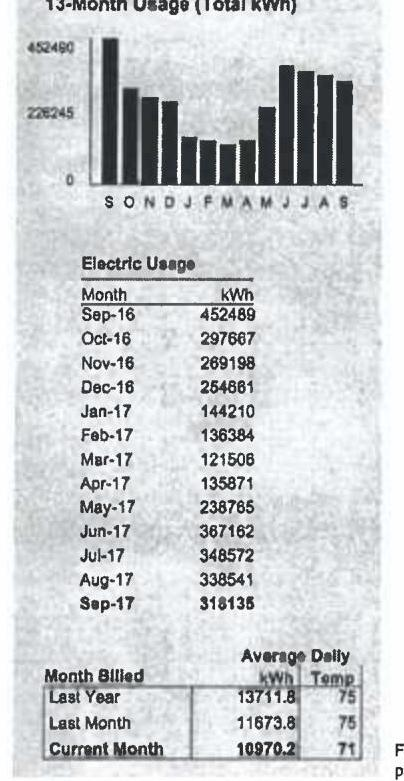

The image is a graph/chart.

- **Chart Type**: Bar chart
- **Title**: 13-Month Usage (Total kWh)
- **X-Axis**: Months labeled as S, O, N, D, J, F, M, A, M, J, J, A, S
- **Y-Axis**: kWh with markers at 0, 226245, and 452490
- **Data Points**:
  - Sep-16: 452489 kWh
  - Oct-16: 297667 kWh
  - Nov-16: 269198 kWh
  - Dec-16: 254861 kWh
  - Jan-17: 144210 kWh
  - Feb-17: 136384 kWh
  - Mar-17: 121508 kWh
  - Apr-17: 135871 kWh
  - May-17: 238765 kWh
  - Jun-17: 367162 kWh
  - Jul-17: 348572 kWh
  - Aug-17: 338541 kWh
  - Sep-17: 318135 kWh
- **Additional Information**:
  - Average Daily:
    - Month Billed: Last Year 13711.8 kWh, Temp 75
    - Last Month: 11673.8 kWh, Temp 75
    - Current Month: 10970.2 kWh, Temp 71

This chart provides a **yearly usage breakdown (monthly-based)** for electricity consumption over a 13-month period.

## EIecht Iage

Month
kWh
Sep-16
452489
Oct-16 297667
Nov-16 269198
Dec-16 234681
Jan-17 144210
Feb-17 138384
Mar-17 121508
Apr-17 135671
May-17 238765
Jun-17 367162
Jul-17 348572
Aug-17 338941
Sep-17 318135

## Average Daily

|  |  |  |  |  |  |  |  |  |  |  |
| :--: | :--: | :--: | :--: | :--: | :--: | :--: | :--: | :--: | :--: | :--: |
| Read   Dates |  | Meter   Number | Load   Type | Reading   Type | Previous | Meter Reading   Present | Difference | Multiplier   $X$ | Usage |
| 8/3-   8/1 |  | 230167688 | General Service | Total kWh | Actual | Actual |  |  | 12 |
| 8/3-   8/1 |  | 230167688 | General Service | On Pt kW | Actual | Actual |  |  | 0.02 |
| 8/3-   8/1 |  | 230167689 | General Service | Total kWh | Actual | Actual |  |  | 12 |
| 8/3-   8/1 |  | 230167689 | General Service | On Pt kW | Actual | Actual |  |  | 0.02 |
| 8/3-   8/1 |  | 230201710 | General Service | Total kWh | Actual | Actual |  |  | 30623 |
| 8/3-   9/1 |  | 230201710 | General Service | On Pt kW | Actual | Actual |  |  | 48.65 |
| 8/3-   9/1 |  | 230201711 | General Service | Total kWh | Actual | Actual |  |  | 267487 |
| 8/3-   9/1 |  | 230201711 | General Service | On Pt kW | Actual | Actual |  |  | 554.16 |

Service from 8/3/2017 to 9/1/2017 - 29 Days
Commercial Hourly - 400 kW to 1000 kW
Electricity Supply Services
$14,345.57$
Electricity Supply Charge
Transmission Services Charge
Capacity Charge
Purchased Electricity Adjustment
Misc Procurement Component Chg
318,135 kWh
$8,494.59$
$2.581 .88$
$4,174.41$
$1,355.26$
$349.95$

Delivery Services - ComEd
$4,759.31$
Customer Charge
96.31

For Electric Supply Choices visit
ph.govillinois.org
(continued on next page)

Return only this portion with your check made payable to ComEd. Please write your account number on your check.

## ComEd.

An Exelion Company

To pay by phone call 1-808-588-9477.
A convenience fee will apply.
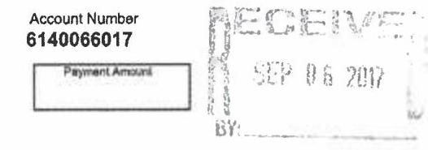

The image is a photo or illustration showing a stamped document. The visible text includes:

- "Account Number 6140066017"
- "Payment Amount"
- A stamp with the text "RECEIVED SEP 06 2017"

Automatic payment deducted on 9/20/2017
$23,181.47$

Standard Metering Charge
Distribution Facilities Charge
IL Electricity Distribution Charge
Meter Lease

Taxes and Other
Environmental Cost Recovery Adj
Renewable Portfolio Standard
Zero Emission Standard
Franchise Cost
State Tax
Municipal Tax

30.18
4.250 .02
369.04
13.76

| 318,135 kWh | $X$ | 0.00005 | 15.91 |
| :-- | :-- | :-- | --: |
| $318,135 k W$ | $X$ | 0.00094 | 299.05 |
| $318,135 k W$ | $X$ | 0.00195 | 623.36 |
|  |  |  | 998.91 |
|  |  |  | 959.08 |
|  |  |  | 1,183.28 |

Total Current Charges
$\$ 23,181.47$
Thank you for your payment of $\$ 26,489.80$ on August 21, 2017

Total Amount Due
$\$ 23,181.47$

# Message Center 

## ComEd

- BUSINESS ENERGY SAVINGS: When is the last time you had your rooftop unit performance checked? Schedule your appointment to get your unit optimized. Call 855.433.2700.
- BEST TIMES TO CALL: Experience shorter wait times by contacting us from Tuesday to Friday between 11:00am and 4:00pm. Longer wait times can be expected on Monday, the first business day after a holiday, and the first business day of the month. Visit us at www.ComEd.com to learn more.
- WAYS TO PAY: Looking for ways to pay your bill? Visit ComEd.com/Pay.
- ILLINOIS COMMERCE COMMISSION CONSUMER DIVISION: (800-524-0795): The Consumer Services Division is available to help resolve disputes with ComEd. However, customers should contact ComEd first before seeking assistance from the ICC.
- The amount of this bill will be automatically deducted from your bank account on September 20, 2017.

## ComEd

An Eeclon Company

## Visit ComEd.com

Customer Service / Power Outage English
1.877.4COMED1 (1.877.426.6331)

## Español

1.800.95.LUCES (1.800.955.8237)

Hearing/Speech Impaired
1.800.572.5789 (TTY)

Your Usage Profile
13-Month Usage (Total kWh)
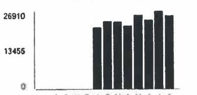

The image is a bar chart.

- **Chart Type**: Bar chart
- **Axes**:
  - **Y-axis**: No title, with units labeled as "13455" and "26910"
  - **X-axis**: No visible labels, but the context suggests months (A, S, O, N, O, J, F, M, A, M, J, J, A)
- **Data Points**: The bars represent monthly data, but specific values are not visible in the image.
- **Styling**: The bars are uniformly colored in black. 

This chart likely represents a **yearly usage breakdown (monthly-based)** for electricity consumption in kWh.

A S O N O J F M A M J J A

| Electric Usage |  |  |  |  |  |  |  |  |
| :--: | :--: | :--: | :--: | :--: | :--: | :--: | :--: | :--: |
| Month | kWh |  |  |  |  |  |  |  |
| Jan-17 | 21171 |  |  |  |  |  |  |  |
| Feb-17 | 23370 |  |  |  |  |  |  |  |
| Mar-17 | 23137 |  |  |  |  |  |  |  |
| Apr-17 | 21756 |  |  |  |  |  |  |  |
| May-17 | 25461 |  |  |  |  |  |  |  |
| Jun-17 | 23831 |  |  |  |  |  |  |  |
| Jul-17 | 28906 |  |  |  |  |  |  |  |
| Aug-17 | 25285 |  |  |  |  |  |  |  |
|  | Average Daily |  |  |  |  |  |  |  |
| Month Billed | kWh |  |  |  |  |  |  |  |
| Last Year | 0.9 |  |  |  |  |  |  |  |
| Last Month | 896.9 |  | 74 |  |  |  |  |  |
| Current Month | 871.9 |  | 73 |  |  |  |  |  |

Page 1 of 2
Account Number 8428649047
Name
EASTWOOD GARDEN LIMITED
Service Location 6531 S LOWE CHICAGO
Phone Number 773-874-0100

| Bill Summary |  |  |  |
| :--: | :--: | :--: | :--: |
| Previous Balance |  |  | $\$ 2,722.64$ |
| Total Payments |  |  | 50.00 |
| Amount Due on August 25, 2017 |  |  | \$5,316.05 |

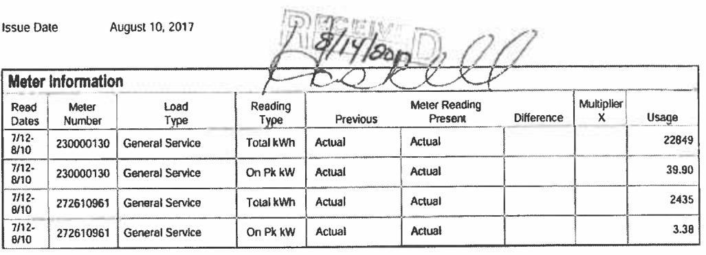

The image is a table with the following details:

- **Title**: Meter Information
- **Issue Date**: August 10, 2017
- **Columns**:
  - **Read Dates**: 7/12-8/10
  - **Meter Number**: 230000130, 272510961
  - **Load Type**: General Service
  - **Reading Type**: Total kWh, On Pk kW
  - **Meter Reading Previous**: Actual
  - **Meter Reading Present**: Actual
  - **Difference**: (Blank)
  - **Multiplier X**: (Blank)
  - **Usage**: 22849, 39.90, 2435, 3.38

There is a handwritten note with a date: 8/14/2017.

Service from 7/12/2017 to 8/10/2017 - 29 Days
Commercial Demand - 0 to 100 kW

| Electricity Supply Services |  |  |  |  | \$1,818.24 |
| :--: | :--: | :--: | :--: | :--: | :--: |
| Electricity Supply Charge | 25,285 kWh | X | 0.05674 |  | 1,434.67 |
| Transmission Services Charge | 25,285 kWh | X | 0.01327 |  | 335.53 |
| Purchased Electricity Adjustment |  |  |  |  | 48.04 |
| Delivery Services - ComEd |  |  |  |  | \$354.49 |
| Customer Charge |  |  |  |  | 17.89 |
| Standard Metering Charge |  |  |  |  | 13.14 |
| Distribution Facilities Charge | 43.28 kW | X | 6.59000 |  | 265.22 |
| IL Electricity Distribution Charge | 25,285 kWh | X | 0.00116 |  | 29.33 |
| Meter Lease |  |  |  |  | 8.91 |

Taxes and Other
\$379.83
Environmental Cost Recovery Adj
25,285 kWh X
0.00005
1.26

For Electric Supply Choices visit
phagnillinois.org
(continued on next page)

Return only this portion with your check made payable to ComEd. Please write your account number on your check.

## ComEd

An Faelon Company

201496201 AV 0.370 **AUTO TB 01159 60621-264999 -C05-B1-P14896-It
(hh|h|h|h|h|h|h|h|h|h|h|h|h|h|h|h|h|

EASTWOOD GARDEN LIMITED PARTNERSHIP 6531 S LOWE
CHICAGO, IL 60621-2649

To pay by phone call 1-800-586-9477.
A convenience fee will apply.

Account Number
8428649047

Payment Amount

Please pay this
amount by 8/25/2017
\$5,316.05
$\left.\begin{array}{l}\mid h \mid h \\ \mid h \mid h \\ \mid h \end{array}\right\rvert\, \mathrm{h} \quad \mathrm{h} \quad \mathrm{h} \quad \mathrm{h} \quad \mathrm{h} \quad \mathrm{h} \quad \mathrm{h} \quad \mathrm{h} \quad \mathrm{h} \quad \mathrm{h} \quad \mathrm{h} \quad \mathrm{h} \quad \mathrm{h} \quad \mathrm{h} \quad \mathrm{h} \quad \mathrm{h} \quad \mathrm{h} \quad \mathrm{h} \quad \mathrm{h} \quad \mathrm{h} \quad \mathrm{h} \quad \mathrm{h} \quad \mathrm{h} \quad \mathrm{h} \quad \mathrm{h} \quad \mathrm{h} \quad \mathrm{h} \quad \mathrm{h} \quad \mathrm{h} \quad \mathrm{h} \quad \mathrm{h} \quad \mathrm{h} \quad \mathrm{h} \quad \mathrm{h} \quad \mathrm{h} \quad \mathrm{h} \quad \mathrm{h} \quad \mathrm{h} \quad \mathrm{h} \quad \mathrm{h} \quad \mathrm{h} \quad \mathrm{h} \quad \mathrm{h} \quad \mathrm{h} \quad \mathrm{h} \quad \mathrm{h} \quad \mathrm{h} \quad \mathrm{h} \quad \mathrm{h} \quad \mathrm{h} \quad \mathrm{h} \quad \mathrm{h} \quad \mathrm{h} \quad \mathrm{h} \quad \mathrm{h} \quad \mathrm{h} \quad \mathrm{h} \quad \mathrm{h} \quad \mathrm{h} \quad \mathrm{h} \quad \mathrm{h} \quad \mathrm{h} \quad \mathrm{h} \quad \mathrm{h} \quad \mathrm{h} \quad \mathrm{h} \quad \mathrm{h} \quad \mathrm{h} \quad \mathrm{h} \quad \mathrm{h} \quad \mathrm{h} \quad \mathrm{h} \quad \mathrm{h} \quad \mathrm{h} \quad \mathrm{h} \quad \mathrm{h} \quad \mathrm{h} \quad \mathrm{h} \quad \mathrm{h} \quad \mathrm{h} \quad \mathrm{h} \quad \mathrm{h} \quad \mathrm{h} \quad \mathrm{h} \quad \mathrm{h} \quad \mathrm{h} \quad \mathrm{h} \quad \mathrm{h} \quad \mathrm{h} \quad \mathrm{h} \quad \mathrm{h} \quad \mathrm{h} \quad \mathrm{h} \quad \mathrm{h} \quad \mathrm{h} \quad \mathrm{h} \quad \mathrm{h} \quad \mathrm{h} \quad \mathrm{h} \quad \mathrm{h} \quad \mathrm{h} \quad \mathrm{h} \quad \mathrm{h} \quad \mathrm{h} \quad \mathrm{h} \quad \mathrm{h} \quad \mathrm{h} \quad \mathrm{h} \quad \mathrm{h} \quad \mathrm{h} \quad \mathrm{h} \quad \mathrm{h} \quad \mathrm{h} \quad \mathrm{h} \quad \mathrm{h} \quad \mathrm{h} \quad \mathrm{h} \quad \mathrm{h} \quad \mathrm{h} \quad \mathrm{h} \quad \mathrm{h} \quad \mathrm{h} \quad \mathrm{h} \quad \mathrm{h} \quad \mathrm{h} \quad \mathrm{h} \quad \mathrm{h} \quad \mathrm{h} \quad \mathrm{h} \quad \mathrm{h} \quad \mathrm{h} \quad \mathrm{h} \quad \mathrm{h} \quad \mathrm{h} \quad \mathrm{h} \quad \mathrm{h} \quad \mathrm{h} \quad \mathrm{h} \quad \mathrm{h} \quad \mathrm{h} \quad \mathrm{h} \quad \mathrm{h} \quad \mathrm{h} \quad \mathrm{h} \quad \mathrm{h} \quad \mathrm{h} \quad \mathrm{h} \quad \mathrm{h} \quad \mathrm{h} \quad \mathrm{h} \quad \mathrm{h} \quad \mathrm{h} \quad \mathrm{h} \quad \mathrm{h} \quad \mathrm{h} \quad \mathrm{h} \quad \mathrm{h} \quad \mathrm{h} \quad \mathrm{h} \quad \mathrm{h} \quad \mathrm{h} \quad \mathrm{h} \quad \mathrm{h} \quad \mathrm{h} \quad \mathrm{h} \quad \mathrm{h} \quad \mathrm{h} \quad \mathrm{h} \quad \mathrm{h} \quad \mathrm{h} \quad \mathrm{h} \quad \mathrm{h} \quad \mathrm{h} \quad \mathrm{h} \quad \mathrm{h} \quad \mathrm{h} \quad \mathrm{h} \quad \mathrm{h} \quad \mathrm{h} \quad \mathrm{h} \quad \mathrm{h} \quad \mathrm{h} \quad \mathrm{h} \quad \mathrm{h} \quad \mathrm{h} \quad \mathrm{h} \quad \mathrm{h} \quad \mathrm{h} \quad \mathrm{h} \quad \mathrm{h} \quad \mathrm{h} \quad \mathrm{h} \quad \mathrm{h} \quad \mathrm{h} \quad \mathrm{h} \quad \mathrm{h} \quad \mathrm{h} \quad \mathrm{h} \quad \mathrm{h} \quad \mathrm{h} \quad \mathrm{h} \quad \mathrm{h} \quad \mathrm{h} \quad \mathrm{h} \quad \mathrm{h} \quad \mathrm{h} \quad \mathrm{h} \quad \mathrm{h} \quad \mathrm{h} \quad \mathrm{h} \quad \mathrm{h} \quad \mathrm{h} \quad \mathrm{h} \quad \mathrm{h} \quad \mathrm{h} \quad \mathrm{h} \quad \mathrm{h} \quad \mathrm{h} \quad \mathrm{h} \quad \mathrm{h} \quad \mathrm{h} \quad \mathrm{h} \quad \mathrm{h} \quad \mathrm{h} \quad \mathrm{h} \quad \mathrm{h} \quad \mathrm{h} \quad \mathrm{h} \quad \mathrm{h} \quad \mathrm{h} \quad \mathrm{h} \quad \mathrm{h} \quad \mathrm{h} \quad \mathrm{h} \quad \mathrm{h} \quad \mathrm{h} \quad \mathrm{h} \quad \mathrm{h} \quad \mathrm{h} \quad \mathrm{h} \quad \mathrm{h} \quad \mathrm{h} \quad \mathrm{h} \quad \mathrm{h} \quad \mathrm{h} \quad \mathrm{h} \quad \mathrm{h} \quad \mathrm{h} \quad \mathrm{h} \quad \mathrm{h} \quad \mathrm{h} \quad \mathrm{h} \quad \mathrm{h} \quad \mathrm{h} \quad \mathrm{h} \quad \mathrm{h} \quad \mathrm{h} \quad \mathrm{h} \quad \mathrm{h} \quad \mathrm{h} \quad \mathrm{h} \quad \mathrm{h} \quad \mathrm{h} \quad \mathrm{h} \quad \mathrm{h} \quad \mathrm{h} \quad \mathrm{h} \quad \mathrm{h} \quad \mathrm{h} \quad \mathrm{h} \quad \mathrm{h} \quad \mathrm{h} \quad \mathrm{h} \quad \mathrm{h} \quad \mathrm{h} \quad \mathrm{h} \quad \mathrm{h} \quad \mathrm{h} \quad \mathrm{h} \quad \mathrm{h} \quad \mathrm{h} \quad \mathrm{h} \quad \mathrm{h} \quad \mathrm{h} \quad \mathrm{h} \quad \mathrm{h} \quad \mathrm{h} \quad \mathrm{h} \quad \mathrm{h} \quad \mathrm{h} \quad \mathrm{h} \quad \mathrm{h} \quad \mathrm{h} \quad \mathrm{h} \quad \mathrm{h} \quad \mathrm{h} \quad \mathrm{h} \quad \mathrm{h} \quad \mathrm{h} \quad \mathrm{h} \quad \mathrm{h} \quad \mathrm{h} \quad \mathrm{h} \quad \mathrm{h} \quad \mathrm{h} \quad \mathrm{h} \quad \mathrm{h} \quad \mathrm{h} \quad \mathrm{h} \quad \mathrm{h} \quad \mathrm{h} \quad \mathrm{h} \quad \mathrm{h} \quad \mathrm{h} \quad \mathrm{h} \quad \mathrm{h} \quad \mathrm{h} \quad \mathrm{h} \quad \mathrm{h} \quad \mathrm{h} \quad \mathrm{h} \quad \mathrm{h} \quad \mathrm{h} \quad \mathrm{h} \quad \mathrm{h} \quad \mathrm{h} \quad \mathrm{h} \quad \mathrm{h} \quad \mathrm{h} \quad \mathrm{h} \quad \mathrm{h} \quad \mathrm{h} \quad \mathrm{h} \quad \mathrm{h} \quad \mathrm{h} \quad \mathrm{h} \quad \mathrm{h} \quad \mathrm{h} \quad \mathrm{h} \quad \mathrm{h} \quad \mathrm{h} \quad \mathrm{h} \quad \mathrm{h} \quad \mathrm{h} \quad \mathrm{h} \quad \mathrm{h} \quad \mathrm{h} \quad \mathrm{h} \quad \mathrm{h} \quad \mathrm{h} \quad \mathrm{h} \quad \mathrm{h} \quad \mathrm{h} \quad \mathrm{h} \quad \mathrm{h} \quad \mathrm{h} \quad \mathrm{h} \quad \mathrm{h} \quad \mathrm{h} \quad \mathrm{h} \quad \mathrm{h} \quad \mathrm{h} \quad \mathrm{h} \quad \mathrm{h} \quad \mathrm{h} \quad \mathrm{h} \quad \mathrm{h} \quad \mathrm{h} \quad \mathrm{h} \quad \mathrm{h} \quad \mathrm{h} \quad \mathrm{h} \quad \mathrm{h} \quad \mathrm{h} \quad \mathrm{h} \quad \mathrm{h} \quad \mathrm{h} \quad \mathrm{h} \quad \mathrm{h} \quad \mathrm{h} \quad \mathrm{h} \quad \mathrm{h} \quad \mathrm{h} \quad \mathrm{h} \quad \mathrm{h} \quad \mathrm{h} \quad \mathrm{h} \quad \mathrm{h} \quad \mathrm{h} \quad \mathrm{h} \quad \mathrm{h} \quad \mathrm{h} \quad \mathrm{h} \quad \mathrm{h} \quad \mathrm{h} \quad \mathrm{h} \quad \mathrm{h} \quad \mathrm{h} \quad \mathrm{h} \quad \mathrm{h} \quad \mathrm{h} \quad \mathrm{h} \quad \mathrm{h} \quad \mathrm{h} \quad \mathrm{h} \quad \mathrm{h} \quad \mathrm{h} \quad \mathrm{h} \quad \mathrm{h} \quad \mathrm{h} \quad \mathrm{h} \quad \mathrm{h} \quad \mathrm{h} \quad \mathrm{h} \quad \mathrm{h} \quad \mathrm{h} \quad \mathrm{h} \quad \mathrm{h} \quad \mathrm{h} \quad \mathrm{h} \quad \mathrm{h} \quad \mathrm{h} \quad \mathrm{h} \quad \mathrm{h} \quad \mathrm{h} \quad \mathrm{h} \quad \mathrm{h} \quad \mathrm{h} \quad \mathrm{h} \quad \mathrm{h} \quad \mathrm{h} \quad \mathrm{h} \quad \mathrm{h} \quad \mathrm{h} \quad \mathrm{h} \quad \mathrm{h} \quad \mathrm{h} \quad \mathrm{h} \quad \mathrm{h} \quad \mathrm{h} \quad \mathrm{h} \quad \mathrm{h} \quad \mathrm{h} \quad \mathrm{h} \quad \mathrm{h} \quad \mathrm{h} \quad \mathrm{h} \quad \mathrm{h} \quad \mathrm{h} \quad \mathrm{h} \quad \mathrm{h} \quad \mathrm{h} \quad \mathrm{h} \quad \mathrm{h} \quad \mathrm{h} \quad \mathrm{h} \quad \mathrm{h} \quad \mathrm{h} \quad \mathrm{h} \quad \mathrm{h} \quad \mathrm{h} \quad \mathrm{h} \quad \mathrm{h} \quad \mathrm{h} \quad \mathrm{h} \quad \mathrm{h} \quad \mathrm{h} \quad \mathrm{h} \quad \mathrm{h} \quad \mathrm{h} \quad \mathrm{h} \quad \mathrm{h} \quad \mathrm{h} \quad \mathrm{h} \quad \mathrm{h} \quad \mathrm{h} \quad \mathrm{h} \quad \mathrm{h} \quad \mathrm{h} \quad \mathrm{h} \quad \mathrm{h} \quad \mathrm{h} \quad \mathrm{h} \quad \mathrm{h} \quad \mathrm{h} \quad \mathrm{h} \quad \mathrm{h} \quad \mathrm{h} \quad \mathrm{h} \quad \mathrm{h} \quad \mathrm{h} \quad \mathrm{h} \quad \mathrm{h} \quad \mathrm{h} \quad \mathrm{h} \quad \mathrm{h} \quad \mathrm{h} \quad \mathrm{h} \quad \mathrm{h} \quad \mathrm{h} \quad \mathrm{h} \quad \mathrm{h} \quad \mathrm{h} \quad \mathrm{h} \quad \mathrm{h} \quad \mathrm{h} \quad \mathrm{h} \quad \mathrm{h} \quad \mathrm{h} \quad \mathrm{h} \quad \mathrm{h} \quad \mathrm{h} \quad \mathrm{h} \quad \mathrm{h} \quad \mathrm{h} \quad \mathrm{h} \quad \mathrm{h} \quad \mathrm{h} \quad \mathrm{h} \quad \mathrm{h} \quad \mathrm{h} \quad \mathrm{h} \quad \mathrm{h} \quad \mathrm{h} \quad \mathrm{h} \quad \mathrm{h} \quad \mathrm{h} \quad \mathrm{h} \quad \mathrm{h} \quad \mathrm{h} \quad \mathrm{h} \quad \mathrm{h} \quad \mathrm{h} \quad \mathrm{h} \quad \mathrm{h} \quad \mathrm{h} \quad \mathrm{h} \quad \mathrm{h} \quad \mathrm{h} \quad \mathrm{h} \quad \mathrm{h} \quad \mathrm{h} \quad \mathrm{h} \quad \mathrm{h} \quad \mathrm{h} \quad \mathrm{h} \quad \mathrm{h} \quad \mathrm{h} \quad \mathrm{h} \quad \mathrm{h} \quad \mathrm{h} \quad \mathrm{h} \quad \mathrm{h} \quad \mathrm{h} \quad \mathrm{h} \quad \mathrm{h} \quad \mathrm{h} \quad \mathrm{h} \quad \mathrm{h} \quad \mathrm{h} \quad \mathrm{h} \quad \mathrm{h} \quad \mathrm{h} \quad \mathrm{h} \quad \mathrm{h} \quad \mathrm{h} \quad \mathrm{h} \quad \mathrm{h} \quad \mathrm{h} \quad \mathrm{h} \quad \mathrm{h} \quad \mathrm{h} \quad \mathrm{h} \quad \mathrm{h} \quad \mathrm{h} \quad \mathrm{h} \quad \mathrm{h} \quad \mathrm{h} \quad \mathrm{h} \quad \mathrm{h} \quad \mathrm{h} \quad \mathrm{h} \quad \mathrm{h} \quad \mathrm{h} \quad \mathrm{h} \quad \mathrm{h} \quad \mathrm{h} \quad \mathrm{h} \quad \mathrm{h} \quad \mathrm{h} \quad \mathrm{h} \quad \mathrm{h} \quad \mathrm{h} \quad \mathrm{h} \quad \mathrm{h} \quad \mathrm{h} \quad \mathrm{h} \quad \mathrm{h} \quad \mathrm{h} \quad \mathrm{h} \quad \mathrm{h} \quad \mathrm{h} \quad \mathrm{h} \quad \mathrm{h} \quad \mathrm{h} \quad \mathrm{h} \quad \mathrm{h} \quad \mathrm{h} \quad \mathrm{h} \quad \mathrm{h} \quad \mathrm{h} \quad \mathrm{h} \quad \mathrm{h} \quad \mathrm{h} \quad \mathrm{h} \quad \mathrm{h} \quad \mathrm{h} \quad \mathrm{h} \quad \mathrm{h} \quad \mathrm{h} \quad \mathrm{h} \quad \mathrm{h} \quad \mathrm{h} \quad \mathrm{h} \quad \mathrm{h} \quad \mathrm{h} \quad \mathrm{h} \quad \mathrm{h} \quad \mathrm{h} \quad \mathrm{h} \quad \mathrm{h} \quad \mathrm{h} \quad \mathrm{h} \quad \mathrm{h} \quad \mathrm{h} \quad \mathrm{h} \quad \mathrm{h} \quad \mathrm{h} \quad \mathrm{h} \quad \mathrm{h} \quad \mathrm{h} \quad \mathrm{h} \quad \mathrm{h} \quad \mathrm{h} \quad \mathrm{h} \quad \mathrm{h} \quad \mathrm{h} \quad \mathrm{h} \quad \mathrm{h} \quad \mathrm{h} \quad \mathrm{h} \quad \mathrm{h} \quad \mathrm{h} \quad \mathrm{h} \quad \mathrm{h} \quad \mathrm{h} \quad \mathrm{h} \quad \mathrm{h} \quad \mathrm{h} \quad \mathrm{h} \quad \mathrm{h} \quad \mathrm{h} \quad \mathrm{h} \quad \mathrm{h} \quad \mathrm{h} \quad \mathrm{h} \quad \mathrm{h} \quad \mathrm{h} \quad \mathrm{h} \quad \mathrm{h} \quad \mathrm{h} \quad \mathrm{h} \quad \mathrm{h} \quad \mathrm{h} \quad \mathrm{h} \quad \mathrm{h} \quad \mathrm{h} \quad \mathrm{h} \quad \mathrm{h} \quad \mathrm{h} \quad \mathrm{h} \quad \mathrm{h} \quad \mathrm{h} \quad \mathrm{h} \quad \mathrm{h} \quad \mathrm{h} \quad \mathrm{h} \quad \mathrm{h} \quad \mathrm{h} \quad \mathrm{h} \quad \mathrm{h} \quad \mathrm{h} \quad \mathrm{h} \quad \mathrm{h} \quad \mathrm{h} \quad \mathrm{h} \quad \mathrm{h} \quad \mathrm{h} \quad \mathrm{h} \quad \mathrm{h} \quad \mathrm{h} \quad \mathrm{h} \quad \mathrm{h} \quad \mathrm{h} \quad \mathrm{h} \quad \mathrm{h} \quad \mathrm{h} \quad \mathrm{h} \quad \mathrm{h} \quad \mathrm{h} \quad \mathrm{h} \quad \mathrm{h} \quad \mathrm{h} \quad \mathrm{h} \quad \mathrm{h} \quad \mathrm{h} \quad \mathrm{h} \quad \mathrm{h} \quad \mathrm{h} \quad \mathrm{h} \quad \mathrm{h} \quad \mathrm{h} \quad \mathrm{h} \quad \mathrm{h} \quad \mathrm{h} \quad \mathrm{h} \quad \mathrm{h} \quad \mathrm{h} \quad \mathrm{h} \quad \mathrm{h} \quad \mathrm{h} \quad \mathrm{h} \quad \mathrm{h} \quad \mathrm{h} \quad \mathrm{h} \quad \mathrm{h} \quad \mathrm{h} \quad \mathrm{h} \quad \mathrm{h} \quad \mathrm{h} \quad \mathrm{h} \quad \mathrm{h} \quad \mathrm{h} \quad \mathrm{h} \quad \mathrm{h} \quad \mathrm{h} \quad \mathrm{h} \quad \mathrm{h} \quad \mathrm{h} \quad \mathrm{h} \quad \mathrm{h} \quad \mathrm{h} \quad \mathrm{h} \quad \mathrm{h} \quad \mathrm{h} \quad \mathrm{h} \quad \mathrm{h} \quad \mathrm{h} \quad \mathrm{h} \quad \mathrm{h} \quad \mathrm{h} \quad \mathrm{h} \quad \mathrm{h} \quad \mathrm{h} \quad \mathrm{h} \quad \mathrm{h} \quad \mathrm{h} \quad \mathrm{h} \quad \mathrm{h} \quad \mathrm{h} \quad \mathrm{h} \quad \mathrm{h} \quad \mathrm{h} \quad \mathrm{h} \quad \mathrm{h} \quad \mathrm{h} \quad \mathrm{h} \quad \mathrm{h} \quad \mathrm{h} \quad \mathrm{h} \quad \mathrm{h} \quad \mathrm{h} \quad \mathrm{h} \quad \mathrm{h} \quad \mathrm{h} \quad \mathrm{h} \quad \mathrm{h} \quad \mathrm{h} \quad \mathrm{h} \quad \mathrm{h} \quad \mathrm{h} \quad \mathrm{h} \quad \mathrm{h} \quad \mathrm{h} \quad \mathrm{h} \quad \mathrm{h} \quad \mathrm{h} \quad \mathrm{h} \quad \mathrm{h} \quad \mathrm{h} \quad \mathrm{h} \quad \mathrm{h} \quad \mathrm{h} \quad \mathrm{h} \quad \mathrm{h} \quad \mathrm{h} \quad \mathrm{h} \quad \mathrm{h} \quad \mathrm{h} \quad \mathrm{h} \quad \mathrm{h} \quad \mathrm{h} \quad \mathrm{h} \quad \mathrm{h} \quad \mathrm{h} \quad \mathrm{h} \quad \mathrm{h} \quad \mathrm{h} \quad \mathrm{h} \quad \mathrm{h} \quad \mathrm{h} \quad \mathrm{h} \quad \mathrm{h} \quad \mathrm{h} \quad \mathrm{h} \quad \mathrm{h} \quad \mathrm{h} \quad \mathrm{h} \quad \mathrm{h} \quad \mathrm{h} \quad \mathrm{h} \quad \mathrm{h} \quad \mathrm{h} \quad \mathrm{h} \quad \mathrm{h} \quad \mathrm{h} \quad \mathrm{h} \quad \mathrm{h} \quad \mathrm{h} \quad \mathrm{h} \quad \mathrm{h} \quad \mathrm{h} \quad \mathrm{h} \quad \mathrm{h} \quad \mathrm{h} \quad \mathrm{h} \quad \mathrm{h} \quad \mathrm{h} \quad \mathrm{h} \quad \mathrm{h} \quad \mathrm{h} \quad \mathrm{h} \quad \mathrm{h} \quad \mathrm{h} \quad \mathrm{h} \quad \mathrm{h} \quad \mathrm{h} \quad \mathrm{h} \quad \mathrm{h} \quad \mathrm{h} \quad \mathrm{h} \quad \mathrm{h} \quad \mathrm{h} \quad \mathrm{h} \quad \mathrm{h} \quad \mathrm{h} \quad \mathrm{h} \quad \mathrm{h} \quad \mathrm{h} \quad \mathrm{h} \quad \mathrm{h} \quad \mathrm{h} \quad \mathrm{h} \quad \mathrm{h} \quad \mathrm{h} \quad \mathrm{h} \quad \mathrm{h} \quad \mathrm{h} \quad \mathrm{h} \quad \mathrm{h} \quad \mathrm{h} \quad \mathrm{h} \quad \mathrm{h} \quad \mathrm{h} \quad \mathrm{h} \quad \mathrm{h} \quad \mathrm{h} \quad \mathrm{h} \quad \mathrm{h} \quad \mathrm{h} \quad \mathrm{h} \quad \mathrm{h} \quad \mathrm{h} \quad \mathrm{h} \quad \mathrm{h} \quad \mathrm{h} \quad \mathrm{h} \quad \mathrm{h} \quad \mathrm{h} \quad \mathrm{h} \quad \mathrm{h} \quad \mathrm{h} \quad \mathrm{h} \quad \mathrm{h} \quad \mathrm{h} \quad \mathrm{h} \quad \mathrm{h} \quad \mathrm{h} \quad \mathrm{h} \quad \mathrm{h} \quad \mathrm{h} \quad \mathrm{h} \quad \mathrm{h} \quad \mathrm{h} \quad \mathrm{h} \quad \mathrm{h} \quad \mathrm{h} \quad \mathrm{h} \quad \mathrm{h} \quad \mathrm{h} \quad \mathrm{h} \quad \mathrm{h} \quad \mathrm{h} \quad \mathrm{h} \quad \mathrm{h} \quad \mathrm{h} \quad \mathrm{h} \quad \mathrm{h} \quad \mathrm{h} \quad \mathrm{h} \quad \mathrm{h} \quad \mathrm{h} \quad \mathrm{h} \quad \mathrm{h} \quad \mathrm{h} \quad \mathrm{h} \quad \mathrm{h} \quad \mathrm{h} \quad \mathrm{h} \quad \mathrm{h} \quad \mathrm{h} \quad \mathrm{h} \quad \mathrm{h} \quad \mathrm{h} \quad \mathrm{h} \quad \mathrm{h} \quad \mathrm{h} \quad \mathrm{h} \quad \mathrm{h} \quad \mathrm{h} \quad \mathrm{h} \quad \mathrm{h} \quad \mathrm{h} \quad \mathrm{h} \quad \mathrm{h} \quad \mathrm{h} \quad \mathrm{h} \quad \mathrm{h} \quad \mathrm{h} \quad \mathrm{h} \quad \mathrm{h} \quad \mathrm{h} \quad \mathrm{h} \quad \mathrm{h} \quad \mathrm{h} \quad \mathrm{h} \quad \mathrm{h} \quad \mathrm{h} \quad \mathrm{h} \quad \mathrm{h} \quad \mathrm{h} \quad \mathrm{h} \quad \mathrm{h} \quad \mathrm{h} \quad \mathrm{h} \quad \mathrm{h} \quad \mathrm{h} \quad \mathrm{h} \quad \mathrm{h} \quad \mathrm{h} \quad \mathrm{h} \quad \mathrm{h} \quad \mathrm{h} \quad \mathrm{h} \quad \mathrm{h} \quad \mathrm{h} \quad \mathrm{h} \quad \mathrm{h} \quad \mathrm{h} \quad \mathrm{h} \quad \mathrm{h} \quad \mathrm{h} \quad \mathrm{h} \quad \mathrm{h} \quad \mathrm{h} \quad \mathrm{h} \quad \mathrm{h} \quad \mathrm{h} \quad \mathrm{h} \quad \mathrm{h} \quad \mathrm{h} \quad \mathrm{h} \quad \mathrm{h} \quad \mathrm{h} \quad \mathrm{h} \quad \mathrm{h} \quad \mathrm{h} \quad \mathrm{h} \quad \mathrm{h} \quad \mathrm{h} \quad \mathrm{h} \quad \mathrm{h} \quad \mathrm{h} \quad \mathrm{h} \quad \mathrm{h} \quad \mathrm{h} \quad \mathrm{h} \quad \mathrm{h} \quad \mathrm{h} \quad \mathrm{h} \quad \mathrm{h} \quad \mathrm{h} \quad \mathrm{h} \quad \mathrm{h} \quad \mathrm{h} \quad \mathrm{h} \quad \mathrm{h} \quad \mathrm{h} \quad \mathrm{h} \quad \mathrm{h} \quad \mathrm{h} \quad \mathrm{h} \quad \mathrm{h} \quad \mathrm{h} \quad \mathrm{h} \quad \mathrm{h} \quad \mathrm{h} \quad \mathrm{h} \quad \mathrm{h} \quad \mathrm{h} \quad \mathrm{h} \quad \mathrm{h} \quad \mathrm{h} \quad \mathrm{h} \quad \mathrm{h} \quad \mathrm{h} \quad \mathrm{h} \quad \mathrm{h} \quad \mathrm{h} \quad \mathrm{h} \quad \mathrm{h} \quad \mathrm{h} \quad \mathrm{h} \quad \mathrm{h} \quad \mathrm{h} \quad \mathrm{h} \quad \mathrm{h} \quad \mathrm{h} \quad \mathrm{h} \quad \mathrm{h} \quad \mathrm{h} \quad \mathrm{h} \quad \mathrm{h} \quad \mathrm{h} \quad \mathrm{h} \quad \mathrm{h} \quad \mathrm{h} \quad \mathrm{h} \quad \mathrm{h} \quad \mathrm{h} \quad \mathrm{h} \quad \mathrm{h} \quad \mathrm{h} \quad \mathrm{h} \quad \mathrm{h} \quad \mathrm{h} \quad \mathrm{h} \quad \mathrm{h} \quad \mathrm{h} \quad \mathrm{h} \quad \mathrm{h} \quad \mathrm{h} \quad \mathrm{h} \quad \mathrm{h} \quad \mathrm{h} \quad \mathrm{h} \quad \mathrm{h} \quad \mathrm{h} \quad \mathrm{h} \quad \mathrm{h} \quad \mathrm{h} \quad \mathrm{h} \quad \mathrm{h} \quad \mathrm{h} \quad \mathrm{h} \quad \mathrm{h} \quad \mathrm{h} \quad \mathrm{h} \quad \mathrm{h} \quad \mathrm{h} \quad \mathrm{h} \quad \mathrm{h} \quad \mathrm{h} \quad \mathrm{h} \quad \mathrm{h} \quad \mathrm{h} \quad \mathrm{h} \quad \mathrm{h} \quad \mathrm{h} \quad \mathrm{h} \quad \mathrm{h} \quad \mathrm{h} \quad \mathrm{h} \quad \mathrm{h} \quad \mathrm{h} \quad \mathrm{h} \quad \mathrm{h} \quad \mathrm{h} \quad \mathrm{h} \quad \mathrm{h} \quad \mathrm{h} \quad \mathrm{h} \quad \mathrm{h} \quad \mathrm{h} \quad \mathrm{h} \quad \mathrm{h} \quad \mathrm{h} \quad \mathrm{h} \quad \mathrm{h} \quad \mathrm{h} \quad \mathrm{h} \quad \mathrm{h} \quad \mathrm{h} \quad \mathrm{h} \quad \mathrm{h} \quad \mathrm{h} \quad \mathrm{h} \quad \mathrm{h} \quad \mathrm{h} \quad \mathrm{h} \quad \mathrm{h} \quad \mathrm{h} \quad \mathrm{h} \quad \mathrm{h} \quad \mathrm{h} \quad \mathrm{h} \quad \mathrm{h} \quad \mathrm{h} \quad \mathrm{h} \quad \mathrm{h} \quad \mathrm{h} \quad \mathrm{h} \quad \mathrm{h} \quad \mathrm{h} \quad \mathrm{h} \quad \mathrm{h} \quad \mathrm{h} \quad \mathrm{h} \quad \mathrm{h} \quad \mathrm{h} \quad \mathrm{h} \quad \mathrm{h} \quad \mathrm{h} \quad \mathrm{h} \quad \mathrm{h} \quad \mathrm{h} \quad \mathrm{h} \quad \mathrm{h} \quad \mathrm{h} \quad \mathrm{h} \quad \mathrm{h} \quad \mathrm{h} \quad \mathrm{h} \quad \mathrm{h} \quad \mathrm{h} \quad \mathrm{h} \quad \mathrm{h} \quad \mathrm{h} \quad \mathrm{h} \quad \mathrm{h} \quad \mathrm{h} \quad \mathrm{h} \quad \mathrm{h} \quad \mathrm{h} \quad \mathrm{h} \quad \mathrm{h} \quad \mathrm{h} \quad \mathrm{h} \quad \mathrm{h} \quad \mathrm{h} \quad \mathrm{h} \quad \mathrm{h} \quad \mathrm{h} \quad \mathrm{h} \quad \mathrm{h} \quad \mathrm{h} \quad \mathrm{h} \quad \mathrm{h} \quad \mathrm{h} \quad \mathrm{h} \quad \mathrm{h} \quad \mathrm{h} \quad \mathrm{h} \quad \mathrm{h} \quad \mathrm{h} \quad \mathrm{h} \quad \mathrm{h} \quad \mathrm{h} \quad \mathrm{h} \quad \mathrm{h} \quad \mathrm{h} \quad \mathrm{h} \quad \mathrm{h} \quad \mathrm{h} \quad \mathrm{h} \quad \mathrm{h} \quad \mathrm{h} \quad \mathrm{h} \quad \mathrm{h} \quad \mathrm{h} \quad \mathrm{h} \quad \mathrm{h} \quad \mathrm{h} \quad \mathrm{h} \quad \mathrm{h} \quad \mathrm{h} \quad \mathrm{h} \quad \mathrm{h} \quad \mathrm{h} \quad \mathrm{h} \quad \mathrm{h} \quad \mathrm{h} \quad \mathrm{h} \quad \mathrm{h} \quad \mathrm{h} \quad \mathrm{h} \quad \mathrm{h} \quad \mathrm{h} \quad \mathrm{h} \quad \mathrm{h} \quad \mathrm{h} \quad \mathrm{h} \quad \mathrm{h} \quad \mathrm{h} \quad \mathrm{h} \quad \mathrm{h} \quad \mathrm{h} \quad \mathrm{h} \quad \mathrm{h} \quad \mathrm{h} \quad \mathrm{h} \quad \mathrm{h} \quad \mathrm{h} \quad \mathrm{h} \quad \mathrm{h} \quad \mathrm{h} \quad \mathrm{h} \quad \mathrm{h} \quad \mathrm{h} \quad \mathrm{h} \quad \mathrm{h} \quad \mathrm{h} \quad \mathrm{h} \quad \mathrm{h} \quad \mathrm{h} \quad \mathrm{h} \quad \mathrm{h} \quad \mathrm{h} \quad \mathrm{h} \quad \mathrm{h} \quad \mathrm{h} \quad \mathrm{h} \quad \mathrm{h} \quad \mathrm{h} \quad \mathrm{h} \quad \mathrm{h} \quad \mathrm{h} \quad \mathrm{h} \quad \mathrm{h} \quad \mathrm{h} \quad \mathrm{h} \quad \mathrm{h} \quad \mathrm{h} \quad \mathrm{h} \quad \mathrm{h} \quad \mathrm{h} \quad \mathrm{h} \quad \mathrm{h} \quad \mathrm{h} \quad \mathrm{h} \quad \mathrm{h} \quad \mathrm{h} \quad \mathrm{h} \quad \mathrm{h} \quad \mathrm{h} \quad \mathrm{h} \quad \mathrm{h} \quad \mathrm{h} \quad \mathrm{h} \quad \mathrm{h} \quad \mathrm{h} \quad \mathrm{h} \quad \mathrm{h} \quad \mathrm{h} \quad \mathrm{h} \quad \mathrm{h} \quad \mathrm{h} \quad \mathrm{h} \quad \mathrm{h} \quad \mathrm{h} \quad \mathrm{h} \quad \mathrm{h} \quad \mathrm{h} \quad \mathrm{h} \quad \mathrm{h} \quad \mathrm{h} \quad \mathrm{h} \quad \mathrm{h} \quad \mathrm{h} \quad \mathrm{h} \quad \mathrm{h} \quad \mathrm{h} \quad \mathrm{h} \quad \mathrm{h} \quad \mathrm{h} \quad \mathrm{h} \quad \mathrm{h} \quad \mathrm{h} \quad \mathrm{h} \quad \mathrm{h} \quad \mathrm{h} \quad \mathrm{h} \quad \mathrm{h} \quad \mathrm{h} \quad \mathrm{h} \quad \mathrm{h} \quad \mathrm{h} \quad \mathrm{h} \quad \mathrm{h} \quad \mathrm{h} \quad \mathrm{h} \quad \mathrm{h} \quad \mathrm{h} \quad \mathrm{h} \quad \mathrm{h} \quad \mathrm{h} \quad \mathrm{h} \quad \mathrm{h} \quad \mathrm{h} \quad \mathrm{h} \quad \mathrm{h} \quad \mathrm{h} \quad \mathrm{h} \quad \mathrm{h} \quad \mathrm{h} \quad \mathrm{h} \quad \mathrm{h} \quad \mathrm{h} \quad \mathrm{h} \quad \mathrm{h} \quad \mathrm{h} \quad \mathrm{h} \quad \mathrm{h} \quad \mathrm{h} \quad \mathrm{h} \quad \mathrm{h} \quad \mathrm{h} \quad \mathrm{h} \quad \mathrm{h} \quad \mathrm{h} \quad \mathrm{h} \quad \mathrm{h} \quad \mathrm{h} \quad \mathrm{h} \quad \mathrm{h} \quad \mathrm{h} \quad \mathrm{h} \quad \mathrm{h} \quad \mathrm{h} \quad \mathrm{h} \quad \mathrm{h} \quad \mathrm{h} \quad \mathrm{h} \quad \mathrm{h} \quad \mathrm{h} \quad \mathrm{h} \quad \mathrm{h} \quad \mathrm{h} \quad \mathrm{h} \quad \mathrm{h} \quad \mathrm{h} \quad \mathrm{h} \quad \mathrm{h} \quad \mathrm{h} \quad \mathrm{h} \quad \mathrm{h} \quad \mathrm{h} \quad \mathrm{h} \quad \mathrm{h} \quad \mathrm{h} \quad \mathrm{h} \quad \mathrm{h} \quad \mathrm{h} \quad \mathrm{h} \quad \mathrm{h} \quad \mathrm{h} \quad \mathrm{h} \quad \mathrm{h} \quad \mathrm{h} \quad \mathrm{h} \quad \mathrm{h} \quad \mathrm{h} \quad \mathrm{h} \quad \mathrm{h} \quad \mathrm{h} \quad \mathrm{h} \quad \mathrm{h} \quad \mathrm{h} \quad \mathrm{h} \quad \mathrm{h} \quad \mathrm{h} \quad \mathrm{h} \quad \mathrm{h} \quad \mathrm{h} \quad \mathrm{h} \quad \mathrm{h} \quad \mathrm{h} \quad \mathrm{h} \quad \mathrm{h} \quad \mathrm{h} \quad \mathrm{h} \quad \mathrm{h} \quad \mathrm{h} \quad \mathrm{h} \quad \mathrm{h} \quad \mathrm{h} \quad \mathrm{h} \quad \mathrm{h} \quad \mathrm{h} \quad \mathrm{h} \quad \mathrm{h} \quad \mathrm{h} \quad \mathrm{h} \quad \mathrm{h} \quad \mathrm{h} \quad \mathrm{h} \quad \mathrm{h} \quad \mathrm{h} \quad \mathrm{h} \quad \mathrm{h} \quad \mathrm{h} \quad \mathrm{h} \quad \mathrm{h} \quad \mathrm{h} \quad \mathrm{h} \quad \mathrm{h} \quad \mathrm{h} \quad \mathrm{h} \quad \mathrm{h} \quad \mathrm{h} \quad \mathrm{h} \quad \mathrm{h} \quad \mathrm{h} \quad \mathrm{h} \quad \mathrm{h} \quad \mathrm{h} \quad \mathrm{h} \quad \mathrm{h} \quad \mathrm{h} \quad \mathrm{h} \quad \mathrm{h} \quad \mathrm{h} \quad \mathrm{h} \quad \mathrm{h} \quad \mathrm{h} \quad \mathrm{h} \quad \mathrm{h} \quad \mathrm{h} \quad \mathrm{h} \quad \mathrm{h} \quad \mathrm{h} \quad \mathrm{h} \quad \mathrm{h} \quad \mathrm{h} \quad \mathrm{h} \quad \mathrm{h} \quad \mathrm{h} \quad \mathrm{h} \quad \mathrm{h} \quad \mathrm{h} \quad \mathrm{h} \quad \mathrm{h} \quad \mathrm{h} \quad \mathrm{h} \quad \mathrm{h} \quad \mathrm{h} \quad \mathrm{h} \quad \mathrm{h} \quad \mathrm{h} \quad \mathrm{h} \quad \mathrm{h} \quad \mathrm{h} \quad \mathrm{h} \quad \mathrm{h} \quad \mathrm{h} \quad \mathrm{h} \quad \mathrm{h} \quad \mathrm{h} \quad \mathrm{h} \quad \mathrm{h} \quad \mathrm{h} \quad \mathrm{h} \quad \mathrm{h} \quad \mathrm{h} \quad \mathrm{h} \quad \mathrm{h} \quad \mathrm{h} \quad \mathrm{h} \quad \mathrm{h} \quad \mathrm{h} \quad \mathrm{h} \quad \mathrm{h} \quad \mathrm{h} \quad \mathrm{h} \quad \mathrm{h} \quad \mathrm{h} \quad \mathrm{h} \quad \mathrm{h} \quad \mathrm{h} \quad \mathrm{h} \quad \mathrm{h} \quad \mathrm{h} \quad \mathrm{h} \quad \mathrm{h} \quad \mathrm{h} \quad \mathrm{h} \quad \mathrm{h} \quad \mathrm{h} \quad \mathrm{h} \quad \mathrm{h} \quad \mathrm{h} \quad \mathrm{h} \quad \mathrm{h} \quad \mathrm{h} \quad \mathrm{h} \quad \mathrm{h} \quad \mathrm{h} \quad \mathrm{h} \quad \mathrm{h} \quad \mathrm{h} \quad \mathrm{h} \quad \mathrm{h} \quad \mathrm{h} \quad \mathrm{h} \quad \mathrm{h} \quad \mathrm{h} \quad \mathrm{h} \quad \mathrm{h} \quad \mathrm{h} \quad \mathrm{h} \quad \mathrm{h} \quad \mathrm{h} \quad \mathrm{h} \quad \mathrm{h} \quad \mathrm{h} \quad \mathrm{h} \quad \mathrm{h} \quad \mathrm{h} \quad \mathrm{h} \quad \mathrm{h} \quad \mathrm{h} \quad \mathrm{h} \quad \mathrm{h} \quad \mathrm{h} \quad \mathrm{h} \quad \mathrm{h} \quad \mathrm{h} \quad \mathrm{h} \quad \mathrm{h} \quad \mathrm{h} \quad \mathrm{h} \quad \mathrm{h} \quad \mathrm{h} \quad \mathrm{h} \quad \mathrm{h} \quad \mathrm{h} \quad \mathrm{h} \quad \mathrm{h} \quad \mathrm{h} \quad \mathrm{h} \quad \mathrm{h} \quad \mathrm{h} \quad \mathrm{h} \quad \mathrm{h} \quad \mathrm{h} \quad \mathrm{h} \quad \mathrm{h} \quad \mathrm{h} \quad \mathrm{h} \quad \mathrm{h} \quad \mathrm{h} \quad \mathrm{h} \quad \mathrm{h} \quad \mathrm{h} \quad \mathrm{h} \quad \mathrm{h} \quad \mathrm{h} \quad \mathrm{h} \quad \mathrm{h} \quad \mathrm{h} \quad \mathrm{h} \quad \mathrm{h} \quad \mathrm{h} \quad \mathrm{h} \quad \mathrm{h} \quad \mathrm{h} \quad \mathrm{h} \quad \mathrm{h} \quad \mathrm{h} \quad \mathrm{h} \quad \mathrm{h} \quad \mathrm{h} \quad \mathrm{h} \quad \mathrm{h} \quad \mathrm{h} \quad \mathrm{h} \quad \mathrm{h} \quad \mathrm{h} \quad \mathrm{h} \quad \mathrm{h} \quad \mathrm{h} \quad \mathrm{h} \quad \mathrm{h} \quad \mathrm{h} \quad \mathrm{h} \quad \mathrm{h} \quad \mathrm{h} \quad \mathrm{h} \quad \mathrm{h} \quad \mathrm{h} \quad \mathrm{h} \quad \mathrm{h} \quad \mathrm{h} \quad \mathrm{h} \quad \mathrm{h} \quad \mathrm{h} \quad \mathrm{h} \quad \mathrm{h} \quad \mathrm{h} \quad \mathrm{h} \quad \mathrm{h} \quad \mathrm{h} \quad \mathrm{h} \quad \mathrm{h} \quad \mathrm{h} \quad \mathrm{h} \quad \mathrm{h} \quad \mathrm{h} \quad \mathrm{h} \quad \mathrm{h} \quad \mathrm{h} \quad \mathrm{h} \quad \mathrm{h} \quad \mathrm{h} \quad \mathrm{h} \quad \mathrm{h} \quad \mathrm{h} \quad \mathrm{h} \quad \mathrm{h} \quad \mathrm{h} \quad \mathrm{h} \quad \mathrm{h} \quad \mathrm{h} \quad \mathrm{h} \quad \mathrm{h} \quad \mathrm{h} \quad \mathrm{h} \quad \mathrm{h} \quad \mathrm{h} \quad \mathrm{h} \quad \mathrm{h} \quad \mathrm{h} \quad \mathrm{h} \quad \mathrm{h} \quad \mathrm{h} \quad \mathrm{h} \quad \mathrm{h} \quad \mathrm{h} \quad \mathrm{h} \quad \mathrm{h} \quad \mathrm{h} \quad \mathrm{h} \quad \mathrm{h} \quad \mathrm{h} \quad \mathrm{h} \quad \mathrm{h} \quad \mathrm{h} \quad \mathrm{h} \quad \mathrm{h} \quad \mathrm{h} \quad \mathrm{h} \quad \mathrm{h} \quad \mathrm{h} \quad \mathrm{h} \quad \mathrm{h} \quad \mathrm{h} \quad \mathrm{h} \quad \mathrm{h} \quad \mathrm{h} \quad \mathrm{h} \quad \mathrm{h} \quad \mathrm{h} \quad \mathrm{h} \quad \mathrm{h} \quad \mathrm{h} \quad \mathrm{h} \quad \mathrm{h} \quad \mathrm{h} \quad \mathrm{h} \quad \mathrm{h} \quad \mathrm{h} \quad \mathrm{h} \quad \mathrm{h} \quad \mathrm{h} \quad \mathrm{h} \quad \mathrm{h} \quad \mathrm{h} \quad \mathrm{h} \quad \mathrm{h} \quad \mathrm{h} \quad \mathrm{h} \quad \mathrm{h} \quad \mathrm{h} \quad \mathrm{h} \quad \mathrm{h} \quad \mathrm{h} \quad \mathrm{h} \quad \mathrm{h} \quad \mathrm{h} \quad \mathrm{h} \quad \mathrm{h} \quad \mathrm{h} \quad \mathrm{h} \quad \mathrm{h} \quad \mathrm{h} \quad \mathrm{h} \quad \mathrm{h} \quad \mathrm{h} \quad \mathrm{h} \quad \mathrm{h} \quad \mathrm{h} \quad \mathrm{h} \quad \mathrm{h} \quad \mathrm{h} \quad \mathrm{h} \quad \mathrm{h} \quad \mathrm{h} \quad \mathrm{h} \quad \mathrm{h} \quad \mathrm{h} \quad \mathrm{h} \quad \mathrm{h} \quad \mathrm{h} \quad \mathrm{h} \quad \mathrm{h} \quad \mathrm{h} \quad \mathrm{h} \quad \mathrm{h} \quad \mathrm{h} \quad \mathrm{h} \quad \mathrm{h} \quad \mathrm{h} \quad \mathrm{h} \quad \mathrm{h} \quad \mathrm{h} \quad \mathrm{h} \quad \mathrm{h} \quad \mathrm{h} \quad \mathrm{h} \quad \mathrm{h} \quad \mathrm{h} \quad \mathrm{h} \quad \mathrm{h} \quad \mathrm{h} \quad \mathrm{h} \quad \mathrm{h} \quad \mathrm{h} \quad \mathrm{h} \quad \mathrm{h} \quad \mathrm{h} \quad \mathrm{h} \quad \mathrm{h} \quad \mathrm{h} \quad \mathrm{h} \quad \mathrm{h} \quad \mathrm{h} \quad \mathrm{h} \quad \mathrm{h} \quad \mathrm{h} \quad \mathrm{h} \quad \mathrm{h} \quad \mathrm{h} \quad \mathrm{h} \quad \mathrm{h} \quad \mathrm{h} \quad \mathrm{h} \quad \mathrm{h} \quad \mathrm{h} \quad \mathrm{h} \quad \mathrm{h} \quad \mathrm{h} \quad \mathrm{h} \quad \mathrm{h} \quad \mathrm{h} \quad \mathrm{h} \quad \mathrm{h} \quad \mathrm{h} \quad \mathrm{h} \quad \mathrm{h} \quad \mathrm{h} \quad \mathrm{h} \quad \mathrm{h} \quad \mathrm{h} \quad \mathrm{h} \quad \mathrm{h} \quad \mathrm{h} \quad \mathrm{h} \quad \mathrm{h} \quad \mathrm{h} \quad \mathrm{h} \quad \mathrm{h} \quad \mathrm{h} \quad \mathrm{h} \quad \mathrm{h} \quad \mathrm{h} \quad \mathrm{h} \quad \mathrm{h} \quad \mathrm{h} \quad \mathrm{h} \quad \mathrm{h} \quad \mathrm{h} \quad \mathrm{h} \quad \mathrm{h} \quad \mathrm{h} \quad \mathrm{h} \quad \mathrm{h} \quad \mathrm{h} \quad \mathrm{h} \quad \mathrm{h} \quad \mathrm{h} \quad \mathrm{h} \quad \mathrm{h} \quad \mathrm{h} \quad \mathrm{h} \quad \mathrm{h} \quad \mathrm{h} \quad \mathrm{h} \quad \mathrm{h} \quad \mathrm{h} \quad \mathrm{h} \quad \mathrm{h} \quad \mathrm{h} \quad \mathrm{h} \quad \mathrm{h} \quad \mathrm{h} \quad \mathrm{h} \quad \mathrm{h} \quad \mathrm{h} \quad \mathrm{h} \quad \mathrm{h} \quad \mathrm{h} \quad \mathrm{h} \quad \mathrm{h} \quad \mathrm{h} \quad \mathrm{h} \quad \mathrm{h} \quad \mathrm{h} \quad \mathrm{h} \quad \mathrm{h} \quad \mathrm{h} \quad \mathrm{h} \quad \mathrm{h} \quad \mathrm{h} \quad \mathrm{h} \quad \mathrm{h} \quad \mathrm{h} \quad \mathrm{h} \quad \mathrm{h} \quad \mathrm{h} \quad \mathrm{h} \quad \mathrm{h} \quad \mathrm{h} \quad \mathrm{h} \quad \mathrm{h} \quad \mathrm{h} \quad \mathrm{h} \quad \mathrm{h} \quad \mathrm{h} \quad \mathrm{h} \quad \mathrm{h} \quad \mathrm{h} \quad \mathrm{h} \quad \mathrm{h} \quad \mathrm{h} \quad \mathrm{h} \quad \mathrm{h} \quad \mathrm{h} \quad \mathrm{h} \quad \mathrm{h} \quad \mathrm{h} \quad \mathrm{h} \quad \mathrm{h} \quad \mathrm{h} \quad \mathrm{h} \quad \mathrm{h} \quad \mathrm{h} \quad \mathrm{h} \quad \mathrm{h} \quad \mathrm{h} \quad \mathrm{h} \quad \mathrm{h} \quad \mathrm{h} \quad \mathrm{h} \quad \mathrm{h} \quad \mathrm{h} \quad \mathrm{h} \quad \mathrm{h} \quad \mathrm{h} \quad \mathrm{h} \quad \mathrm{h} \quad \mathrm{h} \quad \mathrm{h} \quad \mathrm{h} \quad \mathrm{h} \quad \mathrm{h} \quad \mathrm{h} \quad \mathrm{h} \quad \mathrm{h} \quad \mathrm{h} \quad \mathrm{h} \quad \mathrm{h} \quad \mathrm{h} \quad \mathrm{h} \quad \mathrm{h} \quad \mathrm{h} \quad \mathrm{h} \quad \mathrm{h} \quad \mathrm{h

| Renewable Portfolio Standard | $25,285 \mathrm{kWh}$ | $X$ | 0.00189 | 47.79 |
| :-- | :-- | :-- | :-- | --: |
| Zero Emission Standard | $25,285 \mathrm{kWh}$ | $X$ | 0.00195 | 49.31 |
| Franchise Cost |  |  |  | 92.10 |
| State Tax |  |  |  | 80.88 |
| Municipal Tax |  |  |  | 108.49 |

# Total Current Charges 

$\$ 2,552.56$

## Miscellaneous

$\$ 2,763.49$

Charges from previous bill
Current late payment charge (s) - electric
Previous late payment charge (s) - electric
Total Amount Due
$\$ 5,316.05$

## DEPOSIT

Deposit on Hand
Deposit Interest Accrued
$\$ 2,520.00$
$\$ 10.36$

## Message Center

## ComEd

- BUSINESS ENERGY SAVINGS: Are you a small business owner interested in saving money? ComEd Energy Efficiency Program offers: a free assessment of your energy efficiency options, free products, a price quote with instant incentives and full installation services. Visit ComEd.com/SmallBiz.
- ILLINOIS COMMERCE COMMISSION CONSUMER DIVISION: (800-524-0795): The Consumer Services Division is available to help resolve disputes with ComEd. However, customers should contact ComEd first before seeking assistance from the ICC.
- DON'T GET SCAMMED: If you are contacted by someone requesting cash or asking that you buy a prepaid credit card to pay your bill or your service will be immediately disconnected, it is not ComEd calling you it is an imposter. If this happens, please notify us at 1-800-334-7661. Do not return the imposter's call. Find out more at ComEd.com/ScamAlert.
- WAYS TO PAY: Looking for ways to pay your bill? Visit ComEd.com/Pay.

