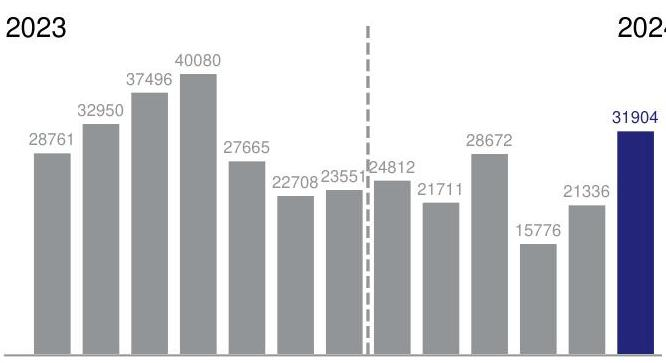
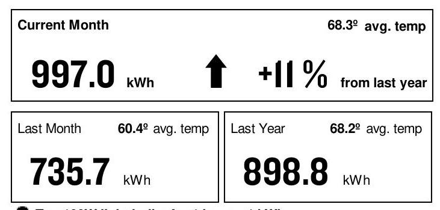
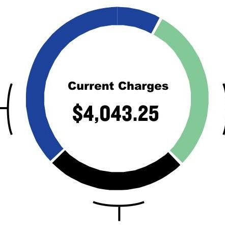

AN EXELON COMPANY

## SERVICE FROM 5/9/24 THROUGH 6/IO/24 (32 DAYS)

Retail Delivery Service - 100 kW to 400 kW

Hampton Social Burrridge LLC
705 Village-Center Dr *Bldg
Burr Ridge, IL 60527
(847) 525-8452

## TOTAL USAGE (kWh)

The image is a bar chart showing electricity usage over time. 

- **Chart Type**: Bar chart
- **X-Axis**: Represents months, with a division between 2023 and 2024.
- **Y-Axis**: Not labeled with units, but the numbers suggest it represents kilowatt-hours (kWh).
- **Data Points**:
  - 2023: 
    - January: 28,761
    - February: 32,950
    - March: 37,496
    - April: 40,080
    - May: 27,665
    - June: 22,708
    - July: 23,551
    - August: 24,812
    - September: 21,711
    - October: 28,672
    - November: 21,336
    - December: 15,776
  - 2024:
    - January: 31,904
- **Styling**: The bars for 2023 are in gray, while the bar for 2024 is in blue. There is a dashed vertical line separating the years 2023 and 2024.
- **Notable Feature**: The chart provides a **yearly usage breakdown (monthly-based)**.

JUN JUL AUG SEP OCT NOV DEC JAN FEB MAR APR MAY JUN Current month's reading is Actual.

## Payment Deducted on 6/26/24

Thank you for your payments totaling \$3,276.18.

## AVERAGE DAILY USE (monthly usage/days in period)

The image is a section of a utility bill showing electricity usage statistics.

- **Current Month**: 997.0 kWh
- **Comparison**:
  - Increase of 11% from last year
  - Last Month: 735.7 kWh, with an average temperature of 60.4° F
  - Last Year: 898.8 kWh, with an average temperature of 68.2° F
- **Current Month's Average Temperature**: 68.3° F

The layout includes:
- The current month's usage and percentage increase are prominently displayed with an upward arrow.
- The last month's and last year's usage and average temperatures are shown in separate boxes below the current month's data.

Ten 100W light bulbs for 1 hour $=1 \mathrm{kWh}$

## CURRENT CHARGES SUMMARY

See reverse side for details

## SUPPLY

\$1,830.63

AEP Energy, Inc provides your energy.
$1.866 .258 .3782$

For Electric Supply Choices visit pluginillinois.org

The image is a circular chart or donut chart.

- **Center Text**: "Current Charges $4,043.25"
- **Sections**: 
  - Blue section
  - Green section
  - Black section

The chart visually represents the distribution of current charges, with different colors indicating different portions of the total amount. The exact proportions or labels for each section are not provided.

TAXES \& FEES $\$ 1,014.68$

Return only this portion with your check made payable to ComEd. Please write your account number on your check.

## comed

AN EXELON COMPANY

0002454 SL H 112560654 -C22-05-P00000-I

HAMPTON SOCIAL BURRRIDGE LLC
414 N ORLEANS ST
STE 009
CHICAGO, IL 60654

The image is a photo or illustration of a blank white space. There are no visible elements, text, or features to describe.

Pay your bill online, by phone or by mail.
See reverse side for more info Account \# 8589525111

Payment Deducted on 6/26/24 \$4,043.25

Payment Amount:

# For Questions, Support, and Outages visit ComEd.com 

English
Español
Hearing/Speech Impaired
Federal Video Relay Services (VRS)
1.877.4COMEDI (I.877.426.633I)
I.800.95.LUCES (I.800.955.8237)
I.800.572.5789 (TTY)

Fedvrs.us/session/new

## 1

SERVICE ADDRESS 705 Village-Center Dr *Bldg Burr Ridge, IL 60527 Electric Choice ID: 8584658187 \$4,043.25

## METER INFORMATION

| Read Dates | Meter Number | Load Type | Reading Type | Previous | Present | Difference | Multiplier | Usage |
| :--: | :--: | :--: | :--: | :--: | :--: | :--: | :--: | :--: |
| 5/9-6/10 | 230214279 | General Service | Off Pk kW | Actual | Actual |  |  | 28.29 |
| 5/9-6/10 | 230214279 | General Service | On Pk kW | Actual | Actual |  |  | 28.18 |
| 5/9-6/10 | 230214279 | General Service | Total kWh | Actual | Actual |  |  | 14515 |
| 5/9-6/10 | 230223337 | General Service | Off Pk kW | Actual | Actual |  |  | 66.61 |
| 5/9-6/10 | 230223337 | General Service | On Pk kW | Actual | Actual |  |  | 64.96 |
| 5/9-6/10 | 230223337 | General Service | Total kWh | Actual | Actual |  |  | 17389 |
| CHARGE DETAILS |  |  |  | Municipal Tax |  |  |  | \$140.23 |
| Retail Delivery Service - 100 kW to 400 kW 5/9/24 - 6/10/24 (32 Days) |  |  |  | Service Period Total |  |  |  | \$4,043.25 |
| SUPPLY - AEP ENERGY, INC |  |  | \$1,830.63 |  |  |  |  |  |
| SUPPLIER ENERGY CHARGES 31,904 KWH X 0.05738 |  |  | \$1,830.63 |  |  |  |  |  |
| DELIVERY - ComEd |  |  | \$1,197.94 | Total Amount Due |  |  | \$4,043.25 |  |
| Customer Charge |  |  |  |  |  |  |  |  |
| Standard Metering Charge |  |  |  |  |  |  |  |  |
| Distribution Facility Charge | 93.13 kW X 12.01000 |  | \$1,118.49 |  |  |  |  |  |
| \$, Electricity Distribution Charge | 31,904 kWh X 0.00123 |  | \$39.24 |  |  |  |  |  |
| TAXES \& FEES |  |  | \$1,014.68 |  |  |  |  |  |
| Environmental Cost Recovery Adj | 31,904 kWh X 0.00033 |  | \$10.53 |  |  |  |  |  |
| Renewable Portfolio Standard | 31,904 kWh X 0.00502 |  | \$160.16 |  |  |  |  |  |
| Zero Emission Standard | 31,904 kWh X 0.00195 |  | \$62.21 |  |  |  |  |  |
| Carbon-Free Energy Resource Adj | 31,904 kWh X 0.00880 |  | \$280.76 |  |  |  |  |  |
| Energy Efficiency Programs | 31,904 kWh X 0.00691 |  | \$220.46 |  |  |  |  |  |
| Energy Transition Assistance | 31,904 kWh X 0.00072 |  | \$22.97 |  |  |  |  |  |
| Franchise Cost | \$1,176.60 X 1.30600\% |  | \$15.37 |  |  |  |  |  |
| State Tax |  |  | \$101.99 |  |  |  |  |  |

## A VARIETY OF METHODS TO PAY YOUR BILL

Visit ComEd.com/PAY for more information including applicable fees for some transactions.

## Online

Set up an automatic payment, enroll in paperless billing, or make a convenience payment at ComEd.com/Pay.

## Mobile App

Download the ComEd mobile app on your Apple $f f$ or Android ${ }^{\text {TM }}$ device to view and pay your bill, or manage your account.

## Phone

Call us to make a convenience payment with a credit card, ATM card, or your bank account: 1.800.588.9477.

Pay your bill in-person at many ComEd authorized agents located throughout the region. Visit ComEd.com/Pay for details.

- POWERLINE SAFETY: Water and electricity don't mix - that's why it's important to be aware of your surroundings and watch out for electrical hazards when working or playing around water recreation areas. Look for overhead power lines before performing activities such as casting a fishing line, using a pool skimming tool or raising a boat mast, and NEVER swim around docks with electrical equipment or boats plugged into shore power. Always keep yourself or any conductive material a minimum of 10 feet away from any power line. Call 1-800-Edison-1 before working near power lines. Learn more at ComEd.com/Safety.
- THE SUPPORT TO STOP A SCAM: The ability to send money through mobile-pay apps linked to your personal bank account or credit card like QuickPay, Zelle and Venmo make it easier to fall for scam attempts. Scammers claim they didn't see the transaction and ask it to be sent again - scamming you twice. Take steps to protect yourself from energy fraud. We can help with tips and hints to recognize potential scams and legitimate ComEd employees. Learn more: ComEd.Com/ScamAlert
- WAYS TO PAY: Looking for ways to pay your bill? Visit ComEd.com/PAY
- ILLINOIS COMMERCE COMMISSION CONSUMER DIVISION: The Consumer Services Division is available at 800-524-0795 to help resolve disputes with ComEd. However, customers should contact ComEd before seeking assistance from the ICC.

