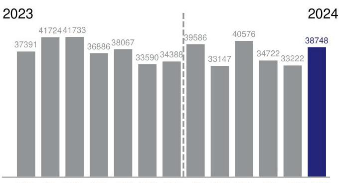
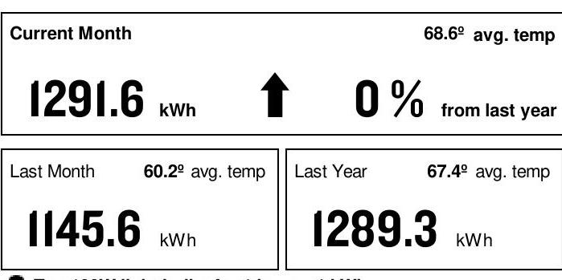
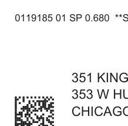

AN EXELON COMPANY

## SERVICE FROM 5/7/24 THROUGH 6/6/24 (30 DAYS)

Retail Delivery Service - 100 kW to 400 kW

351 Kingsbury Corner LLC
414 N Orleans St "Unit 105
Chicago, IL 60610
(847) 525-8452

## TOTAL USAGE (kWh)

The image is a bar chart.

- **Chart Type**: Bar chart
- **Yearly usage breakdown (monthly-based)**
- **X-Axis**: Months from 2023 to 2024
- **Y-Axis**: Not labeled, but represents usage in kWh
- **Data Points**:
  - 2023: 
    - June: 37391
    - July: 41724
    - August: 41733
    - September: 36886
    - October: 38067
    - November: 33590
    - December: 34388
  - 2024:
    - January: 39586
    - February: 33147
    - March: 40576
    - April: 34722
    - May: 33222
    - June: 38748
- **Styling**: The bar for June 2024 is highlighted in blue, while other bars are in gray. A dashed vertical line separates the years 2023 and 2024.

JUN JUL AUG SEP OCT NOV DEC JAN FEB MAR APR MAY JUN Current month's reading is Actual.

## Payment Deducted on 6/24/24 \$4,500.37

Thank you for your payments totaling \$4,023.27.

## AVERAGE DAILY USE (monthly usage/days in period)

The image is a photo/illustration of a utility bill summary.

- **Current Month**: 1291.6 kWh
- **Average Temperature**: 68.6º
- **Change from Last Year**: 0%
- **Last Month**: 1145.6 kWh
- **Last Month Average Temperature**: 60.2º
- **Last Year**: 1289.3 kWh
- **Last Year Average Temperature**: 67.4º

An upward arrow is shown next to the current month's usage, indicating an increase. The layout includes a comparison of current, last month, and last year data with corresponding average temperatures.

Ten 100W light bulbs for 1 hour $=1 \mathrm{kWh}$

## CURRENT CHARGES SUMMARY

See reverse side for details

## SUPPLY

\$2,083.94

AEP Energy, Inc provides your energy.
$1.866 .258 .3782$

For Electric Supply Choices visit pluginillinois.org

## DELIVERY

\$1,069.93

ComEd delivers electricity to your business.
ComEd.com
$1.800 .334 .7661$

TAXES \& FEES \$1,346.50

Return only this portion with your check made payable to ComEd. Please write your account number on your check.

# comed 

AN EXELON COMPANY

Pay your bill online, by phone or by mail.

The image is a photo/illustration of a utility bill section.

- **Text Present**:
  - "0119185 01 SP 0.680 **S"
  - "351 KINGSBURY CORNER LLC"
  - "353 W HUBBARD ST"
  - "CHICAGO, IL 60654"
- **Additional Elements**: A QR code is visible in the bottom left corner.

351 KINGSBURY CORNER LLC
353 W HUBBARD ST
CHICAGO, IL 60654
See reverse side for more info Account \# 8798683000

Payment Deducted on 6/24/24 \$4,500.37

Payment Amount:

For Questions, Support, and Outages visit ComEd.com

English
Español
Hearing/Speech Impaired
Federal Video Relay Services (VRS)
I.877.4COMEDI (I.877.426.633I)
I.800.95.LUCES (I.800.955.8237)
I.800.572.5789 (TTY)

Fedvrs.us/session/new

## 1

SERVICE ADDRESS 414 N Orleans St "Unit 105 Chicago, IL 60610
Electric Choice ID: 8792444573 Electric Choice ID: 8791585264

## METER INFORMATION

| Read Dates | Meter Number | Load Type | Reading Type | Previous | Present | Difference | Multiplier | Usage |
| :--: | :--: | :--: | :--: | :--: | :--: | :--: | :--: | :--: |
| 5/7-6/6 | 230118858 | General Service | Off Pk kW | Actual | Actual |  |  | 10.72 |
| 5/7-6/6 | 230118858 | General Service | On Pk kW | Actual | Actual |  |  | 10.57 |
| 5/7-6/6 | 230118858 | General Service | Total kWh | Actual | Actual |  |  | 7678 |
| 5/7-6/6 | 230119402 | General Service | Off Pk kW | Actual | Actual |  |  | 10.32 |
| 5/7-6/6 | 230119402 | General Service | On Pk kW | Actual | Actual |  |  | 10.52 |
| 5/7-6/6 | 230119402 | General Service | Total kWh | Actual | Actual |  |  | 4223 |
| 5/7-6/6 | 230119463 | General Service | Off Pk kW | Actual | Actual |  |  | 6.96 |
| 5/7-6/6 | 230119463 | General Service | On Pk kW | Actual | Actual |  |  | 11.88 |
| 5/7-6/6 | 230119463 | General Service | Total kWh | Actual | Actual |  |  | 6060 |
| 5/7-6/6 | 230193878 | General Service | Off Pk kW | Actual | Actual |  |  | 50.12 |
| 5/7-6/6 | 230193878 | General Service | On Pk kW | Actual | Actual |  |  | 36.94 |
| 5/7-6/6 | 230193878 | General Service | Total kWh | Actual | Actual |  |  | 15126 |
| 5/7-6/6 | 230193880 | General Service | Off Pk kW | Actual | Actual |  |  | 8.53 |
| 5/7-6/6 | 230193880 | General Service | On Pk kW | Actual | Actual |  |  | 10.76 |
| 5/7-6/6 | 230193880 | General Service | Total kWh | Actual | Actual |  |  | 5660 |

## CHARGE DETAILS

Retail Delivery Service - 100 kW to 400 kW 5/7/24 - 6/6/24 (30 Days)

## SUPPLY - AEP ENERGY, INC

SUPPLIER ENERGY CHARGES 38,747 KWH X 0.05378

## DELIVERY - ComEd

Customer Charge
Standard Metering Charge
Distribution Facility Charge
I. Electricity Distribution Charge

80.66 kW X 12.01000
$38,748 \mathrm{kWh} \times 0.00123$
$80.66 \mathrm{~kW} \times 12.01000$
$38,748 \mathrm{kWh} \times 0.00123$
TAXES \& FEES
Environmental Cost Recovery Adj
Renewable Portfolio Standard
Zero Emission Standard

## $1,069.93$

\$28.90
\$11.31
\$968.73
\$47.66
\$13.33
$1,346.50$
\$12.79
\$194.51
\$75.56
(continued on next page)

# A VARIETY OF METHODS TO PAY YOUR BILL 

Visit ComEd.com/PAY for more information including applicable fees for some transactions.

## Online

Set up an automatic payment, enroll in paperless billing, or make a convenience payment at ComEd.com/Pay.

## Mobile App

Download the ComEd mobile app on your Apple® or Android ${ }^{\text {TM }}$ device to view and pay your bill, or manage your account.

## Phone

Call us to make a convenience payment with a credit card, ATM card, or your bank account: 1.800.588.9477.

## In-Person

Pay your bill in-person at many ComEd authorized agents located throughout the region. Visit ComEd.com/Pay for details.

# AMEXELON COMPANY 

| Carbon-Free Energy Resource Adj | $38,748 \mathrm{kWh} \times 0.00880$ | $\$ 340.98$ |
| :-- | :-- | --: |
| Energy Efficiency Programs | $38,748 \mathrm{kWh} \times 0.00691$ | $\$ 267.75$ |
| Energy Transition Assistance | $38,748 \mathrm{kWh} \times 0.00072$ | $\$ 27.90$ |
| Franchise Cost |  | $\$ 139.22$ |
| State Tax |  | $\$ 123.83$ |
| Municipal Tax |  | $\$ 163.96$ |

Service Period Total $\$ 4,500.37$

## MISCELLANEOUS

$\$ 0.00$
Charges/Credits from previous bill
$\$ 4,023.27$
Thank You for Your Payment of \$4,023.27 on May 23, 2024
Total Amount Due
$\$ 4,500.37$

## UPDATES

## ComEd

- The amount of this bill will be automatically deducted from your bank account on June 24, 2024.
- POWERLINE SAFETY: Water and electricity don't mix - that's why it's important to be aware of your surroundings and watch out for electrical hazards when working or playing around water recreation areas. Look for overhead power lines before performing activities such as casting a fishing line, using a pool skimming tool or raising a boat mast, and NEVER swim around docks with electrical equipment or boats plugged into shore power. Always keep yourself or any conductive material a minimum of 10 feet away from any power line. Call 1-800-Edison-1 before working near power lines. Learn more at ComEd.com/Safety.
- THE SUPPORT TO STOP A SCAM: The ability to send money through mobile-pay apps linked to your personal bank account or credit card like QuickPay, Zelle and Venmo make it easier to fall for scam attempts. Scammers claim they didn't see the transaction and ask it to be sent again - scamming you twice. Take steps to protect yourself from energy fraud. We can help with tips and hints to recognize potential scams and legitimate ComEd employees. Learn more: ComEd.Com/ScamAlert
- WAYS TO PAY: Looking for ways to pay your bill? Visit ComEd.com/PAY
- ILLINOIS COMMERCE COMMISSION CONSUMER DIVISION: The Consumer Services Division is available at 800-524-0795 to help resolve disputes with ComEd. However, customers should contact ComEd before seeking assistance from the ICC.

