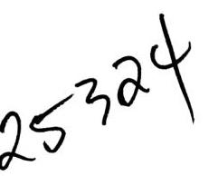
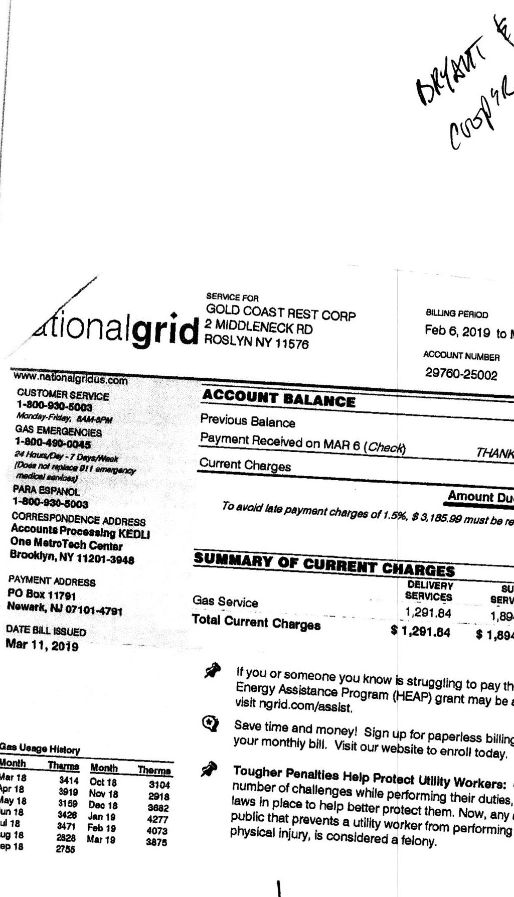

| NUSLYN HUSPIIAIILY 1295 OLD NORTHERN BLVD ROSLYN NY 11576 | Jan 7, 2019 to Feb 5, 2019 |  |  |  |  |  |  |
| --- | --- | --- | --- | --- | --- | --- | --- |
|  | ACCOUNT NUMBER |  |  |  |  |  |  |
|  | 91814-54007 |  | Mar 3, 2019 |  |  |  |  |
| DETAIL OF CURRENT CHARLES |  |  |  |  |  |  |  |
| Delivery Services |  |  |  |  |  |  |  |
| Service Period | No. of days | Current   Reading | Previous   Reading | Measured   CCF | $\times$ | Them   Factor | $\checkmark$ | Thems Used |
| Jan 7 - Feb 5 | 29 | 27975 | 27337 | 638 |  | 1.03204 |  | 658 |
| METER NUMBER | 05124571 | NEXTS | NILED READ D | DATE ON OR ABOUT | Mar 7 |  |  |  |
| RATE | Rate 177 | Gas Non |  |  |  |  |  |  |

| Basic Service Charge (including first 2.9 therms) | 36.40 |
| :--: | :--: |
| Next 84.1 Therms | $1.7716 \times 84.1$ therms | 148.99 |
| Over/Last 571 Therms | $0.437 \times 571$ therms | 249.53 |
| System Benefits Charge | $0.00677 \times 658$ therms | 4.46 |
| Delivery Rate Adj | $-0.06083663 \times 658$ therms | $-40.04$ |
| Transp Adj Chg | $-0.004778 \times 658$ therms | $-3.14$ |
| NY State and Local Surcharges |  | 4.53 |

# Supply Services 

| SUPPLIER | PLYMOUTH ROCK ENERGY |  |
| :--: | :--: | :--: |
|  | LLC |  |
|  | 1074 BROADWAY |  |
| WOODMERE | NY 11596 |  |
| PHONE | 655-327-6937 | ACCOUNT NO 9181454007 |
| Gas Supply |  | $0.45 \times 658$ therms |
| Sales Tax |  | 25.54 |
| Total Supply Services |  | \$321.64 |

## Other Charges/Adjustments

| Late Payment Charges | 9.44 |
| :--: | :--: |
| Total Other Charges/Adjustments | \$9.44 |

The image is a photo or illustration containing the handwritten text "Henories."

| www.nationalgridus.com |  |  |  |
| :--: | :--: | :--: | :--: |
| CUSTOMER SERVICE |  |  |  |
| 1-800-930-5003 |  |  |  |
| Monday-Febry, 8AM-8PM |  |  |  |
| GAS EMERGENCIES |  |  |  |
| 1-800-490-0045 |  |  |  |
| 3d Hours/Day - 7 Oays/Week |  |  |  |
| (Dried out inplase 81) emergency |  |  |  |
| medical services) |  |  |  |
| PARA ESPANOL |  |  |  |
| 1-800-930-8003 |  |  |  |
| CORRESPONDENCE ADDRESS |  |  |  |
| Accounts Processing KEDLI |  |  |  |
| One MetroTech Center |  |  |  |
| Brooklyn, NY 11201-3948 |  |  |  |
| PAYMENT ADDRESS |  |  |  |
| PO Box 11791 |  |  |  |
| Newark, NJ 07101-4791 |  |  |  |
| DATE BILL ISSUED |  |  |  |
| Feb 7, 2019 |  |  |  |

| Case Usage History |  |  |  |
| :--: | :--: | :--: | :--: |
| Month | Themes | Month | Themes |
| Feb 18 | 715 | Sep 18 | 00 |
| Mar 18 | 540 | Oct 18 | 00 |
| Apr 18 | 585 | Nov 18 | 140 |
| May 18 | 313 | Dec 18 | 280 |
| Jun 18 | 65 | Jan 19 | 500 |
| Jul 18 | 00 | Feb 19 | 658 |
| Aug 18 | 00 |  |  |

| ACCOUNT BALANCE |  |  |  |
| :--: | :--: | :--: | :--: |
| Previous Balance |  |  | 629.30 |
| Payment Received on FEB 7 (Check) |  | THANK YOU | $-629.30$ |
| Current Charges |  |  | $+731.81$ |
| Amount Due |  |  | \$ 731.81 |

To avoid late payment charges of 1.5\%, \$ 731.81 must be received by Mar 32019.

| SUMMARY OF CURRENT CHARGES |  |  |  |  |
| :--: | :--: | :--: | :--: | :--: |
|  | DELIVERY SERVICE | SUPPLY SERVICE | OTHER CHARGES/ ADJUSTMENTS | TOTAL |
| Gas Service | 400.73 | 321.64 |  | 722.37 |
| Other Charges/Adjustments |  |  | 9.44 | 9.44 |
| Total Current Charges | \$ 400.73 | \$ 321.64 | \$ 9.44 | \$ 731.81 |

(3) Save time and money! Sign up for paperless billing and receive a $\$ 0.35$ credit on your monthly bill. Visit our website to enroll today.

Tougher Penalties Help Protect Utility Workers: Our field workers often face a number of challenges while performing their duties, but New York State has new laws in place to help better protect them. Now, any action by a member of the public that prevents a utility worker from performing their job, or causes the worker physical injury, is considered a felony.

| Www.nationalgridus.com |  |  |  |
| :--: | :--: | :--: | :--: |
| GUSTOMER BERVIC |  |  |  |
| 1-800-930-5003 |  |  |  |
| Monday-Fillay, 8AM-8PM |  |  |  |
| GAS EMERGENCIES |  |  |  |
| 1-800-493-0045 |  |  |  |
| 3d Hours/Op - 7 Days/Week |  |  |  |
| (Class not update 811 emergency medical services) |  |  |  |
| PARA ESPANCL |  |  |  |
| 1-800-930-5003 |  |  |  |
| CORRESPONDENCE ADDRESS |  |  |  |
| Accounts Processing KEDLI |  |  |  |
| One Maitrs Tech Center |  |  |  |
| Brooklyn, NY 11201-3948 |  |  |  |
| PAYMENT ADDRESS |  |  |  |
| PO Box 11791 |  |  |  |
| Newark, NJ 07101-4791 |  |  |  |
| DATE BILL GALLED |  |  |  |
| Mar 6, 2019 |  |  |  |
| Gaw Usage History |  |  |  |
| Month | Theme | Month | Theme |
| Mar 18 | 5847 | Oct 18 | 3475 |
| Apr 18 | 5807 | Nov 18 | 4483 |
| May 18 | 4140 | Dec 18 | 5576 |
| Jun 18 | 3962 | Jan 19 | 6475 |
| Jul 18 | 3528 | Feb 19 | 6369 |
| Aug 18 | 3282 | Mar 19 | 5810 |
| Sep 18 | 3151 |  |  |

| BILLING PERIOD |  |  |  |
| :--: | :--: | :--: | :--: |
| Feb 5, 2019 to Mar 6, 2019 |  |  |  |
| ACCOUNT NUMBER |  |  |  |
| 79346-45009 |  | Apr 3, 2019 | \$ 10,022.04 |

## DID YOU FORGET? 4

The total amount due includes an unpaid balance from a previous bill. If you have already paid this balance, please disregard this message. Thank You.

## ACCOUNT BALANCE

| Previous Balance | 4,960.86 |
| :-- | --: |
| Payment Received No payments have been received during this billing period | -0.00 |
| Balance Forward | 4,960.86 |
| Current Charges | $+5,061.18$ |
|  | Amount Due \$ 10,022.04 |

To avoid late payment charges of 1.3\%, \$ 10,022.04 must be received by Apr 3 2019.

## SUMMARY OF CURRENT CHARGES

|  | DELIVERY   BERVICES | SUPPLY   BERVICES | OTHER CHARGES/   ADJUSTMENTS | TOTAL |
| :--: | :--: | :--: | :--: | :--: |
| Gas Service | 2,146.77 | 2,840.00 |  | 4,955.77 |
| Other Charges/Adjustments |  |  | 74.41 | 74.41 |
| Total Current Charges | \$ 2,146.77 | \$ 2,840.00 | \$ 74.41 | \$ 5,061.18 |

If you or someone you know is struggling to pay their home heating bills, a Home Energy Assistance Program (HEAP) grant may be available. For more information, visit ngrid.com/assist.
(2) Your rate has been changed to Heating. A review of your gas use in the previous year showed that your January use was at least two times (2x) your use in July. According to our tariff, this classifies your account as heating.
(3) Save time and money! Sign up for paperless billing and receive a $\$ 0.35$ credit on your monthly bill. Visit our website to enroll today.

| NOMINARY OF CURRENT CHARGES |  |  |  |  |
| :--: | :--: | :--: | :--: | :--: |
|  | DELIVERY   SERVICES | SUPPLY   SERVICES | OTHER CHARGES/ ADJUSTMENTS | TOTAL |
| Gas Service | 2,146.77 | 2,840.00 |  | 4,986.77 |
| Other Charges/Adjustments |  |  | 74.41 | 74.41 |
| Total Current Charges | \$ 2,146.77 | \$ 2,840.00 | \$ 74.41 | \$ 5,061.18 |

| www.nationalgridus.com |  |  |  |
| :--: | :--: | :--: | :--: |
| OUSTOMER SERVIC |  |  |  |
| 1-800-930-5003 |  |  |  |
| Monday-Febry, |  |  |  |
| GAS EMERGENCIES |  |  |  |
| 1-800-490-0048 |  |  |  |
| 24 Hore Day - 7 Days |  |  |  |
| (O |  |  |  |
| PARA ESPAN |  |  |  |
| 1-800-930-8003 |  |  |  |
| CORRESPONDENCE ADDRESS |  |  |  |
| Accounts Processing KED |  |  |  |
| One MetroTech Center |  |  |  |
| Brooklyn, NY 11201-3948 |  |  |  |
| PAYMENT ADDRESS |  |  |  |
| PO Box 11791 |  |  |  |
| Newark, NJ 07101-4791 |  |  |  |
| DATE BLL ISSUED |  |  |  |
| Mar 8, 2019 |  |  |  |
| Gas Usage History |  |  |  |
| Month | Theme | Month | Theme |
| Mar 18 | 5647 | Oct 18 | 3479 |
| Apr 18 | 5807 | Nov 18 | 4483 |
| May 18 | 4140 | Dec 18 | 5879 |
| Jun 18 | 3952 | Jan 18 | 6475 |
| Jul 18 | 3528 | Feb 18 | 6369 |
| Aug 18 | 3282 | Mar 18 | 5810 |
| Sep 18 | 3151 |  |  |

| OLLINS PERIOD |  |  |  |
| :--: | :--: | :--: | :--: |
| Feb 5, 2019 to Mar 6, 2019 |  |  |  |
| ACCOUNT NUMBER |  |  |  |
| 79346-45009 |  |  |  |
| Apr 3, 2019 |  |  |  |

| PAGE 1 of 4 |  |
| :--: | :--: |
|  |  |
|  |  |
|  |  |
|  |  |
|  |  |
|  |  |
|  |  |
|  |  |
|  |  |
|  |  |
|  |  |
|  |  |
|  |  |
|  |  |
|  |  |
|  |  |

| OLD YOUR FONGEY? 4 |  |
| :--: | :--: |
|  |  |
|  |  |
|  |  |
|  |  |
|  |  |
|  |  |
|  |  |
|  |  |
|  |  |
|  |  |
|  |  |
|  |  |
|  |  |
|  |  |
|  |  |
|  |  |
|  |  |
|  |  |
|  |  |
|  |  |
|  |  |
|  |  |
|  |  |
|  |  |
|  |  |
|  |  |
|  |  |
|  |  |
|  |  |
|  |  |
|  |  |
|  |  |
|  |  |
|  |  |
|  |  |
|  |  |
|  |  |
|  |  |
|  |  |
|  | 

| BEFALL OF CURRENT CHARGES |  |  |  |  |  |  |  |
| --- | --- | --- | --- | --- | --- | --- | --- |
| Delivery Services |  |  |  |  |  |  |  |
| Service Period | No. of days | Current   Reading | Previous   Reading | Measured   CCF | $\begin{aligned} & \text { I } \\ & \text { Fedor } \end{aligned}$ | $\begin{aligned} & \text { I } \\ & \text { Fedor } \end{aligned}$ | Themes Used |
| Feb 15 - Mar 19 | 32 | 59848 | Actual | 58321 | 1527 | 1.03154 | 1575 |
| METER NUMBER | 01308711 | NEXt SCHEDULED | Read date ON | on aSOUT | Apr 18 |  |  |
| RATE | Rate 257 |  |  |  |  |  |  |
| Basic Service Charge (including first 3.2 therms) |  |  |  |  |  |  | 40.17 |
| Next 92.8 Therms |  |  | $1.7282 \times 92.8$ therms |  |  |  | 160.38 |
| Over/Last 1479 Therms |  |  | $0.3553 \times 1479$ therms |  |  |  | 525.49 |
| System Benefits Charge |  |  | $0.00677 \times 1575$ therms |  |  |  | 10.66 |
| Delivery Rate Adj |  |  | $-0.03421455 \times 1575$ therms |  |  |  | $-53.88$ |
| Transp Adj Chg |  |  | $-0.004778 \times 1575$ therms |  |  |  | $-7.52$ |
| NY State and Local Surcharges |  |  |  |  |  |  | 0.90 |
| Total Delivery Services |  |  |  |  |  |  | $\$ 676.20$ |

# Supply Services 

| SUPPLIER | PLYMOUTH ROCK ENERGY |  |
| :--: | :--: | :--: |
|  | LLC |  |
|  | 1074 BROADWAY |  |
|  | WOODMERE NY 11598 |  |
| PHONE | 855-327-6937 | ACCOUNT NO 6862963004 |
| Gas Supply |  | $0.45 \times 1575$ therms |
| Sales Tax |  |  |
|  | Total Supply Services |  |  |  |  | $\$ 769.88$ |

The image is a photo or illustration featuring the word "MAJORS" written in a stylized, handwritten font. The text is oriented diagonally across the image.

| www.nationalgridus.com |  |  |  |
| :--: | :--: | :--: | :--: |
| CUSTICAIER SERVICE |  |  |  |
| 1-800-930-8003 |  |  |  |
| Monday-Febry. 8AM-8PM |  |  |  |
| GAS EMERGENCIES |  |  |  |
| 1-800-490-0048 |  |  |  |
| 24 Hourly Day - P Days | Week |  |  |
| (Dose not replace 811 emergency |  |  |  |
| medical services) |  |  |  |
| PARA ESPANOL |  |  |  |
| 1-800-930-5003 |  |  |  |
| CORRESPONDENCE ADDRESS |  |  |  |
| Accounts Processing KEDLI |  |  |  |
| One MetroTech Center |  |  |  |
| Brooklyn, NY 11201-3948 |  |  |  |
| PAYMENT ADDRESS |  |  |  |
| PO Box 11791 |  |  |  |
| Newark, NJ 07101-4791 |  |  |  |
| DATE BILL ISSUED |  |  |  |
| Mar 20, 2019 |  |  |  |
|  |  |  |  |
| Gas Usage History |  |  |  |
| Month | Theme | Month | Theme |
| Mar 18 | 1451 | Oct 18 | 1088 |
| Apr 18 | 1299 | Nov 18 | 1227 |
| May 18 | 1158 | Dec 18 | 1488 |
| Jun 18 | 1168 | Jan 19 | 1517 |
| Jul 18 | 1087 | Feb 19 | 1513 |
| Aug 18 | 1082 | Mar 19 | 1575 |
| Sep 18 | 1238 |  |  |

| BILLING PERIOD |  |  |  | PRUC | 1 UN |
| :--: | :--: | :--: | :--: | :--: | :--: |
| Feb 15, 2019 to Mar 19, 2019 |  |  |  |  |  |
| ACCOUNT NUMBER |  |  |  |  |  |
| 68629-53004 |  |  |  | Apr 13, 2019 | \$ 1,446.08 |
|  |  |  |  |  |  |

## ACCOUNT BALANCE

Previous Balance
Payment Received on MAR 14 (Check)

Current Charges

To avoid late payment charges of $1.5 \%, \$ 1,446.08$ must be received by Apr 13,2019.

## SUMMARY OF CURRENT CHARGES

|  | DELIVERY | SUPPLY |  |
| :--: | :--: | :--: | :--: |
|  | SERVICES | SERVICES | TOTAL |
| Gas Service | 676.20 | 769.88 | 1,446.08 |
| Total Current Charges | \$ 876.20 | \$ 769.88 | \$ 1,446.08 |

If you or someone you know is struggling to pay their home heating bills, a Home Energy Assistance Program (HEAP) grant may be available. For more information, visit ngrid.com/easiat.
(4) Save time and money! Sign up for paperless billing and receive a $\$ 0.35$ credit on your monthly bill. Visit our website to enroll today.

Tougher Penalties Help Protect Utility Workers: Our field workers often face a number of challenges while performing their duties, but New York State has new laws in place to help better protect them. Now, any action by a member of the public that prevents a utility worker from performing their job, or causes the worker physical injury, is considered a felony.

| SERVICE FOR |  |  |  |
| :--: | :--: | :--: | :--: |
| EAST MEADOW AVE REST |  |  |  |
| 272 E MEADOW AVE FL 2 |  |  |  |
| E MEADOW NY 11554 | 272 E MEADOW AVE FL 2 E MEADOW NY 11554 |  |  |
| www.nationalgridus.com |  |  |  |
| CUSTOMER SERVICE |  |  |  |
| 1-800-930-8003 |  |  |  |
| Monday-Febty, 8AM-8PM |  |  |  |
| GAS EMERGENCIES |  |  |  |
| 1-800-490-0045 |  |  |  |
| 24 HounsDay - F Days/Week |  |  |  |
| (Dose not repilies 211 anengsway |  |  |  |
| medical services) |  |  |  |
| PARA ESPANOL |  |  |  |
| 1-800-930-8003 |  |  |  |
| CORRESPONDENCE ADDRESS |  |  |  |
| Accounts Processing KEDLI |  |  |  |
| One MetroTech Center |  |  |  |
| Brooklyn, NY 11201-3948 |  |  |  |
| PAYMENT ADDRESS |  |  |  |
| PO Box 11701 |  |  |  |
| Newark, NJ 07101-8001 |  |  |  |
| DATE BILL BBLLED |  |  |  |
| Feb 20, 2010 |  |  |  |

| GAS USAGE HISTORY (Therms) |  |  |  |  |
| :--: | :--: | :--: | :--: | :--: |
|  |  |  |  |  |
|  |  |  |  |  |
|  |  |  |  |  |
| F MAM J JASONDJF |  |  |  |  |
| 18 |  |  |  |  |
|  | 10 |  |  |  |
| Daily Anwnges | Feb 18 | Feb 19 |  |  |
|  | 0.1 | 0.1 |  |  |
| Tharms | 0.1 | 0.1 |  |  |
| Coal | 0.72 | 0.72 |  |  |

| ACCOUNT BALANCE |  |  |  |
| :--: | :--: | :--: | :--: |
| Previous Balance |  |  | 23.94 |
| Payment Received on FEB 13 (Check) |  | 7HANK YOU | $-23.94$ |
| Payment Received on JAN 21 (Check) |  | 7HANK YOU | $-23.82$ |
| Balance Forward |  |  | $-23.82$ |
| Current Charges |  |  | $+44.75$ |
| Amount Due |  |  | \$ 20.93 |

To avoid late payment charges of $1.5 \%, \$ 20.93$ must be received by Mar 182019.

| SUMMARY OF CURRENT CHARGES |  |  |  |  |
| :--: | :--: | :--: | :--: | :--: |
|  | DELIVERY SERVICES | SUPPLY SERVICES | OTHER CHARGES/ ADJUSTMENTS | TOTAL |
| Gas Service | 19.46 | 1.47 |  | 20.03 |
| Other Charges/Adjustments |  |  | 23.82 | 23.82 |
| Total Current Charges | \$ 19.46 | \$ 1.47 | \$ 23.82 | \$ 44.75 |

(2) Save time and money! Sign up for paperless billing and receive a $\$ 0.35$ credit on your monthly bill. Visit our website to enroll today.

Tougher Penalties Help Protect Utility Workers: Our field workers oftmlsce a number of challenges while performing their duties, but New York States has new laws in place to help better protect them. Now, any action by a members the public that prevents a utility worker from performing their job, or causes it's worker physical injury, is considered a felony.

| www.nationalgridus.com |  |  |  |  |
| :--: | :--: | :--: | :--: | :--: |
| CUSTOMER BERVICE |  |  |  |  |
| 1-800-939-6003 |  |  |  |  |
| Monday-Febty, $A$ MA\&PM |  |  |  |  |
| GAS EMERGENCIES |  |  |  |  |
| 1-800-490-0048 |  |  |  |  |
| (of Hours/Day - 7 Days) |  |  |  |  |
| (Dose not replace 211 emergency |  |  |  |  |
| medical services) |  |  |  |  |
| PARA ESPANOL |  |  |  |  |
| 1-800-930-8003 |  |  |  |  |
| CORRESPONDENCE ADDRESS |  |  |  |  |
| Accounts Processing KEDLI |  |  |  |  |
| One MetroTech Center |  |  |  |  |
| Brooklyn, NY 11201-3948 |  |  |  |  |
| PAYMENT ADDRESS |  |  |  |  |
| PO Box 11791 |  |  |  |  |
| Newark, NJ 07101-9991 |  |  |  |  |
| DATE BILL ISSUED |  |  |  |  |
| Feb 20, 2019 |  |  |  |  |
|  |  |  |  |  |
| GAS USAGE HISTORY (Therma) |  |  |  |  |
|  |  |  |  |  |
|  |  |  |  |  |
|  |  |  |  |  |
|  |  |  |  |  |
|  |  |  |  |  |
|  |  |  |  |  |
|  |  |  |  |  |
|  |  |  |  |  |
|  |  |  |  |  |
| Daily Ann | Feb 19 | Feb 19 |  |  |
| Theme | 0.1 | 0.1 |  |  |
| Cost | \$ 0.72 | \$ 0.72 |  |  |

| ACCOUNT BALANCE |  |  |  |
| :--: | :--: | :--: | :--: |
| Previous Balance |  |  | 23.94 |
| Payment Received on FEB 13 (Check) |  | THANK YOU | - 23.94 |
| Payment Received on JAN 21 (Check) |  | THANK YOU | - 23.82 |
| Balance Forward |  |  | -23.82 |
| Current Charges |  |  | $+44.75$ |
|  | Amount Due |  | \$ 20.93 |

To avoid late payment charges of 1.5\%, $\$ 20.93$ must be received by Mar 16 2019.

| SUMMARY OF CURRENT CHARGES |  |  |  |  |
| :--: | :--: | :--: | :--: | :--: |
|  | DEUVERY   SERVICES | SUPPLY   SERVICES | OTHER CHARGES/   ADJUSTMENTS | TOTAL |
| Gas Service | 19.46 | 1.47 |  | 20.93 |
| Other Charges/Adjustments |  |  | 23.82 | 23.82 |
| Total Current Charges | \$ 19.46 | \$ 1.47 | \$ 23.82 | \$ 44.75 |

(3) Save time and money! Sign up for paperless billing and receive a $\$ 0.35$ credit on your monthly bill. Visit our website to enroll today.

Tougher Penalties Help Protect Utility Workers: Our field workers often face a number of challenges while performing their duties, but New York State has new laws in place to help better protect them. Now, any action by a member of the public that prevents a utility worker from performing their job, or causes the worker physical injury, is considered a felony.

| Www.nationalgridus.com |  |  |  |
| :--: | :--: | :--: | :--: |
| CUSTOMER BISNICE |  |  |  |
| 1-800-930-5003 |  |  |  |
| Monday-Febap, 8AM-8PM |  |  |  |
| GAS EVERGENCIES |  |  |  |
| 1-800-490-0045 |  |  |  |
| 24 Hours/Day - 7 Days/Week |  |  |  |
| (Dose not replace 811 emergency medical services) |  |  |  |
| PARA ESPANCL |  |  |  |
| 1-800-930-5003 |  |  |  |
| CORRESPONDENCE ADDRESS |  |  |  |
| Accounts Processing KEDLI |  |  |  |
| One MetroTech Center |  |  |  |
| Brooklyn, NY 11201-3948 |  |  |  |
| PAYMENT ADDRESS |  |  |  |
| PO Box 11791 |  |  |  |
| Newark, NJ 07101-6991 |  |  |  |
| DATE BILL ISSUED |  |  |  |
| Feb 20, 2019 |  |  |  |

| GAS USAGE HISTORY (Theme) |  |  |  |
| :--: | :--: | :--: | :--: |
| 10 |  |  |  |
|  | DELIVERY | SUPPLY | OTHER CHARGES/ |
|  | SERVICES | SERVICES | ADJUSTMENTS |
| Gas Service | 22.22 | 2.44 |  |
| Other Charges/Adjustments |  |  | 30.37 |
| Total Current Charges | \$ 22.22 | \$ 2.44 | \$ 30.37 |

$\square$ Save time and money! Sign up for paperless billing and receive a $\$ 0.35$ credit on your monthly bill. Visit our website to enroll today.

Tougher Penalties Help Protect Utility Workers: Our field workers often face a number of challenges while performing their duties, but New York State has new laws in place to help better protect them. Now, any action by a member of the public that prevents a utility worker from performing their job, or causes the worker physical injury, is considered a felony.

| C |  |  |  |  |  |  |  |  |  |  |
| :--: | :--: | :--: | :--: | :--: | :--: | :--: | :--: | :--: | :--: | :--: |
|  |  |  |  |  |  |  |  |  |  |  |
|  |  |  |  |  |  |  |  |  |  |  |
|  |  |  |  |  |  |  |  |  |  |  |
|  |  |  |  |  |  |  |  |  |  |  |

The image is a photo of a utility bill detailing gas usage and charges.

- **Enrollment Information**: 
  - "To enroll with a supplier or change to another supplier, you will need the following information about your account:"
  - "Acct No: 31302-77005"
  - "Cycle: 15, REST"

- **Gas Usage History**:
  - "Month" and "Therms" columns for each month from Feb 18 to Feb 19, with values ranging from 01 to 09 therms.

- **Detail of Current Charges**:
  - **Delivery Services**:
    - "Service Period: Jan 17 - Feb 15"
    - "No. of days: 29"
    - "Current Reading: 379 Actual"
    - "Previous Reading: 374 Actual"
    - "Measured CCF: 5"
    - "Therm Factor: 1.03222"
    - "Therms Used: 5"
    - "METER NUMBER: 05761574"
    - "NEXT SCHEDULED READ DATE ON OR ABOUT: Mar 20"
    - "Rate 127 Gas Resid General Use Delivery"

- **Charges**:
  - "Basic Service Charge (including first 2.9 therms): 19.09"
  - "Over/Last 2.1 Therms: 1.4354 x 2.1 therms = 3.01"
  - "Delivery Rate Adj: -0.07549 x 5 therms = -0.38"
  - "System Benefits Charge: 0.00877 x 5 therms = 0.05"
  - "Transp Adj Chg: -0.00478 x 5 therms = -0.02"
  - "NY State and Local Surcharges: 0.47"
  - "Total Delivery Services: $22.22"

| TABLE |  |  |  |  |  |  |  |  |  |
| :--: | :--: | :--: | :--: | :--: | :--: | :--: | :--: | :--: | :--: |
|  |  |  |  |  |  |  |  |  |  |
|  |  |  |  |  |  |  |  |  |  |
|  |  |  |  |  |  |  |  |  |  |

# SUPPORT REVICES 

## Plymouth Rock

SAST MEADOW AVE REST
272 E MEADOW AVE FL 1
E MEADOW NY 11554

Plymouth Rock
SAST MEADOW NY 11598
PHONE 855-327-5937 ACCOUNT NO 3130277005

| Gas Supply | 0.45 | $\times$ | 5 therms | 2.25 |
| :-- | :-- | :-- | :-- | :-- |
| Sales Tax |  |  |  | 0.19 |

## Other Charges/Adjustments

| Debit Adjustments | 30.37 |
| :-- | :-- |
| Total Other Charges/Adjustments | $\$ 30.37$ |

| SURVIRUS FOR |  |  |  |  |  |
| :--: | :--: | :--: | :--: | :--: | :--: |
| MIRACLE MILE REST |  |  |  |  | PAGE 2 of 3 |
| 2110 NORTHERN BLVD UNIT C |  |  |  |  |  |
| MANI-ISSEET NY 11030 |  | ACCOUNT NUMBER |  |  |  |
|  |  | 44197-08002 |  | Mar 20, 2019 | \$ 2,065.26 |

# DETAIL OF CURRENT CHARGES 

## Delivery Services

| Service Period | No. of days | Current   Reading | Previous   Reading | Measured   OOF | $\times$ | Therm   Factor | $n$ | Thems Used |
| :--: | :--: | :--: | :--: | :--: | :--: | :--: | :--: | :--: |
| Jan 22 - Feb 20 | 29 | 88828 | Astual | 84361 | Astual | 2267 | 1.03233 | 2340 |
| METER NUMBER | 01154859 | NOST SCHEDULES READ DATE ON OR ABOUT |  |  |  |  |  |  |
| RATE | Rate 257 | Gas Non Resid General | Use Delivery |  |  |  |  |  |
| Basic Service Charge (including first 2.9 therms) |  |  |  |  |  |  |  | 36.40 |
| Next 84.1 Therms |  |  | 1.7282 | $\times$ | 84.1 therms |  |  | 145.34 |
| Over/Last 2253 Therms |  |  | 0.3553 | $\times$ | 2253 therms |  |  | 800.49 |
| System Benefits Charge |  |  | 0.00677 | $\times$ | 2340 therms |  |  | 15.84 |
| Delivery Rate Adj |  |  | $-0.02849$ | $\times$ | 2340 therms |  |  | $-66.66$ |
| Transp Adj Chg |  |  | $-0.004778$ | $\times$ | 2340 therms |  |  | $-11.19$ |
| NY State and Local Surcharges |  |  |  |  |  |  |  | 1.22 |
|  |  |  | Total Delivery Services |  |  |  | \$ 921.44 |  |

## Supply Services

| SUPPLIER | PLYMOUTH ROCK ENERGY |  |
| :--: | :--: | :--: |
|  | LLC |  |
|  | 1074 BROADWAY | TWENGY |
| WOODMERE | NY 11598 |  |
| PHONE | 855-327-6937 | ACCOUNT NO 4419708002 |
| Gas Supply |  | $0.45 \times 2340$ therms | 1,053.00 |
| Sales Tax |  |  | 90.82 |
|  |  | Total Supply Services | \$ 1,143.82 |

The image is a photo or illustration featuring handwritten text. The text reads "eipoliniis."

| www.nationalgridus.com |  |  |  |  |
| :--: | :--: | :--: | :--: | :--: |
| CUSTOMER SERVICE |  |  |  |  |
| 1-800-830-9002 |  |  |  |  |
| Monday-Febre, 8AM-9PM |  |  |  |  |
| GAS EMERGENCIES |  |  |  |  |
| 1-800-480-0048 |  |  |  |  |
| 24 HlodeCite - 7 Days-Week |  |  |  |  |
| (Dose not replace 811 emergency |  |  |  |  |
| medical services) |  |  |  |  |
| PARA ESPANOL |  |  |  |  |
| 1-800-930-9003 |  |  |  |  |
| CORRESPONDENCE ADDRESS |  |  |  |  |
| Accounts Processing KEDLI |  |  |  |  |
| One MetroTech Center |  |  |  |  |
| Brooklyn, NY 11201-3948 |  |  |  |  |
| PAYMENT ADDRESS |  |  |  |  |
| PO Box 11791 |  |  |  |  |
| Newark, NJ 07101-4791 |  |  |  |  |
| DATE BILL BROED |  |  |  |  |
| Feb 22, 2019 |  |  |  |  |
|  |  |  |  |  |
| Gas Usage History |  |  |  |  |
| Month | Theme | Month | Theme |  |
| Feb 18 | 2007 | Sep 18 | 2008 |  |
| Mar 18 | 1980 | Oct 18 | 2009 |  |
| Apr 18 | 2508 | Nov 18 | 1984 |  |
| May 18 | 2156 | Dec 18 | 2204 |  |
| Jun 18 | 2237 | Jan 19 | 2587 |  |
| Jul 18 | 2288 | Feb 19 | 2340 |  |
| Aug 18 | 1849 |  |  |  |

| LOC |  |  |
| :--: | :--: | :--: |
| 2007 | Sep 18 | 2008 |
| 1980 | Oct 18 | 2009 |
| 2508 | Nov 18 | 1984 |
| 2156 | Dec 18 | 2204 |
| 2237 | Jan 19 | 2587 |
| 2288 | Feb 19 | 2340 |

|  | DELIVERY | SUPPLY |
| :--: | :--: | :--: |
|  | SERVICES | SERVICES |
| Gas Service | 921.44 | 1,143.82 |
| Total Current Chargee | \$ 921.44 | \$ 1,143.82 |

\$2,065.26

## ACCOUNT BALANCE

Previous Balance
2,285.35
Payment Received on FEB 12 (Check) THANK YOU - 2,285.35
Current Charges
Amount Due
$2,065.26$
To avoid late payment charges of $1.8 \%, \$ 2,065.26$ must be received by Mar 202018.

## SUMMARY OF CURRENT CHARGES

|  | DELIVERY | SUPPLY |  |
| :--: | :--: | :--: | :--: |
|  | SERVICES | SERVICES | TOTAL |
| Gas Service | 921.44 | 1,143.82 | 2,065.26 |
| Total Current Chargee | \$ 921.44 | \$ 1,143.82 | \$ 2,065.26 |

(2) Save time and money! Sign up for paperless billing and receive a $\$ 0.35$ credit on your monthly bill. Visit our website to enroll today.

Tougher Penalties Help Protect Utility Workers: Our field workers often face a number of challenges while performing their duties, but New York State has new laws in place to help better protect them. Now, any action by a member of the public that prevents a utility worker from performing their job, or causes the worker physical injury, is considered a felony.

| SERVICE FOR MIRACLE MILE RESTAUR 2110 NOTHERN BLVD STE 2 MANHASSET NY 11030 |  |  |  | BILLING PERIOD |  |  | PAGE 2 of 3 |  |
| :--: | :--: | :--: | :--: | :--: | :--: | :--: | :--: | :--: |
|  |  |  |  | Jan 22, 2019 to Feb 20, 2019 |  |  |  |  |
|  |  | ACCOUNT NUMBER |  | ATTEND ON CO |  |  |  |  |
|  |  | 56641-09009 |  | Mar 20, 2019 |  |  | 1,670.94 |  |

# DETAIL OF CURRENT CHARGES 

## Delivery Services

| Service Period | No. of   days | Current   Reading | Previous   Reading | Measured   COP | $\times$ | Therm   Factor | $=$ | Therm   Used |
| :--: | :--: | :--: | :--: | :--: | :--: | :--: | :--: | :--: |
| Jan 22 - Feb 20 | 29 | 94656 | Actual | 92856 | Actual | 1800 | 1.03233 | 1858 |
| METER NUMBER | 04888440 | NEST SCHEDULED | BEAD DATE | ON OR ABOUT | Mar 22 |  |  |  |
| RATE | Rate 257 | Gas Non Resid | General Use | Delivery |  |  |  |  |
| Basic Service Charge (including first 2.9 therms) |  |  |  |  |  |  | 36.40 |  |
| Next 84.1 Therms |  |  | 1.7282 | $\times$ | 84.1 therms |  | 145.34 |  |
| Over/Last 1771 Therms |  |  | 0.3553 | $\times$ | 1771 therms |  | 629.24 |  |
| System Benefits Charge |  |  | 0.00677 | $\times$ | 1858 therms |  | 12.58 |  |
| Delivery Rate Adj |  |  | $-0.02849$ | $\times$ | 1858 therms |  | $-52.95$ |  |
| Transp Adj Chg |  |  | $-0.004778$ | $\times$ | 1858 therms |  | $-8.89$ |  |
| NY State and Local Surcharges |  |  |  |  |  |  | 1.01 |  |
| Total Delivery Services |  |  |  |  |  |  | $\$ 762.73$ |  |

Supply Services
SUPPLIER PLYMOUTH ROCK ENERGY
PlymouthRock
LLC
1674 BROADWAY
WOODMERE NY 11598
PHONE 855-327-5937 ACCOUNT NO 5664109009

| Gas Supply | 0.45 | $\times 1858$ therms | 836.10 |
| :-- | --: | --: | --: |
| Sales Tax |  |  | 72.11 |
| Total Supply Services | $\mathbf{\$ 9 0 8 . 2 1}$ |  |  |

| www.nationsigridus.com |  |  |  |
| :--: | :--: | :--: | :--: |
| CUSTOMER SERVICES |  |  |  |
| 1-500-930-5003 |  |  |  |
| Monday-Febry: 8AM-8F6 |  |  |  |
| GAS EMERGENCES |  |  |  |
| 1-800-490-0045 |  |  |  |
| 24 HounsDay - 7 DaysWeek |  |  |  |
| (Dose not regular) 211 anumperry |  |  |  |
| medical services) |  |  |  |
| PARA ESPANOL |  |  |  |
| 1-800-830-5003 |  |  |  |
| CORRESPONDENCE ADDRESS |  |  |  |
| Accounts Processing KEDLI |  |  |  |
| One MetroTech Center |  |  |  |
| Brooklyn, NY 11201-3948 |  |  |  |
| PAYMENT ADDRESS |  |  |  |
| PO Box 11791 |  |  |  |
| Newark, NJ 07101-4791 |  |  |  |
| DATE BILL ISSUED |  |  |  |
| Feb 22, 2019 |  |  |  |

| Case Usage History |  |  |  |
| :--: | :--: | :--: | :--: |
| Month | Theme | Month | Theme |
| Feb 18 | 1887 | Sep 18 | 2102 |
| Mar 18 | 1826 | Oct 18 | 2004 |
| Apr 18 | 1886 | Nov 18 | 1697 |
| May 18 | 1913 | Dec 18 | 1798 |
| Jun 18 | 2083 | Jan 19 | 2085 |
| Jul 18 | 2158 | Feb 19 | 1859 |
| Aug 18 | 1870 |  |  |

| LOCOUNG BALANCE |  |  |  |
| :--: | :--: | :--: | :--: |
| Previous Balance |  |  | 1,859.14 |
| Payment Received on FEB 12 (Check) |  | THANK YOU | $-1,859.14$ |
| Current Charges |  |  | $+1,670.94$ |
|  |  | Amount Due | \$1,670.94 |
|  | Amount Due |  | \$1,670.94 |

To avoid late payment charges of 1.5\%, \$ 1,670.94 must be received by Mar 20.2019.

## SUMMARY OF CURRENT CHARGES

|  | DELIVERY | SUPPLY |
| :--: | :--: | :--: |
|  | SERVICES | SERVICES |
| Gas Service | 782.73 | 908.21 |
| Total Current Charges | \$ 782.73 | \$ 908.21 |

\$1,670.94
(2) Save time and money! Sign up for paperless billing and receive a $\$ 0.35$ credit on your monthly bill. Visit our website to enroll today.

Tougher Penalties Help Protect Utility Workers: Our field workers often face a number of challenges while performing their duties, but New York State has new laws in place to help better protect them. Now, any action by a member of the public that prevents a utility worker from performing their job, or causes the worker physical injury, is considered a felony.

The image is a photo or illustration showing handwritten numbers: "25324".

|  |  | BLLING PERIOD |  |  |  | PAGE 2 of 3 |
| :--: | :--: | :--: | :--: | :--: | :--: | :--: |
|  |  |  |  |  |  |  |
| 2014 NORTHERN BLVD |  |  |  |  |  |  |
| MANHASSET NY 11030 |  |  |  |  |  |  |
|  |  | ACCOUNT NUMBER |  |  |  |  |
|  |  | 19382-38004 |  |  |  |  |
|  |  |  |  |  |  |  |

# DETAIL OF CURRENT CHARGES 

## Delivery Services

| Service Period | No. of days | Current   Reading | Previous   Reading | Measured   CCF | $\begin{aligned} & \text { 1. } \\ & \text { Factor } \end{aligned}$ | $\begin{aligned} & \text { 1. } \\ & \text { 2271 } \end{aligned}$ |
| :--: | :--: | :--: | :--: | :--: | :--: | :--: |
| Jan 22 - Feb 20 | 29 | 52226 | 50026 | 2200 | 1.03233 |  |
| MEtER NUMBER | 08026997 | NET SCHESULED READ DATE ON OR ABOUT |  |  |  |  |
| date | Rate 177 Gas Non Resid He | eting Delivery |  |  |  |  |
| Basic Service Charge (including first 2.9 therms) |  |  |  |  |  | 36.40 |
| Next 84.1 Therms |  |  | 1.7716 | $\times 84.1$ therms |  | 148.99 |
| Over/Last 2184 Therms |  |  | 0.437 | $\times 2184$ therms |  | 954.41 |
| System Benefits Charge |  |  | 0.00677 | $\times 2271$ therms |  | 15.37 |
| Delivery Rate Adj |  | $-0.01170955$ | $\times 2271$ therms |  |  | $-26.60$ |
| Transp Adj Chg |  | $-0.004778$ | $\times 2271$ therms |  |  | $-10.86$ |
| NY State and Local Surcharges |  |  |  |  |  | 1.49 |
| Total Delivery Services |  |  |  |  |  | \$ 1,119.20 |

## Supply Services

| BUPFLIER PLYMOUTH ROCK ENERGY |  |  |
| :--: | :--: | :--: |
| LLC |  |  |
| 1074 BROADWAY |  |  |
| WOODMERE NY 11598 |  |  |
| PHONE |  |  |
| 865-327-6937 | ACCOUNT NO | 1938238004 |
| Gas Supply | 0.45 | $\times 2271$ therms |
| Sales Tax |  | 88.14 |
| Total Supply Services |  | \$ 1,110.09 |

| Year | Total | Amount Due |
|------|------|------|
| 2014 | 22,2019 to Feb 20, 2019 | 2,670.95 |
| 2015 | 22,229.29 | 2,670.95 |
| 2016 | 22,229.29 | 2,670.95 |

| Year | Total | Amount Due |
|------|------|------|
| 2014 NORTHERN BLVD | 1,119.20 | $2,229.29 |
| 2015 NANTASSET NY 11030 | 19,267.29 | $2,229.29 |

| Year | Total | Amount Due |
|------|------|------|
| 2014 NORTHERN BLVD | 2015 NANTASSET NY 11030 | $2,229.29 |

| Year | Total | Amount Due |
|------|------|------|
| 2014 NORTHERN BLVD | 1,119.20 | $2,229.29 |
| 2015 NANTASSET NY 11030 | 19,267.29 | $2,229.29 |

| Year | Total | Amount Due |
|------|------|------|
| 2014 NORTHERN BLVD | 2015 NANTASSET NY 11030 | $2,229.29 |

| Year | Total | Amount Due |
|------|------|------|
| 2014 NORTHERN BLVD | 2015 NANTASSET NY 11030 | $2,229.29 |

| Year | Total | Amount Due |
|------|------|------|
| 2014 NORTHERN BLVD | 2015 NANTASSET NY 11030 | $2,229.29 |

| Year | Total | Amount Due |
|------|------|------|
| 2014 NORTHERN BLVD | 2015 NANTASSET NY 11030 | $2,229.29 |

| Year | Total | Amount Due |
|------|------|------|
| 2014 NORTHERN BLVD | 2015 NANTASSET NY 11030 | $2,229.29 |

| Year | Total | Amount Due |
|------|------|------|
| 2014 NORTHERN BLVD | 2015 NANTASSET NY 11030 | $2,229.29 |

| Year | Total | Amount Due |
|------|------|------|
| 2014 NORTHERN BLVD | 2015 NANTASSET NY 11030 | $2,229.29 |

| Year | Total | Amount Due |
|------|------|------|
| 2014 NORTHERN BLVD | 2015 NANTASSET NY 11030 | $2,229.29 |

| Year | Total | Amount Due |
|------|------|------|
| 2014 NORTHERN BLVD | 2015 NANTASSET NY 11030 | $2,229.29 |

| Year | Total | Amount Due |
|------|------|------|
| 2014 NORTHERN BLVD | 2015 NANTASSET NY 11030 | $2,229.29 |

| Year | Total | Amount Due |
|------|------|------|
| 2014 NORTHERN BLVD | 2015 NANTASSET NY 11030 | $2,229.29 |

| Year | Total | Amount Due |
|------|------|------|
| 2014 NORTHERN BLVD | 2015 NANTASSET NY 11030 | $2,229.29 |

| Year | Total | Amount Due |
|------|------|------|
| 2014 NORTHERN BLVD | 2015 NANTASSET NY 11030 | $2,229.29 |

| Year | Total | Amount Due |
|------|------|------|
| 2014 NORTHERN BLVD | 2015 NANTASSET NY 11030 | $2,229.29 |

| Year | Total | Amount Due |
|------|------|------|
| 2014 NORTHERN BLVD | 2015 NANTASSET NY 11030 | $2,229.29 |

| Year | Total | Amount Due |
|------|------|------|
| 2014 NORTHERN BLVD | 2015 NANTASSET NY 11030 | $2,229.29 |

| Year | Total | Amount Due |
|------|------|------|
| 2014 NORTHERN BLVD | 2015 NANTASSET NY 11030 | $2,229.29 |

| Year | Total | Amount Due |
|------|------|------|
| 2014 NORTHERN BLVD | 2015 NANTASSET NY 11030 | $2,229.29 |

| Year | Total | Amount Due |
|------|------|------|
| 2014 NORTHERN BLVD | 2015 NANTASSET NY 11030 | $2,229.29 |

| Year | Total | Amount Due |
|------|------|------|
| 2014 NORTHERN BLVD | 2015 NANTASSET NY 11030 | $2,229.29 |

| Year | Total | Amount Due |
|------|------|------|
| 2014 NORTHERN BLVD | 2015 NANTASSET NY 11030 | $2,229.29 |

| Year | Total | Amount Due |
|------|------|------|
| 2014 NORTHERN BLVD | 2015 NANTASSET NY 11030 | $2,229.29 |

| Year | Total | Amount Due |
|------|------|------|
| 2014 NORTHERN BLVD | 2015 NANTASSET NY 11030 | $2,229.29 |

| Year | Total | Amount Due |
|------|------|------|
| 2014 NORTHERN BLVD | 2015 NANTASSET NY 11030 | $2,229.29 |

| Year | Total | Amount Due |
|------|------|------|
| 2014 NORTHERN BLVD | 2015 NANTASSET NY 11030 | $2,229.29 |

| Year | Total | Amount Due |
|------|------|------|
| 2014 NORTHERN BLVD | 2015 NANTASSET NY 11030 | $2,229.29 |

| Year | Total | Amount Due |
|------|------|------|
| 2014 NORTHERN BLVD | 2015 NANTASSET NY 11030 | $2,229.29 |

| Year | Total | Amount Due |
|------|------|------|
| 2014 NORTHERN BLVD | 2015 NANTASSET NY 11030 | $2,229.29 |

| Year | Total | Amount Due |
|------|------|------|
| 2014 NORTHERN BLVD | 2015 NANTASSET NY 11030 | $2,229.29 |

| Year | Total | Amount Due |
|------|------|------|
| 2014 NORTHERN BLVD | 2015 NANTASSET NY 11030 | $2,229.29 |

| Year | Total | Amount Due |
|------|------|------|
| 2014 NORTHERN BLVD | 2015 NANTASSET NY 11030 | $2,229.29 |

|  | BILLING PEHICU |  |  |  |  |  |  |
| :--: | :--: | :--: | :--: | :--: | :--: | :--: | :--: |
|  |  |  |  |  |  |  | PAGE 2 of J |
| 2014 NORTHERN BLVD MANHASSET NY 11030 |  | 2019 to Feb 20, 2019 |  |  |  |  |  |
|  |  | ACCOUNT NUMBER |  |  |  |  |  |
|  |  | 07160-45000 |  |  |  |  |  |
|  |  | Mar 20, 2019 |  |  |  |  | \$ 1,985.12 |

# DETAIL OF CURRENT CHARGEB 

## Delivery Services

| Service Period | No. of   days | Current   Reading | Previous   Reading | Measured   CCS | $\times$ | Therm   Factor | $a$ | Therms   Used |
| :--: | :--: | :--: | :--: | :--: | :--: | :--: | :--: | :--: |
| Jan 22 - Feb 20 | 29 | 60483 | Actual | 58311 | Actual | 2172 | 1.03233 | 2242 |
| METER NUMBER | 04565567 | NEXT SCHEDULED READ DATE ON ON ABOUT |  |  |  |  |  |  |
| Date | Rate 257 | Gas Non Resid General | Use Delivery |  |  |  |  |  |
|  |  |  |  |  |  |  |  |  |
| Basic Service Charge (including first 2.9 therms) |  |  |  |  |  |  |  | 36.40 |
| Next 84.1 Therms |  |  | 1.7282 | $\times$ | 84.1 therms |  |  | 145.34 |
| Over/Last 2155 Therms |  |  | 0.3553 | $\times$ | 2155 therms |  |  | 765.67 |
| System Benefits Charge |  |  | 0.00677 | $\times$ | 2242 therms |  |  | 15.18 |
| Delivery Rate Adj |  |  | $-0.02849$ | $\times$ | 2242 therms |  |  | $-63.86$ |
| Transp Adj Chg |  |  | $-0.004776$ | $\times$ | 2242 therms |  |  | $-10.71$ |
| NY State and Local Surcharges |  |  |  |  |  |  | 1.18 |  |
|  |  |  | Total Delivery Services |  |  |  | \$ 889.20 |  |

## Supply Services

| SUPPLIER | PLYMOUTH ROCK ENERGY |  |
| :--: | :--: | :--: |
|  | LLC |  |
|  | 1074 BROADWAY |  |
|  | WOODMERE NY 11596 |  |
| PHONE | 855-327-6937 | ACCOUNT NO 0716045000 |
|  |  |  |
| Gas Supply |  | 0.45 × 2242 therms |
| Sales Tax |  | 87.02 |
|  |  | Total Supply Services |

| Year | Amount Due |  |  |
|---|---|---|---|
| 2014 | NORTHERN BLVD MANHASSET NY 11030 | 2014 NORTHERN BLVD | 2014 NORTHERN BLVD |
| 07160-45000 | Mar 20, 2019 | $1,985.12 | $1,985.12 |
| **ACCOUNT BALANCE** | | | | |
| Previous Balance | 2,204.97 | | |
| Payment Received on FEB 12 (Check) | THANK YOU | - 2,204.97 | - 2,204.97 |
| Current Charges | + 1,985.12 | | |
| Amount Due | $1,985.12 | | |
| To avoid late payment charges of 1.8%, $1,985.12 must be received by Mar 20,2019. | | | |
| **SUMMARY OF CURRENT CHARSES** | | | | |
|  | DEUVERY SERVICES | BUPPLY SERVICES | TOTAL |
| Gas Service | 889.20 | 1,095.92 | 1,985.12 |
| Total Current Charges | $589.20 | $1,095.92 | $1,985.12 |

(2) Save time and money! Sign up for paperless billing and receive a $0.35 credit on your monthly bill. Visit our website to enroll today.

(3) Tougher Penalties Help Protect Utility Workers: Our field workers often face a number of challenges while performing their duties, but New York State has new laws in place to help better protect them. Now, any action by a member of the public that prevents a utility worker from performing their job, or causes the worker physical injury, is considered a felony.

| 100 HOSPITALITY LLC |  |  |  |  |  |  |  |  |  |
| :--: | :--: | :--: | :--: | :--: | :--: | :--: | :--: | :--: | :--: |
| 100 WALT WHITMAN RD, STR 206 |  |  |  |  |  |  |  |  |  |
| HUNT STA NY 11746 |  |  |  |  |  |  |  |  |  |
|  |  |  |  |  |  |  |  |  |  |
|  |  |  |  |  |  |  |  |  |  |

Choosing an Energy Supplier You can choose who supplies your energy. No matter which energy supplier you choose, National Grid will continue to deliver energy to you safely, efficiently and reliably. We will also continue to provide your customer entries, including emergency response and storm restoration. National Grid is dedicated to creating an open energy market that lets you choose from a variety of competitive energy suppliers, who may offer different pricing options. For information on authorized energy suppliers and how to choose, please visit us online at / ngrid.com/li-energychoice

DETAIL OF CURRENT CHARGES

| Delivery Services |  |  |  |  |  |  |  |  |
| :--: | :--: | :--: | :--: | :--: | :--: | :--: | :--: | :--: |
| Service Period | No. of days | Current   Reading | Previous   Reading | Measured   COF | $\times$ | Theme   Factor | $\times$ | Themes Used |
| Feb 13 - Mar 13 | 28 | 26038 | Actual | 20423 | Actual | 5615 | 1.03163 | 5793 |
| METER NUMBER | 08588073 | NEXT SCHEDULED READ DATE ON OR ABOUT |  |  |  |  |  |  |
| RATE | Rate 250 | Gas Non Resid General Use |  |  |  |  |  |  |
| Basic Service Charge (including first 2.8 therms) |  |  |  |  |  |  |  | 35.15 |
| Next 81.2 Therms |  |  | 1.7282 | $\times$ | 81.2 therms |  |  | 140.33 |
| Next 2716 Therms |  |  | 0.3553 | $\times$ | 2716 therms |  |  | 964.99 |
| Over/Last 2993 Therms |  |  | 0.2132 | $\times$ | 2993 therms |  |  | 638.11 |
| System Benefits Charge |  |  | 0.00677 | $\times$ | 5793 therms |  |  | 39.22 |
| Delivery Rate Adj |  |  | $-0.0331231$ | $\times$ | 5793 therms |  |  | $-191.88$ |
| Billing Charge |  |  |  |  |  |  |  | 1.76 |
| NY State and Local Surcharges |  |  |  |  |  |  |  | 2.16 |
| NY State Sales Tax |  |  | 8.625 \% |  |  |  |  | 140.57 |
|  |  |  | Total Delivery Services |  |  |  |  | \$ 1,770.41 |

Supply Services
SUPER National Grid

| Gas Supply | 0.46056117 | $\times 5793$ therms | 2,668.02 |
| :-- | --: | --: | --: |
| NY State and Local Surcharges |  |  | 3.55 |
| NY State Sales Tax | 8.625 \% |  | 230.42 |
|  | Total Supply Services |  | \$ 2,901.99 |

Other Charges/Adjustments
Late Payment Charges 162.26
Total Other Charges/Adjustments \$ 162.26

The image is a photo or illustration featuring handwritten text. The text reads:

"26,755" on the left side and "THE BRYANT" on the right side.

| Www.nationalgridus.com |  |
| :--: | :--: |
| CUSTIMER SERVICE |  |
| 1-800-930-5003 |  |
| Monday-Piwsoc. 849487M |  |
| 045 EMERGENCIES |  |
| 1-800-490-0045 |  |
| 34 March,Day - F.OpporWaak |  |
| (Dale not replece 01 f emergency |  |
| medical services) |  |
| PWA ESPANOL |  |
| 1-400-930-5003 |  |
| CIORESPONDENCE ADDRESS |  |
| Accounts Processing KEDLI |  |
| Che MetroTech Center |  |
| Brooklyn, NY 11201-3948 |  |
| PAINENT ADDRESS |  |
| P.O Box 11791 |  |
| Newark, NJ 07101-4791 |  |
| DATEBILL ISSUED |  |
| Mar 13, 2019 |  |

|  | DID YOU FORGET? 4 |
| :--: | :--: |
| We know you pay promptly, but a previous balance is outstanding. If you have mailed your payment or paid your bill at one of our payment agencies, please consider this a Thank You. |  |
| ACCOUNT BALANCE |  |
| Previous Balance | 10,817.27 |
| Payment Received No payments have been received during this billing period | $-0.00$ |
| Balance Forward | 10,817.27 |
| Current Charges | $+4,634.66$ |
|  | Amount Due \$ 15,881.93 |

To avoid late payment charges of $1.5 \%, \S 15,881.93$ must be received by Apr 8,2019.

| SURVEY OF CURRENTH |  |  |  |  |
| :--: | :--: | :--: | :--: | :--: |
|  | DELIVERY SERVICES | SUPPLY SERVICES | OTHER CHARGES/ ADJUSTMENTS | TOTAL |
| Gas Service | 1,770.41 | 2,901.99 |  | 4,672.40 |
| Other Charges/Adjustments |  |  | 162.26 | 162.26 |
| Total Current Charges | \$ 1,770.41 | \$ 2,901.99 | \$ 162.26 | \$ 4,634.66 |

If you or someone you know is struggling to pay their home heating bills, a Home Energy Assistance Program (HEAP) grant may be available. For more information, visit ngrid.com/assist.
(3) Save time and money! Sign up for paperless billing and receive a $\$ 0.35$ credit on your monthly bill. Visit our website to enroff today.

Tougher Penalties Help Protect Utility Workers: Our field workers often face a number of challenges while performing their duties, but New York State has new laws in place to help better protect them. Now, any action by a member of the public that prevents a utility worker from performing their job, or causes the worker physical injury, is considered a felony.

| www.nationalgridus.com |  |  |  |  |
| :--: | :--: | :--: | :--: | :--: |
| CUSTOMER SERVICE |  |  |  |  |
| 1-800-930-5003 |  |  |  |  |
| Monday-Finlory: 8AM-8PM |  |  |  |  |
| GAS EMERGENCIES |  |  |  |  |
| 1-800-490-0648 |  |  |  |  |
| 24 Hours,Day -7 Days/Week |  |  |  |  |
| (Close out replace 811 emergency medical services) |  |  |  |  |
| PARA ESPANOL |  |  |  |  |
| 1-800-930-8003 |  |  |  |  |
| CORRESPONDENCE ADDRESS |  |  |  |  |
| Accounts Processing KEDLI |  |  |  |  |
| One MetroTech Center |  |  |  |  |
| Brooklyn, NY 11201-3948 |  |  |  |  |
| PRYMENT ADDRESS |  |  |  |  |
| PO Box 11791 |  |  |  |  |
| Newark, NJ 07101-4791 |  |  |  |  |
| DATE BILL ISSUED |  |  |  |  |
| Mar 13, 2019 |  |  |  |  |
|  |  |  |  |  |
| Gas Usage History |  |  |  |  |
| Month | Theme | Month | Theme |  |
| Mar 18 | 3754 | Oct 18 | 3125 |  |
| Apr 18 | 3384 | Nov 18 | 3065 |  |
| May 18 | 3287 | Dec 18 | 3784 |  |
| Jun 18 | 3894 | Jan 18 | 3489 |  |
| Jul 18 | 3227 | Feb 19 | 3586 |  |
| Aug 18 | 3111 | Mar 19 | 3885 |  |
| Sep 18 | 3391 |  |  |  |

Feb 8, 2019 to Mar 11, 2019
ACCOUNT NUMBER
67542-91002 Apr 8, 2019

## DID YOU FORGET?

We know you pay promptly, but a previous balance is outstanding. If you have mailed your payment or paid your bill at one of our payment agencies, please consider this a Thank You.

## ACCOUNT BALANCE

Previous Balance
2,993.71

Payment Received No payments have been received during this billing period -0.00
Balance Forward
Current Charges

Amount Due
$ 8,239.54

To avoid late payment charges of $1.5 \%$, \$ 8,239.54 must be received by Apr 8,2019.

## SUMMARY OF CURRENT CHARGEES

|  | DELIVERY   SERVICES | SUPPLY   SERVICES | OTHER CHARGEES/   ADJUSTMENTS | TOTAL |
| :--: | :--: | :--: | :--: | :--: |
| Gas Service | 1,311.66 | 1,889.26 |  | 3,200.92 |
| Other Charges/Adjustments |  |  | 44.91 | 44.91 |
| Total Current Charges | \$ 1,311.56 | \$ 1,889.26 | \$ 44.91 | \$ 3,245.83 |

If you or someone you know is struggling to pay their home heating bills, a Home Energy Assistance Program (HEAP) grant may be available. For more information, visit ngrid.com/assist.
(3) Save time and money! Sign up for paperless billing and receive a $\$ 0.35$ credit on your monthly bill. Visit our website to enroll today.

Tougher Penalties Help Protect Utility Workers: Our field workers often face a number of challenges while performing their duties, but New York State has now laws in place to help better protect them. Now, any action by a member of the public that prevents a utility worker from performing their job, or causes the worker physical injury, is considered a felony.

| THEATLEY RESTAURANT |  |  |  |  |  |  | PRUE £ UI 4 |
| :--: | :--: | :--: | :--: | :--: | :--: | :--: | :--: |
| 400 WHEATLEY FLZ |  |  |  |  |  |  |  |
| GREENVALE NY 11548 |  |  | ACCOUNT NUMBER |  |  |  |  |
|  |  |  | 67542-91002 |  |  |  |  |

DETAIL OF CURRENT CHARGES

# Delivery Services 

| Service Period | No. of   days | Current   Reading | Previous   Reading | Measured   CCF | $\times$ | Them   Factor | $=$ | Thems   Used |
| :--: | :--: | :--: | :--: | :--: | :--: | :--: | :--: | :--: |
| Feb 8 - Mar 11 | 31 | 87721 | 83975 | 3746 |  | 1.03189 |  | 3865 |
| METER NUMBER | 05152090 | NEXT SCHEDULED | READ DATE ON OR ABOUT | Apr 10 |  |  |  |  |
| RATE | Rate 257 | Gas Non |  |  |  |  |  |  |

| Basic Service Charge (including first 3.1 therms) |  |  |  |  |  |  | 38.92 |
| :--: | :--: | :--: | :--: | :--: | :--: | :--: | :--: |
| Next 89.9 Therms |  |  | 1.7282 | $\times$ | 89.9 therms |  | 155.37 |
| Next 3007 Therms |  |  | 0.3553 | $\times$ | 3007 therms |  | 1,068.39 |
| Over/Last 785 Therms |  |  | 0.2132 | $\times$ | 765 therms |  | 163.10 |
| System Benefits Charge |  |  | 0.00677 | $\times$ | 3865 therms |  | 26.17 |
| Delivery Rate Adj |  |  | $-0.0319689$ | $\times$ | 3865 therms |  | $-123.56$ |
| Transp Adj Cng |  |  | $-0.004778$ | $\times$ | 3865 therms |  | $-18.47$ |
| NY State and Local Surcharges |  |  |  |  |  |  | 1.74 |
| Total Delivery Services |  |  |  |  |  |  | \$ 1,311.66 |

## Supply Services

| SUPPLIER PLYMOUTH ROCK ENERGY | PiymouthRock |
| :--: | :--: |
| LLC |  |
| 1074 BROADWAY |  |
| WOODMERE NY 11598 |  |
| PHONE 855-327-6937 | ACCOUNT NO 6754291002 |
| Gas Supply | $0.45 \times 3865$ therms | 1,739.25 |
| Sales Tax |  | 150.01 |
|  | Total Supply Services | \$ 1,889.26 |  |

| Name | Page | Page |
|--------|-------|------|
| WAYK | 88 | Oct 18 | 01 |
| CUSTOMOR BERVICE | 88 | Oct 18 | 01 |
| 1-800-930-5003 | 40 | Dec 18 | 02 |
| Monday-Febry, 8AM-6PM | 10 | Jan 18 | 02 |
| GAS EMERGENCIES | 00 | Feb 18 | 03 |
| 1-800-490-0048 | 00 | Mar 18 | 03 |
| 24 Hours/Day - 7 Days/Week | 00 | May 18 | 03 |
| (Does not replace 811 emergency medical services) | 01 |  |  |
| PAUL ESPANCI | 00 |  |  |
| 1-800-930-5003 | 00 |  |  |
| CORRESPONDENCE ADDRESS | 01 |  |  |
| Accounts Processing KEDLI | 01 |  |  |
| One MetroTech Center | 00 |  |  |
| Brooklyn, NY 11201-3948 | 00 |  |  |
| PAYMENT ADDRESS | 01 |  |  |
| PO Box 11791 | 01 |  |  |
| NHWark, NJ 07101-4791 | 01 |  |  |
| DATE BILL ISSUED | 01 |  |  |
| Mar 13, 2019 | 00 |  |  |
|  |  |  |  |
| Case Usage History |  |  |  |
| Month | Theme | Month | Theme |
| Mar 18 | 88 | Oct 18 | 01 |
| Apr 18 | 23 | Nov 18 | 02 |
| May 18 | 40 | Dec 18 | 03 |
| Jun 18 | 10 | Jan 18 | 03 |
| Jul 18 | 00 | Feb 18 | 04 |
| Aug 18 | 00 | Mar 18 | 05 |
| Sep 18 | 01 |  |  |

**DID YOU FORGET?

We know you pay promptly, but a previous balance is outstanding. If you have mailed your payment or paid your bill at one of our payment agencies, please consider this a Thank You.

**ACCOUNT BALANCE**

Previous Balance 123.93

Payment Received No payments have been received during this billing period -0.00

Balenoe Forward 123.93

Current Charges +100.32

Amount Due $314.25

To avoid late payment charges of 1.5%, $314.25 must be received by Apr 6, 2019.

**SUMMARY OF CURRENT CHARGES**

| Date | DELIVERY SERVICES | SUPPLY SERVICES | OTHER CHARGES/ADJUSTMENTS | TOTAL |
|--------|-------|------|------|------|------|
| 152.78 | 35.68 | 188.46 | 1.86 | 1.86 |
| 188.46 | 1.86 | 1.86 | 1.86 | 1.86 |

If you or someone you know is struggling to pay their home heating bills, a Home Energy Assistance Program (HEAP) grant may be available. For more information, visit ngrid.com/assist.

Save time and money! Sign up for paperless billing and receive a $0.35 credit on your monthly bill. Visit our website to enroll today.

Tougher Penalties Help Protect Utility Workers: Our field workers often face a number of challenges while performing their duties, but New York State has new laws in place to help better protect them. Now, any action by a member of the public that prevents a utility worker from performing their job, or causes the worker physical injury, is considered a felony.

| THEATLEY HESTAURANT |  |  |  |  |  |  |
| :--: | :--: | :--: | :--: | :--: | :--: | :--: |
| LLC |  |  |  |  |  |  |
| 400 WHEATLEY PLZ STR 768 | ACCOUNT NUMBER |  |  |  |  |  |
| GREENVALE NY 11548 | 55085-56004 |  |  |  |  |  |

DETAIL OF CURRENT CHARGES

# Delivery Services 

| Service Period | No. of days | Current   Reading | Previous   Reading | $\checkmark$ | Measured   CCF | $\times$ | $\begin{aligned} & \text { Therm } \\ & \text { Factor } \end{aligned}$ | $\checkmark$ | $\begin{aligned} & \text { Therm } \\ & \text { Used } \end{aligned}$ |
| :--: | :--: | :--: | :--: | :--: | :--: | :--: | :--: | :--: | :--: | :--: |
| Feb 8 - Mar 11 | 31 | 424 | Actual | 353 | Actual | 71 | 1.03189 |  | 73 |  |
| METER NUMBER | 06600725 | HEXT SCHEDULED | READ DATE | OR | ADOUT | Apr 10 |  |  |  |  |
| RATE | Rate 177 Gas Non Resid He |  |  |  |  |  |  |  |  |  |
| Basic Service Charge (including first 3.1 therms) |  |  |  |  |  |  |  |  |  | 38.92 |
| Over/Last 69.9 Therms | $1.7716 \times 69.9$ |  |  |  |  |  |  |  |  | 123.83 |
| System Benefits Charge | $0.00677 \times 73$ |  |  |  |  |  |  |  |  | 0.49 |
| Delivery Rate Adj | $-0.14157968 \times 73$ |  |  |  |  |  |  |  |  | $-10.33$ |
| Transp Adj Chg | $-0.004778 \times 73$ |  |  |  |  |  |  |  |  | $-0.33$ |
| NY State and Local Surcharges |  |  |  |  |  |  |  |  |  | 0.20 |
| Total Delivery |  |  |  |  |  |  |  |  |  | \$ 152.78 |

## Supply Services

| SUPPLIER | PLYMOUTH ROCK ENERGY |  |
| :--: | :--: | :--: |
|  | LLC |  |
|  | 1074 BROADWAY |  |
|  | WOODMERE NY 11598 |  |
| PHONE | 685-327-6937 | ACCOUNT NO 5508556004 |
| Gas Supply |  | $0.45 \times 73$ therms |
| Sales Tax |  | 2.83 |
| Total Supply Services |  | \$ 35.68 |

## Other Charges/Adjustments

| Late Payment Charges | 1.86 |
| :--: | :--: |
| Total Other Charges/Adjustments | \$ 1.86 |

The image is a photo of a utility bill from National Grid. 

Embedded text includes:

- **Top Left:**
  - "ationalgrid"
  - "SERVICE FOR"
  - "GOLD COAST REST CORP"
  - "2 MIDDLENECK RD"
  - "ROSLYN NY 11576"
  - "BILLING PERIOD"
  - "Feb 6, 2019 to"
  - "ACCOUNT NUMBER"
  - "29760-25002"

- **Left Side:**
  - "www.nationalgridus.com"
  - "CUSTOMER SERVICE"
  - "1-800-930-5003"
  - "Monday-Friday, 8AM-8PM"
  - "GAS EMERGENCIES"
  - "1-800-490-0045"
  - "24 Hours/Day - 7 Days/Week"
  - "(Does not replace 911 emergency medical services)"
  - "PARA ESPANOL"
  - "1-800-930-5003"
  - "CORRESPONDENCE ADDRESS"
  - "Accounts Processing KEDLI"
  - "One MetroTech Center"
  - "Brooklyn, NY 11201-3948"
  - "PAYMENT ADDRESS"
  - "PO Box 11791"
  - "Newark, NJ 07101-4791"
  - "DATE BILL ISSUED"
  - "Mar 11, 2019"

- **Center:**
  - "ACCOUNT BALANCE"
  - "Previous Balance"
  - "Payment Received on MAR 6 (Check)"
  - "Current Charges"
  - "To avoid late payment charges of 1.5%, $3,185.99 must be received by"
  - "SUMMARY OF CURRENT CHARGES"
  - "Gas Service"
  - "Total Current Charges"
  - "DELIVERY SERVICES"
  - "$1,291.84"
  - "SUPPLY SERVICES"
  - "$1,894.15"

- **Bottom Left:**
  - "Gas Usage History"
  - "Month"
  - "Therms"
  - "Mar 18"
  - "3414"
  - "Apr 18"
  - "3919"
  - "May 18"
  - "3159"
  - "Jun 18"
  - "3428"
  - "Jul 18"
  - "3471"
  - "Aug 18"
  - "2828"
  - "Sep 18"
  - "2755"
  - "Oct 18"
  - "3104"
  - "Nov 18"
  - "2918"
  - "Dec 18"
  - "2682"
  - "Jan 19"
  - "4277"
  - "Feb 19"
  - "4073"
  - "Mar 19"
  - "3875"

- **Bottom Right:**
  - "If you or someone you know is struggling to pay their bill, an Energy Assistance Program (HEAP) grant may be available. Please visit ngrid.com/assist."
  - "Save time and money! Sign up for paperless billing and manage your monthly bill. Visit our website to enroll today."
  - "Tougher Penalties Help Protect Utility Workers: There are a number of challenges while performing their duties, and laws in place to help better protect them. Now, any action by the public that prevents a utility worker from performing their duties, or causes physical injury, is considered a felony."

Handwritten text in the top right corner reads:
- "BRYANT & COOPER"

|  |  |  |  |
| :--: | :--: | :--: | :--: |
| Month | Theme | Month | Theme |
| Mar 18 | 3414 | Oct 18 | 3104 |
| Apr 18 | 3919 | Nov 18 | 2918 |
| May 18 | 3159 | Dec 18 | 2682 |
| Jun 18 | 3428 | Jan 18 | 4277 |
| Jul 18 | 3471 | Feb 19 | 4073 |
| Aug 18 | 2828 | Mar 19 | 3875 |
| Sep 18 | 2755 |  |  |

| MADE 1 of 3 |  |  |  |
| :--: | :--: | :--: | :--: |
|  |  |  |  |
| PAGE 1 of 3 |  |  |  |
|  |  |  |  |
| PAGE 1 of 3 |  |  |  |
|  |  |  |  |
| PAGE 1 of 3 |  |  |  |
|  |  |  |  |
| PAGE 1 of 3 |  |  |  |
|  |  |  |  |
| PAGE 1 of 3 |  |  |  |
|  |  |  |  |
| PAGE 1 of 3 |  |  |  |
|  |  |  |  |
| PAGE 1 of 3 |  |  |  |
|  |  |  |  |
| PAGE 1 of 3 |  |  |  |
|  |  |  |  |
| PAGE 1 of 3 |  |  |  |
|  |  |  |  |
| PAGE 1 of 3 |  |  |  |
|  |  |  |  |
| PAGE 1 of 3 |  |  |  |
|  |  |  |  |
| PAGE 1 of 3 |  |  |  |
|  |  |  |  |
| PAGE 1 of 3 |  |  |  |
|  |  |  |  |
| PAGE 1 of 3 |  |  |  |
|  |  |  |  |
| PAGE 1 of 3 |  |  |  |
|  |  |  |  |
| PAGE 1 of 3 |  |  |  |
|  |  |  |  |
| PAGE 1 of 3 |  |  |  |
|  |  |  |  |
| PAGE 1 of 3 |  |  |  |
|  |  |  |  |
| PAGE 1 of 3 |  |  |  |
|  |  |  |  |
| PAGE 1 of 3 |  |  |  |
|  |  |  |  |
| PAGE 1 of 3 |  |  |  |
|  |  |  |  |
| PAGE 1 of 3 |  |  |  |
|  |  |  |  |
| PAGE 1 of 3 |  |  |  |
|  |  |  |  |
| PAGE 1 of 3 |  |  |  |
|  |  |  |  |
| PAGE 1 of 3 |  |  |  |
|  |  |  |  |
| PAGE 1 of 3 |  |  |  |
|  |  |  |  |
| PAGE 1 of 3 |  |  |  |
|  |  |  |  |
| PAGE 1 of 3 |  |  |  |
|  |  |  |  |
| PAGE 1 of 3 |  |  |  |
|  |  |  |  |
| PAGE 1 of 3 |  |  |  |
|  |  |  |  |
| PAGE 1 of 3 |  |  |  |
|  |  |  |  |
| PAGE 1 of 3 |  |  |  |
|  |  |  |  |
| PAGE 1 of 3 |  |  |  |
|  |  |  |  |
| PAGE 1 of 3 |  |  |  |
|  |  |  |  |
| PAGE 1 of 3 |  |  |  |
|  |  |  |  |
| PAGE 1 of 3 |  |  |  |
|  |  |  |  |
| PAGE 1 of 3 |  |  |  |
|  |  |  |  |
| PAGE 1 of 3 |  |  |  |
|  |  |  |  |
| PAGE 1 of 3 |  |  |  |
|  |  |  |  |
| PAGE 1 of 3 |  |  |  |
|  |  |  |  |
| PAGE 1 of 3 |  |  |  |
|  |  |  |  |
| PAGE 1 of 3 |  |  |  |
|  |  |  |  |
| PAGE 1 of 3 |  |  |  |
|  |  |  |  |
| PAGE 1 of 3 |  |  |  |
|  |  |  |  |
| PAGE 1 of 3 |  |  |  |
|  |  |  |  |
| PAGE 1 of 3 |  |  |  |
|  |  |  |  |
| PAGE 1 of 3 |  |  |  |
|  |  |  |  |
| PAGE 1 of 3 |  |  |  |
|  |  |  |  |
| PAGE 1 of 3 |  |  |  |
|  |  |  |  |
| PAGE 1 of 3 |  |  |  |
|  |  |  |  |
| PAGE 1 of 3 |  |  |  |
|  |  |  |  |
| PAGE 1 of 3 |  |  |  |
|  |  |  |  |
| PAGE 1 of 3 |  |  |  |
|  |  |  |  |
| PAGE 1 of 3 |  |  |  |
|  |  |  |  |
| PAGE 1 of 3 |  |  |  |
|  |  |  |  |
| PAGE 1 of 3 |  |  |  |
|  |  |  |  |
| PAGE 1 of 3 |  |  |  |
|  |  |  |  |
| PAGE 1 of 3 |  |  |  |
|  |  |  |  |
| PAGE 1 of 3 |  |  |  |
|  |  |  |  |
| PAGE 1 of 3 |  |  |  |
|  |  |  |  |
| PAGE 1 of 3 |  |  |  |
|  |  |  |  |
| PAGE 1 of 3 |  |  |  |
|  |  |  |  |
| PAGE 1 of 3 |  |  |  |
|  |  |  |  |
| PAGE 1 of 3 |  |  |  |
|  |  |  |  |
| PAGE 1 of 3 |  |  |  |
|  |  |  |  |
| PAGE 1 of 3 |  |  |  |
|  |  |  |  |
| PAGE 1 of 3 |  |  |  |
|  |  |  |  |
| PAGE 1 of 3 |  |  |  |
|  |  |  |  |
| PAGE 1 of 3 |  |  |  |
|  |  |  |  |
| PAGE 1 of 3 |  |  |  |
|  |  |  |  |
| PAGE 1 of 3 |  |  |  |
|  |  |  |  |
| PAGE 1 of 3 |  |  |  |
|  |  |  |  |
| PAGE 1 of 3 |  |  |  |
|  |  |  |  |
| PAGE 1 of 3 |  |  |  |
|  |  |  |  |
| PAGE 1 of 3 |  |  |  |
|  |  |  |  |
| PAGE 1 of 3 |  |  |  |
|  |  |  |  |
| PAGE 1 of 3 |  |  |  |
|  |  |  |  |
| PAGE 1 of 3 |  |  |  |
|  |  |  |  |
| PAGE 1 of 3 |  |  |  |
|  |  |  |  |
| PAGE 1 of 3 |  |  |  |
|  |  |  |  |
| PAGE 1 of 3 |  |  |  |
|  |  |  |  |
| PAGE 1 of 3 |  |  |  |
|  |  |  |  |
| PAGE 1 of 3 |  |  |  |
|  |  |  |  |
| PAGE 1 of 3 |  |  |  |
|  |  |  |  |
| PAGE 1 of 3 |  |  |  |
|  |  |  |  |
| PAGE 1 of 3 |  |  |  |
|  |  |  |  |
| PAGE 1 of 3 |  |  |  |
|  |  |  |  |
| PAGE 1 of 3 |  |  |  |
|  |  |  |  |
| PAGE 1 of 3 |  |  |  |
|  |  |  |  |
| PAGE 1 of 3 |  |  |  |
|  |  |  |  |
| PAGE 1 of 3 |  |  |  |
|  |  |  |  |
| PAGE 1 of 3 |  |  |  |
|  |  |  |  |
| PAGE 1 of 3 |  |  |  |
|  |  |  |  |
| PAGE 1 of 3 |  |  |  |
|  |  |  |  |
| PAGE 1 of 3 |  |  |  |
|  |  |  |  |
| PAGE 1 of 3 |  |  |  |
|  |  |  |  |
| PAGE 1 of 3 |  |  |  |
|  |  |  |  |
| PAGE 1 of 3 |  |  |  |
|  |  |  |  |
| PAGE 1 of 3 |  |  |  |
|  |  |  |  |
| PAGE 1 of 3 |  |  |  |
|  |  |  |  |
| PAGE 1 of 3 |  |  |  |
|  |  |  |  |
| PAGE 1 of 3 |  |  |  |
|  |  |  |  |
| PAGE 1 of 3 |  |  |  |
|  |  |  |  |
| PAGE 1 of 3 |  |  |  |
|  |  |  |  |
| PAGE 1 of 3 |  |  |  |
|  |  |  |  |
| PAGE 1 of 3 |  |  |  |
|  |  |  |  |
| PAGE 1 of 3 |  |  |  |
|  |  |  |  |
| PAGE 1 of 3 |  |  |  |
|  |  |  |  |
| PAGE 1 of 3 |  |  |  |
|  |  |  |  |
| PAGE 1 of 3 |  |  |  |
|  |  |  |  |
| PAGE 1 of 3 |  |  |  |
|  |  |  |  |
| PAGE 1 of 3 |  |  |  |
|  |  |  |  |
| PAGE 1 of 3 |  |  |  |
|  |  |  |  |
| PAGE 1 of 3 |  |  |  |
|  |  |  |  |
| PAGE 1 of 3 |  |  |  |
|  |  |  |  |
| PAGE 1 of 3 |  |  |  |
|  |  |  |  |
| PAGE 1 of 3 |  |  |  |
|  |  |  |  |
| PAGE 1 of 3 |  |  |  |
|  |  |  |  |
| PAGE 1 of 3 |  |  |  |
|  |  |  |  |
| PAGE 1 of 3 |  |  |  |
|  |  |  |  |
| PAGE 1 of 3 |  |  |  |
|  |  |  |  |
| PAGE 1 of 3 |  |  |  |
|  |  |  |  |
| PAGE 1 of 3 |  |  |  |
|  |  |  |  |
| PAGE 1 of 3 |  |  |  |
|  |  |  |  |
| PAGE 1 of 3 |  |  |  |
|  |  |  |  |
| PAGE 1 of 3 |  |  |  |
|  |  |  |  |
| PAGE 1 of 3 |  |  |  |
|  |  |  |  |
| PAGE 1 of 3 |  |  |  |
|  |  |  |  |
| PAGE 1 of 3 |  |  |  |
|  |  |  |  |
| PAGE 1 of 3 |  |  |  |
|  |  |  |  |
| PAGE 1 of 3 |  |  |  |
|  |  |  |  |
| PAGE 1 of 3 |  |  |  |
|  |  |  |  |
| PAGE 1 of 3 |  |  |  |
|  |  |  |  |
| PAGE 1 of 3 |  |  |  |
|  |  |  |  |
| PAGE 1 of 3 |  |  |  |
|  |  |  |  |
| PAGE 1 of 3 |  |  |  |
|  |  |  |  |
| PAGE 1 of 3 |  |  |  |
|  |  |  |  |
| PAGE 1 of 3 |  |  |  |
|  |  |  |  |
| PAGE 1 of 3 |  |  |  |
|  |  |  |  |
| PAGE 1 of 3 |  |  |  |
|  |  |  |  |
| PAGE 1 of 3 |  |  |  |
|  |  |  |  |
| PAGE 1 of 3 |  |  |  |
|  |  |  |  |
| PAGE 1 of 3 |  |  |  |
|  |  |  |  |
| PAGE 1 of 3 |  |  |  |
|  |  |  |  |
| PAGE 1 of 3 |  |  |  |
|  |  |  |  |
| PAGE 1 of 3 |  |  |  |
|  |  |  |  |
| PAGE 1 of 3 |  |  |  |
|  |  |  |  |
| PAGE 1 of 3 |  |  |  |
|  |  |  |  |
| PAGE 1 of 3 |  |  |  |
|  |  |  |  |
| PAGE 1 of 3 |  |  |  |
|  |  |  |  |
| PAGE 1 of 3 |  |  |  |
|  |  |  |  |
| PAGE 1 of 3 |  |  |  |
|  |  |  |  |
| PAGE 1 of 3 |  |  |  |
|  |  |  |  |
| PAGE 1 of 3 |  |  |  |
|  |  |  |  |
| PAGE 1 of 3 |  |  |  |
|  |  |  |  |
| PAGE 1 of 3 |  |  |  |
|  |  |  |  |
| PAGE 1 of 3 |  |  |  |
|  |  |  |  |
| PAGE 1 of 3 |  |  |  |
|  |  |  |  |
| PAGE 1 of 3 |  |  |  |
|  |  |  |  |
| PAGE 1 of 3 |  |  |  |
|  |  |  |  |
| PAGE 1 of 3 |  |  |  |
|  |  |  |  |
| PAGE 1 of 3 |  |  |  |
|  |  |  |  |
| PAGE 1 of 3 |  |  |  |
|  |  |  |  |
| PAGE 1 of 3 |  |  |  |
|  |  |  |  |
| PAGE 1 of 3 |  |  |  |
|  |  |  |  |
| PAGE 1 of 3 |  |  |  |
|  |  |  |  |
| PAGE 1 of 3 |  |  |  |
|  |  |  |  |
| PAGE 1 of 3 |  |  |  |
|  |  |  |  |
| PAGE 1 of 3 |  |  |  |
|  |  |  |  |
| PAGE 1 of 3 |  |  |  |
|  |  |  |  |
| PAGE 1 of 3 |  |  |  |
|  |  |  |  |
| PAGE 1 of 3 |  |  |  |
|  |  |  |  |
| PAGE 1 of 3 |  |  |  |
|  |  |  |  |
| PAGE 1 of 3 |  |  |  |
|  |  |  |  |
| PAGE 1 of 3 |  |  |  |
|  |  |  |  |
| PAGE 1 of 3 |  |  |  |
|  |  |  |  |
| PAGE 1 of 3 |  |  |  |
|  |  |  |  |
| PAGE 1 of 3 |  |  |  |
|  |  |  |  |
| PAGE 1 of 3 |  |  |  |
|  |  |  |  |
| PAGE 1 of 3 |  |  |  |
|  |  |  |  |
| PAGE 1 of 3 |  |  |  |
|  |  |  |  |
| PAGE 1 of 3 |  |  |  |
|  |  |  |  |
| PAGE 1 of 3 |  |  |  |
|  |  |  |  |
| PAGE 1 of 3 |  |  |  |
|  |  |  |  |
| PAGE 1 of 3 |  |  |  |
|  |  |  |  |
| PAGE 1 of 3 |  |  |  |
|  |  |  |  |
| PAGE 1 of 3 |  |  |  |
|  |  |  |  |
| PAGE 1 of 3 |  |  |  |
|  |  |  |  |
| PAGE 1 of 3 |  |  |  |
|  |  |  |  |
| PAGE 1 of 3 |  |  |  |
|  |  |  |  |
| PAGE 1 of 3 |  |  |  |
|  |  |  |  |
| PAGE 1 of 3 |  |  |  |
|  |  |  |  |
| PAGE 1 of 3 |  |  |  |
|  |  |  |  |
| PAGE 1 of 3 |  |  |  |
|  |  |  |  |
| PAGE 1 of 3 |  |  |  |
|  |  |  |  |
| PAGE 1 of 3 |  |  |  |
|  |  |  |  |
| PAGE 1 of 3 |  |  |  |
|  |  |  |  |
| PAGE 1 of 3 |  |  |  |
|  |  |  |  |
| PAGE 1 of 3 |  |  |  |
|  |  |  |  |
| PAGE 1 of 3 |  |  |  |
|  |  |  |  |
| PAGE 1 of 3 |  |  |  |
|  |  |  |  |
| PAGE 1 of 3 |  |  |  |
|  |  |  |  |
| PAGE 1 of 3 |  |  |  |
|  |  |  |  |
| PAGE 1 of 3 |  |  |  |
|  |  |  |  |
| PAGE 1 of 3 |  |  |  |
|  |  |  |  |
| PAGE 1 of 3 |  |  |  |
|  |  |  |  |
| PAGE 1 of 3 |  |  |  |
|  |  |  |  |
| PAGE 1 of 3 |  |  |  |
|  |  |  |  |
| PAGE 1 of 3 |  |  |  |
|  |  |  |  |
| PAGE 1 of 3 |  |  |  |
|  |  |  |  |
| PAGE 1 of 3 |  |  |  |
|  |  |  |  |
| PAGE 1 of 3 |  |  |  |
|  |  |  |  |
| PAGE 1 of 3 |  |  |  |
|  |  |  |  |
| PAGE 1 of 3 |  |  |  |
|  |  |  |  |
| PAGE 1 of 3 |  |  |  |
|  |  |  |  |
| PAGE 1 of 3 |  |  |  |
|  |  |  |  |
| PAGE 1 of 3 |  |  |  |
|  |  |  |  |
| PAGE 1 of 3 |  |  |  |
|  |  |  |  |
| PAGE 1 of 3 |  |  |  |
|  |  |  |  |
| PAGE 1 of 3 |  |  |  |
|  |  |  |  |
| PAGE 1 of 3 |  |  |  |
|  |  |  |  |
| PAGE 1 of 3 |  |  |  |
|  |  |  |  |
| PAGE 1 of 3 |  |  |  |
|  |  |  |  |
| PAGE 1 of 3 |  |  |  |
|  |  |  |  |
| PAGE 1 of 3 |  |  |  |
|  |  |  |  |
| PAGE 1 of 3 |  |  |  |
|  |  |  |  |
| PAGE 1 of 3 |  |  |  |
|  |  |  |  |
| PAGE 1 of 3 |  |  |  |
|  |  |  |  |
| PAGE 1 of 3 |  |  |  |
|  |  |  |  |
| PAGE 1 of 3 |  |  |  |
|  |  |  |  |
| PAGE 1 of 3 |  |  |  |
|  |  |  |  |
| PAGE 1 of 3 |  |  |  |
|  |  |  |  |
| PAGE 1 of 3 |  |  |  |
|  |  |  |  |
| PAGE 1 of 3 |  |  |  |
|  |  |  |  |
| PAGE 1 of 3 |  |  |  |
|  |  |  |  |
| PAGE 1 of 3 |  |  |  |
|  |  |  |  |
| PAGE 1 of 3 |  |  |  |
|  |  |  |  |
| PAGE 1 of 3 |  |  |  |
|  |  |  |  |
| PAGE 1 of 3 |  |  |  |
|  |  |  |  |
| PAGE 1 of 3 |  |  |  |
|  |  |  |  |
| PAGE 1 of 3 |  |  |  |
|  |  |  |  |
| PAGE 1 of 3 |  |  |  |
|  |  |  |  |
| PAGE 1 of 3 |  |  |  |
|  |  |  |  |
| PAGE 1 of 3 |  |  |  |
|  |  |  |  |
| PAGE 1 of 3 |  |  |  |
|  |  |  |  |
| PAGE 1 of 3 |  |  |  |
|  |  |  |  |
| PAGE 1 of 3 |  |  |  |
|  |  |  |  |
| PAGE 1 of 3 |  |  |  |
|  |  |  |  |
| PAGE 1 of 3 |  |  |  |
|  |  |  |  |
| PAGE 1 of 3 |  |  |  |
|  |  |  |  |
| PAGE 1 of 3 |  |  |  |
|  |  |  |  |
| PAGE 1 of 3 |  |  |  |
|  |  |  |  |
| PAGE 1 of 3 |  |  |  |
|  |  |  |  |
| PAGE 1 of 3 |  |  |  |
|  |  |  |  |
| PAGE 1 of 3 |  |  |  |
|  |  |  |  |
| PAGE 1 of 3 |  |  |  |
|  |  |  |  |
| PAGE 1 of 3 |  |  |  |
|  |  |  |  |
| PAGE 1 of 3 |  |  |  |
|  |  |  |  |
| PAGE 1 of 3 |  |  |  |
|  |  |  |  |
| PAGE 1 of 3 |  |  |  |
|  |  |  |  |
| PAGE 1 of 3 |  |  |  |
|  |  |  |  |
| PAGE 1 of 3 |  |  |  |
|  |  |  |  |
| PAGE 1 of 3 |  |  |  |
|  |  |  |  |
| PAGE 1 of 3 |  |  |  |
|  |  |  |  |
| PAGE 1 of 3 |  |  |  |
|  |  |  |  |
| PAGE 1 of 3 |  |  |  |
|  |  |  |  |
| PAGE 1 of 3 |  |  |  |
|  |  |  |  |
| PAGE 1 of 3 |  |  |  |
|  |  |  |  |
| PAGE 1 of 3 |  |  |  |
|  |  |  |  |
| PAGE 1 of 3 |  |  |  |
|  |  |  |  |
| PAGE 1 of 3 |  |  |  |
|  |  |  |  |
| PAGE 1 of 3 |  |  |  |
|  |  |  |  |
| PAGE 1 of 3 |  |  |  |
|  |  |  |  |
| PAGE 1 of 3 |  |  |  |
|  |  |  |  |
| PAGE 1 of 3 |  |  |  |
|  |  |  |  |
| PAGE 1 of 3 |  |  |  |
|  |  |  |  |
| PAGE 1 of 3 |  |  |  |
|  |  |  |  |
| PAGE 1 of 3 |  |  |  |
|  |  |  |  |
| PAGE 1 of 3 |  |  |  |
|  |  |  |  |
| PAGE 1 of 3 |  |  |  |
|  |  |  |  |
| PAGE 1 of 3 |  |  |  |
|  |  |  |  |
| PAGE 1 of 3 |  |  |  |
|  |  |  |  |
| PAGE 1 of 3 |  |  |  |
|  |  |  |  |
| PAGE 1 of 3 |  |  |  |
|  |  |  |  |
| PAGE 1 of 3 |  |  |  |
|  |  |  |  |
| PAGE 1 of 3 |  |  |  |
|  |  |  |  |
| PAGE 1 of 3 |  |  |  |
|  |  |  |  |
| PAGE 1 of 3 |  |  |  |
|  |  |  |  |
| PAGE 1 of 3 |  |  |  |
|  |  |  |  |
| PAGE 1 of 3 |  |  |  |
|  |  |  |  |
| PAGE 1 of 3 |  |  |  |
|  |  |  |  |
| PAGE 1 of 3 |  |  |  |
|  |  |  |  |
| PAGE 1 of 3 |  |  |  |
|  |  |  |  |
| PAGE 1 of 3 |  |  |  |
|  |  |  |  |
| PAGE 1 of 3 |  |  |  |
|  |  |  |  |
| PAGE 1 of 3 |  |  |  |
|  |  |  |  |
| PAGE 1 of 3 |  |  |  |
|  |  |  |  |
| PAGE 1 of 3 |  |  |  |
|  |  |  |  |
| PAGE 1 of 3 |  |  |  |
|  |  |  |  |
| PAGE 1 of 3 |  |  |  |
|  |  |  |  |
| PAGE 1 of 3 |  |  |  |
|  |  |  |  |
| PAGE 1 of 3 |  |  |  |
|  |  |  |  |
| PAGE 1 of 3 |  |  |  |
|  |  |  |  |
| PAGE 1 of 3 |  |  |  |
|  |  |  |  |
| PAGE 1 of 3 |  |  |  |
|  |  |  |  |
| PAGE 1 of 3 |  |  |  |
|  |  |  |  |
| PAGE 1 of 3 |  |  |  |
|  |  |  |  |
| PAGE 1 of 3 |  |  |  |
|  |  |  |  |
| PAGE 1 of 3 |  |  |  |
|  |  |  |  |
| PAGE 1 of 3 |  |  |  |
|  |  |  |  |
| PAGE 1 of 3 |  |  |  |
|  |  |  |  |
| PAGE 1 of 3 |  |  |  |
|  |  |  |  |
| PAGE 1 of 3 |  |  |  |
|  |  |  |  |
| PAGE 1 of 3 |  |  |  |
|  |  |  |  |
| PAGE 1 of 3 |  |  |  |
|  |  |  |  |
| PAGE 1 of 3 |  |  |  |
|  |  |  |  |
| PAGE 1 of 3 |  |  |  |
|  |  |  |  |
| PAGE 1 of 3 |  |  |  |
|  |  |  |  |
| PAGE 1 of 3 |  |  |  |
|  |  |  |  |
| PAGE 1 of 3 |  |  |  |
|  |  |  |  |
| PAGE 1 of 3 |  |  |  |
|  |  |  |  |
| PAGE 1 of 3 |  |  |  |
|  |  |  |  |
| PAGE 1 of 3 |  |  |  |
|  |  |  |  |
| PAGE 1 of 3 |  |  |  |
|  |  |  |  |
| PAGE 1 of 3 |  |  |  |
|  |  |  |  |
| PAGE 1 of 3 |  |  |  |
|  |  |  |  |
| PAGE 1 of 3 |  |  |  |
|  |  |  |  |
| PAGE 1 of 3 |  |  |  |
|  |  |  |  |
| PAGE 1 of 3 |  |  |  |
|  |  |  |  |
| PAGE 1 of 3 |  |  |  |
|  |  |  |  |
| PAGE 1 of 3 |  |  |  |
|  |  |  |  |
| PAGE 1 of 3 |  |  |  |
|  |  |  |  |
| PAGE 1 of 3 |  |  |  |
|  |  |  |  |
| PAGE 1 of 3 |  |  |  |
|  |  |  |  |
| PAGE 1 of 3 |  |  |  |
|  |  |  |  |
| PAGE 1 of 3 |  |  |  |
|  |  |  |  |
| PAGE 1 of 3 |  |  |  |
|  |  |  |  |
| PAGE 1 of 3 |  |  |  |
|  |  |  |  |
| PAGE 1 of 3 |  |  |  |
|  |  |  |  |
| PAGE 1 of 3 |  |  |  |
|  |  |  |  |
| PAGE 1 of 3 |  |  |  |
|  |  |  |  |
| PAGE 1 of 3 |  |  |  |
|  |  |  |  |
| PAGE 1 of 3 |  |  |  |
|  |  |  |  |
| PAGE 1 of 3 |  |  |  |
|  |  |  |  |
| PAGE 1 of 3 |  |  |  |
|  |  |  |  |
| PAGE 1 of 3 |  |  |  |
|  |  |  |  |
| PAGE 1 of 3 |  |  |  |
|  |  |  |  |
| PAGE 1 of 3 |  |  |  |
|  |  |  |  |
| PAGE 1 of 3 |  |  |  |
|  |  |  |  |
| PAGE 1 of 3 |  |  |  |
|  |  |  |  |
| PAGE 1 of 3 |  |  |  |
|  |  |  |  |
| PAGE 1 of 3 |  |  |  |
|  |  |  |  |
| PAGE 1 of 3 |  |  |  |
|  |  |  |  |
| PAGE 1 of 3 |  |  |  |
|  |  |  |  |
| PAGE 1 of 3 |  |  |  |
|  |  |  |  |
| PAGE 1 of 3 |  |  |  |
|  |  |  |  |
| PAGE 1 of 3 |  |  |  |
|  |  |  |  |
| PAGE 1 of 3 |  |  |  |
|  |  |  |  |
| PAGE 1 of 3 |  |  |  |
|  |  |  |  |
| PAGE 1 of 3 |  |  |  |
|  |  |  |  |
| PAGE 1 of 3 |  |  |  |
|  |  |  |  |
| PAGE 1 of 3 |  |  |  |
|  |  |  |  |
| PAGE 1 of 3 |  |  |  |
|  |  |  |  |
| PAGE 1 of 3 |  |  |  |
|  |  |  |  |
| PAGE 1 of 3 |  |  |  |
|  |  |  |  |
| PAGE 1 of 3 |  |  |  |
|  |  |  |  |
| PAGE 1 of 3 |  |  |  |
|  |  |  |  |
| PAGE 1 of 3 |  |  |  |
|  |  |  |  |
| PAGE 1 of 3 |  |  |  |
|  |  |  |  |
| PAGE 1 of 3 |  |  |  |
|  |  |  |  |
| PAGE 1 of 3 |  |  |  |
|  |  |  |  |
| PAGE 1 of 3 |  |  |  |
|  |  |  |  |
| PAGE 1 of 3 |  |  |  |
|  |  |  |  |
| PAGE 1 of 3 |  |  |  |
|  |  |  |  |
|  |  |
| PAGE 1 of 3 |  |  |  |
|  |  |  |  |
|  |  |  |  |
| PAGE 1 of 3 |  |  |  |
|  |  |  |  |
|  |  |  |  |
| PAGE 1 of 3 |  |  |  |
|  |  |  |  |
|  |  |
| PAGE 1 of 3 |  |  |  |
|  |  |  |  |
|  |  |  |  |
| PAGE 1 of 3 |  |  |  |
|  |  |  |  |
|  |  |
|  |  |  |  |
| PAGE 1 of 3 |  |  |  |
|  |  |  |  |
|  |  |  |  |
|  |  |
| PAGE 1 of 3 |  |  |  |
|  |  |  |  |
|  |  |  |  |
|  |  |  |
|  |  |  |
| PAGE 1 of 3 |  |  |  |
|  |  |  |  |
|  |  |  |  |
|  |  |
|  |  |  |  |
|  |  |  |
|  |  |
|  |  |  |
|  |  |
| PAGE 1 of 3 |  |  |  |
|  |  |  |  |
|  |  |  |
|  |  |
|  |  |  |
|  |  |
|  |  |
|  |  |
|  |  |
|  |  |
|  |  |
|  |  |
|  |  |
|  |  |
|  |  |
|  |  |
|  |  |
|  |  |
|  |  |
|  |  |
|  |  |
|  |  |
|  |  |
|  |  |
|  |  |
|  |  |
|  |  |
|  |  |
|  |  |
|  |  |
|  |  |
|  |  |
|  |  |
|  |  |
|  |  |
|  |  |
|  |  |
|  |  |
|  |  |
|  |  |
|  |  |
|  |  |
|  |  |
|  |  |
|

DETAIL OF CURRENT CHARGEB

**Delivery Services**

| Service Period | No of days | Current Residing | Previous Reading | Measured COP |  |  |  |
|------|------|------|------|------|------|------|------|------|
| 20 | 45398 | Actual | 41643 | Actual | 3755 | 1.03201 | 3875 |
| 04565737 | 04565737 | 0.00677 | 0.00677 | 0.00675 | 0.00675 | 0.00675 | 0.00675 |
| 04565737 | 04565737 | 0.00677 | 0.00677 | 0.00675 | 0.00675 | 0.00675 | 0.00675 |

**Basic Service Charge (including first 2.9 therms)**

| Next 84.1 Therms | 1.7282 | x | 84.1 therms | 145.34 |
|------|------|------|------|------|
| Next 2813 Therms | 0.3553 | x | 2813 therms | 999.46 |
| Over/Last 975 Therms | 0.2132 | x | 975 therms | 207.87 |
| System Benefits Charge | 0.00677 | x | 3875 therms | 26.23 |
| Delivery Rate Adj | -0.03085621 | x | 3875 therms | -119.57 |
| Transp Adj Chg | -0.004778 | x | 3875 therms | -18.51 |
| NY State and Local Surcharges | 14.62 |  |  |  |
| **Total Delivery Services** | $1,291.64 |  |  |  |

**Supply Services**

**SUPPLIER PLYMOUTH ROCK ENERGY**

| 1074 BROADWAY WOODMERE NY 11598 |  |
|------------------|------------------|
| 655-327-6937 | ACCOUNT NO: 2976025002 |

| Gas Supply | 0.45 | x | 3875 therms | 1,743.75 |
|------|------|------|------|------|
| Sales Tax | 150.40 |  |  |  |
| **Total Supply Services** | $1,894.15 |  |  |  |

