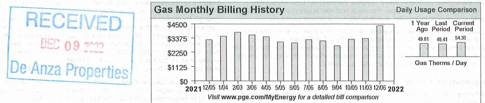

## Service For:

DV - METRO L.P.
660 KING ST
SAN FRANCISCO, CA 94107

## Questions about your bill?

Mon-Fri 7 a.m.-7 p.m.
Saturday 8 a.m.-5 p.m.
Phone: 1-800-743-5000
www.pge.com/MyEnergy

## Ways To Pay

www.pge.com/waystopay

## Your Account Summary

Amount Due on Previous Statement \$3,354.75
Payment(s) Received Since Last Statement -3,354.75
Previous Unpaid Balance $\$ 0.00$
Current Gas Charges $\$ 4,360.04$

Total Amount Due by 12/27/2022 \$4,360.04

The image is a graph/chart.

- **Chart Type**: Bar chart
- **Title**: Gas Monthly Billing History
- **Y-Axis**: Dollar amounts ($0, $1125, $2250, $3375, $4500)
- **X-Axis**: Dates (12/05, 1/04, 2/03, 3/06, 4/05, 5/06, 6/05, 7/06, 8/05, 9/04, 10/05, 11/03, 12/06)
- **Yearly Usage Breakdown (Monthly-Based)**: The chart shows monthly billing amounts from December 2021 to December 2022.
- **Daily Usage Comparison**:
  - 1 Year Ago: 49.61 Gas Therms/Day
  - Last Period: 48.41 Gas Therms/Day
  - Current Period: 54.30 Gas Therms/Day
- **Additional Text**: "Visit www.pge.com/MyEnergy for a detailed bill comparison"
- **Stamp**: "RECEIVED DEC 09 2022 De Anza Properties" in blue and red.

# Important Messages 

Electric power line safety PG\&E cares about your safety. Be aware of your surroundings and keep yourself, tools, equipment and antennas at least 10 feet away from overhead power lines. If you see an electric power line fall to the ground, keep yourself and others away. Call $9-1-1$.

Please return this portion with your payment. No staples or paper clips. Do not fold. Thank you.

## 999094319433b0b000043b004000043b004

Account Number: Due Date: Total Amount Due: $9431943360-6 \quad 12 / 27 / 2022 \quad \$ 4,360.04$
Amount Enclosed:
\$

99560004216101 AB 0.4926523046
$\mathrm{n}\left[\mathrm{n}\left(\mathrm{l}_{1}\right)\left(\mathrm{l}_{1}\left(\mathrm{l}_{1}\right)\right.$ ) $\left.\mathrm{l}_{1}\left(\mathrm{l}_{1}\right)\left(\mathrm{l}_{1}\right)\left(\mathrm{l}_{1}\right)\right.$ n $\left(\mathrm{n}\left(\mathrm{l}_{1}\right)\right.$ n $\left(\mathrm{l}_{1}\left(\mathrm{l}_{1}\right)\right.$ l $\left.\mathrm{l}_{1}\left(\mathrm{l}_{1}\right)\right] 1\left(\mathrm{l}_{1}\right.$ l $\left.\mathrm{l}_{1}\right]$
DV - METRO L.P.
960 N SAN ANTONIO RD STE 114
LOS ALTOS, CA 94022-1346

PG\&E
BOX 997300
SACRAMENTO, CA 95899-7300

# Important Phone Numbers - Monday-Friday 7 a.m.-7 p.m., Saturday 8 a.m.-5 p.m. 

## Customer Service (All Languages; Relay Calls Accepted) 1-800-743-5000

TTY 7-1-1

Servicio al Cliente en Español (Spanish) 4-800-660-6789
華語客戶服務 (Chinese)
1-800-893-9555

## Rules and rates

You may be eligible for a lower rate. To learn more about optional rates or view a complete list of rules and rates, visit www.pge.com or call 1-800-743-5000.

If you believe there is an error on your bill, please call 1-800-743-5000 to speak with a representative. If you are not satisfied with our response, contact the California Public Utilities Commission (CPUC), Consumer Affairs Branch (CAB), 505 Van Ness Avenue, Room 2003, San Francisco, CA 94102, 1-800-649-7570 or 7-1-1 (8:30 AM to 4:30 PM, Monday through Friday) or by visiting www.cpuc.ca.gov/complaints/.

To avoid having service turned off while you wait for the outcome of a complaint to the CPUC specifically regarding the accuracy of your bill, please contact CAB for assistance. If your case meets the eligibility criteria, CAB will provide you with instructions on how to mail a check or money order to be impounded pending resolution of your case. You must continue to pay your current charges while your complaint is under review to keep your service turned on.
If you are not able to pay your bill, call PG\&E to discuss how we can help. You may qualify for reduced rates under PG\&E's CARE program or other special programs and agencies may be available to assist you. You may qualify for PG\&E's Energy Savings Assistance Program which is an energy efficiency program for income-qualified residential customers.

## Important definitions

Rotating outage blocks are subject to change without advance notice due to operational conditions.
Tier 1/Baseline allowance: Some residential rates are given a Tier 1/Baseline allowance - a CPUC approved percentage of average customer usage during summer and winter months. Your Tier 1/Baseline allowance provides for basic needs at an affordable price and encourages conservation. Your allowance is assigned based on the climate where you live, the season and your heat source. As you use more energy, you pay more for usage. Any usage over your baseline allowance will be charged at a higher price.
High Usage: An increased price per kWh whenever electricity usage exceeds four times the Baseline Allowance (Tier 1) in a billing period. This charge does not apply to Time-of-Use rate plans.

Dich vu khách tiếng Việt (Vietnamese)
$1-800-298-8438$
Business Customer Service
$1-800-468-4743$
Wildfire Fund Charge: Charge on behalf of the State of California Department of Water Resources (DWR) to fund the California Wildfire Fund. For usage prior to October 1, 2020, this charge included costs related to the 2001 California energy crisis, also collected on behalf of the DWR. These charges belong to DWR, not PG\&E.
Power Charge Indifference Adjustment (PCIA): The PCIA is a charge to ensure that both PG\&E customers and those who have left PG\&E service to purchase electricity from other providers pay for the above market costs for electric generation resources that were procured by PG\&E on their behalf. 'Above market' refers to the difference between what the utility pays for electric generation and current market prices for the sale of those resources. Visit www.pge.com/cca.
Wildfire Hardening Charge: PG\&E has been permitted to issue bonds that enable it to recover more quickly certain costs related to preventing and mitigating catastrophic wildfires, while reducing the total cost to its customers. Your bill for electric service includes a fixed recovery charge called the Wildfire Hardening Charge that has been approved by the CPUC to repay those bonds. The right to recover the Wildfire Hardening Charge has been transferred to a separate entity (called the Special Purpose Entity) that issued the bonds and does not belong to PG\&E. PG\&E is collecting the Wildfire Hardening Charge on behalf of the Special Purpose Entity. For details visit: www.pge.com/tariffs/assets/pdf/tariflbook/ELEC_PRELIM_JF.pdf.

Recovery Bond Charge/Credit: Your bill for electric service includes a charge that has been approved by the CPUC to repay bonds issued for certain costs related to catastrophic wildfires. Separately, a PG\&E trust provides a customer credit equal to the charge for customers. Visit www.pge.com/billexplanation for additional details on charge item.
Gas Public Purpose Program (PPP) Surcharge. Used to fund state-mandated gas assistance programs for low-income customers, energy efficiency programs, and public-interest research and development.

Visit www.pge.com/billexplanation for more definitions. To view most recent bill inserts including legal or mandated notices, visit www.pge.com/bilinserts.

[^0]
## Update My Information (English Only)

Please allow 1-2 billing cycles for changes to take effect

## Account Number: 9431943360-6

Change my mailing address to: $\qquad$

| City | State | ZIP code |
| :-- | :-- | :-- |
| Primary | Primary |  |
| Phone | Email |  |

## Ways To Pay

- Online via web or mobile at www.pge.com/waystopay
- By mail: Send your payment along with this payment stub in the envelope provided.
- By debit card, Visa, MasterCard, American Express, or Discover: Call 877-704-8470 at any time. (Our independent service provider charges a fee per transaction.)
- At a PG\&E payment center or local office: To find a payment center or local office near you, please visit www.pge.com or call 800-743-5000. Please bring a copy of your bill with you.

[^0]:    "PG\&E" refers to Pacific Gas and Electric Company, a subsidiary of PG\&E Corporation. © 2022 Pacific Gas and Electric Company. All rights reserved.
    Please do not mark in box. For system use only.

| Details of Gas Charges |  |
| :--: | :--: |
| 11/03/2022 - 12/05/2022 (33 billing days) |  |
| Service For: 660 KING ST |  |
| Service Agreement ID: 9430023979 |  |
| Rate Schedule: GM TW Master-Metered Multi-Family Service |  |
| Number of Dwelling Units: 143 |  |
| 11/03/2022 - 11/30/2022 |  |
| Tier 1 Allowance | 1,721.72000 Therm |
| Tier 1 Usage | 1,520.484848 Therm |
| Gas PPP Surcharge (\$0.10346 /Therm) |  |
| SF Prop C Tax Surcharge | 34.49 |
| 12/01/2022 - 12/05/2022 |  |
| Tier 1 Allowance | 307.45000 Therm |
| Tier 1 Usage | 271.515152 Therm |
| Gas PPP Surcharge (\$0.10346 /Therm) |  |
| SF Prop C Tax Surcharge | 28.09 |
|  | 6.27 |

\$4,360.04

| Gas Usage This Period: 1,792.000000 Therms, 33 billing days |  |
| :--: | :--: |
| Therm | ----- = Average Daily Usage 54.30 |
| 80 |  |
| 64 |  |
| 48 |  |
| 32 |  |
| 16 |  |
| 0 |  |
|  |  |
|  |  |
|  |  |

| Service Information |  |
| :--: | :--: |
| Meter \# | 54606937 |
| Current Meter Reading | 32,179 |
| Prior Meter Reading | 30,484 |
| Difference | 1,695 |
| Multiplier | 1.057165 |
| Total Usage | 1,792.000000 Therm |
| Baseline Territory | T |
| Serial | K |
| Gas Procurement Costs (\$/Therm) |  |
| 11/03/2022 - 11/30/2022 | $\$ 0.93988$ |
| 12/01/2022 - 12/05/2022 | $\$ 0.98040$ |

$\qquad$

