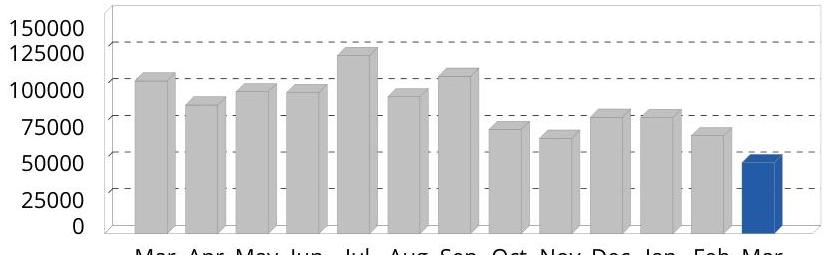

## 32 CHAMPION ENERGY SERVICES*

A Calpine Company
1500 Rankin Rd., Suite 200 | Houston, TX 77073

## Account Information

Account Name: EASYPAK, LLC
Account Number: 94747
Service Address: 30 JYTEK PARK POLE 10
LEOMINSTER MA 01453
Premise ID: $\quad 6356843024$
Thanks for your business!

## Bill Summary

Bill Number: $\quad 230660019358058$
Billing Period: $\quad 02 / 06 / 2023$ - 03/06/2023
Usage This Period: $\quad 48,400 \mathrm{kWh}$
Previous Balance: $\quad \$ 10,317.64$
Previous Payment: - $\$ 10,317.64$
Adjustments: $\quad \$ 0.00$
Current Charges: $\quad \$ 6,969.25$
Amount Due: $\quad \$ 6,969.25$
Due Date: $\quad 03 / 28 / 2023$

# Energy Usage Report 

| Meter Number | Previous Meter Read | Previous Read Date | Current Meter   Read | Current Read Date | Read Type | Multiplier | Total Usage | Demand | Power Factor |
| :--: | :--: | :--: | :--: | :--: | :--: | :--: | :--: | :--: | :--: |
| 6356843024 |  | 02/06/2023 |  | 03/06/2023 | Actual |  | 48,400 | 208.0 | 0 |

kWh

The image is a bar chart.

- **Chart Type**: Bar chart
- **X-Axis**: Months (Mar, Apr, May, Jun, Jul, Aug, Sep, Oct, Nov, Dec, Jan, Feb, Mar)
- **Y-Axis**: Unlabeled, but numerical values suggest energy usage in kWh (0 to 150,000)
- **Legend/Entries**: None specified
- **Data Points**: 
  - Bars for each month with varying heights
  - The bar for the last month (March) is highlighted in blue, indicating a usage of approximately 48,400 kWh
  - Previous months have higher usage, with peaks around 125,000 kWh
- **Styling**: The current month's bar is distinctively colored in blue, while previous months are in gray.

**Yearly usage breakdown (monthly-based)** is evident from the monthly labels and usage representation.

Mar Apr May Jun Jul Aug Sep Oct Nov Dec Jan Feb Mar
Previous Months
This Month

## Champion Energy

1500 Rankin Road, Suite 200
Houston TX 77073

## Payment Instructions

To pay by check, make payable to: Champion Energy. To pay by phone call 1-877-635-5090.

EASYPAK, LLC
EASYPAK, LLC
24 JYTECK DR
LEOMINSTER MA 01453

## Bill Summary

| Bill Number: | 230660019358058 |
| :-- | --: |
| Billing Period: | $02 / 06 / 2023$ - 03/06/2023 |
| Usage This Period: | 48,400 kWh |
| Previous Balance: | $\$ 10,317.64$ |
| Previous Payment: | - $\$ 10,317.64$ |
| Adjustments: | $\$ 0.00$ |
| Current Charges: | $\$ 6,969.25$ |
| Amount Due: | $\$ 6,969.25$ |
| Due Date: |  |

## Champion Energy

P.O. Box 787626

Philadelphia PA 19178-7626

# EMECHAMPION ENERGY SERVICES* 

A Calpine Company
1500 Rankin Rd., Suite 200 | Houston, TX 77073

## Questions or Concerns?

Champion Energy (Toll-free 24hr)

## 844-694-2339

support@champion.energy

## For Outages and Emergencies

Massachusetts Electric (MECO) (Toll-free 24hr)

800-233-5325

## BIII Details

## Electricity Charges for 02/06/2023 - 03/06/2023

## Champion Energy Charges

Generation
48,400
48,400
48,400
0.050781
$2,457.81$
Adder Charge
48,400
0.058
$2,807.20$
Capacity (367.42 Obl $\times 23$ days)
8,450.59
0.17
$1,424.53$
Capacity (367.42 Obl $\times 5$ days)
1,837.08
0.15
\$279.71

Total Electricity Charges this period \$6,969.25
The average price you paid for electricity service this period:
14.4C per kWh

TOTAL ACCOUNT NET NEW CHARGES \$6,969.25

## Meter Details

## Meter Number: 6356843024

Previous Meter Read: on 02/06/2023
Current Meter Read: on 03/06/2023
Read Type: Actual Multiplier:
Power Factor: 0
Demand: 208.0
Total Usage: 48,400

