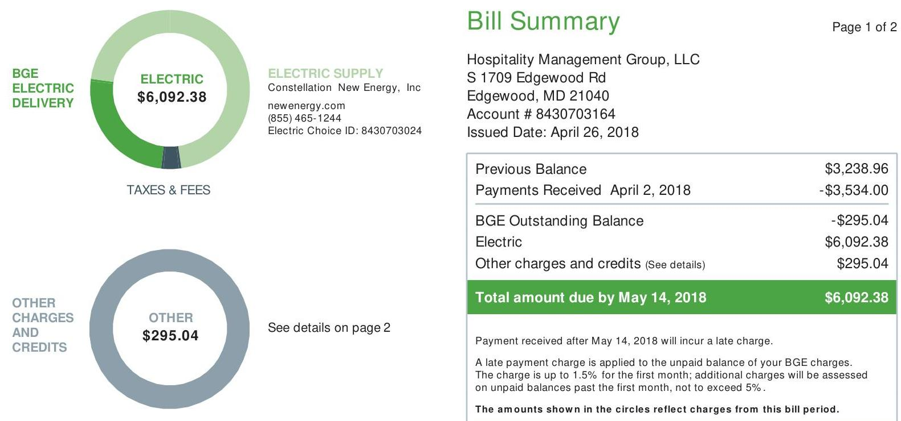
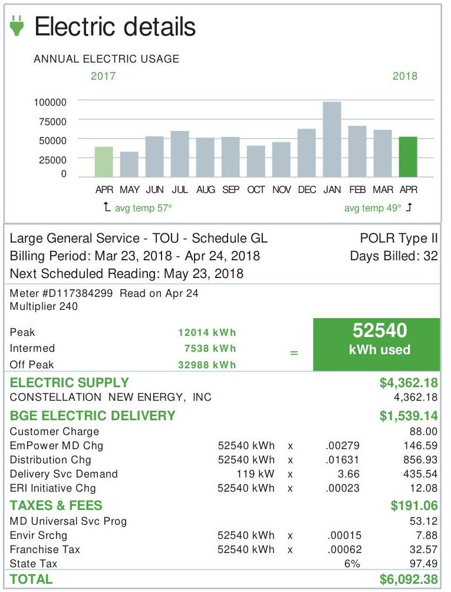
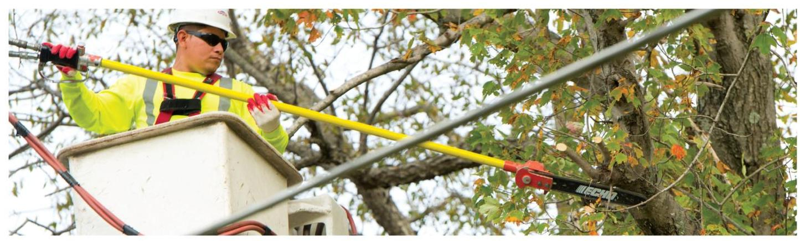
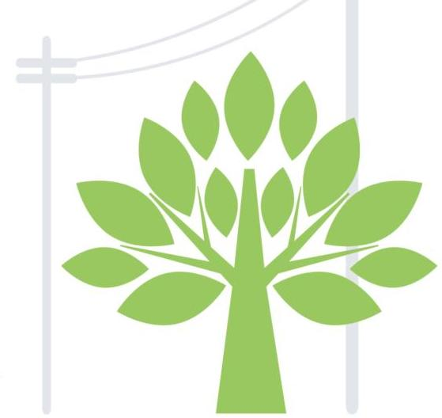
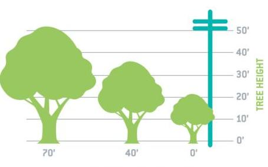
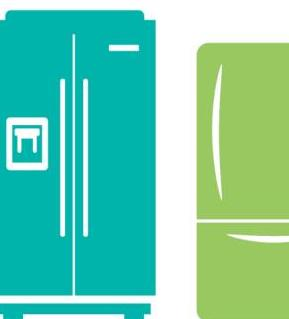

The image is a photo of a bill summary from BGE. It includes two circular charts and a detailed bill summary.

1. **Circular Charts:**
   - **BGE Electric Delivery:**
     - Center text: "ELECTRIC $6,092.38"
     - Label: "BGE ELECTRIC DELIVERY"
   - **Other Charges and Credits:**
     - Center text: "OTHER $295.04"
     - Label: "OTHER CHARGES AND CREDITS"

2. **Bill Summary:**
   - **Header:**
     - "Bill Summary"
     - "Page 1 of 2"
   - **Recipient Information:**
     - "Hospitality Management Group, LLC"
     - "S 1709 Edgewood Rd"
     - "Edgewood, MD 21040"
     - "Account # 8430703164"
     - "Issued Date: April 26, 2018"
   - **Financial Details:**
     - "Previous Balance $3,238.96"
     - "Payments Received April 2, 2018 -$3,534.00"
     - "BGE Outstanding Balance -$295.04"
     - "Electric $6,092.38"
     - "Other charges and credits (See details) $295.04"
     - "Total amount due by May 14, 2018 $6,092.38"
   - **Payment Instructions:**
     - "Payment received after May 14, 2018 will incur a late charge."
     - "A late payment charge is applied to the unpaid balance of your BGE charges. The charge is up to 1.5% for the first month; additional charges will be assessed on unpaid balances past the first month, not to exceed 5%."
     - "The amounts shown in the circles reflect charges from this bill period."

3. **Electric Supply Information:**
   - "ELECTRIC SUPPLY"
   - "Constellation New Energy, Inc"
   - "newenergy.com"
   - "(855) 465-1244"
   - "Electric Choice ID: 8430703024"

4. **Additional Notes:**
   - "See details on page 2"
   - "TAXES & FEES"

# BGE 

CHAPTER
CHARGES
AND
CREDITS

Return only this portion with your check made payable to BGE. Please write your account number on your check. Pay your bill online, by phone or by mail.

Inspitality Management Group, LLC
8815 Center Prk Dr
Suite 400
Columbia, MD 21045-2272

## BGE

P.O. Box 13070

Philadelphia, PA 19101-3070

The image is a photo of an electric bill statement with a bar chart.

- **Chart Type**: Bar chart
- **Chart Details**:
  - **Title**: ANNUAL ELECTRIC USAGE
  - **X-Axis**: Months (APR, MAY, JUN, JUL, AUG, SEP, OCT, NOV, DEC, JAN, FEB, MAR, APR)
  - **Y-Axis**: Usage in kWh (0 to 100,000)
  - **Legend**: avg temp 57° (green bar for April 2017), avg temp 49° (green bar for April 2018)
  - **Data Points**: Monthly usage for 2017 and 2018, with a notable peak in January 2018.

- **Embedded Text**:
  - "Electric details"
  - "Large General Service - TOU - Schedule GL"
  - "Billing Period: Mar 23, 2018 - Apr 24, 2018"
  - "Next Scheduled Reading: May 23, 2018"
  - "Meter #D117384299 Read on Apr 24"
  - "Multiplier 240"
  - "Peak 12014 kWh"
  - "Intermed 7538 kWh"
  - "Off Peak 32988 kWh"
  - "52540 kWh used"
  - "ELECTRIC SUPPLY"
  - "CONSTELLATION NEW ENERGY, INC"
  - "$4,362.18"
  - "BGE ELECTRIC DELIVERY"
  - "Customer Charge 88.00"
  - "EmPower MD Chg 52540 kWh x .00279 146.59"
  - "Distribution Chg 52540 kWh x .01631 856.63"
  - "Delivery Svc Demand 119 kW x 3.66 435.54"
  - "ERI Initiative Chg 52540 kWh x .00023 12.08"
  - "TAXES & FEES"
  - "MD Universal Svc Prog 53.12"
  - "Envir Srchg 52540 kWh x .00015 7.88"
  - "Franchise Tax 52540 kWh x .00062 32.57"
  - "State Tax 6% 97.49"
  - "TOTAL $6,092.38"

- **Spatial Relationships**:
  - The bar chart is at the top, showing monthly usage.
  - Below the chart, billing details and charges are listed.
  - "52540 kWh used" is highlighted in a green box.
  - The total amount "$6,092.38" is prominently displayed at the bottom.

## Electric Supplier Charges

CONSTELLATION NEW ENERGY, INC
Billing Period: Mar 23, 2018 - Apr 24, 2018
Fixed Price Transa 52540 KH x 0.0782299
$4110.20$
Market Charges 52540 KH x 0.0000963
Tax Charges 4115 KH x 0.0600049
Total Electric Supplier
$\$ 4,362.18$
All inquiries on above supplier billing should be directed to CONSTELLATION NEW ENERGY, INC at 855.465.1244

## Other charges and credits

Late Payment Charge on Electric
295.04

TOTAL
$\$ 295.04$

## IMPORTANT INFORMATION ABOUT YOUR BILL

- Your Payment Arrangement payoff balance is $\$ 27,923.38$.
- The EmPower MD charge funds programs that can help you reduce your energy consumption and save you money. For more information, including how to participate, go to BGESmartEnergy.com.

| Other ways to pay |  |  |  |  |
| :--: | :--: | :--: | :--: | :--: |
|  | In-person   America's Cash Express**   877.223.2274 |  |  | Pay-by-phone   Western Union Speed Pay**   888.232.0088 |
|  | Global Express**   800.989.6669 |  |  | "Fee applies. |

# Routine maintenance improves reliability. 

BGE's commitment to electricity reliability goes beyond maintaining just the poles and lines - it extends to the trees surrounding more than 10,000 miles of overhead power lines. BGE invests more than $\$ 34$ million each year into our Tree and Vegetation Management Program, which includes assessing, pruning and removing trees that may cause electric outages, as well as managing vegetation above our underground natural gas transmission pipeline network.

All of this attention to trees has reduced tree-related service outages by nearly $40 \%$ since 2011. To learn more about how smart energy gets more reliable every day, visit BGE.COM/Reliability.

The image is a photo showing a worker in a bucket lift wearing safety gear, including a helmet and sunglasses. The worker is using a pole saw to trim branches from a tree. The background consists of tree branches and leaves, and there are power lines visible in the foreground. The worker is focused on the task, and the scene suggests a tree maintenance operation near power lines.

## BGE's Tree and Vegetation Management Program

## SCHEDULED MAINTENANCE

BGE's strategy is based on a four- or five-year trimming cycle, routine inspections and reliability performance data. BGE also further enhances tree and vegetation management efforts by implementing requirements mandated by the Maryland Public Service Commission, called the Electricity Service Quality and Reliability Act or RM 43 standards.

## PRUNING STANDARDS

BGE uses only licensed, utility-qualified, professional tree-trimming contractors to manage the trees and other vegetation around power lines and equipment. When a neighborhood is scheduled for routine tree and vegetation management work, BGE's contractors place door hangers to let property owners know when to expect crews. If heavy tree pruning or removal is required, the property owner will be directly contacted before work is commenced. If you have questions about the proposed work, call the BGE contractor directly by using the phone number on the door hanger. To learn more information on the program, visit BGE.COM/TreeCare.

The image is an illustration showing a stylized green tree with multiple leaves. To the left of the tree, there is a faint depiction of power lines and a utility pole. The tree is centrally positioned, and the power lines run vertically alongside it. The illustration suggests a focus on the relationship between trees and power infrastructure.

# TREE TRIMMING 

BGE encourages customers to manage the heights or spreads of their trees before they get within 10 feet of interfering with electrical lines and equipment. In addition, the Maryland High Voltage Line Act (HVLA) requires anyone working or using tools or equipment within 10 feet of overhead lines to contact BGE first at 800.685.0123, to evaluate the site and plan how to best make the work area safe. To find a private licensed tree care contractor to prune or remove your trees, visit BGE.COM/TreeCare.

The image is an illustration of two appliances. On the left is a teal refrigerator with a vertical handle. On the right is a green chest freezer with an open lid. Both are depicted in a minimalist style with no additional details or background elements.

## DIG SAFE

Smart digging means always calling Miss Utility at 811 at least two full business days (but not more than 10 days) before you begin excavations on any project - from home landscaping and gardening to large construction jobs.

With one free call, representatives will visit your proposed dig site and mark the locations of underground electrical wires, gas pipelines and other utilities. Calling 811 before you dig is the first step in preventing damage to underground utilities that can cause serious injuries, disruptions of a neighborhood's critical services and expensive penalties and repair costs. For additional information, visit BGE.COM/811.

## PLANTING TREES

BGE recommends the Arbor Day Foundation's The Right Tree, the Right Place guideline which advises that any trees planted within 20 feet on either side of pole-to-pole power lines have a mature height of less than 25 feet. For more information on how to comply with the HVLA by choosing the right tree for the right place on your property please visit BGE.COM/TreeCare.

The image is a graph/chart.

- **Chart Type**: Bar chart with illustrations.
- **Axis Title**: "TREE HEIGHT" on the vertical axis.
- **Units**: The vertical axis is marked in feet, with increments at 0', 10', 20', 30', 40', and 50'.
- **Legend/Labels**: None.
- **Visible Data Points**:
  - Three trees are illustrated at different heights and distances:
    - A tree at 70' distance with a height slightly above 30'.
    - A tree at 40' distance with a height slightly above 20'.
    - A tree at 0' distance with a height slightly above 10'.
  - A power pole is illustrated at 0' distance with a height of 50'.
- **Styling**: The trees are depicted in green, and the power pole is in blue.

DISTANCE FROM POWER POLE

The image is an illustration depicting a residential scene. It features two houses with garages, surrounded by trees. The background is green with stylized clouds. The houses have orange roofs and chimneys, and the windows and doors are highlighted in orange. The scene conveys a suburban or neighborhood setting.

## Tree-mendous community efforts.

> Since 2013, BGE has donated more than $\$ 650,000$ to the Arbor Day Foundation to help improve the area's tree canopy.
> More than 25,000 free trees have been donated directly to customers through the Energy Saving Trees Program.
> BGE has also partnered with Blue Water Baltimore, an organization committed to increasing Baltimore's tree canopy.

## Get $\$ 50$ for recycling an old working fridge or freezer.

In recognition of Earth Month, make some space and some cash this spring when you recycle that old working refrigerator or freezer in your garage or basement. We'll pick it up and haul it away at no additional cost to you - and give you a $\$ 50$ reward! Recycle an old room A/C unit or dehumidifier at the same time and get an extra $\$ 25$ ! It's that easy. To schedule a pickup, visit BGESmartEnergy.com/SENRecycling or call 866.898.1901.

The image is an illustration of two refrigerators. The refrigerator on the left is teal and features a water dispenser. The refrigerator on the right is green and has a simpler design without a dispenser. Both are depicted in a minimalist style with no additional details or background elements.

The image is an illustration of two appliances. On the left is a teal refrigerator with a vertical handle. On the right is a green chest freezer with an open lid. Both are depicted in a minimalist style with no additional details or background elements.

