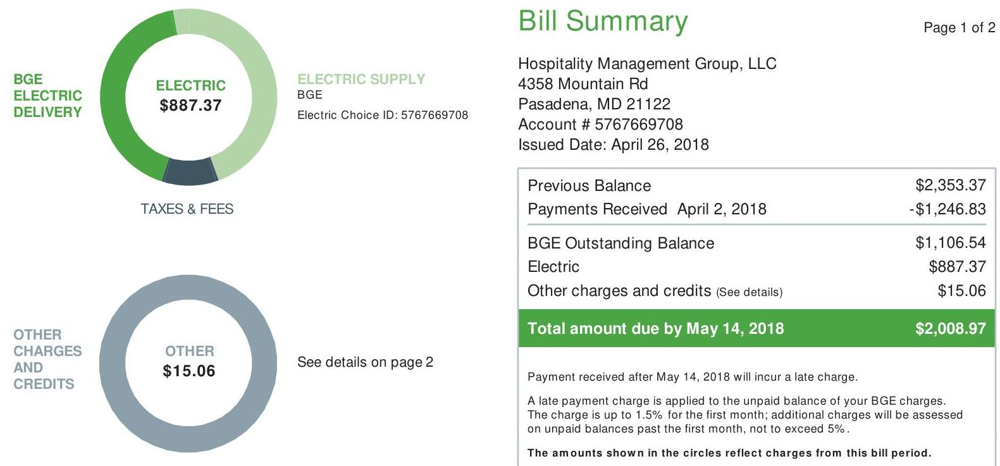
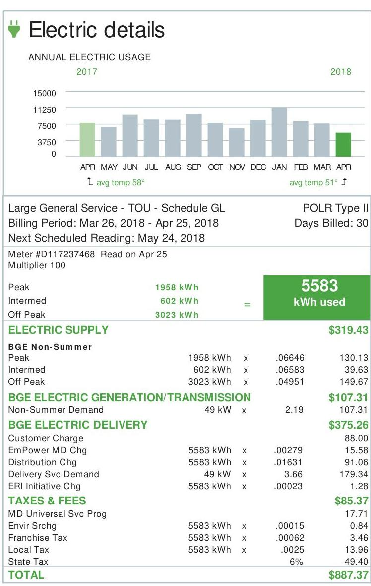
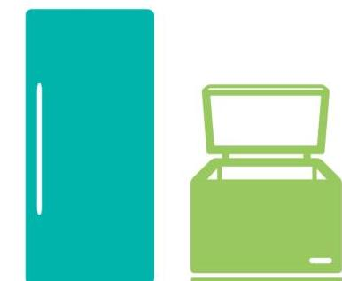
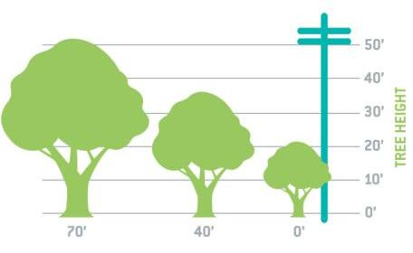
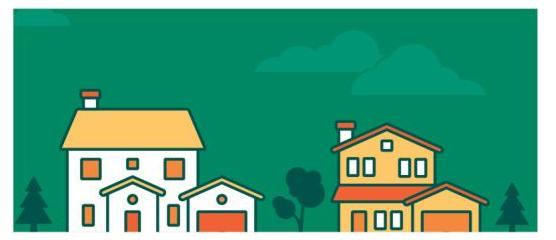
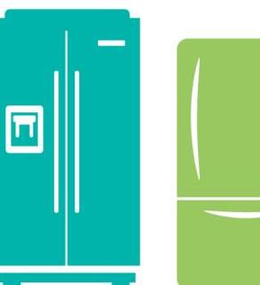

The image is a photo of a bill summary from BGE. It includes two circular charts and a detailed billing summary.

1. **Circular Charts:**
   - **Top Chart:**
     - Title: "BGE ELECTRIC DELIVERY"
     - Center Text: "ELECTRIC $887.37"
     - Label: "ELECTRIC SUPPLY BGE Electric Choice ID: 5767669708"
   - **Bottom Chart:**
     - Title: "OTHER CHARGES AND CREDITS"
     - Center Text: "OTHER $15.06"
     - Note: "See details on page 2"

2. **Bill Summary:**
   - Header: "Bill Summary"
   - Customer Information:
     - "Hospitality Management Group, LLC"
     - "4358 Mountain Rd"
     - "Pasadena, MD 21122"
     - "Account # 5767669708"
     - "Issued Date: April 26, 2018"
   - Billing Details:
     - "Previous Balance: $2,353.37"
     - "Payments Received April 2, 2018: -$1,246.83"
     - "BGE Outstanding Balance: $1,106.54"
     - "Electric: $887.37"
     - "Other charges and credits (See details): $15.06"
   - Total Due:
     - Highlighted Text: "Total amount due by May 14, 2018: $2,008.97"
   - Payment Information:
     - "Payment received after May 14, 2018 will incur a late charge."
     - "A late payment charge is applied to the unpaid balance of your BGE charges. The charge is up to 1.5% for the first month; additional charges will be assessed on unpaid balances past the first month, not to exceed 5%."
   - Note: "The amounts shown in the circles reflect charges from this bill period."

# BGE 

CHAPTER
CHARGES
AND
CREDITS

Return only this portion with your check made payable to BGE. Please write your account number on your check. Pay your bill online, by phone or by mail.

Inspitality Management Group, LLC
8815 Center Prk Dr
Suite 400
Columbia, MD 21045-2272

## BGE

P.O. Box 13070

Philadelphia, PA 19101-3070

The image is a photo of an electric bill with a bar chart and detailed billing information.

1. **Chart Type**: Bar chart
   - **Title**: ANNUAL ELECTRIC USAGE
   - **X-axis**: Months (APR, MAY, JUN, JUL, AUG, SEP, OCT, NOV, DEC, JAN, FEB, MAR, APR)
   - **Y-axis**: Usage (0 to 15000)
   - **Legend**: 2017, 2018
   - **Data Points**: Monthly usage for 2017 and 2018
   - **Styling**: Green bar for April 2017 and April 2018, gray bars for other months

2. **Billing Information**:
   - **Header**: Electric details
   - **Billing Period**: Mar 26, 2018 - Apr 25, 2018
   - **Next Scheduled Reading**: May 24, 2018
   - **Meter**: #D117237468 Read on Apr 25
   - **Multiplier**: 100
   - **Usage**: Peak 1958 kWh, Intermed 602 kWh, Off Peak 3023 kWh
   - **Total Usage**: 5583 kWh used
   - **Charges**:
     - **ELECTRIC SUPPLY**: $319.43
     - **BGE ELECTRIC GENERATION/TRANSMISSION**: $107.31
     - **BGE ELECTRIC DELIVERY**: $375.26
     - **TAXES & FEES**: $85.37
   - **Total Amount**: $887.37

3. **Embedded Text**:
   - **ELECTRIC SUPPLY**: BGE Non-Summer
   - **BGE ELECTRIC GENERATION/TRANSMISSION**: Non-Summer Demand 49 kW
   - **BGE ELECTRIC DELIVERY**: Customer Charge, EmPower MD Chg, Distribution Chg, Delivery Svc Demand, ERI Initiative Chg
   - **TAXES & FEES**: MD Universal Svc Prog, Envir Srchg, Franchise Tax, Local Tax, State Tax

## Other charges and credits

Late Payment Charge on Electric
15.06

TOTAL
\$15.06

## IMPORTANT INFORMATION ABOUT YOUR BILL

- URGENT! A turn off notice has been released on your account. Your service is subject to denial. Please pay immediately to avoid service interruption.
- The EmPower MD charge funds programs that can help you reduce your energy consumption and save you money. For more information, including how to participate, go to BGESmartEnergy.com.

| Other ways to pay |  |  |  |  |  |
| :--: | :--: | :--: | :--: | :--: | :--: |
|  |  |  |  |  |  |
|  |  |  |  |  |  |
|  |  |  |  |  |  |
|  |  |  |  |  |  |
|  | In-person |  |  |  |  |
|  | Americal's Cash Express** |  |  |  |  |
|  | 877.223.2274 |  |  |  |  |
|  | Global Express** |  |  |  |  |
|  | 800.989.6669 |  |  |  |  |

Pay-by-phone
Western Union Speed Pay**
888.232.0088
${ }^{*}$ Fee applies.

# Routine maintenance improves reliability. 

BGE's commitment to electricity reliability goes beyond maintaining just the poles and lines - it extends to the trees surrounding more than 10,000 miles of overhead power lines. BGE invests more than $\$ 34$ million each year into our Tree and Vegetation Management Program, which includes assessing, pruning and removing trees that may cause electric outages, as well as managing vegetation above our underground natural gas transmission pipeline network.

All of this attention to trees has reduced tree-related service outages by nearly $40 \%$ since 2011. To learn more about how smart energy gets more reliable every day, visit BGE.COM/Reliability.

The image is a photo showing a worker in a bucket truck wearing safety gear, including a helmet and sunglasses. The worker is using a long pole saw to trim branches from a tree. The background shows tree foliage, and there are power lines visible in the foreground. The worker appears to be engaged in routine maintenance as part of a tree and vegetation management program.

## BGE's Tree and Vegetation Management Program

## SCHEDULED MAINTENANCE

BGE's strategy is based on a four- or five-year trimming cycle, routine inspections and reliability performance data. BGE also further enhances tree and vegetation management efforts by implementing requirements mandated by the Maryland Public Service Commission, called the Electricity Service Quality and Reliability Act or RM 43 standards.

## PRUNING STANDARDS

BGE uses only licensed, utility-qualified, professional tree-trimming contractors to manage the trees and other vegetation around power lines and equipment. When a neighborhood is scheduled for routine tree and vegetation management work, BGE's contractors place door hangers to let property owners know when to expect crews. If heavy tree pruning or removal is required, the property owner will be directly contacted before work is commenced. If you have questions about the proposed work, call the BGE contractor directly by using the phone number on the door hanger. To learn more information on the program, visit BGE.COM/TreeCare.

The image is an illustration showing a stylized green tree with multiple leaves. To the left of the tree, there is a faint depiction of a utility pole with power lines. The tree is prominently centered, and the power lines are shown in a lighter color, suggesting a focus on tree and vegetation management in relation to power infrastructure. There is no text embedded in the image.

# TREE TRIMMING 

BGE encourages customers to manage the heights or spreads of their trees before they get within 10 feet of interfering with electrical lines and equipment. In addition, the Maryland High Voltage Line Act (HVLA) requires anyone working or using tools or equipment within 10 feet of overhead lines to contact BGE first at 800.685.0123, to evaluate the site and plan how to best make the work area safe. To find a private licensed tree care contractor to prune or remove your trees, visit BGE.COM/TreeCare.

The image is an illustration.

- **Subjects**: The illustration features two appliances.
- **Styling**: 
  - The appliance on the left is depicted in teal and resembles a refrigerator.
  - The appliance on the right is depicted in green and resembles a chest freezer.
- **Spatial Relationships**: 
  - The teal appliance is on the left, and the green appliance is on the right.

## DIG SAFE

Smart digging means always calling Miss Utility at 811 at least two full business days (but not more than 10 days) before you begin excavations on any project - from home landscaping and gardening to large construction jobs.

With one free call, representatives will visit your proposed dig site and mark the locations of underground electrical wires, gas pipelines and other utilities. Calling 811 before you dig is the first step in preventing damage to underground utilities that can cause serious injuries, disruptions of a neighborhood's critical services and expensive penalties and repair costs. For additional information, visit BGE.COM/811.

## PLANTING TREES

BGE recommends the Arbor Day Foundation's The Right Tree, the Right Place guideline which advises that any trees planted within 20 feet on either side of pole-to-pole power lines have a mature height of less than 25 feet. For more information on how to comply with the HVLA by choosing the right tree for the right place on your property please visit BGE.COM/TreeCare.

The image is a graph/chart.

- **Chart Type**: Bar chart
- **Axis Titles**: 
  - Y-axis: "TREE HEIGHT"
- **Units**: Feet (')
- **Legend Entries**: None
- **Visible Data Points**:
  - Tree at 70' mark
  - Tree at 40' mark
  - Tree at 0' mark
  - Power pole at 50'
- **Notable Styling**: 
  - Trees are illustrated in green.
  - The power pole is illustrated in blue.
- **Spatial Relationships**:
  - Trees are positioned at 70', 40', and 0' along the horizontal axis.
  - The power pole is shown at the 50' height mark on the vertical axis.

DISTANCE FROM POWER POLE

The image is a photo/illustration.

- **Subjects**: The illustration features two houses and a garage. 
- **Styling**: 
  - The house on the left is larger, with a chimney and a garage attached.
  - The house on the right is slightly smaller, also with a chimney and an attached garage.
  - Both houses are depicted in warm colors, primarily yellow and orange.
  - There are trees in the background, and the sky is illustrated with clouds.
- **Spatial Relationships**: 
  - The larger house is on the left, with the garage to its right.
  - The smaller house is on the right side of the image.

## Tree-mendous community efforts.

> Since 2013, BGE has donated more than $\$ 650,000$ to the Arbor Day Foundation to help improve the area's tree canopy.
> More than 25,000 free trees have been donated directly to customers through the Energy Saving Trees Program.
> BGE has also partnered with Blue Water Baltimore, an organization committed to increasing Baltimore's tree canopy.

## Get $\$ 50$ for recycling an old working fridge or freezer.

In recognition of Earth Month, make some space and some cash this spring when you recycle that old working refrigerator or freezer in your garage or basement. We'll pick it up and haul it away at no additional cost to you - and give you a $\$ 50$ reward! Recycle an old room A/C unit or dehumidifier at the same time and get an extra $\$ 25$ ! It's that easy. To schedule a pickup, visit BGESmartEnergy.com/SENRecycling or call 866.898.1901.

The image is an illustration.

- **Subjects**: The illustration features two refrigerators.
- **Styling**: 
  - The refrigerator on the left is depicted in teal and has a water dispenser.
  - The refrigerator on the right is depicted in green and has a simpler design.
- **Spatial Relationships**: 
  - The teal refrigerator is on the left, and the green refrigerator is on the right.

The image is an illustration.

- **Subjects**: The illustration features two appliances.
- **Styling**: 
  - The appliance on the left is depicted in teal and resembles a refrigerator.
  - The appliance on the right is depicted in green and resembles a chest freezer.
- **Spatial Relationships**: 
  - The teal appliance is on the left, and the green appliance is on the right.

