# Chapter 12 

## View Another Account

## chapter.

For electric service, only data for delivery is provided, as the customer has selected an alternate retail e

## Average BIII: \$1:\$666972

| 68'5E9 $\$$ | 68'5E9 $\$$ | NA/48/6972 | 32IA83S 3NL73T | 0202 |
| :--: | :--: | :--: | :--: | :--: |
| 16'5E2 $\$$ | 16'5E2 $\$$ | NA/48/6972 | 32IA83S 3NL73T | 0202 |
| 30'1E9 $\$$ | 30'1E9 $\$$ | NA/48/6972 | 32IA83S 3NL73T | 0202 |
| 26'9E2 $\$$ | 26'9E2 $\$$ | NA/48/6972 | 32IA83S 3NL73T | 0202 |
| 48'1E2 $\$$ | 48'1E2 $\$$ | NA/48/6972 | 32IA83S 3NL73T | 0202 |
| 69'69E $\$$ | 69'69E $\$$ | NA/48/6972 | 32IA83S 3NL73T | 0202 |
| 51'51E2 $\$$ | 51'51E2 $\$$ | NA/48/6972 | 32IA83S 3NL73T | 0202 |
| 61'021T1 $\$$ | 61'021T1 $\$$ | NA/48/6972 | 32IA83S 3NL73T | 0202 |
| 21'22E1 $\$$ | 21'22E1 $\$$ | NA/48/6972 | 32IA83S 3NL73T | 0202 |
| 29'6E2T1 $\$$ | 29'6E2T1 $\$$ | NA/48/6972 | 32IA83S 3NL73T | 0202 |
| 51'054T1 $\$$ | 51'054T1 $\$$ | NA/48/6972 | 32IA83S 3NL73T | 0202 |
| 66'8E1 $\$$ | 66'8E1 $\$$ | NA/48/6972 | 32IA83S 3NL73T | 0202 |
| 20'022T1 $\$$ | 20'022T1 $\$$ | NA/48/6972 | 32IA83S 3NL73T | 0202 |
| 30'022T1 $\$$ | 30'022T1 $\$$ | NA/48/6972 | 32IA83S 3NL73T | 0202 |
| 51'054T1 $\$$ | 51'054T1 $\$$ | NA/48/6972 | 32IA83S 3NL73T | 0202 |
| 66'8E1 $\$$ | 66'8E1 $\$$ | NA/48/6972 | 32IA83S 3NL73T | 0202 |
| 20'022T1 $\$$ | 20'022T1 $\$$ | NA/48/6972 | 32IA83S 3NL73T | 0202 |
| 30'022T1 $\$$ | 30'022T1 $\$$ | NA/48/6972 | 32IA83S 3NL73T | 0202 |
| 51'054T1 $\$$ | 51'054T1 $\$$ | NA/48/6972 | 32IA83S 3NL73T | 0202 |
| 66'8E1 $\$$ | 66'8E1 $\$$ | NA/48/6972 | 32IA83S 3NL73T | 0202 |
| 20'022T1 $\$$ | 20'022T1 $\$$ | NA/48/6972 | 32IA83S 3NL73T | 0202 |
| 30'022T1 $\$$ | 30'022T1 $\$$ | NA/48/6972 | 32IA83S 3NL73T | 0202 |
| 51'054T1 $\$$ | 51'054T1 $\$$ | NA/48/6972 | 32IA83S 3NL73T | 0202 |
| 66'8E1 $\$$ | 66'8E1 $\$$ | NA/48/6972 | 32IA83S 3NL73T | 0202 |
| 20'022T1 $\$$ | 20'022T1 $\$$ | NA/48/6972 | 32IA83S 3NL73T | 0202 |
| 30'022T1 $\$$ | 30'022T1 $\$$ | NA/48/6972 | 32IA83S 3NL73T | 0202 |
| 51'054T1 $\$$ | 51'054T1 $\$$ | NA/48/6972 | 32IA83S 3NL73T | 0202 |
| 66'8E1 $\$$ | 66'8E1 $\$$ | NA/48/6972 | 32IA83S 3NL73T | 0202 |
| 20'022T1 $\$$ | 20'022T1 $\$$ | NA/48/6972 | 32IA83S 3NL73T | 0202 |
| 30'022T1 $\$$ | 30'022T1 $\$$ | NA/48/6972 | 32IA83S 3NL73T | 0202 |
| 51'054T1 $\$$ | 51'054T1 $\$$ | NA/48/6972 | 32IA83S 3NL73T | 0202 |
| 66'8E1 $\$$ | 66'8E1 $\$$ | NA/48/6972 | 32IA83S 3NL73T | 0202 |
| 20'022T1 $\$$ | 20'022T1 $\$$ | NA/48/6972 | 32IA83S 3NL73T | 0202 |
| 30'022T1 $\$$ | 30'022T1 $\$$ | NA/48/6972 | 32IA83S 3NL73T | 0202 |
| 51'054T1 $\$$ | 51'054T1 $\$$ | NA/48/6972 | 32IA83S 3NL73T | 0202 |
| 66'8E1 $\$$ | 66'8E1 $\$$ | NA/48/6972 | 32IA83S 3NL73T | 0202 |
| 20'022T1 $\$$ | 20'022T1 $\$$ | NA/48/6972 | 32IA83S 3NL73T | 0202 |
| 30'022T1 $\$$ | 30'022T1 $\$$ | NA/48/6972 | 32IA83S 3NL73T | 0202 |
| 51'054T1 $\$$ | 51'054T1 $\$$ | NA/48/6972 | 32IA83S 3NL73T | 0202 |
| 66'8E1 $\$$ | 66'8E1 $\$$ | NA/48/6972 | 32IA83S 3NL73T | 0202 |
| 20'022T1 $\$$ | 20'022T1 $\$$ | NA/48/6972 | 32IA83S 3NL73T | 0202 |
| 30'022T1 $\$$ | 30'022T1 $\$$ | NA/48/6972 | 32IA83S 3NL73T | 0202 |
| 51'054T1 $\$$ | 51'054T1 $\$$ | NA/48/6972 | 32IA83S 3NL73T | 0202 |
| 66'8E1 $\$$ | 66'8E1 $\$$ | NA/48/6972 | 32IA83S 3NL73T | 0202 |
| 20'022T1 $\$$ | 20'022T1 $\$$ | NA/48/6972 | 32IA83S 3NL73T | 0202 |
| 30'022T1 $\$$ | 30'022T1 $\$$ | NA/48/6972 | 32IA83S 3NL73T | 0202 |
| 51'054T1 $\$$ | 51'054T1 $\$$ | NA/48/6972 | 32IA83S 3NL73T | 0202 |
| 66'8E1 $\$$ | 66'8E1 $\$$ | NA/48/6972 | 32IA83S 3NL73T | 0202 |
| 20'022T1 $\$$ | 20'022T1 $\$$ | NA/48/6972 | 32IA83S 3NL73T | 0202 |
| 30'022T1 $\$$ | 30'022T1 $\$$ | NA/48/6972 | 32IA83S 3NL73T | 0202 |
| 51'054T1 $\$$ | 51'054T1 $\$$ | NA/48/6972 | 32IA83S 3NL73T | 0202 |
| 66'8E1 $\$$ | 66'8E1 $\$$ | NA/48/6972 | 32IA83S 3NL73T | 0202 |
| 20'022T1 $\$$ | 20'022T1 $\$$ | NA/48/6972 | 32IA83S 3NL73T | 0202 |
| 30'022T1 $\$$ | 30'022T1 $\$$ | NA/48/6972 | 32IA83S 3NL73T | 0202 |
| 51'054T1 $\$$ | 51'054T1 $\$$ | NA/48/6972 | 32IA83S 3NL73T | 0202 |
| 66'8E1 $\$$ | 66'8E1 $\$$ | NA/48/6972 | 32IA83S 3NL73T | 0202 |
| 20'022T1 $\$$ | 20'022T1 $\$$ | NA/48/6972 | 32IA83S 3NL73T | 0202 |
| 30'022T1 $\$$ | 30'022T1 $\$$ | NA/48/6972 | 32IA83S 3NL73T | 0202 |
| 51'054T1 $\$$ | 51'054T1 $\$$ | NA/48/6972 | 32IA83S 3NL73T | 0202 |
| 66'8E1 $\$$ | 66'8E1 $\$$ | NA/48/6972 | 32IA83S 3NL73T | 0202 |
| 20'022T1 $\$$ | 20'022T1 $\$$ | NA/48/6972 | 32IA83S 3NL73T | 0202 |
| 30'022T1 $\$$ | 30'022T1 $\$$ | NA/48/6972 | 32IA83S 3NL73T | 0202 |
| 51'054T1 $\$$ | 51'054T1 $\$$ | NA/48/6972 | 32IA83S 3NL73T | 0202 |
| 66'8E1 $\$$ | 66'8E1 $\$$ | NA/48/6972 | 32IA83S 3NL73T | 0202 |
| 20'022T1 $\$$ | 20'022T1 $\$$ | NA/48/6972 | 32IA83S 3NL73T | 0202 |
| 30'022T1 $\$$ | 30'022T1 $\$$ | NA/48/6972 | 32IA83S 3NL73T | 0202 |
| 51'054T1 $\$$ | 51'054T1 $\$$ | NA/48/6972 | 32IA83S 3NL73T | 0202 |
| 66'8E1 $\$$ | 66'8E1 $\$$ | NA/48/6972 | 32IA83S 3NL73T | 0202 |
| 20'022T1 $\$$ | 20'022T1 $\$$ | NA/48/6972 | 32IA83S 3NL73T | 0202 |
| 30'022T1 $\$$ | 30'022T1 $\$$ | NA/48/6972 | 32IA83S 3NL73T | 0202 |
| 51'054T1 $\$$ | 51'054T1 $\$$ | NA/48/6972 | 32IA83S 3NL73T | 0202 |
| 66'8E1 $\$$ | 66'8E1 $\$$ | NA/48/6972 | 32IA83S 3NL73T | 0202 |
| 20'022T1 $\$$ | 20'022T1 $\$$ | NA/48/6972 | 32IA83S 3NL73T | 0202 |
| 30'022T1 $\$$ | 30'022T1 $\$$ | NA/48/6972 | 32IA83S 3NL73T | 0202 |
| 51'054T1 $\$$ | 51'054T1 $\$$ | NA/48/6972 | 32IA83S 3NL73T | 0202 |
| 66'8E1 $\$$ | 66'8E1 $\$$ | NA/48/6972 | 32IA83S 3NL73T | 0202 |
| 20'022T1 $\$$ | 20'022T1 $\$$ | NA/48/6972 | 32IA83S 3NL73T | 0202 |
| 30'022T1 $\$$ | 30'022T1 $\$$ | NA/48/6972 | 32IA83S 3NL73T | 0202 |
| 51'054T1 $\$$ | 51'054T1 $\$$ | NA/48/6972 | 32IA83S 3NL73T | 0202 |
| 66'8E1 $\$$ | 66'8E1 $\$$ | NA/48/6972 | 32IA83S 3NL73T | 0202 |
| 20'022T1 $\$$ | 20'022T1 $\$$ | NA/48/6972 | 32IA83S 3NL73T | 0202 |
| 30'022T1 $\$$ | 30'022T1 $\$$ | NA/48/6972 | 32IA83S 3NL73T | 0202 |
| 51'054T1 $\$$ | 51'054T1 $\$$ | NA/48/6972 | 32IA83S 3NL73T | 0202 |
| 66'8E1 $\$$ | 66'8E1 $\$$ | NA/48/6972 | 32IA83S 3NL73T | 0202 |
| 20'022T1 $\$$ | 20'022T1 $\$$ | NA/48/6972 | 32IA83S 3NL73T | 0202 |
| 30'022T1 $\$$ | 30'022T1 $\$$ | NA/48/6972 | 32IA83S 3NL73T | 0202 |
| 51'054T1 $\$$ | 51'054T1 $\$$ | NA/48/6972 | 32IA83S 3NL73T | 0202 |
| 66'8E1 $\$$ | 66'8E1 $\$$ | NA/48/6972 | 32IA83S 3NL73T | 0202 |
| 20'022T1 $\$$ | 20'022T1 $\$$ | NA/48/6972 | 32IA83S 3NL73T | 0202 |
| 30'022T1 $\$$ | 30'022T1 $\$$ | NA/48/6972 | 32IA83S 3NL73T | 0202 |
| 51'054T1 $\$$ | 51'054T1 $\$$ | NA/48/6972 | 32IA83S 3NL73T | 0202 |
| 66'8E1 $\$$ | 66'8E1 $\$$ | NA/48/6972 | 32IA83S 3NL73T | 0202 |
| 20'022T1 $\$$ | 20'022T1 $\$$ | NA/48/6972 | 32IA83S 3NL73T | 0202 |
| 30'022T1 $\$$ | 30'022T1 $\$$ | NA/48/6972 | 32IA83S 3NL73T | 0202 |
| 51'054T1 $\$$ | 51'054T1 $\$$ | NA/48/6972 | 32IA83S 3NL73T | 0202 |
| 66'8E1 $\$$ | 66'8E1 $\$$ | NA/48/6972 | 32IA83S 3NL73T | 0202 |
| 20'022T1 $\$$ | 20'022T1 $\$$ | NA/48/6972 | 32IA83S 3NL73T | 0202 |
| 30'022T1 $\$$ | 30'022T1 $\$$ | NA/48/6972 | 32IA83S 3NL73T | 0202 |
| 51'054T1 $\$$ | 51'054T1 $\$$ | NA/48/6972 | 32IA83S 3NL73T | 0202 |
| 66'8E1 $\$$ | 66'8E1 $\$$ | NA/48/6972 | 32IA83S 3NL73T | 0202 |
| 20'022T1 $\$$ | 20'022T1 $\$$ | NA/48/6972 | 32IA83S 3NL73T | 0202 |
| 30'022T1 $\$$ | 30'022T1 $\$$ | NA/48/6972 | 32IA83S 3NL73T | 0202 |
| 51'054T1 $\$$ | 51'054T1 $\$$ | NA/48/6972 | 32IA83S 3NL73T | 0202 |
| 66'8E1 $\$$ | 66'8E1 $\$$ | NA/48/6972 | 32IA83S 3NL73T | 0202 |
| 20'022T1 $\$$ | 20'022T1 $\$$ | NA/48/6972 | 32IA83S 3NL73T | 0202 |
| 30'022T1 $\$$ | 30'022T1 $\$$ | NA/48/6972 | 32IA83S 3NL73T | 0202 |
| 51'054T1 $\$$ | 51'054T1 $\$$ | NA/48/6972 | 32IA83S 3NL73T | 0202 |
| 66'8E1 $\$$ | 66'8E1 $\$$ | NA/48/6972 | 32IA83S 3NL73T | 0202 |
| 20'022T1 $\$$ | 20'022T1 $\$$ | NA/48/6972 | 32IA83S 3NL73T | 0202 |
| 30'022T1 $\$$ | 30'022T1 $\$$ | NA/48/6972 | 32IA83S 3NL73T | 0202 |
| 51'054T1 $\$$ | 51'054T1 $\$$ | NA/48/6972 | 32IA83S 3NL73T | 0202 |
| 66'8E1 $\$$ | 66'8E1 $\$$ | NA/48/6972 | 32IA83S 3NL73T | 0202 |
| 20'022T1 $\$$ | 20'022T1 $\$$ | NA/48/6972 | 32IA83S 3NL73T | 0202 |
| 30'022T1 $\$$ | 30'022T1 $\$$ | NA/48/6972 | 32IA83S 3NL73T | 0202 |
| 51'054T1 $\$$ | 51'054T1 $\$$ | NA/48/6972 | 32IA83S 3NL73T | 0202 |
| 66'8E1 $\$$ | 66'8E1 $\$$ | NA/48/6972 | 32IA83S 3NL73T | 0202 |
| 20'022T1 $\$$ | 20'022T1 $\$$ | NA/48/6972 | 32IA83S 3NL73T | 0202 |
| 30'022T1 $\$$ | 30'022T1 $\$$ | NA/48/6972 | 32IA83S 3NL73T | 0202 |
| 51'054T1 $\$$ | 51'054T1 $\$$ | NA/48/6972 | 32IA83S 3NL73T | 0202 |
| 66'8E1 $\$$ | 66'8E1 $\$$ | NA/48/6972 | 32IA83S 3NL73T | 0202 |
| 20'022T1 $\$$ | 20'022T1 $\$$ | NA/48/6972 | 32IA83S 3NL73T | 0202 |
| 30'022T1 $\$$ | 30'022T1 $\$$ | NA/48/6972 | 32IA83S 3NL73T | 0202 |
| 51'054T1 $\$$ | 51'054T1 $\$$ | NA/48/6972 | 32IA83S 3NL73T | 0202 |
| 66'8E1 $\$$ | 66'8E1 $\$$ | NA/48/6972 | 32IA83S 3NL73T | 0202 |
| 20'022T1 $\$$ | 20'022T1 $\$$ | NA/48/6972 | 32IA83S 3NL73T | 0202 |
| 30'022T1 $\$$ | 30'022T1 $\$$ | NA/48/6972 | 32IA83S 3NL73T | 0202 |
| 51'054T1 $\$$ | 51'054T1 $\$$ | NA/48/6972 | 32IA83S 3NL73T | 0202 |
| 66'8E1 $\$$ | 66'8E1 $\$$ | NA/48/6972 | 32IA83S 3NL73T | 0202 |
| 20'022T1 $\$$ | 20'022T1 $\$$ | NA/48/6972 | 32IA83S 3NL73T | 0202 |
| 30'022T1 $\$$ | 30'022T1 $\$$ | NA/48/6972 | 32IA83S 3NL73T | 0202 |
| 51'054T1 $\$$ | 51'054T1 $\$$ | NA/48/6972 | 32IA83S 3NL73T | 0202 |
| 66'8E1 $\$$ | 66'8E1 $\$$ | NA/48/6972 | 32IA83S 3NL73T | 0202 |
| 20'022T1 $\$$ | 20'022T1 $\$$ | NA/48/6972 | 32IA83S 3NL73T | 0202 |
| 30'022T1 $\$$ | 30'022T1 $\$$ | NA/48/6972 | 32IA83S 3NL73T | 0202 |
| 51'054T1 $\$$ | 51'054T1 $\$$ | NA/48/6972 | 32IA83S 3NL73T | 0202 |
| 66'8E1 $\$$ | 66'8E1 $\$$ | NA/48/6972 | 32IA83S 3NL73T | 0202 |
| 20'022T1 $\$$ | 20'022T1 $\$$ | NA/48/6972 | 32IA83S 3NL73T | 0202 |
| 30'022T1 $\$$ | 30'022T1 $\$$ | NA/48/6972 | 32IA83S 3NL73T | 0202 |
| 51'054T1 $\$$ | 51'054T1 $\$$ | NA/48/6972 | 32IA83S 3NL73T | 0202 |
| 66'8E1 $\$$ | 66'8E1 $\$$ | NA/48/6972 | 32IA83S 3NL73T | 0202 |
| 20'022T1 $\$$ | 20'022T1 $\$$ | NA/48/6972 | 32IA83S 3NL73T | 0202 |
| 30'022T1 $\$$ | 30'022T1 $\$$ | NA/48/6972 | 32IA83S 3NL73T | 0202 |
| 51'054T1 $\$$ | 51'054T1 $\$$ | NA/48/6972 | 32IA83S 3NL73T | 0202 |
| 66'8E1 $\$$ | 66'8E1 $\$$ | NA/48/6972 | 32IA83S 3NL73T | 0202 |
| 20'022T1 $\$$ | 20'022T1 $\$$ | NA/48/6972 | 32IA83S 3NL73T | 0202 |
| 30'022T1 $\$$ | 20'022T1 $\$$ | NA/48/6972 | 32IA83S 3NL73T | 0202 |
| 51'054T1 $\$$ | 51'054T1 $\$$ | NA/48/6972 | 32IA83S 3NL73T | 0202 |
| 66'8E1 $\$$ | 66'8E1 $\$$ | NA/48/6972 | 32IA83S 3NL73T | 0202 |
| 20'022T1 $\$$ | 20'022T1 $\$$ | NA/48/6972 | 32IA83S 3NL73T | 0202 |
| 30'022T1 $\$$ | 20'022T1 $\$$ | NA/48/6972 | 32IA83S 3NL73T | 0202 |
| 51'054T1 $\$$ | 51'054T1 $\$$ | NA/48/6972 | 32IA83S 3NL73T | 0202 |
| 66'8E1 $\$$ | 66'8E1 $\$$ | NA/48/6972 | 32IA83S 3NL73T | 0202 |
| 20'022T1 $\$$ | 20'022T1 $\$$ | NA/48/6972 | 32IA83S 3NL73T | 0202 |
| 30'022T1 $\$$ | 20'022T1 $\$$ | NA/48/6972 | 32IA83S 3NL73T | 0202 |
| 51'054T1 $\$$ | 51'054T1 $\$$ | NA/48/6972 | 32IA83S 3NL73T | 0202 |
| 66'8E1 $\$$ | 66'8E1 $\$$ | NA/48/6972 | 32IA83S 3NL73T | 0202 |
| 20'022T1 $\$$ | 20'022T1 $\$$ | NA/48/6972 | 32IA83S 3NL73T | 0202 |
| 30'022T1 $\$$ | 20'022T1 $\$$ | NA/48/6972 | 32IA83S 3NL73T | 0202 |
| 51'054T1 $\$$ | 51'054T1 $\$$ | NA/48/6972 | 32IA83S 3NL73T | 0202 |
| 66'8E1 $\$$ | 66'8E1 $\$$ | NA/48/6972 | 32IA83S 3NL73T | 0202 |
| 20'022T1 $\$$ | 20'022T1 $\$$ | NA/48/6972 | 32IA83S 3NL73T | 0202 |
| 30'022T1 $\$$ | 20'022T1 $\$$ | NA/48/6972 | 32IA83S 3NL73T | 0202 |
| 51'054T1 $\$$ | 20'022T1 $\$$ | NA/48/6972 | 32IA83S 3NL73T | 0202 |
| 66'8E1 $\$$ | 20'022T1 $\$$ | NA/48/6972 | 32IA83S 3NL73T | 0202 |
| 20'022T1 $\$$ | 20'022T1 $\$$ | NA/48/6972 | 32IA83S 3NL73T | 0202 |
| 30'022T1 $\$$ | 20'022T1 $\$$ | NA/48/6972 | 32IA83S 3NL73T | 0202 |
| 51'054T1 $\$$ | 20'022T1 $\$$ | NA/48/6972 | 32IA83S 3NL73T | 0202 |
| 66'8E1 $\$$ | 20'022T1 $\$$ | NA/48/6972 | 32IA83S 3NL73T | 0202 |
| 20'022T1 $\$$ | 20'022T1 $\$$ | NA/48/6972 | 32IA83S 3NL73T | 0202 |
| 30'022T1 $\$$ | 20'022T1 $\$$ | NA/48/6972 | 32IA83S 3NL73T | 0202 |
| 51'054T1 $\$$ | 20'022T1 $\$$ | NA/48/6972 | 32IA83S 3NL73T | 0202 |
| 20'022T1 $\$$ | 20'022T1 $\$$ | NA/48/6972 | 32IA83S 3NL73T | 0202 |
| 30'022T1 $\$$ | 20'022T1 $\$$ | NA/48/6972 | 32IA83S 3NL73T | 0202 |
| 51'054T1 $\$$ | 20'022T1 $\$$ | NA/48/6972 | 32IA83S 3NL73T | 0202 |
| 66'8E1 $\$$ | 20'022T1 $\$$ | NA/48/6972 | 32IA83S 3NL73T | 0202 |
| 20'022T1 $\$$ | 20'022T1 $\$$ | NA/48/6972 | 32IA83S 3NL73T | 0202 |
| 30'022T1 $\$$ | 20'022T1 $\$$ | NA/48/6972 | 32IA83S 3NL73T | 0202 |
| 51'054T1 $\$$ | 20'022T1 $\$$ | NA/48/6972 | 32IA83S 3NL73T | 0202 |
| 66'8E1 $\$$ | 20'022T1 $\$$ | NA/48/6972 | 32IA83S 3NL73T | 0202 |
| 20'022T1 $\$$ | 20'022T1 $\$$ | NA/48/6972 | 32IA83S 3NL73T | 0202 |
| 30'022T1 $\$$ | 20'022T1 $\$$ | NA/48/6972 | 32IA83S 3NL73T | 0202 |
| 51'054T1 $\$$ | 20'022T1 $\$$ | NA/48/6972 | 32IA83S 3NL73T | 0202 |
| 66'8E1 $\$$ | 20'022T1 $\$$ | NA/48/6972 | 32IA83S 3NL73T | 0202 |
| 20'022T1 $\$$ | 20'022T1 $\$$ | NA/48/6972 | 32IA83S 3NL73T | 0202 |
| 30'022T1 $\$$ | 20'022T1 $\$$ | NA/48/6972 | 32IA83S 3NL73T | 0202 |
| 51'054T1 $\$$ | 20'022T1 $\$$ | NA/48/6972 | 32IA83S 3NL73T | 0202 |
| 66'8E1 $\$$ | 20'022T1 $\$$ | NA/48/6972 | 32IA83S 3NL73T | 0202 |
| 20'022T1 $\$$ | 20'022T1 $\$$ | NA/48/6972 | 32IA83S 3NL73T | 0202 |
| 30'022T1 $\$$ | 20'022T1 $\$$ | NA/48/6972 | 32IA83S 3NL73T | 0202 |
| 51'054T1 $\$$ | 20'022T1 $\$$ | NA/48/6972 | 32IA83S 3NL73T | 0202 |
| 66'054T1 $\$$ | 20'022T1 $\$$ | NA/48/6972 | 32IA83S 3NL73T | 0202 |
| 20'022T1 $\$$ | 20'022T1 $\$$ | NA/48/6972 | 32IA83S 3NL73T | 0202 |
| 30'022T1 $\$$ | 20'022T1 $\$$ | NA/48/6972 | 32IA83S 3NL73T | 0202 |
| 51'054T1 $\$$ | 20'022T1 $\$$ | NA/48/6972 | 32IA83S 3NL73T | 0202 |
| 66'054T1 $\$$ | 20'022T1 $\$$ | NA/48/6972 | 32IA83S 3NL73T | 0202 |
| 20'022T1 $\$$ | 20'022T1 $\$$ | NA/48/6972 | 32IA83S 3NL73T | 0202 |
| 30'022T1 $\$$ | 20'022T1 $\$$ | NA/48/6972 | 32IA83S 3NL73T | 0202 |
| 51'054T1 $\$$ | 20'022T1 $\$$ | NA/48/6972 | 32IA83S 3NL73T | 0202 |
| 66'054T1 $\$$ | 20'022T1 $\$$ | NA/48/6972 | 32IA83S 3NL73T | 02022 |
| 73'054T1 $\$$ | 20'022T1 $\$$ | NA/48/6972 | 32IA83S 3NL73T | 02022 |
| 20'022T1 $\$$ | 20'022T1 $\$$ | NA/48/6972 | 32IA83S 3NL73T | 020222 |
| 30'022T1 $\$$ | 20'022T1 $\$$ | NA/48/6972 | 32IA83S 3NL73T | 020222 |
| 51'054T1 $\$$ | 20'022T1 $\$$ | NA/48/6972 | 32IA83S 3NL73T | 0202222 |
| 66'054T1 $\$$ | 20'022T1 $\$$ | NA/48/6972 | 32IA83S 3NL73T | 0202222 |
| 73'054T1 $\$$ | 20'022T1 $\$$ | NA/48/6972 | 32IA83S 3NL73T | 02022222 |
| 83'054T1 $\$$ | 20'022T1 $\$$ | NA/48/6972 | 32IA83S 3NL73T | 020222222 |
| 96'054T1 $\$$ | 20'022T1 $\$$ | NA/48/6972 | 32IA83S 3NL73T | 0202222222 |
| 10'022T1 $\$$ | 20'022T1 $\$$ | NA/48/6972 | 32IA83S 3NL73T | 02022222222222222222222222222222222222222222222222222222222222222222222222222222222222222222222222222222222222222222222222222222222222222222222222222222222222222222222222222222222222222222222222222222222

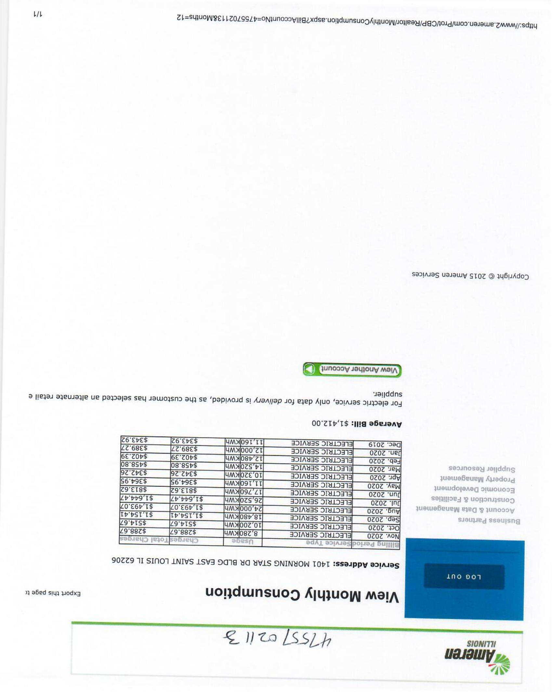

The image is a photo of a document. It contains a table with monthly consumption data for electricity service. The table includes the following columns:

- **Date**: Ranges from "Feb 2019" to "Jan 2020".
- **Type**: "ELECTRIC SERVICE" for all entries.
- **kWh**: Monthly consumption values ranging from "1,160 kWh" to "1,260 kWh".
- **Days**: Number of days in the billing period, ranging from "28" to "34".
- **kWh/Day**: Values ranging from "34.12" to "41.29".

Additional text includes:

- "Average Bill: $141.20"
- "Service Address: 1401 MORNING STAR DR, BLDG EAST, SAINT LOUIS, IL 62026"
- "View Another Account" button.
- "LOG OUT" button.
- "View Monthly Consumption" title.
- "Copyright © 2015 Ameren Services"
- URL: "https://www2.ameren.com/Portal/Residential/MonthlyConsumption.aspx?BillAccountNo=475570213840months=12"

There is handwritten text at the bottom: "47557 02113".

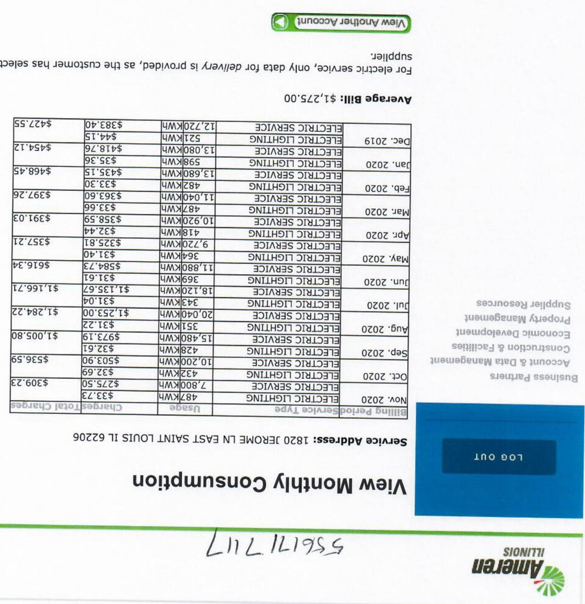

The image is a photo of a printed document showing a table with monthly electricity consumption data. The table includes the following columns:

- **Date**: Ranges from Nov. 2019 to Dec. 2020.
- **Service**: Alternates between "ELECTRIC SERVICE" and "ELECTRIC LIGHTING."
- **kWh**: Displays kilowatt-hour usage, e.g., 47 kWh, 12,706 kWh.
- **Amount**: Shows monetary amounts, e.g., $4.79, $4,427.55.

Additional text includes:

- "Average Bill: $1,275.00"
- "Service Address: 1820 JEROME LN EAST SAINT LOUIS IL 62206"
- "View Another Account"
- "View Monthly Consumption"
- "Ameren ILLINOIS" logo at the bottom right.

The table is oriented upside down in the image.

The image is a photo of a document. It contains a table with monthly data and other textual elements. 

Embedded text includes:

- "View Monthly Consumption"
- "Log Out"
- "Ameren Illinois"
- "Service Address: 1401 MORNING STAR DR EAST SAINT LOUIS IL 62206"
- "Average Bill: $114.00"
- "Supplier:"
- "For electric service, only data for delivery is provided, as the customer has selected an alternate retail electric supplier."
- "Copyright © 2015 Ameren Services"
- "Export this page"
- "1/1"

The table includes columns labeled:
- "Date"
- "Usage"
- "Type"
- "Amount"

Sample data from the table:
- "Dec 2020", "888 kWh", "ELECTRIC LIGHTING", "$88.10"
- "Nov 2020", "819 kWh", "ELECTRIC LIGHTING", "$78.03"
- "Oct 2020", "574 kWh", "ELECTRIC LIGHTING", "$54.61"
- "Sep 2020", "574 kWh", "ELECTRIC LIGHTING", "$54.61"
- "Aug 2020", "637 kWh", "ELECTRIC LIGHTING", "$63.31"
- "Jul 2020", "739 kWh", "ELECTRIC LIGHTING", "$73.39"
- "Jun 2020", "739 kWh", "ELECTRIC LIGHTING", "$73.39"
- "May 2020", "574 kWh", "ELECTRIC LIGHTING", "$54.61"
- "Apr 2020", "574 kWh", "ELECTRIC LIGHTING", "$54.61"
- "Mar 2020", "574 kWh", "ELECTRIC LIGHTING", "$54.61"
- "Feb 2020", "574 kWh", "ELECTRIC LIGHTING", "$54.61"
- "Jan 2020", "956 kWh", "ELECTRIC LIGHTING", "$95.60"

The document is oriented upside down.

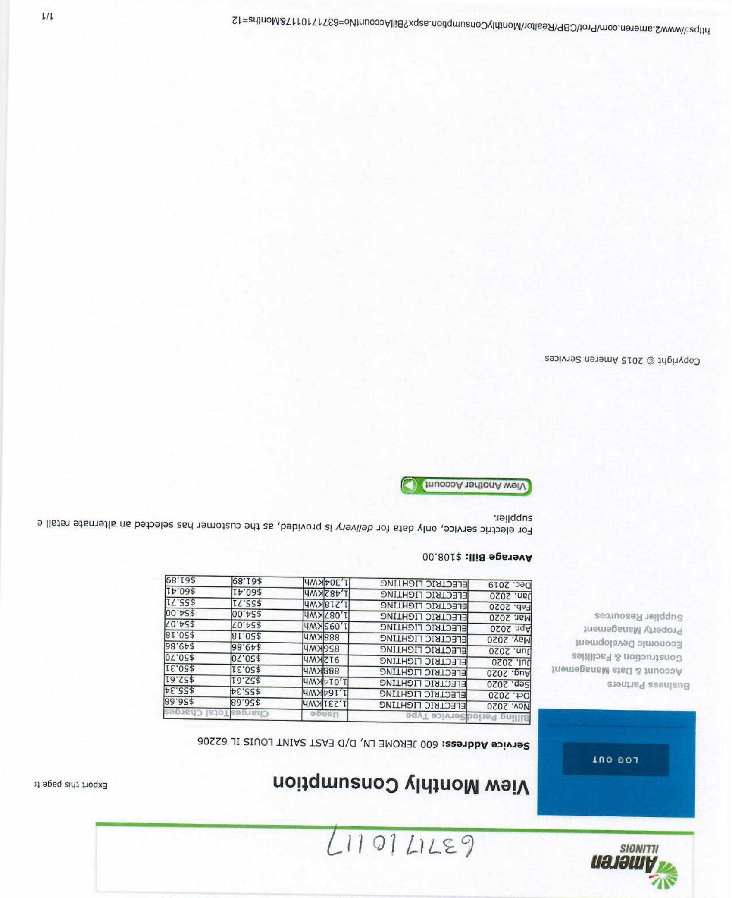

The image is a photo of a document, likely a utility bill or consumption report. It contains a table with monthly data on electricity consumption. The table includes the following columns:

- **Month**
- **kWh**
- **Cost**

The data entries are:

- **Apr 2020**: 1,304 kWh, $61.89
- **Mar 2020**: 1,300 kWh, $61.41
- **Feb 2020**: 1,278 kWh, $60.00
- **Jan 2020**: 1,287 kWh, $60.71
- **Dec 2019**: 1,295 kWh, $61.21
- **Nov 2019**: 1,297 kWh, $61.32
- **Oct 2019**: 1,298 kWh, $61.38
- **Sep 2019**: 1,299 kWh, $61.44
- **Aug 2019**: 1,300 kWh, $61.50
- **Jul 2019**: 1,301 kWh, $61.56
- **Jun 2019**: 1,302 kWh, $61.62
- **May 2019**: 1,303 kWh, $61.68

Additional text includes:

- "View Monthly Consumption"
- "Average Bill: $60.00"
- "Service Address: 500 Rome Dr, D/D East Saint Louis IL 62206"
- "View Another Account"
- "Log Out"
- "Copyright © 2015 Ameren Services"
- "https://www2.ameren.com/YourAccount/Bill/Consumption.aspx?BillAccountNo=637110117&Months=12"

The document is oriented upside down in the image.

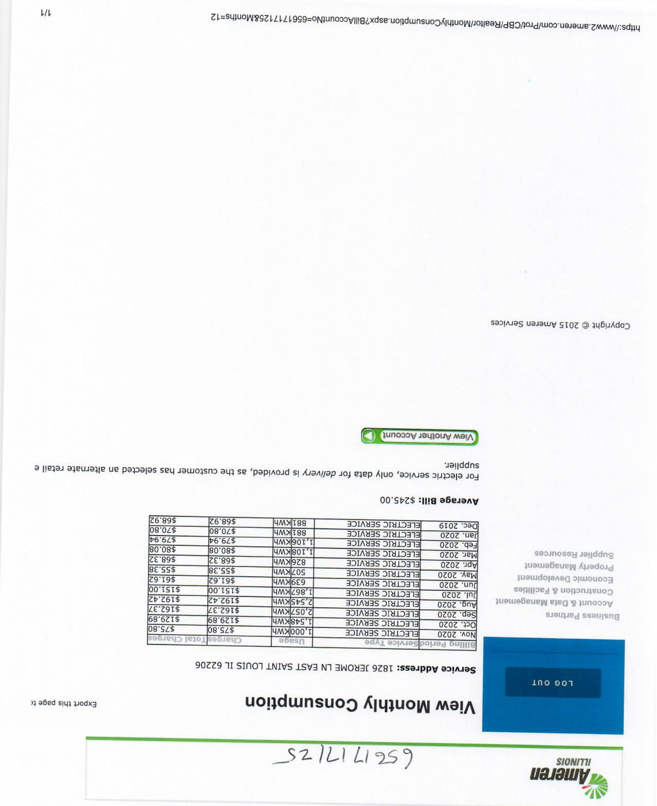

The image is a photo of a document, likely a utility bill or consumption statement. It includes a table with monthly data and some textual elements. Key details are:

- **Embedded Text:**
  - "View Monthly Consumption"
  - "Average Bill: $245.00"
  - "Service Address: 1236 BROOME LN EAST SAINT LOUIS IL 62206"
  - "Copyright © 2015 Ameren Services"
  - "Log Out"
  - "652171125"

- **Table Content:**
  - Columns: "Month", "Service", "kWh", "Bill"
  - Data includes entries like:
    - "Feb 2020", "ELECTRIC SERVICE", "568.92 kWh", "$81.97"
    - "Jan 2020", "ELECTRIC SERVICE", "568.92 kWh", "$81.97"
    - "Dec 2019", "ELECTRIC SERVICE", "568.92 kWh", "$81.97"
    - And so on for other months.

- **Spatial Relationships:**
  - The table is centrally located.
  - "View Monthly Consumption" is at the bottom.
  - "Log Out" button is on the right side.

- **Styling:**
  - The document has a logo of "Ameren Illinois" at the bottom right.
  - The table is organized with alternating row colors for readability.

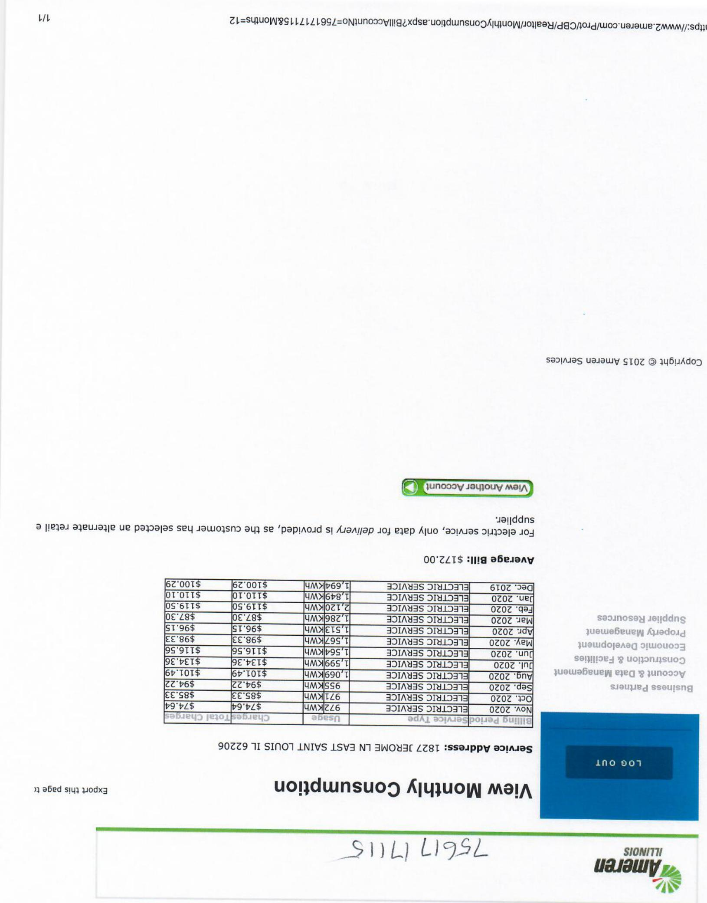

The image is a photo of a printed document, likely a utility bill or consumption statement. It includes a table with monthly data and some additional text. The document is oriented upside down in the image.

Embedded text includes:

- "View Monthly Consumption"
- "Average Bill: $122.00"
- "Service Address: 1827 Jerome Ln East Saint Louis IL 62206"
- "Log Out"
- "View Another Account"
- "Ameren Illinois"
- "Copyright © 2015 Ameren Services"

The table contains columns for "Month", "Usage", and "Electric Service", with entries such as:

- "Feb 2020", "964 kWh", "$100.29"
- "Jan 2020", "1004 kWh", "$110.10"
- "Dec 2019", "1119 kWh", "$119.50"
- "Nov 2019", "928 kWh", "$98.40"
- "Oct 2019", "892 kWh", "$94.23"
- "Sep 2019", "856 kWh", "$89.56"
- "Aug 2019", "964 kWh", "$100.29"
- "Jul 2019", "1004 kWh", "$110.10"
- "Jun 2019", "1119 kWh", "$119.50"
- "May 2019", "928 kWh", "$98.40"
- "Apr 2019", "892 kWh", "$94.23"
- "Mar 2019", "856 kWh", "$89.56"

There is also a handwritten note at the bottom: "75617 1115".

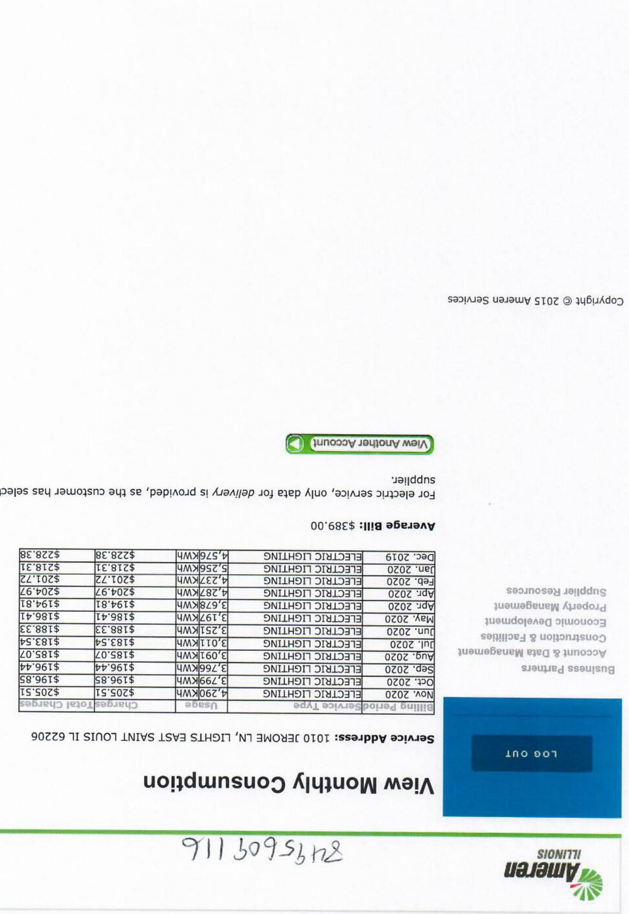

The image is a photo of a printed document showing a table with monthly consumption data. The text is upside down. Key elements include:

- **Title**: "View Monthly Consumption"
- **Table Columns**: 
  - "Usage"
  - "Billing Period/Service Type"
  - "Charges/Local Charges"
- **Data Entries**: 
  - "Dec. 2019" to "Nov. 2020" with corresponding usage in kWh and charges in dollars.
- **Additional Text**: 
  - "Average Bill: $389.00"
  - "Service Address: 1010 Jerome Ln, Lights East Saint Louis IL 62206"
  - "Copyright © 2015 Ameren Services"
  - "View Another Account" button
  - "Log Out" button

The table is positioned centrally, with the title above it. The copyright notice is at the bottom right.

# View Another Account 

For electric service, only data for delivery is provided, as the customer has selected an alternate retail e
surape Bill: \$67.957.00

| CD' 05 \$ | CD' 05 \$ | NHV\$ 60 | 3DIA\$ 35 CRICITALIST |  |  |  |  |
| :--: | :--: | :--: | :--: | :--: | :--: | :--: | :--: |
| 60' 15 \$ | 60' 15 \$ | NHV\$ 60 | 3DIA\$ 35 CRICITALIST |  |  |  |  |
| 21' 05 \$ | 21' 05 \$ | NHV\$ 60 | 3DIA\$ 35 CRICITALIST |  |  |  |  |
| 51' 05 \$ | 51' 05 \$ | NHV\$ 60 | 3DIA\$ 35 CRICITALIST |  |  |  |  |
| Mac 2020 | ELECTRIC SEV |  |  |  |  |  |  |
| Mac 2020 | ELECTRIC SEV |  |  |  |  |  |  |
| 23' 15 \$ | 23' 15 \$ | NHV\$ 100 | 3DIA\$ 35 CRICITALIST |  |  |  |  |
| 111 | 111 | 300 | 3DIA\$ 35 CRICITALIST |  |  |  |  |
| 122 | 122 | 300 | 3DIA\$ 35 CRICITALIST |  |  |  |  |
| 60' 25 \$ | 60' 25 \$ | NHV\$ 200 | 3DIA\$ 35 CRICITALIST |  |  |  |  |
| 69' 95 \$ | 69' 95 \$ | NHV\$ 120 | 3DIA\$ 35 CRICITALIST |  |  |  |  |
| 82' 95 \$ | 82' 95 \$ | NHV\$ 90 | 3DIA\$ 35 CRICITALIST |  |  |  |  |
| 56' 2020 | ELECTRIC SEV |  |  |  |  |  |  |
| 102 | 102 | 300 | 3DIA\$ 35 CRICITALIST |  |  |  |  |
| 111 | 111 | 300 | 3DIA\$ 35 CRICITALIST |  |  |  |  |
| 69' 95 \$ | 69' 95 \$ | NHV\$ 120 | 3DIA\$ 35 CRICITALIST |  |  |  |  |
| 82' 95 \$ | 82' 95 \$ | NHV\$ 90 | 3DIA\$ 35 CRICITALIST |  |  |  |  |
| 56' 2020 | ELECTRIC SEV |  |  |  |  |  |  |
| 102 | 102 | 300 | 3DIA\$ 35 CRICITALIST |  |  |  |  |
| 111 | 111 | 300 | 3DIA\$ 35 CRICITALIST |  |  |  |  |
| 69' 95 \$ | 69' 95 \$ | NHV\$ 120 | 3DIA\$ 35 CRICITALIST |  |  |  |  |
| 82' 95 \$ | 82' 95 \$ | NHV\$ 90 | 3DIA\$ 35 CRICITALIST |  |  |  |  |
| 56' 2020 | ELECTRIC SEV |  |  |  |  |  |  |
| 102 | 102 | 300 | 3DIA\$ 35 CRICITALIST |  |  |  |  |
| 111 | 111 | 300 | 3DIA\$ 35 CRICITALIST |  |  |  |  |
| 69' 95 \$ | 69' 95 \$ | NHV\$ 120 | 3DIA\$ 35 CRICITALIST |  |  |  |  |
| 82' 95 \$ | 82' 95 \$ | NHV\$ 90 | 3DIA\$ 35 CRICITALIST |  |  |  |  |
| 56' 2020 | ELECTRIC SEV |  |  |  |  |  |  |
| 102 | 102 | 300 | 3DIA\$ 35 CRICITALIST |  |  |  |  |
| 111 | 111 | 300 | 3DIA\$ 35 CRICITALIST |  |  |  |  |
| 69' 95 \$ | 69' 95 \$ | NHV\$ 120 | 3DIA\$ 35 CRICITALIST |  |  |  |  |
| 82' 95 \$ | 82' 95 \$ | NHV\$ 90 | 3DIA\$ 35 CRICITALIST |  |  |  |  |
| 56' 2020 | ELECTRIC SEV |  |  |  |  |  |  |
| 102 | 102 | 300 | 3DIA\$ 35 CRICITALIST |  |  |  |  |
| 111 | 111 | 300 | 3DIA\$ 35 CRICITALIST |  |  |  |  |
| 69' 95 \$ | 69' 95 \$ | NHV\$ 120 | 3DIA\$ 35 CRICITALIST |  |  |  |  |
| 82' 95 \$ | 82' 95 \$ | NHV\$ 90 | 3DIA\$ 35 CRICITALIST |  |  |  |  |
| 56' 2020 | ELECTRIC SEV |  |  |  |  |  |  |
| 102 | 102 | 300 | 3DIA\$ 35 CRICITALIST |  |  |  |  |
| 111 | 111 | 300 | 3DIA\$ 35 CRICITALIST |  |  |  |  |
| 69' 95 \$ | 69' 95 \$ | NHV\$ 120 | 3DIA\$ 35 CRICITALIST |  |  |  |  |
| 82' 95 \$ | 82' 95 \$ | NHV\$ 90 | 3DIA\$ 35 CRICITALIST |  |  |  |  |
| 56' 2020 | ELECTRIC SEV |  |  |  |  |  |  |
| 102 | 102 | 300 | 3DIA\$ 35 CRICITALIST |  |  |  |  |
| 111 | 111 | 300 | 3DIA\$ 35 CRICITALIST |  |  |  |  |
| 69' 95 \$ | 69' 95 \$ | NHV\$ 120 | 3DIA\$ 35 CRICITALIST |  |  |  |  |
| 82' 95 \$ | 82' 95 \$ | NHV\$ 90 | 3DIA\$ 35 CRICITALIST |  |  |  |  |
| 56' 2020 | ELECTRIC SEV |  |  |  |  |  |  |
| 102 | 102 | 300 | 3DIA\$ 35 CRICITALIST |  |  |  |  |
| 111 | 111 | 300 | 3DIA\$ 35 CRICITALIST |  |  |  |  |
| 69' 95 \$ | 69' 95 \$ | NHV\$ 120 | 3DIA\$ 35 CRICITALIST |  |  |  |  |
| 82' 95 \$ | 82' 95 \$ | NHV\$ 90 | 3DIA\$ 35 CRICITALIST |  |  |  |  |
| 56' 2020 | ELECTRIC SEV |  |  |  |  |  |  |
| 102 | 102 | 300 | 3DIA\$ 35 CRICITALIST |  |  |  |  |
| 111 | 111 | 300 | 3DIA\$ 35 CRICITALIST |  |  |  |  |
| 69' 95 \$ | 69' 95 \$ | NHV\$ 120 | 3DIA\$ 35 CRICITALIST |  |  |  |  |
| 82' 95 \$ | 82' 95 \$ | NHV\$ 90 | 3DIA\$ 35 CRICITALIST |  |  |  |  |
| 56' 2020 | ELECTRIC SEV |  |  |  |  |  |  |
| 102 | 102 | 300 | 3DIA\$ 35 CRICITALIST |  |  |  |  |
| 111 | 111 | 300 | 3DIA\$ 35 CRICITALIST |  |  |  |  |
| 69' 95 \$ | 69' 95 \$ | NHV\$ 120 | 3DIA\$ 35 CRICITALIST |  |  |  |  |
| 82' 95 \$ | 82' 95 \$ | NHV\$ 90 | 3DIA\$ 35 CRICITALIST |  |  |  |  |
| 56' 2020 | ELECTRIC SEV |  |  |  |  |  |  |
| 102 | 102 | 300 | 3DIA\$ 35 CRICITALIST |  |  |  |  |
| 111 | 111 | 300 | 3DIA\$ 35 CRICITALIST |  |  |  |  |
| 69' 95 \$ | 69' 95 \$ | NHV\$ 120 | 3DIA\$ 35 CRICITALIST |  |  |  |  |
| 82' 95 \$ | 82' 95 \$ | NHV\$ 90 | 3DIA\$ 35 CRICITALIST |  |  |  |  |
| 56' 2020 | ELECTRIC SEV |  |  |  |  |  |  |
| 102 | 102 | 300 | 3DIA\$ 35 CRICITALIST |  |  |  |  |
| 111 | 111 | 300 | 3DIA\$ 35 CRICITALIST |  |  |  |  |
| 69' 95 \$ | 69' 95 \$ | NHV\$ 120 | 3DIA\$ 35 CRICITALIST |  |  |  |  |
| 82' 95 \$ | 82' 95 \$ | NHV\$ 90 | 3DIA\$ 35 CRICITALIST |  |  |  |  |
| 56' 2020 | ELECTRIC SEV |  |  |  |  |  |  |
| 102 | 102 | 300 | 3DIA\$ 35 CRICITALIST |  |  |  |  |
| 111 | 111 | 300 | 3DIA\$ 35 CRICITALIST |  |  |  |  |
| 69' 95 \$ | 69' 95 \$ | NHV\$ 120 | 3DIA\$ 35 CRICITALIST |  |  |  |  |
| 82' 95 \$ | 82' 95 \$ | NHV\$ 90 | 3DIA\$ 35 CRICITALIST |  |  |  |  |
| 56' 2020 | ELECTRIC SEV |  |  |  |  |  |  |
| 102 | 102 | 300 | 3DIA\$ 35 CRICITALIST |  |  |  |  |
| 111 | 111 | 300 | 3DIA\$ 35 CRICITALIST |  |  |  |  |
| 69' 95 \$ | 69' 95 \$ | NHV\$ 120 | 3DIA\$ 35 CRICITALIST |  |  |  |  |
| 82' 95 \$ | 82' 95 \$ | NHV\$ 90 | 3DIA\$ 35 CRICITALIST |  |  |  |  |
| 56' 2020 | ELECTRIC SEV |  |  |  |  |  |  |
| 102 | 102 | 300 | 3DIA\$ 35 CRICITALIST |  |  |  |  |
| 111 | 111 | 300 | 3DIA\$ 35 CRICITALIST |  |  |  |  |
| 69' 95 \$ | 69' 95 \$ | NHV\$ 120 | 3DIA\$ 35 CRICITALIST |  |  |  |  |
| 82' 95 \$ | 82' 95 \$ | NHV\$ 90 | 3DIA\$ 35 CRICITALIST |  |  |  |  |
| 56' 2020 | ELECTRIC SEV |  |  |  |  |  |  |
| 102 | 102 | 300 | 3DIA\$ 35 CRICITALIST |  |  |  |  |
| 111 | 111 | 300 | 3DIA\$ 35 CRICITALIST |  |  |  |  |
| 69' 95 \$ | 69' 95 \$ | NHV\$ 120 | 3DIA\$ 35 CRICITALIST |  |  |  |  |
| 82' 95 \$ | 82' 95 \$ | NHV\$ 90 | 3DIA\$ 35 CRICITALIST |  |  |  |  |
| 56' 2020 | ELECTRIC SEV |  |  |  |  |  |  |
| 102 | 102 | 300 | 3DIA\$ 35 CRICITALIST |  |  |  |  |
| 111 | 111 | 300 | 3DIA\$ 35 CRICITALIST |  |  |  |  |
| 69' 95 \$ | 69' 95 \$ | NHV\$ 120 | 3DIA\$ 35 CRICITALIST |  |  |  |  |
| 82' 95 \$ | 82' 95 \$ | NHV\$ 90 | 3DIA\$ 35 CRICITALIST |  |  |  |  |
| 56' 2020 | ELECTRIC SEV |  |  |  |  |  |  |
| 102 | 102 | 300 | 3DIA\$ 35 CRICITALIST |  |  |  |  |
| 111 | 111 | 300 | 3DIA\$ 35 CRICITALIST |  |  |  |  |
| 69' 95 \$ | 69' 95 \$ | NHV\$ 120 | 3DIA\$ 35 CRICITALIST |  |  |  |  |
| 82' 95 \$ | 82' 95 \$ | NHV\$ 90 | 3DIA\$ 35 CRICITALIST |  |  |  |  |
| 56' 2020 | ELECTRIC SEV |  |  |  |  |  |  |
| 102 | 102 | 300 | 3DIA\$ 35 CRICITALIST |  |  |  |  |
| 111 | 111 | 300 | 3DIA\$ 35 CRICITALIST |  |  |  |  |
| 69' 95 \$ | 69' 95 \$ | NHV\$ 120 | 3DIA\$ 35 CRICITALIST |  |  |  |  |
| 82' 95 \$ | 82' 95 \$ | NHV\$ 90 | 3DIA\$ 35 CRICITALIST |  |  |  |  |
| 56' 2020 | ELECTRIC SEV |  |  |  |  |  |  |
| 102 | 102 | 300 | 3DIA\$ 35 CRICITALIST |  |  |  |  |
| 111 | 111 | 300 | 3DIA\$ 35 CRICITALIST |  |  |  |  |
| 69' 95 \$ | 69' 95 \$ | NHV\$ 120 | 3DIA\$ 35 CRICITALIST |  |  |  |  |
| 82' 95 \$ | 82' 95 \$ | NHV\$ 90 | 3DIA\$ 35 CRICITALIST |  |  |  |  |
| 56' 2020 | ELECTRIC SEV |  |  |  |  |  |  |
| 102 | 102 | 300 | 3DIA\$ 35 CRICITALIST |  |  |  |  |
| 111 | 111 | 300 | 3DIA\$ 35 CRICITALIST |  |  |  |  |
| 69' 95 \$ | 69' 95 \$ | NHV\$ 120 | 3DIA\$ 35 CRICITALIST |  |  |  |  |
| 82' 95 \$ | 82' 95 \$ | NHV\$ 90 | 3DIA\$ 35 CRICITALIST |  |  |  |  |
| 56' 2020 | ELECTRIC SEV |  |  |  |  |  |  |
| 102 | 102 | 300 | 3DIA\$ 35 CRICITALIST |  |  |  |  |
| 111 | 111 | 300 | 3DIA\$ 35 CRICITALIST |  |  |  |  |
| 69' 95 \$ | 69' 95 \$ | NHV\$ 120 | 3DIA\$ 35 CRICITALIST |  |  |  |  |
| 82' 95 \$ | 82' 95 \$ | NHV\$ 90 | 3DIA\$ 35 CRICITALIST |  |  |  |  |
| 56' 2020 | ELECTRIC SEV |  |  |  |  |  |  |
| 102 | 102 | 300 | 3DIA\$ 35 CRICITALIST |  |  |  |  |
| 111 | 111 | 300 | 3DIA\$ 35 CRICITALIST |  |  |  |  |
| 69' 95 \$ | 69' 95 \$ | NHV\$ 120 | 3DIA\$ 35 CRICITALIST |  |  |  |  |
| 82' 95 \$ | 82' 95 \$ | NHV\$ 90 | 3DIA\$ 35 CRICITALIST |  |  |  |  |
| 56' 2020 | ELECTRIC SEV |  |  |  |  |  |  |
| 102 | 102 | 300 | 3DIA\$ 35 CRICITALIST |  |  |  |  |
| 111 | 111 | 300 | 3DIA\$ 35 CRICITALIST |  |  |  |  |
| 69' 95 \$ | 69' 95 \$ | NHV\$ 120 | 3DIA\$ 35 CRICITALIST |  |  |  |  |
| 82' 95 \$ | 82' 95 \$ | NHV\$ 90 | 3DIA\$ 35 CRICITALIST |  |  |  |  |
| 56' 2020 | ELECTRIC SEV |  |  |  |  |  |  |
| 102 | 102 | 300 | 3DIA\$ 35 CRICITALIST |  |  |  |  |
| 111 | 111 | 300 | 3DIA\$ 35 CRICITALIST |  |  |  |  |
| 69' 95 \$ | 69' 95 \$ | NHV\$ 120 | 3DIA\$ 35 CRICITALIST |  |  |  |  |
| 82' 95 \$ | 82' 95 \$ | NHV\$ 90 | 3DIA\$ 35 CRICITALIST |  |  |  |  |
| 56' 2020 | ELECTRIC SEV |  |  |  |  |  |  |
| 102 | 102 | 300 | 3DIA\$ 35 CRICITALIST |  |  |  |  |
| 111 | 111 | 300 | 3DIA\$ 35 CRICITALIST |  |  |  |  |
| 69' 95 \$ | 69' 95 \$ | NHV\$ 120 | 3DIA\$ 35 CRICITALIST |  |  |  |  |
| 82' 95 \$ | 82' 95 \$ | NHV\$ 90 | 3DIA\$ 35 CRICITALIST |  |  |  |  |
| 56' 2020 | ELECTRIC SEV |  |  |  |  |  |  |
| 102 | 102 | 300 | 3DIA\$ 35 CRICITALIST |  |  |  |  |
| 111 | 111 | 300 | 3DIA\$ 35 CRICITALIST |  |  |  |  |
| 69' 95 \$ | 69' 95 \$ | NHV\$ 120 | 3DIA\$ 35 CRICITALIST |  |  |  |  |
| 82' 95 \$ | 82' 95 \$ | NHV\$ 90 | 3DIA\$ 35 CRICITALIST |  |  |  |  |
| 56' 2020 | ELECTRIC SEV |  |  |  |  |  |  |
| 102 | 102 | 300 | 3DIA\$ 35 CRICITALIST |  |  |  |  |
| 111 | 111 | 300 | 3DIA\$ 35 CRICITALIST |  |  |  |  |
| 69' 95 \$ | 69' 95 \$ | NHV\$ 120 | 3DIA\$ 35 CRICITALIST |  |  |  |  |
| 82' 95 \$ | 82' 95 \$ | NHV\$ 90 | 3DIA\$ 35 CRICITALIST |  |  |  |  |
| 56' 2020 | ELECTRIC SEV |  |  |  |  |  |  |
| 102 | 102 | 300 | 3DIA\$ 35 CRICITALIST |  |  |  |  |
| 111 | 111 | 300 | 3DIA\$ 35 CRICITALIST |  |  |  |  |
| 69' 95 \$ | 69' 95 \$ | NHV\$ 120 | 3DIA\$ 35 CRICITALIST |  |  |  |  |
| 82' 95 \$ | 82' 95 \$ | NHV\$ 90 | 3DIA\$ 35 CRICITALIST |  |  |  |  |
| 56' 2020 | ELECTRIC SEV |  |  |  |  |  |  |
| 102 | 102 | 300 | 3DIA\$ 35 CRICITALIST |  |  |  |  |
| 111 | 111 | 300 | 3DIA\$ 35 CRICITALIST |  |  |  |  |
| 69' 95 \$ | 69' 95 \$ | NHV\$ 120 | 3DIA\$ 35 CRICITALIST |  |  |  |  |
| 82' 95 \$ | 82' 95 \$ | NHV\$ 90 | 3DIA\$ 35 CRICITALIST |  |  |  |  |
| 56' 2020 | ELECTRIC SEV |  |  |  |  |  |  |
| 102 | 102 | 300 | 3DIA\$ 35 CRICITALIST |  |  |  |  |
| 111 | 111 | 300 | 3DIA\$ 35 CRICITALIST |  |  |  |  |
| 69' 95 \$ | 69' 95 \$ | NHV\$ 120 | 3DIA\$ 35 CRICITALIST |  |  |  |  |
| 82' 95 \$ | 82' 95 \$ | NHV\$ 90 | 3DIA\$ 35 CRICITALIST |  |  |  |  |
| 56' 2020 | ELECTRIC SEV |  |  |  |  |  |  |
| 102 | 102 | 300 | 3DIA\$ 35 CRICITALIST |  |  |  |  |
| 111 | 111 | 300 | 3DIA\$ 35 CRICITALIST |  |  |  |  |
| 69' 95 \$ | 69' 95 \$ | NHV\$ 120 | 3DIA\$ 35 CRICITALIST |  |  |  |  |
| 82' 95 \$ | 82' 95 \$ | NHV\$ 90 | 3DIA\$ 35 CRICITALIST |  |  |  |  |
| 56' 2020 | ELECTRIC SEV |  |  |  |  |  |  |
| 102 | 102 | 300 | 3DIA\$ 35 CRICITALIST |  |  |  |  |
| 111 | 111 | 300 | 3DIA\$ 35 CRICITALIST |  |  |  |  |
| 69' 95 \$ | 69' 95 \$ | NHV\$ 120 | 3DIA\$ 35 CRICITALIST |  |  |  |  |
| 82' 95 \$ | 82' 95 \$ | NHV\$ 90 | 3DIA\$ 35 CRICITALIST |  |  |  |  |
| 56' 2020 | ELECTRIC SEV |  |  |  |  |  |  |
| 102 | 102 | 300 | 3DIA\$ 35 CRICITALIST |  |  |  |  |
| 69' 95 \$ | 69' 95 \$ | NHV\$ 120 | 3DIA\$ 35 CRICITALIST |  |  |  |  |
| 82' 95 \$ | 69' 95 \$ | NHV\$ 90 | 3DIA\$ 35 CRICITALIST |  |  |  |  |
| 56' 2020 | ELECTRIC SEV |  |  |  |  |  |  |
| 102 | 102 | 300 | 3DIA\$ 35 CRICITALIST |  |  |  |  |
| 69' 95 \$ | 69' 95 \$ | NHV\$ 120 | 3DIA\$ 35 CRICITALIST |  |  |  |  |
| 82' 95 \$ | 69' 95 \$ | NHV\$ 90 | 3DIA\$ 35 CRICITALIST |  |  |  |  |
| 56' 2020 | ELECTRIC SEV |  |  |  |  |  |  |
| 102 | 102 | 300 | 3DIA\$ 35 CRICITALIST |  |  |  |  |
| 69' 95 \$ | 69' 95 \$ | NHV\$ 120 | 3DIA\$ 35 CRICITALIST |  |  |  |  |
| 82' 95 \$ | 69' 95 \$ | NHV\$ 90 | 3DIA\$ 35 CRICITALIST |  |  |  |  |
| 56' 2020 | ELECTRIC SEV |  |  |  |  |  |  |
| 102 | 102 | 300 | 3DIA\$ 35 CRICITALIST |  |  |  |  |
| 69' 95 \$ | 69' 95 \$ | NHV\$ 120 | 3DIA\$ 35 CRICITALIST |  |  |  |  |
| 82' 95 \$ | 69' 95 \$ | NHV\$ 90 | 3DIA\$ 35 CRICITALIST |  |  |  |  |
| 56' 2020 | ELECTRIC SEV |  |  |  |  |  |  |
| 102 | 102 | 300 | 3DIA\$ 35 CRICITALIST |  |  |  |  |
| 69' 95 \$ | 69' 95 \$ | NHV\$ 120 | 3DIA\$ 35 CRICITALIST |  |  |  |  |
| 82' 95 \$ | 69' 95 \$ | NHV\$ 90 | 3DIA\$ 35 CRICITALIST |  |  |  |  |
| 56' 2020 | ELECTRIC SEV |  |  |  |  |  |  |
| 102 | 102 | 300 | 3DIA\$ 35 CRICITALIST |  |  |  |  |
| 69' 95 \$ | 69' 95 \$ | NHV\$ 120 | 3DIA\$ 35 CRICITALIST |  |  |  |  |
| 82' 95 \$ | 69' 95 \$ | NHV\$ 90 | 3DIA\$ 35 CRICITALIST |  |  |  |  |
| 56' 2020 | ELECTRIC SEV |  |  |  |  |  |  |
| 102 | 102 | 300 | 3DIA\$ 35 CRICITALIST |  |  |  |  |
| 69' 95 \$ | 69' 95 \$ | NHV\$ 90 | 3DIA\$ 35 CRICITALIST |  |  |  |  |
| 82' 95 \$ | 69' 95 \$ | NHV\$ 90 | 3DIA\$ 35 CRICITALIST |  |  |  |  |
| 56' 2020 | ELECTRIC SEV |  |  |  |  |  |  |
| 102 | 102 | 300 | 3DIA\$ 35 CRICITALIST |  |  |  |  |
| 69' 95 \$ | 69' 95 \$ | NHV\$ 90 | 3DIA\$ 35 CRICITALIST |  |  |  |  |
| 82' 95 \$ | 69' 95 \$ | NHV\$ 90 | 3DIA\$ 35 CRICITALIST |  |  |  |  |
| 56' 2020 | ELECTRIC SEV |  |  |  |  |  |  |  |
| 102 | 102 | 300 | 3DIA\$ 35 CRICITALIST |  |  |  |  |
| 69' 95 \$ | 69' 95 \$ | NHV\$ 90 | 3DIA\$ 35 CRICITALIST |  |  |  |  |
| 56' 2020 | ELECTRIC SEV |  |  |  |  |  |  |  |
| 102 | 102 | 300 | 3DIA\$ 35 CRICITALIST |  |  |  |  |
| 69' 95 \$ | 69' 95 \$ | NHV\$ 90 | 3DIA\$ 35 CRICITALIST |  |  |  |  |
| 56' 2020 | ELECTRIC SEV |  |  |  |  |  |  |  |
| 102 | 102 | 300 | 3DIA\$ 35 CRICITALIST |  |  |  |  |  |
| 69' 95 \$ | 69' 95 \$ | NHV\$ 90 | 3DIA\$ 35 CRICITALIST |  |  |  |  |
| 56' 2020 | ELECTRIC SEV |  |  |  |  |  |  |  |
| 102 | 102 | 300 | 3DIA\$ 35 CRICITALIST |  |  |  |  |  |
| 69' 95 \$ | 69' 95 \$ | NHV\$ 90 | 3DIA\$ 35 CRICITALIST |  |  |  |  |
| 56' 2020 | ELECTRIC SEV |  |  |  |  |  |  |  |
| 102 | 102 | 300 | 3DIA\$ 35 CRICITALIST |  |  |  |  |  |
| 69' 95 \$ | 69' 95 \$ | NHV\$ 90 | 3DIA\$ 35 CRICITALIST |  |  |  |  |
| 56' 2020 | ELECTRIC SEV |  |  |  |  |  |  |  |
| 102 | 102 | 300 | 3DIA\$ 35 CRICITALIST |  |  |  |  |
| 69' 95 \$ | 69' 95 \$ | 3DIA\$ 35 CRICITALIST |  |  |  |  |  |
| 56' 2020 | ELECTRIC SEV |  |  |  |  |  |  |  |
| 102 | 102 | 300 | 3DIA\$ 35 CRICITALIST |  |  |  |  |
| 69' 95 \$ | 69' 95 \$ | 3DIA\$ 35 CRICITALIST |  |  |  |  |  |
| 56' 2020 | ELECTRIC SEV |  |  |  |  |  |  |  |
| 102 | 102 | 300 | 3DIA\$ 35 CRICITALIST |  |  |  |  |
| 69' 95 \$ | 69' 95 \$ | 3DIA\$ 35 CRICITALIST |  |  |  |  |  |
| 56' 2020 | ELECTRIC SEV |  |  |  |  |  |  |  |
| 102 | 102 | 300 | 3DIA\$ 35 CRICITALIST |  |  |  |  |
| 69' 95 \$ | 69' 95 \$ | 3DIA\$ 35 CRICITALIST |  |  |  |  |  |
| 56' 2020 | ELECTRIC SEV |  |  |  |  |  |  |
| 102 | 102 | 300 | 3DIA\$ 35 CRICITALIST |  |  |  |  |
| 69' 95 \$ | 69' 95 \$ | 3DIA\$ 35 CRICITALIST |  |  |  |  |
| 56' 2020 | ELECTRIC SEV |  |  |  |  |  |  |
| 102 | 102 | 300 | 3DIA\$ 35 CRICITALIST |  |  |  |  |
| 69' 95 \$ | 69' 95 \$ | 3DIA\$ 35 CRICITALIST |  |  |  |  |
| 56' 2020 | ELECTRIC SEV |  |  |  |  |  |  |
| 102 | 102 | 300 | 3DIA\$ 35 CRICITALIST |  |  |  |
| 69' 95 \$ | 69' 95 \$ | 3DIA\$ 35 CRICITALIST |  |  |  |  |
| 56' 2020 | ELECTRIC SEV |  |  |  |  |  |
| 102 | 102 | 300 | 3DIA\$ 35 CRICITALIST |  |  |  |  |
| 69' 95 \$ | 69' 95 \$ | 3DIA\$ 35 CRICITALIST |  |  |  |  |
| 56' 2020 | ELECTRIC SEV |  |  |  |  |  |  |
| 102 | 102 | 300 | 3DIA\$ 35 CRICITALIST |  |  |  |
| 69' 95 \$ | 69' 95 \$ | 3DIA\$ 35 CRICITALIST |  |  |  |  |
| 56' 2020 | ELECTRIC SEV |  |  |  |  |  |  |
| 102 | 102 | 300 | 3DIA\$ 35 CRICITALIST |  |  |  |
| 69' 95 \$ | 69' 95 \$ | 3DIA\$ 35 CRICITALIST |  |  |  |  |
| 56' 2020 | ELECTRIC SEV |  |  |  |  |  |  |
| 102 | 102 | 300 | 3DIA\$ 35 CRICITALIST |  |  |  |
| 69' 95 \$ | 69' 95 \$ | 3DIA\$ 35 CRICITALIST |  |  |  |  |
| 56' 2020 | ELECTRIC SEV |  |  |  |  |  |
| 102 | 102 | 300 | 3DIA\$ 35 CRICITALIST |  |  |  |
| 69' 95 \$ | 69' 95 \$ | 3DIA\$ 35 CRICITALIST |  |  |  |
| 56' 2020 | ELECTRIC SEV |  |  |  |  |  |
| 102 | 102 | 300 | 3DIA\$ 35 CRICITALIST |  |  |  |
| 69' 95 \$ | 69' 95 \$ | 3DIA\$ 35 CRICITALIST |  |  |  |
| 56' 95 \$ | 69' 95 \$ | 3DIA\$ 35 CRICITALIST |  |  |  |
| 56' 95 \$ | 69' 95 \$ | 3DIA\$ 35 CRICITALIST |  |  |  |
| 56' 95 \$ | 69' 95 \$ | 3DIA\$ 35 CRICITALIST |  |  |  |
| 102 | 102 | 300 | 3DIA\$ 35 CRICITALIST |  |  |  |
| 69' 95 \$ | 69' 95 \$ | 3DIA\$ 35 CRICITALIST |  |  |  |
| 56' 95 \$ | 69' 95 \$ | 3DIA\$ 35 CRICITALIST |  |  |  |
| 102 | 102 | 300 | 3DIA\$ 35 CRICITALIST |  |  |  |
| 69' 95 \$ | 69' 95 \$ | 3DIA\$ 35 CRICITALIST |  |  |  |
| 56' 95 \$ | 69' 95 \$ | 3DIA\$ 35 CRICITALIST |  |  |  |
| 102 | 102 | 300 | 3DIA\$ 35 CRICITALIST |  |  |  |
| 69' 95 \$ | 69' 95 \$ | 3DIA\$ 35 CRICITALIST |  |  |  |
| 56' 95 \$ | 69' 95 \$ | 3DIA\$ 35 CRICITALIST |  |  |  |
| 56' 95 \$ | 69' 95 \$ | 3DIA\$ 35 CRICITALIST |  |  |  |
| 56' 95 \$ | 69' 95 \$ | 3DIA\$ 35 CRICITALIST |  |  |  |
| 56' 95 \$ | 69' 95 \$ | 3DIA\$ 35 CRICITALIST |  |  |  |
| 56' 95 \$ | 69' 95 \$ | 3DIA\$ 35 CRICITALIST |  |  |  |
| 56' 95 \$ | 69' 95 \$ | 3DIA\$ 35 CRICITALIST |  |  |  |
| 56' 95 \$ | 69' 95 \$ | 3DIA\$ 35 CRICITALIST |  |  |  |
| 56' 95 \$ | 69' 95 \$ | 3DIA\$ 35 CRICITALIST |  |  |  |
| 56' 95 \$ | 69' 95 \$ | 3DIA\$ 35 CRICITALIST |  |  |  |
| 56' 95 \$ | 69' 95 \$ | 3DIA\$ 35 CRICITALIST |  |  |  |
| 56' 95 \$ | 69' 95 \$ | 3DIA\$ 35 CRICITALIST |  |  |  |
| 56' 95 \$ | 69' 95 \$ | 3DIA\$ 35 CRICITALIST |  |  |  |
| 56' 95 \$ | 69' 95 \$ | 3DIA\$ 35 CRICITALIST |  |  |  |
| 56' 95 \$ | 69' 95 \$ | 3DIA\$ 35 CRICITALIST |  |  |  |
| 56' 95 \$ | 69' 95 \$ | 3DIA\$ 35 CRICITALIST |  |  |  |
| 56' 95 \$ | 69' 95 \$ | 3DIA\$ 35 CRICITALIST |  |  |  |
| 56' 95 \$ | 69' 95 \$ | 3DIA\$ 35 CRICITALIST |  |  | 56' 95 \$ | 3DIA\$ 35 CRICITALIST |  |  |
| 56' 95 \$ | 69' 95 \$ | 3DIA\$ 35 CRICITALIST |  |  | 56' 95 \$ | 3DIA\$ 35 CRICITALIST |  |  |
| 56' 95 \$ | 69' 95 \$ | 3DIA\$ 35 CRICITALIST |  |  | 56' 95 \$ | 3DIA\$ 35 CRICITALIST |  |  |
| 56' 95 \$ | 69' 95 \$ | 3DIA\$ 35 CRICITALIST |  |  | 56' 95 \$ | 3DIA\$ 35 CRICITALIST |  |  |
| 56' 95 \$ | 69' 95 \$ | 3DIA\$ 35 CRICITALIST |  |  | 56' 95 \$ | 3DIA\$ 35 CRICITALIST |  |  |
| 56' 95 \$ | 69' 95 \$ | 3DIA\$ 35 CRICITALIST |  |  | 56' 95 \$ | 3DIA\$ 35 CRICITALIST |  |  |
| 56' 95 \$ | 69' 95 \$ | 3DIA\$ 35 CRICITALIST |  |  | 56' 95 \$ | 3DIA\$ 35 CRICITALIST |  |  |
| 56' 95 \$ | 3DIA\$ 35 CRICITALIST |  |  | 56' 95 \$ | 3DIA\$ 35 CRICITALIST |  |  | 56' 95 \$ |
| 56' 95 \$ | 3DIA\$ 35 \$ | 3DIA\$ 35 \$ | 3DIA\$ 35 CRICITALIST |  |  | 56' 95 \$ | 3DIA\$ 35 \$ | 3DIA\$ 35 \$ | 356' 95 \$ | 3DIA\$ 35 \$ | 3DIA\$ 35 \$ | 356' 95 \$ | 3DIA\$ 35 \$ | 356' 95 \$ | 356' 95 \$ | 3DIA\$ 35 \$ | 356' 95 \$ | 356' 95 \$ | 356' 95 \$ | 356' 95 \$ | 356' 95 \$ | 356' 95 \$ | 356' 95 \$ | 357' 95 \$ | 36' 95 \$ | 358' 95 \$ | 36' 95 \$ | 36' 95 \$ | 36' 95 \$ | 36' 95 \$ | 36' 95 \$ | 36' 95 \$ | 36' 95 \$ | 37' 95 \$ | 37' 95 \$ | 37' 95 \$ | 37' 95 \$ | 38' 95 \$ | 38' 95 \$ | 38' 95 \$ | 396' 95 \$ | 396' 95 \$ | 397' 95 \$ | 398' 95 \$ | 398' 95 \$ | 399' 95 \$ | 3995 \$ | 3996' 95 \$ | 3995 \$ | 3996' 95 \$ | 3997' 95 \$ | 39995 \$ | 3996' 95 \$ | 3997' 95 \$ | 39995 \$ | 39995 \$ | 39995 \$ | 39995 \$ | 39995 \$ | 39995 \$ | 39995 \$ | 39995 \$ | 39995 \$ | 39995 \$ | 3

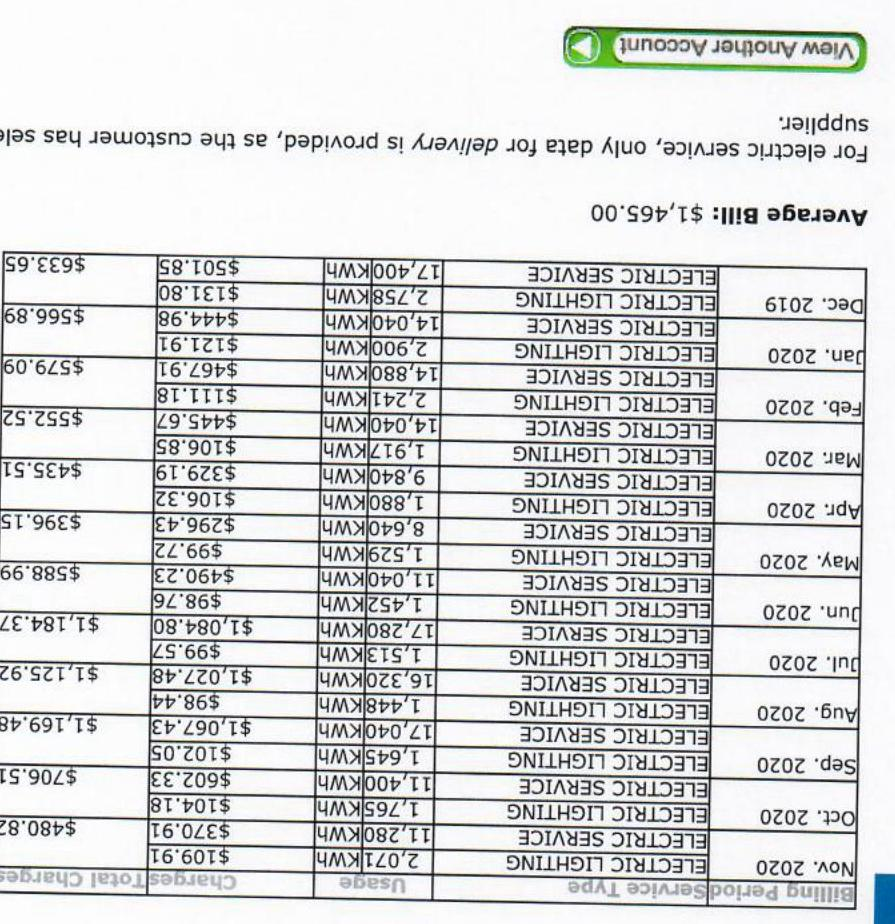

The image is a photo of a table displaying billing information. The table includes the following columns:

1. **Billing Period/Service Type**
   - Nov. 2020: ELECTRIC LIGHTING
   - Oct. 2020: ELECTRIC SERVICE
   - Sep. 2020: ELECTRIC LIGHTING
   - Aug. 2020: ELECTRIC SERVICE
   - Jul. 2020: ELECTRIC LIGHTING
   - Jun. 2020: ELECTRIC SERVICE
   - May. 2020: ELECTRIC LIGHTING
   - Apr. 2020: ELECTRIC SERVICE
   - Mar. 2020: ELECTRIC LIGHTING
   - Feb. 2020: ELECTRIC SERVICE
   - Jan. 2020: ELECTRIC LIGHTING
   - Dec. 2019: ELECTRIC SERVICE

2. **Usage (kWh)**
   - 2,021 kWh
   - 3,701 kWh
   - 1,756 kWh
   - 1,465 kWh
   - 1,448 kWh
   - 1,560 kWh
   - 1,729 kWh
   - 1,529 kWh
   - 1,880 kWh
   - 1,911 kWh
   - 2,900 kWh
   - 2,758 kWh
   - 1,740 kWh

3. **Charges ($)**
   - $109.45
   - $270.91
   - $87.18
   - $67.45
   - $67.21
   - $69.48
   - $92.84
   - $90.09
   - $106.34
   - $98.05
   - $144.44
   - $156.85
   - $101.85

4. **Total Charges ($)**
   - $408.27
   - $706.45
   - $169.71
   - $125.75
   - $148.72
   - $225.62
   - $188.71
   - $396.31
   - $432.51
   - $329.96
   - $552.60
   - $579.60
   - $566.89

Additional text includes:
- "Average Bill: $146.00"
- "View Another Account"
- "For electric service, only data for delivery is provided, as the customer has selected a third-party supplier."

Service Address Address: 605 SANS 1838091 NINS 055-2801011

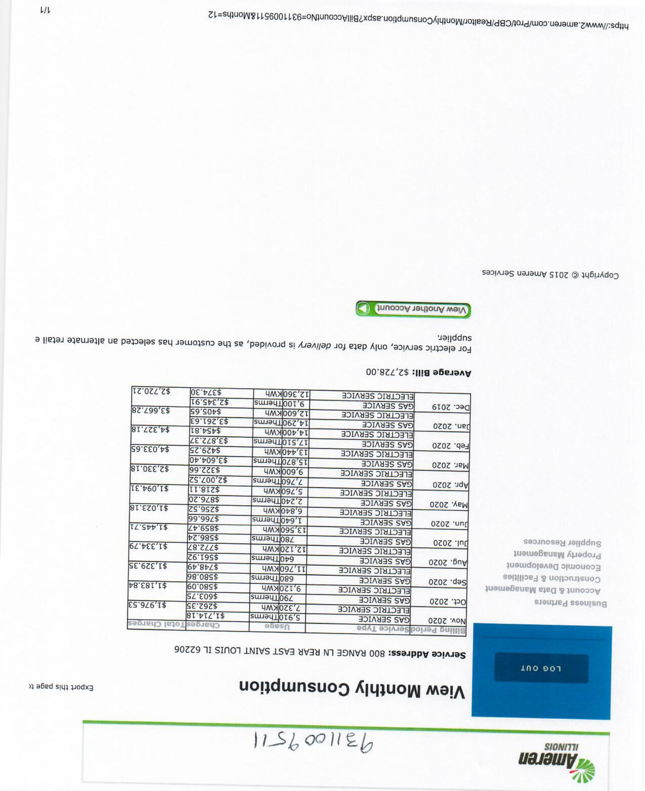

The image is a photo of a document, which appears to be a utility bill or consumption statement from Ameren Illinois. The document includes a table listing monthly service details. The table has the following columns: 

- **Month**
- **Service**
- **Usage (in therms or kWh)**
- **Cost**

The table entries include:

- **Dec 2019**: Electric Service, 12,360 kWh, $2,720.21
- **Jan 2020**: Gas Service, 9,100 therms, $2,349.91
- **Feb 2020**: Electric Service, 12,360 kWh, $3,234.30
- **Mar 2020**: Gas Service, 9,100 therms, $3,405.65
- **Apr 2020**: Electric Service, 12,360 kWh, $3,567.28
- **May 2020**: Gas Service, 9,100 therms, $3,234.91
- **Jun 2020**: Electric Service, 12,360 kWh, $3,678.37
- **Jul 2020**: Gas Service, 9,100 therms, $3,034.93
- **Aug 2020**: Electric Service, 12,360 kWh, $3,034.93
- **Sep 2020**: Gas Service, 9,100 therms, $3,034.93
- **Oct 2020**: Electric Service, 12,360 kWh, $3,034.93
- **Nov 2020**: Gas Service, 9,100 therms, $3,034.93

Additional text includes:

- "Average Bill: $2,780.00"
- "View Another Account"
- "Log Out"
- "Service Address: 800 N RANGELINE AREA EAST SAINT LOUIS IL 62206"
- "View Monthly Consumption"
- "Account Number: 931109511"

The document is oriented upside down in the image.

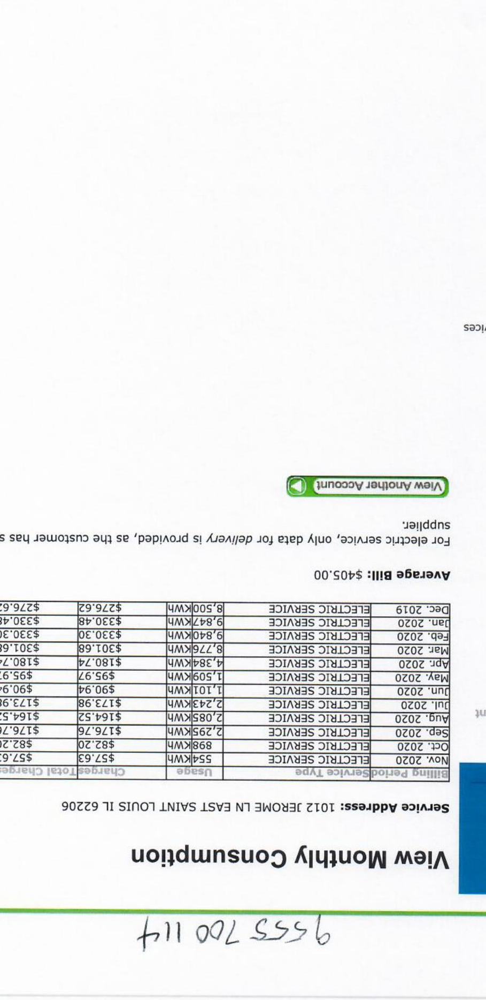

The image is a photo of a document showing a table with monthly electricity consumption data. The table includes the following columns:

- Date
- kWh
- ELECTRIC SERVICE
- Cost in dollars

The data spans from December 2019 to November 2020. Each row lists the month and year, the amount of electricity consumed in kWh, the service type "ELECTRIC SERVICE," and the cost in dollars.

Additional text includes:
- "Average Bill: $45.00"
- "Service Address: 1012 JEROME LN EAST SAINT LOUIS IL 62206"
- "View Monthly Consumption"
- "View Another Account"

There is a handwritten note at the bottom: "9555 700 111". The document is oriented upside down.

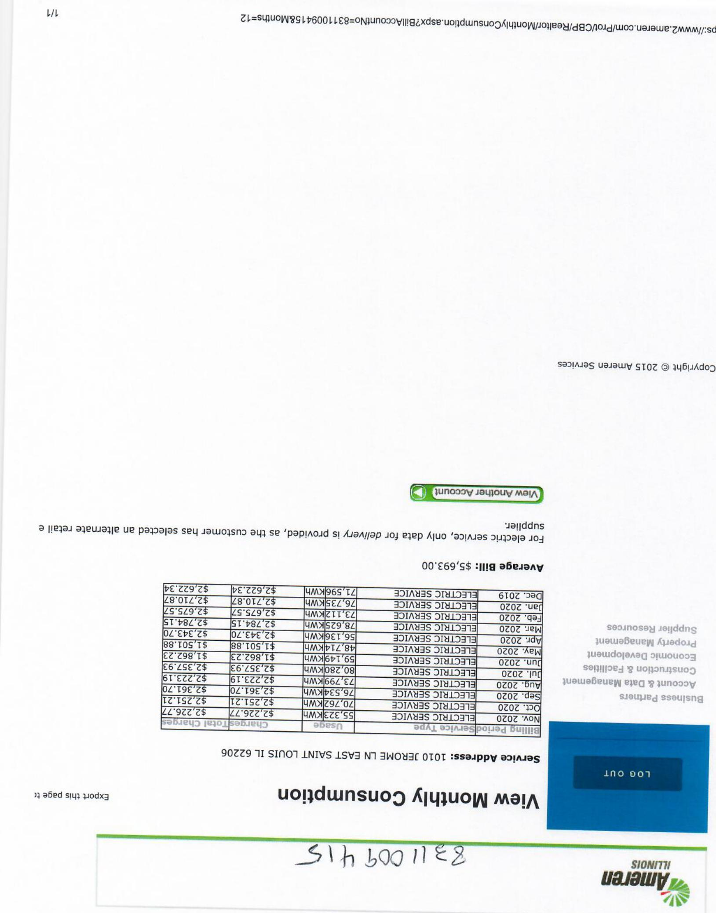

The image is a photo of a document showing a table of monthly consumption data. The document is from Ameren Illinois and is titled "View Monthly Consumption." It includes a table with the following columns: "Usage," "Days," "Average Temp," "Electric Service," and "Gas Service." The data spans from January 2020 to December 2020, with specific values for each month. The average bill is noted as "$5,693.00." There is a "Log Out" button on the right side, and the document is marked as "Copyright © 2015 Ameren Services." The document is oriented upside down.

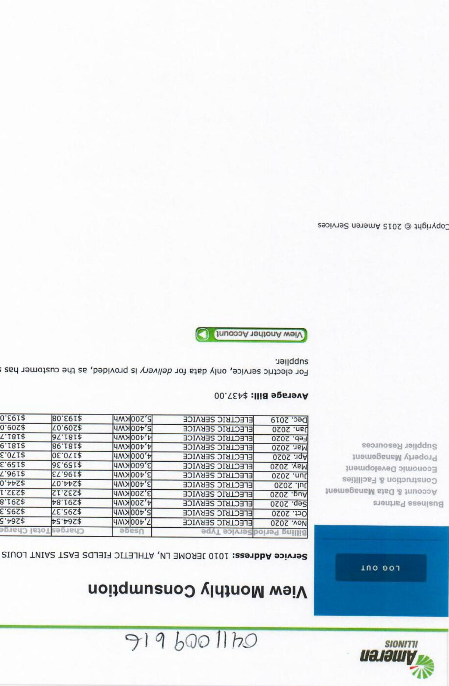

The image is a photo of a printed document showing a table and some text. The table lists monthly electric service consumption data, including dates, usage in kWh, and costs in dollars. The table entries are:

- Dec. 2019: 200 kWh, $19.08
- Jan. 2020: 400 kWh, $39.16
- Feb. 2020: 400 kWh, $39.16
- Mar. 2020: 400 kWh, $39.16
- Apr. 2020: 400 kWh, $39.16
- May. 2020: 400 kWh, $39.16
- Jun. 2020: 400 kWh, $39.16
- Jul. 2020: 400 kWh, $39.16
- Aug. 2020: 400 kWh, $39.16
- Sep. 2020: 400 kWh, $39.16
- Oct. 2020: 400 kWh, $39.16
- Nov. 2020: 400 kWh, $39.16

The average bill is listed as $43.00. There is a button labeled "View Another Account" and a "LOG OUT" button. The document is from Ameren Illinois. The text "View Monthly Consumption" is at the bottom, and the service address is "1010 Jerome Ln, Athletic Fields East Saint Louis." The document is copyrighted by Ameren Services in 2015.

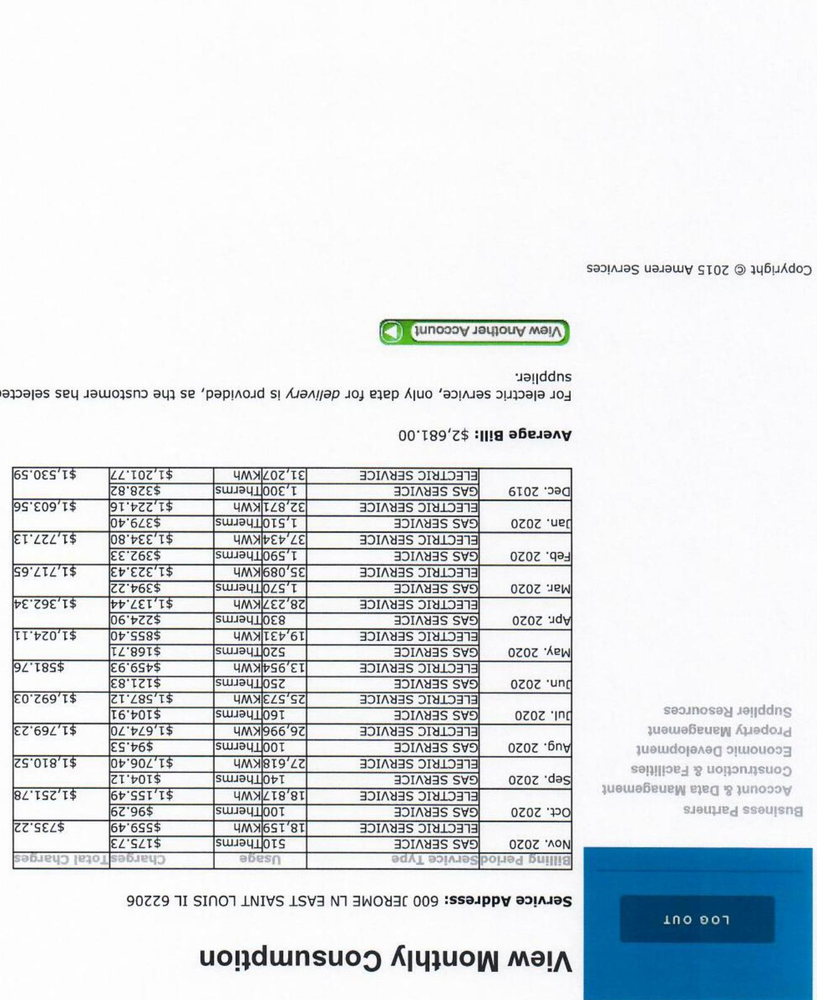

The image is a photo of a document that includes a table displaying monthly consumption data for gas and electric services. The table is oriented sideways and contains the following information:

- **Columns**: 
  - Date (e.g., "Dec. 2019", "Jan. 2020")
  - Service Type (e.g., "GAS SERVICE", "ELECTRIC SERVICE")
  - Consumption (e.g., "1.30 Therms", "31.20 kWh")
  - Cost (e.g., "$3.28", "$1.20")

- **Sample Data**:
  - Dec. 2019: GAS SERVICE, 1.30 Therms, $3.28
  - Jan. 2020: ELECTRIC SERVICE, 31.20 kWh, $1.20
  - Nov. 2020: GAS SERVICE, 1.30 Therms, $3.28

- **Additional Text**:
  - "Average Bill: $2,681.00"
  - "Service Address: 600 ROMEINE LN EAST SAINT LOUIS IL 62206"
  - "View Another Account"
  - "Log Out"
  - "View Monthly Consumption"
  - Copyright © 2015 Ameren Services

The table lists monthly consumption and costs for both gas and electric services over a period, providing a detailed breakdown of usage and expenses.

The image is a photo of a document, likely a utility bill or consumption report. It contains a table with monthly consumption data and billing information. The table includes columns for "Date," "Service," "kWh/CCF/Therms," and "Amount." The data spans from "Feb 2020" to "Feb 2021," listing various services such as "ELECTRIC SERVICE" and "GAS SERVICE" with corresponding consumption and cost figures.

Embedded text includes:
- "View Another Account"
- "Log Out"
- "View Monthly Consumption"
- "Average Bill: $1,037.00"
- "Service Address: 1014 REROME LN EAST SAINT LOUIS IL 62206"
- "Supplier: Ameren Illinois"
- "Copyright © 2015 Ameren Services"
- "Export this page to"

The document is oriented upside down, and the Ameren Illinois logo is visible at the bottom right corner.

The image is a photo of a document. It contains a table with monthly data, a logo, and some text. The table lists months from January 2019 to March 2020, with corresponding values in kWh and dollar amounts. The text includes:

- "View Another Account"
- "Average Bill: $2,769.00"
- "Service Address: 1200 FORBES LN EAST SAINT LOUIS IL 62206"
- "Copyright © 2015 Ameren Services"
- "Log Out"
- "View Monthly Consumption"
- "Supplier:"

The table headers include "Month," "kWh," and "Amount." The document appears to be related to utility billing or consumption. The logo at the bottom right reads "Ameren Illinois." The document is oriented upside down.

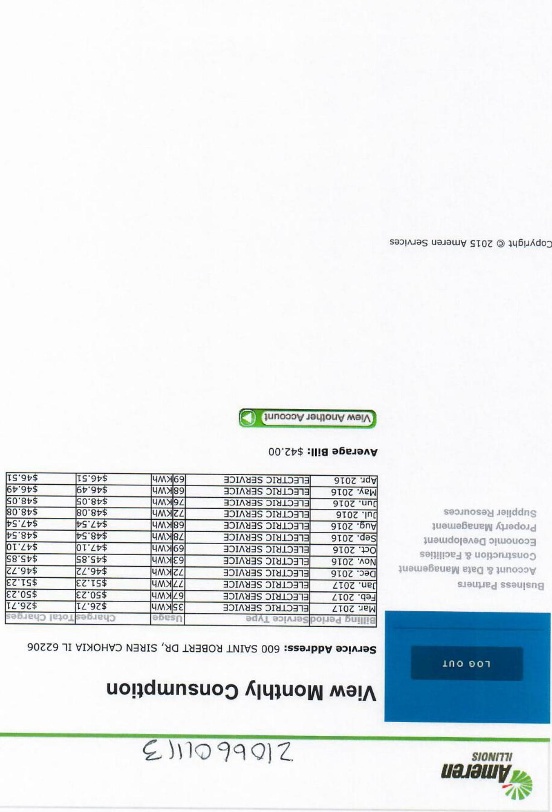

The image is a photo of a printed document, possibly a utility bill or consumption report. It includes a table with monthly data, showing electricity service usage in kWh and corresponding costs in dollars. The months listed range from January 2016 to January 2017. Each entry includes:

- Jan. 2017: 72 kWh, $51.73
- Dec. 2016: 66 kWh, $50.23
- Nov. 2016: 66 kWh, $50.23
- Oct. 2016: 66 kWh, $50.23
- Sep. 2016: 66 kWh, $50.23
- Aug. 2016: 68 kWh, $47.94
- Jul. 2016: 68 kWh, $47.94
- Jun. 2016: 68 kWh, $47.94
- May 2016: 68 kWh, $47.94
- Apr. 2016: 69 kWh, $46.51
- Mar. 2016: 69 kWh, $46.51
- Feb. 2016: 69 kWh, $46.51
- Jan. 2016: 69 kWh, $46.51

The document also includes the text "View Monthly Consumption," "Average Bill: $42.00," and "View Another Account." There is a logo for "Ameren Illinois" and a copyright notice for 2015 Ameren Services. The document is oriented upside down.

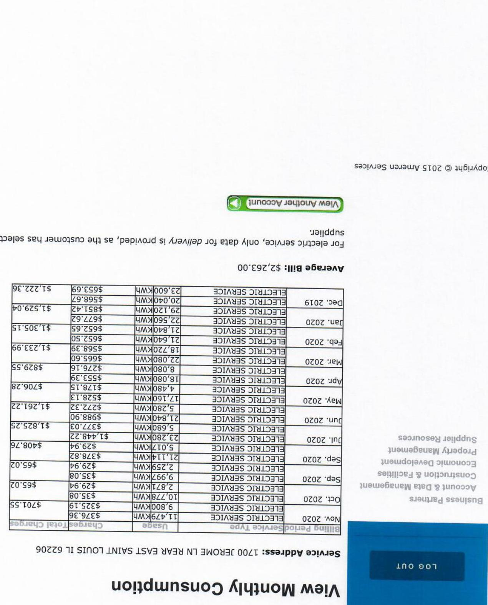

The image is a photo of a printed table showing monthly electric service consumption and billing information. The table is rotated 90 degrees counterclockwise. 

Embedded text includes:

- "View Another Account"
- "Average Bill: $2,263.00"
- "Copyright © 2015 Ameren Services"
- "For electric service, only data for delivery is provided, as the customer has selected a different supplier."
- "Service Address: 1700 Jerome Ln Rear East Saint Louis IL 62206"
- "View Monthly Consumption"
- "Log Out"

The table columns include:
- Date (e.g., Dec. 2019, Jan. 2020)
- Billing Period
- Type (e.g., ELECTRIC SERVICE)
- Usage (e.g., 23,600 kWh)
- Charges (e.g., $1,222.36)

The table lists monthly data from December 2019 to November 2020, showing usage in kWh and corresponding charges in dollars.

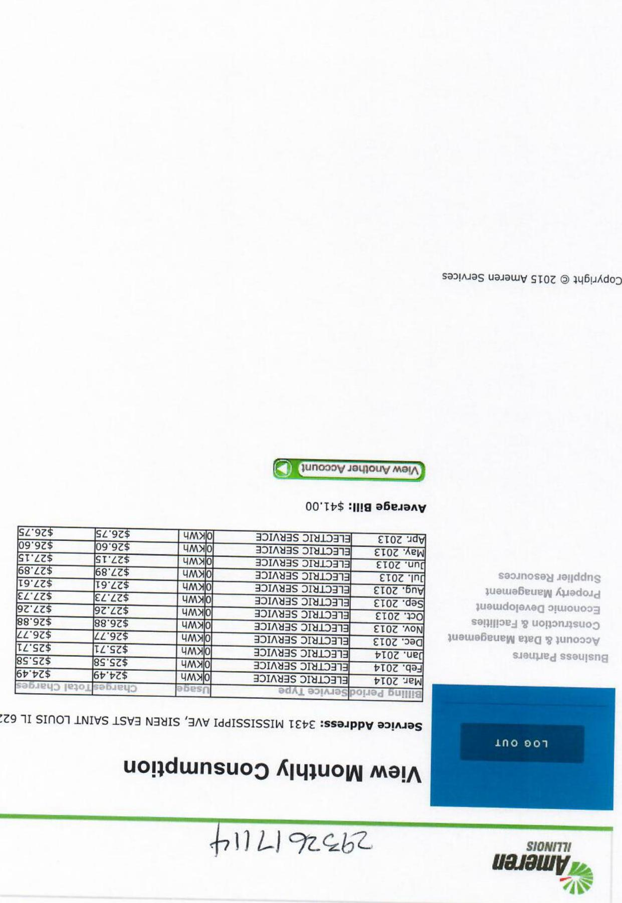

The image is a photo of a printed document, which appears to be a utility bill or statement from Ameren Illinois. It includes a table showing monthly consumption details for electric service, with the following columns: 

- Date (Month and Year)
- Service Type (ELECTRIC SERVICE)
- Consumption (kWh)
- Cost (in dollars)

The table lists data from December 2012 to April 2013, with the following entries:

- Apr. 2013: 526 kWh, $41.75
- Mar. 2013: 526 kWh, $41.75
- Feb. 2013: 526 kWh, $41.75
- Jan. 2013: 527 kWh, $41.82
- Dec. 2012: 527 kWh, $41.82

The document also includes the text "Average Bill: $41.00" and "View Another Account" in a green button. The service address is listed as "3431 MISSISSIPPI AVE, SAINT LOUIS IL 62201." There is a copyright notice at the bottom: "Copyright © 2015 Ameren Services." The document is oriented upside down.

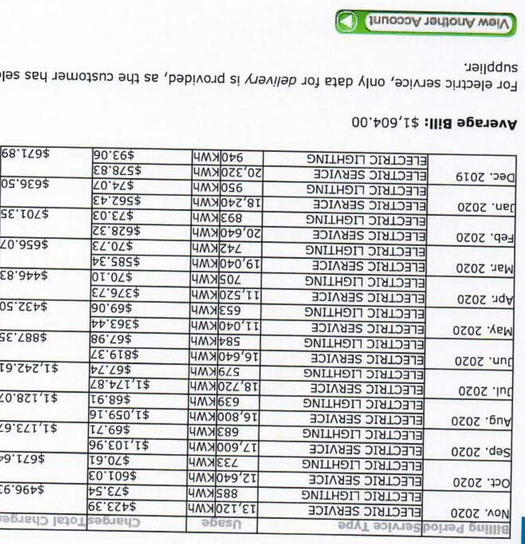

The image is a photo of a printed table showing billing information for electric service. The table is oriented upside down and includes the following columns: 

- Billing Period
- Service Type
- Usage (kWh)
- Charges

The data spans from June 2019 to December 2020, with entries for each month. The service type alternates between "ELECTRIC SERVICE" and "ELECTRIC LIGHTING." Usage is measured in kWh, and charges are in dollars. The average bill is noted as $1,604.00. There is a button labeled "View Another Account" at the top right.

