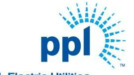
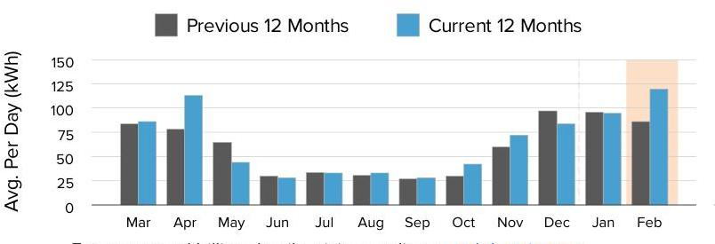
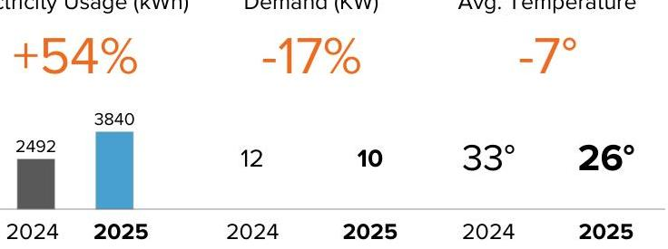
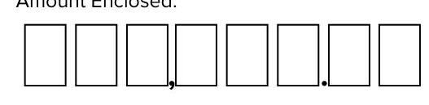
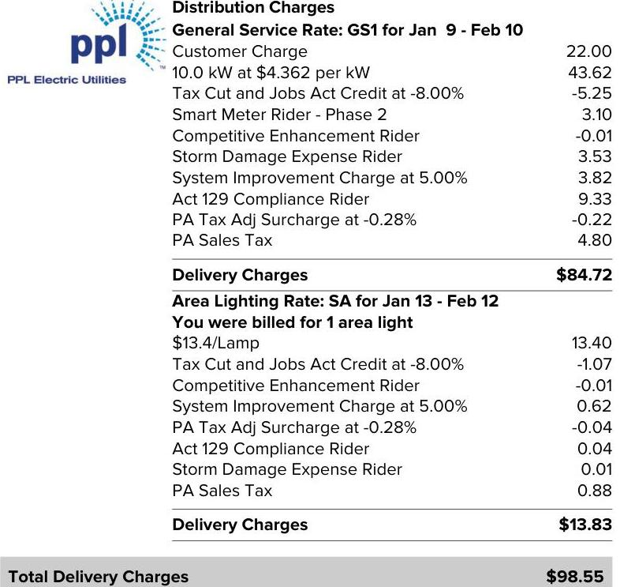
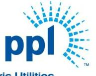

The image is a logo for "ppl Electric Utilities." It features the text "ppl" in lowercase letters, with "Electric Utilities" written below it. To the right of the text, there is a stylized design resembling a sunburst or radiating lines, suggesting energy or electricity. The design is composed of small blue rectangles arranged in a semi-circular pattern.

PPL Electric Utilities

## Service to:

PMRC
RR 1,
HENRYVILLE, PA 18332

## We deliver.

1-800-342-5775
For hours of operation and to pay/manage your account, visit pplelectric.com.

## $1-800-342-5775$

For hours of operation and to pay/manage your account, visit pplelectric.com.

## $2 / 28 / 25$

## $534.67$

Billing Details on Back
Because of Other Charges, your amount due does not equal your Usage Charges.

## Supply

Constellation NewEnergy (7)
$1-844-636-3749$

## $* 421.00$

## Effective Date

$1 / 11 / 21$

## PPL Electric Utilities Price to Compare

\$0.10446 Use this price when comparing supplier offers.

## SHOP FOR ELECTRICITY

Visit PAPowerSwitch.com or www.oca.state.pa.us If you're shopping, know your contract expiration date. Account Number: 46071-31040
The price to compare is updated June $1^{\text {st }}$ and December $1^{\text {st }}$.
Rate: GS1. View schedule at pplelectric.com/rates

## $* 98.55$

## Delivery

PPL Electric Utilities
Consider making a monthly pledge to Operation HELP to assist those in need to heat their homes.

## WANT TO SAVE?

Use sensors to keep the lights on when needed and off when they're not.

Usage Summary

The image is a bar chart showing a **yearly usage breakdown (monthly-based)** of electricity consumption. 

- **Chart Type**: Bar Chart
- **Y-Axis Title**: Avg. Per Day (kWh)
- **X-Axis Labels**: Mar, Apr, May, Jun, Jul, Aug, Sep, Oct, Nov, Dec, Jan, Feb
- **Legend Entries**: 
  - Previous 12 Months (Gray)
  - Current 12 Months (Blue)
- **Data Points**:
  - March: Previous ~90 kWh, Current ~90 kWh
  - April: Previous ~100 kWh, Current ~125 kWh
  - May: Previous ~75 kWh, Current ~150 kWh
  - June: Previous ~50 kWh, Current ~50 kWh
  - July: Previous ~50 kWh, Current ~50 kWh
  - August: Previous ~50 kWh, Current ~50 kWh
  - September: Previous ~50 kWh, Current ~50 kWh
  - October: Previous ~75 kWh, Current ~75 kWh
  - November: Previous ~100 kWh, Current ~75 kWh
  - December: Previous ~100 kWh, Current ~100 kWh
  - January: Previous ~100 kWh, Current ~100 kWh
  - February: Previous ~125 kWh, Current ~150 kWh

- **Styling**: The bars for the current 12 months are highlighted in blue, while the previous 12 months are in gray. The February bar for the current year is emphasized with a light orange background.

For usage and billing details, visit us online at pplelectric.com
Questions/concerns? Contact us by 2/28/25
1-800-342-5775
Visit pplelectric.com for hours of operation.
Correspondence to:
PPL Customer Service
827 Hausman Road
Allentown, PA 18104-9392

## February

The image is a chart displaying comparative data for electricity usage, demand, and average temperature between two years, 2024 and 2025.

- **Chart Type**: Comparative Data Chart
- **Data Points**:
  - **Electricity Usage (kWh)**:
    - 2024: 2492 kWh
    - 2025: 3840 kWh
    - Change: +54%
  - **Demand (kW)**:
    - 2024: 12 kW
    - 2025: 10 kW
    - Change: -17%
  - **Avg. Temperature (°)**:
    - 2024: 33°
    - 2025: 26°
    - Change: -7°
- **Styling**: 
  - The percentage changes are highlighted in orange.
  - The 2025 electricity usage bar is in blue, while the 2024 bar is in gray.

Sign back of bill stub to enroll in auto bill pay.

| Account Number | Due Date | Amount Due |
| :--: | :--: | :--: |
| 46071-31040 | $2 / 28 / 25$ | \$534.67 |

Amount Enclosed:

The image is a section of a form for indicating the "Amount Enclosed" on a payment stub. It features a series of empty boxes where numbers can be filled in, followed by a comma and a period, suggesting a format for entering a monetary amount.

Please make check payable to: PPL ELECTRIC UTILITIES
PO BOX 419054
ST LOUIS, MO 63141-9054

| kWh Delivered (to Customer) |  |  |  |
| :--: | :--: | :--: | :--: |
| Meter   Number | Reading   Dates | Meter   Reading | Kilowatt-   Hours |
| 300837483 | Feb 10 | 38243 | 3840 |
|  | Jan 9 | 34403 |  |
| Days Billed: 32 | Avg. kWh/Day: 120 |  | Total Delivered: 3840 |
| Date Range | Annual Total Usage |  | Avg Monthly |
| Mar 2024 - Feb 2025 | 24016 kWh |  | 2001 kWh |

Next meter reading on or about: Mar 11, 2025.
State taxes this bill: About \$1.06. PA Gross Receipts Tax: About \$6.46.

## Supply Details

|  | Generation \& Transmission Charges for Jan 9-Feb 10 |  |
| :--: | :--: | :--: |
|  | Market Charges | 57.03 |
|  | Gross Receipts Tax | 23.34 |
|  | State Sales Tax | 23.74 |
|  | Transaction Line Losses | 14.90 |
|  | Balancing Energy | 242.78 |
|  | Contract Charges | 57.60 |
|  | Total Constellation NewEnergy (7) Charges | \$419.39 |

For questions on these charges, please contact this supplier at:
1-844-636-3749
Constellation NewEnergy (7)
Customer Services
1310 Point Street
Baltimore, MD 21231

| PPL Electric Utilities | Generation \& Transmission Charges for Jan 13-Feb 12 |  |
| :--: | :--: | :--: |
|  | Transmission Charge: |  |
|  | \$0.46/Lamp | 0.46 |
|  | Generation Charge: |  |
|  | Capacity and Energy |  |
|  | \$1.149/Lamp | 1.15 |
|  | Total PPL Electric Utilities Charges | \$1.61 |

For questions on these charges, please contact this supplier at:
1-800-342-5775
(1-800-DIAL-PPL)
pplelectric.com
PPL Electric Utilities
Customer Services
827 Hausman Rd
Allentown, PA 18104-9392
Total Supply Charges $\quad \$ 421.00$

Continued on next page

## Billing Summary

Previous Balance
Payment Received Feb 7, 2025 - Thank You!
Balance as of Feb 12, 2025
Total Supply Charges
Total Delivery Charges
Other Charges
Late Payment Charge
Total Other Charges
Amount Due By 2/28/25
Account Balance

## Delivery Details

The image is a photo of a billing statement detailing distribution and delivery charges from PPL Electric Utilities.

- **Distribution Charges**
  - **General Service Rate: GS1 for Jan 9 - Feb 10**
    - Customer Charge: 22.00
    - 10.0 kW at $4.362 per kW: 43.62
    - Tax Cut and Jobs Act Credit at -8.00%: -5.25
    - Smart Meter Rider - Phase 2: 3.10
    - Competitive Enhancement Rider: -0.01
    - Storm Damage Expense Rider: 3.53
    - System Improvement Charge at 5.00%: 9.33
    - Act 129 Compliance Rider: 0.93
    - PA Tax Adj Surcharge at -0.28%: -0.22
    - PA Sales Tax: 4.80
  - **Delivery Charges**: $84.72

- **Delivery Charges**
  - **Area Lighting Rate: SA for Jan 13 - Feb 12**
    - You were billed for 1 area light
    - $13.4/Lamp: 13.40
    - Tax Cut and Jobs Act Credit at -8.00%: -1.07
    - Competitive Enhancement Rider: -0.01
    - System Improvement Charge at 5.00%: 0.62
    - PA Tax Adj Surcharge at -0.28%: -0.04
    - Act 129 Compliance Rider: 0.04
    - Storm Damage Expense Rider: 0.01
    - PA Sales Tax: 0.88
  - **Delivery Charges**: $13.83

- **Total Delivery Charges**: $98.55

The PPL Electric Utilities logo is present at the top left corner.

## Enroll in Automatic Bill Pay

Enroll in Automatic Bill Pay (ABP) and your monthly electric payment will be automatically deducted from your bank checking account. To enroll, sign and date this form and return your check payment (voided check not required). Money orders, cashier and foreign checks do not qualify for enrollment.

I authorize PPL Electric Utilities to automatically deduct from the checking account as shown on my enclosed check, all future payments for the PPL Electric Utility bill account number listed on this payment stub. I will notify PPL Electric Utilities if I decide to cancel this authorization.

To enroll in automatic bill payment,
Date $\qquad$
Checking Account holder sign here
Note: To enroll a savings account in automatic bill pay visit pplelectric.com/autopay.

The image is a logo for "ppl Electric Utilities." It features the text "ppl" in lowercase blue letters, with a stylized sunburst design emanating from the letter "p." The sunburst consists of blue lines radiating outward. The logo is simple and uses a blue color scheme.

PPI

# Supply Details - Continued 

General information: Generation prices and charges are set by the electric generation supplier you have chosen. The Public Utility Commission regulates distribution rates and services. The Federal Energy Regulatory Commission regulates transmission prices and services.

General information: Generation prices and charges are set by the electric generation supplier you have chosen. The Public Utility Commission regulates distribution rates and services. The Federal Energy Regulatory Commission regulates transmission prices and services.

| Account Number | Due Date | Amount Due |
| :-- | :-- | :-- |
| $46071-31040$ | $2 / 28 / 25$ | $\mathbf{\$ 5 3 4 . 6 7}$ |

## Understanding Your Bill

Act 129 Compliance Rider - Monthly charge to recover costs for energy efficiency and conservation programs approved by the PUC.
Competitive Enhancement Rider - Monthly charge to recover costs to support shopping for retail electricity supply.
Customer Charge - The basic service charge to partially cover costs for billing, meter reading, equipment and service line maintenance. If you select a new supplier, the name, address and telephone number for both your distribution and supplier company will appear on your bill.
Distribution Charge (Delivery) - Part of the basic service charges on every customer's bill for delivering electricity from the electric distribution company to your home or business. The distribution charge is regulated by the Public Utility Commission. This charge will vary according to how much electricity you use.
Generation Charge (Supply) - Part of the basic service charges on every customer's bill for producing electricity. Generation service is competitively priced and is not regulated by the Public Utility Commission. This charge depends on the contract between the customer and the supplier.
Kilowatt-hour (kWh) - The basic unit of electric energy for which most customers are charged in cents per kilowatt-hour. A kilowatt-hour is the equivalent of using ten 100-watt light bulbs for one hour.
Late Payment Charge - Charge added if you do not pay your bill by the due date.
kWh Delivered - The amount of electricity we delivered to you for your use.
Storm Damage Expense Rider - Monthly charge to recover certain costs to make repairs after major storms.
System Improvement Charge - Monthly charge to recover costs for improving, repairing and replacing equipment that delivers electricity to your home or business.
Smart Meter Rider - Monthly charge to recover costs associated with the smart meter programs approved by the PUC.
State Tax Adjustment Surcharge - Monthly charge or credit to reflect changes in various state taxes. The surcharge may vary by bill component.
Transmission Charge - Part of the basic service charges on every customer's bill for transporting electricity from the source of supply to the electric distribution company. The Federal Energy Regulatory Commission regulates retail transmission prices and services. This charge will vary with your source of supply.
Tax Cut and Jobs Act Credit - Monthly adjustment for federal tax changes.
Type(s) of Meter Readings:
Actual - Measures your monthly electricity use based on an actual reading.
*Federal I.D. 23-0959590

