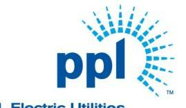
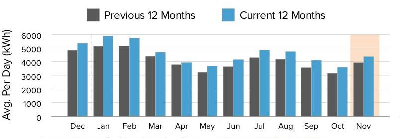
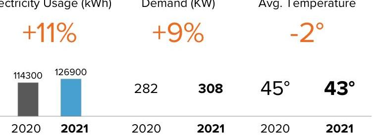
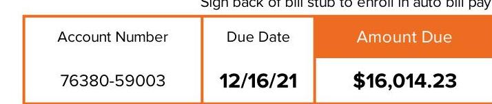
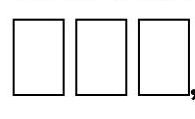
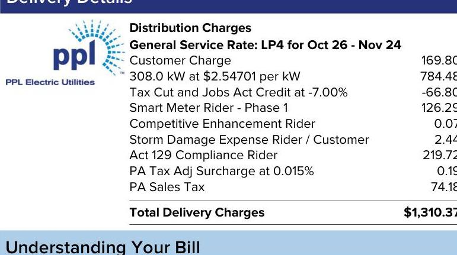

The image is a logo for "PPL Electric Utilities." It features the text "ppl" in lowercase letters, with a stylized design resembling rays or beams emanating from the letter "p" on the right side. The logo is in blue.

PPL Electric Utilities

## Service to:

WHITE DEER RUN INC HCF 360 WHITE DEER RUN RD ALLENWOOD, PA 17810

## We deliver.

1-888-220-9991
For hours of operation and to pay/manage your account, visit pplelectric.com. businessaccounts@pplweb.com

## $14,703.86$

## Preepoint Energy Solutions LLC

Rate Effective
$1-800-982-1670$
$8 / 25 / 20$

## ENERGY CHARGE: 126900@.0088 PER KWH

## SHOP FOR ELECTRICITY

Visit PAPowerSwitch.com or www.oca.state.pa.us If you're shopping, know your contract expiration date. Account Number: 76380-59003
The price to compare is updated June $1^{\text {st }}$ and December $1^{\text {st }}$. Rate: LP4. View schedule at pplelectric.com/rates

## $1,310.37

## Delivery

## PPL Electric Utilities

Consider making a monthly pledge to Operation HELP to assist those in need to heat their homes.

## WANT TO SAVE?

Consider switching to laptops. They use much less energy than a desktop computer.

Usage Summary

The image is a bar chart.

- **Chart Type**: Bar chart
- **X-Axis**: Months (Dec, Jan, Feb, Mar, Apr, May, Jun, Jul, Aug, Sep, Oct, Nov)
- **Y-Axis**: Avg. Per Day (kWh), ranging from 0 to 6000
- **Legend Entries**: 
  - Previous 12 Months (gray)
  - Current 12 Months (blue)
- **Data Points**:
  - December: Previous ~4800, Current ~5000
  - January: Previous ~5200, Current ~5500
  - February: Previous ~5400, Current ~5600
  - March: Previous ~5000, Current ~5300
  - April: Previous ~4000, Current ~4200
  - May: Previous ~3800, Current ~4000
  - June: Previous ~4200, Current ~4400
  - July: Previous ~4600, Current ~4800
  - August: Previous ~4500, Current ~4700
  - September: Previous ~4300, Current ~4500
  - October: Previous ~4000, Current ~4200
  - November: Previous ~4200, Current ~4400
- **Styling**: The bars for the current 12 months are highlighted in blue, while the previous 12 months are in gray. The November bar for the current year is slightly shaded differently, possibly indicating a partial month or forecast.

This chart provides a **yearly usage breakdown (monthly-based)**.

For usage and billing details, visit us online at pplelectric.com
Questions/concerns? Contact us by 12/16/21
1-888-220-9991
Visit pplelectric.com for hours of operation.
Correspondence to:
PPL Customer Service
827 Hausman Road
Allentown, PA 18104-9392

## November

The image is a chart comparing electricity usage, demand, and average temperature between 2020 and 2021.

- **Electricity Usage (kWh)**:
  - 2020: 114300
  - 2021: 126900
  - Change: +11%

- **Demand (kW)**:
  - 2020: 282
  - 2021: 308
  - Change: +9%

- **Avg. Temperature**:
  - 2020: 45°
  - 2021: 43°
  - Change: -2°

The 2021 values are highlighted in blue, while the 2020 values are in gray. The percentage changes are indicated in orange.

| 2020 | 2021 | 2020 | 2021 | 2020 | 2021 |
| :--: | :--: | :--: | :--: | :--: | :--: |

Sign back of bill stub to enroll in auto bill pay.

| Account Number | Due Date | Amount Due |
| :--: | :--: | :--: |
| 76380-59003 | $12 / 16 / 21$ | \$16,014.23 |

The image is a section of a bill or statement.

- **Embedded Text**:
  - "Account Number"
  - "Due Date"
  - "Amount Due"
  - "76380-59003"
  - "12/16/21"
  - "$16,014.23"
  - "Sign back of bill stub to enroll in auto bill pay."

- **Spatial Relationships**:
  - The "Account Number," "Due Date," and "Amount Due" are headers aligned horizontally at the top.
  - Below each header, the corresponding values "76380-59003," "12/16/21," and "$16,014.23" are listed respectively.
  - The instruction "Sign back of bill stub to enroll in auto bill pay." is located above the table.

Amount Enclosed:

The image is a photo or illustration featuring three empty rectangular boxes aligned horizontally. There is no embedded text or additional elements present in the image.

Please make check payable to: PPL ELECTRIC UTILITIES
P.O. BOX 25222

LEHIGH VALLEY, PA 18002-5222

| kWh Delivered (to Customer) |  |  |  |  |  |
| :--: | :--: | :--: | :--: | :--: | :--: |
| Meter   Number | Reading   Dates | Meter   Reading | kWh   Difference | Meter   Constant | Kilowatt-   Hours |
| 301311333 | Nov 24 | 03854 | 00141 | 900 | 126900 |
|  | Oct 26 | 03713 |  |  |  |
| Days Billed: 29 | Avg. kWh/Day: 4376 |  |  | Total Delivered: 126900 |  |

Next meter reading on or about: Dec 28, 2021.
State taxes this bill: About \$11.99. PA Gross Receipts Tax: About \$72.93.

## Supply Details

| Generation \& Transmission Charges for Oct 26-Nov 24 |  |
| :--: | :--: |
| State Sales Tax | 832.30 |
| Gross Receipts Tax | 818.44 |
| ENERGY CHARGE: 126900@.0088 PER KWH | $1,117.99$ |
| ENERGY CHARGE: 126900@-.0125 PER KWH | $-1,581.08$ |
| ENERGY CHARGE: 126900@.0006 PER KWH | 81.91 |
| ENERGY CHARGE: 8091@.0168 PER KWH | 136.07 |
| ENERGY CHARGE: 3761@.0608 PER KWH | 228.81 |
| ENERGY CHARGE: 126900@.0717 PER KWH | 9,094.98 |
| ENERGY CHARGE: 130661@.0001 PER KWH | 15.08 |
| ENERGY CHARGE: 126900@.0031 PER KWH | 398.94 |
| ENERGY CHARGE: 130661@.0006 PER KWH | 75.77 |
| CAPACITY CHARGE | 1,306.03 |
| TRANSMISSION CHARGE | 2,178.62 |
| Total Freepoint Energy Solutions LLC Charges | \$14,703.86 |

Continued on next page

## Billing Summary

Previous Balance \$13,214.75
Payment Received Nov 12, 2021 - Thank You! - \$13,214.75
Balance as of Nov 30, 2021
Total Supply Charges
Total Delivery Charges
Total Delivery Charges
$\$ 1,310.37$

| Amount Due By 12/16/21 | \$16,014.23 |
| :-- | :-- |

Account Balance \$16,014.23

## Delivery Details

The image is a section of a bill detailing delivery charges from PPL Electric Utilities. It includes the following text:

- **Distribution Charges**
- **General Service Rate: LP4 for Oct 26 - Nov 24**
- Customer Charge: 169.80
- 308.0 kW at $2.54701 per kW: 784.46
- Tax Cut and Jobs Act Credit at -7.00%: -66.80
- Smart Meter Rider - Phase 1: 126.29
- Competitive Enhancement Rider: 0.07
- Storm Damage Expense Rider / Customer: 2.44
- Act 129 Compliance Rider: 219.72
- PA Tax Adj Surcharge at 0.015%: 0.19
- PA Sales Tax: 74.18
- **Total Delivery Charges: $1,310.37**

The PPL Electric Utilities logo is present at the top left. The section is titled "Delivery Details" and is followed by "Understanding Your Bill."

Act 129 Compliance Rider - Monthly charge to recover costs for energy efficiency and conservation programs approved by the PUC.
Competitive Enhancement Rider - Monthly charge to recover costs to support shopping for retail electricity supply.
Customer Charge - The basic service charge to partially cover costs for billing, meter reading, equipment and service line maintenance. If you select a new supplier, the name, address and telephone number for both your distribution and supplier company will appear on your bill.
Distribution Charge (Delivery) - Part of the basic service charges on every customer's bill for delivering electricity from the electric distribution company to your home or business. The distribution charge is regulated by the Public Utility Commission. This charge will vary according to how much electricity you use.
Kilowatt-hour (kWh) - The basic unit of electric energy for which most customers are charged in cents per kilowatt-hour. A kilowatt-hour is the equivalent of using ten 100-watt light bulbs for one hour.
kWh Delivered - The amount of electricity we delivered to you for your use.
Storm Damage Expense Rider - Monthly charge to recover certain costs to make repairs after major storms.
Smart Meter Rider - Monthly charge to recover costs associated with the smart meter programs approved by the PUC.
State Tax Adjustment Surcharge - Monthly charge or credit to reflect changes in various state taxes. The surcharge may vary by bill component.

# Enroll in Automatic Bill Pay 

Enroll in Automatic Bill Pay (ABP) and your monthly electric payment will be automatically deducted from your bank checking account. To enroll, sign and date this form and return your check payment (voided check not required). Money orders, cashier and foreign checks do not qualify for enrollment.

I authorize PPL Electric Utilities to automatically deduct from the checking account as shown on my enclosed check, all future payments for the PPL Electric Utility bill account number listed on this payment stub. I will notify PPL Electric Utilities if I decide to cancel this authorization.

## To enroll in automatic bill payment,

Date $\qquad$
Checking Account holder sign here
Note: To enroll a savings account in automatic bill pay visit pplelectric.com/autopay.

The image is a logo for "ppl" with a stylized design featuring radiating lines emanating from the letter "p" on the right side. There is no additional text or elements present in the image.

PPI

# Supply Details - Continued 

For questions on these charges, please contact this supplier at:
1-800-982-1670

## Freepoint Energy Solutions LLC Customer Services 3050 Post Oak Blvd. Suite 1330 Houston, TX 77056

General information: Generation prices and charges are set by the electric generation supplier you have chosen. The Public Utility Commission regulates distribution rates and services. The Federal Energy Regulatory Commission regulates transmission prices and services.

| Account Number | Due Date | Amount Due |
| :-- | :-- | :-- |
| $76380-59003$ | $12 / 16 / 21$ | $\$ 16,014.23$ |

## Understanding Your Bill - Continued

Tax Cut and Jobs Act Credit - Monthly adjustment for federal tax changes. Type(s) of Meter Readings:
Actual - Measures your monthly electricity use based on an actual reading. *Federal I.D. 23-0959590

