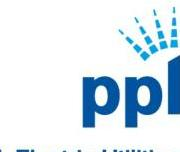
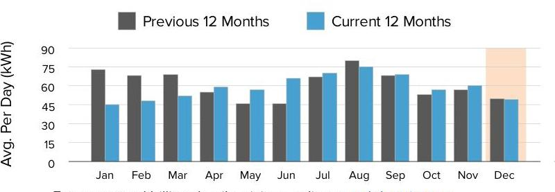
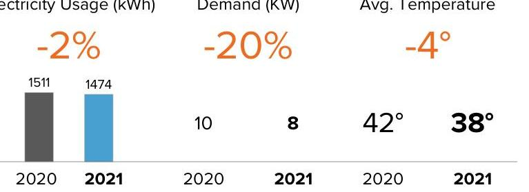
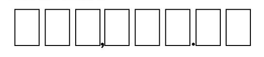
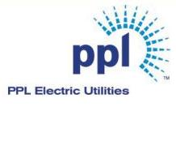

The image is a partial photo or illustration showing the logo of "PPL Electric Utilities." The logo consists of the letters "ppl" in lowercase blue font, with a stylized design resembling rays or beams emanating from the top right corner of the letter "p." The background is white. There is no additional text or elements visible in this cropped section of the image.

PPL Electric Utilities

## Service to:

WHITE DEER RUN INC
5972 SUSQUEHANNA TRL TURBOTVILLE, PA 17772

## We deliver.

1-800-342-5775
For hours of operation and to pay/manage your account, visit pplelectric.com.

## $12 / 30 / 21$

## $290.97$

Billing Details on Back
Because of Other Charges, your amount due does not equal your Usage Charges.

## Supply

## $211.33

## Freepoint Energy Solutions LLC

Rate Effective
$1-800-982-1670$
$8 / 11 / 20$

## ENERGY CHARGE: 1474@.0088 PER KWH

## PPL Electric Utilities Price to Compare

$\$ 0.10285$ Use this price when comparing supplier offers.

## SHOP FOR ELECTRICITY

Visit PAPowerSwitch.com or www.oca.state.pa.us If you're shopping, know your contract expiration date. Account Number: 64880-53038
The price to compare is updated June $1^{\text {st }}$ and December $1^{\text {st }}$. Rate: GS1. View schedule at pplelectric.com/rates

## $185.60$

## Delivery

## PPL Electric Utilities

Good news! Your deposit of $\$ 220.00$ taken on Dec 21, 2017 has earned interest of $\$ 0.50$. We credit this amount on your bill.

Consider making a monthly pledge to Operation HELP to assist those in need to heat their homes.

## WANT TO SAVE?

Be sure your HVAC unit is the correct size and operating at maximum energy efficiency.

## Usage Summary

The image is a bar chart showing a **yearly usage breakdown (monthly-based)** for electricity consumption. The x-axis represents the months from January to December, and the y-axis is labeled "Avg. Per Day (kWh)" with values ranging from 0 to 90. 

There are two sets of bars for each month:
- **Previous 12 Months**: Represented in dark gray.
- **Current 12 Months**: Represented in blue.

Notable data points include:
- January: Previous ~75 kWh, Current ~45 kWh
- February: Previous ~60 kWh, Current ~50 kWh
- March: Previous ~75 kWh, Current ~60 kWh
- April: Previous ~60 kWh, Current ~45 kWh
- May: Previous ~45 kWh, Current ~60 kWh
- June: Previous ~60 kWh, Current ~75 kWh
- July: Previous ~75 kWh, Current ~75 kWh
- August: Previous ~90 kWh, Current ~75 kWh
- September: Previous ~75 kWh, Current ~60 kWh
- October: Previous ~60 kWh, Current ~60 kWh
- November: Previous ~45 kWh, Current ~45 kWh
- December: Previous ~60 kWh, Current ~45 kWh (with a highlighted background in light orange for December).

The chart includes a legend at the top indicating the color coding for the previous and current 12 months.

For usage and billing details, visit us online at pplelectric.com
Questions/concerns? Contact us by 12/30/21
1-800-342-5775
Visit pplelectric.com for hours of operation.
Correspondence to:
PPL Customer Service
827 Hausman Road
Allentown, PA 18104-9392

## December

The image is a section of a chart comparing electricity usage, demand, and average temperature between the years 2020 and 2021. 

- **Electricity Usage (kWh):**
  - 2020: 1511 kWh
  - 2021: 1474 kWh
  - Change: -2%

- **Demand (kW):**
  - 2020: 10 kW
  - 2021: 8 kW
  - Change: -20%

- **Avg. Temperature (°F):**
  - 2020: 42°
  - 2021: 38°
  - Change: -4°

The percentages indicating change are displayed in orange. The data for 2020 is shown in gray, while 2021 is shown in blue.

Sign back of bill stub to enroll in auto bill pay.

| Account Number | Due Date | Amount Due |
| :--: | :--: | :--: |
| 64880-53038 | $12 / 30 / 21$ | \$290.97 |

Amount Enclosed:

The image is a photo or illustration showing a series of nine rectangular boxes aligned horizontally. The third and seventh boxes contain a comma and a period, respectively. The rest of the boxes are empty.

[^0]
[^0]:    WHITE DEER RUN INC
    5972 SUSQUEHANNA TRL
    TURBOTVILLE, PA 17772

| kWh Delivered (to Customer) |  |  |  |
| :--: | :--: | :--: | :--: |
| Meter   Number | Reading   Dates | Meter   Reading | Kilowatt-   Hours |
| 301367831 | Dec 10 | 62054 | 1474 |
|  | Nov 10 | 60580 |  |
| Days Billed: 30 | Avg. kWh/Day: 49 |  | Total Delivered: 1474 |
| Date Range | Annual Total Usage |  | Avg Monthly |
| Jan 2021 - Dec 2021 | 21462 kWh |  | 1789 kWh |

Next meter reading on or about: Jan 12, 2022.
State taxes this bill: About \$0.74. PA Gross Receipts Tax: About \$4.50.

## Supply Details

|  | Generation \& Transmission Charges for Nov 10-Dec 10 |  |
| :--: | :--: | :--: |
|  | Gross Receipts Tax | 11.76 |
|  | State Sales Tax | 11.97 |
|  | ENERGY CHARGE: 1474\#. 0088 PER KWH | 12.99 |
|  | ENERGY CHARGE: 1474\#. 0118 PER KWH | $-17.32$ |
|  | ENERGY CHARGE: 1474\#. 0004 PER KWH | 0.57 |
|  | ENERGY CHARGE: 201\#. 0168 PER KWH | 3.37 |
|  | ENERGY CHARGE: 80\#. 0509 PER KWH | 4.08 |
|  | ENERGY CHARGE: 1474\#. 0622 PER KWH | 91.73 |
|  | ENERGY CHARGE: 1554\#. 0001 PER KWH | 0.16 |
|  | ENERGY CHARGE: 1474\#. 0032 PER KWH | 4.66 |
|  | ENERGY CHARGE: 1554\#. 0006 PER KWH | 0.90 |
|  | CAPACITY CHARGE | 33.69 |
|  | TRANSMISSION CHARGE | 52.77 |
|  | Total Freepoint Energy Solutions LLC Charges | \$211.33 |

Continued on next page

## Billing Summary

Previous Balance
Payment Received Dec 8, 2021 - Thank You!
Balance as of Dec 14, 2021
Total Supply Charges
Total Delivery Charges
Other Charges
Excess Credit
Late Payment Charge
Total Other Charges
Amount Due By 12/30/21
Account Balance
$\$ 290.97$

## Delivery Details

The image is a logo for "PPL Electric Utilities" featuring the text "ppl" in lowercase letters with a stylized sunburst design above the "ppl" text. The full name "PPL Electric Utilities" is written below the logo.

## Distribution Charges

General Service Rate: G\$1 for Nov 10 - Dec 10
Customer Charge
22.00

8.0 kW at $\$ 4.36125$ per kW

Tax Cut and Jobs Act Credit at -7.00\%
Smart Meter Rider - Phase 2
Competitive Enhancement Rider
Storm Damage Expense Rider
Act 129 Compliance Rider
PA Tax Adj Surcharge at 0.015\%
PA Sales Tax
Total Delivery Charges
Total Delivery Charges $\$ 65.60$

## Understanding Your Bill

Act 129 Compliance Rider - Monthly charge to recover costs for energy efficiency and conservation programs approved by the PUC.
Competitive Enhancement Rider - Monthly charge to recover costs to support shopping for retail electricity supply.
Customer Charge - The basic service charge to partially cover costs for billing, meter reading, equipment and service line maintenance. If you select a new supplier, the name, address and telephone number for both your distribution and supplier company will appear on your bill.
Distribution Charge (Delivery) - Part of the basic service charges on every customer's bill for delivering electricity from the electric distribution company to your home or business. The distribution charge is regulated by the Public Utility Commission. This charge will vary according to how much electricity you use.
Kilowatt-hour (kWh) - The basic unit of electric energy for which most customers are charged in cents per kilowatt-hour. A kilowatt-hour is the equivalent of using ten 100-watt light bulbs for one hour.

# Enroll in Automatic Bill Pay 

Enroll in Automatic Bill Pay (ABP) and your monthly electric payment will be automatically deducted from your bank checking account. To enroll, sign and date this form and return your check payment (voided check not required). Money orders, cashier and foreign checks do not qualify for enrollment.

I authorize PPL Electric Utilities to automatically deduct from the checking account as shown on my enclosed check, all future payments for the PPL Electric Utility bill account number listed on this payment stub. I will notify PPL Electric Utilities if I decide to cancel this authorization.

## To enroll in automatic bill payment,

Date $\qquad$
Checking Account holder sign here
Note: To enroll a savings account in automatic bill pay visit pplelectric.com/autopay.

## BPI

PPI
Electric Utilities

## Supply Details - Continued

For questions on these charges, please contact this supplier at:
1-800-982-1670

## Freepoint Energy Solutions LLC

Customer Services
3050 Post Oak Blvd.
Suite 1330
Houston, TX 77056

General information: Generation prices and charges are set by the electric generation supplier you have chosen. The Public Utility Commission regulates distribution rates and services. The Federal Energy Regulatory Commission regulates transmission prices and services.

| Account Number | Due Date | Amount Due |
| :-- | :-- | :-- |
| 64880-53038 | $12 / 30 / 21$ | $\mathbf{\$ 2 9 0 . 9 7}$ |

## Understanding Your Bill - Continued

Late Payment Charge - Charge added if you do not pay your bill by the due date.
kWh Delivered - The amount of electricity we delivered to you for your use.
Storm Damage Expense Rider - Monthly charge to recover certain costs to make repairs after major storms.
Smart Meter Rider - Monthly charge to recover costs associated with the smart meter programs approved by the PUC.
State Tax Adjustment Surcharge - Monthly charge or credit to reflect changes in various state taxes. The surcharge may vary by bill component.
Tax Cut and Jobs Act Credit - Monthly adjustment for federal tax changes.
Type(s) of Meter Readings:
Actual - Measures your monthly electricity use based on an actual reading.
*Federal I.D. 23-0959590

