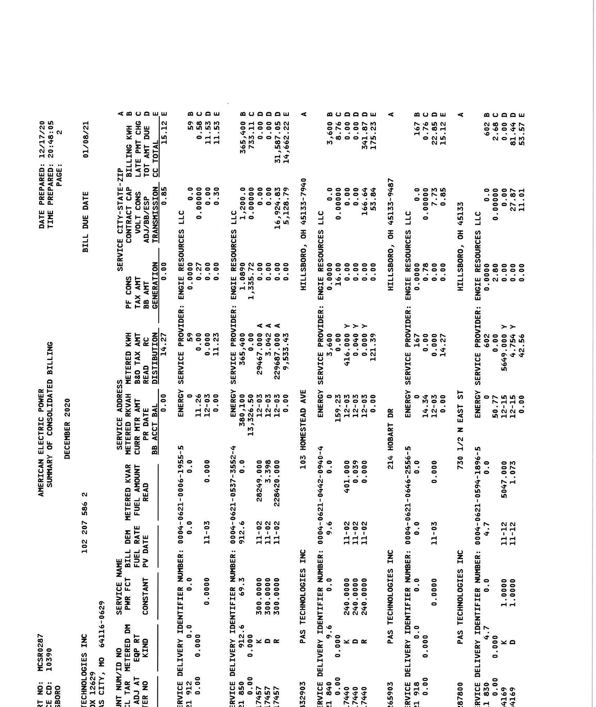

# CONSOLIDATED BILL 

SERVICE ADDRESS:
16769-1 25
$\left.\mathrm{T}^{\mathrm{T}} \mathrm{H}\right|_{\mathrm{H}} \mathrm{H}_{\mathrm{H}} \mathrm{H}_{\mathrm{H}}^{\mathrm{H}} \mathrm{H}_{\mathrm{H}}^{\mathrm{H}} \mathrm{H}_{\mathrm{H}} \mathrm{H}_{\mathrm{H}} \mathrm{H}_{\mathrm{H}} \mathrm{H}_{\mathrm{H}} \mathrm{H}_{\mathrm{H}} \mathrm{H}_{\mathrm{H}} \mathrm{H}_{\mathrm{H}}^{\mathrm{H}} \mathrm{H}_{\mathrm{H}}^{\mathrm{H}} \mathrm{H}_{\mathrm{H}}^{\mathrm{H}} \mathrm{H}_{\mathrm{H}}^{\mathrm{H}} \mathrm{H}_{\mathrm{H}}^{\mathrm{H}} \mathrm{H}_{\mathrm{H}}^{\mathrm{H}} \mathrm{H}_{\mathrm{H}}^{\mathrm{H}} \mathrm{H}_{\mathrm{H}}^{\mathrm{H}} \mathrm{H}_{\mathrm{H}}^{\mathrm{H}} \mathrm{H}_{\mathrm{H}}^{\mathrm{H}} \mathrm{H}_{\mathrm{H}}^{\mathrm{H}} \mathrm{H}_{\mathrm{H}}^{\mathrm{H}} \mathrm{H}_{\mathrm{H}}^{\mathrm{H}} \mathrm{H}_{\mathrm{H}}^{\mathrm{H}} \mathrm{H}_{\mathrm{H}}^{\mathrm{H}} \mathrm{H}_{\mathrm{H}}^{\mathrm{H}} \mathrm{H}_{\mathrm{H}}^{\mathrm{H}} \mathrm{H}_{\mathrm{H}}^{\mathrm{H}} \mathrm{H}_{\mathrm{H}}^{\mathrm{H}} \mathrm{H}_{\mathrm{H}}^{\mathrm{H}} \mathrm{H}_{\mathrm{H}}^{\mathrm{H}} \mathrm{H}_{\mathrm{H}}^{\mathrm{H}} \mathrm{H}_{\mathrm{H}}^{\mathrm{H}} \mathrm{H}_{\mathrm{H}}^{\mathrm{H}} \mathrm{H}_{\mathrm{H}}^{\mathrm{H}} \mathrm{H}_{\mathrm{H}}^{\mathrm{H}} \mathrm{H}_{\mathrm{H}}^{\mathrm{H}} \mathrm{H}_{\mathrm{H}}^{\mathrm{H}} \mathrm{H}_{\mathrm{H}}^{\mathrm{H}} \mathrm{H}_{\mathrm{H}}^{\mathrm{H}} \mathrm{H}_{\mathrm{H}}^{\mathrm{H}} \mathrm{H}_{\mathrm{H}}^{\mathrm{H}} \mathrm{H}_{\mathrm{H}}^{\mathrm{H}} \mathrm{H}_{\mathrm{H}}^{\mathrm{H}} \mathrm{H}_{\mathrm{H}}^{\mathrm{H}} \mathrm{H}_{\mathrm{H}}^{\mathrm{H}} \mathrm{H}_{\mathrm{H}}^{\mathrm{H}} \mathrm{H}_{\mathrm{H}}^{\mathrm{H}} \mathrm{H}_{\mathrm{H}}^{\mathrm{H}} \mathrm{H}_{\mathrm{H}}^{\mathrm{H}} \mathrm{H}_{\mathrm{H}}^{\mathrm{H}} \mathrm{H}_{\mathrm{H}}^{\mathrm{H}} \mathrm{H}_{\mathrm{H}}^{\mathrm{H}} \mathrm{H}_{\mathrm{H}}^{\mathrm{H}} \mathrm{H}_{\mathrm{H}}^{\mathrm{H}} \mathrm{H}_{\mathrm{H}}^{\mathrm{H}} \mathrm{H}_{\mathrm{H}}^{\mathrm{H}} \mathrm{H}_{\mathrm{H}}^{\mathrm{H}} \mathrm{H}_{\mathrm{H}}^{\mathrm{H}} \mathrm{H}_{\mathrm{H}}^{\mathrm{H}} \mathrm{H}_{\mathrm{H}}^{\mathrm{H}} \mathrm{H}_{\mathrm{H}}^{\mathrm{H}} \mathrm{H}_{\mathrm{H}}^{\mathrm{H}} \mathrm{H}_{\mathrm{H}}^{\mathrm{H}} \mathrm{H}_{\mathrm{H}}^{\mathrm{H}} \mathrm{H}_{\mathrm{H}}^{\mathrm{H}} \mathrm{H}_{\mathrm{H}}^{\mathrm{H}} \mathrm{H}_{\mathrm{H}}^{\mathrm{H}} \mathrm{H}_{\mathrm{H}}^{\mathrm{H}} \mathrm{H}_{\mathrm{H}}^{\mathrm{H}} \mathrm{H}_{\mathrm{H}}^{\mathrm{H}} \mathrm{H}_{\mathrm{H}}^{\mathrm{H}} \mathrm{H}_{\mathrm{H}}^{\mathrm{H}} \mathrm{H}_{\mathrm{H}}^{\mathrm{H}} \mathrm{H}_{\mathrm{H}}^{\mathrm{H}} \mathrm{H}_{\mathrm{H}}^{\mathrm{H}} \mathrm{H}_{\mathrm{H}}^{\mathrm{H}} \mathrm{H}_{\mathrm{H}}^{\mathrm{H}} \mathrm{H}_{\mathrm{H}}^{\mathrm{H}} \mathrm{H}_{\mathrm{H}}^{\mathrm{H}} \mathrm{H}_{\mathrm{H}}^{\mathrm{H}} \mathrm{H}_{\mathrm{H}}^{\mathrm{H}} \mathrm{H}_{\mathrm{H}}^{\mathrm{H}} \mathrm{H}_{\mathrm{H}}^{\mathrm{H}} \mathrm{H}_{\mathrm{H}}^{\mathrm{H}} \mathrm{H}_{\mathrm{H}}^{\mathrm{H}} \mathrm{H}_{\mathrm{H}}^{\mathrm{H}} \mathrm{H}_{\mathrm{H}}^{\mathrm{H}} \mathrm{H}_{\mathrm{H}}^{\mathrm{H}} \mathrm{H}_{\mathrm{H}}^{\mathrm{H}} \mathrm{H}_{\mathrm{H}}^{\mathrm{H}} \mathrm{H}_{\mathrm{H}}^{\mathrm{H}} \mathrm{H}_{\mathrm{H}}^{\mathrm{H}} \mathrm{H}_{\mathrm{H}}^{\mathrm{H}} \mathrm{H}_{\mathrm{H}}^{\mathrm{H}} \mathrm{H}_{\mathrm{H}}^{\mathrm{H}} \mathrm{H}_{\mathrm{H}}^{\mathrm{H}} \mathrm{H}_{\mathrm{H}}^{\mathrm{H}} \mathrm{H}_{\mathrm{H}}^{\mathrm{H}} \mathrm{H}_{\mathrm{H}}^{\mathrm{H}} \mathrm{H}_{\mathrm{H}}^{\mathrm{H}} \mathrm{H}_{\mathrm{H}}^{\mathrm{H}} \mathrm{H}_{\mathrm{H}}^{\mathrm{H}} \mathrm{H}_{\mathrm{H}}^{\mathrm{H}} \mathrm{H}_{\mathrm{H}}^{\mathrm{H}} \mathrm{H}_{\mathrm{H}}^{\mathrm{H}} \mathrm{H}_{\mathrm{H}}^{\mathrm{H}} \mathrm{H}_{\mathrm{H}}^{\mathrm{H}} \mathrm{H}_{\mathrm{H}}^{\mathrm{H}} \mathrm{H}_{\mathrm{H}}^{\mathrm{H}} \mathrm{H}_{\mathrm{H}}^{\mathrm{H}} \mathrm{H}_{\mathrm{H}}^{\mathrm{H}} \mathrm{H}_{\mathrm{H}}^{\mathrm{H}} \mathrm{H}_{\mathrm{H}}^{\mathrm{H}} \mathrm{H}_{\mathrm{H}}^{\mathrm{H}} \mathrm{H}_{\mathrm{H}}^{\mathrm{H}} \mathrm{H}_{\mathrm{H}}^{\mathrm{H}} \mathrm{H}_{\mathrm{H}}^{\mathrm{H}} \mathrm{H}_{\mathrm{H}}^{\mathrm{H}} \mathrm{H}_{\mathrm{H}}^{\mathrm{H}} \mathrm{H}_{\mathrm{H}}^{\mathrm{H}} \mathrm{H}_{\mathrm{H}}^{\mathrm{H}} \mathrm{H}_{\mathrm{H}}^{\mathrm{H}} \mathrm{H}_{\mathrm{H}}^{\mathrm{H}} \mathrm{H}_{\mathrm{H}}^{\mathrm{H}} \mathrm{H}_{\mathrm{H}}^{\mathrm{H}} \mathrm{H}_{\mathrm{H}}^{\mathrm{H}} \mathrm{H}_{\mathrm{H}}^{\mathrm{H}} \mathrm{H}_{\mathrm{H}}^{\mathrm{H}} \mathrm{H}_{\mathrm{H}}^{\mathrm{H}} \mathrm{H}_{\mathrm{H}}^{\mathrm{H}} \mathrm{H}_{\mathrm{H}}^{\mathrm{H}} \mathrm{H}_{\mathrm{H}}^{\mathrm{H}} \mathrm{H}_{\mathrm{H}}^{\mathrm{H}} \mathrm{H}_{\mathrm{H}}^{\mathrm{H}} \mathrm{H}_{\mathrm{H}}^{\mathrm{H}} \mathrm{H}_{\mathrm{H}}^{\mathrm{H}} \mathrm{H}_{\mathrm{H}}^{\mathrm{H}} \mathrm{H}_{\mathrm{H}}^{\mathrm{H}} \mathrm{H}_{\mathrm{H}}^{\mathrm{H}} \mathrm{H}_{\mathrm{H}}^{\mathrm{H}} \mathrm{H}_{\mathrm{H}}^{\mathrm{H}} \mathrm{H}_{\mathrm{H}}^{\mathrm{H}} \mathrm{H}_{\mathrm{H}}^{\mathrm{H}} \mathrm{H}_{\mathrm{H}}^{\mathrm{H}} \mathrm{H}_{\mathrm{H}}^{\mathrm{H}} \mathrm{H}_{\mathrm{H}}^{\mathrm{H}} \mathrm{H}_{\mathrm{H}}^{\mathrm{H}} \mathrm{H}_{\mathrm{H}}^{\mathrm{H}} \mathrm{H}_{\mathrm{H}}^{\mathrm{H}} \mathrm{H}_{\mathrm{H}}^{\mathrm{H}} \mathrm{H}_{\mathrm{H}}^{\mathrm{H}} \mathrm{H}_{\mathrm{H}}^{\mathrm{H}} \mathrm{H}_{\mathrm{H}}^{\mathrm{H}} \mathrm{H}_{\mathrm{H}}^{\mathrm{H}} \mathrm{H}_{\mathrm{H}}^{\mathrm{H}} \mathrm{H}_{\mathrm{H}}^{\mathrm{H}} \mathrm{H}_{\mathrm{H}}^{\mathrm{H}} \mathrm{H}_{\mathrm{H}}^{\mathrm{H}} \mathrm{H}_{\mathrm{H}}^{\mathrm{H}} \mathrm{H}_{\mathrm{H}}^{\mathrm{H}} \mathrm{H}_{\mathrm{H}}^{\mathrm{H}} \mathrm{H}_{\mathrm{H}}^{\mathrm{H}} \mathrm{H}_{\mathrm{H}}^{\mathrm{H}} \mathrm{H}_{\mathrm{H}}^{\mathrm{H}} \mathrm{H}_{\mathrm{H}}^{\mathrm{H}} \mathrm{H}_{\mathrm{H}}^{\mathrm{H}} \mathrm{H}_{\mathrm{H}}^{\mathrm{H}} \mathrm{H}_{\mathrm{H}}^{\mathrm{H}} \mathrm{H}_{\mathrm{H}}^{\mathrm{H}} \mathrm{H}_{\mathrm{H}}^{\mathrm{H}} \mathrm{H}_{\mathrm{H}}^{\mathrm{H}} \mathrm{H}_{\mathrm{H}}^{\mathrm{H}} \mathrm{H}_{\mathrm{H}}^{\mathrm{H}} \mathrm{H}_{\mathrm{H}}^{\mathrm{H}} \mathrm{H}_{\mathrm{H}}^{\mathrm{H}} \mathrm{H}_{\mathrm{H}}^{\mathrm{H}} \mathrm{H}_{\mathrm{H}}^{\mathrm{H}} \mathrm{H}_{\mathrm{H}}^{\mathrm{H}} \mathrm{H}_{\mathrm{H}}^{\mathrm{H}} \mathrm{H}_{\mathrm{H}}^{\mathrm{H}} \mathrm{H}_{\mathrm{H}}^{\mathrm{H}} \mathrm{H}_{\mathrm{H}}^{\mathrm{H}} \mathrm{H}_{\mathrm{H}}^{\mathrm{H}} \mathrm{H}_{\mathrm{H}}^{\mathrm{H}} \mathrm{H}_{\mathrm{H}}^{\mathrm{H}} \mathrm{H}_{\mathrm{H}}^{\mathrm{H}} \mathrm{H}_{\mathrm{H}}^{\mathrm{H}} \mathrm{H}_{\mathrm{H}}^{\mathrm{H}} \mathrm{H}_{\mathrm{H}}^{\mathrm{H}} \mathrm{H}_{\mathrm{H}}^{\mathrm{H}} \mathrm{H}_{\mathrm{H}}^{\mathrm{H}} \mathrm{H}_{\mathrm{H}}^{\mathrm{H}} \mathrm{H}_{\mathrm{H}}^{\mathrm{H}} \mathrm{H}_{\mathrm{H}}^{\mathrm{H}} \mathrm{H}_{\mathrm{H}}^{\mathrm{H}} \mathrm{H}_{\mathrm{H}}^{\mathrm{H}} \mathrm{H}_{\mathrm{H}}^{\mathrm{H}} \mathrm{H}_{\mathrm{H}}^{\mathrm{H}} \mathrm{H}_{\mathrm{H}}^{\mathrm{H}} \mathrm{H}_{\mathrm{H}}^{\mathrm{H}} \mathrm{H}_{\mathrm{H}}^{\mathrm{H}} \mathrm{H}_{\mathrm{H}}^{\mathrm{H}} \mathrm{H}_{\mathrm{H}}^{\mathrm{H}} \mathrm{H}_{\mathrm{H}}^{\mathrm{H}} \mathrm{H}_{\mathrm{H}}^{\mathrm{H}} \mathrm{H}_{\mathrm{H}}^{\mathrm{H}} \mathrm{H}_{\mathrm{H}}^{\mathrm{H}} \mathrm{H}_{\mathrm{H}}^{\mathrm{H}} \mathrm{H}_{\mathrm{H}}^{\mathrm{H}} \mathrm{H}_{\mathrm{H}}^{\mathrm{H}} \mathrm{H}_{\mathrm{H}}^{\mathrm{H}} \mathrm{H}_{\mathrm{H}}^{\mathrm{H}} \mathrm{H}_{\mathrm{H}}^{\mathrm{H}} \mathrm{H}_{\mathrm{H}}^{\mathrm{H}} \mathrm{H}_{\mathrm{H}}^{\mathrm{H}} \mathrm{H}_{\mathrm{H}}^{\mathrm{H}} \mathrm{H}_{\mathrm{H}}^{\mathrm{H}} \mathrm{H}_{\mathrm{H}}^{\mathrm{H}} \mathrm{H}_{\mathrm{H}}^{\mathrm{H}} \mathrm{H}_{\mathrm{H}}^{\mathrm{H}} \mathrm{H}_{\mathrm{H}}^{\mathrm{H}} \mathrm{H}_{\mathrm{H}}^{\mathrm{H}} \mathrm{H}_{\mathrm{H}}^{\mathrm{H}} \mathrm{H}_{\mathrm{H}}^{\mathrm{H}} \mathrm{H}_{\mathrm{H}}^{\mathrm{H}} \mathrm{H}_{\mathrm{H}}^{\mathrm{H}} \mathrm{H}_{\mathrm{H}}^{\mathrm{H}} \mathrm{H}_{\mathrm{H}}^{\mathrm{H}} \mathrm{H}_{\mathrm{H}}^{\mathrm{H}} \mathrm{H}_{\mathrm{H}}^{\mathrm{H}} \mathrm{H}_{\mathrm{H}}^{\mathrm{H}} \mathrm{H}_{\mathrm{H}}^{\mathrm{H}} \mathrm{H}_{\mathrm{H}}^{\mathrm{H}} \mathrm{H}_{\mathrm{H}}^{\mathrm{H}} \mathrm{H}_{\mathrm{H}}^{\mathrm{H}} \mathrm{H}_{\mathrm{H}}^{\mathrm{H}} \mathrm{H}_{\mathrm{H}}^{\mathrm{H}} \mathrm{H}_{\mathrm{H}}^{\mathrm{H}} \mathrm{H}_{\mathrm{H}}^{\mathrm{H}} \mathrm{H}_{\mathrm{H}}^{\mathrm{H}} \mathrm{H}_{\mathrm{H}}^{\mathrm{H}} \mathrm{H}_{\mathrm{H}}^{\mathrm{H}} \mathrm{H}_{\mathrm{H}}^{\mathrm{H}} \mathrm{H}_{\mathrm{H}}^{\mathrm{H}} \mathrm{H}_{\mathrm{H}}^{\mathrm{H}} \mathrm{H}_{\mathrm{H}}^{\mathrm{H}} \mathrm{H}_{\mathrm{H}}^{\mathrm{H}} \mathrm{H}_{\mathrm{H}}^{\mathrm{H}} \mathrm{H}_{\mathrm{H}}^{\mathrm{H}} \mathrm{H}_{\mathrm{H}}^{\mathrm{H}} \mathrm{H}_{\mathrm{H}}^{\mathrm{H}} \mathrm{H}_{\mathrm{H}}^{\mathrm{H}} \mathrm{H}_{\mathrm{H}}^{\mathrm{H}} \mathrm{H}_{\mathrm{H}}^{\mathrm{H}} \mathrm{H}_{\mathrm{H}}^{\mathrm{H}} \mathrm{H}_{\mathrm{H}}^{\mathrm{H}} \mathrm{H}_{\mathrm{H}}^{\mathrm{H}} \mathrm{H}_{\mathrm{H}}^{\mathrm{H}} \mathrm{H}_{\mathrm{H}}^{\mathrm{H}} \mathrm{H}_{\mathrm{H}}^{\mathrm{H}} \mathrm{H}_{\mathrm{H}}^{\mathrm{H}} \mathrm{H}_{\mathrm{H}}^{\mathrm{H}} \mathrm{H}_{\mathrm{H}}^{\mathrm{H}} \mathrm{H}_{\mathrm{H}}^{\mathrm{H}} \mathrm{H}_{\mathrm{H}}^{\mathrm{H}} \mathrm{H}_{\mathrm{H}}^{\mathrm{H}} \mathrm{H}_{\mathrm{H}}^{\mathrm{H}} \mathrm{H}_{\mathrm{H}}^{\mathrm{H}} \mathrm{H}_{\mathrm{H}}^{\mathrm{H}} \mathrm{H}_{\mathrm{H}}^{\mathrm{H}} \mathrm{H}_{\mathrm{H}}^{\mathrm{H}} \mathrm{H}_{\mathrm{H}}^{\mathrm{H}} \mathrm{H}_{\mathrm{H}}^{\mathrm{H}} \mathrm{H}_{\mathrm{H}}^{\mathrm{H}} \mathrm{H}_{\mathrm{H}}^{\mathrm{H}} \mathrm{H}_{\mathrm{H}}^{\mathrm{H}} \mathrm{H}_{\mathrm{H}}^{\mathrm{H}} \mathrm{H}_{\mathrm{H}}^{\mathrm{H}} \mathrm{H}_{\mathrm{H}}^{\mathrm{H}} \mathrm{H}_{\mathrm{H}}^{\mathrm{H}} \mathrm{H}_{\mathrm{H}}^{\mathrm{H}} \mathrm{H}_{\mathrm{H}}^{\mathrm{H}} \mathrm{H}_{\mathrm{H}}^{\mathrm{H}} \mathrm{H}_{\mathrm{H}}^{\mathrm{H}} \mathrm{H}_{\mathrm{H}}^{\mathrm{H}} \mathrm{H}_{\mathrm{H}}^{\mathrm{H}} \mathrm{H}_{\mathrm{H}}^{\mathrm{H}} \mathrm{H}_{\mathrm{H}}^{\mathrm{H}} \mathrm{H}_{\mathrm{H}}^{\mathrm{H}} \mathrm{H}_{\mathrm{H}}^{\mathrm{H}} \mathrm{H}_{\mathrm{H}}^{\mathrm{H}} \mathrm{H}_{\mathrm{H}}^{\mathrm{H}} \mathrm{H}_{\mathrm{H}}^{\mathrm{H}} \mathrm{H}_{\mathrm{H}}^{\mathrm{H}} \mathrm{H}_{\mathrm{H}}^{\mathrm{H}} \mathrm{H}_{\mathrm{H}}^{\mathrm{H}} \mathrm{H}_{\mathrm{H}}^{\mathrm{H}} \mathrm{H}_{\mathrm{H}}^{\mathrm{H}} \mathrm{H}_{\mathrm{H}}^{\mathrm{H}} \mathrm{H}_{\mathrm{H}}^{\mathrm{H}} \mathrm{H}_{\mathrm{H}}^{\mathrm{H}} \mathrm{H}_{\mathrm{H}}^{\mathrm{H}} \mathrm{H}_{\mathrm{H}}^{\mathrm{H}} \mathrm{H}_{\mathrm{H}}^{\mathrm{H}} \mathrm{H}_{\mathrm{H}}^{\mathrm{H}} \mathrm{H}_{\mathrm{H}}^{\mathrm{H}} \mathrm{H}_{\mathrm{H}}^{\mathrm{H}} \mathrm{H}_{\mathrm{H}}^{\mathrm{H}} \mathrm{H}_{\mathrm{H}}^{\mathrm{H}} \mathrm{H}_{\mathrm{H}}^{\mathrm{H}} \mathrm{H}_{\mathrm{H}}^{\mathrm{H}} \mathrm{H}_{\mathrm{H}}^{\mathrm{H}} \mathrm{H}_{\mathrm{H}}^{\mathrm{H}} \mathrm{H}_{\mathrm{H}}^{\mathrm{H}} \mathrm{H}_{\mathrm{H}}^{\mathrm{H}} \mathrm{H}_{\mathrm{H}}^{\mathrm{H}} \mathrm{H}_{\mathrm{H}}^{\mathrm{H}} \mathrm{H}_{\mathrm{H}}^{\mathrm{H}} \mathrm{H}_{\mathrm{H}}^{\mathrm{H}} \mathrm{H}_{\mathrm{H}}^{\mathrm{H}} \mathrm{H}_{\mathrm{H}}^{\mathrm{H}} \mathrm{H}_{\mathrm{H}}^{\mathrm{H}} \mathrm{H}_{\mathrm{H}}^{\mathrm{H}} \mathrm{H}_{\mathrm{H}}^{\mathrm{H}} \mathrm{H}_{\mathrm{H}}^{\mathrm{H}} \mathrm{H}_{\mathrm{H}}^{\mathrm{H}} \mathrm{H}_{\mathrm{H}}^{\mathrm{H}} \mathrm{H}_{\mathrm{H}}^{\mathrm{H}} \mathrm{H}_{\mathrm{H}}^{\mathrm{H}} \mathrm{H}_{\mathrm{H}}^{\mathrm{H}} \mathrm{H}_{\mathrm{H}}^{\mathrm{H}} \mathrm{H}_{\mathrm{H}}^{\mathrm{H}} \mathrm{H}_{\mathrm{H}}^{\mathrm{H}} \mathrm{H}_{\mathrm{H}}^{\mathrm{H}} \mathrm{H}_{\mathrm{H}}^{\mathrm{H}} \mathrm{H}_{\mathrm{H}}^{\mathrm{H}} \mathrm{H}_{\mathrm{H}}^{\mathrm{H}} \mathrm{H}_{\mathrm{H}}^{\mathrm{H}} \mathrm{H}_{\mathrm{H}}^{\mathrm{H}} \mathrm{H}_{\mathrm{H}}^{\mathrm{H}} \mathrm{H}_{\mathrm{H}}^{\mathrm{H}} \mathrm{H}_{\mathrm{H}}^{\mathrm{H}} \mathrm{H}_{\mathrm{H}}^{\mathrm{H}} \mathrm{H}_{\mathrm{H}}^{\mathrm{H}} \mathrm{H}_{\mathrm{H}}^{\mathrm{H}} \mathrm{H}_{\mathrm{H}}^{\mathrm{H}} \mathrm{H}_{\mathrm{H}}^{\mathrm{H}} \mathrm{H}_{\mathrm{H}}^{\mathrm{H}} \mathrm{H}_{\mathrm{H}}^{\mathrm{H}} \mathrm{H}_{\mathrm{H}}^{\mathrm{H}} \mathrm{H}_{\mathrm{H}}^{\mathrm{H}} \mathrm{H}_{\mathrm{H}}^{\mathrm{H}} \mathrm{H}_{\mathrm{H}}^{\mathrm{H}} \mathrm{H}_{\mathrm{H}}^{\mathrm{H}} \mathrm{H}_{\mathrm{H}}^{\mathrm{H}} \mathrm{H}_{\mathrm{H}}^{\mathrm{H}} \mathrm{H}_{\mathrm{H}}^{\mathrm{H}} \mathrm{H}_{\mathrm{H}}^{\mathrm{H}} \mathrm{H}_{\mathrm{H}}^{\mathrm{H}} \mathrm{H}_{\mathrm{H}}^{\mathrm{H}} \mathrm{H}_{\mathrm{H}}^{\mathrm{H}} \mathrm{H}_{\mathrm{H}}^{\mathrm{H}} \mathrm{H}_{\mathrm{H}}^{\mathrm{H}} \mathrm{H}_{\mathrm{H}}^{\mathrm{H}} \mathrm{H}_{\mathrm{H}}^{\mathrm{H}} \mathrm{H}_{\mathrm{H}}^{\mathrm{H}} \mathrm{H}_{\mathrm{H}}^{\mathrm{H}} \mathrm{H}_{\mathrm{H}}^{\mathrm{H}} \mathrm{H}_{\mathrm{H}}^{\mathrm{H}} \mathrm{H}_{\mathrm{H}}^{\mathrm{H}} \mathrm{H}_{\mathrm{H}}^{\mathrm{H}} \mathrm{H}_{\mathrm{H}}^{\mathrm{H}} \mathrm{H}_{\mathrm{H}}^{\mathrm{H}} \mathrm{H}_{\mathrm{H}}^{\mathrm{H}} \mathrm{H}_{\mathrm{H}}^{\mathrm{H}} \mathrm{H}_{\mathrm{H}}^{\mathrm{H}} \mathrm{H}_{\mathrm{H}}^{\mathrm{H}} \mathrm{H}_{\mathrm{H}}^{\mathrm{H}} \mathrm{H}_{\mathrm{H}}^{\mathrm{H}} \mathrm{H}_{\mathrm{H}}^{\mathrm{H}} \mathrm{H}_{\mathrm{H}}^{\mathrm{H}} \mathrm{H}_{\mathrm{H}}^{\mathrm{H}} \mathrm{H}_{\mathrm{H}}^{\mathrm{H}} \mathrm{H}_{\mathrm{H}}^{\mathrm{H}} \mathrm{H}_{\mathrm{H}}^{\mathrm{H}} \mathrm{H}_{\mathrm{H}}^{\mathrm{H}} \mathrm{H}_{\mathrm{H}}^{\mathrm{H}} \mathrm{H}_{\mathrm{H}}^{\mathrm{H}} \mathrm{H}_{\mathrm{H}}^{\mathrm{H}} \mathrm{H}_{\mathrm{H}}^{\mathrm{H}} \mathrm{H}_{\mathrm{H}}^{\mathrm{H}} \mathrm{H}_{\mathrm{H}}^{\mathrm{H}} \mathrm{H}_{\mathrm{H}}^{\mathrm{H}} \mathrm{H}_{\mathrm{H}}^{\mathrm{H}} \mathrm{H}_{\mathrm{H}}^{\mathrm{H}} \mathrm{H}_{\mathrm{H}}^{\mathrm{H}} \mathrm{H}_{\mathrm{H}}^{\mathrm{H}} \mathrm{H}_{\mathrm{H}}^{\mathrm{H}} \mathrm{H}_{\mathrm{H}}^{\mathrm{H}} \mathrm{H}_{\mathrm{H}}^{\mathrm{H}} \mathrm{H}_{\mathrm{H}}^{\mathrm{H}} \mathrm{H}_{\mathrm{H}}^{\mathrm{H}} \mathrm{H}_{\mathrm{H}}^{\mathrm{H}} \mathrm{H}_{\mathrm{H}}^{\mathrm{H}} \mathrm{H}_{\mathrm{H}}^{\mathrm{H}} \mathrm{H}_{\mathrm{H}}^{\mathrm{H}} \mathrm{H}_{\mathrm{H}}^{\mathrm{H}} \mathrm{H}_{\mathrm{H}}^{\mathrm{H}} \mathrm{H}_{\mathrm{H}}^{\mathrm{H}} \mathrm{H}_{\mathrm{H}}^{\mathrm{H}} \mathrm{H}_{\mathrm{H}}^{\mathrm{H}} \mathrm{H}_{\mathrm{H}}^{\mathrm{H}} \mathrm{H}_{\mathrm{H}}^{\mathrm{H}} \mathrm{H}_{\mathrm{H}}^{\mathrm{H}} \mathrm{H}_{\mathrm{H}}^{\mathrm{H}} \mathrm{H}_{\mathrm{H}}^{\mathrm{H}} \mathrm{H}_{\mathrm{H}}^{\mathrm{H}} \mathrm{H}_{\mathrm{H}}^{\mathrm{H}} \mathrm{H}_{\mathrm{H}}^{\mathrm{H}} \mathrm{H}_{\mathrm{H}}^{\mathrm{H}} \mathrm{H}_{\mathrm{H}}^{\mathrm{H}} \mathrm{H}_{\mathrm{H}}^{\mathrm{H}} \mathrm{H}_{\mathrm{H}}^{\mathrm{H}} \mathrm{H}_{\mathrm{H}}^{\mathrm{H}} \mathrm{H}_{\mathrm{H}}^{\mathrm{H}} \mathrm{H}_{\mathrm{H}}^{\mathrm{H}} \mathrm{H}_{\mathrm{H}}^{\mathrm{H}} \mathrm{H}_{\mathrm{H}}^{\mathrm{H}} \mathrm{H}_{\mathrm{H}}^{\mathrm{H}} \mathrm{H}_{\mathrm{H}}^{\mathrm{H}} \mathrm{H}_{\mathrm{H}}^{\mathrm{H}} \mathrm{H}_{\mathrm{H}}^{\mathrm{H}} \mathrm{H}_{\mathrm{H}}^{\mathrm{H}} \mathrm{H}_{\mathrm{H}}^{\mathrm{H}} \mathrm{H}_{\mathrm{H}}^{\mathrm{H}} \mathrm{H}_{\mathrm{H}}^{\mathrm{H}} \mathrm{H}_{\mathrm{H}}^{\mathrm{H}} \mathrm{H}_{\mathrm{H}}^{\mathrm{H}} \mathrm{H}_{\mathrm{H}}^{\mathrm{H}} \mathrm{H}_{\mathrm{H}}^{\mathrm{H}} \mathrm{H}_{\mathrm{H}}^{\mathrm{H}} \mathrm{H}_{\mathrm{H}}^{\mathrm{H}} \mathrm{H}_{\mathrm{H}}^{\mathrm{H}} \mathrm{H}_{\mathrm{H}}^{\mathrm{H}} \mathrm{H}_{\mathrm{H}}^{\mathrm{H}} \mathrm{H}_{\mathrm{H}}^{\mathrm{H}} \mathrm{H}_{\mathrm{H}}^{\mathrm{H}} \mathrm{H}_{\mathrm{H}}^{\mathrm{H}} \mathrm{H}_{\mathrm{H}}^{\mathrm{H}} \mathrm{H}_{\mathrm{H}}^{\mathrm{H}} \mathrm{H}_{\mathrm{H}}^{\mathrm{H}} \mathrm{H}_{\mathrm{H}}^{\mathrm{H}} \mathrm{H}_{\mathrm{H}}^{\mathrm{H}} \mathrm{H}_{\mathrm{H}}^{\mathrm{H}} \mathrm{H}_{\mathrm{H}}^{\mathrm{H}} \mathrm{H}_{\mathrm{H}}^{\mathrm{H}} \mathrm{H}_{\mathrm{H}}^{\mathrm{H}} \mathrm{H}_{\mathrm{H}}^{\mathrm{H}} \mathrm{H}_{\mathrm{H}}^{\mathrm{H}} \mathrm{H}_{\mathrm{H}}^{\mathrm{H}} \mathrm{H}_{\mathrm{H}}^{\mathrm{H}} \mathrm{H}_{\mathrm{H}}^{\mathrm{H}} \mathrm{H}_{\mathrm{H}}^{\mathrm{H}} \mathrm{H}_{\mathrm{H}}^{\mathrm{H}} \mathrm{H}_{\mathrm{H}}^{\mathrm{H}} \mathrm{H}_{\mathrm{H}}^{\mathrm{H}} \mathrm{H}_{\mathrm{H}}^{\mathrm{H}} \mathrm{H}_{\mathrm{H}}^{\mathrm{H}} \mathrm{H}_{\mathrm{H}}^{\mathrm{H}} \mathrm{H}_{\mathrm{H}}^{\mathrm{H}} \mathrm{H}_{\mathrm{H}}^{\mathrm{H}} \mathrm{H}_{\mathrm{H}}^{\mathrm{H}} \mathrm{H}_{\mathrm{H}}^{\mathrm{H}} \mathrm{H}_{\mathrm{H}}^{\mathrm{H}} \mathrm{H}_{\mathrm{H}}^{\mathrm{H}} \mathrm{H}_{\mathrm{H}}^{\mathrm{H}} \mathrm{H}_{\mathrm{H}}^{\mathrm{H}} \mathrm{H}_{\mathrm{H}}^{\mathrm{H}} \mathrm{H}_{\mathrm{H}}^{\mathrm{H}} \mathrm{H}_{\mathrm{H}}^{\mathrm{H}} \mathrm{H}_{\mathrm{H}}^{\mathrm{H}} \mathrm{H}_{\mathrm{H}}^{\mathrm{H}} \mathrm{H}_{\mathrm{H}}^{\mathrm{H}} \mathrm{H}_{\mathrm{H}}^{\mathrm{H}} \mathrm{H}_{\mathrm{H}}^{\mathrm{H}} \mathrm{H}_{\mathrm{H}}^{\mathrm{H}} \mathrm{H}_{\mathrm{H}}^{\mathrm{H}} \mathrm{H}_{\mathrm{H}}^{\mathrm{H}} \mathrm{H}_{\mathrm{H}}^{\mathrm{H}} \mathrm{H}_{\mathrm{H}}^{\mathrm{H}} \mathrm{H}_{\mathrm{H}}^{\mathrm{H}} \mathrm{H}_{\mathrm{H}}^{\mathrm{H}} \mathrm{H}_{\mathrm{H}}^{\mathrm{H}} \mathrm{H}_{\mathrm{H}}^{\mathrm{H}} \mathrm{H}_{\mathrm{H}}^{\mathrm{H}} \mathrm{H}_{\mathrm{H}}^{\mathrm{H}} \mathrm{H}_{\mathrm{H}}^{\mathrm{H}} \mathrm{H}_{\mathrm{H}}^{\mathrm{H}} \mathrm{H}_{\mathrm{H}}^{\mathrm{H}} \mathrm{H}_{\mathrm{H}}^{\mathrm{H}} \mathrm{H}_{\mathrm{H}}^{\mathrm{H}} \mathrm{H}_{\mathrm{H}}^{\mathrm{H}} \mathrm{H}_{\mathrm{H}}^{\mathrm{H}} \mathrm{H}_{\mathrm{H}}^{\mathrm{H}} \mathrm{H}_{\mathrm{H}}^{\mathrm{H}} \mathrm{H}_{\mathrm{H}}^{\mathrm{H}} \mathrm{H}_{\mathrm{H}}^{\mathrm{H}} \mathrm{H}_{\mathrm{H}}^{\mathrm{H}} \mathrm{H}_{\mathrm{H}}^{\mathrm{H}} \mathrm{H}_{\mathrm{H}}^{\mathrm{H}} \mathrm{H}_{\mathrm{H}}^{\mathrm{H}} \mathrm{H}_{\mathrm{H}}^{\mathrm{H}} \mathrm{H}_{\mathrm{H}}^{\mathrm{H}} \mathrm{H}_{\mathrm{H}}^{\mathrm{H}} \mathrm{H}_{\mathrm{H}}^{\mathrm{H}} \mathrm{H}_{\mathrm{H}}^{\mathrm{H}} \mathrm{H}_{\mathrm{H}}^{\mathrm{H}} \mathrm{H}_{\mathrm{H}}^{\mathrm{H}} \mathrm{H}_{\mathrm{H}}^{\mathrm{H}} \mathrm{H}_{\mathrm{H}}^{\mathrm{H}} \mathrm{H}_{\mathrm{H}}^{\mathrm{H}} \mathrm{H}_{\mathrm{H}}^{\mathrm{H}} \mathrm{H}_{\mathrm{H}}^{\mathrm{H}} \mathrm{H}_{\mathrm{H}}^{\mathrm{H}} \mathrm{H}_{\mathrm{H}}^{\mathrm{H}} \mathrm{H}_{\mathrm{H}}^{\mathrm{H}} \mathrm{H}_{\mathrm{H}}^{\mathrm{H}} \mathrm{H}_{\mathrm{H}}^{\mathrm{H}} \mathrm{H}_{\mathrm{H}}^{\mathrm{H}} \mathrm{H}_{\mathrm{H}}^{\mathrm{H}} \mathrm{H}_{\mathrm{H}}^{\mathrm{H}} \mathrm{H}_{\mathrm{H}}^{\mathrm{H}} \mathrm{H}_{\mathrm{H}}^{\mathrm{H}} \mathrm{H}_{\mathrm{H}}^{\mathrm{H}} \mathrm{H}_{\mathrm{H}}^{\mathrm{H}} \mathrm{H}_{\mathrm{H}}^{\mathrm{H}} \mathrm{H}_{\mathrm{H}}^{\mathrm{H}} \mathrm{H}_{\mathrm{H}}^{\mathrm{H}} \mathrm{H}_{\mathrm{H}}^{\mathrm{H}} \mathrm{H}_{\mathrm{H}}^{\mathrm{H}} \mathrm{H}_{\mathrm{H}}^{\mathrm{H}} \mathrm{H}_{\mathrm{H}}^{\mathrm{H}} \mathrm{H}_{\mathrm{H}}^{\mathrm{H}} \mathrm{H}_{\mathrm{H}}^{\mathrm{H}} \mathrm{H}_{\mathrm{H}}^{\mathrm{H}} \mathrm{H}_{\mathrm{H}}^{\mathrm{H}} \mathrm{H}_{\mathrm{H}}^{\mathrm{H}} \mathrm{H}_{\mathrm{H}}^{\mathrm{H}} \mathrm{H}_{\mathrm{H}}^{\mathrm{H}} \mathrm{H}_{\mathrm{H}}^{\mathrm{H}} \mathrm{H}_{\mathrm{H}}^{\mathrm{H}} \mathrm{H}_{\mathrm{H}}^{\mathrm{H}} \mathrm{H}_{\mathrm{H}}^{\mathrm{H}} \mathrm{H}_{\mathrm{H}}^{\mathrm{H}} \mathrm{H}_{\mathrm{H}}^{\mathrm{H}} \mathrm{H}_{\mathrm{H}}^{\mathrm{H}} \mathrm{H}_{\mathrm{H}}^{\mathrm{H}} \mathrm{H}_{\mathrm{H}}^{\mathrm{H}} \mathrm{H}_{\mathrm{H}}^{\mathrm{H}} \mathrm{H}_{\mathrm{H}}^{\mathrm{H}} \mathrm{H}_{\mathrm{H}}^{\mathrm{H}} \mathrm{H}_{\mathrm{H}}^{\mathrm{H}} \mathrm{H}_{\mathrm{H}}^{\mathrm{H}} \mathrm{H}_{\mathrm{H}}^{\mathrm{H}} \mathrm{H}_{\mathrm{H}}^{\mathrm{H}} \mathrm{H}_{\mathrm{H}}^{\mathrm{H}} \mathrm{H}_{\mathrm{H}}^{\mathrm{H}} \mathrm{H}_{\mathrm{H}}^{\mathrm{H}} \mathrm{H}_{\mathrm{H}}^{\mathrm{H}} \mathrm{H}_{\mathrm{H}}^{\mathrm{H}} \mathrm{H}_{\mathrm{H}}^{\mathrm{H}} \mathrm{H}_{\mathrm{H}}^{\mathrm{H}} \mathrm{H}_{\mathrm{H}}^{\mathrm{H}} \mathrm{H}_{\mathrm{H}}^{\mathrm{H}} \mathrm{H}_{\mathrm{H}}^{\mathrm{H}} \mathrm{H}_{\mathrm{H}}^{\mathrm{H}} \mathrm{H}_{\mathrm{H}}^{\mathrm{H}} \mathrm{H}_{\mathrm{H}}^{\mathrm{H}} \mathrm{H}_{\mathrm{H}}^{\mathrm{H}} \mathrm{H}_{\mathrm{H}}^{\mathrm{H}} \mathrm{H}_{\mathrm{H}}^{\mathrm{H}} \mathrm{H}_{\mathrm{H}}^{\mathrm{H}} \mathrm{H}_{\mathrm{H}}^{\mathrm{H}} \mathrm{H}_{\mathrm{H}}^{\mathrm{H}} \mathrm{H}_{\mathrm{H}}^{\mathrm{H}} \mathrm{H}_{\mathrm{H}}^{\mathrm{H}} \mathrm{H}_{\mathrm{H}}^{\mathrm{H}} \mathrm{H}_{\mathrm{H}}^{\mathrm{H}} \mathrm{H}_{\mathrm{H}}^{\mathrm{H}} \mathrm{H}_{\mathrm{H}}^{\mathrm{H}} \mathrm{H}_{\mathrm{H}}^{\mathrm{H}} \mathrm{H}_{\mathrm{H}}^{\mathrm{H}} \mathrm{H}_{\mathrm{H}}^{\mathrm{H}} \mathrm{H}_{\mathrm{H}}^{\mathrm{H}} \mathrm{H}_{\mathrm{H}}^{\mathrm{H}} \mathrm{H}_{\mathrm{H}}^{\mathrm{H}} \mathrm{H}_{\mathrm{H}}^{\mathrm{H}} \mathrm{H}_{\mathrm{H}}^{\mathrm{H}} \mathrm{H}_{\mathrm{H}}^{\mathrm{H}} \mathrm{H}_{\mathrm{H}}^{\mathrm{H}} \mathrm{H}_{\mathrm{H}}^{\mathrm{H}} \mathrm{H}_{\mathrm{H}}^{\mathrm{H}} \mathrm{H}_{\mathrm{H}}^{\mathrm{H}} \mathrm{H}_{\mathrm{H}}^{\mathrm{H}} \mathrm{H}_{\mathrm{H}}^{\mathrm{H}} \mathrm{H}_{\mathrm{H}}^{\mathrm{H}} \mathrm{H}_{\mathrm{H}}^{\mathrm{H}} \mathrm{H}_{\mathrm{H}}^{\mathrm{H}} \mathrm{H}_{\mathrm{H}}^{\mathrm{H}} \mathrm{H}_{\mathrm{H}}^{\mathrm{H}} \mathrm{H}_{\mathrm{H}}^{\mathrm{H}} \mathrm{H}_{\mathrm{H}}^{\mathrm{H}} \mathrm{H}_{\mathrm{H}}^{\mathrm{H}} \mathrm{H}_{\mathrm{H}}^{\mathrm{H}} \mathrm{H}_{\mathrm{H}}^{\mathrm{H}} \mathrm{H}_{\mathrm{H}}^{\mathrm{H}} \mathrm{H}_{\mathrm{H}}^{\mathrm{H}} \mathrm{H}_{\mathrm{H}}^{\mathrm{H}} \mathrm{H}_{\mathrm{H}}^{\mathrm{H}} \mathrm{H}_{\mathrm{H}}^{\mathrm{H}} \mathrm{H}_{\mathrm{H}}^{\mathrm{H}} \mathrm{H}_{\mathrm{H}}^{\mathrm{H}} \mathrm{H}_{\mathrm{H}}^{\mathrm{H}} \mathrm{H}_{\mathrm{H}}^{\mathrm{H}} \mathrm{H}_{\mathrm{H}}^{\mathrm{H}} \mathrm{H}_{\mathrm{H}}^{\mathrm{H}} \mathrm{H}_{\mathrm{H}}^{\mathrm{H}} \mathrm{H}_{\mathrm{H}}^{\mathrm{H}} \mathrm{H}_{\mathrm{H}}^{\mathrm{H}} \mathrm{H}_{\mathrm{H}}^{\mathrm{H}} \mathrm{H}_{\mathrm{H}}^{\mathrm{H}} \mathrm{H}_{\mathrm{H}}^{\mathrm{H}} \mathrm{H}_{\mathrm{H}}^{\mathrm{H}} \mathrm{H}_{\mathrm{H}}^{\mathrm{H}} \mathrm{H}_{\mathrm{H}}^{\mathrm{H}} \mathrm{H}_{\mathrm{H}}^{\mathrm{H}} \mathrm{H}_{\mathrm{H}}^{\mathrm{H}} \mathrm{H}_{\mathrm{H}}^{\mathrm{H}} \mathrm{H}_{\mathrm{H}}^{\mathrm{H}} \mathrm{H}_{\mathrm{H}}^{\mathrm{H}} \mathrm{H}_{\mathrm{H}}^{\mathrm{H}} \mathrm{H}_{\mathrm{H}}^{\mathrm{H}} \mathrm{H}_{\mathrm{H}}^{\mathrm{H}} \mathrm{H}_{\mathrm{H}}^{\mathrm{H}} \mathrm{H}_{\mathrm{H}}^{\mathrm{H}} \mathrm{H}_{\mathrm{H}}^{\mathrm{H}} \mathrm{H}_{\mathrm{H}}^{\mathrm{H}} \mathrm{H}_{\mathrm{H}}^{\mathrm{H}} \mathrm{H}_{\mathrm{H}}^{\mathrm{H}} \mathrm{H}_{\mathrm{H}}^{\mathrm{H}} \mathrm{H}_{\mathrm{H}}^{\mathrm{H}} \mathrm{H}_{\mathrm{H}}^{\mathrm{H}} \mathrm{H}_{\mathrm{H}}^{\mathrm{H}} \mathrm{H}_{\mathrm{H}}^{\mathrm{H}} \mathrm{H}_{\mathrm{H}}^{\mathrm{H}} \mathrm{H}_{\mathrm{H}}^{\mathrm{H}} \mathrm{H}_{\mathrm{H}}^{\mathrm{H}} \mathrm{H}_{\mathrm{H}}^{\mathrm{H}} \mathrm{H}_{\mathrm{H}}^{\mathrm{H}} \mathrm{H}_{\mathrm{H}}^{\mathrm{H}} \mathrm{H}_{\mathrm{H}}^{\mathrm{H}} \mathrm{H}_{\mathrm{H}}^{\mathrm{H}} \mathrm{H}_{\mathrm{H}}^{\mathrm{H}} \mathrm{H}_{\mathrm{H}}^{\mathrm{H}} \mathrm{H}_{\mathrm{H}}^{\mathrm{H}} \mathrm{H}_{\mathrm{H}}^{\mathrm{H}} \mathrm{H}_{\mathrm{H}}^{\mathrm{H}} \mathrm{H}_{\mathrm{H}}^{\mathrm{H}} \mathrm{H}_{\mathrm{H}}^{\mathrm{H}} \mathrm{H}_{\mathrm{H}}^{\mathrm{H}} \mathrm{H}_{\mathrm{H}}^{\mathrm{H}} \mathrm{H}_{\mathrm{H}}^{\mathrm{H}} \mathrm{H}_{\mathrm{H}}^{\mathrm{H}} \mathrm{H}_{\mathrm{H}}^{\mathrm{H}} \mathrm{H}_{\mathrm{H}}^{\mathrm{H}} \mathrm{H}_{\mathrm{H}}^{\mathrm{H}} \mathrm{H}_{\mathrm{H}}^{\mathrm{H}} \mathrm{H}_{\mathrm{H}}^{\mathrm{H}} \mathrm{H}_{\mathrm{H}}^{\mathrm{H}} \mathrm{H}_{\mathrm{H}}^{\mathrm{H}} \mathrm{H}_{\mathrm{H}}^{\mathrm{H}} \mathrm{H}_{\mathrm{H}}^{\mathrm{H}} \mathrm{H}_{\mathrm{H}}^{\mathrm{H}} \mathrm{H}_{\mathrm{H}}^{\mathrm{H}} \mathrm{H}_{\mathrm{H}}^{\mathrm{H}} \mathrm{H}_{\mathrm{H}}^{\mathrm{H}} \mathrm{H}_{\mathrm{H}}^{\mathrm{H}} \mathrm{H}_{\mathrm{H}}^{\mathrm{H}} \mathrm{H}_{\mathrm{H}}^{\mathrm{H}} \mathrm{H}_{\mathrm{H}}^{\mathrm{H}} \mathrm{H}_{\mathrm{H}}^{\mathrm{H}} \mathrm{H}_{\mathrm{H}}^{\mathrm{H}} \mathrm{H}_{\mathrm{H}}^{\mathrm{H}} \mathrm{H}_{\mathrm{H}}^{\mathrm{H}} \mathrm{H}_{\mathrm{H}}^{\mathrm{H}} \mathrm{H}_{\mathrm{H}}^{\mathrm{H}} \mathrm{H}_{\mathrm{H}}^{\mathrm{H}} \mathrm{H}_{\mathrm{H}}^{\mathrm{H}} \mathrm{H}_{\mathrm{H}}^{\mathrm{H}} \mathrm{H}_{\mathrm{H}}^{\mathrm{H}} \mathrm{H}_{\mathrm{H}}^{\mathrm{H}} \mathrm{H}_{\mathrm{H}}^{\mathrm{H}} \mathrm{H}_{\mathrm{H}}^{\mathrm{H}} \mathrm{H}_{\mathrm{H}}^{\mathrm{H}} \mathrm{H}_{\mathrm{H}}^{\mathrm{H}} \mathrm{H}_{\mathrm{H}}^{\mathrm{H}} \mathrm{H}_{\mathrm{H}}^{\mathrm{H}} \mathrm{H}_{\mathrm{H}}^{\mathrm{H}} \mathrm{H}_{\mathrm{H}}^{\mathrm{H}} \mathrm{H}_{\mathrm{H}}^{\mathrm{H}} \mathrm{H}_{\mathrm{H}}^{\mathrm{H}} \mathrm{H}_{\mathrm{H}}^{\mathrm{H}} \mathrm{H}_{\mathrm{H}}^{\mathrm{H}} \mathrm{H}_{\mathrm{H}}^{\mathrm{H}} \mathrm{H}_{\mathrm{H}}^{\mathrm{H}} \mathrm{H}_{\mathrm{H}}^{\mathrm{H}} \mathrm{H}_{\mathrm{H}}^{\mathrm{H}} \mathrm{H}_{\mathrm{H}}^{\mathrm{H}} \mathrm{H}_{\mathrm{H}}^{\mathrm{H}} \mathrm{H}_{\mathrm{H}}^{\mathrm{H}} \mathrm{H}_{\mathrm{H}}^{\mathrm{H}} \mathrm{H}_{\mathrm{H}}^{\mathrm{H}} \mathrm{H}_{\mathrm{H}}^{\mathrm{H}} \mathrm{H}_{\mathrm{H}}^{\mathrm{H}} \mathrm{H}_{\mathrm{H}}^{\mathrm{H}} \mathrm{H}_{\mathrm{H}}^{\mathrm{H}} \mathrm{H}_{\mathrm{H}}^{\mathrm{H}} \mathrm{H}_{\mathrm{H}}^{\mathrm{H}} \mathrm{H}_{\mathrm{H}}^{\mathrm{H}} \mathrm{H}_{\mathrm{H}}^{\mathrm{H}} \mathrm{H}_{\mathrm{H}}^{\mathrm{H}} \mathrm{H}_{\mathrm{H}}^{\mathrm{H}} \mathrm{H}_{\mathrm{H}}^{\mathrm{H}} \mathrm{H}_{\mathrm{H}}^{\mathrm{H}} \mathrm{H}_{\mathrm{H}}^{\mathrm{H}} \mathrm{H}_{\mathrm{H}}^{\mathrm{H}} \mathrm{H}_{\mathrm{H}}^{\mathrm{H}} \mathrm{H}_{\mathrm{H}}^{\mathrm{H}} \mathrm{H}_{\mathrm{H}}^{\mathrm{H}} \mathrm{H}_{\mathrm{H}}^{\mathrm{H}} \mathrm{H}_{\mathrm{H}}^{\mathrm{H}} \mathrm{H}_{\mathrm{H}}^{\mathrm{H}} \mathrm{H}_{\mathrm{H}}^{\mathrm{H}} \mathrm{H}_{\mathrm{H}}^{\mathrm{H}} \mathrm{H}_{\mathrm{H}}^{\mathrm{H}} \mathrm{H}_{\mathrm{H}}^{\mathrm{H}} \mathrm{H}_{\mathrm{H}}^{\mathrm{H}} \mathrm{H}_{\mathrm{H}}^{\mathrm{H}} \mathrm{H}_{\mathrm{H}}^{\mathrm{H}} \mathrm{H}_{\mathrm{H}}^{\mathrm{H}} \mathrm{H}_{\mathrm{H}}^{\mathrm{H}} \mathrm{H}_{\mathrm{H}}^{\mathrm{H}} \mathrm{H}_{\mathrm{H}}^{\mathrm{H}} \mathrm{H}_{\mathrm{H}}^{\mathrm{H}} \mathrm{H}_{\mathrm{H}}^{\mathrm{H}} \mathrm{H}_{\mathrm{H}}^{\mathrm{H}} \mathrm{H}_{\mathrm{H}}^{\mathrm{H}} \mathrm{H}_{\mathrm{H}}^{\mathrm{H}} \mathrm{H}_{\mathrm{H}}^{\mathrm{H}} \mathrm{H}_{\mathrm{H}}^{\mathrm{H}} \mathrm{H}_{\mathrm{H}}^{\mathrm{H}} \mathrm{H}_{\mathrm{H}}^{\mathrm{H}} \mathrm{H}_{\mathrm{H}}^{\mathrm{H}} \mathrm{H}_{\mathrm{H}}^{\mathrm{H}} \mathrm{H}_{\mathrm{H}}^{\mathrm{H}} \mathrm{H}_{\mathrm{H}}^{\mathrm{H}} \mathrm{H}_{\mathrm{H}}^{\mathrm{H}} \mathrm{H}_{\mathrm{H}}^{\mathrm{H}} \mathrm{H}_{\mathrm{H}}^{\mathrm{H}} \mathrm{H}_{\mathrm{H}}^{\mathrm{H}} \mathrm{H}_{\mathrm{H}}^{\mathrm{H}} \mathrm{H}_{\mathrm{H}}^{\mathrm{H}} \mathrm{H}_{\mathrm{H}}^{\mathrm{H}} \mathrm{H}_{\mathrm{H}}^{\mathrm{H}} \mathrm{H}_{\mathrm{H}}^{\mathrm{H}} \mathrm{H}_{\mathrm{H}}^{\mathrm{H}} \mathrm{H}_{\mathrm{H}}^{\mathrm{H}} \mathrm{H}_{\mathrm{H}}^{\mathrm{H}} \mathrm{H}_{\mathrm{H}}^{\mathrm{H}} \mathrm{H}_{\mathrm{H}}^{\mathrm{H}} \mathrm{H}_{\mathrm{H}}^{\mathrm{H}} \mathrm{H}_{\mathrm{H}}^{\mathrm{H}} \mathrm{H}_{\mathrm{H}}^{\mathrm{H}} \mathrm{H}_{\mathrm{H}}^{\mathrm{H}} \mathrm{H}_{\mathrm{H}}^{\mathrm{H}} \mathrm{H}_{\mathrm{H}}^{\mathrm{H}} \mathrm{H}_{\mathrm{H}}^{\mathrm{H}} \mathrm{H}_{\mathrm{H}}^{\mathrm{H}} \mathrm{H}_{\mathrm{H}}^{\mathrm{H}} \mathrm{H}_{\mathrm{H}}^{\mathrm{H}} \mathrm{H}_{\mathrm{H}}^{\mathrm{H}} \mathrm{H}_{\mathrm{H}}^{\mathrm{H}} \mathrm{H}_{\mathrm{H}}^{\mathrm{H}} \mathrm{H}_{\mathrm{H}}^{\mathrm{H}} \mathrm{H}_{\mathrm{H}}^{\mathrm{H}} \mathrm{H}_{\mathrm{H}}^{\mathrm{H}} \mathrm{H}_{\mathrm{H}}^{\mathrm{H}} \mathrm{H}_{\mathrm{H}}^{\mathrm{H}} \mathrm{H}_{\mathrm{H}}^{\mathrm{H}} \mathrm{H}_{\mathrm{H}}^{\mathrm{H}} \mathrm{H}_{\mathrm{H}}^{\mathrm{H}} \mathrm{H}_{\mathrm{H}}^{\mathrm{H}} \mathrm{H}_{\mathrm{H}}^{\mathrm{H}} \mathrm{H}_{\mathrm{H}}^{\mathrm{H}} \mathrm{H}_{\mathrm{H}}^{\mathrm{H}} \mathrm{H}_{\mathrm{H}}^{\mathrm{H}} \mathrm{H}_{\mathrm{H}}^{\mathrm{H}} \mathrm{H}_{\mathrm{H}}^{\mathrm{H}} \mathrm{H}_{\mathrm{H}}^{\mathrm{H}} \mathrm{H}_{\mathrm{H}}^{\mathrm{H}} \mathrm{H}_{\mathrm{H}}^{\mathrm{H}} \mathrm{H}_{\mathrm{H}}^{\mathrm{H}} \mathrm{H}_{\mathrm{H}}^{\mathrm{H}} \mathrm{H}_{\mathrm{H}}^{\mathrm{H}} \mathrm{H}_{\mathrm{H}}^{\mathrm{H}} \mathrm{H}_{\mathrm{H}}^{\mathrm{H}} \mathrm{H}_{\mathrm{H}}^{\mathrm{H}} \mathrm{H}_{\mathrm{H}}^{\mathrm{H}} \mathrm{H}_{\mathrm{H}}^{\mathrm{H}} \mathrm{H}_{\mathrm{H}}^{\mathrm{H}} \mathrm{H}_{\mathrm{H}}^{\mathrm{H}} \mathrm{H}_{\mathrm{H}}^{\mathrm{H}} \mathrm{H}_{\mathrm{H}}^{\mathrm{H}} \mathrm{H}_{\mathrm{H}}^{\mathrm{H}} \mathrm{H}_{\mathrm{H}}^{\mathrm{H}} \mathrm{H}_{\mathrm{H}}^{\mathrm{H}} \mathrm{H}_{\mathrm{H}}^{\mathrm{H}} \mathrm{H}_{\mathrm{H}}^{\mathrm{H}} \mathrm{H}_{\mathrm{H}}^{\mathrm{H}} \mathrm{H}_{\mathrm{H}}^{\mathrm{H}} \mathrm{H}_{\mathrm{H}}^{\mathrm{H}} \mathrm{H}_{\mathrm{H}}^{\mathrm{H}} \mathrm{H}_{\mathrm{H}}^{\mathrm{H}} \mathrm{H}_{\mathrm{H}}^{\mathrm{H}} \mathrm{H}_{\mathrm{H}}^{\mathrm{H}} \mathrm{H}_{\mathrm{H}}^{\mathrm{H}} \mathrm{H}_{\mathrm{H}}^{\mathrm{H}} \mathrm{H}_{\mathrm{H}}^{\mathrm{H}} \mathrm{H}_{\mathrm{H}}^{\mathrm{H}} \mathrm{H}_{\mathrm{H}}^{\mathrm{H}} \mathrm{H}_{\mathrm{H}}^{\mathrm{H}} \mathrm{H}_{\mathrm{H}}^{\mathrm{H}} \mathrm{H}_{\mathrm{H}}^{\mathrm{H}} \mathrm{H}_{\mathrm{H}}^{\mathrm{H}} \mathrm{H}_{\mathrm{H}}^{\mathrm{H}} \mathrm{H}_{\mathrm{H}}^{\mathrm{H}} \mathrm{H}_{\mathrm{H}}^{\mathrm{H}} \mathrm{H}_{\mathrm{H}}^{\mathrm{H}} \mathrm{H}_{\mathrm{H}}^{\mathrm{H}} \mathrm{H}_{\mathrm{H}}^{\mathrm{H}} \mathrm{H}_{\mathrm{H}}^{\mathrm{H}} \mathrm{H}_{\mathrm{H}}^{\mathrm{H}} \mathrm{H}_{\mathrm{H}}^{\mathrm{H}} \mathrm{H}_{\mathrm{H}}^{\mathrm{H}} \mathrm{H}_{\mathrm{H}}^{\mathrm{H}} \mathrm{H}_{\mathrm{H}}^{\mathrm{H}} \mathrm{H}_{\mathrm{H}}^{\mathrm{H}} \mathrm{H}_{\mathrm{H}}^{\mathrm{H}} \mathrm{H}_{\mathrm{H}}^{\mathrm{H}} \mathrm{H}_{\mathrm{H}}^{\mathrm{H}} \mathrm{H}_{\mathrm{H}}^{\mathrm{H}} \mathrm{H}_{\mathrm{H}}^{\mathrm{H}} \mathrm{H}_{\mathrm{H}}^{\mathrm{H}} \mathrm{H}_{\mathrm{H}}^{\mathrm{H}} \mathrm{H}_{\mathrm{H}}^{\mathrm{H}} \mathrm{H}_{\mathrm{H}}^{\mathrm{H}} \mathrm{H}_{\mathrm{H}}^{\mathrm{H}} \mathrm{H}_{\mathrm{H}}^{\mathrm{H}} \mathrm{H}_{\mathrm{H}}^{\mathrm{H}} \mathrm{H}_{\mathrm{H}}^{\mathrm{H}} \mathrm{H}_{\mathrm{H}}^{\mathrm{H}} \mathrm{H}_{\mathrm{H}}^{\mathrm{H}} \mathrm{H}_{\mathrm{H}}^{\mathrm{H}} \mathrm{H}_{\mathrm{H}}^{\mathrm{H}} \mathrm{H}_{\mathrm{H}}^{\mathrm{H}} \mathrm{H}_{\mathrm{H}}^{\mathrm{H}} \mathrm{H}_{\mathrm{H}}^{\mathrm{H}} \mathrm{H}_{\mathrm{H}}^{\mathrm{H}} \mathrm{H}_{\mathrm{H}}^{\mathrm{H}} \mathrm{H}_{\mathrm{H}}^{\mathrm{H}} \mathrm{H}_{\mathrm{H}}^{\mathrm{H}} \mathrm{H}_{\mathrm{H}}^{\mathrm{H}} \mathrm{H}_{\mathrm{H}}^{\mathrm{H}} \mathrm{H}_{\mathrm{H}}^{\mathrm{H}} \mathrm{H}_{\mathrm{H}}^{\mathrm{H}} \mathrm{H}_{\mathrm{H}}^{\mathrm{H}} \mathrm{H}_{\mathrm{H}}^{\mathrm{H}} \mathrm{H}_{\mathrm{H}}^{\mathrm{H}} \mathrm{H}_{\mathrm{H}}^{\mathrm{H}} \mathrm{H}_{\mathrm{H}}^{\mathrm{H}} \mathrm{H}_{\mathrm{H}}^{\mathrm{H}} \mathrm{H}_{\mathrm{H}}^{\mathrm{H}} \mathrm{H}_{\mathrm{H}}^{\mathrm{H}} \mathrm{H}_{\mathrm{H}}^{\mathrm{H}} \mathrm{H}_{\mathrm{H}}^{\mathrm{H}} \mathrm{H}_{\mathrm{H}}^{\mathrm{H}} \mathrm{H}_{\mathrm{H}}^{\mathrm{H}} \mathrm{H}_{\mathrm{H}}^{\mathrm{H}} \mathrm{H}_{\mathrm{H}}^{\mathrm{H}} \mathrm{H}_{\mathrm{H}}^{\mathrm{H}} \mathrm{H}_{\mathrm{H}}^{\mathrm{H}} \mathrm{H}_{\mathrm{H}}^{\mathrm{H}} \mathrm{H}_{\mathrm{H}}^{\mathrm{H}} \mathrm{H}_{\mathrm{H}}^{\mathrm{H}} \mathrm{H}_{\mathrm{H}}^{\mathrm{H}} \mathrm{H}_{\mathrm{H}}^{\mathrm{H}} \mathrm{H}_{\mathrm{H}}^{\mathrm{H}} \mathrm{H}_{\mathrm{H}}^{\mathrm{H}} \mathrm{H}_{\mathrm{H}}^{\mathrm{H}} \mathrm{H}_{\mathrm{H}}^{\mathrm{H}} \mathrm{H}_{\mathrm{H}}^{\mathrm{H}} \mathrm{H}_{\mathrm{H}}^{\mathrm{H}} \mathrm{H}_{\mathrm{H}}^{\mathrm{H}} \mathrm{H}_{\mathrm{H}}^{\mathrm{H}} \mathrm{H}_{\mathrm{H}}^{\mathrm{H}} \mathrm{H}_{\mathrm{H}}^{\mathrm{H}} \mathrm{H}_{\mathrm{H}}^{\mathrm{H}} \mathrm{H}_{\mathrm{H}}^{\mathrm{H}} \mathrm{H}_{\mathrm{H}}^{\mathrm{H}} \mathrm{H}_{\mathrm{H}}^{\mathrm{H}} \mathrm{H}_{\mathrm{H}}^{\mathrm{H}} \mathrm{H}_{\mathrm{H}}^{\mathrm{H}} \mathrm{H}_{\mathrm{H}}^{\mathrm{H}} \mathrm{H}_{\mathrm{H}}^{\mathrm{H}} \mathrm{H}_{\mathrm{H}}^{\mathrm{H}} \mathrm{H}_{\mathrm{H}}^{\mathrm{H}} \mathrm{H}_{\mathrm{H}}^{\mathrm{H}} \mathrm{H}_{\mathrm{H}}^{\mathrm{H}} \mathrm{H}_{\mathrm{H}}^{\mathrm{H}} \mathrm{H}_{\mathrm{H}}^{\mathrm{H}} \mathrm{H}_{\mathrm{H}}^{\mathrm{H}} \mathrm{H}_{\mathrm{H}}^{\mathrm{H}} \mathrm{H}_{\mathrm{H}}^{\mathrm{H}} \mathrm{H}_{\mathrm{H}}^{\mathrm{H}} \mathrm{H}_{\mathrm{H}}^{\mathrm{H}} \mathrm{H}_{\mathrm{H}}^{\mathrm{H}} \mathrm{H}_{\mathrm{H}}^{\mathrm{H}} \mathrm{H}_{\mathrm{H}}^{\mathrm{H}} \mathrm{H}_{\mathrm{H}}^{\mathrm{H}} \mathrm{H}_{\mathrm{H}}^{\mathrm{H}} \mathrm{H}_{\mathrm{H}}^{\mathrm{H}} \mathrm{H}_{\mathrm{H}}^{\mathrm{H}} \mathrm{H}_{\mathrm{H}}^{\mathrm{H}} \mathrm{H}_{\mathrm{H}}^{\mathrm{H}} \mathrm{H}_{\mathrm{H}}^{\mathrm{H}} \mathrm{H}_{\mathrm{H}}^{\mathrm{H}} \mathrm{H}_{\mathrm{H}}^{\mathrm{H}} \mathrm{H}_{\mathrm{H}}^{\mathrm{H}} \mathrm{H}_{\mathrm{H}}^{\mathrm{H}} \mathrm{H}_{\mathrm{H}}^{\mathrm{H}} \mathrm{H}_{\mathrm{H}}^{\mathrm{H}} \mathrm{H}_{\mathrm{H}}^{\mathrm{H}} \mathrm{H}_{\mathrm{H}}^{\mathrm{H}} \mathrm{H}_{\mathrm{H}}^{\mathrm{H}} \mathrm{H}_{\mathrm{H}}^{\mathrm{H}} \mathrm{H}_{\mathrm{H}}^{\mathrm{H}} \mathrm{H}_{\mathrm{H}}^{\mathrm{H}} \mathrm{H}_{\mathrm{H}}^{\mathrm{H}} \mathrm{H}_{\mathrm{H}}^{\mathrm{H}} \mathrm{H}_{\mathrm{H}}^{\mathrm{H}} \mathrm{H}_{\mathrm{H}}^{\mathrm{H}} \mathrm{H}_{\mathrm{H}}^{\mathrm{H}} \mathrm{H}_{\mathrm{H}}^{\mathrm{H}} \mathrm{H}_{\mathrm{H}}^{\mathrm{H}} \mathrm{H}_{\mathrm{H}}^{\mathrm{H}} \mathrm{H}_{\mathrm{H}}^{\mathrm{H}} \mathrm{H}_{\mathrm{H}}^{\mathrm{H}} \mathrm{H}_{\mathrm{H}}^{\mathrm{H}} \mathrm{H}_{\mathrm{H}}^{\mathrm{H}} \mathrm{H}_{\mathrm{H}}^{\mathrm{H}} \mathrm{H}_{\mathrm{H}}^{\mathrm{H}} \mathrm{H}_{\mathrm{H}}^{\mathrm{H}} \mathrm{H}_{\mathrm{H}}^{\mathrm{H}} \mathrm{H}_{\mathrm{H}}^{\mathrm{H}} \mathrm{H}_{\mathrm{H}}^{\mathrm{H}} \mathrm{H}_{\mathrm{H}}^{\mathrm{H}} \mathrm{H}_{\mathrm{H}}^{\mathrm{H}} \mathrm{H}_{\mathrm{H}}^{\mathrm{H}} \mathrm{H}_{\mathrm{H}}^{\mathrm{H}} \mathrm{H}_{\mathrm{H}}^{\mathrm{H}} \mathrm{H}_{\mathrm{H}}^{\mathrm{H}} \mathrm{H}_{\mathrm{H}}^{\mathrm{H}} \mathrm{H}_{\mathrm{H}}^{\mathrm{H}} \mathrm{H}_{\mathrm{H}}^{\mathrm{H}} \mathrm{H}_{\mathrm{H}}^{\mathrm{H}} \mathrm{H}_{\mathrm{H}}^{\mathrm{H}} \mathrm{H}_{\mathrm{H}}^{\mathrm{H}} \mathrm{H}_{\mathrm{H}}^{\mathrm{H}} \mathrm{H}_{\mathrm{H}}^{\mathrm{H}} \mathrm{H}_{\mathrm{H}}^{\mathrm{H}} \mathrm{H}_{\mathrm{H}}^{\mathrm{H}} \mathrm{H}_{\mathrm{H}}^{\mathrm{H}} \mathrm{H}_{\mathrm{H}}^{\mathrm{H}} \mathrm{H}_{\mathrm{H}}^{\mathrm{H}} \mathrm{H}_{\mathrm{H}}^{\mathrm{H}} \mathrm{H}_{\mathrm{H}}^{\mathrm{H}} \mathrm{H}_{\mathrm{H}}^{\mathrm{H}} \mathrm{H}_{\mathrm{H}}^{\mathrm{H}} \mathrm{H}_{\mathrm{H}}^{\mathrm{H}} \mathrm{H}_{\mathrm{H}}^{\mathrm{H}} \mathrm{H}_{\mathrm{H}}^{\mathrm{H}} \mathrm{H}_{\mathrm{H}}^{\mathrm{H}} \mathrm{H}_{\mathrm{H}}^{\mathrm{H}} \mathrm{H}_{\mathrm{H}}^{\mathrm{H}} \mathrm{H}_{\mathrm{H}}^{\mathrm{H}} \mathrm{H}_{\mathrm{H}}^{\mathrm{H}} \mathrm{H}_{\mathrm{H}}^{\mathrm{H}} \mathrm{H}_{\mathrm{H}}^{\mathrm{H}} \mathrm{H}_{\mathrm{H}}^{\mathrm{H}} \mathrm{H}_{\mathrm{H}}^{\mathrm{H}} \mathrm{H}_{\mathrm{H}}^{\mathrm{H}} \mathrm{H}_{\mathrm{H}}^{\mathrm{H}} \mathrm{H}_{\mathrm{H}}^{\mathrm{H}} \mathrm{H}_{\mathrm{H}}^{\mathrm{H}} \mathrm{H}_{\mathrm{H}}^{\mathrm{H}} \mathrm{H}_{\mathrm{H}}^{\mathrm{H}} \mathrm{H}_{\mathrm{H}}^{\mathrm{H}} \mathrm{H}_{\mathrm{H}}^{\mathrm{H}} \mathrm{H}_{\mathrm{H}}^{\mathrm{H}} \mathrm{H}_{\mathrm{H}}^{\mathrm{H}} \mathrm{H}_{\mathrm{H}}^{\mathrm{H}} \mathrm{H}_{\mathrm{H}}^{\mathrm{H}} \mathrm{H}_{\mathrm{H}}^{\mathrm{H}} \mathrm{H}_{\mathrm{H}}^{\mathrm{H}} \mathrm{H}_{\mathrm{H}}^{\mathrm{H}} \mathrm{H}_{\mathrm{H}}^{\mathrm{H}} \mathrm{H}_{\mathrm{H}}^{\mathrm{H}} \mathrm{H}_{\mathrm{H}}^{\mathrm{H}} \mathrm{H}_{\mathrm{H}}^{\mathrm{H}} \mathrm{H}_{\mathrm{H}}^{\mathrm{H}} \mathrm{H}_{\mathrm{H}}^{\mathrm{H}} \mathrm{H}_{\mathrm{H}}^{\mathrm{H}} \mathrm{H}_{\mathrm{H}}^{\mathrm{H}} \mathrm{H}_{\mathrm{H}}^{\mathrm{H}} \mathrm{H}_{\mathrm{H}}^{\mathrm{H}} \mathrm{H}_{\mathrm{H}}^{\mathrm{H}} \mathrm{H}_{\mathrm{H}}^{\mathrm{H}} \mathrm{H}_{\mathrm{H}}^{\mathrm{H}} \mathrm{H}_{\mathrm{H}}^{\mathrm{H}} \mathrm{H}_{\mathrm{H}}^{\mathrm{H}} \mathrm{H}_{\mathrm{H}}^{\mathrm{H}} \mathrm{H}_{\mathrm{H}}^{\mathrm{H}} \mathrm{H}_{\mathrm{H}}^{\mathrm{H}} \mathrm{H}_{\mathrm{H}}^{\mathrm{H}} \mathrm{H}_{\mathrm{H}}^{\mathrm{H}} \mathrm{H}_{\mathrm{H}}^{\mathrm{H}} \mathrm{H}_{\mathrm{H}}^{\mathrm{H}} \mathrm{H}_{\mathrm{H}}^{\mathrm{H}} \mathrm{H}_{\mathrm{H}}^{\mathrm{H}} \mathrm{H}_{\mathrm{H}}^{\mathrm{H}} \mathrm{H}_{\mathrm{H}}^{\mathrm{H}} \mathrm{H}_{\mathrm{H}}^{\mathrm{H}} \mathrm{H}_{\mathrm{H}}^{\mathrm{H}} \mathrm{H}_{\mathrm{H}}^{\mathrm{H}} \mathrm{H}_{\mathrm{H}}^{\mathrm{H}} \mathrm{H}_{\mathrm{H}}^{\mathrm{H}} \mathrm{H}_{\mathrm{H}}^{\mathrm{H}} \mathrm{H}_{\mathrm{H}}^{\mathrm{H}} \mathrm{H}_{\mathrm{H}}^{\mathrm{H}} \mathrm{H}_{\mathrm{H}}^{\mathrm{H}} \mathrm{H}_{\mathrm{H}}^{\mathrm{H}} \mathrm{H}_{\mathrm{H}}^{\mathrm{H}} \mathrm{H}_{\mathrm{H}}^{\mathrm{H}} \mathrm{H}_{\mathrm{H}}^{\mathrm{H}} \mathrm{H}_{\mathrm{H}}^{\mathrm{H}} \mathrm{H}_{\mathrm{H}}^{\mathrm{H}} \mathrm{H}_{\mathrm{H}}^{\mathrm{H}} \mathrm{H}_{\mathrm{H}}^{\mathrm{H}} \mathrm{H}_{\mathrm{H}}^{\mathrm{H}} \mathrm{H}_{\mathrm{H}}^{\mathrm{H}} \mathrm{H}_{\mathrm{H}}^{\mathrm{H}} \mathrm{H}_{\mathrm{H}}^{\mathrm{H}} \mathrm{H}_{\mathrm{H}}^{\mathrm{H}} \mathrm{H}_{\mathrm{H}}^{\mathrm{H}} \mathrm{H}_{\mathrm{H}}^{\mathrm{H}} \mathrm{H}_{\mathrm{H}}^{\mathrm{H}} \mathrm{H}_{\mathrm{H}}^{\mathrm{H}} \mathrm{H}_{\mathrm{H}}^{\mathrm{H}} \mathrm{H}_{\mathrm{H}}^{\mathrm{H}} \mathrm{H}_{\mathrm{H}}^{\mathrm{H}} \mathrm{H}_{\mathrm{H}}^{\mathrm{H}} \mathrm{H}_{\mathrm{H}}^{\mathrm{H}} \mathrm{H}_{\mathrm{H}}^{\mathrm{H}} \mathrm{H}_{\mathrm{H}}^{\mathrm{H}} \mathrm{H}_{\mathrm{H}}^{\mathrm{H}} \mathrm{H}_{\mathrm{H}}^{\mathrm{H}} \mathrm{H}_{\mathrm{H}}^{\mathrm{H}} \mathrm{H}_{\mathrm{H}}^{\mathrm{H}} \mathrm{H}_{\mathrm{H}}^{\mathrm{H}} \mathrm{H}_{\mathrm{H}}^{\mathrm{H}} \mathrm{H}_{\mathrm{H}}^{\mathrm{H}} \mathrm{H}_{\mathrm{H}}^{\mathrm{H}} \mathrm{H}_{\mathrm{H}}^{\mathrm{H}} \mathrm{H}_{\mathrm{H}}^{\mathrm{H}} \mathrm{H}_{\mathrm{H}}^{\mathrm{H}} \mathrm{H}_{\mathrm{H}}^{\mathrm{H}} \mathrm{H}_{\mathrm{H}}^{\mathrm{H}} \mathrm{H}_{\mathrm{H}}^{\mathrm{H}} \mathrm{H}_{\mathrm{H}}^{\mathrm{H}} \mathrm{H}_{\mathrm{H}}^{\mathrm{H}} \mathrm{H}_{\mathrm{H}}^{\mathrm{H}} \mathrm{H}_{\mathrm{H}}^{\mathrm{H}} \mathrm{H}_{\mathrm{H}}^{\mathrm{H}} \mathrm{H}_{\mathrm{H}}^{\mathrm{H}} \mathrm{H}_{\mathrm{H}}^{\mathrm{H}} \mathrm{H}_{\mathrm{H}}^{\mathrm{H}} \mathrm{H}_{\mathrm{H}}^{\mathrm{H}} \mathrm{H}_{\mathrm{H}}^{\mathrm{H}} \mathrm{H}_{\mathrm{H}}^{\mathrm{H}} \mathrm{H}_{\mathrm{H}}^{\mathrm{H}} \mathrm{H}_{\mathrm{H}}^{\mathrm{H}} \mathrm{H}_{\mathrm{H}}^{\mathrm{H}} \mathrm{H}_{\mathrm{H}}^{\mathrm{H}} \mathrm{H}_{\mathrm{H}}^{\mathrm{H}} \mathrm{H}_{\mathrm{H}}^{\mathrm{H}} \mathrm{H}_{\mathrm{H}}^{\mathrm{H}} \mathrm{H}_{\mathrm{H}}^{\mathrm{H}} \mathrm{H}_{\mathrm{H}}^{\mathrm{H}} \mathrm{H}_{\mathrm{H}}^{\mathrm{H}} \mathrm{H}_{\mathrm{H}}^{\mathrm{H}} \mathrm{H}_{\mathrm{H}}^{\mathrm{H}} \mathrm{H}_{\mathrm{H}}^{\mathrm{H}} \mathrm{H}_{\mathrm{H}}^{\mathrm{H}} \mathrm{H}_{\mathrm{H}}^{\mathrm{H}} \mathrm{H}_{\mathrm{H}}^{\mathrm{H}} \mathrm{H}_{\mathrm{H}}^{\mathrm{H}} \mathrm{H}_{\mathrm{H}}^{\mathrm{H}} \mathrm{H}_{\mathrm{H}}^{\mathrm{H}} \mathrm{H}_{\mathrm{H}}^{\mathrm{H}} \mathrm{H}_{\mathrm{H}}^{\mathrm{H}} \mathrm{H}_{\mathrm{H}}^{\mathrm{H}} \mathrm{H}_{\mathrm{H}}^{\mathrm{H}} \mathrm{H}_{\mathrm{H}}^{\mathrm{H}} \mathrm{H}_{\mathrm{H}}^{\mathrm{H}} \mathrm{H}_{\mathrm{H}}^{\mathrm{H}} \mathrm{H}_{\mathrm{H}}^{\mathrm{H}} \mathrm{H}_{\mathrm{H}}^{\mathrm{H}} \mathrm{H}_{\mathrm{H}}^{\mathrm{H}} \mathrm{H}_{\mathrm{H}}^{\mathrm{H}} \mathrm{H}_{\mathrm{H}}^{\mathrm{H}} \mathrm{H}_{\mathrm{H}}^{\mathrm{H}} \mathrm{H}_{\mathrm{H}}^{\mathrm{H}} \mathrm{H}_{\mathrm{H}}^{\mathrm{H}} \mathrm{H}_{\mathrm{H}}^{\mathrm{H}} \mathrm{H}_{\mathrm{H}}^{\mathrm{H}} \mathrm{H}_{\mathrm{H}}^{\mathrm{H}} \mathrm{H}_{\mathrm{H}}^{\mathrm{H}} \mathrm{H}_{\mathrm{H}}^{\mathrm{H}} \mathrm{H}_{\mathrm{H}}^{\mathrm{H}} \mathrm{H}_{\mathrm{H}}^{\mathrm{H}} \mathrm{H}_{\mathrm{H}}^{\mathrm{H}} \mathrm{H}_{\mathrm{H}}^{\mathrm{H}} \mathrm{H}_{\mathrm{H}}^{\mathrm{H}} \mathrm{H}_{\mathrm{H}}^{\mathrm{H}} \mathrm{H}_{\mathrm{H}}^{\mathrm{H}} \mathrm{H}_{\mathrm{H}}^{\mathrm{H}} \mathrm{H}_{\mathrm{H}}^{\mathrm{H}} \mathrm{H}_{\mathrm{H}}^{\mathrm{H}} \mathrm{H}_{\mathrm{H}}^{\mathrm{H}} \mathrm{H}_{\mathrm{H}}^{\mathrm{H}} \mathrm{H}_{\mathrm{H}}^{\mathrm{H}} \mathrm{H}_{\mathrm{H}}^{\mathrm{H}} \mathrm{H}_{\mathrm{H}}^{\mathrm{H}} \mathrm{H}_{\mathrm{H}}^{\mathrm{H}} \mathrm{H}_{\mathrm{H}}^{\mathrm{H}} \mathrm{H}_{\mathrm{H}}^{\mathrm{H}} \mathrm{H}_{\mathrm{H}}^{\mathrm{H}} \mathrm{H}_{\mathrm{H}}^{\mathrm{H}} \mathrm{H}_{\mathrm{H}}^{\mathrm{H}} \mathrm{H}_{\mathrm{H}}^{\mathrm{H}} \mathrm{H}_{\mathrm{H}}^{\mathrm{H}} \mathrm{H}_{\mathrm{H}}^{\mathrm{H}} \mathrm{H}_{\mathrm{H}}^{\mathrm{H}} \mathrm{H}_{\mathrm{H}}^{\mathrm{H}} \mathrm{H}_{\mathrm{H}}^{\mathrm{H}} \mathrm{H}_{\mathrm{H}}^{\mathrm{H}} \mathrm{H}_{\mathrm{H}}^{\mathrm{H}} \mathrm{H}_{\mathrm{H}}^{\mathrm{H}} \mathrm{H}_{\mathrm{H}}^{\mathrm{H}} \mathrm{H}_{\mathrm{H}}^{\mathrm{H}} \mathrm{H}_{\mathrm{H}}^{\mathrm{H}} \mathrm{H}_{\mathrm{H}}^{\mathrm{H}} \mathrm{H}_{\mathrm{H}}^{\mathrm{H}} \mathrm{H}_{\mathrm{H}}^{\mathrm{H}} \mathrm{H}_{\mathrm{H}}^{\mathrm{H}} \mathrm{H}_{\mathrm{H}}^{\mathrm{H}} \mathrm{H}_{\mathrm{H}}^{\mathrm{H}} \mathrm{H}_{\mathrm{H}}^{\mathrm{H}} \mathrm{H}_{\mathrm{H}}^{\mathrm{H}} \mathrm{H}_{\mathrm{H}}^{\mathrm{H}} \mathrm{H}_{\mathrm{H}}^{\mathrm{H}} \mathrm{H}_{\mathrm{H}}^{\mathrm{H}} \mathrm{H}_{\mathrm{H}}^{\mathrm{H}} \mathrm{H}_{\mathrm{H}}^{\mathrm{H}} \mathrm{H}_{\mathrm{H}}^{\mathrm{H}} \mathrm{H}_{\mathrm{H}}^{\mathrm{H}} \mathrm{H}_{\mathrm{H}}^{\mathrm{H}} \mathrm{H}_{\mathrm{H}}^{\mathrm{H}} \mathrm{H}_{\mathrm{H}}^{\mathrm{H}} \mathrm{H}_{\mathrm{H}}^{\mathrm{H}} \mathrm{H}_{\mathrm{H}}^{\mathrm{H}} \mathrm{H}_{\mathrm{H}}^{\mathrm{H}} \mathrm{H}_{\mathrm{H}}^{\mathrm{H}} \mathrm{H}_{\mathrm{H}}^{\mathrm{H}} \mathrm{H}_{\mathrm{H}}^{\mathrm{H}} \mathrm{H}_{\mathrm{H}}^{\mathrm{H}} \mathrm{H}_{\mathrm{H}}^{\mathrm{H}} \mathrm{H}_{\mathrm{H}}^{\mathrm{H}} \mathrm{H}_{\mathrm{H}}^{\mathrm{H}} \mathrm{H}_{\mathrm{H}}^{\mathrm{H}} \mathrm{H}_{\mathrm{H}}^{\mathrm{H}} \mathrm{H}_{\mathrm{H}}^{\mathrm{H}} \mathrm{H}_{\mathrm{H}}^{\mathrm{H}} \mathrm{H}_{\mathrm{H}}^{\mathrm{H}} \mathrm{H}_{\mathrm{H}}^{\mathrm{H}} \mathrm{H}_{\mathrm{H}}^{\mathrm{H}} \mathrm{H}_{\mathrm{H}}^{\mathrm{H}} \mathrm{H}_{\mathrm{H}}^{\mathrm{H}} \mathrm{H}_{\mathrm{H}}^{\mathrm{H}} \mathrm{H}_{\mathrm{H}}^{\mathrm{H}} \mathrm{H}_{\mathrm{H}}^{\mathrm{H}} \mathrm{H}_{\mathrm{H}}^{\mathrm{H}} \mathrm{H}_{\mathrm{H}}^{\mathrm{H}} \mathrm{H}_{\mathrm{H}}^{\mathrm{H}} \mathrm{H}_{\mathrm{H}}^{\mathrm{H}} \mathrm{H}_{\mathrm{H}}^{\mathrm{H}} \mathrm{H}_{\mathrm{H}}^{\mathrm{H}} \mathrm{H}_{\mathrm{H}}^{\mathrm{H}} \mathrm{H}_{\mathrm{H}}^{\mathrm{H}} \mathrm{H}_{\mathrm{H}}^{\mathrm{H}} \mathrm{H}_{\mathrm{H}}^{\mathrm{H}} \mathrm{H}_{\mathrm{H}}^{\mathrm{H}} \mathrm{H}}^{\mathrm{H}} \mathrm{H}_{\mathrm{H}}^{\mathrm{H}} \mathrm{H}_{\mathrm{H}}^{\mathrm{H}} \mathrm{H}_{\mathrm{H}}^{\mathrm{H}} \mathrm{H}_{\mathrm{H}}^{\mathrm{H}} \mathrm{H}}^{\mathrm{H}} \mathrm{H}_{\mathrm{H}}^{\mathrm{H}} \mathrm{H}_{\mathrm{H}}^{\mathrm{H}} \mathrm{H}_{\mathrm{H}}^{\mathrm{H}} \mathrm{H}_{\mathrm{H}}^{\mathrm{H}} \mathrm{H}_{\mathrm{H}}^{\mathrm{H}} \mathrm{H}_{\mathrm{H}}^{\mathrm{H}} \mathrm{H}_{\mathrm{H}}^{\mathrm{H}} \mathrm{H}_{\mathrm{H}}^{\mathrm{H}} \mathrm{H}_{\mathrm{H}}^{\mathrm{H}} \mathrm{H}_{\mathrm{H}}^{\mathrm{H}} \mathrm{H}_{\mathrm{H}}^{\mathrm{H}} \mathrm{H}_{\mathrm{H}}^{\mathrm{H}} \mathrm{H}_{\mathrm{H}}^{\mathrm{H}} \mathrm{H}_{\mathrm{H}}^{\mathrm{H}} \mathrm{H}_{\mathrm{H}}^{\mathrm{H}} \mathrm{H}_{\mathrm{H}}^{\mathrm{H}} \mathrm{H}_{\mathrm{H}}^{\mathrm{H}} \mathrm{H}_{\mathrm{H}}^{\mathrm{H}} \mathrm{H}_{\mathrm{H}}^{\mathrm{H}} \mathrm{H}_{\mathrm{H}}^{\mathrm{H}} \mathrm{H}_{\mathrm{H}}^{\mathrm{H}} \mathrm{H}_{\mathrm{H}}^{\mathrm{H}} \mathrm{H}_{\mathrm{H}}^{\mathrm{H}} \mathrm{H}_{\mathrm{H}}^{\mathrm{H}} \mathrm{H}_{\mathrm{H}}^{\mathrm{H}} \mathrm{H}_{\mathrm{H}}^{\mathrm{H}} \mathrm{H}_{\mathrm{H}}^{\mathrm{H}} \mathrm{H}_{\mathrm{H}}^{\mathrm{H}} \mathrm{H}_{\mathrm{H}}^{\mathrm{H}} \mathrm{H}_{\mathrm{H}}^{\mathrm{H}} \mathrm{H}_{\mathrm{H}}^{\mathrm{H}} \mathrm{H}_{\mathrm{H}}^{\mathrm{H}} \mathrm{H}_{\mathrm{H}}^{\mathrm{H}} \mathrm{H}}^{\mathrm{H}} \mathrm{H}_{\mathrm{H}}^{\mathrm{H}} \mathrm{H}_{\mathrm{H}}^{\mathrm{H}} \mathrm{H}}^{\mathrm{H}} \mathrm{H}}^{\mathrm{H}}^{\mathrm{H}} \mathrm{H}}^{\mathrm{H}}^{\mathrm{H}} \mathrm{H}}^{\mathrm{H}}^{\mathrm{H}} \mathrm{H}}^{\mathrm{H}}^{\mathrm{H}} \mathrm{H}}^{\mathrm{H}}^{\mathrm{H}} \mathrm{H}}^{\mathrm{H}}^{\mathrm{H}} \mathrm{H}}^{\mathrm{H}}^{\mathrm{H}} \mathrm{H}}^{\mathrm{H}}^{\mathrm{H}} \mathrm{H}}^{\mathrm{H}}^{\mathrm{H}} \mathrm{H}}^{\mathrm{H}}^{\mathrm{H}} \mathrm{H}}^{\mathrm{H}}^{\mathrm{H}} \mathrm{H}}^{\mathrm{H}}^{\mathrm{H}} \mathrm{H}}^{\mathrm{H}}^{\mathrm{H}} \mathrm{H}}^{\mathrm{H}}^{\mathrm{H}} \mathrm{H}}^{\mathrm{H}}^{\mathrm{H}} \mathrm{H}}^{\mathrm{H}}^{\mathrm{H}} \mathrm{H}}^{\mathrm{H}}^{\mathrm{H}} \mathrm{H}}^{\mathrm{H}}^{\mathrm{H}} \mathrm{H}}^{\mathrm{H}}^{\mathrm{H}} \mathrm{H}}^{\mathrm{H}}^{\mathrm{H}} \mathrm{H}}^{\mathrm{H}}^{\mathrm{H}} \mathrm{H}}^{\mathrm{H}}^{\mathrm{H}} \mathrm{H}}^{\mathrm{H}}^{\mathrm{H}} \mathrm{H}}^{\mathrm{H}}^{\mathrm{H}} \mathrm{H}}^{\mathrm{H}}^{\mathrm{H}} \mathrm{H}}^{\mathrm{H}}^{\mathrm{H}} \mathrm{H}}^{\mathrm{H}}^{\mathrm{H}} \mathrm{H}}^{\mathrm{H}}^{\mathrm{H}} \mathrm{H}}^{\mathrm{H}}^{\mathrm{H}} \mathrm{H}}^{\mathrm{H}}^{\mathrm{H}} \mathrm{H}}^{\mathrm{H}}^{\mathrm{H}} \mathrm{H}}^{\mathrm{H}}^{\mathrm{H}} \mathrm{H}}^{\mathrm{H}}^{\mathrm{H}} \mathrm{H}}^{\mathrm{H}}^{\mathrm{H}} \mathrm{H}}^{\mathrm{H}}^{\mathrm{H}} \mathrm{H}}^{\mathrm{H}}^{\

# PAS TECHNOLOGIES INC 

PO BOX 12629
KANSAS CITY, MO 64116-0629
Account \#102-207-586-2-6

## Line Item Charges:

| Previous Charges |  |
| :--: | :--: |
| Total Amount Due At Last Billing | \$ 61,984.51 |
| Payment 12/08/20 - Thank You | $-61,984.51$ |
| Previous Balance Due | \$ .00 |
| Current AEP Ohio Charges |  |
| Electric Billing Summary | \$ 78,037.49* |
| Total Balance Due   ${ }^{\text {Charges make up the "Total Balance Due" }}$   The Amount Will Be Deducted From Your Bank Account On January 8, 2021. |  |

## Notes from AEP Ohio:

In May 2018, our payment address changed! The new address is $\underline{\text { PQ }}$ Box 371496, Pittsburgh, PA 15250-7496. Please update your records and any bill-pay services to avoid fees or service interruptions. If you have updated your records no action is needed.
The Company will reinstate late payment fees effective with the due date of this bill. In order to avoid a late payment fee, the account will need to be current or a payment arrangement must be executed prior to the due date of this bill. In order to set up a payment arrangement please call 1-888-710-4237.
AEP now furnishes Commercial \& Industrial payment histories to credit reporting agencies.

The image is a photo of a document, specifically a billing statement. It contains the following text:

- "AMERICAN ELECTRIC POWER"
- "SUMMARY OF CONSOLIDATED BILLING"
- "DECEMBER 2020"
- "DATE PREPARED: 12/17/20"
- "TIME PREPARED: 20:14:05"
- "BILL DUE DATE: 01/08/21"
- "PAGE: 1 OF 1"
- "ACCOUNT NO: 102 297 586 2"
- "SERVICE ADDRESS: 214 HOBART DR"
- "SERVICE CITY-STATE-ZIP: HILLSBORO, OH 45133-9649"
- "SERVICE PROVIDER: ENGIE RESOURCES LLC"
- "PF CONS: 5.25 B, 50.05 D, 13.10 E"
- "KWH: 0.00"
- "AMT: 0.00"
- "TAX: 0.00"
- "ADVANTAGE: 0.00"
- "CSPS: 0.00"
- "TOTAL: 0.00"
- "SERVICE ADDRESS: 730 E EAST ST"
- "SERVICE CITY-STATE-ZIP: HILLSBORO, OH 45133-9647"
- "SERVICE PROVIDER: ENGIE RESOURCES LLC"
- "PF CONS: 2.18 C, 22.44 E"
- "KWH: 102.80 E"
- "AMT: 0.00"
- "TAX: 0.00"
- "ADVANTAGE: 0.00"
- "CSPS: 0.00"
- "TOTAL: 0.00"
- "SERVICE ADDRESS: 214 HOBART DR"
- "SERVICE CITY-STATE-ZIP: HILLSBORO, OH 45133"
- "SERVICE PROVIDER: ENGIE RESOURCES LLC"
- "PF CONS: 2.31 C, 26.38 E"
- "KWH: 64 B"
- "AMT: 0.00"
- "TAX: 0.00"
- "ADVANTAGE: 0.00"
- "CSPS: 0.00"
- "TOTAL: 0.00"

The document lists multiple service addresses with corresponding service providers and billing details, including power consumption factors (PF CONS), kilowatt-hours (KWH), and amounts for various charges, all of which are zero.

The image is a photo of a document, specifically a billing statement. It contains structured tabular data related to energy consumption and billing details. Key elements include:

- **Header Information**: 
  - "AMERICAN ELECTRIC POWER"
  - "SUMMARY CONSOLIDATED BILLING"
  - "DECEMBER 2020"
  - "DATE PREPARED: 12/17/20"
  - "TIME PREPARED: 20:48:15"
  - "PAGE 2"
  - "BILL DUE DATE: 01/08/21"

- **Columns and Data**:
  - "F CONS", "SERVICE CITY-STATE-ZIP", "SERVICE PROVIDER", "ENGIE RESOURCES LLC", "HILLSBORO, OH 45133-7940"
  - "ENGIE RESOURCES LLC", "HILLSBORO, OH 45133-4967"
  - "ENGIE RESOURCES LLC", "HILLSBORO, OH 45133"
  - "SERVICE ADDRESS", "METERED KWH", "METERED KVAR", "BILLING PERIOD", "BILLING AMT", "TAX AMT", "TOTAL AMT"
  - "ENERGY SERVICE PROVIDER", "ENGIE RESOURCES LLC"
  - "PAS TECHNOLOGIES INC", "102 297 546 2", "HCS#90287", "103949"
  - "SERVICE DELIVERY IDENTIFIER NUMBER", "0004-0624-0006-1955-6", "0004-0624-1957-5542-4", "0004-0624-0646-2565-5", "0004-0624-0594-1895-5"
  - "SERVICE NAME", "DEH", "METERED KWH", "METERED KVAR", "BILLING PERIOD", "BILLING AMT", "TAX AMT", "TOTAL AMT"
  - "PAS TECHNOLOGIES INC", "102 297 546 2", "HCS#90287", "103949"

- **Data Entries**:
  - "0.00", "0.00", "0.00", "0.00", "0.00", "0.00", "0.00", "0.00", "0.00", "0.00", "0.00", "0.00", "0.00", "0.00", "0.00", "0.00", "0.00", "0.00", "0.00", "0.00", "0.00", "0.00", "0.00", "0.00", "0.00", "0.00", "0.00", "0.00", "0.00", "0.00", "0.00", "0.00", "0.00", "0.00", "0.00", "0.00", "0.00", "0.00", "0.00", "0.00", "0.00", "0.00", "0.00", "0.00", "0.00", "0.00", "0.00", "0.00", "0.00", "0.00", "0.00", "0.00", "0.00", "0.00", "0.00", "0.00", "0.00", "0.00", "0.00", "0.00", "0.00", "0.00", "0.00", "0.00", "0.00", "0.00", "0.00", "0.00", "0.00", "0.00", "0.00", "0.00", "0.00", "0.00", "0.00", "0.00", "0.00", "0.00", "0.00", "0.00", "0.00", "0.00", "0.00", "0.00", "0.00", "0.00", "0.00", "0.00", "0.00", "0.00", "0.00", "0.00", "0.00", "0.00", "0.00", "0.00", "0.00", "0.00", "0.00", "0.00", "0.00", "0.00", "0.00", "0.00", "0.00", "0.00", "0.00", "0.00", "0.00", "0.00", "0.00", "0.00", "0.00", "0.00", "0.00", "0.00", "0.00", "0.00", "0.00", "0.00", "0.00", "0.00", "0.00", "0.00", "0.00", "0.00", "0.00", "0.00", "0.00", "0.00", "0.00", "0.00", "0.00", "0.00", "0.00", "0.00", "0.00", "0.00", "0.00", "0.00", "0.00", "0.00", "0.00", "0.00", "0.00", "0.00", "0.00", "0.00", "0.00", "0.00", "0.00", "0.00", "0.00", "0.00", "0.00", "0.00", "0.00", "0.00", "0.00", "0.00", "0.00", "0.00", "0.00", "0.00", "0.00", "0.00", "0.00", "0.00", "0.00", "0.00", "0.00", "0.00", "0.00", "0.00", "0.00", "0.00", "0.00", "0.00", "0.00", "0.00", "0.00", "0.00", "0.00", "0.00", "0.00", "0.00", "0.00", "0.00", "0.00", "0.00", "0.00", "0.00", "0.00", "0.00", "0.00", "0.00", "0.00", "0.00", "0.00", "0.00", "0.00", "0.00", "0.00", "0.00", "0.00", "0.00", "0.00", "0.00", "0.00", "0.00", "0.00", "0.00", "0.00", "0.00", "0.00", "0.00", "0.00", "0.00", "0.00", "0.00", "0.00", "0.00", "0.00", "0.00", "0.00", "0.00", "0.00", "0.00", "0.00", "0.00", "0.00", "0.00", "0.00", "0.00", "0.00", "0.00", "0.00", "0.00", "0.00", "0.00", "0.00", "0.00", "0.00", "0.00", "0.00", "0.00", "0.00", "0.00", "0.00", "0.00", "0.00", "0.00", "0.00", "0.00", "0.00", "0.00", "0.00", "0.00", "0.00", "0.00", "0.00", "0.00", "0.00", "0.00", "0.00", "0.00", "0.00", "0.00", "0.00", "0.00", "0.00", "0.00", "0.00", "0.00", "0.00", "0.00", "0.00", "0.00", "0.00", "0.00", "0.00", "0.00", "0.00", "0.00", "0.00", "0.00", "0.00", "0.00", "0.00", "0.00", "0.00", "0.00", "0.00", "0.00", "0.00", "0.00", "0.00", "0.00", "0.00", "0.00", "0.00", "0.00", "0.00", "0.00", "0.00", "0.00", "0.00", "0.00", "0.00", "0.00", "0.00", "0.00", "0.00", "0.00", "0.00", "0.00", "0.00", "0.00", "0.00", "0.00", "0.00", "0.00", "0.00", "0.00", "0.00", "0.00", "0.00", "0.00", "0.00", "0.00", "0.00", "0.00", "0.00", "0.00", "0.00", "0.00", "0.00", "0.00", "0.00", "0.00", "0.00", "0.00", "0.00", "0.00", "0.00", "0.00", "0.00", "0.00", "0.00", "0.00", "0.00", "0.00", "0.00", "0.00", "0.00", "0.00", "0.00", "0.00", "0.00", "0.00", "0.00", "0.00", "0.00", "0.00", "0.00", "0.00", "0.00", "0.00", "0.00", "0.00", "0.00", "0.00", "0.00", "0.00", "0.00", "0.00", "0.00", "0.00", "0.00", "0.00", "0.00", "0.00", "0.00", "0.00", "0.00", "0.00", "0.00", "0.00", "0.00", "0.00", "0.00", "0.00", "0.00", "0.00", "0.00", "0.00", "0.00", "0.00", "0.00", "0.00", "0.00", "0.00", "0.00", "0.00", "0.00", "0.00", "0.00", "0.00", "0.00", "0.00", "0.00", "0.00", "0.00", "0.00", "0.00", "0.00", "0.00", "0.00", "0.00", "0.00", "0.00", "0.00", "0.00", "0.00", "0.00", "0.00", "0.00", "0.00", "0.00", "0.00", "0.00", "0.00", "0.00", "0.00", "0.00", "0.00", "0.00", "0.00", "0.00", "0.00", "0.00", "0.00", "0.00", "0.00", "0.00", "0.00", "0.00", "0.00", "0.00", "0.00", "0.00", "0.00", "0.00", "0.00", "0.00", "0.00", "0.00", "0.00", "0.00", "0.00", "0.00", "0.00", "0.00", "0.00", "0.00", "0.00", "0.00", "0.00", "0.00", "0.00", "0.00", "0.00", "0.00", "0.00", "0.00", "0.00", "0.00", "0.00", "0.00", "0.00", "0.00", "0.00", "0.00", "0.00", "0.00", "0.00", "0.00", "0.00", "0.00", "0.00", "0.00", "0.00", "0.00", "0.00", "0.00", "0.00", "0.00", "0.00", "0.00", "0.00", "0.00", "0.00", "0.00", "0.00", "0.00", "0.00", "0.00", "0.00", "0.00", "0.00", "0.00", "0.00", "0.00", "0.00", "0.00", "0.00", "0.00", "0.00", "0.00", "0.00", "0.00", "0.00", "0.00", "0.00", "0.00", "0.00", "0.00", "0.00", "0.00", "0.00", "0.00", "0.00", "0.00", "0.00", "0.00", "0.00", "0.00", "0.00", "0.00", "0.00", "0.00", "0.00", "0.00", "0.00", "0.00", "0.00", "0.00", "0.00", "0.00", "0.00", "0.00", "0.00", "0.00", "0.00", "0.00", "0.00", "0.00", "0.00", "0.00", "0.00", "0.00", "0.00", "0.00", "0.00", "0.00", "0.00", "0.00", "0.00", "0.00", "0.00", "0.00", "0.00", "0.00", "0.00", "0.00", "0.00", "0.00", "0.00", "0.00", "0.00", "0.00", "0.00", "0.00", "0.00", "0.00", "0.00", "0.00", "0.00", "0.00", "0.00", "0.00", "0.00", "0.00", "0.00", "0.00", "0.00", "0.00", "0.00", "0.00", "0.00", "0.00", "0.00", "0.00", "0.00", "0.00", "0.00", "0.00", "0.00", "0.00", "0.00", "0.00", "0.00", "0.00", "0.00", "0.00", "0.00", "0.00", "0.00", "0.00", "0.00", "0.00", "0.00", "0.00", "0.00", "0.00", "0.00", "0.00", "0.00", "0.00", "0.00", "0.00", "0.00", "0.00", "0.00", "0.00", "0.00", "0.00", "0.00", "0.00", "0.00", "0.00", "0.00", "0.00", "0.00", "0.00", "0.00", "0.00", "0.00", "0.00", "0.00", "0.00", "0.00", "0.00", "0.00", "0.00", "0.00", "0.00", "0.00", "0.00", "0.00", "0.00", "0.00", "0.00", "0.00", "0.00", "0.00", "0.00", "0.00", "0.00", "0.00", "0.00", "0.00", "0.00", "0.00", "0.00", "0.00", "0.00", "0.00", "0.00", "0.00", "0.00", "0.00", "0.00", "0.00", "0.00", "0.00", "0.00", "0.00", "0.00", "0.00", "0.00", "0.00", "0.00", "0.00", "0.00", "0.00", "0.00", "0.00", "0.00", "0.00", "0.00", "0.00", "0.00", "0.00", "0.00", "0.00", "0.00", "0.00", "0.00", "0.00", "0.00", "0.00", "0.00", "0.00", "0.00", "0.00", "0.00", "0.00", "0.00", "0.00", "0.00", "0.00", "0.00", "0.00", "0.00", "0.00", "0.00", "0.00", "0

The image is a photo of a billing statement. It includes the following text:

- DATE PREPARED: 12/17/20
- TIME PREPARED: 20:48:36
- PAGE: 3
- BILL DUE DATE: 01/08/21
- AMERICAN ELECTRIC POWER
- SUMMARY OF CONSOLIDATED BILLING
- DECEMBER 2020
- 102 207 586 2
- NO: MCS9287
- CR: 10390
- PAS TECHNOLOGIES INC
- 1020 PRODUCTION DR
- VAN WERT OH 45891-0629
- SERVICE NAME: PAS TECHNOLOGIES INC
- SERVICE ADDRESS: 214 HOBART DR BLDG #2
- ENERGY SERVICE PROVIDER: ENGIE RESOURCES LLC
- SERVICE DELIVERY IDENTIFIER NUMBER: 0094-0621-0677-9124-0
- PREVIOUS ACCOUNT BALANCE: 32,026.90
- CURRENT CHARGES: 46,010.59
- ADJUSTMENTS: 0.00
- TOTAL NEW CHARGES: 78,037.49
- TOTAL DUE: 78,037.49
- IF PAID AFTER 01/08/21, ADD: 1,601.35
- PF CONS: A
- SERVICE CITY-STATE-ZIP: HILLSBORO, OH 45133-9467
- CONTRACT: 0.00000
- ADJ/ESP: 46,010.59
- TOTAL: 78,037.49
- CUSTOMERS: 9
- CONSOLIDATED TOTALS:
  - 320,026.90
  - 46,010.59
  - 78,037.49
- SUMMARY:
  - 320,026.90
  - 46,010.59
  - 78,037.49
- METERED KWH: 234,720 B
- 453,804 C
- 0.00000 D
- 19,541.91 E
- 19,676.72 E
- TOTAL: 78,037.49

The text is organized in columns and rows, detailing various billing and service information.

