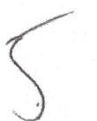

| | SERVICE FOR |  |  |
| :--: | :--: | :--: | :--: |
| GOLD COAST REST CORP |  |  | PAGE 1 of 3 |
| 2 MIDDLENECK RD | Feb 7, 2018 to Mar 8, 2018 |  |  |
| ROSLYN NY 11576 | ACCOUNI NUMBER | BLACK MATH | ABOUR 1905 |
|  | 29760-25002 | Apr 5, 2018 | \$ 3,408.11 |
| www.nationalgridus.com |  |  |  |
| CUSTOMER SERVICE |  |  |  |
| 1-800-930-5003 |  |  |  |
| Minutes-Fixley: 9/88/9/99 |  |  |  |
| GAS EMERGENCIES |  |  |  |
| 1-800-490-0045 |  |  |  |
| 24 Hours Day - 7 Days/Week |  |  |  |
| (Does not replace \#11 emergency |  |  |  |
| medical services) |  |  |  |
| PARA ESPAVEA |  |  |  |
| 1-800-930-5003 |  |  |  |
| CORRESPONDENCE ADDRESS |  |  |  |
| Accounts Processing KEDLI |  |  |  |
| One MetroTech Center |  |  |  |
| Brooklyn, NY 11201-3948 |  |  |  |
| PAYMENT ADDRESS |  |  |  |
| PO Box 11791 |  |  |  |
| Newark, NJ 07101-4791 |  |  |  |
| DATE BILL ISSUED |  |  |  |
| Mar 12, 2018 |  |  |  |

| Case Usage History |  |  |  |
| :-- | :--: | :--: | :--: |
| Month | Therm | Month | Therm |
| Mar 17 | 3096 | Oct 17 | 2794 |
| Apr 17 | 3303 | Nov 17 | 2998 |
| May 17 | 3190 | Dec 17 | 3410 |
| Jun 17 | 3105 | Jan 18 | 4260 |
| Jul 17 | 3147 | Feb 18 | 3860 |
| Aug 17 | 2542 | Mar 18 | 3414 |
| Sep 17 | 2878 |  |  |

| LOCATION | BALANCE |  |  |
| :--: | :--: | :--: | :--: |
| Previous Balance |  |  | 3,564.08 |
| Payment Received on MAR 7 (Check) |  | THANK YOU | $-3,564.08$ |
| Current Charges |  |  | $+3,408.11$ |
|  | Amount Due |  | \$ 3,408.11 |

To avoid late payment charges of $1.5 \%, \$ 3,408.11$ must be received by Apr 5 2018.

## SUMMARY OF CURRENT CHARGES

|  | DELIVERY | SUPPLY |
| :--: | :--: | :--: |
|  | SERVICES | SERVICES |
| Gas Service | 1,230.09 | 2,178.02 |
| Total Current Charges | \$ 1,230.09 | \$ 2,178.02 |

TOTAL
$3,408.11$
(4) Save time and money! Sign up for paperless billing and receive a $\$ 0.35$ credit on your monthly bill. Visit our website to enroll today.

Tougher Penalties Help Protect Utility Workers: Our field workers often face a number of challenges while performing their duties, but New York State has new laws in place to help better protect them. Now, any action by a member of the public that prevents a utility worker from performing their job, or causes the worker physical injury, is considered a felony.

## ACTIVITIES

SETHICE FOR
GOLD COAST REST CORP
2 MIDDLENECK RD
ROSLYN NY 11576

BILLING PERIOD
Feb 7, 2018 to Mar 8, 2018

ACCOUNT NUMBER:
29760-25002

PAGE 2 of 3
ARCONT NOMBER:
$29760-25002$

ABSORT ONE
$3,408.11

DETAIL OF CURRENT CHARGES

## Delivery Services

| Service Period | No. of   days | Current   Reading | Previous   Reading | Measured   CCF | $\begin{aligned} & \text { I } \\ & \text { I } \end{aligned}$ | Ineent   Factor | $\begin{aligned} & =\end{aligned}$ | Themes   Used |
| :--: | :--: | :--: | :--: | :--: | :--: | :--: | :--: | :--: |
| Feb 7 - Mar 8 | 29 | 69116 | 65801 | 3315 | 1.02997 |  | 3414 |  |
| METER NUMBER | 01209111 | NEXt SCHEDULED | READ DATE ON ON | ABOUT | Apr 9 |  |  |  |
| RATE | Rate 257 Gas | Non Resid | General Use | Delivery |  |  |  |  |
| Basic Service Charge (including first 2.9 therms) |  |  |  |  |  |  |  | 36.40 |
| Next 84.1 Therms |  |  | $1.5828 \times 84.1$ therms |  |  |  |  | 133.11 |
| Next 2813 Therms |  |  | $0.3254 \times 2813$ therms |  |  |  |  | 915.35 |
| Over/Last 514 Therms |  |  | $0.1953 \times 514$ therms |  |  |  |  | 100.38 |
| System Benefits Charge |  |  | $0.01843 \times 3414$ therms |  |  |  |  | 62.92 |
| Delivery Rate Adj |  |  | $-0.00041983 \times 3414$ therms |  |  |  |  | $-1.43$ |
| Transp Adj Chg |  |  | $-0.00917 \times 3414$ therms |  |  |  |  | $-31.31$ |
| NY State and Local Surcharges |  |  |  |  |  |  |  | 14.67 |
| Total Delivery Services |  |  |  |  |  |  |  | $\$ 1,230.09$ |

## Supply Services

| SUPPLIER | NATGASCO |
| :-- | :-- |
|  | 532 FREEMAN STREET |
|  | OGANGE 07050 |
| PHONE | 973-678-1800 ACCOUNT NO 68879578927573 |

| Gas Supply | $0.58731107 \times 3414$ therms | 2,005.08 |
| :-- | --: | --: |
| Sales Tax |  | 172.94 |
|  | Total Supply Services | $\mathbf{\$ 2 , 1 7 8 . 0 2}$ |  |

The image is a photo or illustration of a simple, curved line or mark. It appears to be a handwritten or drawn element, possibly resembling a signature or an abstract shape. There are no identifiable text or additional elements present in the image.

