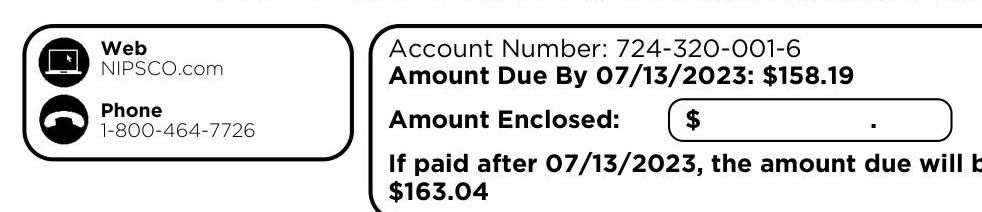
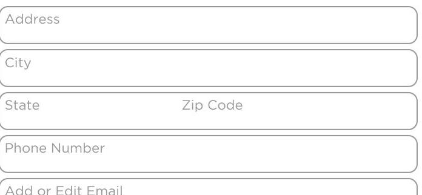

Contact Us
Phone
Customer Service
1-888-689-8665
7 A.M. - 4 P.M. CT Mon. - Fri.
Emergency Service 24/7
1-800-634-3524
For gas leaks or odor of gas
1-888-689-8665
Report electric lines down or power outage

Pay by credit/debit card
Call 1-855-763-6277 (Payments convenience fee will apply)

For hearing-impaired TDD
1-800-635-0952
Web
Make payments and access your account at NIPSCO.com

## Mail Payments

NIPSCO
P.O. BOX 13007

Merrilville, IN 46411-3007

## Authorized Payment Locations

Find locations online at NIPSCO.com

## Your Safety

## Gas Safety

In case of an emergency, such as odor of gas, carbon monoxide or fire:
1. Leave the building or area immediately.
2. Leave windows and doors in their positions and avoid doing anything that could cause a spark.
3. From a safe place, away from the building or area, call 911 and NIPSCO at 1-800-6343524.

Always Call 8-1-1 Before You Dig
If you're planning a home or landscaping project, call Indiana B11 at least two business days before digging. A representative will mark the approximate location of underground utility lines for free.

## 101111111111

Employee identification
All our employees and contractors carry photo identification. Ask to see it before allowing anyone who claims to be a utility representative into your home. Call the police if you see suspicious activity.

## Account Profile

Customer Name: $\quad$ Your Contact information: $\quad$ Type of Customer: Hmr Acquisition Company
DBA Hacienda Mexican Rt
Inc
1501 N Ironwood Dr
South Bend IN 46635-1841
hméton@aciendafiesta.com

Non-Residential
Gas Service
Customer CHOICE Program
Paperless Billing

- Is your contact information correct? Make all changes on the reverse side.

## Account Summary

Previous Balance on 05/24/2023
Payments Received on 06/05/2023
Balance on 06/23/2023
Charges for Gas Delivery This Period
Charges for Gas Supply This Period
Current Charges Due by 07/13/2023
$158.19
- If paid after 07/13/2023, a late payment charge of $\$ 4.85$ will be applied and your new current amount due will be $\$ 903.04$
- For more information regarding these charges, see the Detail Charges section.

If you are struggling to pay your bill we can help. Flexible payment plans are available to customers experiencing a financial hardship. Any customer who is having trouble paying his/her bill should visit www.NIPSCO.com or call 800-464-7726 to learn about payment arrangements and/or financial assistance programs.

## Monthly Message Board

## Streetlight Out? Report II

If you notice a streetlight that is broken or burned out, you can visit NIPSCO.com/StreetlightOut and submit a request to have it fixed. An interactive map identifies all of the streetlights owned or maintained by NIPSCO. If you do not have the exact pole number, you will be able to search for the streetlight by address or location. If you are unable to access the online tool, you can still call NIPSCO at 1-800-464-7726 to report the streetlight.

## Delivery \& Supply Summary

## NIPSCO

Beginning Balance \$94.97
Current Delivery Charges
Payments Received
Ending Balance \$74.00

## Archer Energy

Beginning Balance
Current Supply Charges
Payments Received
Ending Balance
\$94.97
\$74.00
\$94.97
\$74.00
\$88.50
\$84.19

- Please fold on the perforation below, detach and return with your payment.

The image is a section of a document or bill with the following details:

- **Web**: NIPSCO.com
- **Phone**: 1-800-464-7726
- **Account Number**: 724-320-001-6
- **Amount Due By 07/13/2023**: $158.19
- **Amount Enclosed**: [Blank space for amount]
- **If paid after 07/13/2023, the amount due will be**: $163.04

The image includes icons for web and phone contact options, with the web icon above the phone icon. The account details and payment information are to the right of the contact information.

HMR ACQUISITION COMPANY INC DBA HACIENDA MEXICAN RT INC 1501 N IRONWOOD DR SOUTH BEND IN 46635-1841

Account Number: 724-320-001-6
Amount Due By 07/13/2023: $\$ 158.19$
Amount Enclosed:
If paid after 07/13/2023, the amount due will be $\$ 163.04$

## Helpful Definitions

## Gas Service Definitions

Gas Delivery Charges are the costs of delivering gas to retail customers. The charges for these services are regulated and these services must be purchased from the local distribution company.
Therm (thm) is equal to 100,000 Btus and is the basic billing unit for gas.

## Legal Notices

Rate Schedule information is available upon request and at NIPSCO.com.

## 13 Month Usage History

The image is a UI sketch or wireframe. It contains several input fields arranged vertically. The fields are labeled as follows from top to bottom:

1. Address
2. City
3. State
4. Zip Code
5. Phone Number
6. Add or Edit Email

| Meter Number: |  |  |  | Usage Comparison - Therms |  |  |  |  |
| :--: | :--: | :--: | :--: | :--: | :--: | :--: | :--: | :--: |
| G0000055 |  |  |  | Month | Therms | Avg Temp | Therms Per Day |  |
| Service Address: |  |  |  | Jun 22 | 13.5 | $71.1^{*}$ | 0.5 |  |
| 1501 N Ironwood Dr |  |  |  | May 23 | 93.6 | $57.8^{*}$ | 3.2 |  |
| South Bend IN 46635-1841 |  |  |  | Jun 23 | 15.4 | $67.8^{*}$ | 0.5 |  |
| Meter Readings - 30 Billing Days |  |  |  |  |  |  |  |  |
| Actual Reading on 06/23 |  |  | 6256 |  |  |  |  |  |
| Actual Reading on 05/24 |  |  | 6241 |  |  |  |  |  |
| Gas Used (Ccf) |  |  | 15 |  |  |  |  |  |
| Conversion to Therms |  |  | 1,020 |  |  |  |  |  |
| Total Gas Used (Therms) |  |  | 15.4 |  |  |  |  |  |

## Detail Charges

## Charges for Gen Serv Gas-Small Htg CHOICE - Rate 221

## NIPSCO

Delivery Charges
\%69.16
Indiana Sales Tax
\%4.84
Total Charges for Gas Service This Period
$+\$ 74.00$

## Charges for Fixed Price Per Therm - Rate 34300

## Archer Energy

Gas Supply
\%78.68
Interstate Transportation and Storage Charges
\%0.00
Indiana Sales Tax
\%5.51
Total Charges for Service This Period
$+\$ 84.19$
Your gas supplier Archer Energy can be contacted at 1-844-795-7491.

## Message Board

- Take the seasonal highs and lows out by dividing your yearly energy use into 12 equal monthly payments - for budgeting that's a whole lot easier. Learn more at NIPSCO.com/BudgetPlan.
- Never worry about missing a payment or writing a check again by enrolling in Automatic Payment today at NIPSCO.com.

The image is a UI sketch or wireframe. It contains several input fields arranged vertically. The fields are labeled as follows from top to bottom:

1. Address
2. City
3. State
4. Zip Code
5. Phone Number
6. Add or Edit Email

## Whone Number

Add or Edit Email

## Message Board

- Take the seasonal highs and lows out by dividing your yearly energy use into 12 equal monthly payments - for budgeting that's a whole lot easier. Learn more at NIPSCO.com/BudgetPlan.
- Never worry about missing a payment or writing a check again by enrolling in Automatic Payment today at NIPSCO.com.

