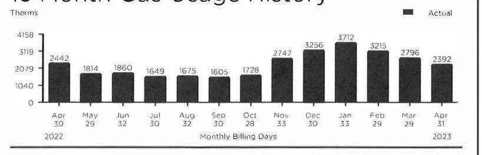

Contact Us
Phone
Customer Service
1-888-689-8665
7 A.M. - 4 P.M. CT Mon. - Fri
Emergency Service 24/7
1-800-634-3524
For gas leaks or odor of gas
1-888-689-8665
Report electric lines down or power outage

Pay by credit/debit card Call 1-855-763-6277 (Payments convenience fee will apply)

For hearing-impaired TDD
1-800-635-0952

Web
Make payments and access your account at NIPSCO.com

## Mail Payments

NIPSCO
P.O. BOX 13007

Merrillville, IN 46411-3007
Authorized Payment Locations Find locations online at NIPSCO.com

## Your Safety

## Report a Power Outage

To report an electric power outage, call us or visit NIPSCO.com/OutageCenter.

## Gas Safety

In case of an emergency, such as odor of gas, carbon monoxide or fire:

1. Leave the building or area immediately.
2. Leave windows and doors in their positions and avoid doing anything that could cause a spark.
3. From a safe place, away from the building or area, call 911 and NIPSCO at 1-800-6343324.

Always Call 8-1-1 Before You Dig
If you're planning a home or landscaping project, call Indiana 811 at least two business days before digging. A representative will mark the approximate location of underground utility lines for free.

## 11111111111111111111111111111111111111111111111111111111111111111111111111111111111111111111111111111111111111111111111111111111111111111111111111111111111111111111111111111111111111111111111111111111

Employee identification
All our employees and contractors carry photo identification. Ask to see it before allowing anyone who claims to be a utility representativeinto your home. Call the police if you see suspicious activity.

## Helpful Definitions

## Gas Service Definitions

Gas Delivery Charges are the costs of delivering gas to retail customers. The charges for these services are regulated and these services must be purchased from the local distribution company.
Therm (thm) is equal to 100,000 BtUs and is the basic billing unit for gas.

## Electric Service Definitions

Customer Charges cover basic costs associated with providing service.
Energy Use Charges are calculated based on your monthly usage. Fuel Charges incurred in the generation and acquisition of electricity are passed through to customers without markup.
Kilowatt-Hour (kwh) is equal to 1,000 watts used for one hour and is the basic billing unit for electricity.
DG Billing Credit - Dollar credit determined by multiplying the energy delivered by the Marginal DG Price.

## Legal Notices

Rate Schedule information is available upon request and at NIPSCO.com.

## Change Contact Information

By providing NIPSCO a telephone number, it enables us to call you about your utility service, future service appointments and other important information pertaining to your account and you're agreeing to receive autodialed and prerecorded voice calls. Please notify us if you wish to opt out or if you no longer use this number. Thank you in advance.

## 13 Month Gas Usage History

The image is a bar chart titled "13 Month Gas Usage History." It displays the monthly gas usage in therms over a period from April 2022 to April 2023. The y-axis is labeled "Therms" with values ranging from 0 to 4158. The x-axis is labeled "Monthly Billing Days" with each month and the number of billing days indicated below the bars.

The data points for each month are as follows:

- Apr 2022: 2442 therms
- May 2022: 1814 therms
- Jun 2022: 1860 therms
- Jul 2022: 1649 therms
- Aug 2022: 1675 therms
- Sep 2022: 1605 therms
- Oct 2022: 1728 therms
- Nov 2022: 2747 therms
- Dec 2022: 3256 therms
- Jan 2023: 3712 therms
- Feb 2023: 3215 therms
- Mar 2023: 2796 therms
- Apr 2023: 2392 therms

The chart uses a solid black color to represent "Actual" usage. This provides a yearly usage breakdown (monthly-based).

|  | Usage Comparison - Therms |  |  |  |  |  |  |  |
| :--: | :--: | :--: | :--: | :--: | :--: | :--: | :--: | :--: |
|  | Month |  |  |  |  |  |  |  |
|  |  |  |  |  |  |  |  |  |
| 2145 Karwick Rd | 2.4421 |  |  |  |  |  |  |  |
| Long Beach IN 46360 | Mar 23 | 2,796.8 |  |  |  |  |  |  |
|  | Apr 23 | 2,392.4 |  |  |  |  |  |  |
|  |  |  |  |  |  |  |  |  |
|  |  |  |  |  |  |  |  |  |

[^0]
[^0]:    ${ }^{1}$ Take the seasonal highs and lows out by dividing your yearly energy use into 12 equal monthly payments - for budgeting that's a whole lot easier. Learn more at NIPSCO.com/BudgetPlan.

    - Never worry about missing a payment or writing a check again by enrolling in Automatic Payment today at NIPSCO.com.

| Detail Charges |  |
| :--: | :--: |
| Charges for General Serv Gas-Small CHOICE - Rate 221 |  |
| NIPSCO |  |
| Delivery Charges | $\$ 550.62$ |
| Total Charges for Gas Service This Period | $+\$ 550.62$ |
| Charges for Fixed Price Per Therm - Rate 34300 |  |
| Archer Energy |  |
| Gas Supply | $\$ 1,704.91$ |
| Interstate Transportation and Storage Charges | $\$ 0.00$ |
| Total Charges for Service This Period | $+\$ 1,704.91$ |
| - This meter is Indiana sales tax exempt |  |
| - Your gas supplier Archer Energy can be contacted at 1-844-795-7491. |  |
| Charges for General Service Elec Medium - Rate 823 |  |
| Energy Use Charges | $\$ 3,822.42$ |
| Demand Charge | $\$ 1.719 .60$ |
| Cost of Fuel Adjustment | $\$ 1.481.07$ |
| Resource Adequacy Adjustment | $\$ 0.95$ |
| RTO Adjustment Charge | $\$ 181.18$ |
| Demand Side Management | $\$ 267.84$ |
| Federally Mandated Cost Adjustment | $\$ 0.00$ |
| TOBIC Ele Sys Improvement | $\$ 258.29$ |
| Indiana Sales Tax | $\$ 541.06$ |
| Total Charges for Electric Service This Period | $+\$ 8,270.51$ |
| Total Current Utility Charges | $\$ 10,526.04$ |

