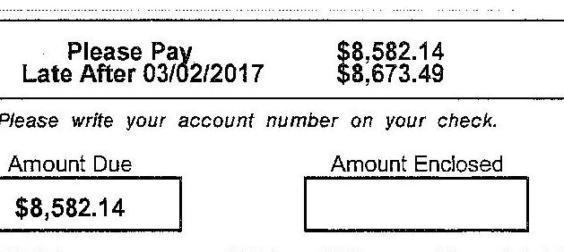

## PEOPLES GAS

NATURAL GAS DELIVERY
www.peoplesgasdelivery.com

| Bill Date | Account Number | Payment Due Date | Amount Due |
| :--: | :--: | :--: | :--: |
| 08/01/2017 | 0609218381-00002 | 09/06/2017 | \$533.01 |

Customer Name
Service Address

Contract Number
Activity Since Last Bill
Previous Balance 07/19/2017
Payment Received 07/24/2017
Late Payment Charge 08/01/2017
Balance
Total Current Charges
Total Current Balance
Rate 2 - Gen Sw. Mtr Class 2 Non-Htg
Meter Number P1902824

Therm Conversion $110 \times 1.036$ BTU Factor $=114.0$ Therms

## Delivery Charge

Customer Charge
Under 5000 Therms
Storage Banking Charge
HUB Credit Gas Charge
Natural Gas Savings Program
Environmental Charge
Standby Demand Charge
Volume Balancing Adjustment
Qualified Infrastructure Plant Charge
Tax
Chicago Municipal Tax
Chicago Gas Use Tax
State Tax
$2.95 \times 1.1204$
$110$
$561.14$
$126$ Therms at $\$ 0.00020$
114 Therms at $\$ 0.01210$
114 Therms at $\$ 0.01920$
4.7 Therms at $\$ 0.239400$
114 Therms at $\$ 0.00110$
13.63\% of $\$ 77.88$
8.24\% of $\$ 95.69$
114 Therms at $\$ 0.063000$
$0.1 \%$ of $\$ 95.69$
\$533.01
\$533.01

Account Summary
Billing Period: 06/01/2017 to 07/14/2017
JUL 2017
Billing Days
Avg Daily Temp
$72^{\circ} \mathrm{F}$
$72^{\circ} \mathrm{F}$
$281.2 \quad 191.3$
Avg. Theims/Day
6.4
5.4

Actual Reading 07/14/2017
Estimated Reading 07/01/2017
Pressure Correction Factor
Gas Used (CCF)
$7749$
$-7651$
98
$x 1.1204$
110

$561.14$
\$18.57
\$0.77

$50.02$
\$1.38
\$2.19
\$1.13
\$10.62

$8.24 \%$ of $\$ 95.69$
114 Therms at $\$ 0.063000$
$\$ 7.18$
\$0.10

866-556-6002
\$66-556-6003

800-264-8026
866-556-6002
866-556-6003

800-264-8026
866-556-6002
866-556-6003

800-264-8026
866-556-6002
866-556-6003

800-264-8026
866-556-6002
866-556-6003

800-264-8026
866-556-6002
866-556-6003

800-264-8026
866-556-6002
866-556-6003

800-264-8026
866-556-6002
866-556-6003

800-264-8026
866-556-6002
8000053301

| Bill Date | Invoice Number | Payment Due Date | Amount Due |
| :--: | :--: | :--: | :--: |
| 08/16/2017 | 2199618828-00000 | 09/06/2017 | \$789.90 |

Customer Name Mailing Address

POINTE MAPLE
C/O C/O SHP MAMAGEMENT, ACCOUNT PAYABLE 7 THOMAS DR
CUMBERLAND FORESIDE ME 04110-1318

Welcome to your Summary Bill.
If Paying Total Amount Due: Please send your payment with the Summary Bill payment,thub provided below.
If Making a Partial Payment: Please indicate the payment amount for each account on the payment stubs provided, and return the stubs with your payment.

Total for all 3 accounts is
\$789.90

| Account Number | Accounts included in this mailing |  |
| :-- | :-- | --: |
| 0609218381-00001 | POINTE MAPLE | $\$ 0.00$ |
|  | 55357 GAS TRANSPORTATION CONTRACT |  |
|  | CHICAGO IL 60601-6207 |  |
| 0609218381-00002 | POINTE MAPLE | $\$ 533.01$ |
|  | 150 W MAPLE ST FL 1 |  |
|  | CHICAGO IL 60610-5433 |  |
| 0609218381-00002 | POINTE MAPLE | $\$ 250.99$ |
|  | 150 W MAPLE ST FL 1 |  |
|  | CHICAGO IL 60610-5433 |  |

INVOICE NUMBER: 2199618828-00000
Page 1 of 6
PGLING
141
$118 \mid$
PE@PLES GAS*
NATURAL GAS DELIVERY
Invoice Number: 2199618828-00000

The image is a section of a document, likely an invoice or billing statement. It contains the following text:

- "Amount Due By 09/06/2017 $789.90"
- "A 1.5% late fee may be charged on any unpaid balance"
- "Please write your invoice number on your check"
- "Amount Enclosed" (with a blank space below for writing the amount)

The layout shows the due date and amount due at the top, followed by a note about late fees, a reminder to include the invoice number on the check, and a section for indicating the amount enclosed.

## PE@PLES GAS

NATURAL GAS DELIVERY

Customer Questions
24 -Hour Gas Emergencies
En Español

800-264-8026
866-556-6002
866-556-6003
www.peoplesgasdelivery.com

| Bill Date | Account Number | Payment Due Date | Amount Due |
| :--: | :--: | :--: | :--: |
| 08/19/2017 | 0609218381-00002 | 09/06/2017 | \$250.99 |

Customer Name
POINTE MAPLE
Service Address
FL 1
150 W MAPLE ST
CHICAGO IL 60610-5433
Contract Number
460008150

## Activity Since last Bill

Previous Balance 08/01/2017
PGL - MISCELLANEOUS ADJ 08/03/2017
Payment Received 08/07/2017
Payment Received 08/14/2017
Balance
Total Current Charges
Total Current Balance
Rate 2 - Gen Swc Mtr Class 2 Non-Htg
Meter Number P1902824

|  | Estimated Reading 08/01/2017 | 7803 |
| :--: | :--: | :--: |
|  | Actual Reading 07/14/2017 | $-7749$ |
|  | Pressure Correction Factor | $x 1.1204$ |
|  | Gas Used (CCF) |  |
|  |  | \$74.24 |
|  | 63.2 |  |
| Customer Charge | 63.2 |  |
| Under 5000 |  |  |
| Storage Banking Charge | 63.2 |  |
| HUB Credit Gas Charge | 63.2 |  |
| Natural Gas Savings Program | 63.2 |  |
| Environmental Charge | 63.2 |  |
| Standby Demand Charge | 96.7 |  |
| Volume Balancing Adjustment | 63.2 |  |
| Qualified Infrastructure Plant Charge | 13.63\% of $\$ 82.39$ | $\$ 11.23$ |
| Tax |  |  |
| Chicago Municipal Tax | 8.24\% of $\$ 121.75$ | $\$ 10.03$ |
| Chicago Gas Use Tax | 63.2 |  |
| State Tax | 0.1\% of $\$ 121.75$ | $\$ 0.12$ |

INVOICE NUMBER: 2199618828-00000
Page 5 of 6
PGLLRG
$145 \quad(0)$

Please return this stub with your payment.
PE@PLES GAS*
NATURAL GAS DELIVERY
Account Number: 0609218381-00002

POINTE MAPLE
C/O C/O 3HP MAMAGEMENT, ACCOUNT PAYABLE 7 THOMAS DR
CUMBERLAND FORESIDE ME 04110-1318

Peoples Gas
PO Box 2968
Milwaukee, WI 53201-2968

Account Summary
Billing Period: 07/01/2017 to 07/31/2017
JUC 2017
Billing Days
Avg Daily Temp.
Therms Used
Avg. (Therms/Day)

| 31 | 61 |
| :--: | :--: |
| 75. ${ }^{\circ} \mathrm{F}$ | $74{ }^{\circ} \mathrm{F}$ |
| 177.2 | 387.5 |
| 5.7 | 6.4 |

|  |  |
| :-- | :-- |
|  |  |
|  |  |
|  |  |
|  |  |
|  |  |
|  |  |
|  |  |
|  |  |
|  |  |
|  |  |
|  |  |
|  |  |

# PE@PLES GAS* 

NATURAL GAS DELIVERY

www.peoplesgasdelivery.com

| Bill Date | Invoice Number | Payment Due Date | Amount Due |
| :--: | :--: | :--: | :--: |
| 05/25/2017 | 2127423441-00000 | 06/15/2017 | \$4,288.07 |

Customer Name
Mailing Address

MAPLE POINTE
C/O C/O SHP MANAGEMENT
7 THOMAS DR
CUMBERLAND FORESIDE ME 04110-1318

## Welcome to your Summary Bill.

If Paying Total Amount Due: Please send your payment with the Summary Bill payment stub provided below.
If Making a Partial Payment: Please indicate the payment amount for each account on the payment stubs provided, and return the stubs with your payment.

Total for all 2 accounts is
\$4,288.07
Account Number
0604790727-00001
0604790727-00002

## Accounts included in this mailing

MAPLE POINTE
42855 GAS TRANSPORTATION CONTRACT CHICAGO IL 60601-6207
MAPLE POINTE
150 W MAPLE ST BLDG
CHICAGO IL 60610-5433

Q4|0| 17 - 04/30/17
04/20/17 SOP www.updatc will work on getting usage, return a service periods on future in 201805

If $O$ PLES GAS*
iATURAL GAS DELIVERY

Page 1 of 5
Please return this stub with your payment.

PGLLRG
6046
(B)

## 'E @PLES GAS*

Account Number: 0604790727-00001

## NO PAYMENT DUE

Thank You!

## 'i want to pledge $\$ 1$ per month to the Share the Warmth program, which helps pay energy expenses for those in need. I've added $\$ 1$ to my payment.

# PEOPLES GAS 

NATURAL GAS DELIVERY
www.peoplesgasdelivery.com

| Bill Date | Invoice Number | Payment Due Date | Amount Due |
| :--: | :--: | :--: | :--: |
| 07/19/2017 | 2166752533-00000 | 08/09/2017 | \$14,747.48 |

Customer Name
Mailing Address

MAPLE POINTE
C/O C/O SHP MANAGEMENT
7 THOMAS DR
CUMBERLAND FORESIDE ME 04110-1318

## Welcome to your Summary Bill.

If Paying Total Amount Due: Please send your payment with the Summary Bill payment stub provided below.
If Making a Partial Payment: Please indicate the payment amount for each account on the payment stubs provided, and return the stubs with your payment.

Total for all 2 accounts is
$\$ 14,747.48$
Account Number
0604790727-00001
0604790727-00002

Accounts included in this mailing
MAPLE POINTE
42855 GAS TRANSPORTATION CONTRACT
CHICAGO IL 60601-6207
MAPLE POINTE
150 W MAPLE ST BLDG
CHICAGO IL 60610-5433
$14,747.48$

The image is a photo or illustration of a stamp. The text on the stamp is upside down and reads:

"RECEIVED
ON THIS DATE
JUL 25 2017"

INVOICE NUMBER: 2166752533-00000
Page 1 of 4
PGLLRG
2522
(18)

Please return this stub with your payment.
PEOPLES GAS*
NATURAL GAS DELIVERY
Invoice Number: 2166752533-00000

| Amount Due By | 08/09/2017 | \$14,747.48 |
| :--: | :--: | :--: |
| A 1.5\% late fee may be charged on any unpaid balance |  |  |
| Please write your invoice number on your check |  |  |
| Amount Enclosed |  |  |
|  |  |  |

## Peoples Gas

PO Box 2968
Milwaukee, WI 53201-2968

| PEEPLES GAS* |  | Customer Questions | 800-264-8026 |
| :--: | :--: | :--: | :--: |
| NATURAL GAS DELIVERY |  | 24-Hour Gas Emergencies En Español | 866-556-6002 866-556-6003 |
|  |  | www.peoplesgasdelivery.com | $14.174 .63$ |
| Bill Date | Account Number | Payment Due Date | Amount Dut |
| 07/19/2017 | 0604790727-00002 | 08/09/2017 | \$14,747.48 |

| Customer Name | MAPLE POINTE |
| :--: | :--: |
| Service Address | BLDG |
|  | 150 W MAPLE ST |
|  | CHICAGO IL 60610-5433 |
| Pool Number | 460006393 |
| Contract Number | 460005753 |
| Activity Since Last Bill |  |
| Previous Balance 06/28/2017 | \$8,008.53 |
| Late Payment Charge 07/01/2017 | \$64.32 |
| Balance | \$8,072.85 |
| Total Current Charges | \$6,674.63 |
| Total Current Balance | \$14,747.48 |

Rate 2 - Gen Svc Mtr Class 3 Heating
Meter Number0827860
Actual Reading 07/01/2017
2277722
Actual Reading 06/01/2017
Gas Used (CCF)
21268

Therm Conversion 21268 x 1.035 BTU Factor $=22012.4$ Therm

## Delivery Charge

Customer Charge
Under 5000 Therms
Over 5000 Therms
Storage Banking Charge
HUB Credit Gas Charge
Natural Gas Savings Program
Demand Device Charge
Environmental Charge
Storage Gas Charge
Volume Balancing Adjustment
Qualified Infrastructure Plant Charge
Tax
Chicago Municipal Tax
Chicago Gas Use Tax
State Tax

| 5,000 Therms at $\$ 0.16289$ | $\$ 814.45$ |
| :-- | --: |
| 17,012.5 Therms at $\$ 0.09577$ | $\$ 1,629.29$ |
| 44,888 Therms at $\$ 0.006100$ | $\$ 273.82$ |
| 22,012.5 Therms at - $\$ 0.00020$ | $\$ 4.40$ |
| 22,012.5 Therms at $\$ 0.01210$ | $\$ 266.35$ |
| 1 Count at $\$ 33$ | $\$ 33.00$ |
| 22,012.5 Therms at $\$ 0.01890$ | $\$ 416.04$ |
| 44,888 Therms at $\$ 0.005600$ | $\$ 251.37$ |
| 22,012.5 Therms at - $\$ 0.00110$ | - $\$ 24.21$ |
| 12.54\% of $\$ 3,073.12$ | $\$ 385.37$ |
| 8.24\% of $\$ 4393.15$ | $\$ 362.00$ |
| 22012.5 Therms at $\$ 0.063000$ | $\$ 1,386.79$ |
| $0.1 \%$ of $\$ 4393.15$ | $\$ 4.39$ |

## PEEPLES GAS

NATURAL GAS DELIVERY

Customer Questions
24-Hour Gas Emergencies
En Español

800-264-8026
866-556-6002
866-556-6003
www.peoplesgasdelivery.com

| Bill Date | Account Number | Payment Due Date | Amount Due |
| :--: | :--: | :--: | :--: |
| 07/19/2017 | 0604790727-00002 | 08/09/2017 | $\$ 14,747.48$ |

State Gas Use Tax
22012.5 The
Total Gas Service Charges
Total Current Charges
\$528.30
\$6,674.63
\$6,674.63

## Messages

You can view your bills online by enrolling in the Your Account section of our website.
Your account has a past-due balance. Please pay the past-due amount today. Continued late payments could result in a negative credit rating, deposit requests, and eventual disconnection of service.

The image is a photo of a utility bill from "PEOPLES GAS NATURAL GAS DELIVERY." Key details include:

- **Bill Date:** 06/20/2017
- **Account Number:** 0609218381-00002
- **Payment Due Date:** 07/11/2017
- **Amount Due:** $418.64

**Customer Information:**
- **Customer Name:** POINTE MAPLE
- **Service Address:** FL 1, 150 W MAPLE ST, CHICAGO IL 60610-5493
- **Pool Number:** 460006713
- **Contract Number:** 4600081SO

**Activity Since Last Bill:**
- **Previous Balance 05/23/2017:** $196.61
- **Balance:** $196.61
- **Total Current Charges:** $222.03
- **Total Current Balance:** $418.64

**Rate Information:**
- **Rate 2 - Gen Svc Mtr Class 2 Non-Htg**
- **Meter Number:** P1902824

**Account Summary:**
- **Billing Period:** 05/01/2017 to 05/31/2017
- **Billing Days:** 31 (May 2017), 61 (May 2016)
- **Avg Daily Temp:** 57°F (May 2017), 54°F (May 2016)
- **Therms Used:** 182.2 (May 2017), 358.7 (May 2016)
- **Avg Therms/Day:** 5.9

**Estimated Readings:**
- **06/01/2017:** 7506
- **05/01/2017:** -7349

**Charges:**
- **Customer Charge:** $29.64
- **Under 5000 Therms:** 182.2 Therms at $0.16289 = $29.64
- **Storage Banking Charge:** 270 Therms at $0.005700 = $1.54
- **Total Delivery Charge:** $131.41

**Taxes:**
- **Chicago Municipal Tax:** 8.24% of $190.31 = $15.68
- **Chicago Gas Use Tax:** 182.2 Therms at $0.063000 = $11.48
- **State Tax:** 0.1% of $190.31 = $0.19

**Additional Information:**
- **Pressure Correction Factor:** x 1.1204
- **Gas Used (CCF):** 176
- **Therm Conversion:** 176 x 1.035 BTU Factor = 182.2 Therms

Stamped dates on the bill indicate it was received on "JUN 29 2017" and "JUN 30 2017."

INVOLCE NUMBER: 2144465378 -00000
Page 3 of 4
PCLLNG
3140
(c)

PLEOPLES GAS*
NATURAL GAS DELIVERY

PPIPLES GAS
NATURAL GAS DELIVERY

Account Number: 0609218381-00002

| Amount Due By | $07 / 11 / 2017 | \$418.64 |
| :--: | :--: | :--: |
| A 1.5\% late fee may be charged on any unpaid balance |  |  |
| Please write your account number on your check |  |  |
| Amount Enclosed |  |  |
|  |  |  |

A 1.5\% late fee may be charged on any unpaid balance

Please write your account number on your check
Amount Enclosed
$\square$

## PEOPLES GAS

NATURAL GAS DELIVERY

Customer Questions
24-Hour Gas Emergencies
En Español

## 800-264-8026

866-556-6002
866-556-6003
www.peoplesgasdelivery.com

| Bill Date | Account Number | Payment Due Date | Amount Due |
| :--: | :--: | :--: | :--: |
| 06/28/2017 | 0604790727-00002 | 07/19/2017 | \$8,008.53 |
| Customer Name | MAPLE POINTE | Account Summary |  |
| Service Address | BLDG   150 W MAPLE ST   CHICAGO IL 60610-1433 |  |  |
|  |  | Billing Period: 05/01/2017 to 05/31/2017 |  |
| Pool Number | 460006393 |  |  |
| Contract Number | 460005753 |  |  |
|  |  | Billing Days | 33 61 |
| Activity Since Last Bill |  | Avg Daily Temp | \$7*F | $54 * F$ |
| Previous Balance 05/25/2017 | \$4,288.07 |  |  |  |
| Balance | \$4,288.07 | Avg Thermas/Day | 292.4 | 485.0 |
| Total Current Charges | \$5,750.46 |  |  |
| Total Current Balance | \$8,008.53 |  |  |

## Rate 2 - Gen Svc Mtr Class 3 Heating

Meter Number 0827860

Therm Conversion 8759 x 1.035 BTU Factor $=9065.6$ Therm

## Delivery Charge

Customer Charge
Under 5000 Therms
Over 5000 Therms
Storage Banking Charge
HUB Credit Gas Charge
Natural Gas Savings Program
Demand Device Charge
Environmental Charge
Storage Gas Charge
Volume Balancing Adjustment
Qualified Infrastructure Plant Charge
Tax
Chicago Municipal Tax
Chicago Gas Use Tax
late Tax

Actual Reading 06/01/2017
Actual Reading 05/01/2017
Gas Used (CCF)
\$256454
$-2247695$
8759

5,000 Therms at $\$ 0.16289$
4,065.7 Therms at $\$ 0.09577$
44,888 Therms at $\$ 0.005700$
9,065.7 Therms at \$0.00028
9,065.7 Therms at \$0.00005
1 Count at $\$ 33$
9,065.7 Therms at $\$ 0.00000$
44,888 Therms at $\$ 0.00000$
9,065.7 Therms at \$0.00010
11.08\% of $\$ 1,829.67$
8.24\% of $\$ 2706.05$
\$222.98
9065.7 Therms at $\$ 0.063000$
\$571.14
0.1\% of $\$ 2706.05$
\$2.71

The image is a photo of a section of a bill detailing charges and taxes related to natural gas usage. It includes a list of charges with corresponding amounts and rates for different therm usages. There is a "RECEIVED" stamp dated "JUL 05 2017" over part of the text. The charges are itemized as follows:

- Customer Charge
- Under 5000 Therms: 5,000 Therms at $0.16289 = $352.26
- Over 5000 Therms: 4,065.7 Therms at $0.09577 = $814.45
- Storage Banking Charge: 44,888 Therms at $0.005700 = $389.37
- HUB Credit Gas Charge: 9,065.7 Therms at $0.00028 = $255.86
- Natural Gas Savings Program: 9,065.7 Therms at $0.00005 = $1.81
- Demand Device Charge: 1 Count at $33 = $33.00
- Environmental Charge: 9,065.7 Therms at $0.00000 = $224.83
- Storage Gas Charge: 44,888 Therms at $0.00000 = $33.00
- Volume Balancing Adjustment: 9,065.7 Therms at $0.00010 = $189.47
- Qualified Infrastructure Plant Charge: 11.08% of $1,829.67 = $255.86
- Chicago Municipal Tax: 8.24% of $2706.05 = $202.73
- Chicago Gas Use Tax: 9065.7 Therms at $0.063000 = $222.98
- Late Tax: 0.1% of $2706.05 = $571.14

The amounts are aligned in two columns, with the description of the charge on the left and the corresponding amount on the right.
"EOPLES GAS"
ATURAL GAS DELIVERY

Account Number: 0604790727-00002

## $*$ EOPLES GAS*

Please return this stub with your payment.

## $*$ EOPLES GAS*

A1URAL GAS DELIVERY

Acrount Number: 0604790727-00002

## $*$ EOPLES GAS

## $07 / 19 / 2017$ \$8,008.53

A 1.5\% late fee may be charged on any unpaid balance
Please write your account number on your check

## Amount Enclosed

$\square$

| Bill Date | Account Number | Payment Due Date | Amount Due |
| :--: | :--: | :--: | :--: |
| 04/14/2017 | 9500010489467 | 05/01/2017 | \$6,658.71 |
| Name | Maple Pointe |  |  |
| Account Number | 9500010489467 |  |  |
| Pool Number | 82032 |  |  |
| Service Address | 150 W Maple ST Bldg Chicago IL 60610-5403 |  |  |
| Service Classification | Rate 2 - General Service - Heating |  |  |

Activity Since Last Bill
Previous Balance
Thank You For Your Payment
Balance

## Delivery Charge

Customer Charge - Meter Class 3 First 5000 Therms
$\$ 8.403 .20$
$\$ 8.403 .20$
$\$ 0.00$

| $\$ .16289 \times$ | 5.000 .00 | Therms $=$ |
| :-- | --: | --: |
| $\$ .08677 \times$ | 16.169 .89 | Therms $=$ |
| $\$ .00570 \times$ | 48.391 .00 | Therms $=$ |

\$362.26
\$814.45
\$1,548.59
\$275.83
\$2,991.13

Natural Gas Savings Pgm
Demand Device Chrg
Environmental Charge
Hub Credit Gas Charg
Storage Gas Charge
Qual Infrastructure Charge
\$3,018.83 x
\$2,991.13
\$625.01
\$33.00
\$491.14
\$21.75
\$251.63
\$185.96

## Taxes

Chicago Municipal Tax
Chicago Gas Use Tax
State Tax
\$4,446.12 x
\$4,446.12 x
\$4,446.12 x
\$.063 x
\$4,446.12 x
\$.024 x

| 8.24 \% |  |
| :-- | --: |
| 21.169 .89 | Therms $=$ |
| 0.10 | $\approx$ |
| 0.10 | $\approx$ |
| 21.169 .89 | Therms $=$ |
|  | $\$ 024.2$ |
| 8.24 \% |  |
| 21.169 .89 | Therms $=$ |
| 0.10 | $\approx$ |
| 21.169 .89 | Therms $=$ |
| 21.169 .89 | Therms $=$ |
|  | $\$ 6.658 .71$ |
| $\$ 6.658 .71$ |  |

Total Current Charges
AMOUNT DUE
\$6,658.71

## Messages

You can learn about your rights as a utility customer in Illinois by visiting peoplesgasdelivery.com and clicking on Customer Rights \& Responsibilities. You also can review your rights by contacting the Consumer Services Division of the Illinois Commerce Commission at 800-524-0795 or view them at icc.illinois.gov.

To pay your gas bill by credit card, call 1-866-295-0086. A convenience fee will apply.

## PEEPLES GAS

ACCOUNT NUMBER: 9500010489467

## $\$ 6,658.71$

\$6,730.97
Please write your account number on your check.

Amount Due
Amount Enclosed

## MAPLE POINTE

C/C C/O SHP MANAGEMENT
7 THOMAS DR
CUMBERLAND FORESIDE ME 04110-1318

## PEOPLES GAS

PO BOX 2968
MILWAUKEE WI 53201-2968

Yes, I would like to pledge one dollar per month to the Share the Warmth fund which helps low-income customers pay energy bills. I have added one dollar to my payment. Check this box $\rightarrow$ $\qquad$
Please do not write or stamp below this line.

## PEOPLES GAS

NATURAL GAS DELIVERY

| Bill Date | Account Number | Payment Due Date | Amount Due |
| :--: | :--: | :--: | :--: |
| 04/14/2017 | 1500010489458 | 05/01/2017 | \$213.87 |

Name
Account Number
Post Number
Service Address
Service Classification

## Activity Since Last Bill

Previous Balance
Thank You For Your Payment
Balance

## Delivery Charge

Customer Charge - Meter Class 2
Under 5000 Therms
Storage Banking Charge
$1500010489458$
$52808$
$150 \mathrm{~W}$ Maple ST FL 1
Chicago IL 60610-5433
Rate 2 - General Service - Non-Heating

## Taxes

Chicago Municipal Tax
Chicago Gas Use Tax
State Tax
State Gas Use Tax

## Total Current Charges

## AMOUNT DUE

## Messages

You can learn about your rights as a utility customer in Illinois by visiting peoplesgasdelivery.com and clicking on Customer Rights \& Responsibilities. You also can review your rights by contacting the Consumer Services Division of the Illinois Commerce Commission at 800-524-0795 or view them at icc.illinois.gov.

To pay your gas bill by credit card, call 1-866-295-0086. A convenience fee will apply.

## PEOPLES GAS

ACCOUNT NUMBER: 1500010489458

## PEOPLES GAS

ACCOUNT NUMBER: 1500010489458

## People's

Late After 05/01/2017

## $213.87

\$216.84
Please write your account number on your check.

Amount Due
Amount Enclosed
\$213.87

Amount Enclosed

|  |  |
| :-- | :-- |
|  |  |
|  |  |
|  |  |
|  |  |
|  |  |
|  |  |
|  |  |
|  |  |

|  |  |
| :-- | :-- |
|  |  |
|  |  |
|  |  |
|  |  |
|  |  |
|  |  |
|  |  |
|  |  |
|  |  |
|  |  |
|  |  |
|  |  |
|  |  |
|  |  |
|  |  |
|  |  |
|  |  |
|  |  |
|  |  |
|  |  |
|  |  |
|  |  |
|  |  |
|  |  |
|  |  |
|  |  |
|  |  |
|  |  |
|  |  |
|  |  |
|  |  |
|  |  |
|  |  |
|  |  |
|  |  |
|  |  |
|  |  |
|  |  |
|  |  |
|  | 

| Bill Date | Account Number | Payment Due Date | Amount Due |
| :--: | :--: | :--: | :--: |
| 03/14/2017 | 1500010489458 | 03/29/2017 | \$204.43 |
| Name | Pointe Maple |  |  |
| Account Number | 1500010489458 |  |  |
| Paol Number | \$2908 |  |  |
| Service Address | 150 W Maple ST FL 1 |  |  |
|  | Chicago IL 60810-5433 |  |  |
| Service Classification | Rate 2 - General Service - Non-Heating |  |  |
| Activity Since Last Bill |  |  |  |
| Previous Balance |  | \$210.76 |  |
| Thank You For Your Payment |  | - \$210.76 |  |
| Balance |  |  |  |
| Delivery Charge |  |  |  |
| Customer Charge - Meter Class 2 |  | \$131.21 |  |
| Under 5000 Therms | \$16289 x | 154.22 Therms $=$ | $\$ 26.12$ |
| Storage Banking Charge | $\$ .00570 \times$ | 270.00 Therms $=$ | $\$ 1.54$ |
| Natural Gas Savings Pgm | \$.02480 x | 154.22 Therms $=$ | $\$ 3.82$ |
| Environmental Charge | \$.02350 x | 154.22 Therms $=$ | $\$ 3.82$ |
| Hub Credit Gas Charg | \$.00470 x | 154.22 Therms $=$ | $\$ 0.72$ |
| Standby Demand Chrg | \$.24910 x | 10.00 Therms $=$ | $\$ 2.49$ |
| Qual Infrastructure Charge | \$152.57 x | 5.10 \% | \$7.78 |
| Taxes |  |  |  |
| Chicago Municipal Tax | \$176.30 x | 8.24 \% $=$ | \$14.53 |
| Chicago Gas Use Tax | $\$ .063 \times$ | 154.22 Therms $=$ | $\$ 9.72$ |
| State Tax | \$176.30 x | 0.10 \% | \$0.18 |
| State Gas Use Tax | \$.024 x | 154.22 Therms $=$ | $\$ 3.70$ |
| Total Current Charges |  |  | \$264.43 |
| AMOUNT DUE |  |  | \$204.43 |

## Messages

You can learn about your rights as a utility customer in Illinois by visiting peoplesgasdelivery.com and clicking on Customer Rights \& Responsibilities. You also can review your rights by contacting the Consumer Services Division of the Illinois Commerce Commission at 600-524-0795 or view them at icc.illinois.gov.

During this billing period we obtained an actual reading from your meter. We then estimated usage from the actual reading date to your current billing date.

## PEEPLES GAS

ACCOUNT NUMBER: 1500010489458

## POINTE MAPLE

CIO C/O SHP MANAGEMENT
7 THOMAS DR
CUMBERLAND FORESIDE ME 04110-1318

## AS 204.43

\$204.43
\$207.29

Please write your account number on your check.

Amount Due
$\$ 204.43$

Amount Enclosed

Yes, I would like to pledge one dollar per month to the
Share the Warmth fund which helps low-income customers pay energy bills. I have added one dollar to my payment. Check this box $\rightarrow \square$

Please do not write or stamp below this line.

| Bill Date | Account Number | Payment Due Date | Amount Due |
| :--: | :--: | :--: | :--: |
| 03/14/2017 | 9500010489467 | 03/29/2017 | \$6,403.20 |
| Name | Maple Pointe |  |  |
| Account Number | 9500010489467 |  |  |
| Pool Number | \$2032 |  |  |
| Service Address | 150 W Maple ST Bldg Chicago IL 50610-5433 |  |  |
| Service Classification | Rate 2 - General Service - Heating |  |  |

Activity Since Last Bill
Previous Balance
Thank You For Your Payment
Balance
Delivery Charge
Customer Charge - Meter Class 3
First 5000 Therms
Cver 5000 Therms Storage Banking Charge

Natural Gas Savings Pgm
Demand Device Chrg
Environmental Charge
Hub Credit Gas Charg
Storage Gas Charge
Qual Infrastructure Charge

|  | $\$ 02480 \times$ | 19,565.64 | Therms $=$ | $\$ 485.23$ |
| :-- | :--: | :--: | :--: | :--: |
| $*$ | $\$ 33,00000 \times$ | 1.00 | $\times$ | $\$ 33.00$ |
| $*$ | $\$ .02350 \times$ | 19,565.64 | Therms $=$ | $\$ 459.79$ |
| $*$ | $\$ .00470 \times$ | 19,565.64 | Therms $=$ | $\$ 91.96$ |
| $*$ | $\$ .00590 \times$ | 48,391.00 | Therms $=$ | $\$ 285.51$ |
| $\$ 2,865.19 \times$ | 5.10 | $\%$ | $\times 146.12$ |  |

## Taxes

Chicago Municipal Tax
Chicago Gas Use Tax
State Tax
State Gas Use Tax

Total Current Charges
AMOUNT DUE

|  | $\$ 4,339.10 \times$ | 8.24 | $\%$ | $\$ 357.54$ |
| :-- | --: | --: | --: | --: |
| $*$ | $\$ .083 \times$ | 19,565.64 | Therms $=$ | $\$ 1,232.64$ |
| $*$ | $\$ 4,339.10 \times$ | 0.10 | $\%$ | $\$ 4.34$ |
| $*$ | $\$ .024 \times$ | 19,565.64 | Therms $=$ | $\$ 469.58$ |
|  |  |  |  | $\$ 2,064.10$ |

## $*$ * $*$ * * * * * * * * * * * * * * * * * * * * * * * * * * * * * * * * * * * * * * * * * * * * * * * * * * * * * * * * * * * * *$

## Messages

You can learn about your rights as a utility customer in Illinois by visiting peoplesgasdelivery.com and clicking on Customer Rights \& Responsibilities. You also can review your rights by contacting the Consumer Services Division of the Illinois Commerce Commission at 500-524-0795 or view them at icc.illinois.gov.

To pay your gas bill by credit card, call 1-866-295-0086. A convenience fee will apply.

## PEAPILES GAS

ACCOUNT NUMBER: 9500010489467

|  | Please Pay Late After 03/29/2017 | $\$ 6,403.20$ |
| :--: | :--: | :--: |
|  |  | $\$ 6,473.72$ |
| {Please write your account number on your check.} |  |  |
| Amount Due |  | Amount Enclosed |
| \$6,403.20 |  |  |

## MAPLE POINTE

C/O C/O EHP MANAGEMENT
7 THOMAS DR
CUMBERLAND FORESIDE ME 04110-1318

## PEOPLES GAS

PO BOX 2968
MILWAUKEE WI 53201-2968

|  |  |
| :-- | --: |
|  |  |
|  |  |
|  |  |
|  |  |
|  |  |
|  |  |
|  |  |
|  |  |
|  |  |
|  |  |
|  |  |
|  |  |
|  |  |
|  |  |
|  |  |
|  |  |
|  |  |
|  |  |
|  |  |
|  |  |
|  |  |
|  |  |
|  |  |
|  |  |
|  |  |
|  |  |
|  |  |
|  |  |
|  |  |
|  |  |
|  |  |
|  |  |
|  |  |
|  |  |
|  |  |
|  |  |
|  |  |
|  |  |
|  |  |
|  | 

# PENPLES GAS 

NATURAL GAS DELIVERY
www.peoplesgasdelivery.com

| Bill Date | Account Number | Payment Due Date | Amount Due |
| :--: | :--: | :--: | :--: |
| 01/16/2017 | 1500010489458 | 01/31/2017 | \$415.40 |
| Name | Points Maple |  |  |
| Account Number | 1600010489468 |  |  |
| Pool Number | 52908 |  |  |
| Service Address | 150 W Maple ST FL 1 Chicago IL 60610-5433 |  |  |
| Service Classification | Rate 2 - General Service - Non-Heating |  |  |

Activity Since Last Bill
Previous Balance
Late Payment Charge
Balance
$\$ 194.33$
Delivery Charge
Customer Charge - Meter Class 2
Under 5000 Therms
Storage Banking Charge
$\$ .0289 \mathrm{x}$
\$.16289 x
\$.00570 x
\$.02480 x
\$.02300 x
\$.00600 x
\$.41620 x
\$.00870 x
\$160.17 x
\$187.01 x
\$.063 x
\$187.01 x
\$.024 x
\$12.20 Therms $=$
\$70.00 Therms $=$
212.20 Therms $=$
212.20 Therms $=$
212.20 Therms $=$
212.20 Therms $=$
212.20 Therms $=$
212.20 Therms $=$
212.20 Therms $=$
212.20 Therms $=$
212.20 Therms $=$
212.20 Therms $=$
212.20 Therms $=$
212.20 Therms $=$
212.20 Therms $=$
\$24.87
\$1.54
\$1.54
\$5.09
\$221.97
\$15.41
\$13.37
\$0.19
\$5.09
\$221.97
\%415.40

## Messages

You can learn about your rights as a utility customer in Illinois by visiting peoplesgasdelivery.com and clicking on Customer Rights \& Responsibilities. You also can review your rights by contacting the Consumer Services Division of the Illinois Commerce Commission at 600-524-0795 or view them at icc.illinois.gov.

At the time of this statement, your account was past due. Please pay $\$ 415.40$ today. Continual late payments can result in deposit requests and even disconnection of service.

## People's Gas

Customer Inquiries
1-803-264-8026
Eewergencies
1-866-556-6062
En-Expertise
1-866-556-6063
Current Usage
Riding Pence Cams 21-3016-74 52-38-76 38-38-76

The image is a photo of a document, likely a utility bill or statement. The text on the document includes:

- **Current Usage:**
  - **Billing Period From:** 11-30-16 To 12-31-16
  - **31 Days**

- **Meter Reading:**
  - **Account Number:** P-190284
  - **Current Estimate:** 6807 on 12-31-16
  - **Previous Estimate:** 6624 on 11-30-16
  - **Difference:** 183 x 1.0095 Unit Factor
  - **Pressure Correction Factor:** 1.1204 = 205.932

- **Therm Conversion:**
  - 205.932 x 1.035 BTU Factor = 212.20 Therms

- **Average Daily:**
  - **Dec 2015:**
    - **Therms Used:** 5.82
    - **Temperature:** 39°F
  - **Dec 2016:**
    - **Therms Used:** 6.85
    - **Temperature:** 26°F

At the bottom, there is a stamp that reads "RECEIVED JAN 13 2017".

| Bill Date | Account Number | Payment Due Date | Amount Due |
| :--: | :--: | :--: | :--: |
| 01/16/2017 | 9500010489467 | 01/31/2017 | $\$ 8,761.83$ |
| Name | Maple Points |  |  |
| Account Number | 9500010489467 |  |  |
| Pool Number | 62022 |  |  |
| Service Address | 150 W Maple ST Bldg Chicago IL 60610-5433 |  |  |
| Service Classification | Rate 2 - General Service - Heating |  |  |

Activity Since Last Bill
Previous Balance
Thank You For Your Payment
Balance
Delivery Charge
Customer Charge - Meter Class 3
First 9000 Therms
Over 5000 Therms
Storage Banking Charge
Natural Gas Savings Pgm
Demand Device Chrg
Enviromental Charge
Hub Credit Gas Charg
Storage Gas Charge
Volume Balancing Adj
Qual Infrastructure Charge
$5,02480 \times$
$33,00000 \times$
$30,338.95 \quad$ Therms $=$
$30,338.95 \quad$ Therms $=$
$\$ 01140 \times$
$3,00870 \times$
$3,033.00 \times$
$5,051.05 \times$
$\$ .063 \times$
$\$ 0651.05 \times$
$\$ .024 \times$
$30,338.95 \quad$ Therms $=$
$\$ .024 \times$
$\$ .024 \times$
$5,000.00 \quad$ Therms $=$
$25,338.95 \quad$ Therms $=$
$48,391.00 \quad$ Therms $=$
$\$ 352.26$
$\$ 814.45$
$\$ 2,428.71$
$\$ 275.83$
$\$ 3,869.25$
$30,338.95 \quad$ Therms $=$
$\$ 752.41$
$\$ 33.00$
$\$ 697.80$
$\$ 9182.03$
$\$ 651.88$
$\$ 263.95$
$\$ 192.91$
$9465.65$
$\$ 1,911.35$
$\$ 65$
$\$ 728.13$
Total Current Charges
AMOUNT DUE
$5,761.83$
$58,761.83$

## Messages

You can learn about your rights as a utility customer in Illinois by visiting peoplesgasdelivery.com and clicking on Customer Rights \& Responsibilities. You also can review your rights by contacting the Consumer Services Division of the Illinois Commerce Commission at 800-524-0795 or view them at icc.illinois.gov.

To pay your gas bill by credit card, call 1-895-295-0086. A convenience fee will apply.

## Peoples Gas

Customer Inquiries
Emergencies
En Español
1-866-556-6002
Current Usage
Billing Period From 11-30-16 To 12-31-16
31 days

## Meter Reading

## Meter Number P1923041

Current Actual
Previous-Aidual
Difference

2140398
293131100000000000000000000000000000000000000000000000000000000000000000000000000000000000000000000000000000000000000000000000000000000000000000000000000000000000000000000000000000000000000000000000000000000

## PEOPLES GAS

NATURAL GAS DELIVERY
www.peoplesgasdelivery.com

| Bill Date | Account Number | Payment Due Date | Amount Due |
| :--: | :--: | :--: | :--: |
| 02/15/2017 | 9500010489467 | 03/02/2017 | \$8,582.14 |

Name
Account Number
Pool Number
Service Address

## Maple Pointe

9500010489467
62032
150 W Maple ST Bldg Chicago IL 60610-5433

Service Classification Rate 2 - General Service - Heating

## Activity Since Last Bill

Previous Balance
Thank You For Your Payment Balance

## Delivery Charge

Customer Charge - Meter Class 3
Find 5000 Therms
Over 5000 Therms
Storage Banking Charge
$8,781.83$
$-$ \$8,781.83
\$352.26
\$814.45
\$2,264.55
\$279.83
\$3,707.09

Natural Gas Savings Pgm
Demand Device Chrg
Environmental Charge
Hub Credit Gas Charg
Storage Gas Charge
Qual Infrastructure Charge
\$3,734.79 x
\$3,734.79 x
\$8,645.69 Therms $=$
\$33.00
\$33.00
\$884.63
\$28.65
\$328.08
\$328.08
\$328.08
\$328.08
\$1804.68
\$5.62
\$867.50
\$2,960.98

Total Current Charges
AMOUNT DUE
Messages
You can learn about your rights as a utility customer in Illinois by visiting peoplesgasdelivery.com and clicking on Customer Rights \& Responsibilities. You also can review your rights by contacting the Consumer Services Division of the Illinois Commerce Commission at 800-524-0795 or view them at icc.illinois.gov.

To pay your gas bill by credit card, call 1-866-295-0086. A convenience fee will apply.

## PEOPLES GAS

ACCOUNT NUMBER: 9500010489467

The image is a photo of a document, likely a utility bill or statement. It contains the following text:

- **Customer Inquiries**: 1-800-264-8026
- **Emergencies**: 1-866-556-6002
- **En Español**: 1-866-556-6003

**Current Usage**
- Billing Period: From 12-31-16 to 01-31-17 - 31 days

**Meter Reading**
- Meter Number: P1P93041
- Current Actual: 2197386 - 01-31-17
- Previous Actual: 2169709 - 12-31-16
- Difference: 27677 (100 Cubic Feet)

**Therm Conversion**
- 27677 x 1.036 BTU Factor = 28,645.69 Therms

**Average Daily**
- Jan 2016
  - Therms Used: 992.67
  - Temperature: 25°F
- Jan 2017
  - Therms Used: 924.05
  - Temperature: 29°F

There is a stamp at the bottom:
- **RECEIVED**
- **FEB 21 2017**
- **ON THIS DATE**

To pay your gas bill by credit card, call 1-866-295-0086. A convenience fee will apply.

## PEOPLES GAS

ACCOUNT NUMBER: 9500010489467

The image is a photo of a section of a utility bill. It contains the following text:

- **Please Pay**: $8,582.14
- **Late After 03/02/2017**: $8,673.49
- **Please write your account number on your check.**

There are two fields labeled:
- **Amount Due**: $8,582.14
- **Amount Enclosed**: [blank space]

## MAPLE POINTE

C/O C/O SHP MANAGEMENT
7 THOMAS DR
CUMBERLAND FORESIDE ME 04110-1318

## PEOPLES GAS

PO BOX 2968
MILWAUKEE WI 53201-2968

Yes, I would like to pledge one dollar per month to the
Share the Warmth fund which helps low-income customers pay energy bills. I have added one dollar to my payment. Check this box $\Rightarrow \square$

Please do not write or stamp below this line.

## PEOPLES GAS

NATURAL GAS DELIVERY
www.peopiesgasdelivery.com

| Bill Date | Account Number | Payment Due Date | Amount Due |
| :--: | :--: | :--: | :--: |
| 02/15/2017 | 1500010489458 | 03/02/2017 | \$210.76 |

Name
Account Number
Pool Number
Service Address

Service Classification

Rate 2 - General Service - Non-Heating

Activity Since Last Bill
Previous Balance
Thank You For Your Payment
Balance

## Delivery Charge

Customer Charge - Meter Class 2
Under 5000 Therms
Storage Banking Charge

Natural Gas Savings Pgm
Environmental Charge
Hub Credit Gas Charg
Standby Demand Chrg
Qual Infrastructure Charge

Taxes
Chicago Municipal Tax
Chicago Gas Use Tax
State Tax
State Gas Use Tax

Total Current Charges
AMOUNT DUE

## Messages

You can learn about your rights as a utility customer in Illinois by visiting peoplesgasdelivery.com and clicking on Customer Rights \& Responsibilities. You also can review your rights by contacting the Consumer Services Division of the Illinois Commerce Commission at 500-524-0795 or view them at icc.illinois.gov.

|  |  |  |  |  |
| :--: | :--: | :--: | :--: | :--: |
|  |  |  |  |  |
| Customer Inquiries |  | \$ 800-264-8026 |  |  |
| Emergencies |  | \$ 866-556-6002 |  |  |
| Fst Espanol |  | 1-866-556-6003 |  |  |
|  |  |  |  |  |
|  |  |  |  |  |
|  |  |  |  |  |
|  |  |  |  |  |
|  |  |  |  |  |

## POINTE MAPLE

C/O C/O SHP MANAGEMENT
7 THOMAS DR
CUMBERLAND FORESIDE ME 04110-1318

PEOPLES GAS
PO BOX 2966
MILWAUKEE WI 53201-2968

## $1866-556-6003$

Current Usage
Billigt Pmbox 100-10-75-15-15-15-15-17 - 31 days

## Meter Reading

|  |  |
| :--: | :--: |
|  |  |
|  |  |
|  |  |
|  |  |
|  |  |
|  |  |
|  |  |
|  |  |
|  |  |
|  |  |
|  |  |
|  |  |
|  |  |
|  |  |
|  |  |
|  |  |
|  |  |
|  |  |
|  |  |
|  |  |
|  |  |
|  |  |
|  |  |
|  |  |
|  |  |
|  |  |
|  |  |
|  |  |
|  |  |
|  |  |
|  |  |
|  |  |
|  |  |
|  |  |
|  |  |
|  |  |
|  |  |
|  |  |
|  |  |
|  | 

