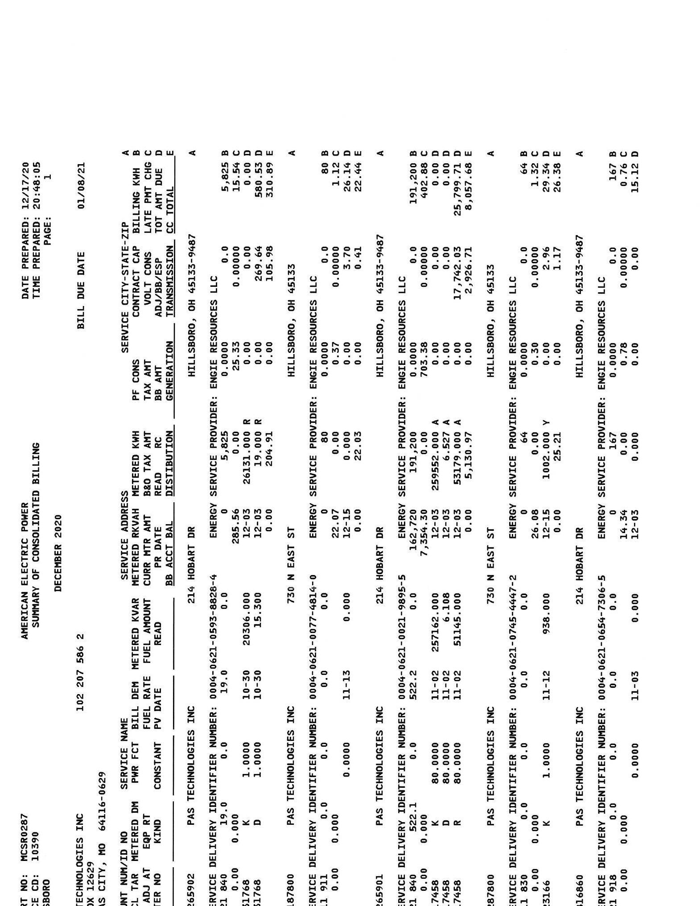

# CONSOLIDATED BILL 

SERVICE ADDRESS:
16769-1 25
$\left.\mathrm{T}^{\mathrm{T}} \mathrm{H}\right|_{\mathrm{H}} \mathrm{H}_{\mathrm{H}} \mathrm{H}_{\mathrm{H}}^{\mathrm{H}} \mathrm{H}_{\mathrm{H}}^{\mathrm{H}} \mathrm{H}_{\mathrm{H}} \mathrm{H}_{\mathrm{H}} \mathrm{H}_{\mathrm{H}} \mathrm{H}_{\mathrm{H}} \mathrm{H}_{\mathrm{H}} \mathrm{H}_{\mathrm{H}} \mathrm{H}_{\mathrm{H}}^{\mathrm{H}} \mathrm{H}_{\mathrm{H}}^{\mathrm{H}} \mathrm{H}_{\mathrm{H}}^{\mathrm{H}} \mathrm{H}_{\mathrm{H}}^{\mathrm{H}} \mathrm{H}_{\mathrm{H}}^{\mathrm{H}} \mathrm{H}_{\mathrm{H}}^{\mathrm{H}} \mathrm{H}_{\mathrm{H}}^{\mathrm{H}} \mathrm{H}_{\mathrm{H}}^{\mathrm{H}} \mathrm{H}_{\mathrm{H}}^{\mathrm{H}} \mathrm{H}_{\mathrm{H}}^{\mathrm{H}} \mathrm{H}_{\mathrm{H}}^{\mathrm{H}} \mathrm{H}_{\mathrm{H}}^{\mathrm{H}} \mathrm{H}_{\mathrm{H}}^{\mathrm{H}} \mathrm{H}_{\mathrm{H}}^{\mathrm{H}} \mathrm{H}_{\mathrm{H}}^{\mathrm{H}} \mathrm{H}_{\mathrm{H}}^{\mathrm{H}} \mathrm{H}_{\mathrm{H}}^{\mathrm{H}} \mathrm{H}_{\mathrm{H}}^{\mathrm{H}} \mathrm{H}_{\mathrm{H}}^{\mathrm{H}} \mathrm{H}_{\mathrm{H}}^{\mathrm{H}} \mathrm{H}_{\mathrm{H}}^{\mathrm{H}} \mathrm{H}_{\mathrm{H}}^{\mathrm{H}} \mathrm{H}_{\mathrm{H}}^{\mathrm{H}} \mathrm{H}_{\mathrm{H}}^{\mathrm{H}} \mathrm{H}_{\mathrm{H}}^{\mathrm{H}} \mathrm{H}_{\mathrm{H}}^{\mathrm{H}} \mathrm{H}_{\mathrm{H}}^{\mathrm{H}} \mathrm{H}_{\mathrm{H}}^{\mathrm{H}} \mathrm{H}_{\mathrm{H}}^{\mathrm{H}} \mathrm{H}_{\mathrm{H}}^{\mathrm{H}} \mathrm{H}_{\mathrm{H}}^{\mathrm{H}} \mathrm{H}_{\mathrm{H}}^{\mathrm{H}} \mathrm{H}_{\mathrm{H}}^{\mathrm{H}} \mathrm{H}_{\mathrm{H}}^{\mathrm{H}} \mathrm{H}_{\mathrm{H}}^{\mathrm{H}} \mathrm{H}_{\mathrm{H}}^{\mathrm{H}} \mathrm{H}_{\mathrm{H}}^{\mathrm{H}} \mathrm{H}_{\mathrm{H}}^{\mathrm{H}} \mathrm{H}_{\mathrm{H}}^{\mathrm{H}} \mathrm{H}_{\mathrm{H}}^{\mathrm{H}} \mathrm{H}_{\mathrm{H}}^{\mathrm{H}} \mathrm{H}_{\mathrm{H}}^{\mathrm{H}} \mathrm{H}_{\mathrm{H}}^{\mathrm{H}} \mathrm{H}_{\mathrm{H}}^{\mathrm{H}} \mathrm{H}_{\mathrm{H}}^{\mathrm{H}} \mathrm{H}_{\mathrm{H}}^{\mathrm{H}} \mathrm{H}_{\mathrm{H}}^{\mathrm{H}} \mathrm{H}_{\mathrm{H}}^{\mathrm{H}} \mathrm{H}_{\mathrm{H}}^{\mathrm{H}} \mathrm{H}_{\mathrm{H}}^{\mathrm{H}} \mathrm{H}_{\mathrm{H}}^{\mathrm{H}} \mathrm{H}_{\mathrm{H}}^{\mathrm{H}} \mathrm{H}_{\mathrm{H}}^{\mathrm{H}} \mathrm{H}_{\mathrm{H}}^{\mathrm{H}} \mathrm{H}_{\mathrm{H}}^{\mathrm{H}} \mathrm{H}_{\mathrm{H}}^{\mathrm{H}} \mathrm{H}_{\mathrm{H}}^{\mathrm{H}} \mathrm{H}_{\mathrm{H}}^{\mathrm{H}} \mathrm{H}_{\mathrm{H}}^{\mathrm{H}} \mathrm{H}_{\mathrm{H}}^{\mathrm{H}} \mathrm{H}_{\mathrm{H}}^{\mathrm{H}} \mathrm{H}_{\mathrm{H}}^{\mathrm{H}} \mathrm{H}_{\mathrm{H}}^{\mathrm{H}} \mathrm{H}_{\mathrm{H}}^{\mathrm{H}} \mathrm{H}_{\mathrm{H}}^{\mathrm{H}} \mathrm{H}_{\mathrm{H}}^{\mathrm{H}} \mathrm{H}_{\mathrm{H}}^{\mathrm{H}} \mathrm{H}_{\mathrm{H}}^{\mathrm{H}} \mathrm{H}_{\mathrm{H}}^{\mathrm{H}} \mathrm{H}_{\mathrm{H}}^{\mathrm{H}} \mathrm{H}_{\mathrm{H}}^{\mathrm{H}} \mathrm{H}_{\mathrm{H}}^{\mathrm{H}} \mathrm{H}_{\mathrm{H}}^{\mathrm{H}} \mathrm{H}_{\mathrm{H}}^{\mathrm{H}} \mathrm{H}_{\mathrm{H}}^{\mathrm{H}} \mathrm{H}_{\mathrm{H}}^{\mathrm{H}} \mathrm{H}_{\mathrm{H}}^{\mathrm{H}} \mathrm{H}_{\mathrm{H}}^{\mathrm{H}} \mathrm{H}_{\mathrm{H}}^{\mathrm{H}} \mathrm{H}_{\mathrm{H}}^{\mathrm{H}} \mathrm{H}_{\mathrm{H}}^{\mathrm{H}} \mathrm{H}_{\mathrm{H}}^{\mathrm{H}} \mathrm{H}_{\mathrm{H}}^{\mathrm{H}} \mathrm{H}_{\mathrm{H}}^{\mathrm{H}} \mathrm{H}_{\mathrm{H}}^{\mathrm{H}} \mathrm{H}_{\mathrm{H}}^{\mathrm{H}} \mathrm{H}_{\mathrm{H}}^{\mathrm{H}} \mathrm{H}_{\mathrm{H}}^{\mathrm{H}} \mathrm{H}_{\mathrm{H}}^{\mathrm{H}} \mathrm{H}_{\mathrm{H}}^{\mathrm{H}} \mathrm{H}_{\mathrm{H}}^{\mathrm{H}} \mathrm{H}_{\mathrm{H}}^{\mathrm{H}} \mathrm{H}_{\mathrm{H}}^{\mathrm{H}} \mathrm{H}_{\mathrm{H}}^{\mathrm{H}} \mathrm{H}_{\mathrm{H}}^{\mathrm{H}} \mathrm{H}_{\mathrm{H}}^{\mathrm{H}} \mathrm{H}_{\mathrm{H}}^{\mathrm{H}} \mathrm{H}_{\mathrm{H}}^{\mathrm{H}} \mathrm{H}_{\mathrm{H}}^{\mathrm{H}} \mathrm{H}_{\mathrm{H}}^{\mathrm{H}} \mathrm{H}_{\mathrm{H}}^{\mathrm{H}} \mathrm{H}_{\mathrm{H}}^{\mathrm{H}} \mathrm{H}_{\mathrm{H}}^{\mathrm{H}} \mathrm{H}_{\mathrm{H}}^{\mathrm{H}} \mathrm{H}_{\mathrm{H}}^{\mathrm{H}} \mathrm{H}_{\mathrm{H}}^{\mathrm{H}} \mathrm{H}_{\mathrm{H}}^{\mathrm{H}} \mathrm{H}_{\mathrm{H}}^{\mathrm{H}} \mathrm{H}_{\mathrm{H}}^{\mathrm{H}} \mathrm{H}_{\mathrm{H}}^{\mathrm{H}} \mathrm{H}_{\mathrm{H}}^{\mathrm{H}} \mathrm{H}_{\mathrm{H}}^{\mathrm{H}} \mathrm{H}_{\mathrm{H}}^{\mathrm{H}} \mathrm{H}_{\mathrm{H}}^{\mathrm{H}} \mathrm{H}_{\mathrm{H}}^{\mathrm{H}} \mathrm{H}_{\mathrm{H}}^{\mathrm{H}} \mathrm{H}_{\mathrm{H}}^{\mathrm{H}} \mathrm{H}_{\mathrm{H}}^{\mathrm{H}} \mathrm{H}_{\mathrm{H}}^{\mathrm{H}} \mathrm{H}_{\mathrm{H}}^{\mathrm{H}} \mathrm{H}_{\mathrm{H}}^{\mathrm{H}} \mathrm{H}_{\mathrm{H}}^{\mathrm{H}} \mathrm{H}_{\mathrm{H}}^{\mathrm{H}} \mathrm{H}_{\mathrm{H}}^{\mathrm{H}} \mathrm{H}_{\mathrm{H}}^{\mathrm{H}} \mathrm{H}_{\mathrm{H}}^{\mathrm{H}} \mathrm{H}_{\mathrm{H}}^{\mathrm{H}} \mathrm{H}_{\mathrm{H}}^{\mathrm{H}} \mathrm{H}_{\mathrm{H}}^{\mathrm{H}} \mathrm{H}_{\mathrm{H}}^{\mathrm{H}} \mathrm{H}_{\mathrm{H}}^{\mathrm{H}} \mathrm{H}_{\mathrm{H}}^{\mathrm{H}} \mathrm{H}_{\mathrm{H}}^{\mathrm{H}} \mathrm{H}_{\mathrm{H}}^{\mathrm{H}} \mathrm{H}_{\mathrm{H}}^{\mathrm{H}} \mathrm{H}_{\mathrm{H}}^{\mathrm{H}} \mathrm{H}_{\mathrm{H}}^{\mathrm{H}} \mathrm{H}_{\mathrm{H}}^{\mathrm{H}} \mathrm{H}_{\mathrm{H}}^{\mathrm{H}} \mathrm{H}_{\mathrm{H}}^{\mathrm{H}} \mathrm{H}_{\mathrm{H}}^{\mathrm{H}} \mathrm{H}_{\mathrm{H}}^{\mathrm{H}} \mathrm{H}_{\mathrm{H}}^{\mathrm{H}} \mathrm{H}_{\mathrm{H}}^{\mathrm{H}} \mathrm{H}_{\mathrm{H}}^{\mathrm{H}} \mathrm{H}_{\mathrm{H}}^{\mathrm{H}} \mathrm{H}_{\mathrm{H}}^{\mathrm{H}} \mathrm{H}_{\mathrm{H}}^{\mathrm{H}} \mathrm{H}_{\mathrm{H}}^{\mathrm{H}} \mathrm{H}_{\mathrm{H}}^{\mathrm{H}} \mathrm{H}_{\mathrm{H}}^{\mathrm{H}} \mathrm{H}_{\mathrm{H}}^{\mathrm{H}} \mathrm{H}_{\mathrm{H}}^{\mathrm{H}} \mathrm{H}_{\mathrm{H}}^{\mathrm{H}} \mathrm{H}_{\mathrm{H}}^{\mathrm{H}} \mathrm{H}_{\mathrm{H}}^{\mathrm{H}} \mathrm{H}_{\mathrm{H}}^{\mathrm{H}} \mathrm{H}_{\mathrm{H}}^{\mathrm{H}} \mathrm{H}_{\mathrm{H}}^{\mathrm{H}} \mathrm{H}_{\mathrm{H}}^{\mathrm{H}} \mathrm{H}_{\mathrm{H}}^{\mathrm{H}} \mathrm{H}_{\mathrm{H}}^{\mathrm{H}} \mathrm{H}_{\mathrm{H}}^{\mathrm{H}} \mathrm{H}_{\mathrm{H}}^{\mathrm{H}} \mathrm{H}_{\mathrm{H}}^{\mathrm{H}} \mathrm{H}_{\mathrm{H}}^{\mathrm{H}} \mathrm{H}_{\mathrm{H}}^{\mathrm{H}} \mathrm{H}_{\mathrm{H}}^{\mathrm{H}} \mathrm{H}_{\mathrm{H}}^{\mathrm{H}} \mathrm{H}_{\mathrm{H}}^{\mathrm{H}} \mathrm{H}_{\mathrm{H}}^{\mathrm{H}} \mathrm{H}_{\mathrm{H}}^{\mathrm{H}} \mathrm{H}_{\mathrm{H}}^{\mathrm{H}} \mathrm{H}_{\mathrm{H}}^{\mathrm{H}} \mathrm{H}_{\mathrm{H}}^{\mathrm{H}} \mathrm{H}_{\mathrm{H}}^{\mathrm{H}} \mathrm{H}_{\mathrm{H}}^{\mathrm{H}} \mathrm{H}_{\mathrm{H}}^{\mathrm{H}} \mathrm{H}_{\mathrm{H}}^{\mathrm{H}} \mathrm{H}_{\mathrm{H}}^{\mathrm{H}} \mathrm{H}_{\mathrm{H}}^{\mathrm{H}} \mathrm{H}_{\mathrm{H}}^{\mathrm{H}} \mathrm{H}_{\mathrm{H}}^{\mathrm{H}} \mathrm{H}_{\mathrm{H}}^{\mathrm{H}} \mathrm{H}_{\mathrm{H}}^{\mathrm{H}} \mathrm{H}_{\mathrm{H}}^{\mathrm{H}} \mathrm{H}_{\mathrm{H}}^{\mathrm{H}} \mathrm{H}_{\mathrm{H}}^{\mathrm{H}} \mathrm{H}_{\mathrm{H}}^{\mathrm{H}} \mathrm{H}_{\mathrm{H}}^{\mathrm{H}} \mathrm{H}_{\mathrm{H}}^{\mathrm{H}} \mathrm{H}_{\mathrm{H}}^{\mathrm{H}} \mathrm{H}_{\mathrm{H}}^{\mathrm{H}} \mathrm{H}_{\mathrm{H}}^{\mathrm{H}} \mathrm{H}_{\mathrm{H}}^{\mathrm{H}} \mathrm{H}_{\mathrm{H}}^{\mathrm{H}} \mathrm{H}_{\mathrm{H}}^{\mathrm{H}} \mathrm{H}_{\mathrm{H}}^{\mathrm{H}} \mathrm{H}_{\mathrm{H}}^{\mathrm{H}} \mathrm{H}_{\mathrm{H}}^{\mathrm{H}} \mathrm{H}_{\mathrm{H}}^{\mathrm{H}} \mathrm{H}_{\mathrm{H}}^{\mathrm{H}} \mathrm{H}_{\mathrm{H}}^{\mathrm{H}} \mathrm{H}_{\mathrm{H}}^{\mathrm{H}} \mathrm{H}_{\mathrm{H}}^{\mathrm{H}} \mathrm{H}_{\mathrm{H}}^{\mathrm{H}} \mathrm{H}_{\mathrm{H}}^{\mathrm{H}} \mathrm{H}_{\mathrm{H}}^{\mathrm{H}} \mathrm{H}_{\mathrm{H}}^{\mathrm{H}} \mathrm{H}_{\mathrm{H}}^{\mathrm{H}} \mathrm{H}_{\mathrm{H}}^{\mathrm{H}} \mathrm{H}_{\mathrm{H}}^{\mathrm{H}} \mathrm{H}_{\mathrm{H}}^{\mathrm{H}} \mathrm{H}_{\mathrm{H}}^{\mathrm{H}} \mathrm{H}_{\mathrm{H}}^{\mathrm{H}} \mathrm{H}_{\mathrm{H}}^{\mathrm{H}} \mathrm{H}_{\mathrm{H}}^{\mathrm{H}} \mathrm{H}_{\mathrm{H}}^{\mathrm{H}} \mathrm{H}_{\mathrm{H}}^{\mathrm{H}} \mathrm{H}_{\mathrm{H}}^{\mathrm{H}} \mathrm{H}_{\mathrm{H}}^{\mathrm{H}} \mathrm{H}_{\mathrm{H}}^{\mathrm{H}} \mathrm{H}_{\mathrm{H}}^{\mathrm{H}} \mathrm{H}_{\mathrm{H}}^{\mathrm{H}} \mathrm{H}_{\mathrm{H}}^{\mathrm{H}} \mathrm{H}_{\mathrm{H}}^{\mathrm{H}} \mathrm{H}_{\mathrm{H}}^{\mathrm{H}} \mathrm{H}_{\mathrm{H}}^{\mathrm{H}} \mathrm{H}_{\mathrm{H}}^{\mathrm{H}} \mathrm{H}_{\mathrm{H}}^{\mathrm{H}} \mathrm{H}_{\mathrm{H}}^{\mathrm{H}} \mathrm{H}_{\mathrm{H}}^{\mathrm{H}} \mathrm{H}_{\mathrm{H}}^{\mathrm{H}} \mathrm{H}_{\mathrm{H}}^{\mathrm{H}} \mathrm{H}_{\mathrm{H}}^{\mathrm{H}} \mathrm{H}_{\mathrm{H}}^{\mathrm{H}} \mathrm{H}_{\mathrm{H}}^{\mathrm{H}} \mathrm{H}_{\mathrm{H}}^{\mathrm{H}} \mathrm{H}_{\mathrm{H}}^{\mathrm{H}} \mathrm{H}_{\mathrm{H}}^{\mathrm{H}} \mathrm{H}_{\mathrm{H}}^{\mathrm{H}} \mathrm{H}_{\mathrm{H}}^{\mathrm{H}} \mathrm{H}_{\mathrm{H}}^{\mathrm{H}} \mathrm{H}_{\mathrm{H}}^{\mathrm{H}} \mathrm{H}_{\mathrm{H}}^{\mathrm{H}} \mathrm{H}_{\mathrm{H}}^{\mathrm{H}} \mathrm{H}_{\mathrm{H}}^{\mathrm{H}} \mathrm{H}_{\mathrm{H}}^{\mathrm{H}} \mathrm{H}_{\mathrm{H}}^{\mathrm{H}} \mathrm{H}_{\mathrm{H}}^{\mathrm{H}} \mathrm{H}_{\mathrm{H}}^{\mathrm{H}} \mathrm{H}_{\mathrm{H}}^{\mathrm{H}} \mathrm{H}_{\mathrm{H}}^{\mathrm{H}} \mathrm{H}_{\mathrm{H}}^{\mathrm{H}} \mathrm{H}_{\mathrm{H}}^{\mathrm{H}} \mathrm{H}_{\mathrm{H}}^{\mathrm{H}} \mathrm{H}_{\mathrm{H}}^{\mathrm{H}} \mathrm{H}_{\mathrm{H}}^{\mathrm{H}} \mathrm{H}_{\mathrm{H}}^{\mathrm{H}} \mathrm{H}_{\mathrm{H}}^{\mathrm{H}} \mathrm{H}_{\mathrm{H}}^{\mathrm{H}} \mathrm{H}_{\mathrm{H}}^{\mathrm{H}} \mathrm{H}_{\mathrm{H}}^{\mathrm{H}} \mathrm{H}_{\mathrm{H}}^{\mathrm{H}} \mathrm{H}_{\mathrm{H}}^{\mathrm{H}} \mathrm{H}_{\mathrm{H}}^{\mathrm{H}} \mathrm{H}_{\mathrm{H}}^{\mathrm{H}} \mathrm{H}_{\mathrm{H}}^{\mathrm{H}} \mathrm{H}_{\mathrm{H}}^{\mathrm{H}} \mathrm{H}_{\mathrm{H}}^{\mathrm{H}} \mathrm{H}_{\mathrm{H}}^{\mathrm{H}} \mathrm{H}_{\mathrm{H}}^{\mathrm{H}} \mathrm{H}_{\mathrm{H}}^{\mathrm{H}} \mathrm{H}_{\mathrm{H}}^{\mathrm{H}} \mathrm{H}_{\mathrm{H}}^{\mathrm{H}} \mathrm{H}_{\mathrm{H}}^{\mathrm{H}} \mathrm{H}_{\mathrm{H}}^{\mathrm{H}} \mathrm{H}_{\mathrm{H}}^{\mathrm{H}} \mathrm{H}_{\mathrm{H}}^{\mathrm{H}} \mathrm{H}_{\mathrm{H}}^{\mathrm{H}} \mathrm{H}_{\mathrm{H}}^{\mathrm{H}} \mathrm{H}_{\mathrm{H}}^{\mathrm{H}} \mathrm{H}_{\mathrm{H}}^{\mathrm{H}} \mathrm{H}_{\mathrm{H}}^{\mathrm{H}} \mathrm{H}_{\mathrm{H}}^{\mathrm{H}} \mathrm{H}_{\mathrm{H}}^{\mathrm{H}} \mathrm{H}_{\mathrm{H}}^{\mathrm{H}} \mathrm{H}_{\mathrm{H}}^{\mathrm{H}} \mathrm{H}_{\mathrm{H}}^{\mathrm{H}} \mathrm{H}_{\mathrm{H}}^{\mathrm{H}} \mathrm{H}_{\mathrm{H}}^{\mathrm{H}} \mathrm{H}_{\mathrm{H}}^{\mathrm{H}} \mathrm{H}_{\mathrm{H}}^{\mathrm{H}} \mathrm{H}_{\mathrm{H}}^{\mathrm{H}} \mathrm{H}_{\mathrm{H}}^{\mathrm{H}} \mathrm{H}_{\mathrm{H}}^{\mathrm{H}} \mathrm{H}_{\mathrm{H}}^{\mathrm{H}} \mathrm{H}_{\mathrm{H}}^{\mathrm{H}} \mathrm{H}_{\mathrm{H}}^{\mathrm{H}} \mathrm{H}_{\mathrm{H}}^{\mathrm{H}} \mathrm{H}_{\mathrm{H}}^{\mathrm{H}} \mathrm{H}_{\mathrm{H}}^{\mathrm{H}} \mathrm{H}_{\mathrm{H}}^{\mathrm{H}} \mathrm{H}_{\mathrm{H}}^{\mathrm{H}} \mathrm{H}_{\mathrm{H}}^{\mathrm{H}} \mathrm{H}_{\mathrm{H}}^{\mathrm{H}} \mathrm{H}_{\mathrm{H}}^{\mathrm{H}} \mathrm{H}_{\mathrm{H}}^{\mathrm{H}} \mathrm{H}_{\mathrm{H}}^{\mathrm{H}} \mathrm{H}_{\mathrm{H}}^{\mathrm{H}} \mathrm{H}_{\mathrm{H}}^{\mathrm{H}} \mathrm{H}_{\mathrm{H}}^{\mathrm{H}} \mathrm{H}_{\mathrm{H}}^{\mathrm{H}} \mathrm{H}_{\mathrm{H}}^{\mathrm{H}} \mathrm{H}_{\mathrm{H}}^{\mathrm{H}} \mathrm{H}_{\mathrm{H}}^{\mathrm{H}} \mathrm{H}_{\mathrm{H}}^{\mathrm{H}} \mathrm{H}_{\mathrm{H}}^{\mathrm{H}} \mathrm{H}_{\mathrm{H}}^{\mathrm{H}} \mathrm{H}_{\mathrm{H}}^{\mathrm{H}} \mathrm{H}_{\mathrm{H}}^{\mathrm{H}} \mathrm{H}_{\mathrm{H}}^{\mathrm{H}} \mathrm{H}_{\mathrm{H}}^{\mathrm{H}} \mathrm{H}_{\mathrm{H}}^{\mathrm{H}} \mathrm{H}_{\mathrm{H}}^{\mathrm{H}} \mathrm{H}_{\mathrm{H}}^{\mathrm{H}} \mathrm{H}_{\mathrm{H}}^{\mathrm{H}} \mathrm{H}_{\mathrm{H}}^{\mathrm{H}} \mathrm{H}_{\mathrm{H}}^{\mathrm{H}} \mathrm{H}_{\mathrm{H}}^{\mathrm{H}} \mathrm{H}_{\mathrm{H}}^{\mathrm{H}} \mathrm{H}_{\mathrm{H}}^{\mathrm{H}} \mathrm{H}_{\mathrm{H}}^{\mathrm{H}} \mathrm{H}_{\mathrm{H}}^{\mathrm{H}} \mathrm{H}_{\mathrm{H}}^{\mathrm{H}} \mathrm{H}_{\mathrm{H}}^{\mathrm{H}} \mathrm{H}_{\mathrm{H}}^{\mathrm{H}} \mathrm{H}_{\mathrm{H}}^{\mathrm{H}} \mathrm{H}_{\mathrm{H}}^{\mathrm{H}} \mathrm{H}_{\mathrm{H}}^{\mathrm{H}} \mathrm{H}_{\mathrm{H}}^{\mathrm{H}} \mathrm{H}_{\mathrm{H}}^{\mathrm{H}} \mathrm{H}_{\mathrm{H}}^{\mathrm{H}} \mathrm{H}_{\mathrm{H}}^{\mathrm{H}} \mathrm{H}_{\mathrm{H}}^{\mathrm{H}} \mathrm{H}_{\mathrm{H}}^{\mathrm{H}} \mathrm{H}_{\mathrm{H}}^{\mathrm{H}} \mathrm{H}_{\mathrm{H}}^{\mathrm{H}} \mathrm{H}_{\mathrm{H}}^{\mathrm{H}} \mathrm{H}_{\mathrm{H}}^{\mathrm{H}} \mathrm{H}_{\mathrm{H}}^{\mathrm{H}} \mathrm{H}_{\mathrm{H}}^{\mathrm{H}} \mathrm{H}_{\mathrm{H}}^{\mathrm{H}} \mathrm{H}_{\mathrm{H}}^{\mathrm{H}} \mathrm{H}_{\mathrm{H}}^{\mathrm{H}} \mathrm{H}_{\mathrm{H}}^{\mathrm{H}} \mathrm{H}_{\mathrm{H}}^{\mathrm{H}} \mathrm{H}_{\mathrm{H}}^{\mathrm{H}} \mathrm{H}_{\mathrm{H}}^{\mathrm{H}} \mathrm{H}_{\mathrm{H}}^{\mathrm{H}} \mathrm{H}_{\mathrm{H}}^{\mathrm{H}} \mathrm{H}_{\mathrm{H}}^{\mathrm{H}} \mathrm{H}_{\mathrm{H}}^{\mathrm{H}} \mathrm{H}_{\mathrm{H}}^{\mathrm{H}} \mathrm{H}_{\mathrm{H}}^{\mathrm{H}} \mathrm{H}_{\mathrm{H}}^{\mathrm{H}} \mathrm{H}_{\mathrm{H}}^{\mathrm{H}} \mathrm{H}_{\mathrm{H}}^{\mathrm{H}} \mathrm{H}_{\mathrm{H}}^{\mathrm{H}} \mathrm{H}_{\mathrm{H}}^{\mathrm{H}} \mathrm{H}_{\mathrm{H}}^{\mathrm{H}} \mathrm{H}_{\mathrm{H}}^{\mathrm{H}} \mathrm{H}_{\mathrm{H}}^{\mathrm{H}} \mathrm{H}_{\mathrm{H}}^{\mathrm{H}} \mathrm{H}_{\mathrm{H}}^{\mathrm{H}} \mathrm{H}_{\mathrm{H}}^{\mathrm{H}} \mathrm{H}_{\mathrm{H}}^{\mathrm{H}} \mathrm{H}_{\mathrm{H}}^{\mathrm{H}} \mathrm{H}_{\mathrm{H}}^{\mathrm{H}} \mathrm{H}_{\mathrm{H}}^{\mathrm{H}} \mathrm{H}_{\mathrm{H}}^{\mathrm{H}} \mathrm{H}_{\mathrm{H}}^{\mathrm{H}} \mathrm{H}_{\mathrm{H}}^{\mathrm{H}} \mathrm{H}_{\mathrm{H}}^{\mathrm{H}} \mathrm{H}_{\mathrm{H}}^{\mathrm{H}} \mathrm{H}_{\mathrm{H}}^{\mathrm{H}} \mathrm{H}_{\mathrm{H}}^{\mathrm{H}} \mathrm{H}_{\mathrm{H}}^{\mathrm{H}} \mathrm{H}_{\mathrm{H}}^{\mathrm{H}} \mathrm{H}_{\mathrm{H}}^{\mathrm{H}} \mathrm{H}_{\mathrm{H}}^{\mathrm{H}} \mathrm{H}_{\mathrm{H}}^{\mathrm{H}} \mathrm{H}_{\mathrm{H}}^{\mathrm{H}} \mathrm{H}_{\mathrm{H}}^{\mathrm{H}} \mathrm{H}_{\mathrm{H}}^{\mathrm{H}} \mathrm{H}_{\mathrm{H}}^{\mathrm{H}} \mathrm{H}_{\mathrm{H}}^{\mathrm{H}} \mathrm{H}_{\mathrm{H}}^{\mathrm{H}} \mathrm{H}_{\mathrm{H}}^{\mathrm{H}} \mathrm{H}_{\mathrm{H}}^{\mathrm{H}} \mathrm{H}_{\mathrm{H}}^{\mathrm{H}} \mathrm{H}_{\mathrm{H}}^{\mathrm{H}} \mathrm{H}_{\mathrm{H}}^{\mathrm{H}} \mathrm{H}_{\mathrm{H}}^{\mathrm{H}} \mathrm{H}_{\mathrm{H}}^{\mathrm{H}} \mathrm{H}_{\mathrm{H}}^{\mathrm{H}} \mathrm{H}_{\mathrm{H}}^{\mathrm{H}} \mathrm{H}_{\mathrm{H}}^{\mathrm{H}} \mathrm{H}_{\mathrm{H}}^{\mathrm{H}} \mathrm{H}_{\mathrm{H}}^{\mathrm{H}} \mathrm{H}_{\mathrm{H}}^{\mathrm{H}} \mathrm{H}_{\mathrm{H}}^{\mathrm{H}} \mathrm{H}_{\mathrm{H}}^{\mathrm{H}} \mathrm{H}_{\mathrm{H}}^{\mathrm{H}} \mathrm{H}_{\mathrm{H}}^{\mathrm{H}} \mathrm{H}_{\mathrm{H}}^{\mathrm{H}} \mathrm{H}_{\mathrm{H}}^{\mathrm{H}} \mathrm{H}_{\mathrm{H}}^{\mathrm{H}} \mathrm{H}_{\mathrm{H}}^{\mathrm{H}} \mathrm{H}_{\mathrm{H}}^{\mathrm{H}} \mathrm{H}_{\mathrm{H}}^{\mathrm{H}} \mathrm{H}_{\mathrm{H}}^{\mathrm{H}} \mathrm{H}_{\mathrm{H}}^{\mathrm{H}} \mathrm{H}_{\mathrm{H}}^{\mathrm{H}} \mathrm{H}_{\mathrm{H}}^{\mathrm{H}} \mathrm{H}_{\mathrm{H}}^{\mathrm{H}} \mathrm{H}_{\mathrm{H}}^{\mathrm{H}} \mathrm{H}_{\mathrm{H}}^{\mathrm{H}} \mathrm{H}_{\mathrm{H}}^{\mathrm{H}} \mathrm{H}_{\mathrm{H}}^{\mathrm{H}} \mathrm{H}_{\mathrm{H}}^{\mathrm{H}} \mathrm{H}_{\mathrm{H}}^{\mathrm{H}} \mathrm{H}_{\mathrm{H}}^{\mathrm{H}} \mathrm{H}_{\mathrm{H}}^{\mathrm{H}} \mathrm{H}_{\mathrm{H}}^{\mathrm{H}} \mathrm{H}_{\mathrm{H}}^{\mathrm{H}} \mathrm{H}_{\mathrm{H}}^{\mathrm{H}} \mathrm{H}_{\mathrm{H}}^{\mathrm{H}} \mathrm{H}_{\mathrm{H}}^{\mathrm{H}} \mathrm{H}_{\mathrm{H}}^{\mathrm{H}} \mathrm{H}_{\mathrm{H}}^{\mathrm{H}} \mathrm{H}_{\mathrm{H}}^{\mathrm{H}} \mathrm{H}_{\mathrm{H}}^{\mathrm{H}} \mathrm{H}_{\mathrm{H}}^{\mathrm{H}} \mathrm{H}_{\mathrm{H}}^{\mathrm{H}} \mathrm{H}_{\mathrm{H}}^{\mathrm{H}} \mathrm{H}_{\mathrm{H}}^{\mathrm{H}} \mathrm{H}_{\mathrm{H}}^{\mathrm{H}} \mathrm{H}_{\mathrm{H}}^{\mathrm{H}} \mathrm{H}_{\mathrm{H}}^{\mathrm{H}} \mathrm{H}_{\mathrm{H}}^{\mathrm{H}} \mathrm{H}_{\mathrm{H}}^{\mathrm{H}} \mathrm{H}_{\mathrm{H}}^{\mathrm{H}} \mathrm{H}_{\mathrm{H}}^{\mathrm{H}} \mathrm{H}_{\mathrm{H}}^{\mathrm{H}} \mathrm{H}_{\mathrm{H}}^{\mathrm{H}} \mathrm{H}_{\mathrm{H}}^{\mathrm{H}} \mathrm{H}_{\mathrm{H}}^{\mathrm{H}} \mathrm{H}_{\mathrm{H}}^{\mathrm{H}} \mathrm{H}_{\mathrm{H}}^{\mathrm{H}} \mathrm{H}_{\mathrm{H}}^{\mathrm{H}} \mathrm{H}_{\mathrm{H}}^{\mathrm{H}} \mathrm{H}_{\mathrm{H}}^{\mathrm{H}} \mathrm{H}_{\mathrm{H}}^{\mathrm{H}} \mathrm{H}_{\mathrm{H}}^{\mathrm{H}} \mathrm{H}_{\mathrm{H}}^{\mathrm{H}} \mathrm{H}_{\mathrm{H}}^{\mathrm{H}} \mathrm{H}_{\mathrm{H}}^{\mathrm{H}} \mathrm{H}_{\mathrm{H}}^{\mathrm{H}} \mathrm{H}_{\mathrm{H}}^{\mathrm{H}} \mathrm{H}_{\mathrm{H}}^{\mathrm{H}} \mathrm{H}_{\mathrm{H}}^{\mathrm{H}} \mathrm{H}_{\mathrm{H}}^{\mathrm{H}} \mathrm{H}_{\mathrm{H}}^{\mathrm{H}} \mathrm{H}_{\mathrm{H}}^{\mathrm{H}} \mathrm{H}_{\mathrm{H}}^{\mathrm{H}} \mathrm{H}_{\mathrm{H}}^{\mathrm{H}} \mathrm{H}_{\mathrm{H}}^{\mathrm{H}} \mathrm{H}_{\mathrm{H}}^{\mathrm{H}} \mathrm{H}_{\mathrm{H}}^{\mathrm{H}} \mathrm{H}_{\mathrm{H}}^{\mathrm{H}} \mathrm{H}_{\mathrm{H}}^{\mathrm{H}} \mathrm{H}_{\mathrm{H}}^{\mathrm{H}} \mathrm{H}_{\mathrm{H}}^{\mathrm{H}} \mathrm{H}_{\mathrm{H}}^{\mathrm{H}} \mathrm{H}_{\mathrm{H}}^{\mathrm{H}} \mathrm{H}_{\mathrm{H}}^{\mathrm{H}} \mathrm{H}_{\mathrm{H}}^{\mathrm{H}} \mathrm{H}_{\mathrm{H}}^{\mathrm{H}} \mathrm{H}_{\mathrm{H}}^{\mathrm{H}} \mathrm{H}_{\mathrm{H}}^{\mathrm{H}} \mathrm{H}_{\mathrm{H}}^{\mathrm{H}} \mathrm{H}_{\mathrm{H}}^{\mathrm{H}} \mathrm{H}_{\mathrm{H}}^{\mathrm{H}} \mathrm{H}_{\mathrm{H}}^{\mathrm{H}} \mathrm{H}_{\mathrm{H}}^{\mathrm{H}} \mathrm{H}_{\mathrm{H}}^{\mathrm{H}} \mathrm{H}_{\mathrm{H}}^{\mathrm{H}} \mathrm{H}_{\mathrm{H}}^{\mathrm{H}} \mathrm{H}_{\mathrm{H}}^{\mathrm{H}} \mathrm{H}_{\mathrm{H}}^{\mathrm{H}} \mathrm{H}_{\mathrm{H}}^{\mathrm{H}} \mathrm{H}_{\mathrm{H}}^{\mathrm{H}} \mathrm{H}_{\mathrm{H}}^{\mathrm{H}} \mathrm{H}_{\mathrm{H}}^{\mathrm{H}} \mathrm{H}_{\mathrm{H}}^{\mathrm{H}} \mathrm{H}_{\mathrm{H}}^{\mathrm{H}} \mathrm{H}_{\mathrm{H}}^{\mathrm{H}} \mathrm{H}_{\mathrm{H}}^{\mathrm{H}} \mathrm{H}_{\mathrm{H}}^{\mathrm{H}} \mathrm{H}_{\mathrm{H}}^{\mathrm{H}} \mathrm{H}_{\mathrm{H}}^{\mathrm{H}} \mathrm{H}_{\mathrm{H}}^{\mathrm{H}} \mathrm{H}_{\mathrm{H}}^{\mathrm{H}} \mathrm{H}_{\mathrm{H}}^{\mathrm{H}} \mathrm{H}_{\mathrm{H}}^{\mathrm{H}} \mathrm{H}_{\mathrm{H}}^{\mathrm{H}} \mathrm{H}_{\mathrm{H}}^{\mathrm{H}} \mathrm{H}_{\mathrm{H}}^{\mathrm{H}} \mathrm{H}_{\mathrm{H}}^{\mathrm{H}} \mathrm{H}_{\mathrm{H}}^{\mathrm{H}} \mathrm{H}_{\mathrm{H}}^{\mathrm{H}} \mathrm{H}_{\mathrm{H}}^{\mathrm{H}} \mathrm{H}_{\mathrm{H}}^{\mathrm{H}} \mathrm{H}_{\mathrm{H}}^{\mathrm{H}} \mathrm{H}_{\mathrm{H}}^{\mathrm{H}} \mathrm{H}_{\mathrm{H}}^{\mathrm{H}} \mathrm{H}_{\mathrm{H}}^{\mathrm{H}} \mathrm{H}_{\mathrm{H}}^{\mathrm{H}} \mathrm{H}_{\mathrm{H}}^{\mathrm{H}} \mathrm{H}_{\mathrm{H}}^{\mathrm{H}} \mathrm{H}_{\mathrm{H}}^{\mathrm{H}} \mathrm{H}_{\mathrm{H}}^{\mathrm{H}} \mathrm{H}_{\mathrm{H}}^{\mathrm{H}} \mathrm{H}_{\mathrm{H}}^{\mathrm{H}} \mathrm{H}_{\mathrm{H}}^{\mathrm{H}} \mathrm{H}_{\mathrm{H}}^{\mathrm{H}} \mathrm{H}_{\mathrm{H}}^{\mathrm{H}} \mathrm{H}_{\mathrm{H}}^{\mathrm{H}} \mathrm{H}_{\mathrm{H}}^{\mathrm{H}} \mathrm{H}_{\mathrm{H}}^{\mathrm{H}} \mathrm{H}_{\mathrm{H}}^{\mathrm{H}} \mathrm{H}_{\mathrm{H}}^{\mathrm{H}} \mathrm{H}_{\mathrm{H}}^{\mathrm{H}} \mathrm{H}_{\mathrm{H}}^{\mathrm{H}} \mathrm{H}_{\mathrm{H}}^{\mathrm{H}} \mathrm{H}_{\mathrm{H}}^{\mathrm{H}} \mathrm{H}_{\mathrm{H}}^{\mathrm{H}} \mathrm{H}_{\mathrm{H}}^{\mathrm{H}} \mathrm{H}_{\mathrm{H}}^{\mathrm{H}} \mathrm{H}_{\mathrm{H}}^{\mathrm{H}} \mathrm{H}_{\mathrm{H}}^{\mathrm{H}} \mathrm{H}_{\mathrm{H}}^{\mathrm{H}} \mathrm{H}_{\mathrm{H}}^{\mathrm{H}} \mathrm{H}_{\mathrm{H}}^{\mathrm{H}} \mathrm{H}_{\mathrm{H}}^{\mathrm{H}} \mathrm{H}_{\mathrm{H}}^{\mathrm{H}} \mathrm{H}_{\mathrm{H}}^{\mathrm{H}} \mathrm{H}_{\mathrm{H}}^{\mathrm{H}} \mathrm{H}_{\mathrm{H}}^{\mathrm{H}} \mathrm{H}_{\mathrm{H}}^{\mathrm{H}} \mathrm{H}_{\mathrm{H}}^{\mathrm{H}} \mathrm{H}_{\mathrm{H}}^{\mathrm{H}} \mathrm{H}_{\mathrm{H}}^{\mathrm{H}} \mathrm{H}_{\mathrm{H}}^{\mathrm{H}} \mathrm{H}_{\mathrm{H}}^{\mathrm{H}} \mathrm{H}_{\mathrm{H}}^{\mathrm{H}} \mathrm{H}_{\mathrm{H}}^{\mathrm{H}} \mathrm{H}_{\mathrm{H}}^{\mathrm{H}} \mathrm{H}_{\mathrm{H}}^{\mathrm{H}} \mathrm{H}_{\mathrm{H}}^{\mathrm{H}} \mathrm{H}_{\mathrm{H}}^{\mathrm{H}} \mathrm{H}_{\mathrm{H}}^{\mathrm{H}} \mathrm{H}_{\mathrm{H}}^{\mathrm{H}} \mathrm{H}_{\mathrm{H}}^{\mathrm{H}} \mathrm{H}_{\mathrm{H}}^{\mathrm{H}} \mathrm{H}_{\mathrm{H}}^{\mathrm{H}} \mathrm{H}_{\mathrm{H}}^{\mathrm{H}} \mathrm{H}_{\mathrm{H}}^{\mathrm{H}} \mathrm{H}_{\mathrm{H}}^{\mathrm{H}} \mathrm{H}_{\mathrm{H}}^{\mathrm{H}} \mathrm{H}_{\mathrm{H}}^{\mathrm{H}} \mathrm{H}_{\mathrm{H}}^{\mathrm{H}} \mathrm{H}_{\mathrm{H}}^{\mathrm{H}} \mathrm{H}_{\mathrm{H}}^{\mathrm{H}} \mathrm{H}_{\mathrm{H}}^{\mathrm{H}} \mathrm{H}_{\mathrm{H}}^{\mathrm{H}} \mathrm{H}_{\mathrm{H}}^{\mathrm{H}} \mathrm{H}_{\mathrm{H}}^{\mathrm{H}} \mathrm{H}_{\mathrm{H}}^{\mathrm{H}} \mathrm{H}_{\mathrm{H}}^{\mathrm{H}} \mathrm{H}_{\mathrm{H}}^{\mathrm{H}} \mathrm{H}_{\mathrm{H}}^{\mathrm{H}} \mathrm{H}_{\mathrm{H}}^{\mathrm{H}} \mathrm{H}_{\mathrm{H}}^{\mathrm{H}} \mathrm{H}_{\mathrm{H}}^{\mathrm{H}} \mathrm{H}_{\mathrm{H}}^{\mathrm{H}} \mathrm{H}_{\mathrm{H}}^{\mathrm{H}} \mathrm{H}_{\mathrm{H}}^{\mathrm{H}} \mathrm{H}_{\mathrm{H}}^{\mathrm{H}} \mathrm{H}_{\mathrm{H}}^{\mathrm{H}} \mathrm{H}_{\mathrm{H}}^{\mathrm{H}} \mathrm{H}_{\mathrm{H}}^{\mathrm{H}} \mathrm{H}_{\mathrm{H}}^{\mathrm{H}} \mathrm{H}_{\mathrm{H}}^{\mathrm{H}} \mathrm{H}_{\mathrm{H}}^{\mathrm{H}} \mathrm{H}_{\mathrm{H}}^{\mathrm{H}} \mathrm{H}_{\mathrm{H}}^{\mathrm{H}} \mathrm{H}_{\mathrm{H}}^{\mathrm{H}} \mathrm{H}_{\mathrm{H}}^{\mathrm{H}} \mathrm{H}_{\mathrm{H}}^{\mathrm{H}} \mathrm{H}_{\mathrm{H}}^{\mathrm{H}} \mathrm{H}_{\mathrm{H}}^{\mathrm{H}} \mathrm{H}_{\mathrm{H}}^{\mathrm{H}} \mathrm{H}_{\mathrm{H}}^{\mathrm{H}} \mathrm{H}_{\mathrm{H}}^{\mathrm{H}} \mathrm{H}_{\mathrm{H}}^{\mathrm{H}} \mathrm{H}_{\mathrm{H}}^{\mathrm{H}} \mathrm{H}_{\mathrm{H}}^{\mathrm{H}} \mathrm{H}_{\mathrm{H}}^{\mathrm{H}} \mathrm{H}_{\mathrm{H}}^{\mathrm{H}} \mathrm{H}_{\mathrm{H}}^{\mathrm{H}} \mathrm{H}_{\mathrm{H}}^{\mathrm{H}} \mathrm{H}_{\mathrm{H}}^{\mathrm{H}} \mathrm{H}_{\mathrm{H}}^{\mathrm{H}} \mathrm{H}_{\mathrm{H}}^{\mathrm{H}} \mathrm{H}_{\mathrm{H}}^{\mathrm{H}} \mathrm{H}_{\mathrm{H}}^{\mathrm{H}} \mathrm{H}_{\mathrm{H}}^{\mathrm{H}} \mathrm{H}_{\mathrm{H}}^{\mathrm{H}} \mathrm{H}_{\mathrm{H}}^{\mathrm{H}} \mathrm{H}_{\mathrm{H}}^{\mathrm{H}} \mathrm{H}_{\mathrm{H}}^{\mathrm{H}} \mathrm{H}_{\mathrm{H}}^{\mathrm{H}} \mathrm{H}_{\mathrm{H}}^{\mathrm{H}} \mathrm{H}_{\mathrm{H}}^{\mathrm{H}} \mathrm{H}_{\mathrm{H}}^{\mathrm{H}} \mathrm{H}_{\mathrm{H}}^{\mathrm{H}} \mathrm{H}_{\mathrm{H}}^{\mathrm{H}} \mathrm{H}_{\mathrm{H}}^{\mathrm{H}} \mathrm{H}_{\mathrm{H}}^{\mathrm{H}} \mathrm{H}_{\mathrm{H}}^{\mathrm{H}} \mathrm{H}_{\mathrm{H}}^{\mathrm{H}} \mathrm{H}_{\mathrm{H}}^{\mathrm{H}} \mathrm{H}_{\mathrm{H}}^{\mathrm{H}} \mathrm{H}_{\mathrm{H}}^{\mathrm{H}} \mathrm{H}_{\mathrm{H}}^{\mathrm{H}} \mathrm{H}_{\mathrm{H}}^{\mathrm{H}} \mathrm{H}_{\mathrm{H}}^{\mathrm{H}} \mathrm{H}_{\mathrm{H}}^{\mathrm{H}} \mathrm{H}_{\mathrm{H}}^{\mathrm{H}} \mathrm{H}_{\mathrm{H}}^{\mathrm{H}} \mathrm{H}_{\mathrm{H}}^{\mathrm{H}} \mathrm{H}_{\mathrm{H}}^{\mathrm{H}} \mathrm{H}_{\mathrm{H}}^{\mathrm{H}} \mathrm{H}_{\mathrm{H}}^{\mathrm{H}} \mathrm{H}_{\mathrm{H}}^{\mathrm{H}} \mathrm{H}_{\mathrm{H}}^{\mathrm{H}} \mathrm{H}_{\mathrm{H}}^{\mathrm{H}} \mathrm{H}_{\mathrm{H}}^{\mathrm{H}} \mathrm{H}_{\mathrm{H}}^{\mathrm{H}} \mathrm{H}_{\mathrm{H}}^{\mathrm{H}} \mathrm{H}_{\mathrm{H}}^{\mathrm{H}} \mathrm{H}_{\mathrm{H}}^{\mathrm{H}} \mathrm{H}_{\mathrm{H}}^{\mathrm{H}} \mathrm{H}_{\mathrm{H}}^{\mathrm{H}} \mathrm{H}_{\mathrm{H}}^{\mathrm{H}} \mathrm{H}_{\mathrm{H}}^{\mathrm{H}} \mathrm{H}_{\mathrm{H}}^{\mathrm{H}} \mathrm{H}_{\mathrm{H}}^{\mathrm{H}} \mathrm{H}_{\mathrm{H}}^{\mathrm{H}} \mathrm{H}_{\mathrm{H}}^{\mathrm{H}} \mathrm{H}_{\mathrm{H}}^{\mathrm{H}} \mathrm{H}_{\mathrm{H}}^{\mathrm{H}} \mathrm{H}_{\mathrm{H}}^{\mathrm{H}} \mathrm{H}_{\mathrm{H}}^{\mathrm{H}} \mathrm{H}_{\mathrm{H}}^{\mathrm{H}} \mathrm{H}_{\mathrm{H}}^{\mathrm{H}} \mathrm{H}_{\mathrm{H}}^{\mathrm{H}} \mathrm{H}_{\mathrm{H}}^{\mathrm{H}} \mathrm{H}_{\mathrm{H}}^{\mathrm{H}} \mathrm{H}_{\mathrm{H}}^{\mathrm{H}} \mathrm{H}_{\mathrm{H}}^{\mathrm{H}} \mathrm{H}_{\mathrm{H}}^{\mathrm{H}} \mathrm{H}_{\mathrm{H}}^{\mathrm{H}} \mathrm{H}_{\mathrm{H}}^{\mathrm{H}} \mathrm{H}_{\mathrm{H}}^{\mathrm{H}} \mathrm{H}_{\mathrm{H}}^{\mathrm{H}} \mathrm{H}_{\mathrm{H}}^{\mathrm{H}} \mathrm{H}_{\mathrm{H}}^{\mathrm{H}} \mathrm{H}_{\mathrm{H}}^{\mathrm{H}} \mathrm{H}_{\mathrm{H}}^{\mathrm{H}} \mathrm{H}_{\mathrm{H}}^{\mathrm{H}} \mathrm{H}_{\mathrm{H}}^{\mathrm{H}} \mathrm{H}_{\mathrm{H}}^{\mathrm{H}} \mathrm{H}_{\mathrm{H}}^{\mathrm{H}} \mathrm{H}_{\mathrm{H}}^{\mathrm{H}} \mathrm{H}_{\mathrm{H}}^{\mathrm{H}} \mathrm{H}_{\mathrm{H}}^{\mathrm{H}} \mathrm{H}_{\mathrm{H}}^{\mathrm{H}} \mathrm{H}_{\mathrm{H}}^{\mathrm{H}} \mathrm{H}_{\mathrm{H}}^{\mathrm{H}} \mathrm{H}_{\mathrm{H}}^{\mathrm{H}} \mathrm{H}_{\mathrm{H}}^{\mathrm{H}} \mathrm{H}_{\mathrm{H}}^{\mathrm{H}} \mathrm{H}_{\mathrm{H}}^{\mathrm{H}} \mathrm{H}_{\mathrm{H}}^{\mathrm{H}} \mathrm{H}_{\mathrm{H}}^{\mathrm{H}} \mathrm{H}_{\mathrm{H}}^{\mathrm{H}} \mathrm{H}_{\mathrm{H}}^{\mathrm{H}} \mathrm{H}_{\mathrm{H}}^{\mathrm{H}} \mathrm{H}_{\mathrm{H}}^{\mathrm{H}} \mathrm{H}_{\mathrm{H}}^{\mathrm{H}} \mathrm{H}_{\mathrm{H}}^{\mathrm{H}} \mathrm{H}_{\mathrm{H}}^{\mathrm{H}} \mathrm{H}_{\mathrm{H}}^{\mathrm{H}} \mathrm{H}_{\mathrm{H}}^{\mathrm{H}} \mathrm{H}_{\mathrm{H}}^{\mathrm{H}} \mathrm{H}_{\mathrm{H}}^{\mathrm{H}} \mathrm{H}_{\mathrm{H}}^{\mathrm{H}} \mathrm{H}_{\mathrm{H}}^{\mathrm{H}} \mathrm{H}_{\mathrm{H}}^{\mathrm{H}} \mathrm{H}_{\mathrm{H}}^{\mathrm{H}} \mathrm{H}_{\mathrm{H}}^{\mathrm{H}} \mathrm{H}_{\mathrm{H}}^{\mathrm{H}} \mathrm{H}_{\mathrm{H}}^{\mathrm{H}} \mathrm{H}_{\mathrm{H}}^{\mathrm{H}} \mathrm{H}_{\mathrm{H}}^{\mathrm{H}} \mathrm{H}_{\mathrm{H}}^{\mathrm{H}} \mathrm{H}_{\mathrm{H}}^{\mathrm{H}} \mathrm{H}_{\mathrm{H}}^{\mathrm{H}} \mathrm{H}_{\mathrm{H}}^{\mathrm{H}} \mathrm{H}_{\mathrm{H}}^{\mathrm{H}} \mathrm{H}_{\mathrm{H}}^{\mathrm{H}} \mathrm{H}_{\mathrm{H}}^{\mathrm{H}} \mathrm{H}_{\mathrm{H}}^{\mathrm{H}} \mathrm{H}_{\mathrm{H}}^{\mathrm{H}} \mathrm{H}_{\mathrm{H}}^{\mathrm{H}} \mathrm{H}_{\mathrm{H}}^{\mathrm{H}} \mathrm{H}_{\mathrm{H}}^{\mathrm{H}} \mathrm{H}_{\mathrm{H}}^{\mathrm{H}} \mathrm{H}_{\mathrm{H}}^{\mathrm{H}} \mathrm{H}_{\mathrm{H}}^{\mathrm{H}} \mathrm{H}_{\mathrm{H}}^{\mathrm{H}} \mathrm{H}_{\mathrm{H}}^{\mathrm{H}} \mathrm{H}_{\mathrm{H}}^{\mathrm{H}} \mathrm{H}_{\mathrm{H}}^{\mathrm{H}} \mathrm{H}_{\mathrm{H}}^{\mathrm{H}} \mathrm{H}_{\mathrm{H}}^{\mathrm{H}} \mathrm{H}_{\mathrm{H}}^{\mathrm{H}} \mathrm{H}_{\mathrm{H}}^{\mathrm{H}} \mathrm{H}_{\mathrm{H}}^{\mathrm{H}} \mathrm{H}_{\mathrm{H}}^{\mathrm{H}} \mathrm{H}_{\mathrm{H}}^{\mathrm{H}} \mathrm{H}_{\mathrm{H}}^{\mathrm{H}} \mathrm{H}_{\mathrm{H}}^{\mathrm{H}} \mathrm{H}_{\mathrm{H}}^{\mathrm{H}} \mathrm{H}_{\mathrm{H}}^{\mathrm{H}} \mathrm{H}_{\mathrm{H}}^{\mathrm{H}} \mathrm{H}_{\mathrm{H}}^{\mathrm{H}} \mathrm{H}_{\mathrm{H}}^{\mathrm{H}} \mathrm{H}_{\mathrm{H}}^{\mathrm{H}} \mathrm{H}_{\mathrm{H}}^{\mathrm{H}} \mathrm{H}_{\mathrm{H}}^{\mathrm{H}} \mathrm{H}_{\mathrm{H}}^{\mathrm{H}} \mathrm{H}_{\mathrm{H}}^{\mathrm{H}} \mathrm{H}_{\mathrm{H}}^{\mathrm{H}} \mathrm{H}_{\mathrm{H}}^{\mathrm{H}} \mathrm{H}_{\mathrm{H}}^{\mathrm{H}} \mathrm{H}_{\mathrm{H}}^{\mathrm{H}} \mathrm{H}_{\mathrm{H}}^{\mathrm{H}} \mathrm{H}_{\mathrm{H}}^{\mathrm{H}} \mathrm{H}_{\mathrm{H}}^{\mathrm{H}} \mathrm{H}_{\mathrm{H}}^{\mathrm{H}} \mathrm{H}_{\mathrm{H}}^{\mathrm{H}} \mathrm{H}_{\mathrm{H}}^{\mathrm{H}} \mathrm{H}_{\mathrm{H}}^{\mathrm{H}} \mathrm{H}_{\mathrm{H}}^{\mathrm{H}} \mathrm{H}_{\mathrm{H}}^{\mathrm{H}} \mathrm{H}_{\mathrm{H}}^{\mathrm{H}} \mathrm{H}_{\mathrm{H}}^{\mathrm{H}} \mathrm{H}_{\mathrm{H}}^{\mathrm{H}} \mathrm{H}_{\mathrm{H}}^{\mathrm{H}} \mathrm{H}_{\mathrm{H}}^{\mathrm{H}} \mathrm{H}_{\mathrm{H}}^{\mathrm{H}} \mathrm{H}_{\mathrm{H}}^{\mathrm{H}} \mathrm{H}_{\mathrm{H}}^{\mathrm{H}} \mathrm{H}_{\mathrm{H}}^{\mathrm{H}} \mathrm{H}_{\mathrm{H}}^{\mathrm{H}} \mathrm{H}_{\mathrm{H}}^{\mathrm{H}} \mathrm{H}_{\mathrm{H}}^{\mathrm{H}} \mathrm{H}_{\mathrm{H}}^{\mathrm{H}} \mathrm{H}_{\mathrm{H}}^{\mathrm{H}} \mathrm{H}_{\mathrm{H}}^{\mathrm{H}} \mathrm{H}_{\mathrm{H}}^{\mathrm{H}} \mathrm{H}_{\mathrm{H}}^{\mathrm{H}} \mathrm{H}_{\mathrm{H}}^{\mathrm{H}} \mathrm{H}_{\mathrm{H}}^{\mathrm{H}} \mathrm{H}_{\mathrm{H}}^{\mathrm{H}} \mathrm{H}_{\mathrm{H}}^{\mathrm{H}} \mathrm{H}_{\mathrm{H}}^{\mathrm{H}} \mathrm{H}_{\mathrm{H}}^{\mathrm{H}} \mathrm{H}_{\mathrm{H}}^{\mathrm{H}} \mathrm{H}_{\mathrm{H}}^{\mathrm{H}} \mathrm{H}_{\mathrm{H}}^{\mathrm{H}} \mathrm{H}_{\mathrm{H}}^{\mathrm{H}} \mathrm{H}_{\mathrm{H}}^{\mathrm{H}} \mathrm{H}_{\mathrm{H}}^{\mathrm{H}} \mathrm{H}_{\mathrm{H}}^{\mathrm{H}} \mathrm{H}_{\mathrm{H}}^{\mathrm{H}} \mathrm{H}_{\mathrm{H}}^{\mathrm{H}} \mathrm{H}_{\mathrm{H}}^{\mathrm{H}} \mathrm{H}_{\mathrm{H}}^{\mathrm{H}} \mathrm{H}_{\mathrm{H}}^{\mathrm{H}} \mathrm{H}_{\mathrm{H}}^{\mathrm{H}} \mathrm{H}_{\mathrm{H}}^{\mathrm{H}} \mathrm{H}_{\mathrm{H}}^{\mathrm{H}} \mathrm{H}_{\mathrm{H}}^{\mathrm{H}} \mathrm{H}_{\mathrm{H}}^{\mathrm{H}} \mathrm{H}_{\mathrm{H}}^{\mathrm{H}} \mathrm{H}_{\mathrm{H}}^{\mathrm{H}} \mathrm{H}_{\mathrm{H}}^{\mathrm{H}} \mathrm{H}_{\mathrm{H}}^{\mathrm{H}} \mathrm{H}_{\mathrm{H}}^{\mathrm{H}} \mathrm{H}_{\mathrm{H}}^{\mathrm{H}} \mathrm{H}_{\mathrm{H}}^{\mathrm{H}} \mathrm{H}_{\mathrm{H}}^{\mathrm{H}} \mathrm{H}_{\mathrm{H}}^{\mathrm{H}} \mathrm{H}_{\mathrm{H}}^{\mathrm{H}} \mathrm{H}_{\mathrm{H}}^{\mathrm{H}} \mathrm{H}_{\mathrm{H}}^{\mathrm{H}} \mathrm{H}_{\mathrm{H}}^{\mathrm{H}} \mathrm{H}_{\mathrm{H}}^{\mathrm{H}} \mathrm{H}_{\mathrm{H}}^{\mathrm{H}} \mathrm{H}_{\mathrm{H}}^{\mathrm{H}} \mathrm{H}_{\mathrm{H}}^{\mathrm{H}} \mathrm{H}_{\mathrm{H}}^{\mathrm{H}} \mathrm{H}_{\mathrm{H}}^{\mathrm{H}} \mathrm{H}_{\mathrm{H}}^{\mathrm{H}} \mathrm{H}_{\mathrm{H}}^{\mathrm{H}} \mathrm{H}_{\mathrm{H}}^{\mathrm{H}} \mathrm{H}_{\mathrm{H}}^{\mathrm{H}} \mathrm{H}_{\mathrm{H}}^{\mathrm{H}} \mathrm{H}_{\mathrm{H}}^{\mathrm{H}} \mathrm{H}_{\mathrm{H}}^{\mathrm{H}} \mathrm{H}_{\mathrm{H}}^{\mathrm{H}} \mathrm{H}_{\mathrm{H}}^{\mathrm{H}} \mathrm{H}_{\mathrm{H}}^{\mathrm{H}} \mathrm{H}_{\mathrm{H}}^{\mathrm{H}} \mathrm{H}_{\mathrm{H}}^{\mathrm{H}} \mathrm{H}_{\mathrm{H}}^{\mathrm{H}} \mathrm{H}_{\mathrm{H}}^{\mathrm{H}} \mathrm{H}_{\mathrm{H}}^{\mathrm{H}} \mathrm{H}_{\mathrm{H}}^{\mathrm{H}} \mathrm{H}_{\mathrm{H}}^{\mathrm{H}} \mathrm{H}_{\mathrm{H}}^{\mathrm{H}} \mathrm{H}_{\mathrm{H}}^{\mathrm{H}} \mathrm{H}_{\mathrm{H}}^{\mathrm{H}} \mathrm{H}_{\mathrm{H}}^{\mathrm{H}} \mathrm{H}_{\mathrm{H}}^{\mathrm{H}} \mathrm{H}_{\mathrm{H}}^{\mathrm{H}} \mathrm{H}_{\mathrm{H}}^{\mathrm{H}} \mathrm{H}_{\mathrm{H}}^{\mathrm{H}} \mathrm{H}_{\mathrm{H}}^{\mathrm{H}} \mathrm{H}_{\mathrm{H}}^{\mathrm{H}} \mathrm{H}_{\mathrm{H}}^{\mathrm{H}} \mathrm{H}_{\mathrm{H}}^{\mathrm{H}} \mathrm{H}_{\mathrm{H}}^{\mathrm{H}} \mathrm{H}_{\mathrm{H}}^{\mathrm{H}} \mathrm{H}_{\mathrm{H}}^{\mathrm{H}} \mathrm{H}_{\mathrm{H}}^{\mathrm{H}} \mathrm{H}_{\mathrm{H}}^{\mathrm{H}} \mathrm{H}_{\mathrm{H}}^{\mathrm{H}} \mathrm{H}_{\mathrm{H}}^{\mathrm{H}} \mathrm{H}_{\mathrm{H}}^{\mathrm{H}} \mathrm{H}_{\mathrm{H}}^{\mathrm{H}} \mathrm{H}_{\mathrm{H}}^{\mathrm{H}} \mathrm{H}_{\mathrm{H}}^{\mathrm{H}} \mathrm{H}_{\mathrm{H}}^{\mathrm{H}} \mathrm{H}_{\mathrm{H}}^{\mathrm{H}} \mathrm{H}_{\mathrm{H}}^{\mathrm{H}} \mathrm{H}_{\mathrm{H}}^{\mathrm{H}} \mathrm{H}_{\mathrm{H}}^{\mathrm{H}} \mathrm{H}_{\mathrm{H}}^{\mathrm{H}} \mathrm{H}_{\mathrm{H}}^{\mathrm{H}} \mathrm{H}_{\mathrm{H}}^{\mathrm{H}} \mathrm{H}_{\mathrm{H}}^{\mathrm{H}} \mathrm{H}_{\mathrm{H}}^{\mathrm{H}} \mathrm{H}_{\mathrm{H}}^{\mathrm{H}} \mathrm{H}_{\mathrm{H}}^{\mathrm{H}} \mathrm{H}_{\mathrm{H}}^{\mathrm{H}} \mathrm{H}_{\mathrm{H}}^{\mathrm{H}} \mathrm{H}_{\mathrm{H}}^{\mathrm{H}} \mathrm{H}_{\mathrm{H}}^{\mathrm{H}} \mathrm{H}_{\mathrm{H}}^{\mathrm{H}} \mathrm{H}_{\mathrm{H}}^{\mathrm{H}} \mathrm{H}_{\mathrm{H}}^{\mathrm{H}} \mathrm{H}_{\mathrm{H}}^{\mathrm{H}} \mathrm{H}_{\mathrm{H}}^{\mathrm{H}} \mathrm{H}_{\mathrm{H}}^{\mathrm{H}} \mathrm{H}_{\mathrm{H}}^{\mathrm{H}} \mathrm{H}_{\mathrm{H}}^{\mathrm{H}} \mathrm{H}_{\mathrm{H}}^{\mathrm{H}} \mathrm{H}_{\mathrm{H}}^{\mathrm{H}} \mathrm{H}_{\mathrm{H}}^{\mathrm{H}} \mathrm{H}_{\mathrm{H}}^{\mathrm{H}} \mathrm{H}_{\mathrm{H}}^{\mathrm{H}} \mathrm{H}_{\mathrm{H}}^{\mathrm{H}} \mathrm{H}_{\mathrm{H}}^{\mathrm{H}} \mathrm{H}_{\mathrm{H}}^{\mathrm{H}} \mathrm{H}_{\mathrm{H}}^{\mathrm{H}} \mathrm{H}_{\mathrm{H}}^{\mathrm{H}} \mathrm{H}_{\mathrm{H}}^{\mathrm{H}} \mathrm{H}_{\mathrm{H}}^{\mathrm{H}} \mathrm{H}_{\mathrm{H}}^{\mathrm{H}} \mathrm{H}_{\mathrm{H}}^{\mathrm{H}} \mathrm{H}_{\mathrm{H}}^{\mathrm{H}} \mathrm{H}_{\mathrm{H}}^{\mathrm{H}} \mathrm{H}_{\mathrm{H}}^{\mathrm{H}} \mathrm{H}_{\mathrm{H}}^{\mathrm{H}} \mathrm{H}_{\mathrm{H}}^{\mathrm{H}} \mathrm{H}_{\mathrm{H}}^{\mathrm{H}} \mathrm{H}_{\mathrm{H}}^{\mathrm{H}} \mathrm{H}_{\mathrm{H}}^{\mathrm{H}} \mathrm{H}_{\mathrm{H}}^{\mathrm{H}} \mathrm{H}_{\mathrm{H}}^{\mathrm{H}} \mathrm{H}_{\mathrm{H}}^{\mathrm{H}} \mathrm{H}_{\mathrm{H}}^{\mathrm{H}} \mathrm{H}_{\mathrm{H}}^{\mathrm{H}} \mathrm{H}_{\mathrm{H}}^{\mathrm{H}} \mathrm{H}_{\mathrm{H}}^{\mathrm{H}} \mathrm{H}_{\mathrm{H}}^{\mathrm{H}} \mathrm{H}_{\mathrm{H}}^{\mathrm{H}} \mathrm{H}_{\mathrm{H}}^{\mathrm{H}} \mathrm{H}_{\mathrm{H}}^{\mathrm{H}} \mathrm{H}_{\mathrm{H}}^{\mathrm{H}} \mathrm{H}_{\mathrm{H}}^{\mathrm{H}} \mathrm{H}_{\mathrm{H}}^{\mathrm{H}} \mathrm{H}_{\mathrm{H}}^{\mathrm{H}} \mathrm{H}_{\mathrm{H}}^{\mathrm{H}} \mathrm{H}_{\mathrm{H}}^{\mathrm{H}} \mathrm{H}_{\mathrm{H}}^{\mathrm{H}} \mathrm{H}_{\mathrm{H}}^{\mathrm{H}} \mathrm{H}_{\mathrm{H}}^{\mathrm{H}} \mathrm{H}_{\mathrm{H}}^{\mathrm{H}} \mathrm{H}_{\mathrm{H}}^{\mathrm{H}} \mathrm{H}_{\mathrm{H}}^{\mathrm{H}} \mathrm{H}_{\mathrm{H}}^{\mathrm{H}} \mathrm{H}_{\mathrm{H}}^{\mathrm{H}} \mathrm{H}_{\mathrm{H}}^{\mathrm{H}} \mathrm{H}_{\mathrm{H}}^{\mathrm{H}} \mathrm{H}_{\mathrm{H}}^{\mathrm{H}} \mathrm{H}_{\mathrm{H}}^{\mathrm{H}} \mathrm{H}_{\mathrm{H}}^{\mathrm{H}} \mathrm{H}_{\mathrm{H}}^{\mathrm{H}} \mathrm{H}_{\mathrm{H}}^{\mathrm{H}} \mathrm{H}_{\mathrm{H}}^{\mathrm{H}} \mathrm{H}_{\mathrm{H}}^{\mathrm{H}} \mathrm{H}_{\mathrm{H}}^{\mathrm{H}} \mathrm{H}_{\mathrm{H}}^{\mathrm{H}} \mathrm{H}_{\mathrm{H}}^{\mathrm{H}} \mathrm{H}_{\mathrm{H}}^{\mathrm{H}} \mathrm{H}_{\mathrm{H}}^{\mathrm{H}} \mathrm{H}_{\mathrm{H}}^{\mathrm{H}} \mathrm{H}_{\mathrm{H}}^{\mathrm{H}} \mathrm{H}_{\mathrm{H}}^{\mathrm{H}} \mathrm{H}_{\mathrm{H}}^{\mathrm{H}} \mathrm{H}_{\mathrm{H}}^{\mathrm{H}} \mathrm{H}_{\mathrm{H}}^{\mathrm{H}} \mathrm{H}_{\mathrm{H}}^{\mathrm{H}} \mathrm{H}_{\mathrm{H}}^{\mathrm{H}} \mathrm{H}_{\mathrm{H}}^{\mathrm{H}} \mathrm{H}_{\mathrm{H}}^{\mathrm{H}} \mathrm{H}_{\mathrm{H}}^{\mathrm{H}} \mathrm{H}_{\mathrm{H}}^{\mathrm{H}} \mathrm{H}_{\mathrm{H}}^{\mathrm{H}} \mathrm{H}_{\mathrm{H}}^{\mathrm{H}} \mathrm{H}_{\mathrm{H}}^{\mathrm{H}} \mathrm{H}_{\mathrm{H}}^{\mathrm{H}} \mathrm{H}_{\mathrm{H}}^{\mathrm{H}} \mathrm{H}_{\mathrm{H}}^{\mathrm{H}} \mathrm{H}_{\mathrm{H}}^{\mathrm{H}} \mathrm{H}_{\mathrm{H}}^{\mathrm{H}} \mathrm{H}_{\mathrm{H}}^{\mathrm{H}} \mathrm{H}_{\mathrm{H}}^{\mathrm{H}} \mathrm{H}_{\mathrm{H}}^{\mathrm{H}} \mathrm{H}_{\mathrm{H}}^{\mathrm{H}} \mathrm{H}_{\mathrm{H}}^{\mathrm{H}} \mathrm{H}_{\mathrm{H}}^{\mathrm{H}} \mathrm{H}_{\mathrm{H}}^{\mathrm{H}} \mathrm{H}_{\mathrm{H}}^{\mathrm{H}} \mathrm{H}_{\mathrm{H}}^{\mathrm{H}} \mathrm{H}_{\mathrm{H}}^{\mathrm{H}} \mathrm{H}_{\mathrm{H}}^{\mathrm{H}} \mathrm{H}_{\mathrm{H}}^{\mathrm{H}} \mathrm{H}_{\mathrm{H}}^{\mathrm{H}} \mathrm{H}_{\mathrm{H}}^{\mathrm{H}} \mathrm{H}_{\mathrm{H}}^{\mathrm{H}} \mathrm{H}_{\mathrm{H}}^{\mathrm{H}} \mathrm{H}_{\mathrm{H}}^{\mathrm{H}} \mathrm{H}_{\mathrm{H}}^{\mathrm{H}} \mathrm{H}_{\mathrm{H}}^{\mathrm{H}} \mathrm{H}_{\mathrm{H}}^{\mathrm{H}} \mathrm{H}_{\mathrm{H}}^{\mathrm{H}} \mathrm{H}_{\mathrm{H}}^{\mathrm{H}} \mathrm{H}_{\mathrm{H}}^{\mathrm{H}} \mathrm{H}_{\mathrm{H}}^{\mathrm{H}} \mathrm{H}_{\mathrm{H}}^{\mathrm{H}} \mathrm{H}_{\mathrm{H}}^{\mathrm{H}} \mathrm{H}_{\mathrm{H}}^{\mathrm{H}} \mathrm{H}_{\mathrm{H}}^{\mathrm{H}} \mathrm{H}_{\mathrm{H}}^{\mathrm{H}} \mathrm{H}_{\mathrm{H}}^{\mathrm{H}} \mathrm{H}_{\mathrm{H}}^{\mathrm{H}} \mathrm{H}_{\mathrm{H}}^{\mathrm{H}} \mathrm{H}_{\mathrm{H}}^{\mathrm{H}} \mathrm{H}_{\mathrm{H}}^{\mathrm{H}} \mathrm{H}_{\mathrm{H}}^{\mathrm{H}} \mathrm{H}_{\mathrm{H}}^{\mathrm{H}} \mathrm{H}_{\mathrm{H}}^{\mathrm{H}} \mathrm{H}_{\mathrm{H}}^{\mathrm{H}} \mathrm{H}_{\mathrm{H}}^{\mathrm{H}} \mathrm{H}_{\mathrm{H}}^{\mathrm{H}} \mathrm{H}_{\mathrm{H}}^{\mathrm{H}} \mathrm{H}_{\mathrm{H}}^{\mathrm{H}} \mathrm{H}_{\mathrm{H}}^{\mathrm{H}} \mathrm{H}_{\mathrm{H}}^{\mathrm{H}} \mathrm{H}_{\mathrm{H}}^{\mathrm{H}} \mathrm{H}_{\mathrm{H}}^{\mathrm{H}} \mathrm{H}_{\mathrm{H}}^{\mathrm{H}} \mathrm{H}_{\mathrm{H}}^{\mathrm{H}} \mathrm{H}_{\mathrm{H}}^{\mathrm{H}} \mathrm{H}_{\mathrm{H}}^{\mathrm{H}} \mathrm{H}_{\mathrm{H}}^{\mathrm{H}} \mathrm{H}_{\mathrm{H}}^{\mathrm{H}} \mathrm{H}_{\mathrm{H}}^{\mathrm{H}} \mathrm{H}_{\mathrm{H}}^{\mathrm{H}} \mathrm{H}_{\mathrm{H}}^{\mathrm{H}} \mathrm{H}_{\mathrm{H}}^{\mathrm{H}} \mathrm{H}_{\mathrm{H}}^{\mathrm{H}} \mathrm{H}_{\mathrm{H}}^{\mathrm{H}} \mathrm{H}_{\mathrm{H}}^{\mathrm{H}} \mathrm{H}_{\mathrm{H}}^{\mathrm{H}} \mathrm{H}_{\mathrm{H}}^{\mathrm{H}} \mathrm{H}_{\mathrm{H}}^{\mathrm{H}} \mathrm{H}_{\mathrm{H}}^{\mathrm{H}} \mathrm{H}_{\mathrm{H}}^{\mathrm{H}} \mathrm{H}_{\mathrm{H}}^{\mathrm{H}} \mathrm{H}_{\mathrm{H}}^{\mathrm{H}} \mathrm{H}_{\mathrm{H}}^{\mathrm{H}} \mathrm{H}_{\mathrm{H}}^{\mathrm{H}} \mathrm{H}_{\mathrm{H}}^{\mathrm{H}} \mathrm{H}_{\mathrm{H}}^{\mathrm{H}} \mathrm{H}_{\mathrm{H}}^{\mathrm{H}} \mathrm{H}_{\mathrm{H}}^{\mathrm{H}} \mathrm{H}_{\mathrm{H}}^{\mathrm{H}} \mathrm{H}_{\mathrm{H}}^{\mathrm{H}} \mathrm{H}_{\mathrm{H}}^{\mathrm{H}} \mathrm{H}_{\mathrm{H}}^{\mathrm{H}} \mathrm{H}_{\mathrm{H}}^{\mathrm{H}} \mathrm{H}_{\mathrm{H}}^{\mathrm{H}} \mathrm{H}_{\mathrm{H}}^{\mathrm{H}} \mathrm{H}_{\mathrm{H}}^{\mathrm{H}} \mathrm{H}_{\mathrm{H}}^{\mathrm{H}} \mathrm{H}_{\mathrm{H}}^{\mathrm{H}} \mathrm{H}_{\mathrm{H}}^{\mathrm{H}} \mathrm{H}_{\mathrm{H}}^{\mathrm{H}} \mathrm{H}_{\mathrm{H}}^{\mathrm{H}} \mathrm{H}_{\mathrm{H}}^{\mathrm{H}} \mathrm{H}_{\mathrm{H}}^{\mathrm{H}} \mathrm{H}_{\mathrm{H}}^{\mathrm{H}} \mathrm{H}_{\mathrm{H}}^{\mathrm{H}} \mathrm{H}_{\mathrm{H}}^{\mathrm{H}} \mathrm{H}_{\mathrm{H}}^{\mathrm{H}} \mathrm{H}_{\mathrm{H}}^{\mathrm{H}} \mathrm{H}_{\mathrm{H}}^{\mathrm{H}} \mathrm{H}_{\mathrm{H}}^{\mathrm{H}} \mathrm{H}_{\mathrm{H}}^{\mathrm{H}} \mathrm{H}_{\mathrm{H}}^{\mathrm{H}} \mathrm{H}_{\mathrm{H}}^{\mathrm{H}} \mathrm{H}_{\mathrm{H}}^{\mathrm{H}} \mathrm{H}_{\mathrm{H}}^{\mathrm{H}} \mathrm{H}_{\mathrm{H}}^{\mathrm{H}} \mathrm{H}_{\mathrm{H}}^{\mathrm{H}} \mathrm{H}_{\mathrm{H}}^{\mathrm{H}} \mathrm{H}_{\mathrm{H}}^{\mathrm{H}} \mathrm{H}_{\mathrm{H}}^{\mathrm{H}} \mathrm{H}_{\mathrm{H}}^{\mathrm{H}} \mathrm{H}_{\mathrm{H}}^{\mathrm{H}} \mathrm{H}_{\mathrm{H}}^{\mathrm{H}} \mathrm{H}_{\mathrm{H}}^{\mathrm{H}} \mathrm{H}_{\mathrm{H}}^{\mathrm{H}} \mathrm{H}_{\mathrm{H}}^{\mathrm{H}} \mathrm{H}_{\mathrm{H}}^{\mathrm{H}} \mathrm{H}_{\mathrm{H}}^{\mathrm{H}} \mathrm{H}_{\mathrm{H}}^{\mathrm{H}} \mathrm{H}_{\mathrm{H}}^{\mathrm{H}} \mathrm{H}_{\mathrm{H}}^{\mathrm{H}} \mathrm{H}_{\mathrm{H}}^{\mathrm{H}} \mathrm{H}_{\mathrm{H}}^{\mathrm{H}} \mathrm{H}_{\mathrm{H}}^{\mathrm{H}} \mathrm{H}_{\mathrm{H}}^{\mathrm{H}} \mathrm{H}_{\mathrm{H}}^{\mathrm{H}} \mathrm{H}_{\mathrm{H}}^{\mathrm{H}} \mathrm{H}_{\mathrm{H}}^{\mathrm{H}} \mathrm{H}_{\mathrm{H}}^{\mathrm{H}} \mathrm{H}_{\mathrm{H}}^{\mathrm{H}} \mathrm{H}_{\mathrm{H}}^{\mathrm{H}} \mathrm{H}_{\mathrm{H}}^{\mathrm{H}} \mathrm{H}_{\mathrm{H}}^{\mathrm{H}} \mathrm{H}_{\mathrm{H}}^{\mathrm{H}} \mathrm{H}_{\mathrm{H}}^{\mathrm{H}} \mathrm{H}_{\mathrm{H}}^{\mathrm{H}} \mathrm{H}_{\mathrm{H}}^{\mathrm{H}} \mathrm{H}_{\mathrm{H}}^{\mathrm{H}} \mathrm{H}_{\mathrm{H}}^{\mathrm{H}} \mathrm{H}_{\mathrm{H}}^{\mathrm{H}} \mathrm{H}_{\mathrm{H}}^{\mathrm{H}} \mathrm{H}_{\mathrm{H}}^{\mathrm{H}} \mathrm{H}_{\mathrm{H}}^{\mathrm{H}} \mathrm{H}_{\mathrm{H}}^{\mathrm{H}} \mathrm{H}_{\mathrm{H}}^{\mathrm{H}} \mathrm{H}_{\mathrm{H}}^{\mathrm{H}} \mathrm{H}_{\mathrm{H}}^{\mathrm{H}} \mathrm{H}_{\mathrm{H}}^{\mathrm{H}} \mathrm{H}_{\mathrm{H}}^{\mathrm{H}} \mathrm{H}_{\mathrm{H}}^{\mathrm{H}} \mathrm{H}_{\mathrm{H}}^{\mathrm{H}} \mathrm{H}_{\mathrm{H}}^{\mathrm{H}} \mathrm{H}_{\mathrm{H}}^{\mathrm{H}} \mathrm{H}_{\mathrm{H}}^{\mathrm{H}} \mathrm{H}_{\mathrm{H}}^{\mathrm{H}} \mathrm{H}_{\mathrm{H}}^{\mathrm{H}} \mathrm{H}_{\mathrm{H}}^{\mathrm{H}} \mathrm{H}_{\mathrm{H}}^{\mathrm{H}} \mathrm{H}_{\mathrm{H}}^{\mathrm{H}} \mathrm{H}_{\mathrm{H}}^{\mathrm{H}} \mathrm{H}_{\mathrm{H}}^{\mathrm{H}} \mathrm{H}_{\mathrm{H}}^{\mathrm{H}} \mathrm{H}_{\mathrm{H}}^{\mathrm{H}} \mathrm{H}_{\mathrm{H}}^{\mathrm{H}} \mathrm{H}_{\mathrm{H}}^{\mathrm{H}} \mathrm{H}_{\mathrm{H}}^{\mathrm{H}} \mathrm{H}_{\mathrm{H}}^{\mathrm{H}} \mathrm{H}_{\mathrm{H}}^{\mathrm{H}} \mathrm{H}_{\mathrm{H}}^{\mathrm{H}} \mathrm{H}_{\mathrm{H}}^{\mathrm{H}} \mathrm{H}_{\mathrm{H}}^{\mathrm{H}} \mathrm{H}_{\mathrm{H}}^{\mathrm{H}} \mathrm{H}_{\mathrm{H}}^{\mathrm{H}} \mathrm{H}_{\mathrm{H}}^{\mathrm{H}} \mathrm{H}_{\mathrm{H}}^{\mathrm{H}} \mathrm{H}_{\mathrm{H}}^{\mathrm{H}} \mathrm{H}_{\mathrm{H}}^{\mathrm{H}} \mathrm{H}_{\mathrm{H}}^{\mathrm{H}} \mathrm{H}_{\mathrm{H}}^{\mathrm{H}} \mathrm{H}_{\mathrm{H}}^{\mathrm{H}} \mathrm{H}_{\mathrm{H}}^{\mathrm{H}} \mathrm{H}_{\mathrm{H}}^{\mathrm{H}} \mathrm{H}_{\mathrm{H}}^{\mathrm{H}} \mathrm{H}_{\mathrm{H}}^{\mathrm{H}} \mathrm{H}_{\mathrm{H}}^{\mathrm{H}} \mathrm{H}_{\mathrm{H}}^{\mathrm{H}} \mathrm{H}_{\mathrm{H}}^{\mathrm{H}} \mathrm{H}_{\mathrm{H}}^{\mathrm{H}} \mathrm{H}_{\mathrm{H}}^{\mathrm{H}} \mathrm{H}_{\mathrm{H}}^{\mathrm{H}} \mathrm{H}_{\mathrm{H}}^{\mathrm{H}} \mathrm{H}_{\mathrm{H}}^{\mathrm{H}} \mathrm{H}_{\mathrm{H}}^{\mathrm{H}} \mathrm{H}_{\mathrm{H}}^{\mathrm{H}} \mathrm{H}_{\mathrm{H}}^{\mathrm{H}} \mathrm{H}_{\mathrm{H}}^{\mathrm{H}} \mathrm{H}_{\mathrm{H}}^{\mathrm{H}} \mathrm{H}_{\mathrm{H}}^{\mathrm{H}} \mathrm{H}_{\mathrm{H}}^{\mathrm{H}} \mathrm{H}_{\mathrm{H}}^{\mathrm{H}} \mathrm{H}_{\mathrm{H}}^{\mathrm{H}} \mathrm{H}_{\mathrm{H}}^{\mathrm{H}} \mathrm{H}_{\mathrm{H}}^{\mathrm{H}} \mathrm{H}_{\mathrm{H}}^{\mathrm{H}} \mathrm{H}_{\mathrm{H}}^{\mathrm{H}} \mathrm{H}_{\mathrm{H}}^{\mathrm{H}} \mathrm{H}_{\mathrm{H}}^{\mathrm{H}} \mathrm{H}_{\mathrm{H}}^{\mathrm{H}} \mathrm{H}_{\mathrm{H}}^{\mathrm{H}} \mathrm{H}_{\mathrm{H}}^{\mathrm{H}} \mathrm{H}_{\mathrm{H}}^{\mathrm{H}} \mathrm{H}_{\mathrm{H}}^{\mathrm{H}} \mathrm{H}_{\mathrm{H}}^{\mathrm{H}} \mathrm{H}_{\mathrm{H}}^{\mathrm{H}} \mathrm{H}_{\mathrm{H}}^{\mathrm{H}} \mathrm{H}_{\mathrm{H}}^{\mathrm{H}} \mathrm{H}_{\mathrm{H}}^{\mathrm{H}} \mathrm{H}_{\mathrm{H}}^{\mathrm{H}} \mathrm{H}_{\mathrm{H}}^{\mathrm{H}} \mathrm{H}_{\mathrm{H}}^{\mathrm{H}} \mathrm{H}_{\mathrm{H}}^{\mathrm{H}} \mathrm{H}_{\mathrm{H}}^{\mathrm{H}} \mathrm{H}_{\mathrm{H}}^{\mathrm{H}} \mathrm{H}_{\mathrm{H}}^{\mathrm{H}} \mathrm{H}_{\mathrm{H}}^{\mathrm{H}} \mathrm{H}_{\mathrm{H}}^{\mathrm{H}} \mathrm{H}_{\mathrm{H}}^{\mathrm{H}} \mathrm{H}_{\mathrm{H}}^{\mathrm{H}} \mathrm{H}_{\mathrm{H}}^{\mathrm{H}} \mathrm{H}_{\mathrm{H}}^{\mathrm{H}} \mathrm{H}_{\mathrm{H}}^{\mathrm{H}} \mathrm{H}_{\mathrm{H}}^{\mathrm{H}} \mathrm{H}_{\mathrm{H}}^{\mathrm{H}} \mathrm{H}_{\mathrm{H}}^{\mathrm{H}} \mathrm{H}_{\mathrm{H}}^{\mathrm{H}} \mathrm{H}_{\mathrm{H}}^{\mathrm{H}} \mathrm{H}_{\mathrm{H}}^{\mathrm{H}} \mathrm{H}_{\mathrm{H}}^{\mathrm{H}} \mathrm{H}_{\mathrm{H}}^{\mathrm{H}} \mathrm{H}_{\mathrm{H}}^{\mathrm{H}} \mathrm{H}_{\mathrm{H}}^{\mathrm{H}} \mathrm{H}_{\mathrm{H}}^{\mathrm{H}} \mathrm{H}_{\mathrm{H}}^{\mathrm{H}} \mathrm{H}_{\mathrm{H}}^{\mathrm{H}} \mathrm{H}_{\mathrm{H}}^{\mathrm{H}} \mathrm{H}_{\mathrm{H}}^{\mathrm{H}} \mathrm{H}}^{\mathrm{H}} \mathrm{H}_{\mathrm{H}}^{\mathrm{H}} \mathrm{H}_{\mathrm{H}}^{\mathrm{H}} \mathrm{H}_{\mathrm{H}}^{\mathrm{H}} \mathrm{H}_{\mathrm{H}}^{\mathrm{H}} \mathrm{H}}^{\mathrm{H}} \mathrm{H}_{\mathrm{H}}^{\mathrm{H}} \mathrm{H}_{\mathrm{H}}^{\mathrm{H}} \mathrm{H}_{\mathrm{H}}^{\mathrm{H}} \mathrm{H}_{\mathrm{H}}^{\mathrm{H}} \mathrm{H}_{\mathrm{H}}^{\mathrm{H}} \mathrm{H}_{\mathrm{H}}^{\mathrm{H}} \mathrm{H}_{\mathrm{H}}^{\mathrm{H}} \mathrm{H}_{\mathrm{H}}^{\mathrm{H}} \mathrm{H}_{\mathrm{H}}^{\mathrm{H}} \mathrm{H}_{\mathrm{H}}^{\mathrm{H}} \mathrm{H}_{\mathrm{H}}^{\mathrm{H}} \mathrm{H}_{\mathrm{H}}^{\mathrm{H}} \mathrm{H}_{\mathrm{H}}^{\mathrm{H}} \mathrm{H}_{\mathrm{H}}^{\mathrm{H}} \mathrm{H}_{\mathrm{H}}^{\mathrm{H}} \mathrm{H}_{\mathrm{H}}^{\mathrm{H}} \mathrm{H}_{\mathrm{H}}^{\mathrm{H}} \mathrm{H}_{\mathrm{H}}^{\mathrm{H}} \mathrm{H}_{\mathrm{H}}^{\mathrm{H}} \mathrm{H}_{\mathrm{H}}^{\mathrm{H}} \mathrm{H}_{\mathrm{H}}^{\mathrm{H}} \mathrm{H}_{\mathrm{H}}^{\mathrm{H}} \mathrm{H}_{\mathrm{H}}^{\mathrm{H}} \mathrm{H}_{\mathrm{H}}^{\mathrm{H}} \mathrm{H}_{\mathrm{H}}^{\mathrm{H}} \mathrm{H}_{\mathrm{H}}^{\mathrm{H}} \mathrm{H}_{\mathrm{H}}^{\mathrm{H}} \mathrm{H}_{\mathrm{H}}^{\mathrm{H}} \mathrm{H}_{\mathrm{H}}^{\mathrm{H}} \mathrm{H}_{\mathrm{H}}^{\mathrm{H}} \mathrm{H}_{\mathrm{H}}^{\mathrm{H}} \mathrm{H}_{\mathrm{H}}^{\mathrm{H}} \mathrm{H}_{\mathrm{H}}^{\mathrm{H}} \mathrm{H}}^{\mathrm{H}} \mathrm{H}_{\mathrm{H}}^{\mathrm{H}} \mathrm{H}_{\mathrm{H}}^{\mathrm{H}} \mathrm{H}}^{\mathrm{H}} \mathrm{H}}^{\mathrm{H}}^{\mathrm{H}} \mathrm{H}}^{\mathrm{H}}^{\mathrm{H}} \mathrm{H}}^{\mathrm{H}}^{\mathrm{H}} \mathrm{H}}^{\mathrm{H}}^{\mathrm{H}} \mathrm{H}}^{\mathrm{H}}^{\mathrm{H}} \mathrm{H}}^{\mathrm{H}}^{\mathrm{H}} \mathrm{H}}^{\mathrm{H}}^{\mathrm{H}} \mathrm{H}}^{\mathrm{H}}^{\mathrm{H}} \mathrm{H}}^{\mathrm{H}}^{\mathrm{H}} \mathrm{H}}^{\mathrm{H}}^{\mathrm{H}} \mathrm{H}}^{\mathrm{H}}^{\mathrm{H}} \mathrm{H}}^{\mathrm{H}}^{\mathrm{H}} \mathrm{H}}^{\mathrm{H}}^{\mathrm{H}} \mathrm{H}}^{\mathrm{H}}^{\mathrm{H}} \mathrm{H}}^{\mathrm{H}}^{\mathrm{H}} \mathrm{H}}^{\mathrm{H}}^{\mathrm{H}} \mathrm{H}}^{\mathrm{H}}^{\mathrm{H}} \mathrm{H}}^{\mathrm{H}}^{\mathrm{H}} \mathrm{H}}^{\mathrm{H}}^{\mathrm{H}} \mathrm{H}}^{\mathrm{H}}^{\mathrm{H}} \mathrm{H}}^{\mathrm{H}}^{\mathrm{H}} \mathrm{H}}^{\mathrm{H}}^{\mathrm{H}} \mathrm{H}}^{\mathrm{H}}^{\mathrm{H}} \mathrm{H}}^{\mathrm{H}}^{\mathrm{H}} \mathrm{H}}^{\mathrm{H}}^{\mathrm{H}} \mathrm{H}}^{\mathrm{H}}^{\mathrm{H}} \mathrm{H}}^{\mathrm{H}}^{\mathrm{H}} \mathrm{H}}^{\mathrm{H}}^{\mathrm{H}} \mathrm{H}}^{\mathrm{H}}^{\mathrm{H}} \mathrm{H}}^{\mathrm{H}}^{\mathrm{H}} \mathrm{H}}^{\mathrm{H}}^{\mathrm{H}} \mathrm{H}}^{\mathrm{H}}^{\mathrm{H}} \mathrm{H}}^{\mathrm{H}}^{\mathrm{H}} \mathrm{H}}^{\mathrm{H}}^{\mathrm{H}} \mathrm{H}}^{\mathrm{H}}^{\mathrm{H}} \mathrm{H}}^{\mathrm{H}}^{\

# PAS TECHNOLOGIES INC 

PO BOX 12629
KANSAS CITY, MO 64116-0629
Account \#102-207-586-2-6

## Line Item Charges:

| Previous Charges |  |
| :--: | :--: |
| Total Amount Due At Last Billing | \$ 61,984.51 |
| Payment 12/08/20 - Thank You | $-61,984.51$ |
| Previous Balance Due | \$ .00 |
| Current AEP Ohio Charges |  |
| Electric Billing Summary | \$ 78,037.49* |
| Total Balance Due   ${ }^{*}$ Charges make up the "Total Balance Due"   The Amount Will Be Deducted From Your Bank Account On January 8, 2021. |  |

## Notes from AEP Ohio:

In May 2018, our payment address changed! The new address is $\underline{\text { PQ }}$ Box 371496, Pittsburgh, PA 15250-7496. Please update your records and any bill-pay services to avoid fees or service interruptions. If you have updated your records no action is needed.
The Company will reinstate late payment fees effective with the due date of this bill. In order to avoid a late payment fee, the account will need to be current or a payment arrangement must be executed prior to the due date of this bill. In order to set up a payment arrangement please call 1-888-710-4237.
AEP now furnishes Commercial \& Industrial payment histories to credit reporting agencies.

The image is a photo of a document, specifically a billing statement. It contains detailed text and numerical data related to an electric power bill. Key elements include:

- **Title and Date Information:**
  - "AMERICAN ELECTRIC POWER"
  - "SUMMARY OF CONSOLIDATED BILLING"
  - "DECEMBER 2020"
  - "DATE PREPARED: 12/17/20"
  - "TIME PREPARED: 8:10:45"
  - "BILL DUE DATE: 01/08/21"

- **Account and Service Details:**
  - "ACCOUNT NO: 102 297 586 2"
  - "SERVICE ADDRESS: 214 HOBART DR"
  - "SERVICE NAME: PAS TECHNOLOGIES INC"
  - "SERVICE DELIVERY IDENTIFIER NUMBER: 0040-621-0595-8846-4"
  - "METERED KWH: 20596.0000"
  - "METERED KVAR: 10.3"
  - "BILLING KWH: 20596.0000"
  - "BILLING KVAR: 10.3"

- **Billing and Consumption Data:**
  - "PF CONS: 0.00"
  - "SERVICE PROVIDER: ENGIE RESOURCES LLC"
  - "AMOUNT DUE: 5,925.25"
  - "TAX AMT: 0.00"
  - "TOTAL: 5,925.25"

- **Additional Entries:**
  - Multiple entries for different service addresses and identifiers, each with specific billing details.
  - Repeated structure for each entry, including service address, service provider, and billing amounts.

The document is organized in columns with headings and corresponding data aligned under each heading. The text is oriented vertically, requiring rotation for standard reading.

The image is a photo of a document, specifically a utility bill. It contains structured text with columns and rows detailing billing information. Key elements include:

- **Header Information:**
  - "AMERICAN ELECTRIC POWER"
  - "SUMMARY OF CONSOLIDATED BILLING"
  - "DECEMBER, 2020"
  - "DATE PREPARED: 12/17/20"
  - "TIME PREPARED: 21:49:05"
  - "BILL DUE DATE: 01/08/21"

- **Columns:**
  - "SERVICE ADDRESS"
  - "SERVICE DELIVERY IDENTIFIER NUMBER"
  - "METERED KWH"
  - "BILLING KWH"
  - "PF CONS"
  - "SERVICE PROVIDER: ENGIE RESOURCES LLC"
  - "ENERGY SERVICE PROVIDER"
  - "CONTRACT ID"
  - "BILLING MONTH"
  - "TAX AMT"
  - "TOTAL AMOUNT DUE"

- **Data Entries:**
  - Various numerical values under each column, such as "364.00", "3.60", "0.00", "1.35", "15.12", "0.00", "0.00", "0.00", "0.00", "0.00", "0.00", "0.00", "0.00", "0.00", "0.00", "0.00", "0.00", "0.00", "0.00", "0.00", "0.00", "0.00", "0.00", "0.00", "0.00", "0.00", "0.00", "0.00", "0.00", "0.00", "0.00", "0.00", "0.00", "0.00", "0.00", "0.00", "0.00", "0.00", "0.00", "0.00", "0.00", "0.00", "0.00", "0.00", "0.00", "0.00", "0.00", "0.00", "0.00", "0.00", "0.00", "0.00", "0.00", "0.00", "0.00", "0.00", "0.00", "0.00", "0.00", "0.00", "0.00", "0.00", "0.00", "0.00", "0.00", "0.00", "0.00", "0.00", "0.00", "0.00", "0.00", "0.00", "0.00", "0.00", "0.00", "0.00", "0.00", "0.00", "0.00", "0.00", "0.00", "0.00", "0.00", "0.00", "0.00", "0.00", "0.00", "0.00", "0.00", "0.00", "0.00", "0.00", "0.00", "0.00", "0.00", "0.00", "0.00", "0.00", "0.00", "0.00", "0.00", "0.00", "0.00", "0.00", "0.00", "0.00", "0.00", "0.00", "0.00", "0.00", "0.00", "0.00", "0.00", "0.00", "0.00", "0.00", "0.00", "0.00", "0.00", "0.00", "0.00", "0.00", "0.00", "0.00", "0.00", "0.00", "0.00", "0.00", "0.00", "0.00", "0.00", "0.00", "0.00", "0.00", "0.00", "0.00", "0.00", "0.00", "0.00", "0.00", "0.00", "0.00", "0.00", "0.00", "0.00", "0.00", "0.00", "0.00", "0.00", "0.00", "0.00", "0.00", "0.00", "0.00", "0.00", "0.00", "0.00", "0.00", "0.00", "0.00", "0.00", "0.00", "0.00", "0.00", "0.00", "0.00", "0.00", "0.00", "0.00", "0.00", "0.00", "0.00", "0.00", "0.00", "0.00", "0.00", "0.00", "0.00", "0.00", "0.00", "0.00", "0.00", "0.00", "0.00", "0.00", "0.00", "0.00", "0.00", "0.00", "0.00", "0.00", "0.00", "0.00", "0.00", "0.00", "0.00", "0.00", "0.00", "0.00", "0.00", "0.00", "0.00", "0.00", "0.00", "0.00", "0.00", "0.00", "0.00", "0.00", "0.00", "0.00", "0.00", "0.00", "0.00", "0.00", "0.00", "0.00", "0.00", "0.00", "0.00", "0.00", "0.00", "0.00", "0.00", "0.00", "0.00", "0.00", "0.00", "0.00", "0.00", "0.00", "0.00", "0.00", "0.00", "0.00", "0.00", "0.00", "0.00", "0.00", "0.00", "0.00", "0.00", "0.00", "0.00", "0.00", "0.00", "0.00", "0.00", "0.00", "0.00", "0.00", "0.00", "0.00", "0.00", "0.00", "0.00", "0.00", "0.00", "0.00", "0.00", "0.00", "0.00", "0.00", "0.00", "0.00", "0.00", "0.00", "0.00", "0.00", "0.00", "0.00", "0.00", "0.00", "0.00", "0.00", "0.00", "0.00", "0.00", "0.00", "0.00", "0.00", "0.00", "0.00", "0.00", "0.00", "0.00", "0.00", "0.00", "0.00", "0.00", "0.00", "0.00", "0.00", "0.00", "0.00", "0.00", "0.00", "0.00", "0.00", "0.00", "0.00", "0.00", "0.00", "0.00", "0.00", "0.00", "0.00", "0.00", "0.00", "0.00", "0.00", "0.00", "0.00", "0.00", "0.00", "0.00", "0.00", "0.00", "0.00", "0.00", "0.00", "0.00", "0.00", "0.00", "0.00", "0.00", "0.00", "0.00", "0.00", "0.00", "0.00", "0.00", "0.00", "0.00", "0.00", "0.00", "0.00", "0.00", "0.00", "0.00", "0.00", "0.00", "0.00", "0.00", "0.00", "0.00", "0.00", "0.00", "0.00", "0.00", "0.00", "0.00", "0.00", "0.00", "0.00", "0.00", "0.00", "0.00", "0.00", "0.00", "0.00", "0.00", "0.00", "0.00", "0.00", "0.00", "0.00", "0.00", "0.00", "0.00", "0.00", "0.00", "0.00", "0.00", "0.00", "0.00", "0.00", "0.00", "0.00", "0.00", "0.00", "0.00", "0.00", "0.00", "0.00", "0.00", "0.00", "0.00", "0.00", "0.00", "0.00", "0.00", "0.00", "0.00", "0.00", "0.00", "0.00", "0.00", "0.00", "0.00", "0.00", "0.00", "0.00", "0.00", "0.00", "0.00", "0.00", "0.00", "0.00", "0.00", "0.00", "0.00", "0.00", "0.00", "0.00", "0.00", "0.00", "0.00", "0.00", "0.00", "0.00", "0.00", "0.00", "0.00", "0.00", "0.00", "0.00", "0.00", "0.00", "0.00", "0.00", "0.00", "0.00", "0.00", "0.00", "0.00", "0.00", "0.00", "0.00", "0.00", "0.00", "0.00", "0.00", "0.00", "0.00", "0.00", "0.00", "0.00", "0.00", "0.00", "0.00", "0.00", "0.00", "0.00", "0.00", "0.00", "0.00", "0.00", "0.00", "0.00", "0.00", "0.00", "0.00", "0.00", "0.00", "0.00", "0.00", "0.00", "0.00", "0.00", "0.00", "0.00", "0.00", "0.00", "0.00", "0.00", "0.00", "0.00", "0.00", "0.00", "0.00", "0.00", "0.00", "0.00", "0.00", "0.00", "0.00", "0.00", "0.00", "0.00", "0.00", "0.00", "0.00", "0.00", "0.00", "0.00", "0.00", "0.00", "0.00", "0.00", "0.00", "0.00", "0.00", "0.00", "0.00", "0.00", "0.00", "0.00", "0.00", "0.00", "0.00", "0.00", "0.00", "0.00", "0.00", "0.00", "0.00", "0.00", "0.00", "0.00", "0.00", "0.00", "0.00", "0.00", "0.00", "0.00", "0.00", "0.00", "0.00", "0.00", "0.00", "0.00", "0.00", "0.00", "0.00", "0.00", "0.00", "0.00", "0.00", "0.00", "0.00", "0.00", "0.00", "0.00", "0.00", "0.00", "0.00", "0.00", "0.00", "0.00", "0.00", "0.00", "0.00", "0.00", "0.00", "0.00", "0.00", "0.00", "0.00", "0.00", "0.00", "0.00", "0.00", "0.00", "0.00", "0.00", "0.00", "0.00", "0.00", "0.00", "0.00", "0.00", "0.00", "0.00", "0.00", "0.00", "0.00", "0.00", "0.00", "0.00", "0.00", "0.00", "0.00", "0.00", "0.00", "0.00", "0.00", "0.00", "0.00", "0.00", "0.00", "0.00", "0.00", "0.00", "0.00", "0.00", "0.00", "0.00", "0.00", "0.00", "0.00", "0.00", "0.00", "0.00", "0.00", "0.00", "0.00", "0.00", "0.00", "0.00", "0.00", "0.00", "0.00", "0.00", "0.00", "0.00", "0.00", "0.00", "0.00", "0.00", "0.00", "0.00", "0.00", "0.00", "0.00", "0.00", "0.00", "0.00", "0.00", "0.00", "0.00", "0.00", "0.00", "0.00", "0.00", "0.00", "0.00", "0.00", "0.00", "0.00", "0.00", "0.00", "0.00", "0.00", "0.00", "0.00", "0.00", "0.00", "0.00", "0.00", "0.00", "0.00", "0.00", "0.00", "0.00", "0.00", "0.00", "0.00", "0.00", "0.00", "0.00", "0.00", "0.00", "0.00", "0.00", "0.00", "0.00", "0.00", "0.00", "0.00", "0.00", "0.00", "0.00", "0.00", "0.00", "0.00", "0.00", "0.00", "0.00", "0.00", "0.00", "0.00", "0.00", "0.00", "0.00", "0.00", "0.00", "0.00", "0.00", "0.00", "0.00", "0.00", "0.00", "0.00", "0.00", "0.00", "0.00", "0.00", "0.00", "0.00", "0.00", "0.00", "0.00", "0.00", "0.00", "0.00", "0.00", "0.00", "0.00", "0.00", "0.00", "0.00", "0.00", "0.00", "0.00", "0.00", "0.00", "0.00", "0.00", "0.00", "0.00", "0.00", "0.00", "0.00", "0.00", "0.00", "0.00", "0.00", "0.00", "0.00", "0.00", "0.00", "0.00", "0.00", "0.00", "0.00", "0.00", "0.00", "0.00", "0.00", "0.00", "0.00", "0.00", "0.00", "0.00", "0.00", "0.00", "0.00", "0.00", "0.00", "0.00", "0.00", "0.00", "0.00", "0.00", "0.00", "0.00", "0.00", "0.00", "0.00", "0.00", "0.00", "0.00", "0.00", "0.00", "0.00", "0.00", "0.00", "0.00", "0.00", "0.00", "0.00", "0.00", "0.

The image is a photo of a billing statement. It includes various details such as:

- **Date Prepared:** 12/17/20
- **Time Prepared:** 20:48:36
- **Page:** 3
- **Bill Due Date:** 01/08/21
- **Summary of Consolidated Billing:** December 2020
- **Service Provider:** American Electric Power
- **Service Address:** 214 Hobart Dr Bldg #2
- **Energy Service Provider:** Engie Resources LLC
- **Service Delivery Identifier Number:** 0804-0621-0677-9124-0
- **Previous Account Balance:** 32,026.90
- **Current Charges:** 46,010.59
- **Adjustments:** 0.00
- **Total New Charges:** 78,037.49
- **Total Due:** 78,037.49
- **If Paid After 01/08/21, Add:** 1,601.35
- **Service City, State, Zip:** Hillsboro, OH 45133-9467
- **PF Cons:** 0.0
- **Service Name:** PAS Technologies Inc
- **Metered kWh:** 234,720 B, 453,804 C, 0.00 D, 19,541.91 E
- **Tax Amt:** 0.00
- **Adj/ESP:** 46,010.59
- **Total:** 78,037.49
- **Customers:** 9
- **Consolidated Totals:** 9

The text is organized in columns and rows, with specific data points related to energy consumption, billing amounts, and service details.

