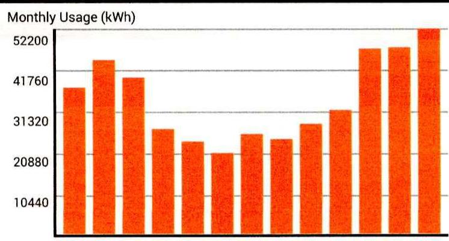

| 222300049802023 |
| :--: |
| 1024189 |
| 08/18/22 |
| 09/19/22 |
| Page 3 |

# CURRENT READINGS 

| Type | Start Date | End Date | Num   Days | Begin   Read | End   Read | Meter   Multi | kWh | kw | PF | Energy   Charges | TDSP   Charges | AGG   Fee | PUC | GRT | Other | Total |
| :--: | :--: | :--: | :--: | :--: | :--: | :--: | :--: | :--: | :--: | :--: | :--: | :--: | :--: | :--: | :--: |
| ESIID: | 10443720000774024 |  |  |  |  |  |  |  |  |  |  | 1107 W ROSAMOND | PKWY | FIEL | ANNA. TX 75409 |
| S 07 | 07/18/2022 | 08/16/2022 | 29 | 5.542 | 5.574 | 100 | 3200 | 109 | 0 | \$127.34 | \$931.06 | $\$ 0.00$ | $\$ 1.75$ | $\$ 11.28$ | $\$ 1.57$ | $\$ 1073.00$ |
|  |  |  |  |  |  |  |  |  |  |  |  |  | Texas Nodal | Charges: | $\$ 1.57$ |
| ESIID: | 10443720001003995 |  |  |  |  |  |  |  |  |  |  | 00401 S | SHER | LEY | AVE ANNA. TX 75409 |
| S 07 | 07/18/2022 | 08/16/2022 | 29 | 27.536 | 27.889 | 80 | 28240 | 81 | 0 | \$1123.76 | \$787.71 | $\$ 0.00$ | $\$ 3.21$ | $\$ 20.55$ | $\$ 13.82$ | $\$ 1949.05$ |
|  |  |  |  |  |  |  |  |  |  |  |  |  | Texas Nodal | Charges: | $\$ 13.82$ |
| ESIID: | 10443720001003997 |  |  |  |  |  |  |  |  |  |  | 00200 E | 7TH ANNA. | TX 75409-3596 |  |
| S 07 | 07/18/2022 | 08/16/2022 | 29 | 29.368 | 30.092 | 80 | 57920 | 158 | 0 | \$2304.82 | \$1500.26 | $\$ 0.00$ | $\$ 0.38$ | $\$ 40.92$ | $\$ 28.35$ | $\$ 3880.73$ |
|  |  |  |  |  |  |  |  |  |  |  |  |  | Texas Nodal | Charges: | $\$ 28.35$ |
| ESIID: | 10443720001432231 |  |  |  |  |  |  |  |  |  |  | 01008 S | RIGGINS | ODLT | BLL ANNA. TX 75409 |
| S 07 | 07/18/2022 | 08/16/2022 | 29 | 318.838 | 318.838 | 60 | 0 | 26 | 0 | $\$ 0.00$ | $\$ 54.21$ | $\$ 0.00$ | $\$ 0.09$ | $\$ 0.57$ | $\$ 0.00$ | $\$ 54.87$ |
| ESIID: | 10443720001432262 |  |  |  |  |  |  |  |  |  |  | 01008 S | RIGGINS | SIGN SC | SCREE ANNA. | TX 75409 |
| S 07 | 07/18/2022 | 08/16/2022 | 29 | 0 | 0 | 1 | 0 | 0 | 0 | $\$ 0.00$ | $\$ 8.12$ | $\$ 0.00$ | $\$ 0.01$ | $\$ 0.09$ | $\$ 0.00$ | $\$ 8.22$ |
| ESIID: | 10443720001432448 |  |  |  |  |  |  |  |  |  |  |  | 00921 S | RIGGINS ANNA. | TX 75409 |  |
| S 07 | 07/18/2022 | 08/16/2022 | 29 | 8.236 | 8.394 | 60 | 9480 | 38 | 0 | \$377.24 | \$257.27 | $\$ 0.00$ | $\$ 1.07$ | $\$ 6.82$ | $\$ 4.64$ | $\$ 647.04$ |
|  |  |  |  |  |  |  |  |  |  |  |  |  | Texas Nodal | Charges: | $\$ 4.64$ |
| ESIID: | 10443720004484499 |  |  |  |  |  |  |  |  |  |  | 200 E | 7TH ST | GRDI. ANNA. | TX 75409 |
| S 07 | 07/18/2022 | 08/16/2022 | 29 | 0 | 0 | 1 | 200 | 0.6466 | 0 | $\$ 7.96$ | $\$ 27.20$ | $\$ 0.00$ | $\$ 0.06$ | $\$ 0.38$ | $\$ 0.01$ | $\$ 35.61$ |
|  |  |  |  |  |  |  |  |  |  |  |  |  | Texas Nodal | Charges: | $\$ 0.01$ |
| ESIID: | 10443720006006746 |  |  |  |  |  |  |  |  |  |  | 00000 @GUARD | LIGHTS | GRDI. | GROL ANNA. | TX 75409 |
| S 05 | 05/23/2022 | 07/24/2022 | 31 | 0 | 0 | 1 | 490 | 1.5535 | 0 | \$19.55 | \$53.57 | $\$ 0.00$ | $\$ 0.12$ | $\$ 0.78$ | $\$ 0.02$ | $\$ 74.04$ |
|  |  |  |  |  |  |  |  |  |  |  |  |  | Texas Nodal | Charges: | $\$ 0.02$ |

| (S) $=$ Standard Read |
| :--: |
| (C) = Cancel Read (F) = Final Read (R) = RebiB (E) = Estimate |

| Type | Start | End | Begin | End | Meter | Multi | kWh | kw | PF | Energy | TOSP | AGG | PUC | GRT | Other | Total |
| :--: | :--: | :--: | :--: | :--: | :--: | :--: | :--: | :--: | :--: | :--: | :--: | :--: | :--: | :--: | :--: | :--: |
|  | Date | Date | Days | Read | Read |  |  |  |  |  | Charges | Fee |  |  |  |  |
| ESIID: | 10443720006480178 | Metered: | 150786428LG |  | Your Energy Price is: |  |  | 0.03804 |  |  |  |  |  |  | 01008 S RIGGINS BARN AG ANNA, TX 75409 |  |
| S 07 | 0708/2022 | 08/16/2022 | 29 | 28,711 | 31.420 | 1 | 2709 | 5 | 0 | \$107.80 | \$86.85 | $\$ 0.00$ | $\$ 0.32$ | $\$ 2.10$ | $\$ 1.33$ | $\$ 198.40$ |
|  |  |  |  |  |  |  |  |  |  |  |  |  |  | Texas Nodal Charges: $\$ 1.33$ |  |  |
| ESIID: | 10443720006547665 | Metered: | 115179257LG |  | Your Energy Price is: |  |  | 0.03804 |  |  |  |  |  | 00901 A S SHIRLEY AVE GYM ANNA, TX 75409 |  |
| S 07 | 0718/2022 | 08/16/2022 | 29 | 16,496 | 16,719 | 40 | 8920 | 30 | 0 | \$354.96 | \$315.99 | $\$ 0.00$ | $\$ 1.12$ | $\$ 7.20$ | $\$ 3.89$ | $\$ 683.16$ |
|  |  |  |  |  |  |  |  |  |  |  |  |  |  | Texas Nodal Charges: $\$ 3.89$ |  |  |
| ESIID: | 10443720007349697 | Metered: | 113502118LG |  | Your Energy Price is: |  |  | 0.03804 |  |  |  |  |  | 00601 N SHERLEY AVE BLDG ANNA, TX 75409-3530 |  |
| S 07 | 0718/2022 | 08/16/2022 | 29 | 14,740 | 15,078 | 40 | 13520 | 45 | 0 | \$538.01 | \$479.11 | $\$ 0.00$ | $\$ 1.70$ | $\$ 10.93$ | $\$ 6.62$ | $\$ 1036.37$ |
|  |  |  |  |  |  |  |  |  |  |  |  |  |  | Texas Nodal Charges: $\$ 6.62$ |  |  |
| ESIID: | 10443720007975075 | Metered: | 116101623LG |  | Your Energy Price is: |  |  | 0.03804 |  |  |  |  |  | 01430 COUNTY ROAD 371 ANNA, TX 75409 |  |
| S 07 | 0708/2022 | 08/16/2022 | 29 | 44,635 | 45,229 | 200 | 118800 | 374 | 0.89 | \$4727.41 | \$5207.23 | $\$ 0.00$ | $\$ 16.60$ | $\$ 106.53$ | $\$ 58.16$ | $\$ 10115.93$ |
|  |  |  |  |  |  |  |  |  |  |  |  |  |  | Texas Nodal Charges: $\$ 58.16$ |  |  |
| ESIID: | 10443720008268351 | Metered: | 115179118LG |  | Your Energy Price is: |  |  | 0.03804 |  |  |  |  |  | 00601 N SHERLEY AVE ROOM ANNA, TX 75409-3530 |  |
| S 07 | 0718/2022 | 08/16/2022 | 29 | 20,758 | 21,144 | 80 | 30880 | 112 | 0 | \$1228.81 | \$1131.00 | $\$ 0.00$ | $\$ 3.95$ | $\$ 25.35$ | $\$ 15.12$ | $\$ 2404.23$ |
|  |  |  |  |  |  |  |  |  |  |  |  |  |  | Texas Nodal Charges: $\$ 15.12$ |  |  |
| ESIID: | 10443720008524612 | Metered: | 116101622LG |  | Your Energy Price is: |  |  | 0.03804 |  |  |  |  | 01221 FERGUSON PKWY ANNA, TX 75409-4514 |  |
| S 07 | 0708/2022 | 08/16/2022 | 29 | 36,449 | 36,872 | 200 | 84600 | 322 | 0.872 | \$3366.49 | \$3451.20 | $\$ 0.00$ | $\$ 11.40$ | $\$ 73.19$ | $\$ 41.41$ | $\$ 6943.69$ |
|  |  |  |  |  |  |  |  |  |  |  |  |  |  | Texas Nodal Charges: $\$ 41.41$ |  |  |
| ESIID: | 10443720008641699 | Metered: | 1161086556.G |  | Your Energy Price is: |  |  | 0.03804 |  |  |  |  | 01201 N POWELL PKWY STE A ANNA, TX 75409-2580 |  |
| S 07 | 0718/2022 | 08/16/2022 | 29 | 10,264 | 10,264 | 40 | 0 | 0 | 0 | $\$ 0.00$ | $\$ 8.12$ | $\$ 0.00$ | $\$ 0.01$ | $\$ 0.09$ | $\$ 0.00$ | $\$ 8.22$ |
| ESIID: | 10443720008646225 | Metered: | 116108260LG |  | Your Energy Price is: |  |  | 0.03804 |  |  |  |  | 01201 N POWELL PKWY STE B ANNA, TX 75409-2580 |  |
| S 07 | 0718/2022 | 08/16/2022 | 29 | 10,242 | 10,430 | 40 | 7520 | 65 | 0 | \$299.24 | \$428.47 | $\$ 0.00$ | $\$ 1.21$ | $\$ 7.79$ | $\$ 3.68$ | $\$ 740.39$ |
|  |  |  |  |  |  |  |  |  |  |  |  |  |  | Texas Nodal Charges: $\$ 3.68$ |  |  |

| (S) $=$ Standard Read |  |  |  |  |  |  |  |  |  |  |  |  |  |  |  |
| :--: | :--: | :--: | :--: | :--: | :--: | :--: | :--: | :--: | :--: | :--: | :--: | :--: | :--: | :--: | :--: |
| (C) = Cancel Read |  |  |  |  |  |  |  |  |  |  |  |  |  |  |  |
| (R) = Rebill |  |  |  |  |  |  |  |  |  |  |  |  | (E) = Estimate |  |  |
|  |  |  |  |  |  |  |  |  |  |  |  |  |  |  |  |
| ESIID: 10443720009255964 |  | Metered: 199614877LG |  |  | Your Energy Price is: |  |  | 0.03804 |  |  |  |  |  | 912 S RIGGINS ST CONC ANNA, TX 75409 |  |
| S 07/18/2022 | 08/16/2022 | 29 | 14,359 |  | 14,456 | 1 | 97 | 2 | 0 | $\$ 3.96$ | $\$ 58.14$ | $\$ 0.00$ | $\$ 0.11$ | $\$ 0.66$ | $\$ 0.04$ | $\$ 62.81$ |
|  |  |  |  |  |  |  |  |  |  |  |  |  |  | Texas Nodal Charges: $\$ 0.04$ |  |  |
| ESIID: 10443720009493812 |  | Metered: 147646798LG |  |  | Your Energy Price is: |  |  | 0.03804 |  |  |  |  | 01201 N POWELL PKWY BLDG FLDHS ANNA, TX 75409-2580 |  |  |  |
| S 07/18/2022 | 08/16/2022 | 29 | 15,382 |  | 15,831 | 100 | 44900 | 173 | 0 | $\$ 1786.72$ | $\$ 1723.39$ | $\$ 0.00$ | $\$ 5.68$ | $\$ 37.69$ | $\$ 21.97$ | $\$ 3575.65$ |
|  |  |  |  |  |  |  |  |  |  |  |  |  |  | Texas Nodal Charges: $\$ 21.97$ |  |  |
| ESIID: 10443720009534732 |  | Metered: 118433501LG |  |  | Your Energy Price is: |  |  | 0.03804 |  |  |  |  | 01201 N POWELL PKWY ANNA, TX 75409-2580 |  |  |  |
| S 07/18/2022 | 08/16/2022 | 29 | 1,232.423 |  | 1,602.499 | 400 | 148030 | 453 | 0.874 | $\$ 5880.24$ | $\$ 4912.56$ | $\$ 0.00$ | $\$ 18.04$ | $\$ 115.80$ | $\$ 55.54$ | $\$ 10982.18$ |
|  |  |  |  |  |  |  |  |  |  |  |  |  |  | Texas Nodal Charges: $\$ 55.54$ |  |  |
| ESIID: 10443720009790621 |  | Metered: 114663957LG |  |  | Your Energy Price is: |  |  | 0.03804 |  |  |  |  | 501 S SHERLEY AVE BUS BARN ANNA, TX 75409 |  |  |  |
| S 07/18/2022 | 08/16/2022 | 29 | 55,626 |  | 60,195 | 1 | 4569 | 16 | 0 | $\$ 161.48$ | $\$ 187.11$ | $\$ 0.00$ | $\$ 0.62$ | $\$ 3.96$ | $\$ 2.24$ | $\$ 375.41$ |
|  |  |  |  |  |  |  |  |  |  |  |  |  |  | Texas Nodal Charges: $\$ 2.24$ |  |  |

# YOUR SERVICE CHARGES 

1107 W ROSAMOND PKWY, ANNA TX
EDC.\# 10443720009152331
Store Number :
PO \#:
Direct Energy Business
Electric Service
Meter\# 158709655LG
Current meter read Actual-Total
Previous read
Current period consists of 29 days
Meter Multiplier of 1,500 x Difference of $0.702=$
PowerFactor $=0.853$
Current meter read Actual-Total
Previous read
Current period consists of 29 days
Meter Multiplier of 1,500 x Difference of $287.797=$
PowerFactor $=0$

| June 15, 2022 | 0.702 |  |
| :--: | :--: | :--: |
| May 17, 2022 | 0 |  |
| Difference | 0.702 |  |
|  |  | 1,053 kW |
| June 15, 2022 | 5,976.987 |  |
| May 17, 2022 | 5,689.19 |  |
| Difference | 287.797 |  |
| 431,696 kWh |  |  |

May 17, 2022 to June 15, 2022
Fixed Price - 431,696 kWh Total @ \$0.03804/kWh
$\$ 16,421.72$
Nodal Congestion - 431,696 kWh Total @ \$0.000773/kWh
\$333.65
AncillaryServiceObligationAdj-208,404.965517 kWh Total @ \$0.001724 /kWh-June-2022
AncillaryServiceObligationAdj - 223,291.034483 kWh Total @ \$0.001282 /kWh-May-2022
\$286.26

Gross Receipts Reimb. - 0\% Exempt
TX Puc Assessment - 0\% Exempt
\$186.19
TX Puc Assessment - 0\% Exempt
\$29.01
Current Actual Charges
\$17,616.12

## Oncor

## Electric Service

| Meter\# 158709655LG |  |  |  |
| :--: | :--: | :--: | :--: |
| Current meter read Actual-Total | June 15, 2022 | 0.702 |  |
| Previous read | May 17, 2022 | 0 |  |
| Current period consists of 29 days | Difference | 0.702 |  |
| Meter Multiplier of 1,500 x Difference of $0.702=$ |  |  | 1,053 kW |
| PowerFactor $=0.853$ |  |  |  |
| Current meter read Actual-Total | June 15, 2022 | 5,976.987 |  |
| Previous read | May 17, 2022 | 5,689.19 |  |
| Current period consists of 29 days | Difference | 287.797 |  |
| Meter Multiplier of 1,500 x Difference of $287.797=$ |  |  | 431,696 kWh |
| PowerFactor $=0$ |  |  |  |

| 33 | Direct Energy Business | Invoice \# | 221720049363807 |
| :--: | :--: | :--: | :--: |
|  |  | Account \# | 1321961 |
|  |  | Invoice Date | 06/21/22 |
|  |  | Due Date | 07/21/22 |
|  |  |  | Page 4 |
| 1107 W ROSAMOND PKWY, ANNA TX (Continued) |  |  |  |
| EDC.\# 10443720009152331 | Store Number : |  |  |
| PO \#: |  |  |  |
| May 17, 2022 to June 16, 2022 |  |  |  |
| TRANSMISSION COST RECOVERY FACTOR |  | \$6,403.21 |  |
| METERING CHARGE |  | \$30.82 |  |
| NUCLEAR DECOMMISSIONING CHARGE |  | \$62.17 |  |
| CUSTOMER CHARGE |  | \$9.25 |  |
| DISTRIBUTION SYSTEM CHARGE |  | \$5,275.37 |  |
| ENERGY EFFICIENCY COST RECOVERY |  | \$274.99 |  |
| DISTRIBUTION COST RECOVERY FACTOR |  | \$575.71 |  |
| INTEREST SAVINGS REFUND |  | - $\$ 21.59$ |  |
| Gross Receipts Reimb. - 0\% Exempt |  | \$134.26 |  |
| TX Puc Assessment - 0\% Exempt |  | \$20.92 |  |
| Current Actual Charges |  | \$12,765.11 |  |

TOTAL CHARGES FOR EDC.\# 10443720009152331

| 221740049392958 |  |  |  |  |
| :--: | :--: | :--: | :--: | :--: |
|  | Account |  | 1024189 |  |
| Business |  |  | 06/23/22 |  |
|  | Due Date |  | 07/25/22 |  |
|  |  |  | Page 6 |  |
| CURRENT MONTHLY CHARGES |  |  |  |  |
| Energy Charges |  |  | \$24128.00 |  |
| M elered/Unmetered Charges | 616104.00 kWh |  | \$24128.00 |  |
| Texas Nodal Charges |  |  | \$696.86 |  |
| Transmission and Distribution Charges |  |  | \$29553.93 |  |
| Aggregator Charge |  |  | \$0.00 |  |
| Aggregator Fee |  |  | \$0.00 |  |
| Regulatory Charges |  |  | \$670.47 |  |
| Public Utility Assessment |  |  | \$90.37 |  |
| Texas Gross Receipts |  |  | \$580.10 |  |
| TOTAL CURRENT MONTHLY CHARGES |  |  |  | \$55,049.26 |
| OTHER CHARGES AND ADJUSTMENTS |  |  |  | - $\$ 16,076.40$ |
| Other Current Charges |  |  | \$0.00 |  |
| Other ESIID Charges and Credits |  |  | - $\$ 16076.40$ |  |
| Other Account Charges and Credits |  |  | \$0.00 |  |
| PRIOR BALANCE AND PAYMENTS |  |  |  | \$37,492.82 |
| TOTAL AMOUNT DUE |  |  |  | \$76,465.68 |
| Texas Gross Receipts: state fees administered by the Texas Comptroller of Public Accounts |  |  |  |  |
| PUC Fee: fee administered by the Public Utility Commission used to finance the Commission |  |  |  |  |
| *These fees have always been applied by Energy Providers but were not typically displayed separately on bills prior to electric market deregulation |  |  |  |  |

## CUSTOMER INFORMATION

Company:
Anna ISD

Billing Address:

Anna ISD
501 S. Sherley St.
Anna, TX 75409

## USAGE HISTORY

Monthly Usage (kWh)

The image is a bar chart.

- **Chart Type**: Bar chart
- **Title**: Monthly Usage (kWh)
- **Y-Axis Labels**: 
  - 52200
  - 41760
  - 31320
  - 20880
  - 10440
- **X-Axis Labels**: 
  - Jul
  - Aug
  - Sep
  - Oct
  - Nov
  - Dec
  - Jan
  - Feb
  - Mar
  - Apr
  - May
  - Jun
  - Jul
- **Data Representation**: The bars represent monthly electricity usage in kilowatt-hours (kWh).
- **Styling**: The bars are colored in orange.
- **Notable Features**: The chart shows fluctuations in monthly usage with peaks and troughs throughout the year, indicating a yearly usage breakdown (monthly-based).

Jul Aug Sep Oct Nov Dec Jan Feb Mar Apr May Jun Jul

# MESSAGE CENTER 

|  | Invoice \# | 222210049727100 |
| :--: | :--: | :--: |
| Account \# | 1660156 |  |
| Invoice Date | 08/09/22 |  |
| Due Date | 09/08/22 |  |
|  | Page 1 |  |

## INVOICE SUMMARY

Previous Balance \$3,130.98 Payment Received \$0.00 Total Balance Forward \$3,130.98 Adjustments \$0.00
Late Payment Charge
Current Usage Charges \$3,348.94
Taxes \$41.33
Total Current Charges \$3,390.27
Amount Due By September 8, 2022 \$6,521.25

## PAYMENT OPTIONS

By web
myaccount.directenergy.com
By phone
By mail
888.925.9115

## QUAL

## QUESTIONS?

Visit Us
myaccount.directenergy.com
Call Us
888.925.9115
Outages
1.888.313.4747

Detach here and return this portion with check or money order. Do not staple or fold.

| 0002498 | 01 MB. 0.515 | $\begin{array}{ll} \text { "AUTO } & 120.1120 .15409-359601 \\ \text { I } \\ \text { II } \\ \text { III } \\ \text { IV } \\ \text { V } \\ \text { V } \\ \text { V } \end{array}$ | $\begin{aligned} & 222210049727100 \\ & 1660156 \\ & 08 / 09 / 22 \\ & 09 / 08 / 22 \\ & \text { Page } 1 \end{aligned}$ |
| :--: | :--: | :--: | :--: |

| Amount Due by September 8, 2022 | $\$ 6,521.25$ |
| :-- | --: |
| Amount Enclosed |  |
| Please write your account number on your check or money order made |  |
| payable to Direct Energy Business. |  |

Please remit to
||||||||||||||||||||||||||||||||||||||||||||||||||||||||||||||||||||||||||||||||||||||||||||||||||||||||||||||||||||||||||||||||||||||||||||||||||||||||||||||||||||||||||||||||||||||||||||||||||||||||||||||||||||||||||||||||||||||||||||||||||||||||||||||||||||||||||||||||||||||||||||||||||||||||||||||||||||||||||||||||||||||||||||||||||||||||||||||||||||||||||||||||||||||||||||||||||||||||||||||||

The average price you paid reflects the total of all fixed and variable recurring charges, but does not include state and local sales taxes, reimbursement for the state miscellaneous gross receipt tax, and any nonrecurring charges or credits, divided by the kilowatthour consumption. The amount billed may include price changes allowed by law or regulatory actions.

## GENENAL INFORMATION

For questions or concerns relating to this bill, please call Direct Energy Business's Customer Relations Department at:

## 8 AM - 6 PM ET, Monday through Friday

myaccount.directenergy.com
Phone: 888.925.9115

If mailing correspondence, please forward to Direct Energy Business
Attn: Customer Relations
1001 Liberty Avenue
Pittsburgh, PA 15222

Delivery problems such as power outages are typically due to problems with local distribution facilities. For service problems call the utility's 24 -hour service center at: Oncor 1.888.313.4747.
According to the terms contained in your energy service agreement with Direct Energy, if you end your service prior to the end of your agreement term, you may be charged an early termination fee. Please refer to your energy service agreement for details.
In the event that the Term of your Agreement has expired, your account will be invoiced at a Market Variable Rate. This rate is subject to change monthly. Please refer to your agreement for additional information.
RIGHT TO FILE A PUC COMPLAINT: If you believe this bill contains any unauthorized charges, please contact Direct Energy Business Customer Relations at the information above. If, after contacting Customer Relations, you are not satisfied with the resolution, you have the right to file a complaint with Public Commission of Texas, P.O.Box 13326, Austin, TX 78711-3326, (512) 936-7120 or toll free in Texas at (888) 782-8477. Hearing and speech impaired individuals with text telephones (TTY) may contact the Commission at 1-866-787-9819.

Direct Energy Business - REP Certificate Number: 10011

For more information on terms and definitions found within this invoice, please visit us online at directorycores/.
directenergybusiness.com/ or through MyAccount. If you would prefer to have a copy of invoice terms and definitions sent to you, please submit your request via phone at 1-888-925-9115.

Change of Address?
Please contact the Direct Energy Business Customer Relations team at:
Direct Energy Business
Attn: Customer Relations
1001 Liberty Avenue
Pittsburgh, PA 15222
Phone 1-888-925-9115

# YOUR SERVICE CHARGES 

1107 W ROSAMOND PKWY BLDG B, ANNA TX
EDC.\# 10443720006741196
Store Number :
PO \#:
Direct Energy Business
Electric Service
Mater\# 147648319LG
Current meter read Actual-Total
Previous read
Current period consists of 29 days
Meter Multiplier of $100 \times$ Difference of $1.3=$
PowerFactor $=0$
Current meter read Actual-Total
Previous read
Current period consists of 29 days
Meter Multiplier of $100 \times$ Difference of $522=$
PowerFactor $=0$

August 4, 2022
July 6, 2022
Difference
130 kW
11,373
10,851
522
52,200 kWh

52,200 kWh

## July 6, 2022 to August 4, 2022

Fixed Price - 52,200 kWh Total @ \$0.03804/kWh
Nodal Congestion - 52,200 kWh Total @ \$0.000565/kWh
AncillaryServiceObligationAdj - 5,400 kWh Total @ \$0.001649 /kWh-August2022

AncillaryServiceObligationAdj - 46,800 kWh Total @ \$0.00172 /kWh-July-2022

Gross Receipts Reimb. - 0\% Exempt
TX Puc Assessment - 0\% Exempt
Current Actual Charges

## Oncor

## Electric Service

Meter\# 147648319LG
Current meter read Actual-Total
Previous read
Current period consists of 29 days
Meter Multiplier of $100 \times$ Difference of $1.3=$
PowerFactor $=0$
Current meter read Actual-Total
Previous read
Current period consists of 29 days
Meter Multiplier of $100 \times$ Difference of $522=$
PowerFactor $=0$

August 4, 2022
July 6, 2022
Difference
130 kW
11,373
10,851
522
52,200 kWh

|  | Invoice \# | 222210049727100 |
| :--: | :--: | :--: |
|  | Account \# | 1660156 |
|  | Invoice Date | 08/09/22 |
|  | Due Date | 09/08/22 |
|  |  | Page 4 |
| 1107 W ROSAMOND PKWY BLDG B, ANNA TX (Continued) |  |  |
| EDC.\# 10443720006741196 | Store Number : |  |
| PO \#: |  |  |
| {July 6, 2022 to August 5, 2022   TRANSMISSION COST RECOVERY FACTOR} |  |  |
|  |  | \$515.72 |
| METERING CHARGE |  |  |
| NUCLEAR DECOMMISSIONING CHARGE |  | \$6.89 |
| CUSTOMER CHARGE |  | \$9.25 |
| DISTRIBUTION SYSTEM CHARGE |  | \$584.65 |
| ENERGY EFFICIENCY COST RECOVERY |  | \$33.25 |
| DISTRIBUTION COST RECOVERY FACTOR |  | \$63.80 |
|  |  |  |
| Gross Receipts Reimb. - 0\% Exempt |  | \$13.24 |
| TX Puc Assessment - 0\% Exempt |  | \$2.06 |
| Current Actual Charges |  | \$1,259.68 |
|  |  |  |
| TOTAL CHARGES FOR EDC.\# 10443720005741196 |  | \$3,390.27 |

