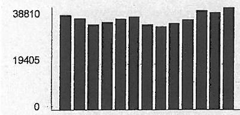
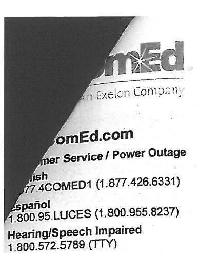
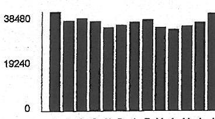
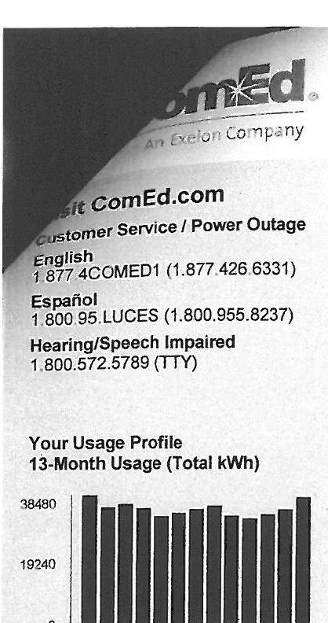
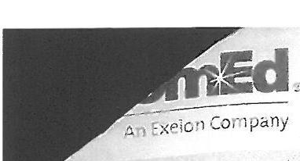
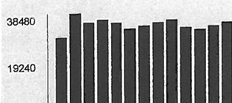
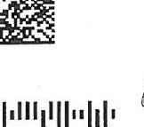
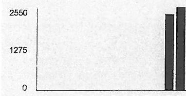

## Visit ComEd.com

Customer Service / Power Outage English
1.877.4COMED1 (1.877.425.6331)

## Español

1.800.95.LUCES (1.800.955.8237)

Hearing/Speech Impaired
1.800.572.5789 (TTY)

Your Usage Profile
13-Month Usage (Total kWh)

The image is a bar chart. 

- **Chart Type**: Bar chart
- **Y-Axis Labels**: 38810, 19405, 0
- **X-Axis Labels**: Not visible
- **Data Representation**: The bars represent monthly electric usage in kWh.
- **Yearly Usage Breakdown (Monthly-Based)**: The chart visually represents the monthly electric usage over a period, with each bar corresponding to a specific month.
- **Styling**: The bars are uniformly colored, with no additional highlights or emphasis.

S O N D J F M A M J J A B

Electric Usage

| Month | kWh |
| :-- | :--: |
| Sep-15 | 35881 |
| Oct-15 | 34668 |
| Nov-15 | 32342 |
| Dec-15 | 33217 |
| Jan-16 | 34405 |
| Feb-16 | 35186 |
| Mar-16 | 32325 |
| Apr-16 | 31649 |
| May-16 | 32781 |
| Jun-16 | 34173 |
| Jul-16 | 37625 |
| Aug-16 | 38986 |
| Sep-16 | 38810 |

| Month Billed | Average Daily |
| :-- | --: |
|  | kWh |
| Last Year | 1237.3 |
| Last Month | 1155.2 |
| Current Month | 1338.3 |

Page 1 of 3
Account Number 7926158033
Name CHAMPION PACKAGING
Service Location 1533 W DAVEY RD WOODRIDGE
Phone Number 630-972-0100

Issue Date
August 31, 2016

| Meter Information |  |  |  |  |  |  |  |  |
| :--: | :--: | :--: | :--: | :--: | :--: | :--: | :--: | :--: |
| Read   Dates | Meter   Number | Load   Type | Reading   Type | Previous | Meter Reading Present | Difference | Multiplier   $X$ | Usage |
| $\begin{aligned} & 81- \\ & 800 \end{aligned}$ | 230024039 | General Service | Total kWh | Actual | Actual |  |  | 14 |
| $\begin{aligned} & 81- \\ & 800 \end{aligned}$ | 230024039 | General Service | On Pk kW | Actual | Actual |  |  | 0.02 |
| $\begin{aligned} & 81- \\ & 800 \end{aligned}$ | 230083026 | General Service | Total kWh | Actual | Actual |  |  | 38797 |
| $\begin{aligned} & 81- \\ & 800 \end{aligned}$ | 230083026 | General Service | On Pk kW | Actual | Actual |  |  | 103.10 |

Service from 8/1/2016 to 8/30/2016 - 29 Days
Commercial Hourly - 100 kW to 400 kW
Electricity Supply Services
$2,045.17$
Electricity Supply Charge 38,810 kWh
1,495.72

Transmission Services Charge 38,810 kWh
$X$
327.94

Capacity Charge 109.38 kW X
3.12153
341.43

Purchased Electricity Adjustment 341.43

Misc Procurement Component Chg
38,810 kWh X
-194.05

Delivery Services - ComEd
$745.96$
Customer Charge 23.52

Standard Metering Charge 27.12

Distribution Facilities Charge 103.12 kW X 6.31000
650.69

IL Electricity Distribution Charge 38,810 kWh X 0.00115
44.63

For Electric Supply Choices visit
pluginillinois.org
(continued on next page)
Return only this portion with your check made payable to ComEd. Please write your account number on your check.

## ComEd

An Exeion Company

0116946.01 AV 0.373 **AUTO T9 01266 60517-494440 -C04-B1-P16962-It 45 BC
$\| \| \mid\| \mid\| \mid\| \mid\| \mid\| \mid\| \mid\| \mid\| \mid\| \mid\| \mid\| \mid\| \mid\| \mid\| \mid\| \mid\|$
CHAMPION PACKAGING
1840 INTERNATIONALE PKWY
WOODRIDGE, IL 60517-4944

To pay by phone call 1-800-588-9477.
A convenience fee will apply.

Account Number
7926158033

Payment Amount

Please pay this
amount by $9 / 15 / 2016$
\$3,223.78
$\left.\begin{array}{l}\text { m\|||m||d||dm||||d||m||m||m||m||m||m||m||d||||||m } \\ \text { COMED } \\ \text { PO BOX 6111 } \\ \text { CAROL STREAM, IL 60197-6111 }\end{array}\right\}$

To pay by phone call 1-800-588-9477.
A convenience fee will apply.

The image is a photo of a partially obscured document. The visible text includes:

- "ComEd"
- "An Exelon Company"
- "ComEd.com"
- "Customer Service / Power Outage"
- "English"
- "1.877.4COMED1 (1.877.426.6331)"
- "Español"
- "1.800.95.LUCES (1.800.955.8237)"
- "Hearing/Speech Impaired"
- "1.800.572.5789 (TTY)"

Page 1 of 2
Account Number 7926158033
Name CHAMPION PACKAGING
Service Location 1533 W DAVEY RD WOODRIDGE
Phone Number 630-972-0100

## $33 \% 5$

Bill Summary
Previous Balance $\$ 2,765.48$
Total Payments - Thank You \$2,765.48
Amount Due on August 17, 2016 \$2,904.00

Issue Date
August 2, 2016

| Meter Information |  |  |  |  |  |  |  |  |
| :--: | :--: | :--: | :--: | :--: | :--: | :--: | :--: | :--: |
| Read   Dates | Meter   Number | Load   Type | Reading   Type | Previous | Meter Reading   Present | Difference | Multiplier   $X$ | Usage |
| 500-   5/1 | 230024039 | General Service | Total kWh | Actual | Actual |  |  | 16 |
| 500-   5/1 | 230024039 | General Service | On Pk kW | Actual | Actual |  |  | 0.02 |
| 500-   5/1 | 230083026 | General Service | Total kWh | Actual | Actual |  |  | 36950 |
| 500-   5/1 | 230083026 | General Service | On Pk kW | Actual | Actual |  |  | 98.76 |

Service from 6/30/2016 to 8/1/2016 - 32 Days
Commercial Hourly - 100 kW to 400 kW

Electric Usage

| Month | kWh |
| :-- | :--: |
| Aug-15 | 34894 |
| Sep-15 | 35881 |
| Oct-15 | 34668 |
| Nov-15 | 32342 |
| Dec-15 | 33217 |
| Jan-16 | 34405 |
| Feb-16 | 35186 |
| Mar-16 | 32325 |
| Apr-16 | 31649 |
| May-16 | 32781 |
| Jun-16 | 34173 |
| Jul-16 | 37625 |
| Aug-16 | 36966 |

| Year | Average Daily |
| :--: | :--: |
| Month Billed | kWh Temp |
| Last Year | 1246.2 |
| Last Month | 1297.4 |
| Current Month | 1155.2 |

| Electricity Supply Charge | 36,966 kWh |  | 1,277.09 |
| :--: | :--: | :--: | :--: |
| Transmission Services Charge | 36,966 kWh | $X$ | 0.00845 |
| Capacity Charge | 109.38 kW | $X$ | 3.12153 |
| Purchased Electricity Adjustment | 36,966 kWh | $X$ | 0.00191 |
| Misc Procurement Component Chg | 36,966 kWh | $X$ | 0.00191 |
| Delivery Services - ComEd |  |  |  |
| Customer Charge |  |  | 23.52 |
| Standard Metering Charge |  |  | 27.11 |
| Distribution Facilities Charge | 98.78 kW | $X$ | 6.31000 |
| IL Electricity Distribution Charge | 36,966 kWh | $X$ | 0.00115 |

## Electricity Supply Services

For Electric Supply Choices visit
puglinlilinois.org
$\qquad$ (continued on next page)

Return only this portion with your check made payable to ComEd. Please write your account number on your check.

## ComEd

An Fweton Company

To pay by phone call 1-800-588-9477.
A convenience fee will apply.

| 011614201 AV 0.373 | $\rightarrow$ AUTO T4 0124560517 -494440 | $-004-81$ - P16158-f1 4 |
| :--: | :--: | :--: |
|  |  |  |
|  |  |  |

Account Number
7926158033
Payment Amount

Please pay this
amount by $8 / 17 / 2016$
\$2,904.00

Taxes and Other ..... $\$ 370.90$
Environmental Cost Recovery Adj ..... 36,986 kWh ..... X ..... 0.00002 ..... 0.74
Energy Efficiency Programs ..... 36,986 kWh ..... X ..... 0.00255 ..... 94.26
Franchise Cost ..... $\$ 711.19$ ..... $X$ ..... $1.80800 \%$ ..... 12.86
State Tax ..... 118.14
Municipal Tax ..... 144.90
Total Current Charges ..... $\$ 2,904.00$
Thank you for your payment of $\$ 2,765.48$ on July 18, 2016
Total Amount Due ..... $\$ 2,904.00$
DEPOSIT
Deposit on Hand ..... $\$ 15,010.00$
Deposit Interest Accrued ..... $\$ 39.56$
Message Center
ComEd

- SCAM ALERT: ComEd will never call you to request cash or ask you to buy a prepaid credit card to pay a bill. Visit ComEd.com/ScamAlert to learn more.
- SMARTER ENERGY CHOICES: The smart grid enables tools and programs to help you make smarter energy choices for more convenience, control and savings opportunities. Learn more at ComEd.com/SmartGrid.
- BEST TIMES TO CALL: Experience shorter wait times from Tuesday to Friday between 11:00am and 4:00pm. Longer wait times can be expected on Mondays, the first business day after a holiday, and the first business day of the month.
- SAVINGS FOR YOUR BUSINESS: A facility assessment is the first step to your business becoming more energy efficient. Call 855-433-2700 to schedule yours today.
- WAYS TO PAY: Looking for ways to pay your bill? Visit ComEd.com/PayBill
- ILLINOIS COMMERCE COMMISSION CONSUMER DIVISION (800-524-0795): The Consumer Services Division is available to help resolve disputes with ComEd. However, customers should contact ComEd before seeking assistance from the ICC.

Visit ComEd.com
Customer Service / Power Outage
English
1.877.4COMED1 (1.877.426.6331)

## Expatio

1.800.95.LUCES (1.800.955.8237)

Hearing/Speech Impaired
1.800.572.5789 (TTY)

Your Usage Profile
13-Month Usage (Total kWh)

The image is a bar chart.

- **Chart Type**: Bar chart
- **Axes**:
  - Y-axis: Labeled with values "0", "19240", "38480"
  - X-axis: Not visible in the image
- **Data Points**: Bars are shown with varying heights, corresponding to the values on the Y-axis.
- **Styling**: The bars are uniformly colored and spaced.
- **Context**: This chart likely represents a "yearly usage breakdown (monthly-based)" for electric usage in kWh, as suggested by the surrounding text.

2 A S O N D J F M A M J J

| Electric Usage |  |  |  |  |  |  |  |  |
| :--: | :--: | :--: | :--: | :--: | :--: | :--: | :--: | :--: |
| Month | kWh |  |  |  |  |  |  |  |
| Jul-15 | 38477 | Bill Summary |  |  |  |  |  |  |
| Aug-15 | 34894 | Previous Balance |  |  |  |  |  |  |
| Sep-15 | 35881 | Total Payments - Thank You |  |  |  |  |  |  |
| Oct-15 | 34658 | Amount Due on July 19, 2016 |  |  |  |  |  |  |
| Nov-15 | 32342 |  |  |  |  |  |  |  |
| Dec-15 | 33217 |  |  |  |  |  |  |  |
| Jan-16 | 34405 |  |  |  |  |  |  |  |
| Feb-16 | 35186 |  |  |  |  |  |  |  |
| Mar-16 | 32325 |  |  |  |  |  |  |  |
| Apr-16 | 31649 | Actual |  | Actual |  |  |  | 59.12 |
| May-16 | 32791 |  |  |  |  |  |  |  |
| Jun-16 | 34173 |  |  |  |  |  |  |  |
| Jul-16 | 37625 |  |  |  |  |  |  |  |
| Average Daily |  |  |  |  |  |  |  |  |
| Month Billed | kWh | Temp |  |  |  |  |  |  |
| Last Year | 1131.7 | 70 |  |  |  |  |  |  |
| Last Month | 1139.1 | 62 |  |  |  |  |  |  |
| Current Month | 1297.4 | 72 |  |  |  |  |  |  |

| Month Billed | kWh | Temp |
| :--: | :--: | :--: |
|  | kWh | Temp |
| Last Year | 1131.7 | 70 |
| Last Month | 1139.1 | 62 |
| Current Month | 1297.4 | 72 |

| Year | 1131.7 | 70 |
| :--: | :--: | :--: |
|  | 1139.1 | 62 |
| 011908201 AV 0.373 | *AUTO | T9 0 1223 62817-494440 |
| $11908201$ AV 0.373 | *AUTO | T9 0 1223 62817-494440 |
| $11908201$ AV 0.373 | *AUTO | T9 0 1223 62817-494440 |
| $11908201$ AV 0.373 | *AUTO | T9 0 1223 62817-494440 |
| $11908201$ AV 0.373 | *AUTO | T9 0 1223 62817-494440 |
| 011908201 AV 0.373 | *AUTO | T9 0 1223 62817-494440 |
| 011908201 AV 0.373 | *AUTO | T9 0 1223 62817-494440 |
| 11908201 AV 0.373 | *AUTO | T9 0 1223 62817-494440 |
| 11908201 AV 0.373 | *AUTO | T9 0 1223 62817-494440 |
| 11908201 AV 0.373 | *AUTO | T9 0 1223 62817-494440 |
| 11908201 AV 0.373 | *AUTO | T9 0 1223 62817-494440 |
| 11908201 AV 0.373 | *AUTO | T9 0 1223 62817-494440 |
| 11908201 AV 0.373 | *AUTO | T9 0 1223 62817-494440 |
| 11908201 AV 0.373 | *AUTO | T9 0 1223 62817-494440 |
| 11908201 AV 0.373 | *AUTO | T9 0 1223 62817-494440 |
| 11908201 AV 0.373 | *AUTO | T9 0 1223 62817-494440 |
| 11908201 AV 0.373 | *AUTO | T9 0 1223 62817-494440 |
| 11908201 AV 0.373 | *AUTO | T9 0 1223 62817-494440 |
| 11908201 AV 0.373 | *AUTO | T9 0 1223 62817-494440 |
| 11908201 AV 0.373 | *AUTO | T9 0 1223 62817-494440 |
| 11908201 AV 0.373 | *AUTO | T9 0 1223 62817-494440 |
| 11908201 AV 0.373 | *AUTO | T9 0 1223 62817-494440 |
| 11908201 AV 0.373 | *AUTO | T9 0 1223 62817-494440 |
| 11908201 AV 0.373 | *AUTO | T9 0 1223 62817-494440 |
| 11908201 AV 0.373 | *AUTO | T9 0 1223 62817-494440 |
| 11908201 AV 0.373 | *AUTO | T9 0 1223 62817-494440 |
| 11908201 AV 0.373 | *AUTO | T9 0 1223 62817-494440 |
| 11908201 AV 0.373 | *AUTO | T9 0 1223 62817-494440 |
| 11908201 AV 0.373 | *AUTO | T9 0 1223 62817-494440 |
| 11908201 AV 0.373 | *AUTO | T9 0 1223 62817-494440 |
| 11908201 AV 0.373 | *AUTO | T9 0 1223 62817-494440 |
| 11908201 AV 0.373 | *AUTO | T9 0 1223 62817-494440 |
| 11908201 AV 0.373 | *AUTO | T9 0 1223 62817-494440 |
| 11908201 AV 0.373 | *AUTO | T9 0 1223 62817-494440 |
| 11908201 AV 0.373 | *AUTO | T9 0 1223 62817-494440 |
| 11908201 AV 0.373 | *AUTO | T9 0 1223 62817-494440 |
| 11908201 AV 0.373 | *AUTO | T9 0 1223 62817-494440 |
| 11908201 AV 0.373 | *AUTO | T9 0 1223 62817-494440 |

The image is a photo of a section of a utility bill. It includes a bar chart titled "Your Usage Profile 13-Month Usage (Total kWh)" showing monthly electricity usage. The y-axis is labeled with numbers, including 38480 and 19240, indicating kWh usage. The chart visually represents electricity consumption over 13 months, with each bar corresponding to a month's usage. The top of the image has contact information for ComEd customer service in English, Spanish, and for the hearing/speech impaired, with respective phone numbers. The ComEd logo is partially visible at the top.

J A S O N D J F M A M J J

## Electric Usage

| Month | kWh |
| :-- | :--: |
| Jul-15 | 38477 |
| Aug-15 | 34894 |
| Sep-15 | 35881 |
| Oct-15 | 34888 |
| Nov-15 | 32342 |
| Dec-15 | 33217 |
| Jan-16 | 34405 |
| Feb-16 | 35186 |
| Mar-16 | 32325 |
| Apr-16 | 31649 |
| May-16 | 32781 |
| Jun-16 | 34173 |
| Jul-16 | 37625 |

| Average Daily |  |
| :-- | --: |
| kWh | Temp |
| 1131.7 | 70 |
| 1139.1 | 62 |
| 1297.4 | 72 |

Page 1 of 2
Account Number 7926158033
Name CHAMPION PACKAGING Service Location 1533 W DAVEY RD WOODRIDGE Phone Number 630-972-0100

| Bill Summary |  |  |
| :--: | :--: | :--: |
| Previous Balance |  | \$2,557.88 |
| Total Payments - Thank You |  | \$2,557.88 |
| Amount Due on July 19, 2016 |  | \$2,765.48 |

Issue Date July 1, 2016

| Meter Information |  |  |  |  |  |  |  |  |
| :--: | :--: | :--: | :--: | :--: | :--: | :--: | :--: | :--: |
| Read   Dates | Meter   Number | Load   Type | Reading   Type | Previous | Meter Reading   Present | Difference | Multiplier   $X$ | Usage |
| 6/1-   6/30 | 230024039 | General Service | Total kWh | Actual | Actual |  |  | 14 |
| 6/1-   6/30 | 230024039 | General Service | On Pk kW | Actual | Actual |  |  | 0.02 |
| 6/1-   6/30 | 230083028 | General Service | Total kWh | Actual | Actual |  |  | 37611 |
| 6/1-   6/30 | 230083028 | General Service | On Pk kW | Actual | Actual |  |  | 89.12 |

Service from 6/1/2016 to 6/30/2016 - 29 Days
Commercial Hourly - 100 kW to 400 kW

Electricity Supply Services
\$1,726.22

| Electricity Supply Charge | 37,625 kWh |  |  | 1,173.72 |
| :--: | :--: | :--: | :--: | :--: |
| Transmission Services Charge | 37,625 kWh | $X$ | 0.00845 | 317.93 |
| Capacity Charge | 109.38 kW | $X$ | 3.12153 | 341.43 |
| Purchased Electricity Adjustment |  |  |  | $-178.72$ |
| Misc Procurement Component Chg | 37,625 kWh | $X$ | 0.00191 | 71.86 |
| Delivery Services - ComEd |  |  |  | \$656.37 |
| Customer Charge |  |  |  | 23.52 |
| Standard Metering Charge |  |  |  | 27.11 |
| Distribution Facilities Charge | 89.14 kW | $X$ | 6.31000 | 562.47 |
| IL Electricity Distribution Charge | 37,625 kWh | $X$ | 0.00115 | 43.27 |

For Electric Supply Choices visit
pluginillinois.org
(continued on next page)

# CHAMPION PACKAGING \& DISTRIBUTING, INC. 

| OUR REF. NO. | INVOICE DATE | INVOICE AMOUNT | CHECK DATE | 07/13/16 |  | 981 |
| :--: | :--: | :--: | :--: | :--: | :--: | :--: |
|  | 07/01/16 | 2,765.48 | 0.00 | YOUR INVOICE NO. | NET AMOUNT |  |
|  |  |  |  | 7926158033 7/1/16 | 2,76! |  |

The image is a photo or illustration showing a partial view of a document or bill. The visible text includes:

- "ComEd"
- "An Exelon Company"

The image appears to be a close-up of a logo or header section of a document, with part of the text obscured by a dark overlay.

## Visit ComEd.com

Customer Service / Power Outage English
1.877.4COMED1 (1.877.426.6331)

## Español

1.800.95.LUCES (1.800.955.8237)

Hearing/Speech Impaired
1.800.572.5789 (TTY)

Your Usage Profile 13-Month Usage (Total kWh)

The image is a graph or chart. It shows a bar chart with two visible y-axis labels: "38480" and "19240". The bars are vertical and appear to represent some form of data, possibly related to electricity usage, as suggested by the context. The bars are uniformly styled in a dark color. The x-axis is not visible, so specific months or categories are not identifiable.

Electric Usage

| Month | kWh |
| :-- | :-- |
| Jun-15 | 29705 |
| Jul-15 | 38477 |
| Aug-15 | 34894 |
| Sep-15 | 35881 |
| Oct-15 | 34668 |
| Nov-15 | 32342 |
| Dec-15 | 33217 |
| Jan-15 | 34405 |
| Feb-18 | 35186 |
| Mar-18 | 32325 |
| Apr-18 | 31649 |
| May-16 | 32781 |
| Jun-16 | 34173 |

|  | Average Daily |  |
| :-- | :--: | :--: |
| Month Billed | kWh | Temp |
| Last Year | 1060.9 | 62 |
| Last Month | 1057.5 | 49 |
| Current Month | 1139.1 | 62 |

Page 1 of 3
Account Number 7926158033
Name CHAMPION PACKAGING
Service Location 1533 W DAVEY RD WOODRIDGE
Phone Number 630-972-0100

## Bill Summary

Previous Balance
Total Payments - Thank You
Amount Due on June 17, 2016
$\$ 2,865.42$
$\$ 2,557.88$

Issue Date June 2, 2016

| Meter Information |  |  |  |  |  |  |  |
| :--: | :--: | :--: | :--: | :--: | :--: | :--: | :--: |
| Read   Dates | Meter   Number | Load   Type | Reading   Type | Previous | Meter Reading   Present | Difference | Multiplier   $X$ | Usage |
| $\begin{aligned} & 5 / 2- \\ & 6 / 1- \\ & 6 / 1- \end{aligned}$ | 230024039 | General Service | Total kWh | Actual | Actual |  |  | 33 |
| $\begin{aligned} & 5 / 2- \\ & 6 / 1- \end{aligned}$ | 230024039 | General Service | On Pk kW | Actual | Actual |  |  | 27.55 |
| $\begin{aligned} & 9 / 2- \\ & 6 / 1- \end{aligned}$ | 230083026 | General Service | Total kWh | Actual | Actual |  |  | 34140 |
| $\begin{aligned} & 5 / 2- \\ & 6 / 1- \end{aligned}$ | 230083026 | General Service | On Pk kW | Actual | Actual |  |  | 74.28 |

Service from 5/2/2016 to 6/1/2016 - 30 Days
Commercial Hourly - 100 kW to 400 kW

Electricity Supply Services
Electricity Supply Charge
Transmission Services Charge
Capacity Charge
Purchased Electricity Adjustment
Misc Procurement Component Chg
$34,173 \mathrm{kWh} \quad \mathrm{X}$
$31,431.81$
$907.22$
$288.76$
$341.43$
$170.87$
$65.27$

Delivery Services - ComEd
23.52

Standard Metering Charge
Distribution Facilities Charge
$101.83 \mathrm{~kW} \quad \mathrm{X}$
$6.31000 \quad 642.55$
$34,173 \mathrm{kWh} \quad \mathrm{X} \quad 0.00115 \quad 39.30$
$101.83 \mathrm{~kW} \quad \mathrm{X}$
$6.31000 \quad 642.55$
$34,173 \mathrm{kWh} \quad \mathrm{X} \quad 0.00115$
39.30

For Electric Supply Choices visit
plugirillinois.org
(continued on next page)
Return only this portion with your check made payable to ComEd. Please write your account number on your check.

## contEd.

An Fiesion Company

To pay by phone call 1-800-588-9477.
A convenience fee will apply.

0114679.01 AV 0.373 **AUTO T1 01202 60517-494440 -C05-B1-P14693-I1 45 B
$\mathrm{I}_{\mathrm{H}} \mathrm{H}_{\mathrm{H}} \mathrm{H}_{\mathrm{H}} \mathrm{H}_{\mathrm{H}} \mathrm{H}_{\mathrm{H}} \mathrm{H}_{\mathrm{H}} \mathrm{H}_{\mathrm{H}} \mathrm{H}_{\mathrm{H}} \mathrm{H}_{\mathrm{H}} \mathrm{H}_{\mathrm{H}} \mathrm{H}_{\mathrm{H}} \mathrm{H}_{\mathrm{H}} \mathrm{H}_{\mathrm{H}} \mathrm{H}_{\mathrm{H}} \mathrm{H}_{\mathrm{H}} \mathrm{H}_{\mathrm{H}} \mathrm{H}_{\mathrm{H}} \mathrm{H} \mathrm{H}$
CHAMPION PACKAGING
1840 INTERNATIONALE PKWY
WOODRIDGE, IL 60517-4944

The image is a photo showing a partial view of a document or bill. It includes a QR code and a barcode at the bottom. The text visible in the image is:

- "Please pay this"
- "amount by 6/17/2016"
- "$ 2,557.88"

The QR code and barcode are positioned above and below the text, respectively.

Please pay this
amount by 6/17/2016
$\$ 2,557.88$

| Taxes and Other |  |  |  | $\$ 350.61$ |
| :-- | --: | :-- | --: | --: |
| Environmental Cost Recovery Adj | $34,173 \mathrm{kWh}$ | X | 0.00020 | 6.83 |
| Energy Efficiency Programs | $34,173 \mathrm{kWh}$ | X | 0.00255 | 87.14 |
| Franchise Cost | $\$ 727.23$ | X | $1.80800 \%$ | 13.15 |
| State Tax |  |  |  | 109.23 |
| Municipal Tax |  |  |  | 134.26 |

Total Current Charges
$\$ 2,514.90$

Miscellaneous $\$ 42.98$
Current late payment charge (s) - electric 42.98

Thank you for your payment of $\$ 2,865.42$ on May 27, 2016

Total Amount Due
$\$ 2,557.88$

DEPOSIT
Deposit on Hand $\$ 15,010.00$
Deposit Interest Accrued $\$ 27.07$

# Message Center 

## ComEd

- BUSINESS ENERGY SAVINGS: Comprehensive studies provide valuable, expert analysis of your systems and help identify projects that may significantly reduce energy waste and operating costs. Call 855.433.2700 and schedule today.
- WAYS TO PAY: Looking for ways to pay your bill? Visit ComEd.com/Pay
- eBILL ENROLLMENT: Enroll in eBill today and say goodbye to paper bills. You can enroll in eBill at ComEd.com/eBill or via your financial institution's website.
- BEST TIMES TO CALL: Experience shorter wait times from Tuesday to Friday between 10:00am and 3:00pm. Longer wait times can be expected on Mondays, the first business day after a holiday, and the first business day of the month.

Page 1 of 2
Account Number 7926158033
Name CHAMPION PACKAGING
Service Location 1533 W DAVEY RD WOODRIDGE Phone Number 630-972-0100

| 4994 |
| :-- |
| Bill Summary |

Previous Balance $\$ 2,518.80$
Total Payments - Thank You \$2,518.80
Amount Due on May 18, 2016 \$2,865.42

| 4/1- |
| :-- |
| 5/2 |

230083026 General Service Total kWh Actual Actual

|  |  | 32762 |
| :-- | :-- | :-- | :-- | :-- | :-- | :-- | :-- | :-- | :-- | :-- | :-- |
|  |  |  | 32762 |
| 4/1- | 230083026 | General Service | On Pk kW | Actual | Actual |  |  | 74.88 |
| 5/2 | 230083026 | General Service |  |  |  |  |  |  |

Service from 4/1/2016 to 5/2/2016 - 31 Days
Commercial Hourly - 100 kW to 400 kW

Electricity Supply Services
\$1,864.95

|  |  |  |  |  |  |  |  |  |  |  |  |  |
| :-- | :-- | :-- | :-- | :-- | :-- | :-- | :-- | :-- | :-- | :-- | :-- | :-- |
| Last Year | 1158.1 | 52 |  |  |  |  |  |  |  |  |  |  |
| Last Month | 1091.3 | 45 |  |  |  |  |  |  |  |  |  |  |
| Current Month | 1057.5 | 48 |  |  |  |  |  |  |  |  |  |  |

For Electric Supply Choices visit
pluginillinois.org
(continued on next page)
Return only this portion with your check made payable to ComEd. Please write your account number on your check.

# Contriod 

An Fxeton Company

0122168 01 AV 0.373 **AUTO TS 01180 62817-494440 -CO4-B1-P22190-01 4 C
$\left\|\left|\left|\left|h_{1}\right| h_{1}\right| h_{1}\right| h_{1}\left|h_{1}\right| h_{1}\right| \mid h_{1}\right\|_{1}\left|h_{1}\right| h_{1}\left|h_{1}\right| \mid h_{1}\left|h_{1}\right| \mid h_{1}\right\|_{1}$
CHAMPION PACKAGING
1840 INTERNATIONALE PKWY
WOODRIDGE, IL 60517-4944

To pay by phone call 1-800-588-9477.
A convenience fee will apply.

Account Number
7926158033
Payment Amount

Please pay this
amount by $5 / 18 / 2016$
\$2,865.42

| Taxes and Other |  |  |  | $\$ 393.44$ |
| :-- | --: | :-- | --: | --: |
| Environmental Cost Recovery Adj | $32,781 \mathrm{kWh}$ | X | 0.00020 | 6.56 |
| Energy Efficiency Programs | $32,781 \mathrm{kWh}$ | X | 0.00434 | 142.27 |
| Franchise Cost | $\$ 601.78$ | X | $1.80500 \%$ | 10.86 |
| State Tax |  |  |  | 104.79 |
| Municipal Tax |  |  |  | 128.96 |

Total Current Charges
$\$ 2,865.42$
Thank you for your payment of $\$ 2,518.80$ on April 20, 2016

Total Amount Due
$\$ 2,865.42$

DEPOSIT
Deposit on Hand
$\$ 15,010.00$
Deposit Interest Accrued
$\$ 20.92$

# Message Center 

## ComEd

- BUSINESS ENERGY SAVINGS: Looking to incorporate budget-friendly and energy-efficient measures into new construction projects? We can help you achieve your energy efficiency goals through comprehensive building modeling services at no cost to you. Call 800-986-0070.
- WAYS TO PAY: Looking for ways to pay your bill? Visit ComEd.com/Pay
- eBILL ENROLLMENT: Enroll in eBill today and say goodbye to paper bills. You can enroll in eBill at ComEd.com/eBill or via your financial institution's website.

Page 1 of 2

## Account Number 1956083141

Name
CHAMPION PACKAGING
Service Location 637 FORESTWOOD DR UNIT B
ROMEOVILLE
Phone Number 630-972-0100

## Bill Summary

Previous Balance
Total Payments - Thank You
Amount Due on April 11, 2016
\$364.04
\$279.92

Issue Date
March 25, 2016

| Meter Information |  |  |  |  |  |  |  |
| :--: | :--: | :--: | :--: | :--: | :--: | :--: | :--: |
| Read   Dates | Meter   Number | Load   Type | Reading   Type | Previous | Meter Reading   Present | Difference | Multiplier   $X$ | Usage |
| 209-   3/25 | 141822064 | General Service | Total kWh | 2906 Actual | 3185 Actual | 279 | 1 | 279 |
| 209-   5/25 | 141822064 | General Service | kW | 27.71 Actual | 30.03 Actual | 2.32 | 1 | 2.32 |

Service from 2/29/2016 to 3/25/2016 - 25 Days
Commercial Demand - 0 to 100 kW
Electricity Supply Services
\$18.40

Electricity Supply Charge
Transmission Services Charge
Purchased Electricity Adjustment

Delivery Services - ComEd
Customer Charge
Standard Metering Charge
Distribution Facilities Charge
IL Electricity Distribution Charge

## Taxes and Other

Environmental Cost Recovery Adj
Energy Efficiency Programs
Franchise Cost
State Tax

| 279 kWh | X | 0.05857 | 16.34 |
| :--: | :--: | :--: | :--: |
| 279 kWh | X | 0.01095 | 3.06 |
|  |  |  | -1.00 |

For Electric Supply Choices visit
plugmillinois.org
phagoramnins.org
CHECK DATE UNV10

| 04/04/16 | 2,518.80 | 0.00 | 7926158033 4/4/16 | 2,518.80 |
| :--: | :--: | :--: | :--: | :--: |
| 17230 | 03/25/16 | 505.83 | 0.00 | 0535033213 3/25/16 |
| 17229 | 03/25/16 | 279.92 | 0.00 | 1956083141 3/25/16 |

\$18.40
\$364.04
\$279.92

## 17.26

12.38
14.34
16.00
0.32

## 279.92

16.34

3.06

-1.00

17.26

12.38

14.34

0.32

## 279.92

12.38

14.34

-1.00

16.34

12.38

14.34

-1.00

16.34

12.38

14.34

-1.00

16.34

12.38

14.34

-1.00

16.34

12.38

14.34

-1.00

16.34

12.38

-1.00

16.34

12.38

-1.00

16.34

12.38

-1.00

16.34

12.38

-1.00

16.34

-1.00

16.34

12.38

-1.00

16.34

12.38

-1.00

16.34

-1.00

12.38

-1.00

16.34

-1.00

12.38

-1.00

16.34

12.38

-1.00

16.34

12.38

-1.00

16.34

-1.00

12.38

-1.00

16.34

-1.00

12.38

-1.00

16.34

-1.00

12.38

-1.00

16.34

-1.00

12.38

-1.00

16.34

-1.00

12.38

-1.00

16.34

-1.00

12.38

-1.00

16.34

-1.00

12.38

-1.00

16.34

-1.00

12.38

-1.00

16.34

-1.00

12.38

-1.00

16.34

-1.00

12.38

-1.00

16.34

-1.00

12.38

-1.00

16.34

-1.00

12.38

-1.00

16.34

-1.00

12.38

-1.00

16.34

-1.00

12.38

-1.00

16.34

-1.00

12.38

-1.00

16.34

-1.00

12.38

-1.00

16.34

-1.00

12.38

-1.00

16.34

-1.00

12.38

-1.00

16.34

-1.00

12.38

-1.00

16.34

-1.00

12.38

-1.00

16.34

-1.00

12.38

-1.00

16.34

-1.00

12.38

-1.00

16.34

-1.00

12.38

-1.00

16.34

-1.00

12.38

-1.00

16.34

-1.00

12.38

-1.00

16.34

-1.00

12.38

-1.00

16.34

-1.00

12.38

-1.00

16.34

-1.00

12.38

-1.00

16.34

-1.00

12.38

-1.00

16.34

-1.00

12.38

-1.00

16.34

-1.00

12.38

-1.00

16.34

-1.00

12.38

-1.00

16.34

-1.00

12.38

-1.00

16.34

-1.00

12.38

-1.00

16.34

-1.00

12.38

-1.00

16.34

-1.00

12.38

-1.00

16.34

-1.00

12.38

-1.00

16.34

-1.00

12.38

-1.00

16.34

-1.00

12.38

-1.00

16.34

-1.00

12.38

-1.00

16.34

-1.00

12.38

-1.00

16.34

-1.00

12.38

-1.00

16.34

-1.00

12.38

-1.00

16.34

-1.00

12.38

-1.00

16.34

-1.00

12.38

-1.00

16.34

-1.00

12.38

-1.00

16.34

-1.00

12.38

-1.00

16.34

-1.00

12.38

-1.00

16.34

-1.00

12.38

-1.00

16.34

-1.00

12.38

-1.00

16.34

-1.00

12.38

-1.00

16.34

-1.00

12.38

-1.00

16.34

-1.00

12.38

-1.00

16.34

-1.00

12.38

-1.00

16.34

-1.00

12.38

-1.00

16.34

-1.00

12.38

-1.00

16.34

-1.00

12.38

-1.00

16.34

-1.00

12.38

-1.00

16.34

-1.00

12.38

-1.00

16.34

-1.00

12.38

-1.00

16.34

-1.00

12.38

-1.00

16.34

-1.00

12.38

-1.00

16.34

-1.00

12.38

-1.00

16.34

-1.00

12.38

-1.00

16.34

-1.00

12.38

-1.00

16.34

-1.00

12.38

-1.00

16.34

-1.00

12.38

-1.00

16.34

-1.00

12.38

-1.00

16.34

-1.00

12.38

-1.00

16.34

-1.00

12.38

-1.00

16.34

-1.00

12.38

-1.00

16.34

-1.00

12.38

-1.00

16.34

-1.00

12.38

-1.00

16.34

-1.00

12.38

-1.00

16.34

-1.00

12.38

-1.00

16.34

-1.00

12.38

-1.00

16.34

-1.00

12.38

-1.00

16.34

-1.00

12.38

-1.00

16.34

-1.00

12.38

-1.00

16.34

-1.00

12.38

-1.00

16.34

-1.00

12.38

-1.00

16.34

-1.00

12.38

-1.00

16.34

-1.00

12.38

-1.00

16.34

-1.00

12.38

-1.00

16.34

-1.00

12.38

-1.00

16.34

-1.00

12.38

-1.00

16.34

-1.00

12.38

-1.00

16.34

-1.00

12.38

-1.00

16.34

-1.00

12.38

-1.00

16.34

-1.00

12.38

-1.00

16.34

-1.00

12.38

-1.00

16.34

-1.00

12.38

-1.00

16.34

-1.00

12.38

-1.00

16.34

-1.00

12.38

-1.00

16.34

-1.00

12.38

-1.00

16.34

-1.00

12.38

-1.00

16.34

-1.00

12.38

-1.00

16.34

-1.00

12.38

-1.00

16.34

-1.00

12.38

-1.00

16.34

-1.00

12.38

-1.00

16.34

-1.00

12.38

-1.00

16.34

-1.00

12.38

-1.00

16.34

-1.00

12.38

-1.00

16.34

-1.00

12.38

-1.00

16.34

-1.00

12.38

-1.00

16.34

-1.00

12.38

-1.00

16.34

-1.00

12.38

-1.00

16.34

-1.00

12.38

-1.00

16.34

-1.00

12.38

-1.00

16.34

-1.00

12.38

-1.00

16.34

-1.00

12.38

-1.00

16.34

-1.00

12.38

-1.00

16.34

-1.00

12.38

-1.00

16.34

-1.00

12.38

-1.00

16.34

-1.00

12.38

-1.00

16.34

-1.00

12.38

-1.00

16.34

-1.00

12.38

-1.00

16.34

-1.00

12.38

-1.00

16.34

-1.00

12.38

-1.00

16.34

-1.00

12.38

-1.00

16.34

-1.00

12.38

-1.00

16.34

-1.00

12.38

-1.00

16.34

-1.00

12.38

-1.00

16.34

-1.00

12.38

-1.00

16.34

-1.00

12.38

-1.00

16.34

-1.00

12.38

-1.00

16.34

-1.00

12.38

-1.00

16.34

-1.00

12.38

-1.00

16.34

-1.00

12.38

-1.00

16.34

-1.00

12.38

-1.00

16.34

-1.00

12.38

-1.00

16.34

-1.00

12.38

-1.00

16.34

-1.00

12.38

-1.00

16.34

-1.00

12.38

-1.00

16.34

-1.00

12.38

-1.00

16.34

-1.00

12.38

-1.00

16.34

-1.00

12.38

-1.00

16.34

-1.00

12.38

-1.00

16.34

-1.00

12.38

-1.00

16.34

-1.00

12.38

-1.00

16.34

-1.00

12.38

-1.00

16.34

-1.00

12.38

-1.00

16.34

-1.00

12.38

-1.00

16.34

-1.00

12.38

-1.00

16.34

-1.00

12.38

-1.00

16.34

-1.00

12.38

-1.00

16.34

-1.00

12.38

-1.00

16.34

-1.00

12.38

-1.00

16.34

-1.00

12.38

-1.00

16.34

-1.00

12.38

-1.00

16.34

-1.00

12.38

-1.00

16.34

-1.00

12.38

-1.00

16.34

-1.00

12.38

-1.00

16.34

-1.00

12.38

-1.00

16.34

-1.00

12.38

-1.00

16.34

-1.00

12.38

-1.00

16.34

-1.00

12.38

-1.00

16.34

-1.00

12.38

-1.00

16.34

-1.00

12.38

-1.00

16.34

-1.00

12.38

-1.00

16.34

-1.00

12.38

-1.00

16.34

-1.00

12.38

-1.00

16.34

-1.00

12.38

-1.00

16.34

-1.00

12.38

-1.00

16.34

-1.00

12.38

-1.00

16.34

-1.00

12.38

-1.00

16.34

-1.00

12.38

-1.00

16.34

-1.00

12.38

-1.00

16.34

-1.00

12.38

-1.00

16.34

-1.00

12.38

-1.00

16.34

-1.00

12.38

-1.00

16.34

-1.00

12.38

-1.00

16.34

-1.00

12.38

-1.00

16.34

-1.00

12.38

-1.00

16.34

-1.00

12.38

-1.00

16.34

-1.00

12.38

-1.00

16.34

-1.00

12.38

-1.00

16.34

-1.00

12.38

-1.00

16.34

-1.00

12.38

-1.00

16.34

-1.00

12.38

-1.00

16.34

-1.00

12.38

-1.00

16.34

-1.00

12.38

-1.00

16.34

-1.00

12.38

-1.00

16.34

-1.00

12.38

-1.00

16.34

-1.00

12.38

-1.00

16.34

-1.00

12.38

-1.00

16.34

-1.00

12.38

-1.00

16.34

-1.00

12.38

-1.00

16.34

-1.00

12.38

-1.00

16.34

-1.00

12.38

-1.00

16.34

-1.00

12.38

-1.00

16.34

-1.00

12.38

-1.00

16.34

-1.00

12.38

-1.00

16.34

-1.00

12.38

-1.00

16.34

-1.00

12.38

-1.00

16.34

-1.00

12.38

-1.00

16.34

-1.00

12.38

-1.00

16.34

-1.00

12.38

-1.00

16.34

-1.00

12.38

-1.00

16.34

-1.00

12.38

-1.00

16.34

-1.00

12.38

-1.00

16.34

-1.00

12.38

-1.00

16.34

-1.00

12.38

-1.00

16.34

-1.00

12.38

-1.00

16.34

-1.00

12.38

-1.00

16.34

-1.00

12.38

-1.00

16.34

-1.00

12.38

-1.00

16.34

-1.00

12.38

-1.00

16.34

-1.00

12.38

-1.00

16.34

-1.00

12.38

-1.00

16.34

-1.00

12.38

-1.00

16.34

-1.00

12.38

-1.00

16.34

-1.00

12.38

-1.00

16.34

-1.00

12.38

-1.00

16.34

-1.00

12.38

-1.00

16.34

-1.00

12.38

-1.00

16.34

-1.00

12.38

-1.00

16.34

-1.00

12.38

-1.00

16.34

-1.00

12.38

-1.00

16.34

-1.00

12.38

-1.00

16.34

-1.00

12.38

-1.00

16.34

-1.00

12.38

-1.00

16.34

-1.00

12.38

-1.00

16.34

-1.00

12.38

-1.00

16.34

-1.00

12.38

-1.00

16.34

-1.00

12.38

-1.00

16.34

-1.00

12.38

-1.00

16.34

-1.00

12.38

-1.00

16.34

-1.00

12.38

-1.00

16.34

-1.00

12.38

-1.00

16.34

-1.00

12.38

-1.00

16.34

-1.00

12.38

-1.00

16.34

-1.00

12.38

-1.00

16.34

-1.00

12.38

-1.00

16.34

-1.00

12.38

-1.00

16.34

-1.00

12.38

-1.00

16.34

-1.00

12.38

-1.00

16.34

-1.00

12.38

-1.00

16.34

-1.00

12.38

-1.00

16.34

-1.00

12.38

-1.00

16.34

-1.00

12.38

-1.00

16.34

-1.00

12.38

-1.00

16.34

-1.00

12.38

-1.00

16.34

-1.00

12.38

-1.00

16.34

-1.00

12.38

-1.00

16.34

-1.00

12.38

-1.00

16.34

-1.00

12.38

-1.00

16.34

-1.00

12.38

-1.00

16.34

-1.00

12.38

-1.00

16.34

-1.00

12.38

-1.00

16.34

-1.00

12.38

-1.00

16.34

-1.00

12.38

-1.00

16.34

-1.00

12.38

-1.00

16.34

-1.00

12.38

-1.00

16.34

-1.00

12.38

-1.00

16.34

-1.00

12.38

-1.00

16.34

-1.00

12.38

-1.00

16.34

-1.00

12.38

-1.00

16.34

-1.00

12.38

-1.00

16.34

-1.00

12.38

-1.00

16.34

-1.00

12.38

-1.00

16.34

-1.00

12.38

-1.00

16.34

-1.00

12.38

-1.00

16.34

-1.00

12.38

-1.00

16.34

-1.00

12.38

-1.00

16.34

-1.00

12.38

-1.00

16.34

-1.00

12.38

-1.00

16.34

-1.00

12.38

-1.00

16.34

-1.00

12.38

-1.00

16.34

-1.00

12.38

-1.00

16.34

-1.00

12.38

-1.00

16.34

-1.00

12.38

-1.00

16.34

-1.00

12.38

-1.00

16.34

-1.00

12.38

-1.00

16.34

-1.00

12.38

-1.00

16.34

-1.00

12.38

-1.00

16.34

-1.00

12.38

-1.00

16.34

-1.00

12.38

-1.00

16.34

-1.00

12.38

-1.00

16.34

-1.00

12.38

-1.00

16.34

-1.00

12.38

-1.00

12.38

-1.00

16.38

-1.00

12.38

-1.00

16.38

-1.00

12.38

-1.00

16.38

-1.00

12.38

-1.00

16.38

-1.00

12.38

-1.00

16.38

-1.00

12.38

-1.00

16.38

-1.00

12.38

-1.00

16.38

-1.00

12.38

-1.00

16.38

-1.00

12.38

-1.00

16.38

-1.00

12.38

-1.00

16.38

-1.00

12.38

-1.00

16.38

-1.00

12.38

-1.00

16.38

-1.00

12.38

-1.00

16.38

-1.00

12.38

-1.00

16.38

-1.00

12.38

-1.00

16.38

-1.00

12.38

-1.00

16.38

-1.00

12.38

-1.00

16.38

-1.00

12.38

-1.00

16.38

-1.00

12.38

-1.00

16.38

-1.00

12.38

-1.00

16.38

-1.00

12.38

-1.00

16.38

-1.00

12.38

-1.00

16.38

-1.00

12.38

-1.00

16.38

-1.00

12.38

-1.00

16.38

-1.00

12.38

-1.00

16.38

-1.00

12.38

-1.00

16.38

-1.00

12.38

-1.00

16.38

-1.00

12.38

-1.00

16.38

-1.00

12.38

-1.00

16.38

-1.00

12.38

-1.00

16.38

-1.00

12.38

-1.00

16.38

-1.00

12.38

-1.00

16.38

-1.00

12.38

-1.00

16.38

-1.00

12.38

-1.00

16.38

-1.00

12.38

-1.00

16.38

-1.00

12.38

-1.00

16.38

-1.00

12.38

-1.00

16.38

-1.00

12.38

-1.00

16.38

-1.00

12.38

-1.00

16.38

-1.00

12.38

-1.00

16.38

-1.00

12.38

-1.00

16.38

-1.00

12.38

-1.00

16.38

-1.00

12.38

-1.00

16.38

-1.00

12.38

-1.00

16.38

-1.00

12.38

-1.00

16.38

-1.00

12.38

-1.00

16.38

-1.00

12.38

-1.00

16.38

-1.00

12.38

-1.00

16.38

-1.00

12.38

-1.00

16.38

-1.00

12.38

-1.00

16.38

-1.00

12.38

-1.00

16.38

-1.00

12.38

-1.00

16.38

-1.00

12.38

-1.00

16.38

-1.00

12.38

-1.00

16.38

-1.00

12.38

-1.00

16.38

-1.00

12.38

-1.00

16.38

-1.00

12.38

-1.00

16.38

-1.00

12.38

-1.00

16.38

-1.00

12.38

-1.00

16.38

-1.00

12.38

-1.00

16.38

-1.00

12.38

-1.00

16.38

-1.00

12.38

-1.00

16.38

-1.00

12.38

-1.00

16.38

-1.00

12.38

-1.00

16.38

-1.00

12.38

-1.00

16.38

-1.00

12.38

-1.00

16.38

-1.00

12.38

-1.00

16.38

-1.00

12.38

-1.00

16.38

-1.00

12.38

-1.00

16.38

-1.00

12.38

-1.00

16.38

-1.00

12.38

-1.00

16.38

-1.00

12.38

-1.00

16.38

-1.00

12.38

-1.00

16.38

-1.00

12.38

-1.00

16.38

-1.00

12.38

-1.00

16.38

-1.00

12.38

-1.00

16.38

-1.00

12.38

-1.00

16.38

-1.00

12.38

-1.00

16.38

-1.00

12.38

-1.00

16.38

-1.00

12.38

-1.00

16.38

-1.00

12.38

-1.00

16.38

-1.00

12.38

-1.00

16.38

-1.00

12.38

-1.00

16.38

-1.00

12.38

-1.00

16.38

-1.00

12.38

-1.00

16.38

-1.00

12.38

-1.00

16.38

-1.00

12.38

-1.00

16.38

-1.00

12.38

-1.00

16.38

-1.00

12.38

-1.00

12.38

-1.00

16.38

-1.00

12.38

-1.00

16.38

-1.00

12.38

-1.00

16.38

-1.00

12.38

-1.00

16.38

-1.00

12.38

-1.00

12.38

-1.00

12.38

-1.00

12.38

-1.00

12.38

-1.00

12.38

-1.00

12.38

-1.00

12.38

-1.00

12.38

-1.00

12.38

-1.00

12.38

-1.00

12.38

-1.00

12.38

-1.00

12.38

-1.00

12.38

-1.00

12.38

-1.00

12.38

-1.00

12.38

-1.00

12.38

-1.00

12.38

-1.00

12.38

-1.00

12.38

-1.00

12.38

-1.00

12.38

-1.00

12.38

-1.00

12.38

-1.00

12.38

-1.00

12.38

-1.00

12.38

-1.00

12.38

-1.00

12.38

-1.00

12.38

-1.00

12.38

-1.00

12.38

-1.00

12.38

-1.00

12.38

-1.00

12.38

-1.00

12.38

-1.00

12.38

-1.00

12.38

-1.00

12.38

-1.00

12.38

-1.00

12.38

-1.00

12.38

-1.00

12.38

-1.00

12.38

-1.00

12.38

-1.00

12.38

-1.00

12.38

-1.00

12.38

-1.00

12.38

-1.00

12.38

-1.00

12.38

-1.00

12.38

-1.00

12.38

-1.00

12.38

-1.00

12.38

-1.00

12.38

-1.00

12.38

-1.00

12.38

-1.00

12.38

-1.00

12.38

-1.00

12.38

-1.00

12.38

-1.00

12.38

-1.00

12.38

-1.00

12.38

-1.00

12.38

-1.00

12.38

-1.00

12.38

-1.00

12.38

-1.00

12.38

-1.00

12.38

-1.00

12.38

-1.00

12.38

-1.00

12.38

-1.00

12.38

-1.00

12.38

-1.00

12.38

-1.00

12.38

-1.00

12.38

-1.00

12.38

-1.00

12.38

-1.00

12.38

-1.00

12.38

-1.00

12.38

-1.00

12.38

-1.00

12.38

-1.00

12.38

-1.00

12.38

-1.00

12.38

-1.00

12.38

-1.00

12.38

-1.00

12.38

-1.00

12.38

-1.00

12.38

-1.00

12.38

-1.00

12.38

-1.00

12.38

-1.00

12.38

-1.00

12.38

-1.00

12.38

-1.00

12.38

-1.00

12.38

-1.00

12.38

-1.00

12.38

-1.00

12.38

-1.00

12.38

-1.00

12.38

-1.00

12.38

-1.00

12.38

-1.00

12.38

-1.00

12.38

-1.00

12.38

-1.00

12.38

-1.00

12.38

-1.00

12.38

-1.00

12.38

-1.00

12.38

-1.00

12.38

-1.00

12.38

-1.00

12.38

-1.00

12.38

-1.00

12.38

-1.00

12.38

-1.00

12.38

-1.00

12.38

-1.00

12.38

-1.00

12.38

-1.00

12.38

-1.00

12.38

-1.00

12.38

-1.00

12.38

-1.00

12.38

-1.00

12.38

-1.00

12.38

-1.00

12.38

-1.00

12.38

-1.00

12.38

-1.00

12.38

-1.00

12.38

-1.00

12.38

-1.00

12.38

-1.00

12.38

-1.00

12.38

-1.00

12.38

-1.00

12.38

-1.00

12.38

12.38

12.38

-1.00

12.38

12.38

12.38

12.38

12.38

-1.00

12.38

12.38

12.38

12.38

12.38

12.38

12.38

12.38

12.38

12.38

12.38

12.38

12.38

12.38

12.38

12.38

12.38

12.38

12.38

12.38

12.38

12.38

12.38

12.38

12.38

12.38

12.38

12.38

12.38

12.38

12.38

12.38

12.38

12.38

12.38

12.38

12.38

12.38

12.38

12.38

12.38

12.38

12.38

12.38

12.38

12.38

12.38

12.38

12.38

12.38

12.38

12.38

12.38

12.38

12.38

12.38

12.38

12.38

12.38

12.38

12.38

12.38

12.38

12.38

12.38

12.38

12.38

12.38

12.38

12.38

12.38

12.38

12.38

12.38

12.38

12.38

12.38

12.38

12.38

12.38

12.38

12.38

12.38

12.38

12.38

12.38

12.38

12.38

12.38

12.38

12.38

12.38

12.38

12.38

12.38

12.38

12.38

12.38

12.38

12.38

12.38

12.38

12.38

12.38

12.38

12.38

12.38

12.38

12.38

12.38

12.38

12.38

12.38

12.38

12.38

12.38

12.38

12.38

12.38

12.38

12.38

12.38

12.38

12.38

12.38

12.38

12.38

12.38

12.38

12.38

12.38

12.38

12.38

12.38

12.38

12.38

12.38

12.38

12.38

12.38

12.38

12.38

12.38

12.38

12.38

12.38

12.38

12.38

12.38

12.38

12.38

12.38

12.38

12.38

12.38

12.38

12.38

12.38

12.38

12.38

12.38

12.38

12.38

12.38

12.38

12.38

12.38

12.38

12.38

12.38

12.38

12.38

12.38

12.38

12.38

12.38

12.38

12.38

12.38

12.38

12.38

12.38

12.38

12.38

12.38

12.38

12.38

12.38

12.3

The image is a partial photo or illustration showing a logo. The visible text reads:

"An Exelon Company"

The logo appears to be partially obscured by a dark shape.

## visit ComEd.com

Customer Service / Power Outage
English 1.877 ACOMED1 (1.877.426.6331)
Exaafol 1.800.96.LUCE6 (1.800.955.8237)
Hearing/Speech Impaired
1.800.572.5789 (TTY)
***Please seek assistance from ComEd prior to contacting the
ICC Consumer Services Division

- Inside Illinois

1.800.524.0795

- Outside Illinois

1.217.782.2024

- TTY

1.800.858.9277

Your Usage Profile
13-Month Usage (Total kWh)

The image is a graph/chart.

- **Chart Type**: Bar chart
- **Axis Titles and Units**: 
  - Y-axis: No title, but numerical values are shown (0, 1275, 2550).
  - X-axis: Not visible.
- **Data Points**: Two bars are visible, both reaching close to the 2550 mark on the Y-axis.
- **Styling**: The bars are dark in color and closely positioned.
- **Additional Notes**: The chart appears to be a partial view, focusing on the upper range of the Y-axis values.

| Electric Usage |  |
| :-- | :-- |
| Month | kWh |
| Feb-16 | 2338 |
| Mar-16 | 2546 |

|  | Average Daily |  |
| :--: | :--: | :--: |
| Month Billed | kWh | Temp |
| Last Year | 0.0 | 0 |
| Last Month | 76.4 | 32 |
| Current Month | 101.8 | 43 |

Page 1 of 2
Account Number 0535033213
Name CHAMPION PACKAGING
Service Location 637 FORESTWOOD DR UNIT A ROMEOVILLE
Phone Number 630-972-0100

| Bill Summary |  |  |  |
| :--: | :--: | :--: | :--: |
| Previous Balance |  |  | \$485.41 |
| Total Payments - Thank You |  |  | \$485.41 |
| Amount Due on April 11, 2016 |  |  | \$505.83 |

Issue Date March 25, 2016

| Meter Information |  |  |  |  |  |  |  |  |
| :--: | :--: | :--: | :--: | :--: | :--: | :--: | :--: | :--: |
| Read   Dates | Meter   Number | Lead   Type | Reading   Type | Previous | Meter Reading Present | Difference | Multiplier   $\mathbf{X}$ | Usage |
| $\begin{aligned} & 209- \\ & 305 \end{aligned}$ | 141791464 | General Service | Total kWh | 5525 Actual | 8071 Actual | 2546 | 1 | 2546 |
| $\begin{aligned} & 205- \\ & 305 \end{aligned}$ | 141791464 | General Service | kW | 31.89 Actual | 46.93 Actual | 15.04 | 1 | 15.04 |

Service from 2/29/2016 to 3/25/2016 - 25 Days
Commercial Demand - 0 to 100 kW
Electricity Supply Services \$167.91

Electricity Supply Charge
Transmission Services Charge
Purchased Electricity Adjustment
2,546 kWh
2,546 kWh
2,546 kWh
2,546 kWh
2,546 kWh
2,546 kWh
2,546 kWh
2,546 kWh
\$125.52
149.12

149.12

27.88

-9.09

Delivery Services - ComEd \$125.52

Customer Charge
Standard Metering Charge
15.04 kW
15.04 kW
X
15.04 kWh
X
15.04 kWh
X
12.38

Distribution Facilities Charge
2,546 kWh
2,546 kWh
2,546 kWh
2,546 kWh
2.93

Taxes and Other \$37.67

| Environmental Cost Recovery Adj | 2,546 kWh | X | 0.00038 | 0.97 |
| :-- | --: | --: | --: | --: |
| Energy Efficiency Programs | 2,546 kWh | X | 0.00434 | 11.05 |
| Franchise Cost | \$120.27 | X | $2.55300 \%$ | 3.07 |
| State Tax |  |  |  | 8.34 |

For Electric Supply Choices visit
puginillinois.org
(continued on next page)
(continued on next page)

|  | CHECK DATE |  |  |  |
| :--: | :--: | :--: | :--: | :--: |
| 17523 | 04/04/16 | 2,518.80 | 0.00 | 7926158033 4/4/16 |
| 17230 | 03/25/16 | 505.83 | 0.00 | 0535033213 3/25/16 |
| 17229 | 03/25/16 | 279.92 | 0.00 | 1956083141 3/25/16 |

YOUR INVOICE NO. NET AMOUNT
2,518.80
0.00
0535033213 3/25/16
1956083141 3/25/16
279.92

Page 1 of 2
Account Number 7926158033
Name CHAMPION PACKAGING
Service Location 1533 W DAVEY RD WOODRIDGE Phone Number 630-972-0100

| 3/3 |  |
| :-- | :-- |
| 3/3 |  |
| 4/1 | 230024039 |
| 3/3 |  |
| 3/3 |  |
| 3/3 |  |
| 4/1 | 230083026 |
| 3/3 |  |
| 3/3 |  |
| 4/1 | 230083026 |

| Meter Information |  |  |  |  |  |  |  |  |
| :--: | :--: | :--: | :--: | :--: | :--: | :--: | :--: | :--: |
| Read   Dates | Meter   Number | Load   Type | Reading   Type | Previous | Meter Reading Present | Difference | Multiplier | Usage |
| 3/3- | 230024039 | General Service | Total kWh | Actual | Actual |  |  | 15 |
| 4/1 | 230024039 | General Service | On Pk kW | Actual | Actual |  |  | 0.02 |
| 3/3- | 230083026 | General Service | Total kWh | Actual | Actual |  |  | 31633 |
| 3/3- |  |  |  |  |  |  |  |  |
| 3/3- | 230083026 | General Service | On Pk kW | Actual | Actual |  |  | 77.64 |
| 3/3- |  |  |  |  |  |  |  |  |
| 3/3- |  |  |  |  |  |  |  |  |

Service from 3/3/2016 to 4/1/2016 - 29 Days
Commercial Hourly - 100 kW to 400 kW

Electricity Supply Services

| Electricity Supply Charge | 31,649 kWh |  | 787.28 |
| :--: | :--: | :--: | :--: |
| Transmission Services Charge | 31,649 kWh | X | 0.00739 | 233.89 |
| Capacity Charge | 137.37 kW | X | 4.18609 | 575.04 |
| Purchased Electricity Adjustment | 31,649 kWh | X | 0.00265 | -158.25 |
| Misc Procurement Component Chg | 31,649 kWh | X | 0.00265 | 83.87 |

Delivery Services - ComEd
5575.41

Customer Charge
Standard Metering Charge
Distribution Facilities Charge
IL Electricity Distribution Charge

| 77.66 kW | X | 6.29000 | 488.48 |
| :-- | :-- | :-- | :-- |
| 31,649 kWh | X | 0.00115 | 36.40 |

(continued on next page)

The image is mostly blank with a small, indistinct mark or smudge near the top center. There are no discernible features, text, or identifiable elements present.

| 04/14/16 |  | CV6575500 |
| :--: | :--: | :--: |
| 03/25/16 | 0.00 |  |
| 03/25/16 |  |  |
|  |  |  |
|  |  |  |
|  | 279.92 | 0.00 |

| 03/25/16 |  |  |
| :-- | :-- | :-- |
|  |  |  |
|  |  |  |
|  |  |  |

