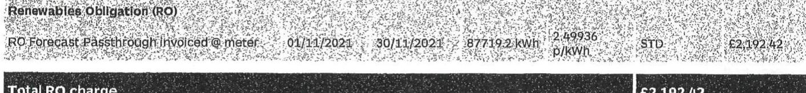
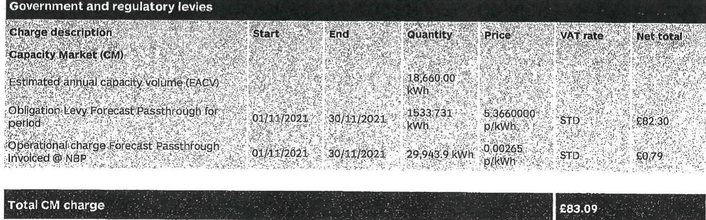

VECTOR AEROSPACE INTERNATIONAL LIMITED Inenco
Ribble House
Ballam Road
Lytham St Annes
FY8 4TS

The image is a photo/illustration of a barcode or QR code. There is no visible text or additional elements to describe beyond the code itself.

## Your electricity invoice

Invoice period: 1 Nov 2021 to 30 Nov 2023
Invoice date: 4 Dec 2021
Invoice number: IN02181638
Account number: 2N2R2229
Account name: Fitness Centre Building
Supply address:
Fitness Centre Building
1 Paneham Road
Gosport
Hampshire
PO13 OAH

| Charges summary | Quantity kWh | Charge |
| :--: | :--: | :--: |
| Electricity consumption | 642,492.6 | E36,253.21 |
| Network charges |  | E21,957.26 |
| Government and regulatory levies |  | E14,535.73 |
| Climate Change Levy (CCL) |  | E4,668.26 |
| Total charges excluding VAT |  | E77,614.46 |
| VAT |  | E15,482.89 |
| Charges for period |  | E22,897.35 |
| VAT analysis |  |  |
| Standard VAT | 20.00\% | VAT |
| Total VAT |  | E15,482.89 |

We're here to help
Call us: 01213897947
Opening hours are Monday to Thursday 8:30am to 5pm Friday 8:30am to 4:30pm
Email: inencobasket@npower.com Web: npowerbus/neesculutions.com
Write to us: npower Business Solutions, 2 Princes Way, 803520, 091308
Loss of supply: Call 105
Southern Electric Power Distribution Network Management Centre, Walton Road, Casham, Portsmouth, PO4 1LV.

Your previous account balance: E182,612.33

Your new tussice charge: E22,897.35
Which is due for payment on 25/12/21

If you pay by Oipot Debit the full amount of this invoice will be taken on or immediately after the above date

Failure to pay by the due date may result in late payment charges being incurred, your credit rating being adversely affected and may also place your supply at risk.

## quastung preave dand wwoces specific to meters

## Adolet

The VAT treatment of reconciled charges is the same as that which applied to the relevant consumption period.

# Your electricity invoice 

Invoice date: 4 Dec 2021
Invoice number: IN02181638
Account number: 2N2R2229
Meter point address:
Building 100
Fleetlands
Fareham Road
Gosport
Hampshire
PO13 OAA
Your supply number:
$\begin{array}{llllllll}\text { S } & 00 & 845 & \text { H89 } & & \\ & 20 & 0005 & 1623 & 588 & \text { S }\end{array}$

1 > Consumption details for MPAN 2000051623588
Consumption information

| Meter serial number | Start | End | Actual energy (m) | Estimated energy (m) | Total energy (m) | Energy (1) GSP | Energy (1) NBP (kWh) |
| :--: | :--: | :--: | :--: | :--: | :--: | :--: | :--: |
| NG12R00487 | 01/11/2021 | 30/11/2021 | 35,105.9 | 0.0 | 35,105.9 | 37,841.7 | 38,855.8 |

## Maximum demand information:

Maximum AW demand recorded on 15/11/2021 @ 14:00 183.4 kW
Maximum kVA demand recorded on 15/11/2021 @ 14:00 187.1 kVA
2 > Breakdown of charges fMPAN 2000051623588
Consumption charges

| Charge description | Rate description | Start | End | Energy consumed | Price | VAT rate | Net total |
| :--: | :--: | :--: | :--: | :--: | :--: | :--: | :--: |
| Electricity consumption @ GSP | Gay | 01/11/2021 | 30/11/2021 | 29,140.4 kWh | 5,97500   6/kWh | STD | £1,741.14 |
|  | Night | 01/11/2021 | 30/11/2021 | 8,701.3 kWh | 4,14000   6/kWh | STD | £360.23 |
| Flexible purchasing |  |  |  |  |  |  |  |
| Flexible purchasing |  | 01/11/2021 | 30/11/2021 |  |  | STD | 60.00 |

Total consumption charges
£2,161.37

Your electricity invoice continued...
Invoice date: 4 Dec 2021
Invoice number: IN02181638
Account number: 2N2R2229

# Network charges 

| Charge description | Start | End | Quantity | Price | VAT rate | Net total |
| :--: | :--: | :--: | :--: | :--: | :--: | :--: |
| Distribution Use of System (DUoS) |  |  |  |  |  |  |
| Capacity charge based on 400 KVA | 01/11/2021 | 30/11/2021 | 30 days | 2.69000   p/kVp | STD | E322.80 |
| Fixed charge | 01/11/2021 | 30/11/2021 | 30 days | 20.39000   p/day | STD | E6.12 |
| Reactive power charge | 01/11/2021 | 30/11/2021 | 5103.0 kWh | 0.21900   p/kWh | STD | E10.97 |
| Consumption - energy @ meter |  |  |  |  |  |  |
| *Amber charge | 01/11/2021 | 30/11/2021 | 20352.5 kWh | 3.96900   p/kWh | STD | E217.87 |
| *Green charge | 01/11/2021 | 30/11/2021 | 11338.0 kWh | 0.68200   p/kWh | STD | G94.65 |
| *Red charge | 01/11/2021 | 30/11/2021 | 3415 KkWh | 6.41700   p/kWh | STD | E232.83 |
| *Refer to the appropriate distribution company DUoS charging Statement for the unit rate time bands. |  |  |  |  |  |  |

## Total DUoS charge

E866.98

Transmission Network Use of System (TNUoS)
Estimated annual peak demand (EAPD)
Estimated annual capacity volume (EACV)
Estimated annual capacity volume (EACV)
Obligation-bley Forecast Passthrough for period
Operational charge Relevant Passthrough invoices @ NBP

| Start | End | Quantity | Price | VAT rate | Net total |
| :--: | :--: | :--: | :--: | :--: | :--: |
|  |  |  | 33,096.90   kWh |  |  |
| 01/11/2021 | 30/11/2021 | 3720.276   kWh | 5.3660000   p/kWh | STD | E145.97 |
| 01/11/2021 | 30/11/2021 | 38,885.8 kWh | 0.00260   p/kWh | STD | E1.03 |

Total GM charge
E147.00

Your electricity invoice continued...
Invoice date: 4 Dec 2021
Invoice number: ING2181638
Account number: 2N2R2229

# Renewables Obligation (RO) 

RO Forecast Postthrough Involved (○) meter

| $01 / 11 / 2021$ | $30 / 11 / 2021$ | $38105.9 \mathrm{KWh}$ | $\begin{aligned} & 2.49936 \\ & \text { p/KWh } \end{aligned}$ | STD | E877.42 |
| :--: | :--: | :--: | :--: | :--: | :--: |
| Total RO charge |  |  |  | E877.42 |  |

## Feed-in Tariff (FIT)

RO Forecast Postthrough Involved (○) meter

| $01 / 11 / 2021$ | $30 / 11 / 2021$ | $38105.9 \mathrm{KWh}$ | $\begin{aligned} & 0.84534 \\ & \text { p/KWh } \end{aligned}$ | STD | E226.85 |
| :--: | :--: | :--: | :--: | :--: | :--: |
| Total FIT charge |  |  |  | E226.85 |  |

## Contracts for Difference (CID)

Forecast Postthrough Involved (○) NBP
$01 / 11 / 2021$
$30 / 11 / 2021$
$38855.8 \mathrm{KWh}$
STD
$E 257.03$
Contracts for Difference - reconciliation
Forecast Postthrough charges previously
Involved (○) NBP
$01 / 09 / 2021$
$30 / 09 / 2021$
$31546.7 \mathrm{KWh}$
STD
$E 135.75$
Extrinate charges (○) NBP
$01 / 09 / 2021$
$30 / 09 / 2021$
$21546.7 \mathrm{KWh}$
STD
$E 14.95$
Total CID charge
-E377.83

Total government and regulatory levies

| Climate Change Levy |  |  |  |  |  |  |
| :--: | :--: | :--: | :--: | :--: | :--: | :--: |
| Charge description | CCL applied | Start | End | Quantity | Price | VAT rate | Not total |
| Electricity Climate Change   Levy | $100 \%$ | $03 / 11 / 2021$ | $30 / 11 / 2021$ | $38,305.9 \mathrm{KWh}$ | $\begin{aligned} & 0.00775 \mathrm{E} .7 \\ & \mathrm{kWh} \end{aligned}$ | STD | E272.07 |
| Total CCL charges |  |  |  |  |  | E272.07 |

Total charges for this meter point excluding VAT
E4,745.75

# Your electricity invoice 

Invoice date: 4 Dec 2021
Invoice number: IN02181638
Account number: 2N2R2229
Meter point address:
Machine Shop 2
Fareham Road
Gosport
Hampshire
PO13 6AA
Your supply number:

The image is a photo of a section of an electricity invoice showing a supply number. The supply number is formatted in a grid with the following details:

- Top row: "S", "00", "845", "H89"
- Bottom row: "20", "0005", "1623", "597"
- There is an "S" on the right side of the grid.

1 > Consumption details for MPAN 2000051623597
Consumption information

| Meter serial number | Start | End | Actual energy (c) meter (kWh) | Estimated energy (c) meter (kWh) | Total energy (c) meter (kWh) | Energy (c) GSP (kWh) | Energy (c) NBP (kWh) |
| :--: | :--: | :--: | :--: | :--: | :--: | :--: | :--: |
| N012600725 | 01/15/2021 | 30/11/2021 | $82,721.8$ | N/647.4 | $87,219.2$ | $44,665.5$ | $47,202.0$ |

## Maximum demand information:

Maximum kW demand recorded on 17/11/2021 @ 10:00 517.0 kW Maximum kVA demand recorded on 17/11/2021 @ 10:00 553.3 kVA
2 > Breakdown of charges fMPAN 2000051623597
Consumption charges

| Charge description | Rate description | Start | End | Energy consumed | Price | VAT rate | Net total |
| :--: | :--: | :--: | :--: | :--: | :--: | :--: | :--: |
| Electricity consumption @ GSP | Gas | 01/11/2021 | 30/11/2021 | 79,800.3 kWh | $5,97900$   B/kWh | STD | $54,757.27$ |
|  | Night | 01/11/2021 | 30/11/2021 | 18,866.8 kWh | $8,16000$   B/kWh | STD | $58,15.46$ |
| Flexible purchasing |  |  |  |  |  |  |  |
| - |  | 01/11/2021 | 30/11/2021 |  |  | STD | $10.00$ |

Total consumption charges
25.182.67

# Your electricity invoice continued... 

Invoice date: 4 Dec 2021
Invoice number: ING2181638
Account number: 2N2R2229

## Network charges

Charge description Start End Quantity Price VAT rate Net total
Distribution Use of System (DUoS)
Capacity charge based on 550 kVA $01 / 11 / 2021 \quad 30 / 11 / 2021 \quad 30$ days $2.69000$ $\mathrm{p} / \mathrm{kVA}$ STD. ENA3.05
Ercels capacity charge based on 3 kVA $01 / 11 / 2021 \quad 30 / 11 / 2021 \quad 30$ days $6.78000$ $\mathrm{p} / \mathrm{kVA}$ STD. E4.30
Fixed charge $01 / 11 / 2021 \quad 30 / 11 / 2021 \quad 30$ days $20.35000$ p/day STD. E6.12
Reactive power charge $01 / 11 / 2021 \quad 30 / 11 / 2021 \quad 5917.7 \mathrm{kV} / \mathrm{km} \quad 0.21500$ $\mathrm{p} / \mathrm{kV} / \mathrm{km}$ STD. E12.12
Consumption energy of meter
*Amber charge $01 / 11 / 2021 \quad 30 / 11 / 2021 \quad 62254.0 \mathrm{kWh} \quad 1.06900$ $\mathrm{p} / \mathrm{kWh}$ STD E565.50
*Green charge $01 / 11 / 2021 \quad 30 / 11 / 2021 \quad 39207.1 \mathrm{kWh} \quad 0.68300$ $\mathrm{p} / \mathrm{kWh}$ STD. E92.58
*Red charge $01 / 11 / 2021 \quad 30 / 11 / 2021 \quad 6258.1 \mathrm{kWh} \quad 6.81700$ $\mathrm{p} / \mathrm{kWh}$ STD. E526.61
*After to the appropriate distribution company, DuoS charging Statement for the unit rate time bands

Total DUoS charge
E1.651.68

Transmission Network Use of System (TNUoS)
Estimated annual peak demand (EAPD) $179,690 \mathrm{~kW}$
Estimate for period $01 / 11 / 2021 \quad 30 / 11 / 2021 \quad 25,400 \mathrm{kW} \quad 558,865200$ $\mathrm{k} / \mathrm{kg}$ STD. E1.495.18

Total TNUoS charge
E1.499.18

Total network charge
E3.246.86

Government and regulatory levies
Charge description Start End Quantity Price VAT rate Net total
Capacity Market (CM)
Estimated annual capacity volume (EACV) $52,910.00$ kWh
CORpation Levy Forecast Passthrough for period $61 / 11 / 2021 \quad 30 / 11 / 2021 \quad 4348,677$ $\mathrm{kWh} \quad 5.3660000$ $\mathrm{p} / \mathrm{kWh}$ STD. E233.35
Coeridence charge Forecast Passthrough Invoced \& NBP $01 / 11 / 2021 \quad 30 / 11 / 2021 \quad 97,202.0 \mathrm{kWh} \quad 0.00265$ $\mathrm{p} / \mathrm{kWh}$ STD. E2.58

Total CM charge
E2.15.93

# Your electricity involve continued... 

## Involce date: 4 Dec 2021

## Involce number: IN02181638

Account number: 2N2R2239
Renewative Obligation (RO)

The image is a section of a document, likely an invoice, with the following text:

- "Renewables Obligation (RO)"
- "RO Forecast Passthrough Invoiced @ meter"
- "01/11/2021"
- "30/11/2021"
- "87719.2 kWh"
- "2.49936 p/kWh"
- "STD"
- "£2,192.42"

## Food \&t Tariff (FIT)

FIT Forecast Pansthrough Involced 8 meter
$01 / 11 / 2021$
$30 / 11 / 2021$
$87719.2 \mathrm{KWh}$
$0.64: 0.84$
$0.64: 0.94$

## Total FIT charge

## 6566.09

## Contracts for Difference (CID)

Forecast Pansthrough Involced \&t NBP
$01 / 09 / 2021$
$30 / 09 / 2021$
$84362.9$
$\frac{84362.9}{K W h}$
$0.10: 0.51: 0.85$

## Contracts for Difference - Reconciliation

Forecast Pansthrough charges previously
Involced \&t NBP
$01 / 09 / 2021$
$30 / 09 / 2021$
$84362.9 \mathrm{~KWh}$
$0.10: 0.51: 0.85$

## Estimate charges \&t NBP

## Total government and regulatory levies

## £2,040.38

## Climate Change Levy

| Change description | CCL applied | Start | End | Quantity | Price | VAT rate | Net total |
| :--: | :--: | :--: | :--: | :--: | :--: | :--: | :--: |
| Electricity Climate Change   Levy | $100 \%$ | 01/11/2021 | 30/11/2021 | 87,719.2 KWh | 0.00775 EJ   KWh | STD | 6679.82 |

## Total CCL charges

## 6579.82

## Total charges for this meter point excluding VAT

## £11,249.73

# Your electricity invoice 

Invoice date: 4 Dec 2021
Invoice number: IN02181638
Account number: 2N2R2229
Meter point address:
Machine Shop 1
Fleetlands
Fareham Road
Goepart
Hampshire
PO13 OAA
Your supply number:
$\begin{array}{llllllll}\text { S } & 00 & 845 & H 87 \\ 20 & 0005 & 1623 & 802\end{array}$
S

1 > Consumption details for MPAN 2000051623602
Consumption information

| Meter serial   number | Start | End | Actual energy   (m) meter (kWh) | Estimated   energy (m)   meter (kWh) | Total energy   (m) meter (kWh) | Energy (1) GSP   (kWh) | Energy (1) NSP   (kWh) |
| :-- | :--: | :--: | :--: | :--: | :--: | :--: | :--: |
| N012K08464 | $01 / 11 / 2021$ | $30 / 11 / 2021$ | $31,268.3$ | $1,758.3$ | $23,026.6$ | $24,815.0$ | $25,480.0$ |

Maximum demand information:
Maximum NW demand recorded on 10/11/2021 @ 18:00 173.4 NW
Maximum NW demand recorded on 10/11/2021 @ 18:00 224.7 NVA
2 > Breakdown of charges fMPAN 2000051623602
Consumption charges

| Charge description | Rate   description | Start | End | Energy   consumed | Price | VAT rate | Net total |
| :-- | :-- | :-- | :-- | :-- | :-- | :-- | :-- |
| Electricity consumption @ GSP | Day | $01 / 11 / 2021$ | $30 / 11 / 2021$ | $18,867.8 \mathrm{~kWh}$ | $5,97500$   $\mathrm{~B} / \mathrm{KWh}$ | STD | $21,127.35$ |
|  | Night | $01 / 11 / 2021$ | $30 / 11 / 2021$ | $5,957.2 \mathrm{KWh}$ | $8,16000$   $\mathrm{~B} / \mathrm{KWh}$ | STD | $2246.21$ |
| Flexible purchasing   reconciliation |  | $01 / 11 / 2021$ | $30 / 11 / 2021$ |  |  | STD | $20.00$ |

Total consumption charges
c1.373.56

Your electricity involve continued...
Involce date: 4 Dec 2021
Involce number: IN02181638
Account number: 2N2R2229

# Network charges 

| Charge description | Start | End | Quantity | Price | VAT rate | Net total |
| :--: | :--: | :--: | :--: | :--: | :--: | :--: |
| Distribution Use of System (DUaS) |  |  |  |  |  |  |
| Capacity charge based on 138 kVA | 01/11/2021 | 30/11/2021 | 30 days | 2,69000   p/kWh | STD | £111.37 |
| Excess capacity charge based on 97 kVA | 01/11/2021 | 30/11/2021 | 30 days | 6,78000   p/kWh | STD | £139.10 |
| Fixed charge | 01/11/2021 | 30/11/2021 | 30 days | 30,39000   p/day | STD | £6.13 |
| Reactive power charge | 01/11/2021 | 30/11/2021 | 1783.6 kVAm | 8,21800   p/kVAm | STD | £3.77 |
| Consumption energy in meter |  |  |  |  |  |  |
| "Anber charge | 01/11/2021 | 30/11/2021 | 13396.1 kWh | 500,000   p/kWh | STD | £143.19 |
| "Green charge | 01/11/2021 | 30/11/2021 | 7818.9 kWh | 8,46390   p/kWh | STD | £37.69 |
| "Red charge | 01/11/2021 | 30/11/2021 | 1873.6 kWh | 8,81700   p/kWh | STD | £123.96 |
| Thēle to the appropriate distribution company DUaS charging statement for the USO rate time bands |  |  |  |  |  |  |

Total DUaS charge
£564.80

Transmission Network Use of System (TNUaS)
Estimated annual peak demand (EAPD)
Estimate for period
01/11/2021
30/11/2021
4.748 kW
$688,865280$ kWh
STD
£279.37

Total TNUaS charge
£279.37

Total network charge
£844.17

## Government and regulatory levies

| Charge description | Start | End | Quantity | Price | VAT rate | Net total |
| :--: | :--: | :--: | :--: | :--: | :--: | :--: |
| Capacity Market (CM) |  |  |  |  |  |  |
| Estimated annual capacity volume (CACV) |  |  | 13,608.00   kWh |  |  |  |
| Obligation Levy Forecast Passthrough for period | 01/11/2021 | 30/11/2021 | 1322.624   kWh | 5,3660000   p/kWh | STD | 660.24 |
| Operational charge Forecast Passthrough | 01/11/2021 | 30/11/2021 | 25,480.0 kWh | 8,00265   p/kWh | STD | 60.68 |

Total CM charge
£60472

Your electricity involve continued...
Involve date: 4 Dec 2021
Involve number: IN02181638
Account number: 2N2R2229
Renewables Obligation (RO)
RO Forecast Passthrough Involved $\otimes$ meter $01 / 11 / 2021 \quad 30 / 21 / 2021 \quad 23026.6 \mathrm{~kWh} \quad 2.49936$ p/kWh

Total RO charge

# Fx40-in Tariff (FIT) 

FIT Forecast Passthrough Involved $\otimes$ meter $01 / 11 / 2021 \quad 30 / 21 / 2021 \quad 23026.6 \mathrm{~kWh} \quad 0.64536$ p/kWh

Total FIT charge

## Contracts for Difference (CID)

Forecast Passthrough Involved $\otimes$ NBP $01 / 11 / 2021 \quad 30 / 11 / 2021 \quad 39480.0 \mathrm{~kWh} \quad$ STD $0.168 .55$
Contracts for Difference - reconciliation
Forecast Passthrough charges previously
Involved $\otimes$ NBP $01 / 09 / 2021 \quad 30 / 09 / 2021 \quad 14391.3$ kWh

Estimate charges $\otimes$ NBP $01 / 09 / 2021 \quad 30 / 09 / 2021 \quad 14391.3 \mathrm{~kWh} \quad$ STD $0.193$
Total CID charge

## Total government and regulatory levies

## Climate Change Levy

| Charge description | CCL applied | Start | End | Quantity | Price | VAT rate | Net total |
| :-- | :--: | :--: | :--: | :--: | :--: | :--: | :--: |
| Electricity Climate Change   Levy | $100 \%$ | $01 / 11 / 2021$ | $30 / 11 / 2021$ | $33,026.6 \mathrm{~kWh}$ | $0.00775 \mathrm{~K} /$   kWh | STD | $\mathbf{E 1 7 8 . 4 6}$ |

Total CCL charges

## Total charges for this meter point excluding VAT

E2.968.59

# Your electricity invoice 

Invoice date: 4 Dec 2021
Invoice number: IN02181638
Account number: 2N2R2229
Meter point address:
Ebu Building
Fleetlands
Fareham Road
Gosport
Hampshire
PO13 0AA
Your supply number:
$\begin{array}{l|lllllll}\text { S } & 00 & 845 & H 89 \\ \hline 20 & 0005 & 1623 & 611\end{array}$
S

1 > Consumption details for MPAN 2000051623611
Consumption information

| Meter serial   number | Start | End | Actual energy   ( ) meter (kWh) | Estimated   energy ( )   meter (kWh) | Total energy   ( ) meter (kWh) | Energy ( ) DSP   (kWh) | Energy ( ) NSP   (kWh) |
| :-- | :-- | :-- | :-- | :-- | :-- | :-- | :-- |
| N612600716 | $01 / 11 / 2021$ | $30 / 11 / 2021$ | $128,227.6$ | $6,012.5$ | $135,240.1$ | $146,879.2$ | $149,788.5$ |

Maximum demand information:
Maximum kW demand recorded on 20/11/2021 @ 12:30 4:15.0 NW
Maximum kVA demand recorded on 23/11/2021 @ 13:30 4:47.4 kVA
2 > Breakdown of charges fldPAN 2000051623611
Consumption charges

| Charge description | Rate   description | Start | End | Energy   consumed | Price | VAT rate | Net total |
| :--: | :--: | :--: | :--: | :--: | :--: | :--: | :--: |
| Electricity consumption @ GSP | Day | $01 / 11 / 2021$ | $30 / 11 / 2021$ | 117,021.8   kWh | 5,97500   $\mathrm{p} / \mathrm{kWh}$ | STD | $39,992.05$ |
|  | Night | $01 / 11 / 2021$ | $30 / 11 / 2021$ | 28,857.4 kWh | 8,16000   p/kWh | STD | $1,196.70$ |
| Flexible purchasing |  |  |  |  |  |  |  |
| Flexible purchasing   Accreditation |  | $01 / 11 / 2021$ | $30 / 11 / 2021$ |  |  | STD | 50.00 |

Total consumption charges
$25,186.75$

# Your electricity invoice continued... 

Invoice date: 4 Dec 2021
Invoice number: IN02181638
Account number: 2N2R2229

| Network charges |  |  |  |  |  |  |
| :--: | :--: | :--: | :--: | :--: | :--: | :--: |
| Charge description | Start | End | Quantity | Price | VAT rate | Net total |
| Distribution Use of System (DUs\$) |  |  |  |  |  |  |
| Capacity charge based on 500 kVA | 01/11/2021 | 30/11/2021 | 30 days | 2,69000 p/kVA | STD | ES03.50 |
| Fixed Charge | 01/11/2021 | 30/11/2021 | 30 days | 20,39000 p/kV | STD | ES.72 |
| Reactive power charge | 01/11/2021 | 30/11/2021 | 2323.3 kWh | 0,21500 p/kVWh | STD | ES. 00 |
| Consumption - energy @ meter |  |  |  |  |  |  |
| *Amber charge | 01/11/2021 | 30/11/2021 | 82368.8 kWh | 1,06700 p/kWh | STD | ES80.30 |
| *Green charge | 01/11/2021 | 30/11/2021 | 37760.8 kWh | 0,48200 p/kWh | STD | ES62.00 |
| *Red charge | 01/11/2021 | 30/11/2021 | 16132.1 kWh | 6,81700 p/kWh | STD | ES.035.56 |
| *Refer to the appropriate distribution company RUs\$ charging Statement for the unit rate time bands. |  |  |  |  |  |  |
| Total DUs\$ charge |  |  |  |  | ES.508.48 |  |

## Transmission Network Use of System (TNUs\$) |  |  |  |  |  |
| Estimated annual peak demand (EAPD) |  |  | 305,585 kW |  |  |  |
| Estimate for period | 01/11/2021 | 30/11/2021 | 43,242 kW | ES8,665,000 kW | STD | ES.548.45 |
| Total TNUs\$ charge |  |  |  |  | ES.545.45 |  |

## Total network charge

ES.052.92

## Government and regulatory lewics

| Charge description | Start | End | Quantity | Price | VAT rate | Net total |
| :--: | :--: | :--: | :--: | :--: | :--: | :--: |
| Capacity Market (CM) |  |  |  |  |  |  |
| Estimated annual capacity volume (EACV) |  |  | 323,740,00 kWh |  |  |  |
| Obligation Levy Forecast Pessthrough for period | 01/11/2021 | 30/11/2021 | $\begin{aligned} & 10170,332 \\ & \text { kWh } \end{aligned}$ | $\begin{aligned} & 5,3660000 \\ & \text { p/kWh } \end{aligned}$ | STD | ES68.7k |
| Operational charge Forecast Pessthrough invoiced @ NBP | 01/11/2021 | 30/11/2021 | $\begin{aligned} & 149,788.5 \\ & \text { kWh } \end{aligned}$ | 0,00265   p/kWh | STD | ES. 97 |

## Total CM charge

ES49.71

Your electricity involve continued...
Involce date: 4 Dec 2021
Involce number: IN02181638
Account number: 2N2R2229

| Renewables Obligation (RO) |  |  |  |  |  |  |
| :--: | :--: | :--: | :--: | :--: | :--: | :--: |
| RO Forecast Pansthrough Involved $\otimes$ meter | 01/11/2021 | 30/11/2021 | 138240.1 | 2 N9936 |  |  |
|  |  |  | KWh |  |  |  |
| Total RO charge |  |  |  |  |  | $£ 3,380.14$ |

| Feed-in Tariff (FIT) |  |  |  |  |  |  |
| :--: | :--: | :--: | :--: | :--: | :--: | :--: |
| FIT Forecast Pansthrough Involved $\otimes$ meter | 01/11/2021 | 30/11/2021 | 138240.1 | 0.6 A536 |  |  |
|  |  |  | KWh |  |  |  |
| Total FIT charge |  |  |  |  |  | $£ 872.76$ |

| Contracts for Difference (CfD) |  |  |  |  |  |  |
| :--: | :--: | :--: | :--: | :--: | :--: | :--: |
| Forecast Pansthrough Involved $\otimes$ NSP | 01/11/2023 | 30/11/2023 | 144788.5 |  |  |  |
|  |  |  | KWh |  |  |  |
| Contracts for Difference - reconciliation |  |  |  |  |  |  |
| Forecast Pansthrough charges previously |  |  |  |  |  |  |
| Involved $\otimes$ NSP | 01/09/2021 | 30/09/2021 | 160236.7 |  |  |  |
|  |  |  | KWh |  |  |  |
| Estimate charges $\otimes$ NSP | 01/09/2021 | 30/09/2021 | 150236.7 |  |  |  |
|  |  |  | KWh |  |  |  |
| Total CffD charge |  |  |  |  |  | $£ 3,577.65$ |

| Total government and regulatory levies |  |  |  |  |  | $£ 3,228.96$ |
| :--: | :--: | :--: | :--: | :--: | :--: | :--: |

| Climate Change Levy |  |  |  |  |  |  |
| :--: | :--: | :--: | :--: | :--: | :--: | :--: |
| Charge description | CCL applied | Start | End | Quantity | Price | VAt rate | Net total |
| Electricity Climate Change Levy | $100 \%$ | 01/11/2021 | 30/11/2021 | $£ 35,245.1$ | 0.00778.6 |  |  |
|  |  |  |  | KWh | KWh |  |  |
| Total CCL charges |  |  |  |  |  | $£ 3,848.11$ |  |

| Total charges for this meter point excluding VAT |  |  |  |  |  | $£ 17,913.75$ |
| :--: | :--: | :--: | :--: | :--: | :--: | :--: |

# Your electricity invoice 

Invoice date: 4 Dec 2021
Invoice number: IN02181638
Account number: 2N3R2229
Meter point address:
Building 120
Fleetlands
Fareham Road
Boeport
Hampshire
PO13 0AA
Your supply number:

| S | 00 | 845 | H89 |
| :-- | :-- | :-- | :-- |
|  | 20 | 0005 | 1623 |

S

1 > Consumption details for MPAN 2000051623620
Consumption information

| Meter serial number | Start | End | Actual energy (k) meter (kWh) | Estimated energy (k) meter (kWh) | Total energy (k) meter (kWh) | Energy (k) GSP (kWh) | Energy (k) NSP (kWh) |
| :--: | :--: | :--: | :--: | :--: | :--: | :--: | :--: |
| NO12K00715 | 01/11/2021 | 30/11/2021 | $138,632.9$ | 0.0 | 138,632.9 | $149,200.7$ | 153,199.1 |

Maximum demand information:
Maximum kW demand recorded on 20/11/2021 @ 9:30 063.3 kW
Maximum kVA demand recorded on 20/11/2021 @ 9:30 066.9 kVA
2 > Breakdown of charges fMPAN 2000051623620

## Consumption charges

| Charge description | Rate description | Start | End | Energy consumed | Price | VAT rate | Net total |
| :--: | :--: | :--: | :--: | :--: | :--: | :--: | :--: |
| Electricity consumption (2) GSP | Day | 01/11/2021 | 30/11/2021 | 116,557.4 kWh | 5,97400 p/kWh | STD | E6,843.66 |
|  | Night | 01/11/2021 | 30/11/2021 | 34,643.3 kWh | 4,34800   p/kWh | STD | E1,434.23 |
| Flexible purchasing |  |  |  |  |  |  |  |
| Flexible purchasing   reconciliation |  | 01/11/2021 | 30/11/2021 |  |  | STD | E0.00 |

Total consumption charges
$E 8,277.89$

Your electricity invoice continued...
Invoice date: 4 Dec 2021
Invoice number: IN02181638
Account number: 2N2R2229

# Network charges 

| Charge description | Start | End | Quantity | Price | VAT rate | Net total |
| :--: | :--: | :--: | :--: | :--: | :--: | :--: |
| Distribution Use of System (DUsS) |  |  |  |  |  |  |
| Capacity charge based on 700 kVA | 01/11/2021 | 30/11/2021 | 30 days | 2,69000 pAVV | STD | £564.90 |
| Fixed charge | 01/11/2021 | 30/11/2021 | 30 days | 20,39000 pV69 | STD | £6.32 |
| Reactive power charge | 01/11/2021 | 30/11/2021 | 3.6 kVAth | 0.21500   pAVWh | STD | £0.03 |
| Consumption - energy @ meter |  |  |  |  |  |  |
| *Amber charge | 01/11/2021 | 30/11/2021 | 79103.2 kWh | 3,06900   pVWh | STD | £845.60 |
| Crown charge | 01/11/2021 | 30/11/2021 | 45625.8 kWh | 0.48200   pVWh | STD | £219.92 |
| *Red charge | 01/11/2021 | 30/11/2021 | 13703.9 kWh | 4,81700   pVWh | STD | £934.19 |
| *Refer to the appropriate distribution company (DUs) charging Statement for the unit rate time basis. |  |  |  |  |  |  |

Total DUsS charge
£2,570.74

Transmission Network Use of System (TNUsS)
Estimated annual peak demand (EAPD)
Estimate for period
01/11/2021
30/11/2021
40 kWh kW
£59,565208 kW
STD
£2,380.86

Total TNUsS charge
£2,380.86

Total network charge
£4,051.60

Government and regulatory levies

| Charge description | Start | End | Quantity | Price | VAT rate | Net total |
| :--: | :--: | :--: | :--: | :--: | :--: | :--: |
| Capacity Market (CM) |  |  |  |  |  |  |
| Estimated annual capacity volume (EACV) |  |  | 104,362.80 kWh |  |  |  |
| Obligation Levy Forecast Palsthrough for period | 01/11/2021 | 30/11/2021 | 8577.712 kWh | 5,3660000 pVWh | STD | £660.28 |
| Operational charge Forecast Palsthrough Invoced @ NBP | 01/11/2021 | 30/11/2021 | 153,199.1 kWh | 8,00265   pVWh | STD | £4.06 |

Total CM charge
£464.34

# Your electricity involve continued... 

## Involce date: 4 Dec 2021

## Involce number: IN02181638

Account number: 2N2R2229

## Renewables Obligation (RO)

RO Forecast Passthrough Involced (○) meter

| $01 / 11 / 2021$ | $30 / 11 / 2021$ | $\begin{aligned} & 138432.9 \\ & \text { KWh } \end{aligned}$ | $\begin{aligned} & 2.49936 \\ & \text { B/KWh } \end{aligned}$ | STD | E3,409.94 |
| :--: | :--: | :--: | :--: | :--: | :--: |
| Total RO charge |  |  |  | £3,457.94 |  |

## Feed-In Tariff (FIT)

FIT Forecast Passthrough Involced (○) meter

| $01 / 11 / 2021$ | $30 / 11 / 2021$ | $\begin{aligned} & 138432.9 \\ & \text { KWh } \end{aligned}$ | 0.64534   B/KWh | STD | £893.37 |
| :--: | :--: | :--: | :--: | :--: | :--: |
| Total FIT charge |  |  |  | £893.37 |  |

## Contracts for Difference (CID)

Forecast Passthrough Involced (○) NBP

| $01 / 11 / 2021$ | $30 / 11 / 2021$ | $\begin{aligned} & 153199.1 \\ & \text { KWh } \end{aligned}$ | STD | -£1,013.39 |
| :--: | :--: | :--: | :--: | :--: |
| Contracts for Difference - reconciliation |  |  |  |  |
| Forecast Passthrough charges previously |  |  |  | STD | -£826.11 |
| Involced (○) NBP | $01 / 09 / 2021$ | $30 / 09 / 2021$ | $\begin{aligned} & 122260.7 \\ & \text { KWh } \end{aligned}$ | STD | £83.82 |
| Estimate charges (○) NBP | $01 / 09 / 2021$ | $30 / 09 / 2021$ | $\begin{aligned} & 122260.7 \\ & \text { KWh } \end{aligned}$ | STD | £83.82 |

## Total CID charge

## Total government and regulatory levies

## C3,341.97

## Climate Change Levy

| Charge description | CCL applied | Start | End | Quantity | Price | VAT rate | Net total |
| :--: | :--: | :--: | :--: | :--: | :--: | :--: | :--: |
| Electricity Climate Change Levy | 1005 | $01 / 11 / 2021$ | $30 / 11 / 2021$ | $\begin{aligned} & 138,432.9 \\ & \text { KWh } \end{aligned}$ | 0.00275 E. 1   KWh | STD | E1,072.85 |

## Total CCL charges

## C1,072.85

## Total charges for this meter point excluding VAT

E17,644.31

# Your electricity invoice 

Invoice date: 4 Dec 2021
Invoice number: IN02181638
Account number: 2N2K2229
Meter point address:
110 Fleetlands
Fareham Road
Gosport
Hampshire
PO13 OAA
Your supply number:

The image is a photo of a section of an electricity invoice showing a supply number. It contains a grid with the following text:

- S
- 00
- 845
- H89
- S
- 20
- 0005
- 1623
- 630

The grid is divided into two main sections, with the left section containing more detailed numbers and the right section containing a single "S".

1 > Consumption details for MPAN 2000051623630
Consumption information

| Meter serial number | Start | End | Actual energy (c) meter (kWh) | Estimated energy (c) meter (kWh) | Total energy (c) meter (kWh) | Energy (c) GSP (kWh) | Energy (c) NBP (kWh) |
| :--: | :--: | :--: | :--: | :--: | :--: | :--: | :--: |
| NO12/020408 | 01/11/2021 | 30/11/2021 | $155,773.1$ | 0.0 | $155,773.1$ | $157,529.9$ | $172,425.8$ |

## Maximum demand information:

Maximum kW demand recorded on 24/11/2021 @ 9:30 4:00.0 kW
Maximum kVA demand recorded on 24/11/2021 @ 9:30 4:02.1 kVA
2 > Breakdown of charges fMFAN 2000051623630
Consumption charges

| Charge description | Rate description | Start | End | Energy consumed | Price | VAY rate | Net total |
| :--: | :--: | :--: | :--: | :--: | :--: | :--: | :--: |
| Electricity consumption @ GSP | DAV | 01/11/2021 | 30/11/2021 | 128,973.7   kWh | 5.97500   p/kWh | 870 | 57,706.18 |
|  | Night | 01/11/2021 | 30/11/2021 | 38,985.9 kWh | 4.16000   p/kWh | 870 | 61,612.77 |
| Flexible purchasing |  |  |  |  |  |  |  |
| Flexible purchasing reconstitution |  | 01/11/2021 | 30/11/2021 |  |  | 870 | 10.00 |

Total consumption charges
$69,310.95$

# Your electricity invoice continued... 

Invoice date: 4 Dec 2021
Invoice number: IN02181638
Account number: 2N2R2229

## Network charges

| Charge description | Start | End | Quantity | Price | VAT rate | Net total |
| :--: | :--: | :--: | :--: | :--: | :--: | :--: |
| Distribution Use of System (DUos) |  |  |  |  |  |  |
| Capacity charge based on 600 KVA | 01/11/2021 | 30/11/2021 | 30 days | 2,69000   p/kVA | STD | £524.55 |
| Fixed charge | 01/11/2021 | 30/11/2021 | 30 days | 20.39000   p/day | STD | $£ 6.12$ |
| Reactive power charge | 01/11/2021 | 30/11/2021 | 38W 3 kVAft | 0.21500   p/kVAft | STD | £8.28 |
| Consumption - energy @ meter |  |  |  |  |  |  |
| *Amber charge | 01/11/2021 | 30/11/2021 | 93167.1 kWh | 1,06900   p/kWh | STD | £996.96 |
| *Green charge | 01/11/2021 | 30/11/2021 | 49491.6 kWh | 0.48200   p/kWh | STD | £238.55 |
| *Red charge | 01/11/2021 | 30/11/2021 | 13114.4 kWh | 6.81700   p/kWh | STD | £894.01 |
| Refer to the appropriate distribution company, Quos charging Statement for the unit rate time bands |  |  |  |  |  |  |
| Total DUos charge |  |  |  |  | £2,667.47 |  |

## Transmission Network Use of System (TNUos)

Estimated annual peak demand (EAPD) |  |  | $240,330 \mathrm{~kW}$ |  |  |  |  |
| Estimate for period | 01/11/2021 | 30/11/2021 | $48,146 \mathrm{~kW}$ |  | £58,868,200   kW | STD | £2,834.12 |
| Total TNUos charge |  |  |  |  |  | £2,834.12 |  |

Total network charge
£5,501.59

## Government and regulatory lewics

| Charge description | Start | End | Quantity | Price | VAT rate | Net total |
| :--: | :--: | :--: | :--: | :--: | :--: | :--: |
| Capacity Market (CM) |  |  |  |  |  |  |
| Estimated annual capacity volume (EACV) |  |  | 126,836.00   kWh |  |  |  |
| Obligation Levy Forecast Passthrough for period | 01/11/2021 | 30/11/2021 | 10424.898   kWh | 6.3660000   p/kWh | STD | £559.40 |
| Operational charge Forecast Passthrough (pvoiced @ NBP | 01/11/2021 | 30/11/2021 | 172,429.8   kWh | 0.00265   p/kWh | STD | $£ 4.57$ |

## Total CM charge

£563.97

Your electricity involve continued...
Involve date: 4 Dec 2021
Involve number: IN02181638
Account number: 2N2R2229

| Renewables Obligation (RO) |  |  |  |  |  |
| :--: | :--: | :--: | :--: | :--: | :--: |
| RO Forecast Paosthrougn involved $\$ 8$ meter | $01 / 11 / 2021$ | $30 / 11 / 2021$ | $\begin{aligned} & 158773.1 \\ & \text { kWh } \end{aligned}$ | $\begin{aligned} & 3,49936 \\ & 0 / \mathrm{kWh} \end{aligned}$ | STD | E3.893.33 |
| Total RO charge |  |  |  |  | E3.893.33 |
| Fesid in Tariff (FIT) |  |  |  |  |  |
| FIT Forecast Paosthrougn Involved \$ 8 meter | $01 / 11 / 2021$ | $30 / 11 / 2021$ | $\begin{aligned} & 158773.1 \\ & \text { kWh } \end{aligned}$ | $\begin{aligned} & 0.44834 \\ & 0 / \mathrm{kWh} \end{aligned}$ | STD | E1.005.27 |
| Total FIT charge |  |  |  |  | E1.005.27 |

# Contracts for Difference (CD) 

Forecast Paosthrougn Involved 8 NBP
Contracts for Difference -Fecenciliation
Forecast Paosthrougn charges previously
Involved 8 NBP
Estimate charges $\$ NBP$
Estimate charges $\$ NBP$
Total CID charge
Total government and regulatory levies

| Climate Change Levy |  |  |  |  |  |  |
| :--: | :--: | :--: | :--: | :--: | :--: | :--: |
| Charge description | CCL applied | Start | End | Quantity | Price | VAT rate | Net total |
| Electricity Climate Change Levy | $100 \%$ | $01 / 11 / 2021$ | $30 / 11 / 2021$ | $\begin{aligned} & 158,773.1 \\ & \text { kWh } \end{aligned}$ | $\begin{aligned} & 0.00778 \text { E } / \\ & \text { kWh } \end{aligned}$ | STD | E1.307.24 |
| Total CCL charges |  |  |  |  |  | E1.207.24 |
| Total charges for this meter point excluding VAT |  |  |  |  |  | E1.0.889.96 |

# Your electricity invoice 

Invoice date: 4 Dec 2021
Invoice number: IN02181638
Account number: 2N2R2229
Meter point address:
Masu Building
Fleetlands
Farnham Road
Gosport
Hampshire
P013 0AA
Your supply number:

| S | 00 | 845 | H88 |
| :-- | :-- | :-- | :-- |
|  | 20 | 0005 | 1623 |

S

## $1>$ Consumption details for MPAN 2000051623649

## Consumption information

| Meter aerial   number | Start | End | Actual energy   ( ) meter (kWh) | Estimated   energy ( )   meter (kWh) | Total energy   ( ) meter (kWh) | Energy ( ) GSP   (kWh) | Energy ( ) NBP   (kWh) |
| :-- | :-- | :-- | :-- | :-- | :-- | :-- | :-- |
| NG11600717 | $01 / 11 / 2021$ | $30 / 11 / 2021$ | $27,059.8$ | 0.0 | $27,059.8$ | $29,162.6$ | $29,943.9$ |

## Maximum demand information:

Maximum kW demand recorded on 20/11/2021 @ 9:00 98.0 kW
Maximum kVA demand recorded on 20/11/2021 @ 9:00 104.8 kVA
2 > Breakdown of charges fMPAN 2000051623649

## Consumption charges

| Charge description | Rate description | Start | End | Energy consumed | Price | VAT rate | Net total |
| :--: | :--: | :--: | :--: | :--: | :--: | :--: | :--: |
| Electricity consumption ( ) GSP | Day | 01/11/2021 | 30/11/2021 | $22,054.4 \mathrm{kWh}$ | 5.97500   p/kWh | STD. | £1,217.75 |
|  | Night | 01/11/2021 | 30/11/2021 | $7,107.9 \mathrm{kWh}$ | $4.1 \times 000$   p/kWh | STD | £294.27 |
| Flexible purchasing |  |  |  |  |  |  |  |
|  |  | 01/11/2021 | 30/11/2021 |  |  | STD. | £0.00 |

Total consumption charges
£1,612.02

# Your electricity invoice continued... 

Invoice date: 4 Dec 2021
Invoice number: IN02181638
Account number: 2N2R2229

## Network charges

Charge description
Distribution Use of System (DUOS)
Capacity charge based on 200 kVA
Fixed charge
Reactive power charge
Consumption - energy or meter
*Amber charge
*Green charge
*Red charge
*Water to the appropriate distribution company DUOS charging Statement for the unit rate time bands

Total DUOS charge
£637.11

Transmission Network Use of System (TNUoS)
Estimated annual peak demand (EAPD)
Estimate for period
Total TNUoS charge
£622.83

Total network charge
£939.9%

The image is a photo of a section of an electricity invoice detailing government and regulatory levies.

- **Section Title**: Government and regulatory levies
- **Charge description**: Capacity Market (CM)
  - **Estimated annual capacity volume (EACV)**
    - **Start**: 01/11/2021
    - **End**: 30/11/2021
    - **Quantity**: 18,660.00 kWh
    - **Price**: 5.3660000 p/kWh
    - **VAT rate**: STD
    - **Net total**: £82.30
  - **Obligation Levy Forecast Passthrough for period**
    - **Quantity**: 1533731 kWh
  - **Operational charge Forecast Passthrough invoiced @ NBP**
    - **Start**: 01/11/2021
    - **End**: 30/11/2021
    - **Quantity**: 29,943.9 kWh
    - **Price**: 0.00265 p/kWh
    - **VAT rate**: STD
    - **Net total**: £0.79

- **Total CM charge**: £83.09

The layout includes columns for charge description, start and end dates, quantity, price, VAT rate, and net total. The "Total CM charge" is prominently displayed at the bottom.

Your electricity involve continued...
Involce date: 4 Dec 2021
Involce number: IN02181638
Account number: 2N2R2229

# Renewables Obligation (RO) 

RO Forecast-Passthrough-involced (c) meter
$01 / 11 / 2021$
$30 / 11 / 2021$
27059.8 kWh
$2.49936$
p/kWh
STO
E676.32

## Total RO charge

E676.32

## Feed-in Tariff (FIT)

FIT Forecast-Passthrough-involced (c) meter
$01 / 11 / 2021$
$30 / 11 / 2021$
27059.8 kWh
$0.64534$
p/kWh
STO E174.63

## Total FIT charge

E174.63

## Contracts for Difference (CID)

Forecast-Passthrough-involced (c) NBP
$01 / 11 / 2021$
$30 / 11 / 2021$
29963.9 kWh
STO E198.07

## Contracts for Difference - reconciliation

Forecast-Passthrough-charges previously involved (c) NBP
$01 / 09 / 2021$
$30 / 09 / 2021$
-39308.1 kWh
STO
E126.11

Estimate charge (c) NBP
$01 / 09 / 2021$
$30 / 09 / 2021$
29308.1 kWh
STO E20.84

Total CID charge
E103.34

## Total government and regulatory levies

E630.70

## Climate change Levy

| Change description | CCL applied | Start | End | Quantity | Price | VAT rate | Net total |
| :-- | :-- | :-- | :-- | :-- | :-- | :-- | :-- |
| Electricity Climate Change   Levy | $100 \%$ | $07 / 11 / 2021$ | $30 / 11 / 2021$ | $27,059.8 \mathrm{kWh}$ | $0.00778 \mathrm{E} 7$   kWh | STO | E209.71 |

## Total CCL charges

E209.71

## Total charges for this meter point excluding VAT

E3,412.37

