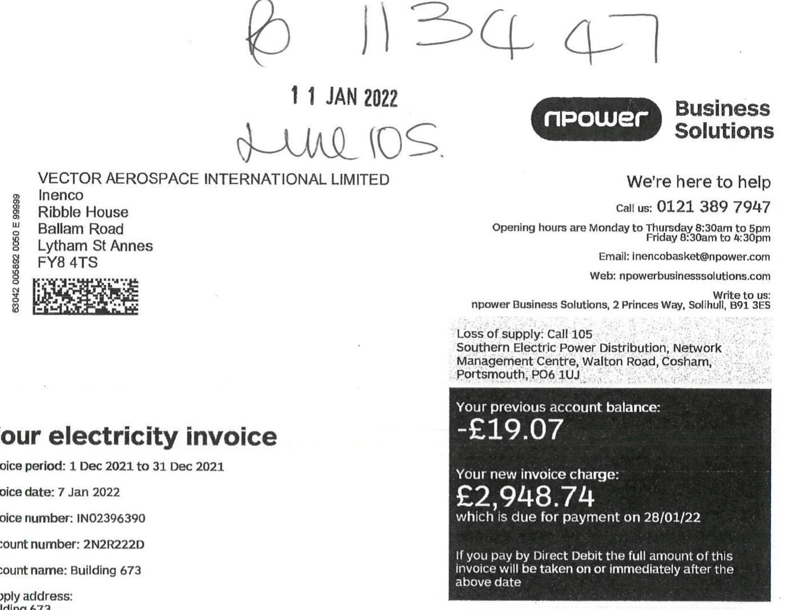

The image is a photo of an electricity invoice. 

Embedded text includes:

- Handwritten numbers and text: "B 113447" and "11 JAN 2022 June 10."
- Company details: 
  - "VECTOR AEROSPACE INTERNATIONAL LIMITED"
  - "Inenco"
  - "Ribble House"
  - "Ballam Road"
  - "Lytham St Annes"
  - "FY8 4TS"
- Barcode with numbers: "63042 005692 0005 E 899989"
- Invoice details:
  - "Your electricity invoice"
  - "Invoice period: 1 Dec 2021 to 31 Dec 2021"
  - "Invoice date: 7 Jan 2022"
  - "Invoice number: IN02396390"
  - "Account number: 2N2R222D"
  - "Account name: Building 673"
- Contact information:
  - "npower Business Solutions"
  - "Call us: 0121 389 7947"
  - "Opening hours are Monday to Thursday 8:30am to 5pm"
  - "Friday 8:30am to 4:30pm"
  - "Email: inencobasket@npower.com"
  - "Web: npowerbusinesssolutions.com"
  - "Write to us: npower Business Solutions, 2 Princes Way, Solihull, B91 3ES"
  - "Loss of supply: Call 105"
  - "Southern Electric Power Distribution, Network Management Centre, Walton Road, Cosham, Portsmouth, PO6 1UJ"
- Financial details:
  - "Your previous account balance: -£19.07"
  - "Your new invoice charge: £2,948.74"
  - "which is due for payment on 28/01/22"
  - "If you pay by Direct Debit the full amount of this invoice will be taken on or immediately after the above date"

Failure to pay by the due date may result in late payment charges being incurred, your credit rating being adversely affected and may also place your supply at risk.

| Charges summary | Quantity Kt/h | Charge |
| :--: | :--: | :--: |
| Electricity consumption | 19,875.2 | E1,112.17 |
| Network charges |  | £699.98 |
| Government and regulatory levies |  | £582.97 |
| Climate Change Levy (CCL) |  | £142.83 |
| Other account charges |  | -£80.67 |
| Total charges excluding VAT |  | £2,457.28 |
| VAT |  | £491.46 |
| Charges for period |  | £2,948.74 |
| VAT analysis |  |  |
| Standard VAT | 20.00\% | $\begin{aligned} & \text { Net } \\ & \text { E2,457.28 } \end{aligned}$ | $\begin{aligned} & \text { VAT } \\ & \text { E491.46 } \end{aligned}$ |
| Total VAT |  |  | E491.46 |

# Information and services for business customers 

Any questions?

- Contact Customer Services - see the front of this invoice for details
- Send us an email to yourbusiness@spower.com

Please quote your customer account number when you contact us. There is also lots of useful information on our website at spowerbusiness@sutions.com
For further information and codes of practice, go to our website at spowerbusiness@sitions.com or contact Customer Services for:

- Guidance on using energy efficiently
- Information on us visiting your premises
- Details of Guaranteed and Overall Standards of Service

Your local electricity distribution company also has a code of practice on visiting your premises - you can get a copy direct from them.

## Moving premises?

Please let us know as soon as possible if you are intending to move premises. Do not forget opener can supply you wherever you move in the country, so why not take us with you? Please refer to your contract for the terms and conditions which can apply when you stop trading at premises before the end of your contract.

## Estimated invoices

If you wish us to amend an estimated meter read on your invoice, you can call the number shown on the front of this invoice with a meter read. We will correct any difference between the actual amount of energy used and the estimated consumption in accordance with the terms of your contract.

## Paying your invoice

Unless otherwise agreed, payment for energy you have used is due on receipt of this invoice. Please let us know if you have a query or you are finding it hard to pay your energy invoice. Failure to pay without notifying us may result in interest being added to your account, statutory compensation being charged and other action to enforce the terms and conditions of your contract.

## Struggling to pay?

We want to help, so please contact us as soon as possible. The following organisation can provide free, impartial and confidential advice on debt and cash flow issues, to small businesses and the self-employed: Business Distillive: 99001974024 or businessdistillive.org

## Your contract

If you have signed or agreed a contract, details will have been provided at the time. Otherwise you will be failing supply under a deemed contract. Information about your contract and its terms and conditions is available from Customer Services.

## VAT

If you use energy for domestic or charity non-business purposes, you may qualify for the reduced rate of VAT. Please refer to the NMRC website for more information. If you think that you qualify, please complete a VAT Declaration form for us to consider.
All charges are identified by one of the following codes for VAT purposes:
DEM - Under de mönkös VIKN
STO - Standard rate
IRI - Reduced rate
MU - Mixed use
EXMT - Exempt
Zero - Zero rate
GIS - Outside the scope
Climate Change Levy (CCL)
CCL is a government tax on energy, which encourages businesses to use less energy and reduce carbon emissions. Please refer to the NMRC website for more information, including details on the circumstances when relief may be available. Where CCL has been shown, this invoice will constitute a CCL accounting document.

Third party and Industry charges
Putura Fieso in Tariff (PIT), Renonchiies Obligation (RO), Capacity Market (CM) and Contracts for Difference (CED) rates and reconciliation information will appear on the Third Party and Industry. Charges webpage at spowerbusiness@sitions.com/my-assocnet/invoicece and-payments. Please visit our website regularly to keep up-to-date with any charges or updates.

## Access to your meter

We are required by law to read and inspect your meter regularly, so please call Customer Services if you have any special access instructions that we need to know.

## Suspected meter interference

Mater interference is dangerous and increases costs for customers and industry alike. Should you suspect interference with any metering system, please either contact us urgently on the number overload, or Crimeshoppers on 09000332777 or visit stayenergysofws.co.uk

## Green Deal advice

You can obtain impartial advice and information about any Green Deal plan(s) by contacting the Energy Savings Advice Service guiding your Green Deal plan number(s). You can call them on 03001331220 or get in touch via their website gov.uk/greendeal.

## Energy efficiency

For advice on saving energy in your business, please visit spowerbusiness@sitions.com

## Consumption points

Mater - Meter Supply Point
DBP - Grid Supply Point
NBP - National Balancing Point

## Unhappy with our service?

We would like to put things right. Please call our Customer Services Team who will do all they can to resolve the matter straight away. You can also email us at yourbusiness@spower.com or write to spower business Relations, PO Box 8007, 3 Prisons Way, Bullbull, MN 3XS. Read more about how we handle complaints in the complaints section of opener business@sitions.com or request a free copy of our complaints leaflet from Customer Services.

## Impartial advice

The Citizens Advice consumer service provides free, confidential and impartial advice on consumer issues and debt at any stage of the complaints process. Visit citizensadvice.org.uk/energy or call the Citizens Advice consumer helpline on 090022515133. If you are located in Scotland you can visit. ImargyAdvice.Stott or call on 0300194840.

## Conbudomas Services: Energy

In the unlikely event that we are unable to resolve your complaint within eight weeks, micro businesses can approach Onbudomas Services to access a free and impartial service. The energy Onbudomas will reach a decision based on the information available and their decision is binding on the supplier. Contact the Onbudomas on 03304401624 s, visit. ombudomasservices.org/sectors/energy or email. emspirined/ no-energy.org.

## Where our electricity comes from

The table below shows the fuel sources for the electricity opener supplied last year, and the UK national average for the same period.

| Fuel mix for 1 April 2020 to 31 March 2021 | Npower   Limited | UK National   Average |
| :--: | :--: | :--: |
| Coal | 4.2\% | 3.7\% |
| Gas | 52.6\% | 38.2\% |
| Nuclear | 6.9\% | 16.1\% |
| Renewable   Odomas, wind, hydro   and solar power) | 31.9\% | 40.3\% |
| Other | 4.6\% | 3.7\% |

Please note, figures may not sum to $100 \%$ due to rounding. Further information on environmental impact and other environmental data is available on our website spowerbusiness@sitions.com/comperry/fuel-mix

## Online glossary

For help understanding the industry terminology used in this invoice, please visit spowerbusiness@sitions
.com/my-assocnet/glossary to access our online glossary.

## Phone calls

We may monitor and/or record calls for security, quality or training purposes. Call charges to numbers beginning with 0300 are set by your telecoms provider and may be free if you are calling them a business mobile or landline, depending on your contract.
Calls to our third numbers will cost a maximum of $50 per minute, plus your phone company's access charge. Calls to 63 numbers will cost you no more than 81 and 83 numbers from landlines or mobiles. If you get 'Inclusive minutes' with your package, calls to 83 numbers will be part of these.
Please check with your operator for exact charges.

How to pay your invoice

## Credit or debit card

Call Customer Services (most credit cards accepted).

## EACS or internet banking

Quote our bank sort code 50-00-00, our bank account number 97104000 and your customer account number. Your bank may charge for this service. If you pay by
BACS, please email your payment advice to
BACS@npower.com or send it to:
npower, BACS Payment Processing Team,
PO Box 209, Leeds L514 3WX.

## ECCS

## ETC

## Chedin

Sent your cheque to: Npower Commercial Gas Ltd, Payment Processing Centre, PO 309, Leeds, L514 3WX. Please make your cheque payable to 'Npower Commercial Gas Ltd' and write your customer account number on the back. Keep the top part of your invoice and send us the tear-off payment slip with your cheque.

# Your electricity invoice 

Invoice date: 7 Jan 2022
Invoice number: IN02396390
Account number: 2N2R222D
Your supply number:

| S | 00 | 845 | H89 |
| :-- | :-- | :-- | :-- |
|  | 20 | 0005 | 2849 |

S

1 > Consumption details for MPAN 2000052849863
Consumption information

| Meter serial number | Start | End | Actual energy @ meter (kWh) | Estimated energy @ meter (kWh) | Total energy   @ meter (kWh) | Energy @ GSP   (kWh) | Energy @ NBP   (kWh) |
| :--: | :--: | :--: | :--: | :--: | :--: | :--: | :--: |
| NG13K00195 | 01/12/2021 | 31/12/2021 | 18,429.9 | 0.0 | 18,429.9 | 19,875.2 | 20,581.8 |

## Maximum demand information:

Maximum kW demand recorded on 14/12/2021 @ 14:00 174.0 kW
Maximum kVA demand recorded on 14/12/2021 @ 14:00 204.1 kVA
2 > Breakdown of charges fMPAN 2000052849863
Consumption charges

| Charge description | Rate description | Start | End | Energy consumed | Price | VAT rate | Net total |
| :--: | :--: | :--: | :--: | :--: | :--: | :--: | :--: |
| Electricity consumption @ GSP | Day | 01/12/2021 | 31/12/2021 | 15,767.3 kWh | 5.97500   p/kWh | STD | £942.10 |
|  | Night | 01/12/2021 | 31/12/2021 | 4,107.9 kWh | 4.14000   p/kWh | STD | £170.07 |
| Flexible purchasing |  |  |  |  |  |  |  |
| Flexible purchasing   reconciliation |  | 01/12/2021 | 31/12/2021 |  |  | STD | £0.00 |
| Total consumption charges |  |  |  |  |  |  | £1,112.17 |

# Your electricity invoice continued... 

Invoice date: 7 Jan 2022
Invoice number: IN02396390
Account number: 2N2R222D

| Network charges |  |  |  |  |  |  |
| :--: | :--: | :--: | :--: | :--: | :--: | :--: |
| Charge description | Start | End | Quantity | Price | VAT rate | Net total |
| Distribution Use of System (DUoS) |  |  |  |  |  |  |
| Capacity charge based on 250 kVA | 01/12/2021 | 31/12/2021 | 31 days | 2.69000   p/kVa | STD | £208.68 |
| Fixed Charge | 01/12/2021 | 31/12/2021 | 31 days | 20.39000   p/day | STD | £6.32 |
| Reactive power charge | 01/12/2021 | 31/12/2021 | 844.8 kVArh | 0.21500   p/kVArh | STD | £1.82 |
| Consumption - energy @ meter |  |  |  |  |  |  |
| *Amber charge | 01/12/2021 | 31/12/2021 | 11183.7 kWh | 1.06900   p/kWh | STD | £119.55 |
| *Green charge | 01/12/2021 | 31/12/2021 | 5260.5 kWh | 0.48200   p/kWh | STD | £25.36 |
| *Red charge | 01/12/2021 | 31/12/2021 | 1985.7 kWh | 6.81700   p/kWh | STD | £135.37 |

*Refer to the appropriate distribution company DUoS charging Statement for the unit rate time bands

## Total DUoS charge

Transmission Network Use of System (TNUoS)
Estimated annual peak demand (EAPD)
Estimate for period
$01 / 12 / 2021$
$31 / 12 / 2021$
$3.450 \mathrm{~kW}$
£58.865200
/kW
STD £203.08

Total TNUoS charge
£203.08

Total network charge
£699.98

| Government and regulatory levies |  |  |  |  |  |  |
| :--: | :--: | :--: | :--: | :--: | :--: | :--: |
| Charge description | Start | End | Quantity | Price | VAT rate | Net total |
| Capacity Market (CM) |  |  |  |  |  |  |
| Estimated annual capacity volume (EACV) |  |  | 16,337.00 kWh |  |  |  |
| Obligation Levy Forecast Passthrough for period | 01/12/2021 | 31/12/2021 | 1387.439 kWh | 5.3660000   p/kWh | STD | £74.45 |
| Operational charge Forecast Passthrough | 01/12/2021 | 31/12/2021 | 20,581.8 kWh | 0.00265   p/kWh | STD | £0.55 |

## Total CM charge

E75.00

Your electricity invoice continued...
Invoice date: 7 Jan 2022
Invoice number: IN02396390
Account number: 2N2R222D

# Renewables Obligation (RO) 

RO Forecast Passthrough invoiced (○) meter 01/12/2021 31/12/2021 18429.9 kWh 2.49936 $\mathrm{p} / \mathrm{kWh}$ STD E460.63

## Total RO charge

E460.63

## Feed-in Tariff (FIT)

FIT Forecast Passthrough invoiced (○) meter 01/12/2021 31/12/2021 18429.9 kWh 0.64534 $\mathrm{p} / \mathrm{kWh}$ STD E118.94

## Total FIT charge

E118.94

## Contracts for Difference (CID)

Forecast Passthrough invoiced (○) NBP 01/12/2021 31/12/2021 20581.8 kWh STD E71.60

## Total CID charge

E71.60

## Total government and regulatory levies

E582.97

## Climate Change Levy

| Charge description | CCL applied | Start | End | Quantity | Price | VAT rate | Net total |
| :-- | :-- | :-- | :-- | :-- | :-- | :-- | :-- |
| Electricity Climate Change   Levy | $100 \%$ | $01 / 12 / 2021$ | $31 / 12 / 2021$ | $18,429.9 \mathrm{kWh}$ | $0.00775 \mathrm{E} /$   kWh | STD | $£ 142.83$ |
| Total CCL charges |  |  |  |  |  | $£ 142.83$ |  |

Total charges for this meter point excluding VAT
$£ 2,537.95$

# Your electricity invoice 

Invoice date: 7 Jan 2022
Invoice number: IND2396390
Account number: 2N2R222D
Supply address:
Building 673
Cody Technology Park
Ivelly Road
Farnborough
GU1A OLX

Other account charges

| Charge description | Start | End | Quantity | Price | VAT rate | Net total |
| :-- | :-- | :-- | :-- | :-- | :-- | :-- |
| 2N2R222D - CFD recon - Actual charge | $01 / 07 / 2021$ | $31 / 08 / 2021$ |  |  | STD | $£ 151.28$ |
| 2N2R222D - CFD recon - Forecast charge | $01 / 07 / 2021$ | $31 / 08 / 2021$ |  |  | STD | $£ 231.95$ |

Total other account charges for this premises excluding VAT

# Payment slip 

Please make your cheque payable to Npower Commercial Gas Limited, and send it to:

Npower Commercial Gas Limited
Payment Processing Centre
PO Box 209
Leeds
LS14 3WX

Account number: 2N2R222D
Involce number: IN02396390
Amount due: $£ 2,948.74$
VECTOR AEROSPACE INTERNATIONAL LIMITED
Inenco
Ribble House
Ballam Road
Lytham St Annes
FY8 4TS
Supply: Building 673, Cody Technology Park, Ively Road, Farnborough, GU14 OLX

