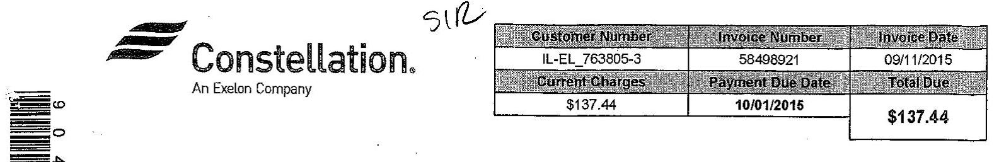

The image is a photo of a billing statement header from Constellation, an Exelon Company. It includes the following details:

- **Customer Number:** IL-EL_763805-3
- **Invoice Number:** 58498921
- **Invoice Date:** 09/11/2015
- **Current Charges:** $137.44
- **Payment Due Date:** 10/01/2015
- **Total Due:** $137.44

There is also a barcode on the left side of the image. The word "SIO" is handwritten above the table.

For billing inquiries, call 866-908-5409.
View and pay involves online 24 hours a day, 7 days a week at www.infefryenergy.com/energymanager.
Thank you for your prompt payment. A finance charge of $1.50 \%$ per month may be assessed on all past due invoices.

# STATEMENT ACTIVITY 

|  | Beginning Balance | $\$ 141.82$ |
| :-- | :-- | --: |
| 08/29/2015 | Payment Received - Thank you! | $(\$ 141.82)$ |
| 09/11/2015 | Billing - Invoice 58498921 | $\$ 137.44$ |
| 09/11/2015 | Total Balance Due By 10/01/2015 | $\$ 137.44$ |

## MESSAGES

Thank you for choosing Constellation Energy Services Inc. as your electric supplier.

| SUMMARY: BILLING - Invoice 58498921 |  |  |  |  |
| :--: | :--: | :--: | :--: | :--: |
| Service Location | LDC Accte | Service Pylud | Total Volume (kWh) | Total Amount |
| 6830 N Lincoln Ave Lincolnwood | 0776187010 | 08/11/2015 - 09/10/2015 | 858.00 | $\$ 137.44$ |
| Invoice Total |  |  | 858.00 | $\$ 137.44$ |

| Customer Number | Invoice Number | Invoice Date |
| :--: | :--: | :--: |
| IL-EL_763805-3 | 58498921 | 09/11/2015 |
| Account Number | Service Period |  |
| 3364626 | 08/11/2015 - 09/10/2015 |  |

| S.I.R. MANAGEMENT, INC.   ATTN: ACCOUNTS PAYABLE   6840 N LINCOLN AVE   LINCOLNWOOD, IL 60712 | In case of emergency, contact your local utility, ComEd 877-426-6331.   View and pay invoices online 24 hours a day, 7 days a week at   www.integrysenergy.com/energymanager.   Thank you for your prompt payment. A finance charge of $1.50 \%$ per   month may be assessed on all past due invoices. |
| :-- | :-- |

# INVOCLE DETAIL - 6830 N Lincoln Ave Lincolnwood 

## COMED WO776187010 - RDS (Retail Delivery Service) - 0-100 kW

## Current Constellation Energy Charges

| Metered Usage | 858.00 kWh |
| :-- | --: |
| Distribution Losses | 858.00 kWh @ 0.00302 |
| Energy-Fixed Price | 858.00 kWh @ 0.03794 |
| Ancillary Fixed | 858.00 kWh @ 0.00356 |
| RPS Compliance Charges | 858.00 kWh @ 0.00108 |
| Transmission Requirement | 858.00 kWh @ 0.00532 |
| Capacity Charges | 858.00 kWh @ 0.01215 |
| Sub Total | $\$ 54.10$ |
| Total Charges | $\$ 54.10$ |
| Total Current Constellation Energy Charges | $\$ 54.10$ |

## Current COMED Charges

| Single Bill Option Credit |  |  |  |  |  |  |  |  | ( $\$ 0.80$ ) |
| :--: | :--: | :--: | :--: | :--: | :--: | :--: | :--: | :--: | :--: |
| Customer Charge |  |  |  |  |  |  |  |  | $\$ 18.75$ |
| Distribution Facilities Charge | 6.15 K1 @ 6.40 |  |  |  |  |  |  |  | $\$ 39.36$ |
| IL Electricity Distribution Charge | 858.00 KH @ 0.00119 |  |  |  |  |  |  |  | $\$ 1.02$ |
| Environmental Cost Recovery Adj | 858.00 KH @ (0.00005) |  |  |  |  |  |  |  | ( $\$ 0.04$ ) |
| Franchise Cost | 65.80 DO @ 0.02299 |  |  |  |  |  |  |  | $\$ 1.51$ |
| Standard Metering Charge |  |  |  |  |  |  |  |  | $\$ 11.97$ |
| Municipal Tax |  |  |  |  |  |  |  |  | $\$ 4.82$ |
| State Tax |  |  |  |  |  |  |  |  | $\$ 2.83$ |
| Energy Efficiency Programs | 858.00 KH @ 0.00434 |  |  |  |  |  |  |  | $\$ 3.72$ |
| Total Current COMED Charges |  |  |  |  |  |  |  |  | $\$ 83.34$ |

## Current COMED Information

ComEd Total Amount Due on 9/25/2015
$\$ 83.34$

Net Amount
\$137.44

| METER DETAIL |  |  |  |  |  |  |  |  |  |
| :--: | :--: | :--: | :--: | :--: | :--: | :--: | :--: | :--: | :--: |
| Utility Acct Meter | Service Period | Days | Price Reading | Current Readings | Reading Type | ComSed | Usage | Usage Type | Usage Per Day |
| 141757569 | 08/11/2015 - 09/10/2015 | 30 | 6.15 | 6.15 | Actual | 1 | 6.15 | kW | N/A |
| 141757569 | 08/11/2015 - 09/10/2015 | 30 | 21.375 | 22,234 | Actual | 1 | 858.00 | kWh Total | 28.60 |

AVERAGE DAILY USE
CURRENT: 28.60
LAST YEAR: Not Available
AVERAGE TEMPERATURE
CURRENT: $71^{\circ} \mathrm{F}$
LAST YEAR: $72^{\circ} \mathrm{F}$

## 5

Constellation.
An Exelon Company

| Customer Number | Invoice Number | Invoice Date |
| :--: | :--: | :--: |
| IL-EL_763805-0 | 58498925 | 09/11/2015 |
| Current Charges | Payment Due Date | Total Due |
| \$387.73 | 10/01/2015 | \$387.73 |

For billing inquiries, call 886-906-5409.
View and pay invoices online 24 hours a day, 7 days a week at www.inlagnysenergy.com/enlorgymamager.
Thank you for your prompt payment. A finance charge of $1.50 \%$ per month may be assessed on all past due invoices.

# STATEMENT ACTIVITY 

|  | Beginning Balance | \$392.60 |
| :--: | :--: | :--: |
| 08/28/2015 | Payment Received - Thank you! | (\$392.60) |
| 09/11/2015 | Billing - Invoice 58498925 | \$387.73 |
| 09/11/2015 | Total Balance Due By 10/01/2015 | \$387.73 |

## MESSAGE

Thank you for choosing Constellation Energy Services Inc. as your electric supplier.

| SUMMARY | BILLING - Invoice 58498925 |  |  |  |
| :--: | :--: | :--: | :--: | :--: |
| Service Location |  |  |  |  |
| 6834 N Lincoln Ave Lincolnwood Sir Management | 0776188017 | 08/11/2015 - 09/10/2015 | 3,496.00 | $\$ 387.73$ |
| Invoice Total |  |  | 3,496.00 | $\$ 387.73$ |

| Customer Number | Involve Number | Involve Date |
| :--: | :--: | :--: |
| IL-EL_763805-0 | 58498925 | 09/11/2015 |
| Account Number | Service Period |  |
| 822640 | 09/11/2015 - 09/10/2015 |  |

In case of emergency, contact your local utility, ComEd 877-426-6331. View and pay invoices online 24 hours a day, 7 days a week at www.integrysenergy.com/enengymanager.
Thank you for your prompt payment. A finance charge of $1.50 \%$ per month may bo assessed on all past due invoices.

# INVOLVE DETAIL - 6834 N Lincoln Ave Lincolnwood Sir Management 

## COMED WO776198017 - RDS (Retail Delivery Service) - 0 - 100 kW

## Current Constellation Energy Charges

| Metered Usage | 3,496.00 kWh |  |
| :-- | :-- | --: |
| Distribution Losses | 3,496.00 kWh @ 0.00302 | $\$ 10.56$ |
| Energy-Fixed Price | 3,496.00 kWh @ 0.03794 | $\$ 132.64$ |
| Ancillary Fixed | 3,496.00 kWh @ 0.00358 | $\$ 12.45$ |
| RPS Compliance Charges | 3,496.00 kWh @ 0.00108 | $\$ 3.78$ |
| Transmission Requirement | 3,496.00 kWh @ 0.00532 | $\$ 18.60$ |
| Capacity Charges | 3,496.00 kWh @ 0.01215 | $\$ 42.48$ |
| Sub Total |  | $\$ 220.51$ |
| Total Charges |  | $\$ 220.51$ |
| Total Current Constellation Energy Charges |  | $\$ 220.51$ |

## Current COMED Charges

Single Bill Option Credit
Customer Charge
Distribution Facilities Charge
IL Electricity Distribution Charge
Environmental Cost Recovery Adj
Franchise Cost
Standard Metering Charge
Municipal Tax
State Tax
Energy Efficiency Programs
Total Current COMED Charges
( $\$ 0.60$ )
\$18.75
\$86.59
\$4.16
\$0.17)
\$2.67
\$11.97
\$11.37
\$15.17
\$167.22

## Current COMED Information

ComEd Total Amount Due on 9/25/2015
\$167.22

Net Amount
\$387.73

| METER DETAIL |  |  |  |  |  |  |  |  |
| :--: | :--: | :--: | :--: | :--: | :--: | :--: | :--: | :--: |
| Utility Acid Meter | Service Period | Days | Prior Reading | Current Reading | Reading Type | Constant | Usage | Usage Type | Usage Per Day |
| 141605797 | 09/11/2015 - 09/10/2015 | 30 | 12.02 | 13.53 | Actual | 1 | 13.53 | kW | N/A |
| 141605797 | 09/11/2015 - 09/10/2015 | 30 | 48.385 | 51.781 | Actual | 1 | 3,496.00 | kWh Total | 116.53 |

AVERAGE DAILY USE
CURRENT: 116.53
LAST YEAR: Not Available
AVERAGE TEMPERATURE
CURRENT: 71* F
LAST YEAR: $\quad 72 *$ F

## 

The image is a logo with the following elements:

- A stylized graphic element resembling three horizontal stripes.
- The text "Constellation."
- Below that, the text "An Exelon Company."

| Customer Number | Invoice Number | Invoice Date |
| :--: | :--: | :--: |
| IL-EL 763805-1 | 58498929 | 09/11/2015 |
| Current Charges | Payment Due Date | Total Due |
| $\$ 626.31$ | $10 / 01 / 2015$ | $\$ 626.31$ |

For billing inquiries, call 866-906-5409.
View and pay invoices online 24 hours a day, 7 days a week at www.intagryvamergy.com/energymanager.
Thank you for your prompt payment. A finance charge of $1.50 \%$ per month may be assessed on all past due invoices.

# STATEMENT ACTIVITY 

|  | Beginning Balance | $\$ 647.80$ |
| :--: | :--: | :--: |
| 08/28/2015 | Payment Received - Thank you! | $(\$ 647.80)$ |
| 09/11/2015 | Billing - Invoice 58498929 | $\$ 626.31$ |
| 09/11/2015 | Total Balance Due By 10/01/2015 | $\$ 626.31$ |

## MESRAGES

Thank you for choosing Constellation Energy Services Inc. as your electric supplier.

| SUMMARY BILLING - Invoice 58498929 |  |  |  |  |
| :--: | :--: | :--: | :--: | :--: |
| Service Location | LDC Accid | Service Period | Total Volume | kWh |
| 6840 H Lincoln Ave Lincolnwood Stt Management Inc | 0776193018 | 08/11/2015 - 09/10/2015 | 5,899.00 | $\$ 626.31$ |
| Invoice Total |  |  | 5,899.00 | $\$ 626.31$ |

## 5

Constellation.

An Exelon Company

S.L.R. MANAGEMENT, INC. ATTN: ACCOUNTS PAYABLE 6840 N LINCOLN AVE LINCOLNWOOD, IL 60712

| Customer Number | Invoicr Number | Invoicr Date |
| :--: | :--: | :--: |
| IL-EL_763805-1 | 58498929 | 09/11/2015 |
| Account Number | Service Period |  |
| 822641 | 08/11/2015 - 09/10/2015 |  |

In case of emergency, contact your local utility, ComEd 877-426-6331.
View and pay invoices onlite 24 hours a day, 7 days a week at www.infegryvenergy.com/energymanager.
Thank you for your prompt payment. A finance charge of $1.50 \%$ per month may be assessed on all post due invoices.

# INVOICE DETAIL - 6840 N Lincoln Ave Lincolnwood Sir Management Inc 

## COMED \#0778193018 RDS (Retail Delivery Service) 0.100 kW

## Current Constellation Energy Charges

| Matered Usage | 5,899.00 kWh |  |
| :-- | :-- | --: |
| Distribution Losses | 5,899.00 kWh @ 0.00302 | $\$ 17.82$ |
| Energy-Fixed Price | 5,899.00 kWh @ 0.03794 | $\$ 223.81$ |
| Ancillary Fixed | 5,899.00 kWh @ 0.00356 | $\$ 21.00$ |
| RPS Compliance Charges | 5,899.00 kWh @ 0.00108 | $\$ 6.37$ |
| Transmission Requirement | 5,899.00 kWh @ 0.00532 | $\$ 31.38$ |
| Capacity Charges | 5,899.00 kWh @ 0.01215 | $\$ 71.67$ |
| Sub Total |  | $\$ 372.05$ |
| Total Charges |  | $\$ 372.05$ |
| Total Current Constellation Energy Charges |  | $\$ 372.05$ |

## Current COMED Charges

Single Bill Option Credit
Customer Charge
Distribution Facilities Charge
IL Electricity Distribution Charge
Environmental Cost Recovery Adj
Franchise Cost
Standard Metering Charge
Municipal Tax
State Tax
Energy Efficiency Programs
Total Current COMED Charges
22.14 KI @ 6.40
5,899.00 KH @ 0.00119
5,899.00 KH @ (0.00005)
174.14 DO @ 0.02299
$\$ 4.00$
$\$ 11.97$
$\$ 27.07$
$\$ 19.04$
$\$ 25.60$
$\$ 254.26$

## Current COMED Information

ComEd Total Amount Due on 9/25/2015
$\$ 254.26$

Net Amount
\$626.31

| METER DETAIL |  |  |  |  |  |  |  |  |
| :--: | :--: | :--: | :--: | :--: | :--: | :--: | :--: | :--: |
| Utility Acct Meter | Service Period | Days | Price Reading | Current Reading | Reading Type | Constant | Usage | Usage Type | Uvape Per Day |
| 141605864 | 08/11/2015 - 09/10/2015 | 30 | 22.02 | 22.14 | Actual | 1 | 22.14 | kW | N/A |
| 141605864 | 08/11/2015 - 09/10/2015 | 30 | 12,905 | 18,804 | Actual | 1 | 5,899.00 | kWh Total | 196.63 |

AVERAGE DAILY USE
AVERAGE TEMPERATURE

CURRENT: 196.63
CURRENT: $71^{\circ} \mathrm{F}$

LAST YEAR: Not Available
LAST YEAR: $72^{\circ} \mathrm{F}$

# Constellation. 

An Exelon Company

| Customer Number | Involve Number | Involve Date |
| :--: | :--: | :--: |
| IL-EL_763805-2 | 58498933 | 09/11/2015 |
| Current Charges | Payment Due Date | Total Due |
| $\$ 918.15$ | $10 / 91 / 2015$ | $\$ 818.15$ |

For billing inquiries, call 886-906-8409.
View and pay involves online 24 hours a day, 7 days a week at www.integrysenergy.com/energymanager.
Thank you for your prompt payment. A finance charge of $1.50 \%$ per month may be assessed on all past due involves.

| STATEMENT | ACTIVITY |  |
| :--: | :--: | :--: |
|  | Beginning Balance | $\$ 913.73$ |
| 08/28/2015 | Payment Received - Thank you! | $(\$ 813.73)$ |
| 09/11/2015 | Billing - Involve 58498933 | $\$ 818.15$ |
| 09/11/2015 | Total Balance Due By 10/01/2015 | $\$ 818.15$ |

## MESSAGES

Thank you for choosing Constellation Energy Services Inc. as your electric supplier.

| SUMMARY: | BILLING - | Involve 58498933 |  |  |  |
| :--: | :--: | :--: | :--: | :--: | :--: |
| Service Location |  | LOC Accra | Service Period | Total Volume (kWh) | Total Amount |
| 4100 W Pratt Ave Lincolnwood |  | 0776211002 | 09/11/2015 - 09/10/2015 | 8,160.00 | $\$ 818.15$ |
| Involve Total |  |  |  | 8,160.00 | $\$ 818.15$ |

## 20

## Constellation.

An Exelon Company

S.I.R. MANAGEMENT, INC.
ATTN: ACCOUNTS PAYABLE
6840 N LINCOLN AVE
LINCOLNWOOD, IL 60712

| Customer Number | Invoice Number |  |  |  |  |  |  |  |  |
| :--: | :--: | :--: | :--: | :--: | :--: | :--: | :--: | :--: | :--: |
| IL-EL_763805-2 | 58498933 |  |  |  |  |  |  |  |  |
| Account Number | Service |  |  |  |  |  |  |  |  |
| 3354625 |  |  |  |  |  |  |  |  |  |

In case of emergency, contact your local utility, ComEd 877-426-8331.
View and pay invoices online 24 hours a day, 7 days a week at www.intergrysenergy.com/emergymanager.
Thank you for your prompt payment. A finance charge of 1.50\% per month may be assessed on all past due invoices.

# INVOICE DETAIL - 4100 W Pratt Ave Lincolnwood 

COMED: 80778311002 - RDS: (Retail Delivery Service) - 0 - 100 kW

## Current Constellation Energy Charges

| Me |  |
| :-- | --: |
| Distibution Losses | $8,160.00 \mathrm{kWh}$ |
| Energy-Fixed Price | $8,160.00 \mathrm{kWh}$ (1) 0.00302 |
| Ancillary Fixed | $8,160.00 \mathrm{kWh}$ (1) 0.00356 |
| RPS Compliance Charges | $8,160.00 \mathrm{kWh}$ (1) 0.00108 |
| Transmission Requirement | $8,160.00 \mathrm{kWh}$ (1) 0.00532 |
| Capacity Charges | $8,160.00 \mathrm{kWh}$ (1) 0.01215 |
| Sub Total |  |
| Total Charges |  |
| Total Current Constellation Energy Charges |  |
|  |  |

## Current COMED Charges

Single Bill Option Credit
Customer Charge
IL Electricity Distribution Charge
Distribution Facilities Charge
Environmental Cost Recovery Adj
Franchise Cost
Standard Metering Charge
Municipal Tax
State Tax
Energy Efficiency Programs
Total Current COMED Charges
$8,160.00 \mathrm{KH}$ @ 0.00119
$25.26 \mathrm{KH} @ 8.40$
$8,160.00 \mathrm{KH} @(0.00005)$
$196.79 \mathrm{DO} @ 0.02299$
$8,160.00 \mathrm{KH} @ 0.00434$
$8,160.00 \mathrm{KH} @ 0.00434$

## 8,160.00 KH @ 0.00119

$25.26 \mathrm{KH} @ 8.40$
$8,160.00 \mathrm{KH} @(0.00005)$
$196.79 \mathrm{DO} @ 0.02299$
$8,160.00 \mathrm{KH} @ 0.00434$

## 818.75

$59.71$
$161.86$
$80.41$
$4.52$
$11.97$
$38.25$
$35.41$
$303.51$

## Current COMED Information

ComEd Total Amount Due on 9/25/2015
$303.51$

Net Amount
$818.15$

| METER DETAIL |  |  |  |  |  |  |  |  |  |
| :--: | :--: | :--: | :--: | :--: | :--: | :--: | :--: | :--: | :--: |
| Utility-Aust Meter | Service Period | Days | Prior Reading | Current Reading | Reading Type | Constant | Usage | Usage Type | Usage Per Day |
| 141823678 | 08/11/2015 - 09/10/2015 | 30 | 26.07 | 26.26 | Actual | 1 | 25.26 | kW | N/A |
| 141823678 | 08/11/2015 - 09/10/2015 | 30 | 32.027 | 40.187 | Actual | 1 | 8,160.00 | kWh Total | 272.00 |

AVERAGE DAILY USE
CURRENT: 272.00
LAST YEAR: Not Available
AVERAGE TEMPERATURE
CURRENT: 71*F
LAST YEAR: 72*F

