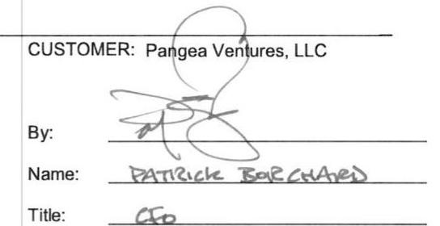

THIS MASTER COMMERCIAL GAS SALES AGREEMENT (this "Master Agreement") is entered into as of the Effective Date described below by and between Mansfield Power and Gas, LLC ("Supplier"), and the customer for retail natural gas supply and transportation services identified on the signature page hereto ("Customer"). Each of Supplier and Customer may be referred to herein individually as a "Party" and collectively as the "Parties."

1. Transactions. This Master Agreement sets forth the general terms and conditions governing transactions for the purchase, sale and transportation of natural gas and related products and services (each a "Transaction") to one or more of Customer's service locations (each, a "Point of Service Location") as agreed to from time to time and specified in Exhibit B to a Transaction Confirmation. Each Transaction shall be evidenced by a written transaction confirmation (each a "Confirmation") in the form set forth in Exhibit A. If Customer fails to object in writing to any term in the Confirmation within five (5) Business Days of receipt of the Confirmation, the Confirmation shall constitute the definitive written expression of the Transaction. Each Confirmation shall constitute part of and shall be subject to this Master Agreement. Nothing in this Agreement obligates either Party to enter into a Transaction at any time. This Agreement, all Exhibits thereto, and each Confirmation shall constitute a single integrated agreement between the Parties (collectively referred to as the "Agreement").
2. Services. Commencing on the Delivery Start Date set forth in a Confirmation and continuing throughout the Term, Customer appoints Supplier as its exclusive agent for the supply and/or transportation of natural gas to Customer's Point of Service Locations. Subject to the terms and conditions of this Agreement, Supplier shall acquire and transport to Customer, and Customer shall purchase and receive, the Contract Quantity of natural gas of the relevant local gas distribution company ("LDC") specified in a Confirmation in accordance with the terms and conditions of this Agreement. If the LDC requires Customer to install additional metering and/or related equipment at any Point of Service Location, Customer shall be solely responsible for the costs and installation thereof. Title to all natural gas hereunder shall pass from Supplier to Customer at the Delivery Point and Customer shall have the sole responsibility for transporting gas from the Delivery Point.
2.1 Customer Qualification. Customer acknowledges and agrees that Supplier's duty to provide natural gas under any Confirmation that would require the use of an LDC's facilities is contingent upon the applicable Customer Point of Service Location qualifying for the LDC's appropriate rate or tariff schedule that would permit the use of the LDC's facilities for delivering the natural gas to that Customer Point of Service Location.
2.2 Nominations. The Parties shall coordinate nomination activities such that the deadlines of the transporter of gas by a gas gathering or pipeline company or LDC (each a "Transporter") may be met. If Customer or the LDC fails to provide Supplier with a usage nomination for any month in a timely manner, Supplier (i) may establish a nomination for such month in a commercially reasonable manner based on Customer's historical
usage data available to Supplier, and (ii) shall have the right to use and rely on such nomination unless notified otherwise by Customer or the LDC. If Supplier or Customer becomes aware that actual deliveries are greater or lesser than the quantity of gas confirmed by a Transporter, such Party shall promptly notify the other Party.
2.3 Imbalances. The Parties shall use commercially reasonable efforts to avoid imposition of any fees, penalties, cash-outs, costs or charges (in cash or in kind) assessed by a Transporter for failure to satisfy balancing and/or nomination requirements ("Imbalance Charges"). If Supplier or Customer receives an invoice from a Transporter that includes Imbalance Charges, the Parties shall determine the validity and cause of such Imbalance Charges. The Party causing the imposition of the Imbalance Charges will be responsible to pay such Imbalance Charges.
2.4 Transporter Restrictions. If either Party receives an operational flow order or any other usage or operating instructions, restrictions or similar notice (each an "OFO") from a Transporter requiring action to be taken in connection with the transportation or consumption of gas pursuant to a Transaction, such Party will use commercially reasonable efforts to notify the other Party of such event in a timely manner. Such notice may be given by electronic means. E ach Party will take all commercially reasonable actions required by the OFO within the time prescribed. If OFO penalties, charges, fees, costs or expenses result from the actions or inactions of one Party, then such Party shall be solely responsible for any such penalties, charges, fees, costs or expenses. Both parties agree that OFOs may require one or both parties to buy or sell quantities of natural gas in the then-current market conditions, which may be appreciably higher or lower than the Contract Price specified in a Transaction. If Supplier is responsible for nominations and balancing on a Transporter imposing an OFO or similar restriction, Supplier may (but is not required to) increase or decrease nominations, as appropriate, to avoid penalties.
3. Defined Terms. Capitalized terms not otherwise defined herein shall have the meaning set forth in Section 30.
4. Pricing. The price for the natural gas delivered hereunder (the "Contract Price") is set forth in a Confirmation, based upon Customer's Forecast Usage data, and applies to all natural gas covered under such Confirmation and includes charges for the supply, nomination and balancing associated with the transportation of natural gas, as specified in such Confirmation and in Section 11 herein.
5. Billing and Payment.
5.1 General Billing and Payment Terms: Supplier shall provide monthly invoices, either through utility

consolidated billing ("UCB"), supplier consolidated billing ("SCB") or a Dual Billing Option ("DBO"), at its sole discretion to the extent permitted by law. Supplier may estimate bills in cases where actual billing determinants are unavailable. The billed quantity will then be adjusted to the actual quantity on the following Month's billing or as soon thereafter as actual delivery information is available. Customer shall pay all amounts owing by the Due Date specified in a Confirmation. Supplier shall credit account for all overpayments. Late payments shall incur interest charges at a rate of interest equal to the lower of a per annum rate of one and one-half percent per month ( $1.5 \%$ ) or the maximum applicable lawful interest rate. In any instance where any payment to Supplier is declined by the issuing institution, Customer shall be assessed a non-sufficient funds charge of $\$ 35$ or the maximum allowed under applicable law (whichever is less) per declined payment. Customer shall be liable for all costs incurred by Supplier, including reasonable attorneys' fees, for collections on accounts greater than thirty (30) calendar days past due.
5.2 Disputes and Adjustments of Invoices: Customer may dispute, in good faith and in writing, the correctness of any invoice. In the event that an invoice or portion thereof is disputed, payment of the undisputed portion of the invoice shall be made by the Due Date specified on a Confirmation, with notice of the dispute given to Supplier in writing and stating the amount and basis for the dispute. Supplier and Customer agree to use good faith and reasonable efforts to resolve any such billing/invoice dispute within thirty calendar (30) days of Supplier's receipt of Customer's written notice of any such dispute. Upon resolution of the dispute, any required payment shall be made within ten (10) Business Customer must provide Supplier with written notice of any disputed charge(s) on or prior to the Due Date of the invoice or it will be deemed to have waived its rights to dispute such a charge. In addition, Supplier shall not retroactively charge any additional amounts to any timely paid Customer invoice, provided the aforementioned shall not limit Supplier's ability to adjust Customer's invoice as provided in Section 5.1 herein.
5.3 Payments: The default method of payment shall be through the Automated Clearing House ("ACH") Recurring Payment Authorization attached herein or provided separately at Customer's request. Customer agrees to provide ACH processing details required to process such payments. No processing fee shall be assessed by Supplier when using ACH recurring payments.
6. Term. The term of this Master Agreement will commence on the Effective Date and, unless terminated earlier as provided in this Master Agreement, will continue until terminated by either Party upon thirty (30) days prior written notice to the other Party; provided this Master Agreement shall remain in full force and effect during the term of any Confirmation. Each Confirmation shall set forth the applicable "Delivery Period" or term during which deliveries of natural gas are to be made. Supplier shall not be liable for any failure to enroll or drop a Point of Service Location by any applicable start and end date(s) set forth in the Confirmation
due to circumstances beyond its control. Further, all obligations regarding indemnity, payment of Taxes, limitations of liability, remedies afforded to the Parties after default and early termination, confidentiality obligations, and waivers survive for the period of the applicable statute of limitations.
7. Renewal of Agreement. Unless otherwise set forth on Exhibit C, not less than thirty (30) days prior to the anticipated expiration date of the then current relevant Delivery Period, Supplier may provide a Confirmation renewal notice electronically or otherwise in writing containing proposed pricing, terms and conditions for a new Confirmation (the "Renewal Notice"). If, following termination or expiration of any Confirmation, any of Customer's Point of Service Locations remain designated by any LDC as being served by Supplier, then Supplier may either (a) continue to serve such Point of Service Location on a month-to-month holdover basis (each, a "Holdover Term"). Any such Holdover Term may be terminated by either party upon no less than thirty days written notice, unless otherwise expressly provided herein. The price payable during any Holdover Term shall be based on a variable rate, and may change monthly due to current and predicted weather patterns, retail competition, wholesale natural gas costs, fluctuations in natural gas supply and demand, industry regulations, pricing strategies, costs to serve customers, and many other factors. Variable rate agreements will automatically renew on a month-to month basis and can be cancelled at any time by either party without any early termination fee. This Agreement shall continue to govern the provision of service during any Holdover Term.
8. Performance Assurance. If either party (" $X$ ") has reasonable grounds for insecurity regarding the performance of any obligation under this Contract (whether or not then due) by the other party ("Y") (including, without limitation, the occurrence of a material change in the creditworthiness of $Y$ or its Guarantor, if applicable), X may demand Performance Assurance. Performance Assurance shall mean sufficient security in the form, amount, for a term, and from an issuer, all as reasonably acceptable to $X$, including, but not limited to cash, a standby irrevocable letter of credit, a prepayment, a security interest in an asset or guaranty. $Y$ hereby grants to $X$ a continuing first priority security interest in, lien on, and right of setoff against all Performance Assurance in the form of cash transferred by $Y$ to $X$ pursuant to this Section 8. Upon the return by $X$ to $Y$ of such Performance Assurance, the security interest and lien granted hereunder on that Performance Assurance shall be released automatically and, to the extent possible, without any further action by either party.
9. Consent to Disclosure. Customer designates Supplier as an authorized recipient of Customer's account, billing and usage information. Customer consents to the disclosure by each LDC to Supplier of certain basic information about Customer including: account number, meter number, meter read data, rate class, natural gas usage, billing and payment information, account name, service address, billing address, and telephone number.
10. Transportation. Customer agrees and acknowledges that Supplier does not own or control any of the transmission or distribution facilities used to transport natural gas to the Point of Service Location(s). The LDC has the

responsibility to deliver the natural gas to the Point of Service Location(s). Supplier has no obligation, liability, or responsibility for the operations of the LDC, for the interruption of service, or for the LDC's failure to deliver natural gas to the Point of Service Location(s).
11.

Point of Service Location Usage. Prior to entering into a Transaction, Customer will provide to Supplier information reasonably required to substantiate its usage requirements, including information regarding its meter/account numbers, historical/projected usage for a period of at least one year, time of use, hours of operation, and LDC rate classes, which in substantial part form the basis for the calculation of charges for any Transaction. Customer shall provide Supplier at least sixty (60) calendar days prior written notice prior to removing any Point of Service Location from service hereunder as a result of reducing or ceasing operations at such Point of Service Location; including, but not limited to, closing any Point of Service Location or the sale of any Point of Service Location to an unrelated third party. Customer shall use commercially reasonable efforts to operate Customer's Facilities such that natural gas consumption is consistent with Customer's Forecast Usage. Customer shall notify Supplier as soon as practicable of: (i) any revision to the Forecast Usage; (ii) all scheduled or unscheduled outages or anticipated changes in usage; (iii) any anticipated Material Usage Deviations; and (iv) any removal of a Customer's Point of Service Location from service hereunder during the Delivery Period specified in a Transaction. Customer shall be responsible to Supplier for any additional costs and losses incurred by Supplier arising from (i), (ii), (iii) or (iv); provided that Supplier shall use commercially reasonable efforts to mitigate any such costs after receipt of such notice. Supplier may within ten (10) days of receipt of Customer's notice of a Material Usage Deviation, assess the changes in Customer's usage and if applicable, declare an Effective Removal of the affected Point of Service Location(s).
12. Taxes. All applicable Taxes shall be passed through from Supplier to Customer without markup.
13. Confidentiality. Neither Party shall disclose, unless authorized in writing by the other Party, the terms of this Agreement to a third party (other than the Party's employees or its lenders, counselors or accountants who have agreed to keep such terms confidential) except in order to comply with any applicable law, order, regulation or exchange rule, to collect debts owed or to obtain transmission, distribution, ancillary or other regulated services; provided, however, that each Party will notify the other Party of any proceeding of which it is aware which may result in non-routine disclosure. Each of the Parties shall be entitled to all remedies available at law or in equity to enforce, or seek relief in connection with, this confidentiality obligation; provided, however, that monetary damages shall be limited to the amounts specified in Section 23 of this Agreement, and a breach of this section shall not give rise to a right to suspend or terminate this Agreement. Notwithstanding the foregoing, Customer agrees to permit Supplier to utilize Customer's name as a customer of Supplier solely for marketing and publicity purposes.
14. Notices. Exhibit C contains the contact information for Supplier and Customer that will be used to provide any and all notices arising from this Agreement. All notices will be made in writing and may be delivered by hand delivery, first class mail (postage prepaid), overnight courier service or by facsimile and will be effective upon receipt; provided, however, that any default or termination notice may only be sent by hand or by overnight courier service.

## 15. Events of Default.

15.1 Customer Default. If a Customer Default occurs, Supplier may, at its option and in its sole discretion, choose to suspend or terminate this Agreement in its entirety or as to any Point of Service Location(s) or any Confirmation. Any such suspension or termination shall take place after Customer's receipt of written notice stating the reason(s) for any such suspension or termination and providing the anticipated effective date the foregoing will take effect (the "Early Termination Date"). In the event of Supplier's termination for Customer Default, Supplier shall be entitled to receive from Customer a Customer Early Termination Payment. Supplier shall calculate the Customer Early Termination Payment in its commercially reasonable discretion, including where applicable, Supplier's estimates of market prices and forward market prices. Such calculation shall be provided to Customer by Supplier as of the Early Termination Date and Customer shall pay the Customer Early Termination Payment on the later of the Early Termination Date or five (5) Business Days after such calculation is received.
15.2 Supplier Default. In the event of a Supplier Default, Customer shall provide Supplier written notice of its intent to terminate this Agreement or a Confirmation in its entirety or as to any specific Point of Service Location(s) thereunder, provided however that the Early Termination Date shall not be less than thirty (30) days from Supplier's receipt of Customer's notice of Supplier Default. In the event of Customer's termination for Supplier Default, Customer shall be entitled to receive from Supplier a Supplier Early Termination Payment. The Supplier Early Termination Payment shall be paid by Supplier within five (5) Business Days after such notice is received.
15.3 Mitigation of Damages. Each Party agrees that it has a duty to mitigate damages and to use commercially reasonable efforts to minimize any damages it may incur as a result of the other Party's performance or nonperformance of this Agreement. Supplier and Customer acknowledge and agree that the Supplier Early Termination Payment and the Customer Early Termination Payment each constitutes a reasonable approximation of harm or loss, and is not a penalty or punitive in any respect.
16. Force Majeure. The non-Claiming Party upon the occurrence of a Force Majeure event shall not be required to perform its obligations to the Claiming Party for the period of the Force Majeure; provided, however, that Force Majeure shall not excuse Customer's failure to make payments in a timely manner for the natural gas supplied by Supplier before a Force Majeure event or during a Force Majeure event

provided the natural gas is transported and distributed by the LDC and received pursuant to the terms of this Agreement. If the Force Majeure continues for a period in excess of thirty (30) calendar days (an "Extended Force Majeure Event"), the performing Party may terminate this Agreement by providing the other Party written notice of the early termination, without the termination for an Extended Force Majeure Event constituting an Customer Default or a Supplier Default.
17. Governing Law and Waiver of Jury Trial. This Agreement will be interpreted in accordance with the substantive laws of the State of point of service without giving effect to laws and rules governing conflicts of laws. THE PARTIES ACKNOWLEDGE AND AGREE THAT THE RIGHT TO TRIAL BY JURY OF ANY SIZE IS IRREVOCABLY WAVED.
18. Relationship of Parties. Supplier is an independent contractor, and nothing in this Agreement establishes a joint venture, fiduciary relationship, partnership or other joint undertaking. Supplier is not acting as Customer's consultant or advisor, and Customer shall not rely on Supplier in evaluating the advantages or disadvantages of any specific product or service, predictions about future natural gas prices or any other matter.
19. Changes in Law or Regulation. In the event that any change in any statute, rule, regulation, order or other law, or procedure, tariff, rate class or other process or charge, promulgated by any governmental authority or LDC or other regulated service provider, alters to the detriment of Supplier its costs to perform or its economic returns under this Agreement or a Confirmation (a "Negative Change in Regulation"), Supplier may revise the pricing under such Confirmation to eliminate the impact of such Negative Change in Regulation. Before any such price revision, Supplier shall provide written notice to Customer of the Negative Change in Regulation, the resulting price revisions, and the date upon which such revised pricing shall be effective. Customer shall pay the revised price described in such notice, and all other terms and conditions of the applicable Confirmation and this Agreement shall remain in full force and effect.
20. Severability. The various provisions of this Agreement are severable. Any provision or section of this Agreement declared or rendered void, unlawful, or otherwise unenforceable shall not otherwise affect the, residual, lawful obligations that arise under this Agreement.
21. Indemnity. Supplier shall defend, indemnify, and hold Customer harmless against all claims, damages, costs and liabilities ("Claims") resulting from Supplier's negligence or breach of this Agreement including claims for personal injury, death, tangible property damage or loss and arising prior to the transportation of natural gas to the relevant Delivery Point, except to the extent such Claims arise out of Customer's negligence or breach of this Agreement. Customer shall assume full responsibility for any damages or losses relating to the transportation of natural gas at and after its delivery to the relevant Delivery Point specified in a Confirmation and shall defend, indemnify, and hold Supplier and its officers, employees and agents harmless against all Claims, including Claims for personal injury, death, tangible property damage or loss, arising at and after the
transportation of natural gas to the relevant Delivery Point, except to the extent such claims and liabilities arise out of Supplier's negligence or breach of this Agreement.
22. Assignment. Customer may not assign this Agreement without the prior written consent of Supplier, which consent will not be unreasonably withheld provided that the assignee meets Supplier's credit requirements and agrees to be bound by the terms and conditions of this Agreement. Supplier may assign this Agreement without Customer's consent, including, without limitation, (a) to an affiliate of Supplier or to any other person succeeding to all or substantially all of Supplier's assets, or (b) in connection with any financing or other financial arrangement. Upon an assignment of this Agreement by Supplier under clause (a), Supplier shall have no further obligations regarding future performance hereunder. This Agreement is binding upon Customer and Supplier, and each party's heirs, successors and permitted assigns. Any required notice of assignment will be considered complete when it is mailed to the Customer's address specified on Exhibit C.
23. Warranty, Disclaimer and Limitation of Liability. Supplier warrants title to all natural gas transported hereunder and sells such natural gas to Customer free from liens and adverse claims. EXCEPT AS SET FORTH IN THE PRECEDING SENTENCE, SUPPLIER MAKES NO WARRANTIES HEREUNDER CONCERNING THE SERVICES PROVIDED HEREUNDER AND IS MADE EXPRESSLY IN LIEU OF ALL OTHER WARRANTIES AND REPRESENTATIONS, EXPRESSED OR IMPLIED, INCLUDING ANY IMPLIED WARRANTIES OF FITNESS FOR A PARTICULAR PURPOSE, MERCHANTABILITY OR OTHERWISE NEITHER PARTY SHALL BE RESPONSIBLE UNDER ANY CIRCUMSTANCES FOR ANY SPECIAL, INCIDENTAL, INDIRECT, PUNITIVE, OR CONSEQUENTIAL DAMAGES. IN ADDITION, SUPPLIER'S AGGREGATE LIABILITY UNDER THIS AGREEMENT SHALL BE LIMITED TO AN AMOUNT EQUAL TO THE TOTAL OF THE FIRST SUPPLIER INVOICE REFLECTING THE NATURAL GAS COST SPECIFIC TO CUSTOMER'S METER READS AS THE SOLE AND EXCLUSIVE REMEDY, AND ALL OTHER REMEDIES OR DAMAGES AT LAW OR IN EQUITY ARE EXPRESSLY WAVED, TO THE MAXIMUM EXTENT POSSIBLE UNDER LAW, ARTICLE 2 OF THE UNIFORM COMMERCIAL CODE SHALL APPLY TO THE NATURAL GAS TRANSPORTED AND SOLD HEREUNDER. FURTHER, IT IS UNDERSTOOD THAT SUPPLIER SHALL NOT BE LIABLE FOR (I) MATTERS WITHIN THE CONTROL OF THE LDC, AS THE CASE MAY BE, WHICH MAY RESULT FROM THE MAINTENANCE OR OPERATION OF NATURAL GAS TRANSPORTATION AND DISTRIBUTION SYSTEMS AND (II) ANY AND ALL LIABILITIES RELATED TO THE ACT OR OMISSION OF ANY AGENT, BROKER OR CONSULTANT RETAINED BY CUSTOMER.
24. Representations and Warranties. Each Party represents and warrants to the other (now and deemed to be repeated each time a Transaction is entered into) that (a) it is duly organized, validly existing and in good standing under the laws of the jurisdiction of its formation and is qualified to conduct its business in those jurisdictions necessary to perform this Agreement; and (b) the execution of this

Agreement is within its powers, has been duly authorized and does not violate any of the terms or conditions in its governing documents or any contract to which it is a party or any law applicable to it. Further, Customer also represents and warrants that (a) it is not a residential customer; (b) it will immediately notify Supplier of any change in its ownership; (c) execution of a Confirmation initiates enrollment and service for the Delivery Period set forth therein; (d) no communication, written or oral, received from the Supplier will be deemed to be an assurance or guarantee as to any results expected from this Agreement or any Confirmation except at otherwise expressly provided; (e) it is entering into this Agreement to purchase its natural gas requirements only and not for speculative or resale purposes; and that the natural gas purchased under this Agreement will be consumed at the Point of Service Locations; (f) it is the party of record of the Point of Service Locations, or if it is not the party of record, it has the authority to enter into and bind its principal to the Agreement; and (g) the usage information provided is true and accurate as of the date furnished and as of the effective date of the Agreement or any applicable Confirmation.
25. Forward Contract. The Parties acknowledge and agree that the transaction(s) contemplated under this Agreement constitutes a "forward contract" within the meaning of the United States Bankruptcy Code, and the Parties further acknowledge and agree that each Party is a "forward contract merchant" within the meaning of the United States Bankruptcy Code.
26. No Third Party Beneficiaries; Relationship of the Parties. There are no third party beneficiaries to this Agreement. Supplier and Customer agree that nothing in this Agreement shall be construed to constitute or imply a joint venture, partnership or association or the creation or existence of any fiduciary duty, or similar obligation or liability between Supplier and Customer. Supplier will not provide, and nothing herein will be construed as the provision of, advice regarding the value or the advisability of trading in "commodity interests" which would cause Supplier or an affiliate to be considered a commodity trading advisor under the Commodity Exchange Act, 7 U.S.C.§§1-25, et seq., as amended.
27. Entire Agreement. This Agreement, together with the exhibits attached hereto and all Confirmations, constitutes the entire understanding of the Parties with respect to the subject matter hereof. This Agreement supersedes and replaces any and all previous understandings in any manner relating to the subject matter contained herein. There are no prior or contemporaneous agreements or representations affecting the content other than those expressed in the Agreement. No amendment, modification or change will be enforceable unless submitted in writing and executed by both Parties.
28. Counterparts. This Agreement may be executed in one or more counterparts and each executed counterpart shall be considered an original.
29. State Provisions. This Agreement is further subject to the terms and conditions set forth in Exhibit C. In the event of a conflict between the terms and conditions of this Agreement and Exhibit C, the terms and conditions in Exhibit

C shall control. In the event of a conflict between this Agreement and the terms of a Confirmation, the terms of the Confirmation shall control.

## 30. Defined Terms

"Administrative Fee" means a fee of $\$ 0.01$ per Therm.
"Business Day" means any day except Saturday, Sunday, or a Federal Reserve Bank holiday, between the hours of 8:00 a.m. and 5:00 p.m. Eastern Prevailing Time.
"Costs" means fees, commissions, administrative, operating, and other transaction costs, reasonably incurred as a result of the termination of obligations under, and new obligations that replace, a Terminated Transaction; the Administrative Fee, when Supplier is the non-defaulting Party; and reasonable attorneys' fees incurred in connection with the foregoing and enforcing a Party's rights in relation to such termination.
"Customer Default" means, with respect to the Customer, the occurrence of any of the following: (a) the failure of Customer to make, when due, any undisputed payment required pursuant to this Agreement if such failure is not remedied within three (3) Business Days after written notice and demand of payment; (b) any representation or warranty made by Customer herein being false or misleading in any material respect when made or ceases to remain true during the term of any Confirmation; (c) the failure of Customer to perform any material covenant or obligation set forth in this Agreement and such failure is not remedied within five (5) Business Days after written notice; (d) Customer (i) files a petition or otherwise commences, authorizes or acquiesces in the commencement of a proceeding or cause of action under any bankruptcy, insolvency, reorganization, receivership, administration or other similar law, or has any such petition filed or commenced against it, (ii) makes an assignment or any general arrangement for the benefit of creditors, (iii) otherwise becomes bankrupt or insolvent (however evidenced), or (iv) has a liquidator, administrator, receiver, trustee, conservator or similar official appointed with respect to it or any substantial portion of its property or assets as part of bankruptcy proceeding or reorganization for the benefit of creditors; (e) the failure of Customer to provide Performance Assurance or otherwise satisfy its obligations under Section 8 of this Agreement; (f) Customer consolidates or merges with or into, or transfers all or substantially all of its assets to, another entity and, at the time of such consolidation, amalgamation, merger or transfer, the resulting, surviving or transferee entity fails to assume all the obligations of Customer under any Confirmation then in effect; (g) an Effective Removal of any Point of Service Location(s) prior to the expiration of the Delivery Term set forth in a Confirmation; or (h) Customer's failure to cooperate with Supplier as reasonably required in order for Supplier to perform its obligations under this Agreement.
"Customer Early Termination Payment" means the aggregated net amount equal to (i) for each terminated Transaction, the present value of such Terminated Transaction minus the present value of a Replacement Transaction; plus (ii) Supplier's Costs.

"Delivery Point" means the point specified in a Confirmation at which title to the natural gas provided hereunder passes from Supplier to Customer.
"Effective Date" means the date the Master Agreement was executed by the Parties as specified in the signature block of the Master Agreement.
"Effective Removal" means a Material Usage Deviation at a Point of Service Location which makes Supplier's service of the Point of Service Location(s) uneconomical, in Supplier's sole reasonable discretion. Such usage decrease shall be treated as a removal of such Point of Service Location(s) from the applicable Confirmation and shall constitute a Customer Default as to that specific Point of Service Location.
"Force Majeure" means an event which prevents the claiming party (the "Claiming Party") from performing its obligations and is not within the reasonable control of, or the result of the negligence of, the Claiming Party, and by the exercise of due diligence the Claiming Party cannot overcome, including, but not limited to, acts of God; fire; flood; terrorism; breach or nonperformance by the LDC; natural gas transportation and distribution interruption, including without limitation a condition resulting in the curtailment or related disruption of natural gas supply or transmission on the natural gas transmission and/or distribution system, including a Force Majeure event experienced by any utility, LDC or governmental agency; earthquake; war; riot; or requirements, actions or failure to act on the part of governmental authorities.
"Forecast Usage" means the consumption volume of natural gas agreed upon by Customer and Supplier and specified in a Confirmation based upon at least one year of historical usage information provided to Supplier concerning Customer's load requirements for each Point of Service Location in a Confirmation.
"Material Usage Deviation" means any non-weather related shift or change in Customer's monthly usage of natural gas for any single Point of Service Location which is equal to or greater than a $25 \%$ increase or decrease from the Forecast Usage for that single Point of Service Location.
"Mcf" means 1,000 cubic feet of natural gas.
"Replacement Transaction" means a replacement contract for the applicable Transaction, calculated using the remaining Forecast Usage specified in the applicable Confirmation as of the termination date multiplied by the then current market
prices reasonably expected to be available. A Party is not required to enter into a replacement contract to determine its damages. Current market prices may be determined by reference to information available internally to Supplier or from third parties, including any or all settlement prices of NYMEX gas futures contract, quotations from leading dealers, similar sales or purchases or other bona fide offers, all as commercially available and adjusted for differences in term, transportation costs and other relevant factors.
"Supplier Default" means the occurrence of any of the following: (a) the failure of Supplier to perform any material covenant or obligation set forth in this Agreement and such failure is not remedied within five (5) Business Days are written notice; or (b) Supplier (i) files a petition or otherwise commences, authorizes or acquiesces in the commencement of a proceeding or cause of action under any bankruptcy, insolvency, reorganization, receivership, administration or other similar law, or has any such petition filed or commenced against it, (ii) makes an assignment or any general arrangement for the benefit of creditors, (iii) otherwise becomes bankrupt or insolvent (however evidenced), or (iv) has a liquidator, administrator, receiver, trustee, conservator or similar official appointed with respect to it or any substantial portion of its property or assets as part of bankruptcy proceeding or reorganization for the benefit of creditors.
"Supplier Early Termination Payment" means the aggregated net amount equal to (i) for each terminated Transaction, the present value of a Replacement Transaction minus the present value of such Terminated Transaction; plus (ii) Customer's Costs.
"Terminated Transaction" means for each Transaction terminated pursuant to this Agreement, the present value of the Transaction had it not been terminated, calculated using the remaining Forecast Usage specified in the applicable Confirmation as of the termination date multiplied by the Contract Price specified in the applicable Confirmation.
"Taxes" means all federal, state, and local taxes, utility, gross receipts, franchise, excise and other taxes, fees, licenses, permits and assessments, emission allowance costs, or governmental charges imposed as a result of Customer's purchase of natural gas from Supplier; provided however, that the term shall not be construed to include federal or state taxes imposed on Supplier's net income or property.
"Therm" means a unit of heat equal to 100,000 British thermal units.

# Mansfield Power and Gas, LLC 

## Commercial Gas Sales Agreement

SUPPLIER: MANSFIELD POWER AND GAS, LLC

By:
Name:
Title:

CUSTOMER: Pangea Ventures, LLC

By:
Name:

The image is a photo of a section of a document. It contains the following text:

- "CUSTOMER: Pangea Ventures, LLC"
- "By:" followed by a signature
- "Name: PATRICK BORCHARD"
- "Title: CEO"

The signature is located between the "By:" and "Name:" fields. The text is structured in a form-like layout with the "CUSTOMER" line at the top, followed by the "By:", "Name:", and "Title:" fields in a vertical arrangement.

## Effective Date:

This Transaction Confirmation is an integral part of the Master Commercial Natural Gas Sales Agreement referred to above. The Parties hereby agree to the terms and conditions set forth herein for Customer's Point of Service Locations set forth in Exhibit B hereto. Capitalized terms not otherwise defined in the Exhibit shall have their meanings set forth elsewhere in the Agreement.

# Summary of Terms 

Delivery Term:
Delivery Period Start Date:
Delivery Period End Date:
Local Distribution Company:
Delivery Point:
Product Type:

Months
August 1, 2019 Meter Read
July 31, 2020 Meter Read
Peoples
City Gate
Fixed Priced Full Requirements Firm Supply / 100\% Swing

Contract Price: Customer shall pay the Contract Price multiplied by each therm of natural gas provided hereunder ("Usage") for each applicable billing period. The Contract Price equals the Commodity Price as set forth below. The Contract Price may also include a separate line item for all supply based charges, balancing and nomination costs, applicable Taxes, and regulatory fees. Supplier may collect such Taxes from Customer by invoicing Customer for the amount of such Taxes.

## Commodity Price (\$/Therm): $\quad \$ 0.2790$

Account Information: Customer represents the account information listed on Exhibit B, Point of Service Location(s), is for Customer's own account(s) with Customer's local utility. Customer acknowledges Supplier will rely on the accuracy of the account information listed on Exhibit B in performing its obligations under this agreement. Customer authorizes Supplier to prepare and submit to Customer's local utility any required documents appointing Supplier as Customer's natural gas service provider including authorizing the release of Customer specific information to Supplier. Customer will provide to Supplier all account information and documents required to appoint Supplier as Customer's natural gas service provider no later than five (5) days prior to any deadline designated by Customer's utility. Costs and expenses incurred by Supplier as a result of a delayed or unsuccessful enrollment will be Customer's sole responsibility, provided the delay or failure is not a direct result of any action or inaction by Supplier. Customer represents to Supplier all accounts can be enrolled on the Start Date for the sale and purchase of natural gas.

Forecast Usage:

| Month | Volume (Therm) | Month | Volume (Therm) |
| :--: | :--: | :--: | :--: |
| Jan | 500,000 | July | 35,000 |
| Feb | 450,000 | Aug | 35,000 |
| Mar | 300,000 | Sept | 55,000 |
| Apr | 200,000 | Oct | 75,000 |
| May | 100,000 | Nov | 250,000 |
| June | 65,000 | Dec | 400,000 |

Payment Terms: Utility Consolidated Billing: Payment to Utility is due on or before the Utility invoice due date.

Supplier shall calculate Customer's invoice based on Customer's actual usage. Supplier's ability to invoice Customer is dependent on the LDC's ability to furnish Supplier with all necessary information, including Customer's metered usage. If Supplier has not timely received such information from the LDC, Supplier will, to the extent necessary, estimate charges and credits for a billing period and reconcile such estimates against actual charges and credits in a future invoice(s). Each invoice is also subject to adjustment for errors in arithmetic, computation, meter readings or other errors, provided that interest shall not accrue on such adjustments. As supplemented by this Transaction Confirmation, all other Terms and Conditions contained in the Agreement remain in full force and effect.

IN WITNESS WHEREOF, the parties hereto have executed this Agreement effective the day and year first above written.

## Mansfield Power \& Gas, LLC

By:
Title:
Date:
Customer: Pangea Ventures, LLC
By:
Title:
Panthe
Date:

| Account Name | Service Address | City | State | Zip | Utility | Utility Account \# | Rate Class \# |
| :--: | :--: | :--: | :--: | :--: | :--: | :--: | :--: |
| Pangea Ventures, LLC | 8200 S CLYDE AVENUE BLDG | CHICAGO | IL | 60617 | Peoples | 060435S805-00006 | Choice |
| Pangea Ventures, LLC | 5556 W JACISON BLVD BLDG | CHICAGO | IL | 60644 | Peoples | 0609142657-00051 | Choice |
| Pangea Ventures, LLC | 5958 W SUPIRIOR BLDG | CHICAGO | IL | 60644 | Peoples | 0606649634-00001 | Choice |
| Pangea Ventures, LLC | 7643 S STEWART AVE BLDG | CHICAGO | IL | 60620 | Peoples | 0610877223-02980 | Choice |
| Pangea Ventures, LLC | 12000 S EGGLESTON BLDG | CHICAGO | IL | 60628 | Peoples | 0610877223-01347 | Choice |
| Pangea Ventures, LLC | 77545 LOOMS BLVD BLDG | CHICAGO | IL | 60620 | Peoples | 0610877223-01077 | Choice |
| Pangea Ventures, LLC | 5402 W RICEST BLDG | CHICAGO | IL | 60651 | Peoples | 0610877223-00533 | Choice |
| Pangea Ventures, LLC | 5314 W WASHINGTON BLVD BLDG | CHICAGO | IL | 60644 | Peoples | 0610877223-02971 | Choice |
| Pangea Ventures, LLC | 7825 S EMERALD AVE BLDG | CHICAGO | IL | 60620 | Peoples | 0610877223-00526 | Choice |
| Pangea Ventures, LLC | 5046 S CHAMPLAIN AVE BLDG | CHICAGO | IL | 60615 | Peoples | 0610877223-02172 | Choice |
| Pangea Ventures, LLC | 8143 S KINGSTON BLDG | CHICAGO | IL | 60649 | Peoples | 0608299543-00019 | Choice |
| Pangea Ventures, LLC | 610 E S0TH BLDG | CHICAGO | IL | 60615 | Peoples | 0610877223-02230 | Choice |
| Pangea Ventures, LLC | 6921 S CORNELL AVE BLDG | CHICAGO | IL | 60649 | Peoples | 0609142657-00901 | Choice |
| Pangea Ventures, LLC | 7823 S EUCLD BLDG | CHICAGO | IL | 60649 | Peoples | 0610877223-02055 | Choice |
| Pangea Ventures, LLC | 5023 S CHAMPLAIN AVE BLDG | CHICAGO | IL | 60615 | Peoples | 0610877223-02217 | Choice |
| Pangea Ventures, LLC | 1448 E 74TH BLDG | CHICAGO | IL | 60621 | Peoples | 0608299543-00002 | Choice |
| Pangea Ventures, LLC | 808 W 76TH ST BLDG | CHICAGO | IL | 60620 | Peoples | 0608299543-00003 | Choice |
| Pangea Ventures, LLC | 7701 S ASLAND AVE BLDG | CHICAGO | IL | 60620 | Peoples | 0613390967-00001 | Choice |
| Pangea Ventures, LLC | 7949 S WINCHESTER AVE BLDG | CHICAGO | IL | 60620 | Peoples | 0601355462-00001 | Choice |
| Pangea Ventures, LLC | 5011 W MA YPOLE AVE BLDG | CHICAGO | IL | 60644 | Peoples | 0600667672-00017 | Choice |
| Pangea Ventures, LLC | 5149 W WEST END AVE BLDG | CHICAGO | IL | 60644 | Peoples | 0609142657-00774 | Choice |
| Pangea Ventures, LLC | 11932 S STEWART AVE BLDG | CHICAGO | IL | 60628 | Peoples | 0610877223-00298 | Choice |
| Pangea Ventures, LLC | 8210 S. DREXEL AVE BLDG | CHICAGO | IL | 60619 | Peoples | 0610877223-04332 | Choice |
| Pangea Ventures, LLC | 1117 N LAWLER BLDG | CHICAGO | IL | 60651 | Peoples | 0610877223-02888 | Choice |
| Pangea Ventures, LLC | 1145 N LECLAIRE AVE BLDG | CHICAGO | IL | 60651 | Peoples | 0610877223-02597 | Choice |
| Pangea Ventures, LLC | 614 E 51ST ST BLDG | CHICAGO | IL | 60615 | Peoples | 0610877223-02180 | Choice |
| Pangea Ventures, LLC | 1448 W B3RUST BLDG | CHICAGO | IL | 60620 | Peoples | 0610877223-02620 | Choice |
| Pangea Ventures, LLC | 7917 S DREXEL AVE BLDG | CHICAGO | IL | 60619 | Peoples | 0610877223-02583 | Choice |
| Pangea Ventures, LLC | 7756 S MARSHFIELD AVE BLDG | CHICAGO | IL | 60620 | Peoples | 0608299543-00025 | Choice |
| Pangea Ventures, LLC | 5952 W SUPIRIOR ST BLDG | CHICAGO | IL | 60644 | Peoples | 0610877223-02617 | Choice |
| Pangea Ventures, LLC | 1115 S KARLOV BLDG | CHICAGO | IL | 60624 | Peoples | 0610877223-00460 | Choice |
| Pangea Ventures, LLC | 5236 W HARRISON ST BLDG | CHICAGO | IL | 60644 | Peoples | 0610877223-02964 | Choice |
| Pangea Ventures, LLC | 7354 S KINGDR BLDG | CHICAGO | IL | 60619 | Peoples | 0608299543-00023 | Choice |

| Account Name | Service Address | City | State | Zip | Utility | Utility Account \# | Rate Class \# |
| :--: | :--: | :--: | :--: | :--: | :--: | :--: | :--: |
| Pangea Ventures, LLC | 636 E 51ST ST BLDG | CHICAGO | IL | 60615 | Peoples | 0610877223-02174 | Choice |
| Pangea Ventures, LLC | 602 E 50TH PL BLDG | CHICAGO | IL | 60615 | Peoples | 0610877223-02373 | Choice |
| Pangea Ventures, LLC | 2616 N LARAMIE AVE BLDG | CHICAGO | IL | 60639 | Peoples | 0613015738-00001 | Choice |
| Pangea Ventures, LLC | 9100 S DAUPHIN AVE BLDG | CHICAGO | IL | 60619 | Peoples | 0610877223-02706 | Choice |
| Pangea Ventures, LLC | 2433 W 58TH ST BSMT | CHICAGO | IL | 60629 | Peoples | 0610877223-02725 | Choice |
| Pangea Ventures, LLC | 5024 W QUINCY BLDG | CHICAGO | IL | 60644 | Peoples | 0610877223-02961 | Choice |
| Pangea Ventures, LLC | 6455 S FAIRFIELD AVE | CHICAGO | IL | 60629 | Peoples | 0610877223-02582 | Choice |
| Pangea Ventures, LLC | 8851 S COTTAGE AVE BLDG | CHICAGO | IL | 60619 | Peoples | 0600667632-00297 | Choice |
| Pangea Ventures, LLC | 7159 S WABASH AVE BLDG | CHICAGO | IL | 60619 | Peoples | 0610877223-01112 | Choice |
| Pangea Ventures, LLC | 7800 S MORGAN ST BLDG | CHICAGO | IL | 60620 | Peoples | 0610877223-01664 | Choice |
| Pangea Ventures, LLC | 8009 S MARILAND AVE BLDG | CHICAGO | IL | 60619 | Peoples | 0610877223-02553 | Choice |
| Pangea Ventures, LLC | 7317 S CHAPPEL AV BLDG | CHICAGO | IL | 60649 | Peoples | 0610877223-02634 | Choice |
| Pangea Ventures, LLC | 1030 E 47TH ST BLDG | CHICAGO | IL | 60653 | Peoples | 0610877223-00334 | Choice |
| Pangea Ventures, LLC | 4 S LEAMINGTON AVE BLDG | CHICAGO | IL | 60644 | Peoples | 0612728512-00001 | Choice |
| Pangea Ventures, LLC | 1035 W 77TH ST BLDG | CHICAGO | IL | 60620 | Peoples | 0610877223-00723 | Choice |
| Pangea Ventures, LLC | 8148 S INGLISIDE AVE BLDG | CHICAGO | IL | 60619 | Peoples | 0607736393-00001 | Choice |
| Pangea Ventures, LLC | 8238 S ELLIS AVE BLDG | CHICAGO | IL | 60619 | Peoples | 0610877223-02584 | Choice |
| Pangea Ventures, LLC | 1630 S SAWIER BLDG | CHICAGO | IL | 60623 | Peoples | 0609142657-00266 | Choice |
| Pangea Ventures, LLC | 6401 S CALIFORNIA AVE BLDG | CHICAGO | IL | 60629 | Peoples | 0606647085-00002 | Choice |
| Pangea Ventures, LLC | 6400 S ROCKWELL ST BLDG | CHICAGO | IL | 60629 | Peoples | 0610877223-02578 | Choice |
| Pangea Ventures, LLC | 6230 S KINGDR BLDG | CHICAGO | IL | 60637 | Peoples | 0612059452-00015 | Choice |
| Pangea Ventures, LLC | 5600 S WOLCOTT AVE BLDG | CHICAGO | IL | 60636 | Peoples | 0610877223-02557 | Choice |
| Pangea Ventures, LLC | 119 E MARQUETTE RD BLDG | CHICAGO | IL | 60637 | Peoples | 0600691934-00001 | Choice |
| Pangea Ventures, LLC | 13258 S INDIANA AVE BLDG | CHICAGO | IL | 60827 | Peoples | 0610877223-02906 | Choice |
| Pangea Ventures, LLC | 654 N PINE AVE BLDG | CHICAGO | IL | 60644 | Peoples | 0600667672-00020 | Choice |
| Pangea Ventures, LLC | 5501 W WASHINGTON BLVD BLDG | CHICAGO | IL | 60644 | Peoples | 0610877223-00867 | Choice |
| Pangea Ventures, LLC | 332 N PINE AVE BLDG | CHICAGO | IL | 60644 | Peoples | 0609142657-00899 | Choice |
| Pangea Ventures, LLC | 8656 S HERMTAGE AVE FL 1 | CHICAGO | IL | 60620 | Peoples | 0610877223-02591 | Choice |
| Pangea Ventures, LLC | 7655 S STEWART AVE BLDG | CHICAGO | IL | 60620 | Peoples | 0610877223-02952 | Choice |
| Pangea Ventures, LLC | 5334 W HARRISON ST BLDG | CHICAGO | IL | 60644 | Peoples | 0610877223-02235 | Choice |
| Pangea Ventures, LLC | 7752 S CORNELL AVE BLDG | CHICAGO | IL | 60649 | Peoples | 0610877223-00601 | Choice |
| Pangea Ventures, LLC | 5504 S WABASH AVE BLDG | CHICAGO | IL | 60637 | Peoples | 0610877223-00524 | Choice |
| Pangea Ventures, LLC | 7020 S MERRILL AVE BLDG | CHICAGO | IL | 60649 | Peoples | 0610877223-02556 | Choice |

| Account Name | Service Address | City | State | Zip | Utility | Utility Account \# | Rate Class \# |
| :--: | :--: | :--: | :--: | :--: | :--: | :--: | :--: |
| Pangea Ventures, LLC | 500 S LARAME BLDG | CHICAGO | IL | 60644 | Peoples | 0600667632-00093 | Choice |
| Pangea Ventures, LLC | 7956 S BURNHAM AVE BLDG | CHICAGO | IL | 60617 | Peoples | 0610877223-02983 | Choice |
| Pangea Ventures, LLC | 8040 S VERNON AVE BLDG | CHICAGO | IL | 60619 | Peoples | 0610877223-02259 | Choice |
| Pangea Ventures, LLC | 7715 SOUTHSHORE DRIVE BLDG | CHICAGO | IL | 60649 | Peoples | 0610877223-02558 | Choice |
| Pangea Ventures, LLC | 7151 S INDIANA BLDG | CHICAGO | IL | 60619 | Peoples | 0608299543-00014 | Choice |
| Pangea Ventures, LLC | 6228 S KINGDR BLDG | CHICAGO | IL | 60637 | Peoples | 0612059452-00004 | Choice |
| Pangea Ventures, LLC | 6626 S WABASH AVE BLDG | CHICAGO | IL | 60637 | Peoples | 0610877223-02678 | Choice |
| Pangea Ventures, LLC | 7102 S LUELIA AVE BLDG | CHICAGO | IL | 60649 | Peoples | 0610877223-02621 | Choice |
| Pangea Ventures, LLC | 1931 S HOMAN BLDG | CHICAGO | IL | 60623 | Peoples | 0610877223-02657 | Choice |
| Pangea Ventures, LLC | 148 LA CROSSE AVE BLDG | CHICAGO | IL | 60644 | Peoples | 0610877223-02995 | Choice |
| Pangea Ventures, LLC | 8055 S MARSHFIELD BLDG | CHICAGO | IL | 60620 | Peoples | 0606647085-00004 | Choice |
| Pangea Ventures, LLC | 543 W 74TH ST BLDG | CHICAGO | IL | 60621 | Peoples | 0608299543-00015 | Choice |
| Pangea Ventures, LLC | 7925 S PHILLIPS AVE BLDG | CHICAGO | IL | 60617 | Peoples | 0610877223-01472 | Choice |
| Pangea Ventures, LLC | 1236 S LAWNDALE BLDG | CHICAGO | IL | 60623 | Peoples | 0610877223-00167 | Choice |
| Pangea Ventures, LLC | 7136 S EXCHANGE AVE BLDG | CHICAGO | IL | 60649 | Peoples | 0610877223-04435 | Choice |
| Pangea Ventures, LLC | 7941 S MARQUITTE AVE BLDG | CHICAGO | IL | 60617 | Peoples | 0600667672-00022 | Choice |
| Pangea Ventures, LLC | 7800 S KINGSTON AVE BLDG | CHICAGO | IL | 60649 | Peoples | 0610877223-02625 | Choice |
| Pangea Ventures, LLC | 8256 S LOOMIS BLVD BLDG | CHICAGO | IL | 60620 | Peoples | 0610877223-00540 | Choice |
| Pangea Ventures, LLC | 7110 S RIDGILAND AVE BLDG | CHICAGO | IL | 60649 | Peoples | 0610877223-02580 | Choice |
| Pangea Ventures, LLC | 7241 S PHILLIPS BLDG | CHICAGO | IL | 60649 | Peoples | 0610877223-02615 | Choice |
| Pangea Ventures, LLC | 7135 S YATES BLVD BSMT | CHICAGO | IL | 60649 | Peoples | 0610877223-02820 | Choice |
| Pangea Ventures, LLC | 448 E 80TH ST BLDG | CHICAGO | IL | 60619 | Peoples | 0610877223-02951 | Choice |
| Pangea Ventures, LLC | 1456 W 83RD ST BLDG | CHICAGO | IL | 60620 | Peoples | 0610877223-02618 | Choice |
| Pangea Ventures, LLC | 8349 S DREXIL AVE APT 3B BLDG | CHICAGO | IL | 60619 | Peoples | 0610877223-00016 | Choice |
| Pangea Ventures, LLC | 7846 S SAGINAW AVE BLDG BLDG | CHICAGO | IL | 60649 | Peoples | 0600667672-00034 | Choice |
| Pangea Ventures, LLC | 6923 S INDIANA BLDG | CHICAGO | IL | 60637 | Peoples | 0610877223-02963 | Choice |
| Pangea Ventures, LLC | 1415 W 80TH ST BLDG | CHICAGO | IL | 60620 | Peoples | 0610877223-02652 | Choice |
| Pangea Ventures, LLC | 5749 W CHICAGO STR | CHICAGO | IL | 60651 | Peoples | 0609142657-00260 | Choice |
| Pangea Ventures, LLC | 7801 ESSEX AVE BSMT | CHICAGO | IL | 60649 | Peoples | 0600667672-00010 | Choice |
| Pangea Ventures, LLC | 5007 W JACKSON BLVD BLDG | CHICAGO | IL | 60644 | Peoples | 0610877223-02754 | Choice |
| Pangea Ventures, LLC | 4714 S MICHIGAN AVE BLDG | CHICAGO | IL | 60615 | Peoples | 0610877223-01343 | Choice |
| Pangea Ventures, LLC | 8236 S MARILAND AVE BLDG | CHICAGO | IL | 60619 | Peoples | 0608299543-00016 | Choice |

| Account Name | Service Address | City | State | Zip | Utility | Utility Account \# | Rate Class \# |
| :--: | :--: | :--: | :--: | :--: | :--: | :--: | :--: |
| Pangea Ventures, LLC | 753 E 79TH ST BSMT | CHICAGO | IL | 60619 | Peoples | 0608299543-00022 | Choice |
| Pangea Ventures, LLC | 1249 S FAIRFIELD AVE BLDG | CHICAGO | IL | 60608 | Peoples | 0610877223-02986 | Choice |
| Pangea Ventures, LLC | 720 E 82ND ST BSMT | CHICAGO | IL | 60619 | Peoples | 0610877223-02859 | Choice |
| Pangea Ventures, LLC | 7109 S RIDGELAND AVE BLDG | CHICAGO | IL | 60649 | Peoples | 0608299543-00018 | Choice |
| Pangea Ventures, LLC | 5019 W JACISON BLVD BLDG | CHICAGO | IL | 60644 | Peoples | 0610877223-02716 | Choice |
| Pangea Ventures, LLC | 13260 S INDIANA AVE BLDG | CHICAGO | IL | 60827 | Peoples | 0610877223-02917 | Choice |
| Pangea Ventures, LLC | 5036 W QUINCY ST BLDG | CHICAGO | IL | 60644 | Peoples | 0609142657-00775 | Choice |
| Pangea Ventures, LLC | 10849 S PRAIRIE AVE BSMT | CHICAGO | IL | 60617 | Peoples | 0610877223-02936 | Choice |
| Pangea Ventures, LLC | 5100 W MADISON AVE BLDG | CHICAGO | IL | 60644 | Peoples | 0609142657-00008 | Choice |
| Pangea Ventures, LLC | 8253 S INGLISIDE BLDG | CHICAGO | IL | 60619 | Peoples | 0610877223-02962 | Choice |
| Pangea Ventures, LLC | 5101 W MONROE BLDG | CHICAGO | IL | 60644 | Peoples | 0610877223-02977 | Choice |
| Pangea Ventures, LLC | 7911 S EVANS AVE BLDG | CHICAGO | IL | 60619 | Peoples | 0608299543-00017 | Choice |
| Pangea Ventures, LLC | 5047 S CHAMPLAIN AVE BLDG | CHICAGO | IL | 60615 | Peoples | 0610877223-01106 | Choice |
| Pangea Ventures, LLC | 7930 S INGLISIDE BLDG | CHICAGO | IL | 60619 | Peoples | 0610877223-02957 | Choice |
| Pangea Ventures, LLC | 4818 W MONROE BLDG | CHICAGO | IL | 60644 | Peoples | 0609142657-00040 | Choice |
| Pangea Ventures, LLC | 552 E 51ST ST BLDG | CHICAGO | IL | 60615 | Peoples | 0610877223-02173 | Choice |
| Pangea Ventures, LLC | 5870 W LAKE BLDG | CHICAGO | IL | 60644 | Peoples | 0610877223-01785 | Choice |
| Pangea Ventures, LLC | 8001 S ELLIS AVE BLDG | CHICAGO | IL | 60619 | Peoples | 0610877223-02950 | Choice |
| Pangea Ventures, LLC | 1632 W 77TH ST BLDG | CHICAGO | IL | 60620 | Peoples | 0610877223-00855 | Choice |
| Pangea Ventures, LLC | 7801 S YATES BSMT | CHICAGO | IL | 60649 | Peoples | 0610877223-02972 | Choice |
| Pangea Ventures, LLC | 8014 S MARYLAND AVE BLDG | CHICAGO | IL | 60619 | Peoples | 0610877223-02988 | Choice |
| Pangea Ventures, LLC | 8751 S COTTAGE GROVE AVE BLDG | CHICAGO | IL | 60619 | Peoples | 0610877223-00649 | Choice |
| Pangea Ventures, LLC | 4653 W JACISON BLDG | CHICAGO | IL | 60644 | Peoples | 0609142657-00050 | Choice |
| Pangea Ventures, LLC | 1515 W 81ST BLDG | CHICAGO | IL | 60615 | Peoples | 0610877223-01052 | Choice |
| Pangea Ventures, LLC | 211 E 71ST ST STR | CHICAGO | IL | 60619 | Peoples | 0610877223-02641 | Choice |
| Pangea Ventures, LLC | 600 S PRAIRIE AVE BLDG | CHICAGO | IL | 60637 | Peoples | 0903318331-00001 | Choice |
| Pangea Ventures, LLC | 1108 E 82ND ST BLDG | CHICAGO | IL | 60619 | Peoples | 0610877223-02560 | Choice |
| Pangea Ventures, LLC | 423 N CENTRAL AVE BLDG | CHICAGO | IL | 60644 | Peoples | 0610877223-01454 | Choice |
| Pangea Ventures, LLC | 8954 S COMMERCIAL AVE BLDG | CHICAGO | IL | 60617 | Peoples | 0610877223-00810 | Choice |
| Pangea Ventures, LLC | 6832 S CRANDON AVE BLDG | CHICAGO | IL | 60617 | Peoples | 0610877223-00439 | Choice |
| Pangea Ventures, LLC | 3075 E CHELTENHAM PL BLDG | CHICAGO | IL | 60649 | Peoples | 0610877223-02170 | Choice |
| Pangea Ventures, LLC | 7417 S PHILLIPS AVE BLDG | CHICAGO | IL | 60649 | Peoples | 0610877223-02638 | Choice |

| Account Name | Service Address | City | State | Zip | Utility | Utility Account \# | Rate Class \# |
| :--: | :--: | :--: | :--: | :--: | :--: | :--: | :--: |
| Pangea Ventures, LLC | 320 N MASON AVE BLDG | CHICAGO | IL | 60644 | Peoples | 0610877223-01705 | Choice |
| Pangea Ventures, LLC | 704 N WALLER AVE BLDG | CHICAGO | IL | 60644 | Peoples | 0610877223-02284 | Choice |
| Pangea Ventures, LLC | 8308 S INGESIDE BLDG | CHICAGO | IL | 60619 | Peoples | 0610877223-02975 | Choice |
| Pangea Ventures, LLC | 7400 S RHODES AVE BLDG | CHICAGO | IL | 60619 | Peoples | 0610877223-02979 | Choice |
| Pangea Ventures, LLC | 3501 W ADAMS ST BLDG | CHICAGO | IL | 60624 | Peoples | 0610877223-02847 | Choice |
| Pangea Ventures, LLC | 2207 E. 75THSTREET BLDG BD AT 2207 | CHICAGO | IL | 60649 | Peoples | 0610877223-04528 | Choice |
| Pangea Ventures, LLC | 2435 W 63RD BLDG | CHICAGO | IL | 60629 | Peoples | 0610877223-02766 | Choice |
| Pangea Ventures, LLC | 1860 S KOMENSKY AVE BLDG | CHICAGO | IL | 60623 | Peoples | 0600691934-00004 | Choice |
| Pangea Ventures, LLC | 7955 S DOBSON BSMT | CHICAGO | IL | 60619 | Peoples | 0600667672-00002 | Choice |
| Pangea Ventures, LLC | 119 S LOTUSAVE BLDG | CHICAGO | IL | 60644 | Peoples | 0610877223-02966 | Choice |
| Pangea Ventures, LLC | 546 E 51ST ST BLDG | CHICAGO | IL | 60615 | Peoples | 0610877223-01111 | Choice |
| Pangea Ventures, LLC | 2047 E 75THST BLDG | CHICAGO | IL | 60649 | Peoples | 0600079352-00004 | Choice |
| Pangea Ventures, LLC | 52 N LARAME AVE BLDG | CHICAGO | IL | 60644 | Peoples | 0609142657-00668 | Choice |
| Pangea Ventures, LLC | 7240 S YATES BLDG | CHICAGO | IL | 60649 | Peoples | 0610877223-02734 | Choice |
| Pangea Ventures, LLC | 6104 S CAMPBELL BLDG | CHICAGO | IL | 60629 | Peoples | 0608299543-00037 | Choice |
| Pangea Ventures, LLC | 5018 W JACKSON BLVD BLDG | CHICAGO | IL | 60644 | Peoples | 0610877223-02707 | Choice |
| Pangea Ventures, LLC | 714 E 82ND ST BSMT | CHICAGO | IL | 60619 | Peoples | 0610178902-00001 | Choice |
| Pangea Ventures, LLC | 4820 S MICHIGAN BLDG | CHICAGO | IL | 60615 | Peoples | 0610877223-00515 | Choice |
| Pangea Ventures, LLC | 6456 S FAIRFIELD AVE BLDG | CHICAGO | IL | 60629 | Peoples | 0610877223-02574 | Choice |
| Pangea Ventures, LLC | 6240 WESTERN AVE BLDG | CHICAGO | IL | 60636 | Peoples | 0610877223-02967 | Choice |
| Pangea Ventures, LLC | 7916 S KINGSTON AVE FL 2 EAST | CHICAGO | IL | 60617 | Peoples | 0610877223-02535 | Choice |
| Pangea Ventures, LLC | 7956 S ABERDEEN ST BLDG | CHICAGO | IL | 60620 | Peoples | 0610877223-00459 | Choice |
| Pangea Ventures, LLC | 903 E 82ND ST BLDG | CHICAGO | IL | 60619 | Peoples | 0601520426-00008 | Choice |
| Pangea Ventures, LLC | 7120 S EASTIND BLDG | CHICAGO | IL | 60649 | Peoples | 0608299543-00027 | Choice |
| Pangea Ventures, LLC | 1717 W 77THST BLDG | CHICAGO | IL | 60620 | Peoples | 0600667672-00023 | Choice |
| Pangea Ventures, LLC | 2507 W 61STST BLDG | CHICAGO | IL | 60629 | Peoples | 0600079352-00001 | Choice |
| Pangea Ventures, LLC | 7624 S KINGSTON AVE BLDG | CHICAGO | IL | 60649 | Peoples | 0610877223-02589 | Choice |
| Pangea Ventures, LLC | 5027 S SAINT LAWRENCE AVE BLDG | CHICAGO | IL | 60615 | Peoples | 0610877223-01110 | Choice |
| Pangea Ventures, LLC | 638 E 50TH PL BLDG | CHICAGO | IL | 60615 | Peoples | 0610877223-02231 | Choice |
| Pangea Ventures, LLC | 722 S RACINE AVE BLDG | CHICAGO | IL | 60607 | Peoples | 0610877223-02627 | Choice |
| Pangea Ventures, LLC | 410 E 107TH STREET BLDG | CHICAGO | IL | 60628 | Peoples | 0610877223-02349 | Choice |
| Pangea Ventures, LLC | 7031 S CHAPPEL AVE BLDG | CHICAGO | IL | 60649 | Peoples | 0610877223-02624 | Choice |

| Account Name | Service Address | City | State | Zip | Utility | Utility Account \# | Rate Class \# |
| :--: | :--: | :--: | :--: | :--: | :--: | :--: | :--: |
| Pangea Ventures, LLC | 7801 S CORNELL BLDG | CHICAGO | IL | 60649 | Peoples | 0610877223-03393 | Choice |
| Pangea Ventures, LLC | 1704 W 77TH ST BLDG | CHICAGO | IL | 60620 | Peoples | 0600667672-00018 | Choice |
| Pangea Ventures, LLC | 634 E 50TH PLACE BLDG | CHICAGO | IL | 60615 | Peoples | 0610877223-02119 | Choice |
| Pangea Ventures, LLC | 8901 S COTTAGE GROVE AVE BLDG | CHICAGO | IL | 60619 | Peoples | 0600667632-00269 | Choice |
| Pangea Ventures, LLC | 2517 E 77THBSMT | CHICAGO | IL | 60649 | Peoples | 0610877223-02821 | Choice |
| Pangea Ventures, LLC | 5011 1/2 W MAYPOLE AVE BSMNT | CHICAGO | IL | 60644 | Peoples | 0600079352-00002 | Choice |
| Pangea Ventures, LLC | 6401 S MAPLEWOOD AVE BLDG | CHICAGO | IL | 60629 | Peoples | 0610877223-02572 | Choice |
| Pangea Ventures, LLC | 4301 W POTOMAC AVE BSMT | CHICAGO | IL | 60651 | Peoples | 0600667632-00277 | Choice |
| Pangea Ventures, LLC | 7757 S PEORIA STREET BLDG | CHICAGO | IL | 60620 | Peoples | 0610877223-00547 | Choice |
| Pangea Ventures, LLC | 5966 W HURON ST BLDG | CHICAGO | IL | 60644 | Peoples | 0600667672-00021 | Choice |
| Pangea Ventures, LLC | 7055 S SAINT LAWRENCE BLDG | CHICAGO | IL | 60637 | Peoples | 0610877223-02984 | Choice |
| Pangea Ventures, LLC | 9043 E ESCANABA BLDG | CHICAGO | IL | 60617 | Peoples | 0610877223-02978 | Choice |
| Pangea Ventures, LLC | 3600 W FRAINKLIN BLVD BSMT | CHICAGO | IL | 60624 | Peoples | 0610877223-02813 | Choice |
| Pangea Ventures, LLC | 1450 W 81ST BLDG | CHICAGO | IL | 60620 | Peoples | 0610877223-02650 | Choice |
| Pangea Ventures, LLC | 1257 S CHRISTIANA AVE BLDG | CHICAGO | IL | 50623 | Peoples | 0610877223-00078 | Choice |
| Pangea Ventures, LLC | 13256 S PRAIRIE AVE BLDG | CHICAGO | IL | 60827 | Peoples | 0610877223-00932 | Choice |
| Pangea Ventures, LLC | 600 E 51ST BLDG | CHICAGO | IL | 60615 | Peoples | 0610877223-01108 | Choice |
| Pangea Ventures, LLC | 11250 S INDIANA AVE BLDG | CHICAGO | IL | 60628 | Peoples | 0610877223-02592 | Choice |
| Pangea Ventures, LLC | 5019 S SAINT LAWRENCE AVE BLDG | CHICAGO | IL | 60615 | Peoples | 0610877223-01109 | Choice |
| Pangea Ventures, LLC | 8204 S COTTAGE GROVE BLDG | CHICAGO | IL | 60619 | Peoples | 0613515782-00002 | Choice |
| Pangea Ventures, LLC | 7055 S PRINCETON AVE BLDG | CHICAGO | IL | 60621 | Peoples | 0610877223-02985 | Choice |
| Pangea Ventures, LLC | 7914 S KINGSTON AVE BLDG | CHICAGO | IL | 60617 | Peoples | 0608299543-00021 | Choice |
| Pangea Ventures, LLC | 2419 W 71STST BLDG | CHICAGO | IL | 60629 | Peoples | 0610877223-02927 | Choice |
| Pangea Ventures, LLC | 5048 W THOMAS ST BLDG BLDG | CHICAGO | IL | 60651 | Peoples | 0610877223-00437 | Choice |
| Pangea Ventures, LLC | 8935 S DAUPHIN AVE BLDG | CHICAGO | IL | 60619 | Peoples | 0602241843-00055 | Choice |
| Pangea Ventures, LLC | 7056 S EBERHART AVE BLDG | CHICAGO | IL | 60637 | Peoples | 0610877223-02992 | Choice |
| Pangea Ventures, LLC | 555 E 50TH PL BLDG | CHICAGO | IL | 60615 | Peoples | 0610877223-01104 | Choice |
| Pangea Ventures, LLC | 6101 S LANGLEY AVE BLDG | CHICAGO | IL | 60637 | Peoples | 0610877223-02575 | Choice |
| Pangea Ventures, LLC | 5040 W QUINCY ST BLDG | CHICAGO | IL | 60644 | Peoples | 0609142657-00041 | Choice |
| Pangea Ventures, LLC | 10935 S VERNON AVE BLDG | CHICAGO | IL | 60628 | Peoples | 0610877223-02401 | Choice |
| Pangea Ventures, LLC | 8056 S DREKEL BLDG | CHICAGO | IL | 60619 | Peoples | 0603094930-00001 | Choice |
| Pangea Ventures, LLC | 1145 N AUSTIN BLVD BLDG | CHICAGO | IL | 60651 | Peoples | 0601520426-00013 | Choice |

| Account Name | Service Address | City | State | Zip | Utility | Utility Account \# | Rate Class \# |
| :--: | :--: | :--: | :--: | :--: | :--: | :--: | :--: |
| Pangea Ventures, LLC | 7906 S HERMTAGE BLDG | CHICAGO | IL | 60620 | Peoples | 0600667672-00016 | Choice |
| Pangea Ventures, LLC | 7948 S HERMTAGE BLDG | CHICAGO | IL | 60620 | Peoples | 0610877223-02955 | Choice |
| Pangea Ventures, LLC | 8101 S DREXEL AVE BLDG | CHICAGO | IL | 60619 | Peoples | 0601520426-00006 | Choice |
| Pangea Ventures, LLC | 1860 S KOMENSKY BLDG | CHICAGO | IL | 60623 | Peoples | 0610877223-00514 | Choice |
| Pangea Ventures, LLC | 9040 S BISHOP BLDG | CHICAGO | IL | 60620 | Peoples | 0610877223-02721 | Choice |
| Pangea Ventures, LLC | 212 E 69TH ST BLDG | CHICAGO | IL | 60637 | Peoples | 0610877223-02571 | Choice |
| Pangea Ventures, LLC | 7601 S COLES AVE BLDG | CHICAGO | IL | 60649 | Peoples | 0610877223-02602 | Choice |
| Pangea Ventures, LLC | 608 E 51ST ST BLDG | CHICAGO | IL | 60615 | Peoples | 0610877223-02215 | Choice |
| Pangea Ventures, LLC | 751 N MENARD AVE BLDG | CHICAGO | IL | 60644 | Peoples | 0610877223-03124 | Choice |
| Pangea Ventures, LLC | 1101 N LAWIER AVE BLDG | CHICAGO | IL | 60651 | Peoples | 0610877223-02941 | Choice |
| Pangea Ventures, LLC | 7145 S INDIANA AVE BLDG | CHICAGO | IL | 60619 | Peoples | 0608299543-00009 | Choice |
| Pangea Ventures, LLC | 10908 S VERNON AVE BLDG | CHICAGO | IL | 60628 | Peoples | 0610877223-02616 | Choice |
| Pangea Ventures, LLC | 1415 W 80TH ST BLDG | CHICAGO | IL | 60620 | Peoples | 0610877223-02969 | Choice |
| Pangea Ventures, LLC | 817 E 80TH ST BSMT | CHICAGO | IL | 60619 | Peoples | 0610877223-02655 | Choice |
| Pangea Ventures, LLC | 1515 E 70TH ST BLDG | CHICAGO | IL | 60637 | Peoples | 0608299543-00001 | Choice |
| Pangea Ventures, LLC | 8107 S DREXEL AVE BSMT | CHICAGO | IL | 60619 | Peoples | 0610877223-00096 | Choice |
| Pangea Ventures, LLC | 6829 S KING DR BLDG | CHICAGO | IL | 60637 | Peoples | 0611977520-00001 | Choice |
| Pangea Ventures, LLC | 5340 W OHIO ST BLDG | CHICAGO | IL | 60644 | Peoples | 0600667672-00013 | Choice |
| Pangea Ventures, LLC | 7655 S MAY ST BLDG | CHICAGO | IL | 60620 | Peoples | 0610877223-02577 | Choice |
| Pangea Ventures, LLC | 5758 S WABASH AVE BLDG | CHICAGO | IL | 60637 | Peoples | 0601520426-00010 | Choice |
| Pangea Ventures, LLC | 1501 E 68TH ST BLDG | CHICAGO | IL | 60637 | Peoples | 0610877223-01128 | Choice |
| Pangea Ventures, LLC | 8951 S ADA BLDG | CHICAGO | IL | 60620 | Peoples | 0610877223-00178 | Choice |
| Pangea Ventures, LLC | 9000 S BISHOP ST BSMT | CHICAGO | IL | 60620 | Peoples | 0610877223-02736 | Choice |
| Pangea Ventures, LLC | 7103 S ARTEIAN AVE BLDG | CHICAGO | IL | 60629 | Peoples | 0610877223-02928 | Choice |
| Pangea Ventures, LLC | 708 S KARLOV AVE BLDG | CHICAGO | IL | 60624 | Peoples | 0610877223-00041 | Choice |
| Pangea Ventures, LLC | 6230 S ARTEIAN AVE BLDG | CHICAGO | IL | 60629 | Peoples | 0604355805-00002 | Choice |
| Pangea Ventures, LLC | 3100 E 83RD BLDG | CHICAGO | IL | 60617 | Peoples | 0610877223-02587 | Choice |
| Pangea Ventures, LLC | 7210 S YATES BLDG | CHICAGO | IL | 60649 | Peoples | 0610877223-00315 | Choice |
| Pangea Ventures, LLC | 8806 S COTTAGE AVE BLDG | CHICAGO | IL | 60619 | Peoples | 0610877223-02946 | Choice |
| Pangea Ventures, LLC | 1500 E 73RD BSMT | CHICAGO | IL | 60619 | Peoples | 0610877223-01080 | Choice |
| Pangea Ventures, LLC | 7800 S ASHLAND AVE STR1 | CHICAGO | IL | 60620 | Peoples | 0610877223-01960 | Choice |
| Pangea Ventures, LLC | 8117 S ASHLAND AVE BLDG | CHICAGO | IL | 60620 | Peoples | 0600667672-00004 | Choice |

