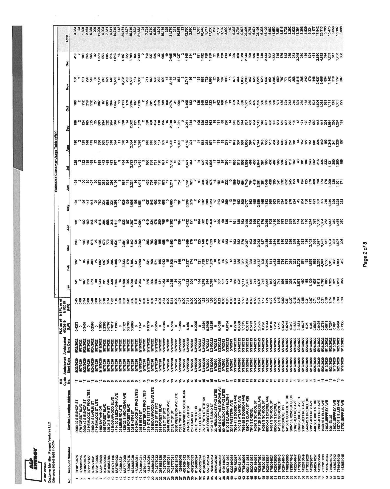

# Attachment A-1: Product and Pricing Summary 

Customer Identifier
Utility/EDC
No. of Service Location(s)

Panges Ventures LLC
ComEd - IL
527

## Offer Information

Offer Generation Date
Offer Expiration Time
Billing Method
Days to Pay
Product Name
Earliest Anticipated Start Date**
Term

12/13/2019
12/16/2019 5:00 PM CPT
Single Bill - Utility/EDC Consolidated Billing
Per Utility/EDC Tariff
Fixed Price All Inclusive
$5 / 1 / 2020$
24 Months
*Reference pg. 2 for Service Location-specific Anticipated Start Date(s)

## Pricing Details

## Energy Price

### 0.04020

### Pricing Notes

| Pricing Date |  |  |  |  |  |  |  |  |  |  |  |  |  |  |  |  |  |  |  |  |  |  |  |  |  |  |  |  |  |  |  |  |  |  |  |  |  |  |  |  |  |  |  |  |  |  |  |  |  |  |  |  |  |  |  |  |  |  |  |  |  |  |  |  |  |  |  |  |  |  |  |  |  |  |  |  |  |  |  |  |  |  |  |  |  |  |  |  |  |  |  |  |  |  |  |  |  |  |  | 

The image is a photo of a printed table, likely from a report or document. It contains multiple rows and columns of numerical data and text. The table appears to be organized by months, with columns labeled for each month (e.g., Jan, Feb, Mar, etc.). The rows contain various data entries, possibly related to energy consumption or billing, as suggested by the presence of "Energy" in the logo at the bottom left corner. The table includes headings such as "Total," "Account Number," "Service Address," and "Customer Name." The page number "Page 2 of 8" is visible on the right side. The text is oriented vertically, requiring rotation to read comfortably.

The image is a photo or illustration of a document page. It contains multiple rows of text arranged in columns. The text appears to be numerical data, possibly addresses or codes, and is densely packed across the page. The page number "Page 6 of 8" is visible on the right side. The text is aligned in a grid-like format, with each row containing several entries separated by spaces. The overall appearance suggests it might be a data table or list.

