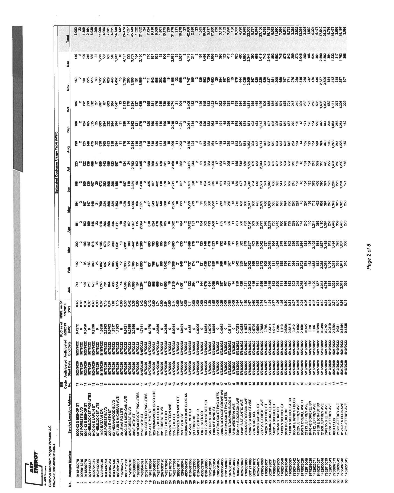
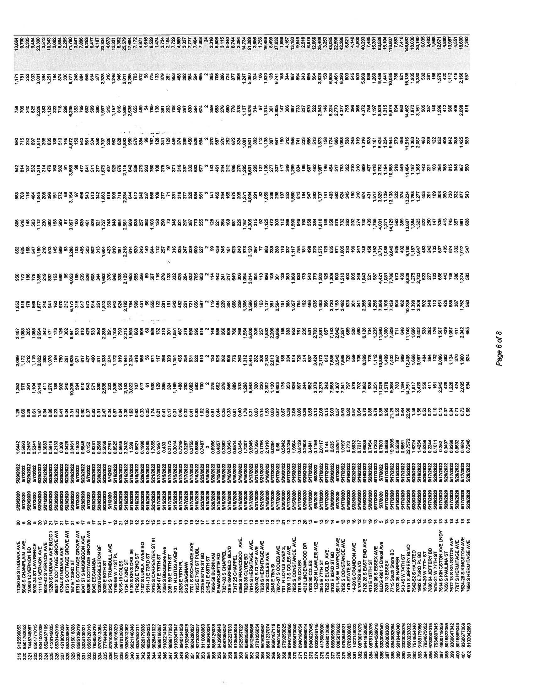

# Attachment A-1: Product and Pricing Summary 

Customer Identifier
Utility/EDC
No. of Service Location(s)

Panges Ventures LLC
ComEd - IL
527

## Offer Information

Offer Generation Date
Offer Expiration Time
Billing Method
Days to Pay
Product Name
Earliest Anticipated Start Date**
Term

12/13/2019
12/16/2019 5:00 PM CPT
Single Bill - Utility/EDC Consolidated Billing
Per Utility/EDC Tariff
Fixed Price All Inclusive
$5 / 1 / 2020$
24 Months
*Reference pg. 2 for Service Location-specific Anticipated Start Date(s)

## Pricing Details

## Energy Price

### 0.04020

### Pricing Notes

| Pricing Date |  |  |  |  |  |  |  |  |  |  |  |  |  |  |  |  |  |  |  |  |  |  |  |  |  |  |  |  |  |  |  |  |  |  |  |  |  |  |  |  |  |  |  |  |  |  |  |  |  |  |  |  |  |  |  |  |  |  |  |  |  |  |  |  |  |  |  |  |  |  |  |  |  |  |  |  |  |  |  |  |  |  |  |  |  |  |  |  |  |  |  |  |  |  |  |  |  |  |  | 

The image is a photo of a document, specifically a table or spreadsheet. It contains multiple columns and rows filled with numerical data and text. The document appears to be related to energy or utility billing, as indicated by the logo and text "Energy" at the bottom left corner. The table includes headings such as "Service Address," "Account Number," and "Total." The page number "Page 2 of 8" is visible on the right side. The text is oriented vertically, requiring rotation to read comfortably.

The image is a photo or scanned document containing a densely packed list of numbers and text arranged in rows and columns. The text appears to be addresses or locations followed by numerical data. The numbers are likely statistical or financial figures, possibly representing measurements or values associated with each address. The document is labeled "Page 6 of 8" on the right side. The layout is structured with each address followed by a series of numerical entries, aligned in a grid-like format.

