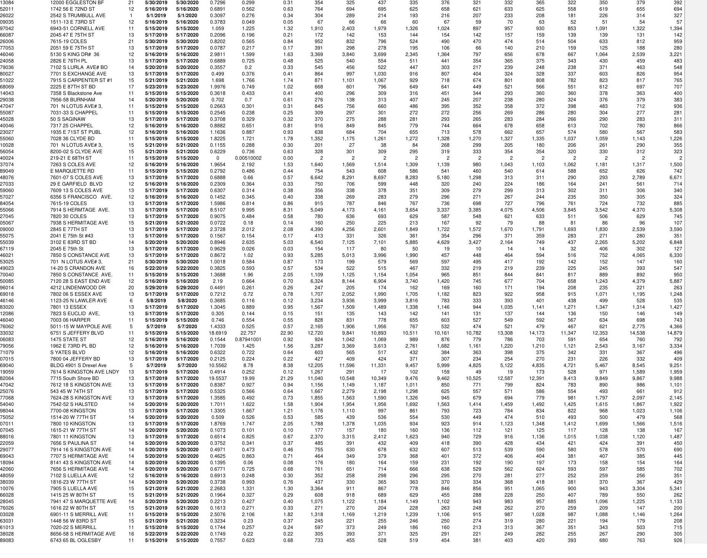

# Attachment A-1: Product and Pricing Summary 

Customer Identifier
Utility/EDC
No. of Service Location(s)

Pangea Ventures LLC
ComEd - IL
520

## Offer Information

## Offer Generation Date

## Offer Expiration Time

## Billing Method

Days to Pay
Product Name
Earlest Anticipated Start Date**

## Term

## $0.04260 \quad$ \$xwh

## Pricing Notes

| Pricing Notes |  |
| :-- | :-- |
| Pricing Index |  |
| $\checkmark$ Energy | Included in Energy Price |
| $\checkmark$ Capacity | Included in Energy Price |
| $\checkmark$ Transmission | Included in Energy Price |
| $\checkmark$ Energy Losses | Included in Energy Price |
| $\checkmark$ Ancillaries | Included in Energy Price |
| $\checkmark$ RPS | Included in Energy Price |

Offercode: 900266660B1115517

## Additional Terms

## Applicable only to the Service Location(s) served under this Attachment A-1.

The General Terms and Conditions and Exhibit A most recently executed between the parties on or prior to the date hereof are hereby incorporated herein by reference and become a part of, and govern, this Attachment A-1. The pricing on this Attachment A-1 does not include any EDC or otherwise non-bypassable charge or any applicable (and not expressly included) tax.

Nowithstanding anything contained in this Agreement to the contrary, Customer shall have the right to amend the list of Service Locations identified in this Attachment A-1 without impact to the Energy Price agreed hereunder by adding to or deleting from such Service Location list provided that (1) there is no Event of Default by Customer; (2) any such Service Location to be added is within the applicable EDC and ISO zone currently served by AEP Energy under the terms of this Attachment A-1; (3) such amendments are made solely in order to reflect additional Service Locations or deletions in respect of Service Location closures or transfers to unaffiliated third parties, and (4) the additions and deletions do not result in a change to overall usage, as specified in the Estimated Customer Usage Table in Attachment A-1 at the time of such addition or deletion, by more than ten percent (10\%) of the Estimated Customer Usage Table in Attachment A-1 as of the effective date of this Agreement (the "Threshold"). If Customer adds Service Locations that result in an increase in annual usage of more than the Threshold, then the Energy Price for such additional usage shall be mutually agreed to in writing by the parties. Any deletions in excess of the Threshold shall result in the payment of actual damages, if any, by Customer.

Pangea Ventures LLC
AEP Energy, Inc.

## Customer Signature

Name (Print)
Title

Date

Signature
Scott D. Silsher

Name
Chief Solutions Officer

Title

Date

The image is a photo/illustration of a detailed table titled "Estimated Customer Usage Table (kWh)." It contains multiple columns and rows with data related to customer energy usage. Key elements include:

- **Columns**: 
  - No.
  - Account Number
  - Service Location Address
  - Bill Cycle
  - Anticipated Start Date
  - Anticipated End Date
  - PLC as of 6/1/2018 (kW)
  - PLC as of 6/1/2019 (kW)
  - NSPL as of 6/1/2019 (kW)
  - Monthly columns from Jan to Dec
  - Total

- **Text at the top**: 
  - "Customer Identifier: Pangea Ventures LLC"
  - "Officecode: 1000Sales181971"

- **Data**: Each row corresponds to a different account with specific usage data for each month and a total.

- **Layout**: The table is organized with headers at the top, and data is aligned in rows beneath each header. The table spans the entire width of the page, and the page number "Page 2 of 8" is at the bottom center.

- **Design**: The table uses a simple grid layout with alternating row colors for readability.

The image is a table containing multiple columns and rows with numerical data and text. Each row appears to represent a different entry, with columns likely indicating various attributes or measurements. The columns include:

1. A numerical identifier or code.
2. An address or location.
3. A numerical value (possibly a count or identifier).
4. Two date columns, formatted as "5/12/2019" and "5/12/2020".
5. Several columns with numerical data, possibly representing measurements or statistics over time.

The data is densely packed, with each entry spanning a single row across the table. The table is organized in a grid format, with consistent spacing between columns.

| 161 | 6367220330 | 131921 W 947H | 16 | 63223016 | 6322820 | 0.6055 | 3.109 | 3.18 | 2.608 | 2.708 | 2.867 | 2.855 | 2.405 | 1.718 | 2.185 | 2.398 | 2.157 | 2.278 | 2.634 | 2.922 | 29.555 |
| :--: | :--: | :--: | :--: | :--: | :--: | :--: | :--: | :--: | :--: | :--: | :--: | :--: | :--: | :--: | :--: | :--: | :--: | :--: | :--: | :--: | :--: |
| 162 | 7348548046 | 7961 S-PAATCIN AVE | 15 | 6313319 | 6313820 | 1.4862 | 1.64 | 1.31 | 1.165 | 1.086 | 1.086 | 980 | 881 | 777 | 773 | 633 | 607 | 1.094 | 1.177 | 1.157 | 11.815 |
| 163 | 6364480561 | 8109.17 S-ANA-AND-AVE | 15 | 6313319 | 6313820 | 5.1062 | 4.166 | 5.37 | 5.718 | 5.421 | 5.614 | 3.841 | 2.742 | 2.840 | 2.779 | 2.857 | 2.604 | 2.669 | 4.571 | 6.581 | 47.837 |
| 164 | 8937172647 | 724149 PHILLIPS AVE | 12 | 6163319 | 6163820 | 5.7021 | 0.436 | 0.46 | 1.257 | 1.249 | 1.048 | 903 | 915 | 787 | 809 | 675 | 666 | 976 | 1.006 | 1.006 | 11.698 |
| 165 | 6364484969 | 8111 S-ANA-AND-AVE | 15 | 6313319 | 6313820 | 4.8937 | 4.313 | 3.18 | 754 | 660 | 660 | 664 | 849 | 1.026 | 1.255 | 1.385 | 1.072 | 815 | 672 | 1.192 | 10.520 |
| 166 | 8853354059 | 741725 S-PHILLIPS AVE | 12 | 6163319 | 6163820 | 1.6779 | 1.358 | 1.15 | 1.017 | 956 | 833 | 708 | 615 | 528 | 525 | 600 | 581 | 650 | 926 | 773 | 8.426 |
| 167 | 9038548517 | 800103 S-SAMPAYFEH ST | 15 | 6313319 | 6313820 | 1.6425 | 0.058 | 0.02 | 2.890 | 3.017 | 2.629 | 1.032 | 144 | 144 | 153 | 170 | 138 | 147 | 1.506 | 2.675 | 14.945 |
| 168 | 8853478036 | 744044 S-PHILLIPS AVE | 12 | 6163319 | 6163820 | 0.8872 | 1.57 | 1.17 | 790 | 581 | 645 | 610 | 601 | 551 | 620 | 678 | 652 | 674 | 649 | 768 | 7.822 |
| 169 | 9196567561 | 121622 W 83951 | 15 | 6313319 | 6313820 | 2.4129 | 0.604 | 0.46 | 370 | 302 | 300 | 414 | 555 | 382 | 273 | 289 | 273 | 300 | 323 | 354 | 4.135 |
| 170 | 9444698032 | 782931 PHILLIPS BD | 13 | 6173319 | 6173820 | 0.5185 | 0.541 | 0.57 | 239 | 234 | 252 | 237 | 234 | 180 | 214 | 238 | 222 | 237 | 242 | 249 | 2.779 |
| 171 | 9110699334 | 8515 S-SANTAYET | 16 | 6322319 | 6322820 | 0.3213 | 0.438 | 0.47 | 271 | 214 | 240 | 329 | 235 | 207 | 223 | 254 | 246 | 242 | 227 | 2.72 | 2.863 |
| 172 | 9267785542 | 7109.11 S-PASSIELAND AVE | 12 | 6163319 | 6163820 | 1.0131 | 0.906 | 0.84 | 1.491 | 1.305 | 1.224 | 1.124 | 1.085 | 941 | 976 | 1.136 | 1.250 | 1.459 | 1.416 | 1.452 | 14.859 |
| 173 | 9322798556 | 7814 S-HERMITAGE AVE | 15 | 6313319 | 6313820 | 1.6148 | 1.809 | 1.19 | 9.059 | 4.997 | 5.063 | 3.134 | 1.447 | 755 | 826 | 1.062 | 1.663 | 4.096 | 5.281 | 5.526 | 38.639 |
| 174 | 9441172077 | 7110-20 S-PASSIELAND AVE | 12 | 6163319 | 6163820 | 0.6297 | 0.931 | 1.17 | 3.130 | 2.906 | 2.545 | 1.597 | 1.153 | 920 | 1.038 | 1.098 | 987 | 1.320 | 2.914 | 3.669 | 23.276 |
| 175 | 902632035 | 791516 S-HERMITAGE AVE UP | 15 | 6313319 | 6313820 | 0.3292 | 0.344 | 0.32 | 452 | 372 | 376 | 345 | 323 | 291 | 307 | 342 | 331 | 356 | 362 | 441 | 4.300 |
| 185 | 9449016534 | 800103 S-MAWSHIP BLD | 15 | 6313319 | 6313820 | 0.4467 | 0.422 | 0.50 | 1.571 | 1.610 | 1.953 | 1.508 | 1.187 | 1.042 | 1.033 | 1.022 | 906 | 1.029 | 1.271 | 1.545 | 16.010 |
| 186 | 8937759030 | 740003 S-TATES BLVD | 12 | 6163319 | 6163820 | 0.4146 | 0.496 | 0.38 | 828 | 805 | 466 | 278 | 254 | 228 | 243 | 249 | 242 | 260 | 291 | 578 | 4.721 |
| 187 | 9048096985 | 805759 S-MAWSHIP BLD AVE | 15 | 6313319 | 6313820 | 0.4381 | 0.455 | 0.42 | 446 | 414 | 481 | 451 | 435 | 392 | 397 | 423 | 402 | 424 | 441 | 438 | 5.117 |
| 188 | 8853505510 | 740913 S-TATES BD | 12 | 6163319 | 6163820 | 0.5876 | 0.592 | 0.61 | 1.036 | 670 | 874 | 1.125 | 1.155 | 820 | 664 | 624 | 677 | 987 | 1.122 | 1.308 | 11.062 |
| 189 | 9449416581 | 810004 S-MAWSHIP BLD | 15 | 6313319 | 6313820 | 0.3912 | 0.039 | 0.06 | 254 | 331 | 364 | 312 | 190 | 97 | 104 | 108 | 124 | 231 | 295 | 352 | 2.862 |
| 190 | 9528640010 | 754959 S-TATES BLVD | 13 | 6173319 | 6173820 | 0.1562 | 0.66 | 1.04 | 1.189 | 777 | 792 | 827 | 957 | 930 | 1.041 | 1.102 | 1.096 | 1.044 | 1.124 | 1.393 | 12.270 |
| 191 | 9448174524 | 8149-51 S-MAWSHIP BLD | 15 | 6313319 | 6313820 | 0.6485 | 0.035 | 0.05 | 107 | 110 | 129 | 117 | 103 | 80 | 122 | 112 | 84 | 91 | 105 | 125 | 1.247 |
| 192 | 9528178037 | 7701 S-TATES BLVD H | 13 | 6173319 | 6173820 | 0.2396 | 0.272 | 0.30 | 211 | 195 | 198 | 199 | 225 | 225 | 215 | 214 | 219 | 229 | 212 | 206 | 2.548 |
| 193 | 9448217039 | 8233 S-MAWSHIP BLD AVE | 15 | 6313319 | 6313820 | 0.3245 | 0.262 | 0.30 | 239 | 296 | 299 | 247 | 239 | 200 | 212 | 225 | 213 | 206 | 211 | 205 | 2.802 |
| 194 | 9528022567 | 7801-11 S-TATES BLVD | 13 | 6173319 | 6173820 | 0.939 | 0.888 | 0.89 | 1.762 | 1.842 | 1.719 | 1.479 | 1.105 | 731 | 702 | 730 | 796 | 1.170 | 1.557 | 1.790 | 15.354 |
| 195 | 0172121078 | 1116W 777H ST BLDS 1116 | 14 | 6300319 | 6300820 | 0.2938 | 0.447 | 0.33 | 323 | 272 | 267 | 222 | 228 | 212 | 228 | 323 | 303 | 295 | 344 | 365 | 3.383 |
| 196 | 4798312520 | 12009 S-LXWNSTON ST | 2 | 633319 | 633820 | 0.3702 | 0.2 | 0.32 | 367 | 412 | 336 | 287 | 321 | 307 | 274 | 217 | 204 | 237 | 237 | 251 | 3.450 |
| 197 | 7760145114 | 7701-03 S-MAYTEL | 14 | 6300319 | 6300820 | 0.9192 | 1.053 | 1.32 | 1.587 | 1.036 | 1.574 | 1.419 | 1.174 | 820 | 800 | 501 | 466 | 609 | 1.255 | 1.738 | 13.289 |
| 198 | 5981463571 | 61719 S-CENTRAL AVE | 6 | 663319 | 663820 | 0.8517 | 1.552 | 1.53 | 4.209 | 4.397 | 4.502 | 3.831 | 2.828 | 1.026 | 890 | 784 | 799 | 734 | 2.465 | 4.176 | 30.444 |
| 199 | 6112224557 | 8001-03S-MAY | 15 | 6313319 | 631820 | 0.1213 | 0.065 | 0.10 | 202 | 208 | 205 | 181 | 188 | 174 | 196 | 210 | 176 | 142 | 147 | 2.202 |  |
| 200 | 7404742540 | 5230-04 W-HARRISON ST | 2 | 633319 | 633820 | 1.2124 | 0.962 | 1.25 | 871 | 812 | 814 | 863 | 664 | 692 | 715 | 776 | 722 | 692 | 683 | 681 | 8.790 |
| 201 | 7660535531 | 7657-59 S-MORISON ST | 14 | 6300319 | 6300820 | 2.9571 | 2.305 | 2.50 | 5.728 | 5.285 | 5.732 | 4.857 | 2.896 | 2.056 | 1.841 | 1.860 | 1.892 | 2.453 | 2.985 | 4.554 | 42.624 |
| 202 | 5809320049 | 430 N-WALLER AVE BLDS | 6 | 663319 | 663820 | 2.2559 | 0.681 | 0.41 | 911 | 854 | 774 | 647 | 528 | 453 | 481 | 522 | 570 | 693 | 760 | 743 | 7.936 |
| 203 | 7400365335 | 7741-42 S-NORMAL AVE | 14 | 6300319 | 6300820 | 1.3168 | 1.322 | 1.24 | 843 | 740 | 765 | 698 | 684 | 625 | 676 | 726 | 670 | 593 | 707 | 754 | 8.509 |
| 204 | 6149316336 | 58709 A-LWE ST | 6 | 663319 | 663820 | 2.9841 | 4.276 | 4.05 | 9.813 | 10.510 | 11.769 | 11.796 | 8.447 | 2.861 | 2.643 | 2.476 | 2.285 | 2.480 | 2.922 | 3.864 | 70.276 |
| 205 | 9032143960 | 794450 S-PALLINA | 15 | 6313319 | 631820 | 0.7522 | 0.774 | 0.81 | 952 | 912 | 904 | 877 | 846 | 867 | 881 | 884 | 832 | 865 | 850 | 10.614 | 4.642 |
| 206 | 5897288037 | 600-03 N-LDRIG AVE | 6 | 663319 | 663820 | 1.5543 | 5.967 | 6.44 | 8.617 | 8.514 | 8.595 | 8.827 | 7.451 | 3.166 | 2.264 | 2.169 | 2.404 | 2.046 | 5.160 | 7.865 | 67.829 |
| 207 | 9448791534 | 7949 S-PALLINA | 15 | 6313319 | 631820 | 0.1217 | 0.033 | 0.03 | 35 | 47 | 49 | 37 | 40 | 33 | 32 | 34 | 34 | 34 | 27 | 433 |  |
| 208 | 5981465082 | 5501-09 W-HORON | 6 | 663319 | 663820 | 0.9055 | 1.834 | 2.29 | 1.292 | 1.150 | 1.118 | 1.011 | 948 | 1.336 | 1.842 | 1.856 | 857 | 1.068 | 1.193 | 1.294 | 14.566 |
| 209 | 2903093200 | 8008 S-PALLINA ST | 15 | 6313319 | 631820 | 1.1677 | 0.602 | 0.47 | 10.488 | 7.622 | 7.465 | 4.615 | 4.621 | 345 | 396 | 330 | 277 | 299 | 6.416 | 12.891 | 52.837 |
| 210 | 3579193042 | 5623 S-SLIZABETH ST | 6 | 6610319 | 661820 | 0.771 | 0.627 | 0.65 | 593 | 630 | 621 | 527 | 427 | 282 | 306 | 302 | 322 | 388 | 480 | 489 | 5.368 |
| 211 | 6032290900 | 8004-12 S-PALLINA ST | 15 | 6313319 | 631820 | 2.5572 | 2.562 | 2.34 | 11.451 | 11.763 | 16.127 | 4.514 | 1.029 | 915 | 957 | 1.123 | 1.114 | 1.204 | 6.951 | 12.311 | 63.608 |
| 212 | 7668420047 | 56005 S-ROLCDTT AVE | 6 | 6610319 | 661820 | 0.2429 | 0.463 | 0.39 | 0.05 | 153 | 127 | 117 | 81 | 58 | 44 | 51 | 47 | 43 | 210 | 228 | 190 | 1.350 |
| 213 | 7660551071 | 7608 S-SANGARON ST | 14 | 6300319 | 6300820 | 2.183 | 0.079 | 0.06 | 2.191 | 2.526 | 2.317 | 1.801 | 813 | 63 | 71 | 83 | 62 | 79 | 1.286 | 2.259 | 13.662 |
| 214 | 0163034138 | 5541 S-WOLD ST | 6 | 6610319 | 661820 | 1.389 | 0.098 | 0.10 | 142 | 148 | 102 | 62 | 47 | 67 | 82 | 54 | 45 | 65 | 114 | 116 | 1.022 |
| 215 | 7668457023 | 7655-59 S-SANGARON AVE | 9 | 6610319 | 661820 | 0.327 | 0.195 | 0.34 | 908 | 727 | 577 | 454 | 325 | 357 | 338 | 314 | 293 | 269 | 849 | 868 | 6.408 |
| 223 | 9618372027 | 7949-51 S-WINCHECFER | 15 | 6313319 | 631820 | 0.1831 | 0.155 | 0.17 | 160 | 164 | 191 | 178 | 165 | 155 | 147 | 139 | 132 | 140 | 159 | 167 | 1.922 |
| 224 | 9433690957 | 610137 S-LANGLEY AVE | 6 | 6610319 | 661820 | 0.7573 | 1.511 | 1.13 | 1.187 | 871 | 1.056 | 971 | 862 | 766 | 142 | 737 | 752 | 992 | 1.100 | 1.200 | 11.316 |
| 225 | 9418521039 | 765153 S-WOLDOTT AVE | 15 | 6313319 | 631820 | 0.1271 | 0.073 | 0.07 | 213 | 202 | 257 | 238 | 225 | 164 | 126 | 140 | 151 | 172 | 164 | 172 | 2.286 |
| 226 | 9007326015 | 5130-26 S-KING DR | 6 | 663319 | 663820 | 1.1292 | 0.318 | 0.89 | 1.742 | 1.794 | 1.646 | 1.284 | 1.083 | 1.236 | 1.108 | 1.013 | 949 | 1.280 | 1.460 | 1.431 | 16.125 |
| 227 | 7499018554 | 5448 W-KOMAS ST BLDS | 4 | 663319 | 663820 | 0.2943 | 0.315 | 0.33 | 3.297 | 3.214 | 2.925 | 1.802 | 2.75 | 287 | 283 | 282 | 292 | 415 | 2.037 | 3.794 | 18.776 |
| 228 | 9768429017 | 6224-54 S-KING DR | 4 | 6610319 | 661820 | 0.1841 | 1.337 | 2.00 | 1.595 | 1.456 | 1.194 | 1.010 | 1.035 | 1.015 | 1.048 | 950 | 975 | 1.034 | 1.049 | 1.171 | 13.530 |
| 229 | 5981146553 | 42325 N-CENTRAL AVE LWET | 6 | 663319 | 663820 | 0.7349 | 0.426 | 0.68 | 1.002 | 1.072 | 1.015 | 908 | 783 | 635 | 666 | 567 | 550 | 537 | 662 | 864 | 6.210 |
| 230 | 9175130032 | 530008 MCHAGAN-BD | 6 | 663319 | 663820 | 1.2816 | 0.842 | 1.16 | 2.169 | 1.982 | 1.999 | 1.730 | 1.166 | 768 | 616 | 758 | 548 | 591 | 1.505 | 1.580 | 15.614 |
| 231 | 5931069205 | 42729-25 S-NORMAL | 6 | 663319 | 663820 | 0.6553 | 0.377 | 0.45 | 827 | 202 | 244 | 218 | 211 | 193 | 214 | 243 | 249 | 291 | 1.746 | 3.062 | 6.385 | 2.853 |
| 232 | 9513433030 | 585458 S-MO-HOMAN AVE | 5 | 663319 | 663820 | 1.4763 | 0.767 | 0.79 | 1.824 | 1.865 | 1.757 | 1.537 | 985 | 665 | 1.020 | 771 | 1.002 | 808 | 1.324 | 1.728 | 15.245 |  |
| 233 | 5981069346 | 722 N-CENTRAL | 6 | 663319 | 663820 | 1.4016 | 1.966 | 2.45 | 5.160 | 4.972 | 4.018 | 3.972 | 2.574 | 2.320 | 1.589 | 1.379 | 1.254 | 1.534 | 1.983 | 1.983 | 31.744 |  |
| 234 | 7596327538 | 5901 S-MO-HOMAN AVE | 9 | 6610319 | 663820 | 0.5293 | 0.661 | 0.661 | 0.84 | 2.302 | 2.763 | 2.731 | 2.224 | 1.598 | 1.086 | 768 | 558 | 531 | 494 | 653 | 983 | 16.681 |
| 235 | 7032240036 | 6000-59 PPAVRA | 9 | 6610319 | 663820 | 0.7197 | 0.646 | 0.73 | 605 | 477 | 482 | 420 | 505 | 539 | 512 | 494 | 477 | 499 | 467 | 495 | 5.972 |  |
| 236 | 5925166036 | 6000-59 PPAVRA | 9 | 663319 | 663820 | 0.7197 | 0.699 | 0.10 | 233 | 160 | 190 | 181 | 133 | 95 | 88 | 90 | 100 | 188 | 199 | 187 | 1.890 |  |
| 237 | 7325166039 | 5007 W-LACADON BLVD | 4 | 663319 | 663820 | 0.1937 | 0.089 | 0.10 | 233 | 160 | 190 | 181 | 133 | 95 | 88 | 90 | 100 | 188 | 199 | 187 | 1.890 |  |
| 238 | 9684016336 | 603255 S-VORNON | 6 | 6610319 | 663820 | 0.5927 | 0.075 | 0.14 | 2.139 | 2.113 | 2.210 | 1.749 | 710 | 161 | 88 | 81 | 64 | 108 | 1.915 | 2.333 | 13.671 |  |
| 239 | 7325305037 | 5012 W-LACADON BLVD | 4 | 663319 | 663820 | 0.1872 | 0.251 | 0.17 | 322 | 202 | 256 | 202 | 182 | 14 | 82 | 103 | 147 | 205 | 243 | 205 | 243 | 242 | 2.453 |
| 240 | 9513713042 | 21435 E-GMPISEL BLOO | 1 | 663319 | 663820 | 0.1257 | 0.073 | 1.18 | 2.783 | 2.605 | 2.401 | 2.076 | 2.122 | 1.709 | 1.721 | 1.866 | 1.669 | 1.972 | 2.178 | 2.326 | 25.229 |  |
| 241 | 7325175038 | 501519 W-JACADON BLVD | 4 | 663319 | 663820 | 0.4416 | 0.369 | 0.41 | 574 | 496 | 495 | 481 | 406 | 408 | 338 | 238 | 286 | 442 | 424 | 424 | 438 | 4.983 | 4.983 |
| 242 | 9513720057 | 2955 GARFFELD BLVD | 1 | 663319 | 663820 | 0.298 | 0.338 | 0.338 | 0.43 | 316 | 204 | 390 | 236 | 193 | 194 | 209 | 255 | 225 | 235 | 252 | 410 | 369 | 3.197 |
| 243 | 7325314035 | 5018 W-LACADON BLVD | 4 | 663319 | 663820 | 0.0878 | 0.098 | 0.10 | 545 | 456 | 458 | 276 | 270 | 168 | 111 | 79 | 96 | 14 | 11 | 202 | 199 | 2.839 | 13.5 |
| 244 | 9513736054 | 6 GARFFELD BLD UX | 1 | 663319 | 663820 | 0.0927 | 0.073 | 0.45 | 637 | 252 | 214 | 165 | 111 | 78 | 214 | 243 | 100 | 145 | 248 | 291 | 1.196 | 3.062 | 6.385 |
| 245 | 5009035547 | 14850 N-AGAPERAL H | 12 | 663319 | 663820 | 0.0913 | 0.091 | 0.091 | 0.091 | 0.091 | 0.091 | 0.091 | 0.091 | 0.091 | 0.091 | 0.091 | 0.091 | 0.091 | 0.091 | 0.091 | 0.091 | 0.258 |
| 246 | 5003033587 | 5716 S-WABASCH AVE | 7 | 663319 | 663820 | 0.0456 | 0.052 | 0.06 | 1.602 | 932 | 300 | 85 | 52 | 36 | 45 | 43 | 45 | 45 | 45 | 45 | 45 | 45 | 45 | 45 | 2.258 |
| 247 | 5706335555 | 4824-38 W-SOSTEMS AVE UN | 12 | 663319 | 663820 | 0.0355 | 0.044 | 0.04 | 83 | 84 | 84 | 83 | 50 | 32 | 38 | 36 | 35 | 36 | 35 | 36 | 36 | 36 | 36 | 36 | 2.258 |
| 248 | 692551181 | 10 | 633319 | 663820 | 0.0456 | 0.052 | 0.06 | 0.012 | 0.02 | 812 | 859 | 903 | 630 | 393 | 416 | 374 | 425 | 442 | 434 | 448 | 448 | 448 | 448 | 448 | 2.258 |
| 249 | 692551181 | 208 S-147TH ST | 13 | 6331319 | 631820 | 0.0431 | 0.031 | 0.012 | 0.02 | 812 | 859 | 903 | 800 | 800 | 545 | 540 | 540 | 554 | 555 | 555 | 572 | 572 | 592 | 6.502 | 56.005 |
| 250 | 6925151881 | 111716 LAMLER AVE | 6 | 6631319 | 663820 | 0.0445 | 0.052 | 0.06 | 1.016 | 0.08 | 825 | 226 | 1.93 | 56 | 4.82 | 4.42 | 4.15 | 4.25 | 4.25 | 4.25 | 4.25 | 4.25 | 4.25 | 4.25 | 4.25 |
| 251 | 732516035 | 108 S-147TH ST | 14 | 6631319 | 663820 | 0.0445 | 0.042 | 0.02 | 1.012 | 0.06 | 825 | 855 | 1.92 | 5.25 | 4.02 | 4.02 | 4.02 | 4.02 | 4.02 | 4.02 | 4.02 | 4.02 | 4.02 | 4.02 | 4.02 |
| 252 | 692515188 | 1111716 LAMLER AVE | 14 | 6631319 | 663820 | 0.0445 | 0.042 | 0.02 | 1.012 | 825 | 855 | 1.92 | 5.25 | 4.02 | 4.02 | 4.02 | 4.02 | 4.02 | 4.02 | 4.02 | 4.02 | 4.02 | 4.02 | 4.02 |
| 253 | 692515188 | 1111716 LAMLER AVE | 12 | 6631319 | 663820 | 0.0445 | 0.042 | 0.02 | 1.012 | 825 | 855 | 1.92 | 5.25 | 4.02 | 4.02 | 4.02 | 4.02 | 4.02 | 4.02 | 4.02 | 4.02 | 4.02 | 4.02 | 4.02 |
| 254 | 692515188 | 111716 LAMLER AVE | 13 | 6631319 | 663820 | 0.0445 | 0.042 | 0.02 | 1.012 | 825 | 855 | 1.92 | 5.25 | 4.02 | 4.02 | 4.02 | 4.02 | 4.02 | 4.02 | 4.02 | 4.02 | 4.02 | 4.02 | 4.02 |
| 255 | 692515188 | 111716 LAMLER AVE | 14 | 6631319 | 663820 | 0.0445 | 0.042 | 0.02 | 1.012 | 825 | 855 | 1.92 | 5.25 | 4.02 | 4.02 | 4.02 | 4.02 | 4.02 | 4.02 | 4.02 | 4.02 | 4.02 | 4.02 | 4.02 |
| 256 | 692515189 | 111716 LAMLER AVE | 15 | 6631319 | 663820 | 0.0445 | 0.042 | 0.02 | 1.012 | 820 | 855 | 1.92 | 5.25 | 4.02 | 4.02 | 4.02 | 4.02 | 4.02 | 4.02 | 4.02 | 4.02 | 4.02 | 4.02 | 4.02 | 4.02 |
| 257 | 692515198 | 111716 LAMLER AVE | 16 | 631319 | 63820 | 0.0445 | 0.042 | 0.012 | 820 | 855 | 1.92 | 5.25 | 4.02 | 4.02 | 4.02 | 4.02 | 4.02 | 4.02 | 4.02 | 4.02 | 4.02 | 4.02 | 4.02 |
| 258 | 692515198 | 11716 LAMLER AVE | 17 | 6631319 | 63820 | 0.0445 | 0.02 | 1.012 | 820 | 855 | 1.92 | 5.25 | 4.02 | 4.02 | 4.02 | 4.02 | 4.02 | 4.02 | 4.02 | 4.02 | 4.02 | 4.02 | 4.02 | 4.02 |
| 259 | 69251518 | 11716 LAMLER AVE | 18 | 631319 | 63820 | 0.0445 | 0.0445 | 0.0445 | 0.02 | 820 | 855 | 1.92 | 5.25 | 4.02 | 4.02 | 4.02 | 4.02 | 4.02 | 4.02 | 4.02 | 4.02 | 4.02 | 4.02 | 4.02 |
| 2692 | 692515188 | 11716 LAMLER AVE | 19 | 631319 | 0.0445 | 0.0445 | 0.0445 | 0.012 | 820 | 855 | 1.92 | 5.25 | 4.02 | 4.02 | 4.02 | 4.02 | 4.02 | 4.02 | 4.02 | 4.02 | 4.02 | 4.02 | 4.02 | 4.02 |
| 269 | 69251518 | 11716 LAMLER AVE | 18 | 631319 | 0.0445 | 0.0445 | 0.012 | 820 | 855 | 1.92 | 5.25 | 4.02 | 4.02 | 4.02 | 4.02 | 4.02 | 4.02 | 4.02 | 4.02 | 4.02 | 4.02 | 4.02 | 4.02 |
| 2792 | 69251518 | 11716 LAMLER AVE | 18 | 63131

| 10 | 6986403056 | 102 S 17TH AVE | 11 | 0.15/2019 | 0.15/2020 | 4.4253 | 4.312 | 5.00 | 5.303 | 3.707 | 4.030 | 3.855 | 5.173 | 2.542 | 2.525 | 2.290 | 2.257 | 2.670 | 5.371 | 7.868 | 45.162 |
| :--: | :--: | :--: | :--: | :--: | :--: | :--: | :--: | :--: | :--: | :--: | :--: | :--: | :--: | :--: | :--: | :--: | :--: | :--: | :--: | :--: | :--: |
| 251 | 6907035050 | 1123 N LAWLER AVE | 6 | 0.9/2018 | 0.9/2020 | 0.4208 | 0.793 | 0.80 | 5.424 | 6.176 | 6.505 | 6.223 | 864 | 287 | 321 | 358 | 293 | 224 | 2.699 | 6.134 | 35.507 |
| 252 | 5910201069 | 812 S 19TH AVE BD | 11 | 0.15/2019 | 0.15/2020 | 0.2206 | 0.102 | 0.10 | 262 | 249 | 257 | 241 | 164 | 82 | 87 | 94 | 122 | 245 | 297 | 312 | 2.411 |
| 253 | 6901403036 | 1042 N LEAMINTON AVE | 6 | 0.9/2018 | 0.9/2020 | 0.6936 | 10.41 | 8.63 | 4.788 | 6.507 | 4.656 | 4.528 | 4.725 | 4.373 | 4.707 | 4.645 | 4.562 | 4.827 | 4.608 | 4.648 | 55.575 |
| 254 | 5910232062 | 817 S 19TH AVE | 12 | 0.15/2019 | 0.15/2020 | 0.1405 | 0.129 | 0.13 | 199 | 200 | 202 | 166 | 131 | 94 | 103 | 103 | 104 | 169 | 195 | 209 | 1.881 |
| 255 | 6901401035 | 1046 N LEAMINGTON AVE | 6 | 0.9/2018 | 0.9/2020 | 0.5732 | 4.033 | 5.13 | 4.600 | 4.462 | 4.696 | 4.566 | 3.452 | 2.452 | 2.557 | 2.253 | 1.372 | 1.355 | 2.695 | 4.083 | 38.984 |
| 256 | 6080150078 | 404 S 47H AVE BD | 12 | 0.16/2019 | 0.16/2020 | 0.2345 | 0.256 | 0.21 | 559 | 459 | 465 | 449 | 478 | 448 | 469 | 510 | 516 | 592 | 575 | 605 | 6.167 |
| 257 | 6907645038 | 1101-05 N LEUGARE AVE | 6 | 0.9/2018 | 0.9/2020 | 0.306 | 0.587 | 0.42 | 12.873 | 12.810 | 12.939 | 9.557 | 883 | 397 | 395 | 452 | 447 | 489 | 5.525 | 11.477 | 64.044 |
| 258 | 6003139042 | 2115 S 47H AVE | 12 | 0.16/2019 | 0.16/2020 | 0.7041 | 1.272 | 0.72 | 851 | 840 | 845 | 774 | 714 | 599 | 689 | 684 | 592 | 649 | 782 | 8.888 |
| 259 | 6907696062 | 1145 N 45H LECCARE AVE | 6 | 0.9/2018 | 0.9/2020 | 0.691 | 0.496 | 0.60 | 7.640 | 8.025 | 8.025 | 7.559 | 8.206 | 575 | 247 | 244 | 249 | 255 | 3.654 | 8.292 | 47.972 |
| 260 | 6901493041 | 2125 S 47H AVE | 12 | 0.16/2019 | 0.16/2020 | 0.8502 | 0.569 | 0.61 | 864 | 797 | 843 | 972 | 894 | 625 | 819 | 748 | 656 | 624 | 756 | 772 | 9.035 |
| 261 | 5897534061 | 701-03 N LOTLIS BLDG | 6 | 0.9/2018 | 0.9/2020 | 0.4425 | 0.557 | 0.39 | 6.885 | 7.147 | 6.863 | 6.139 | 2.507 | 512 | 294 | 384 | 363 | 434 | 2.703 | 5.851 | 40.103 |
| 262 | 6920283063 | 2109 S 57H AVE | 12 | 0.16/2019 | 0.16/2020 | 0.0544 | 0.023 | 0.03 | 254 | 241 | 243 | 227 | 228 | 219 | 202 | 242 | 242 | 256 | 219 | 225 | 2.706 |
| 263 | 7152313111 | 4823 NEMRCK | 4 | 0.9/2018 | 0.9/2020 | 0.28 | 0.485 | 0.36 | 511 | 439 | 433 | 430 | 433 | 315 | 283 | 282 | 278 | 308 | 296 | 319 | 4.327 |
| 273 | 0941460593 | 385 FORICST BLVD | 5 | 0.7/2018 | 0.7/2020 | 0.655 | 2.226 | 3.18 | 533 | 459 | 405 | 388 | 723 | 810 | 1.207 | 938 | 43 | 29 | 241 | 546 | 6.318 |
| 273 | 5307812143 | 5314 S 364SHINGTON H | 4 | 0.9/2018 | 0.9/2020 | 0.912 | 0.268 | 0.27 | 486 | 491 | 437 | 353 | 86 | 98 | 112 | 110 | 112 | 154 | 559 | 854 | 3.852 |
| 274 | 1023045231 | 29 LEABS RD LITE | 5 | 0.7/2018 | 0.7/2020 | 0.1008 | 0.1638 | 0.12 | 12 | 11 | 10 | 8 | 9 | 11 | 12 | 13 | 14 | 15 | 11 | 145 |  |
| 275 | 9119152078 | 9000 N 2 S 800HSP ST | 17 | 0.23/2018 | 0.23/2020 | 0.4188 | 0.427 | 0.45 | 649 | 157 | 168 | 163 | 171 | 169 | 164 | 182 | 186 | 166 | 160 | 427 | 2.773 |
| 276 | 1529076016 | 325 FORDST BLVD | 5 | 0.7/2018 | 0.7/2020 | 0.7493 | 0.28 | 0.42 | 377 | 350 | 332 | 287 | 239 | 163 | 173 | 171 | 129 | 178 | 205 | 317 | 2.821 |
| 277 | 9118207078 | 9040-42 S 800HSP ST | 17 | 0.23/2018 | 0.23/2020 | 0.2572 | 0.346 | 0.34 | 100 | 118 | 115 | 128 | 107 | 123 | 144 | 161 | 120 | 105 | 109 | 113 | 1.441 |
| 278 | 900088051 | 50 HENKLOCK ST PHG LITES | 5 | 0.7/2018 | 0.7/2020 | 0.2582 | 0.268 | 0.26 | 177 | 138 | 134 | 119 | 111 | 100 | 105 | 114 | 124 | 140 | 146 | 149 | 1.574 |
| 279 | 8029721031 | 9400 N 6 L.ARTLIN ST | 6 | 0.24/2018 | 0.24/2020 | 0.3601 | 0.26 | 0.40 | 571 | 537 | 518 | 502 | 468 | 414 | 436 | 448 | 450 | 496 | 513 | 570 | 5.925 |
| 280 | 2759111023 | 187 LESTER HD PHG LITES | 5 | 0.7/2018 | 0.7/2020 | 0.1648 | 0.0447502 | 0.00 | 2 | 2 | 2 | 2 | 2 | 2 | 2 | 2 | 2 | 2 | 2 | 24 |  |
| 281 | 6332195046 | 1400 BATAAN OR | 11 | 0.16/2018 | 0.16/2020 | 0.4597 | 1.386 | 0.92 | 1.099 | 915 | 906 | 795 | 666 | 557 | 634 | 704 | 691 | 899 | 1.123 | 1.261 | 10.250 |
| 282 | 3000406033 | 126 AGUANWUSTD BLVG LITE | 5 | 0.7/2018 | 0.7/2020 | 0 | 0 | 0.00 | 587 | 475 | 449 | 381 | 358 | 342 | 359 | 573 | 612 | 866 | 843 | 848 | 6.892 |
| 283 | 0610057264 | 320 S 6 L 48TH ST | 5 | 0.7/2018 | 0.7/2020 | 0.9284 | 0.678 | 0.74 | 953 | 963 | 671 | 635 | 583 | 546 | 615 | 594 | 603 | 615 | 630 | 670 | 7.978 |
| 284 | 2971083120 | 391 FORICST BLVD | 5 | 0.7/2018 | 0.7/2020 | 0 | 0 | 0.00 | 322 | 355 | 199 | 165 | 158 | 150 | 151 | 178 | 189 | 220 | 215 | 322 | 2.534 |
| 285 | 8837591043 | 4714 20 S 84CHGAN AVE | 5 | 0.7/2018 | 0.7/2020 | 0.1212 | 1.13 | 1.15 | 1.881 | 1.582 | 1.107 | 872 | 1.121 | 1.120 | 1.125 | 839 | 840 | 1.064 | 1.455 | 1.578 | 14.383 |
| 286 | 3219167051 | 3248 WESTERN AVE | 5 | 0.7/2018 | 0.7/2020 | 0 | 0 | 0.00 | 163 | 159 | 151 | 132 | 120 | 129 | 118 | 140 | 148 | 169 | 18 | 1.465 |
| 287 | 8837712060 | 4820-22 S 84CHGAN AVE | 5 | 0.7/2018 | 0.7/2020 | 0.615 | 0.512 | 0.53 | 4.405 | 4.667 | 3.677 | 3.170 | 1.832 | 776 | 408 | 419 | 544 | 2.258 | 3.804 | 4.087 | 29.876 |
| 288 | 3603018143 | 3220 WESTERN AVE LITE | 5 | 0.7/2018 | 0.7/2020 | 0 | 0 | 0.00 | 3252 | 303 | 207 | 179 | 178 | 158 | 148 | 134 | 143 | 155 | 167 | 37 | 20 | 31 |
| 289 | 7483044021 | 215 E 68TH ST | 11 | 0.15/2018 | 0.15/2020 | 0.1349 | 1.714 | 1.42 | 2.676 | 2.897 | 2.854 | 2.585 | 1.821 | 1.098 | 106 | 1.296 | 1.538 | 1.843 | 1.997 | 2.093 | 23.398 |
| 290 | 6191184012 | 8624AMKHD BLVD BLDG BE | 5 | 0.7/2018 | 0.7/2020 | 0 | 0.00403752 | 0.00 | 2 | 2 | 2 | 2 | 2 | 2 | 2 | 2 | 2 | 2 | 2 | 24 |  |
| 291 | 1843165084 | 211-17 S 71ST ST | 11 | 0.17/2018 | 0.17/2020 | 5.3925 | 0.198 | 0.12 | 544 | 436 | 97 | 72 | 31 | 52 | 87 | 109 | 281 | 640 | 711 | 703 | 3.385 |
| 292 | 4073025333 | 23 LEABS RD | 5 | 0.7/2018 | 0.7/2020 | 0 | 0.34191252 | 0.00 | 219 | 173 | 171 | 145 | 138 | 128 | 122 | 132 | 147 | 160 | 180 | 213 | 1.997 |
| 293 | 7428775032 | 211 E 21ST ST STO | 13 | 0.17/2018 | 0.17/2020 | 0.1294 | 2.086 | 1.74 | 626 | 694 | 818 | 718 | 500 | 488 | 562 | 586 | 450 | 511 | 508 | 520 | 7.010 |
| 294 | 4535027024 | 116 LESTER HD | 5 | 0.7/2018 | 0.7/2020 | 0.245 | 0.301 | 0.67 | 2.465 | 2.527 | 2.542 | 2.217 | 2.103 | 1.553 | 1.252 | 1.339 | 1.556 | 2.128 | 2.221 | 2.355 | 24.206 |
| 295 | 7428775048 | 213 E 71ST STO | 13 | 0.17/2018 | 0.17/2020 | 3.6342 | 3.259 | 2.54 | 1.074 | 1.063 | 1.031 | 930 | 853 | 736 | 839 | 905 | 792 | 745 | 809 | 896 | 10.723 |
| 296 | 5575152014 | 345 FORICST BLVD | 10 | 0.7/2018 | 0.7/2020 | 0.8243 | 0.671 | 1.25 | 598 | 474 | 433 | 385 | 465 | 531 | 342 | 355 | 141 | 386 | 730 | 572 | 5.778 |
| 297 | 7428777081 | 215 E 71ST ST | 13 | 0.17/2018 | 0.17/2020 | 5.9551 | 5.091 | 5.14 | 3.319 | 3.591 | 3.629 | 3.090 | 2.862 | 2.199 | 3.145 | 2.210 | 2.008 | 2.128 | 2.164 | 2.652 | 31.788 |
| 298 | 5905455048 | 33 HENKLOTS | 5 | 0.7/2018 | 0.7/2020 | 0.767 | 0.36316252 | 0.00 | 207 | 178 | 178 | 158 | 148 | 134 | 143 | 155 | 167 | 37 | 20 | 21 | 1.547 |
| 299 | 1299688045 | 753 E 70TH ST | 10 | 0.21/2018 | 0.21/2020 | 0.7771 | 1.049 | 1.07 | 986 | 660 | 707 | 681 | 735 | 723 | 777 | 782 | 746 | 969 | 964 | 1.021 | 9.750 |
| 300 | 6191188040 | 90 HENKLOCK ST PHG LITES | 5 | 0.7/2018 | 0.7/2020 | 0.7883 | 1.047 | 0.47 | 576 | 524 | 543 | 533 | 488 | 360 | 364 | 340 | 328 | 390 | 423 | 440 | 5.326 |
| 301 | 6104688055 | 753 E 79TH ST STE 1ST | 15 | 0.31/2018 | 0.31/2020 | 0.7993 | 1.698 | 1.23 | 1.684 | 1.636 | 877 | 862 | 638 | 741 | 131 | 1.305 | 769 | 441 | 854 | 1.485 | 12.265 |
| 302 | 605455508 | 13907 S 12-APR ST HSE | 11 | 0.15/2018 | 0.15/2020 | 0.3457 | 0.301 | 0.67 | 2.465 | 2.527 | 2.542 | 2.217 | 2.103 | 1.553 | 1.252 | 1.339 | 1.556 | 2.128 | 2.221 | 2.355 | 24.206 |
| 307 | 7684555054 | 1108 18 E 82ND ST | 15 | 0.31/2018 | 0.31/2020 | 0.9029 | 1.894 | 1.55 | 1.839 | 1.878 | 1.758 | 1.436 | 1.066 | 838 | 786 | 835 | 921 | 1.294 | 1.682 | 1.949 | 16.282 |
| 308 | 1624794075 | 14020 S 82CHS ST BD | 10 | 0.14/2018 | 0.14/2020 | 0.5352 | 0.559 | 0.55 | 769 | 623 | 694 | 575 | 501 | 416 | 414 | 411 | 361 | 466 | 588 | 588 | 588 |
| 309 | 8530584035 | 8806 S 023TTAGE GROVE AVE | 17 | 0.23/2018 | 0.23/2020 | 0.1881 | 0.406 | 0.29 | 339 | 274 | 333 | 290 | 263 | 257 | 225 | 306 | 389 | 316 | 317 | 393 | 406 | 3.871 |
| 310 | 1798001031 | 14026 S 82CHS ST | 10 | 0.14/2018 | 0.14/2020 | 0.9566 | 0.798 | 1.17 | 714 | 668 | 687 | 633 | 648 | 616 | 641 | 628 | 606 | 568 | 634 | 723 | 7.770 |
| 311 | 9874331039 | 9100 S 034JPHAN BLDG | 4 | 17 | 0.23/2018 | 0.23/2020 | 0.1012 | 0.913 | 0.95 | 402 | 390 | 540 | 469 | 476 | 368 | 398 | 407 | 348 | 361 | 405 | 421 | 4.986 |
| 312 | 1708034021 | 14031 S 82CHS ST | 10 | 0.14/2018 | 0.14/2020 | 0.7276 | 1.012 | 0.77 | 852 | 822 | 813 | 777 | 516 | 431 | 327 | 529 | 561 | 715 | 857 | 814 | 8.368 |
| 313 | 7684782057 | 7901-11 S 00380ON AVE | 15 | 0.31/2018 | 0.31/2020 | 0.6582 | 0.728 | 0.84 | 1.127 | 1.021 | 1.288 | 1.240 | 1.211 | 950 | 805 | 731 | 881 | 788 | 823 | 1.000 | 11.864 |
| 314 | 1708270040 | 14125 S 82CHS ST | 10 | 0.14/2018 | 0.14/2020 | 1.2942 | 1.118 | 1.15 | 907 | 896 | 846 | 779 | 637 | 487 | 542 | 510 | 487 | 626 | 664 | 716 | 8.109 |
| 315 | 7798039093 | 7953-59 S 00380ON AVE | 15 | 0.31/2018 | 0.31/2020 | 0.4147 | 1.168 | 1.50 | 1.070 | 827 | 949 | 1.060 | 1.060 | 862 | 764 | 867 | 899 | 978 | 1.032 | 1.076 | 11.434 |
| 316 | 1708290065 | 14128 S 82FFRST AVE | 10 | 0.14/2018 | 0.14/2020 | 0.7643 | 0.822 | 0.81 | 1.047 | 877 | 988 | 953 | 838 | 682 | 731 | 750 | 650 | 793 | 727 | 727 | 9.968 |
| 317 | 8020031072 | 7816 S 07824S | 15 | 0.31/2018 | 0.31/2020 | 0.2972 | 0.579 | 0.60 | 464 | 544 | 545 | 456 | 434 | 350 | 242 | 238 | 232 | 323 | 365 | 389 | 4.572 |
| 318 | 7630593083 | 21842 JEFFPRST AVE | 8 | 0.10/2018 | 0.10/2020 | 0.4238 | 0.158 | 0.16 | 312 | 395 | 345 | 328 | 214 | 128 | 156 | 107 | 250 | 250 | 256 | 199 | 256 | 312 |
| 319 | 7630593060 | 7917 29 S 07FFRST AVE | 8 | 0.10/2018 | 0.10/2020 | 0.387 | 2.709 | 2.74 | 1.551 | 1.566 | 1.425 | 1.359 | 1.269 | 1.130 | 1.132 | 1.159 | 1.579 | 1.136 | 1.220 | 1.414 | 15.440 |
| 320 | 1452615049 | 21913 JEFFPRST AVE | 8 | 0.10/2018 | 0.10/2020 | 0.2351 | 0.063 | 0.21 | 347 | 324 | 295 | 288 | 213 | 121 | 150 | 170 | 161 | 161 | 246 | 289 | 288 | 2.834 |
| 321 | 8020160031 | 8000-04 S 07824S | AVE H | 16 | 0.23/2018 | 0.23/2020 | 0.2322 | 2.168 | 2.24 | 2.873 | 2.235 | 748 | 494 | 584 | 758 | 1.015 | 1.017 | 662 | 504 | 1.787 | 3.057 | 15.544 |
| 322 | 1452581057 | 21837 JEFFPRST AVE BD | 8 | 0.10/2018 | 0.10/2020 | 0.4775 | 0.060 | 0.10 | 300 | 277 | 281 | 277 | 293 | 169 | 189 | 183 | 192 | 193 | 210 | 210 | 210 | 1.083 |
| 323 | 8020272055 | 8056-58 S 07824S | 15 | 0.31/2018 | 0.31/2020 | 0.6312 | 0.063 | 0.12 | 300 | 270 | 251 | 211 | 244 | 183 | 188 | 157 | 172 | 188 | 221 | 241 | 236 | 266 | 237 | 160 |
| 324 | 1452838042 | 21832 JEFFPRST AVE | 8 | 0.10/2018 | 0.10/2020 | 0.4238 | 0.212 | 0.06 | 370 | 342 | 302 | 310 | 342 | 303 | 316 | 243 | 203 | 217 | 214 | 195 | 187 | 221 | 221 | 3.082 |
| 325 | 8020424040 | 8100 DREXEL BD | 15 | 0.31/2018 | 0.31/2020 | 0.7247 | 0.52 | 0.80 | 370 | 642 | 302 | 310 | 342 | 303 | 323 | 243 | 203 | 217 | 214 | 195 | 187 | 221 | 221 | 3.082 |
| 326 | 1452831045 | 217526155 | 448 | 86 S 80TH ST BD | 15 | 0.31/2018 | 0.31/2020 | 0.4948 | 0.59 | 0.71 | 560 | 426 | 449 | 554 | 596 | 495 | 571 | 577 | 508 | 478 | 422 | 497 | 6.131 |  |
| 327 | 7830010039 | 7949 55 S 6 LUS AVE | 15 | 0.31/2018 | 0.31/2020 | 0.5557 | 0.275 | 0.31 | 2.905 | 512 | 483 | 420 | 425 | 455 | 459 | 285 | 295 | 260 | 260 | 3.578 | 4.885 | 15.955 |
| 328 | 9616119336 | 1735 96 T0TH ST | 15 | 0.31/2018 | 0.31/2020 | 0.255 | 0.339 | 3.339 | 3.46 | 1.322 | 1.31 | 1.305 | 1.27 | 1.25 | 1.305 | 1.27 | 2.25 | 2.54 | 1.64 | 1.65 | 1.55 |
| 329 | 2620160031 | 8000-04 S 07824S | 15 | 0.31/2018 | 0.31/2020 | 0.255 | 0.059 | 0.21 | 347 | 324 | 292 | 212 | 212 | 135 | 105 | 155 | 125 | 124 | 124 | 105 | 101 | 104 | 104 |
| 330 | 87790350546 | 21900 S 8244S | 16 | 0.31/2018 | 0.31/2020 | 0.255 | 0.165 | 2.24 | 2.83 | 2.83 | 2.83 | 2.83 | 2.83 | 2.83 | 2.83 | 2.83 | 2.83 | 2.83 | 2.83 | 2.83 | 2.83 | 2.83 |
| 331 | 1452593046 | 21920 S 8244S | 16 | 0.31/2018 | 0.31/2020 | 0.255 | 0.165 | 0.16 | 2.83 | 2.83 | 2.83 | 2.83 | 2.83 | 2.83 | 2.83 | 2.83 | 2.83 | 2.83 | 2.83 | 2.83 | 2.83 | 2.83 | 2.83 |
| 332 | 8020182035 | 21920 S 8244S | 18 | 0.31/2018 | 0.31/2020 | 0.255 | 0.165 | 0.16 | 2.83 | 2.83 | 2.83 | 2.83 | 2.83 | 2.83 | 2.83 | 2.83 | 2.83 | 2.83 | 2.83 | 2.83 | 2.83 | 2.83 | 2.83 |
| 333 | 1452593038 | 21800 S 8244S | 19 | 0.31/2018 | 0.31/2020 | 0.255 | 0.165 | 0.16 | 2.83 | 2.83 | 2.83 | 2.83 | 2.83 | 2.83 | 2.83 | 2.83 | 2.83 | 2.83 | 2.83 | 2.83 | 2.83 | 2.83 |
| 334 | 1452593038 | 21800 S 8244S | 19 | 0.31/2018 | 0.31/2020 | 0.255 | 0.165 | 0.16 | 2.83 | 2.83 | 2.83 | 2.83 | 2.83 | 2.83 | 2.83 | 2.83 | 2.83 | 2.83 | 2.83 | 2.83 | 2.83 | 2.83 |
| 335 | 1452593039 | 21800 S 8244S | 18 | 0.31/2018 | 0.31/2020 | 0.255 | 0.165 | 0.16 | 2.83 | 2.83 | 2.83 | 2.83 | 2.83 | 2.83 | 2.83 | 2.83 | 2.83 | 2.83 | 2.83 | 2.83 | 2.83 | 2.83 |
| 336 | 1452593040 | 21800 S 8244S | 19 | 0.31/2018 | 0.31/2020 | 0.255 | 0.165 | 0.16 | 2.83 | 2.83 | 2.83 | 2.83 | 2.83 | 2.83 | 2.83 | 2.83 | 2.83 | 2.83 | 2.83 | 2.83 | 2.83 | 2.83 | 2.83 |
| 337 | 1788007035 | 21800 S 8244S | 18 | 0.31/2018 | 0.31/2020 | 0.255 | 0.165 | 0.16 | 2.83 | 2.83 | 2.83 | 2.83 | 2.83 | 2.83 | 2.83 | 2.83 | 2.83 | 2.83 | 2.83 | 2.83 | 2.83 | 2.83 | 2.83 |
| 338 | 1452593050 | 22 | 0.31/2018 | 0.31/2020 | 0.255 | 0.165 | 0.16 | 0.16 | 2.83 | 2.83 | 2.83 | 2.83 | 2.83 | 2.83 | 2.83 | 2.83 | 2.83 | 2.83 | 2.83 | 2.83 | 2.83 | 2.83 | 2.83 |
| 339 | 1452593050 | 23 | 0.31/2018 | 0.31/2020 | 0.255 | 0.165 | 0.16 | 0.16 | 2.83 | 2.83 | 2.83 | 2.83 | 2.83 | 2.83 | 2.83 | 2.83 | 2.83 | 2.83 | 2.83 | 2.83 | 2.83 | 2.83 |
| 340 | 1452593050 | 24 | 0.31/2018 | 0.31/2020 | 0.255 | 0.165 | 0.16 | 0.16 | 2.83 | 2.83 | 2.83 | 2.83 | 2.83 | 2.83 | 2.83 | 2.83 | 2.83 | 2.83 | 2.83 | 2.83 | 2.83 | 2.83 |
| 341 | 1452593050 | 25 | 0.31/2018 | 0.31/2020 | 0.255 | 0.165 | 0.16 | 0.16 | 2.83 | 2.83 | 2.83 | 2.83 | 2.83 | 2.83 | 2.83 | 2.83 | 2.83 | 2.83 | 2.83 | 2.83 | 2.83 | 2.83 | 2.83 |
| 342 | 1452593050 | 25 | 0.31/2018 | 0.255 | 0.165 | 0.165 | 0.165 | 0.16 | 2.83 | 2.83 | 2.83 | 2.83 | 2.83 | 2.83 | 2.83 | 2.83 | 2.83 | 2.83 | 2.83 | 2.83 | 2.83 | 2.83 |
| 343 | 1452593050 | 26 | 0.31/2018 | 0.255 | 0.165 | 0.165 | 0.165 | 0.165 | 2.83 | 2.83 | 2.83 | 2.83 | 2.83 | 2.83 | 2.83 | 2.83 | 2.83 | 2.83 | 2.83 | 2.83 | 2.83 | 2.83 |
| 344 | 1452593050500000000000000000000000000000000000000000000000000000000000000000000000000000000000000000000000000000000000000000000000000000000000000000000000000000000000000000000000000000000000000000000000000000000

| 339 | 7768497040 | 8127-37 S ELLIS AVE | 15 | 0.013019 | 0.013020 | 0.8384 | 0.848 | 0.83 | 1.766 | 1.648 | 1.643 | 1.476 | 1.309 | 1.097 | 1.085 | 1.118 | 1.085 | 1.252 | 1.548 | 1.757 | 16,887 |
| :--: | :--: | :--: | :--: | :--: | :--: | :--: | :--: | :--: | :--: | :--: | :--: | :--: | :--: | :--: | :--: | :--: | :--: | :--: | :--: | :--: | :--: |
| 340 | 5090254050 | 7957 59 S BISHOP ST | 15 | 0.013019 | 0.013020 | 0.4555 | 0.309 | 0.31 | 1.175 | 2.577 | 3.124 | 1.766 | 513 | 332 | 287 | 322 | 369 | 488 | 660 | 778 | 12,388 |
| 341 | 7768360388 | 8231 S ELLIS AVE | 15 | 0.013019 | 0.013020 | 0.3622 | 0.221 | 0.24 | 369 | 352 | 358 | 327 | 383 | 279 | 213 | 215 | 204 | 294 | 362 | 402 | 3,759 |
| 342 | 5090733065 | 1444 50 W 8157 ST BD | 15 | 0.013019 | 0.013020 | 0.5955 | 0.481 | 0.52 | 816 | 1.038 | 998 | 898 | 508 | 416 | 392 | 397 | 350 | 380 | 402 | 571 | 6,967 |
| 343 | 7768749342 | 8235 S ELLIS AVE | 15 | 0.013019 | 0.013020 | 0.187 | 0.151 | 0.16 | 341 | 406 | 507 | 488 | 444 | 393 | 363 | 364 | 325 | 391 | 423 | 511 | 5,249 |
| 344 | 5090535541 | 8256-58 S LJDONS BD | 15 | 0.013019 | 0.013020 | 0.5484 | 0.512 | 0.54 | 1.279 | 1.106 | 891 | 545 | 388 | 366 | 416 | 438 | 376 | 403 | 789 | 1,353 | 8,349 |
| 345 | 7850963379 | 8236-46 S ELLIS AVE | 15 | 0.013019 | 0.013020 | 0.9033 | 0.947 | 1.04 | 9.573 | 11.502 | 10.638 | 8.321 | 7.702 | 1.070 | 1.004 | 983 | 868 | 2.879 | 7.823 | 9.675 | 85,037 |
| 346 | 8020731042 | 8208-15 S DREAOL BD | 15 | 0.013019 | 0.013020 | 0.2623 | 0.293 | 0.28 | 578 | 728 | 591 | 401 | 295 | 227 | 228 | 284 | 319 | 352 | 384 | 493 | 4,881 |
| 347 | 7768431356 | 8241-48 S ELLIS AVE | 15 | 0.013019 | 0.013020 | 0.6392 | 0.605 | 0.70 | 629 | 605 | 637 | 635 | 603 | 540 | 606 | 625 | 665 | 557 | 514 | 572 | 7,102 |
| 348 | 5890238627 | 4061-57 W 57H AVE UNIT BD | 2 | 0.03018 | 0.03020 | 0 | 0.555 | 0.58 | 626 | 557 | 572 | 524 | 553 | 493 | 474 | 497 | 475 | 530 | 606 | 646 | 6,557 |
| 349 | 7768413356 | 8251 S ELLIS BLOG | 15 | 0.013019 | 0.013020 | 0.2004 | 2.272 | 1.90 | 2.433 | 2.288 | 2.210 | 1.864 | 310 | 1.238 | 1.189 | 1.148 | 1.061 | 1.721 | 2.256 | 2.477 | 21,281 |
| 350 | 7911681016 | 1030 E 47TH ST BLDS | 4 | 0.03018 | 0.03020 | 1.2794 | 1.43 | 1.24 | 973 | 931 | 787 | 745 | 782 | 724 | 800 | 798 | 768 | 677 | 613 | 650 | 6,249 |
| 351 | 4800024677 | 7909 S EVAKIG AVE | 15 | 0.013019 | 0.013020 | 1.6344 | 1.799 | 1.67 | 3.848 | 4.514 | 4.721 | 4.550 | 3.961 | 1.866 | 659 | 762 | 746 | 795 | 2.835 | 4.689 | 34,188 |
| 356 | 9709756043 | 10201-5 ETLAMRENCE | 18 | 0.043019 | 0.043020 | 0.5991 | 0.585 | 0.68 | 531 | 507 | 507 | 495 | 471 | 458 | 569 | 590 | 518 | 559 | 560 | 569 | 6,333 |
| 357 | 8768713080 | 714-20 E 829G ST | 15 | 0.013019 | 0.013020 | 1.7785 | 1.745 | 1.83 | 1.251 | 1.945 | 2.103 | 1.850 | 1.623 | 1.128 | 195 | 722 | 750 | 882 | 1.017 | 1.188 | 15,349 |
| 358 | 7708237148 | 14127 S GOVGS, ST BD | 10 | 0.143019 | 0.143020 | 0.3377 | 0.396 | 0.46 | 646 | 589 | 581 | 488 | 433 | 343 | 312 | 360 | 330 | 382 | 433 | 538 | 5,478 |
| 359 | 7906746043 | 7930-46 S RGLESIDE AVE | 15 | 0.013019 | 0.013020 | 1.813 | 1.489 | 1.51 | 1.152 | 975 | 1.080 | 1.102 | 1.120 | 1.047 | 1.068 | 1.102 | 1.027 | 1.072 | 1.044 | 1.121 | 12,908 |
| 360 | 1708215026 | 14122 S GOVGS, ST | 10 | 0.143019 | 0.143020 | 0.2928 | 0.487 | 0.51 | 731 | 596 | 617 | 531 | 509 | 474 | 518 | 511 | 471 | 579 | 544 | 614 | 6,695 |
| 361 | 7902350556 | 8051-55 S RGLESIDE | 15 | 0.013019 | 0.013020 | 0.5392 | 0.44 | 0.86 | 681 | 635 | 617 | 566 | 568 | 550 | 560 | 574 | 522 | 597 | 625 | 652 | 7,158 |
| 362 | 9041138047 | 11145 S KING OR | 20 | 0.093019 | 0.093020 | 0.2712 | 0.497 | 0.54 | 208 | 193 | 265 | 411 | 343 | 350 | 372 | 424 | 373 | 307 | 188 | 225 | 3,669 |
| 363 | 7906307075 | 8148-56 S KING | 15 | 0.013019 | 0.013020 | 1.5422 | 1.344 | 1.47 | 1.929 | 1.949 | 1.804 | 1.836 | 1.455 | 1.234 | 1.219 | 1.273 | 1.241 | 1.548 | 1.721 | 1.858 | 18,847 |
| 364 | 8809569227 | 8640-46 S RGL ESIDE AVE | 16 | 0.023019 | 0.023020 | 0.0887 | 0.117 | 0.12 | 299 | 366 | 633 | 492 | 364 | 229 | 142 | 134 | 136 | 197 | 237 | 285 | 3,514 |
| 365 | 7850565045 | 8157 59 RGLESIDE UNIT BD | 15 | 0.013019 | 0.013020 | 1.6562 | 1.32 | 1.06 | 619 | 574 | 673 | 710 | 693 | 598 | 599 | 625 | 580 | 557 | 520 | 7,330 |
| 366 | 5890555067 | 4056 W GRENSHAM ST BD | 2 | 0.03018 | 0.03020 | 0.2384 | 0.556 | 0.43 | 1.459 | 1.251 | 1.348 | 1.184 | 363 | 307 | 328 | 380 | 773 | 1.242 | 1.343 | 1.474 | 11,402 |
| 367 | 8779642034 | 8308-54 RGLESIDE | 16 | 0.023019 | 0.023020 | 1.4926 | 1.258 | 0.20 | 310 | 342 | 271 | 248 | 199 | 142 | 154 | 173 | 171 | 224 | 263 | 231 | 2,718 |
| 376 | 8927549578 | 7236-38 S YATES BD | 12 | 0.163019 | 0.163020 | 0.428 | 0.205 | 0.23 | 248 | 267 | 297 | 234 | 212 | 181 | 187 | 197 | 177 | 183 | 195 | 219 | 2,608 |
| 377 | 8779501333 | 8312 RGLESIDE | 16 | 0.023019 | 0.023020 | 0.0755 | 0.38 | 0.31 | 295 | 317 | 272 | 240 | 186 | 139 | 147 | 158 | 160 | 214 | 248 | 304 | 2,810 |
| 378 | 7909301028 | 7348-66 S KING OR | 13 | 0.173019 | 0.173020 | 0.7964 | 1.205 | 1.04 | 1.014 | 77 | 756 | 692 | 508 | 564 | 588 | 810 | 775 | 746 | 1.057 | 1.253 | 8,554 |
| 380 | 9364658532 | 7995 BISL JUSTAB BD | 15 | 0.013019 | 0.013020 | 0.5531 | 0.895 | 4.09 | 8.522 | 8.671 | 8.136 | 5.848 | 5.913 | 2.820 | 2.860 | 3.030 | 2.906 | 2.289 | 6.327 | 9.207 | 65,329 |
| 381 | 8104408557 | 8000-12 S MARYLAND AVE | 15 | 0.013019 | 0.013020 | 1.6076 | 1.713 | 1.78 | 1.222 | 1.188 | 1.090 | 954 | 818 | 728 | 761 | 754 | 702 | 883 | 1.067 | 1.159 | 11,366 |
| 382 | 1036066048 | 14017 S TRACC AVE BD | 10 | 0.143019 | 0.143020 | 0.742 | 0.87 | 0.87 | 1.174 | 608 | 1.042 | 847 | 880 | 719 | 879 | 829 | 719 | 803 | 810 | 1.073 | 10,802 |
| 383 | 8003028544 | 8009-11 S MARYLAND AVE | 15 | 0.013019 | 0.013020 | 0.1749 | 0.743 | 0.19 | 851 | 280 | 265 | 208 | 205 | 200 | 200 | 242 | 276 | 284 | 487 | 1.033 | 1,405 |
| 384 | 1036087038 | 14923 S TRACC AVE | 10 | 0.143019 | 0.143020 | 1.087 | 1.218 | 1.13 | 1.158 | 909 | 1.034 | 1.023 | 954 | 783 | 828 | 958 | 870 | 1.111 | 1.252 | 1.276 | 12,215 |
| 385 | 8104442031 | 8014-16 S MARYLAND | 15 | 0.013019 | 0.013020 | 0.0675 | 0.053 | 0.039 | 0.25 | 345 | 137 | 148 | 133 | 107 | 97 | 77 | 93 | 122 | 106 | 118 | 127 |
| 386 | 8112138029 | 7956 BISL ABERTOSIN ST UNIT | 15 | 0.013019 | 0.013020 | 0.365 | 0.309 | 0.25 | 345 | 140 | 302 | 317 | 319 | 297 | 308 | 299 | 277 | 282 | 280 | 318 | 3,657 |
| 387 | 4068151551 | 6159-37 S MARYLAND AVE | 15 | 0.013019 | 0.013020 | 0.3715 | 0.987 | 1.17 | 5.244 | 7.275 | 7.253 | 4.332 | 490 | 1.166 | 1.079 | 1.122 | 1.165 | 1.530 | 3.553 | 5.272 | 40,484 |
| 388 | 8273006335 | 1931-45 E 7157 ST BD | 12 | 0.163019 | 0.163020 | 0.1752 | 0.388 | 0.31 | 568 | 550 | 568 | 553 | 536 | 352 | 181 | 213 | 221 | 407 | 551 | 551 | 5,382 |
| 384 | 8707274091 | 11932-36 S STEWART AVE | 21 | 0.003019 | 0.003020 | 0.0612 | 0.514 | 0.54 | 472 | 448 | 651 | 661 | 705 | 659 | 648 | 662 | 575 | 597 | 534 | 528 | 7,142 |
| 385 | 7052625330 | 7802-04 S RAGNGAM AVE | 14 | 0.003019 | 0.003020 | 0.555 | 0.824 | 0.61 | 642 | 598 | 605 | 599 | 471 | 411 | 415 | 522 | 445 | 483 | 482 | 6,178 |
| 386 | 0705369044 | 1575 W S7ATE ST | 12 | 0.163019 | 0.163020 | 0.4738 | 0.179 | 0.19 | 743 | 628 | 685 | 662 | 614 | 498 | 530 | 513 | 422 | 546 | 545 | 633 |
| 387 | 8062718338 | 7626-31 S S7ATE | 15 | 0.013019 | 0.013020 | 0.8751 | 1.026 | 1.05 | 1.054 | 72 | 1.049 | 1.051 | 1.048 | 921 | 1.048 | 921 | 1.041 | 1.014 | 939 | 965 | 1,022 |
| 388 | 7936165540 | 907 E 6107 ST | 15 | 0.013019 | 0.013020 | 0.7611 | 0.627 | 0.61 | 1.251 | 1.235 | 1.245 | 993 | 838 | 477 | 516 | 578 | 550 | 627 | 883 | 1,268 | 10,261 |
| 389 | 8924821031 | 7924-26 S VEPROA AVE | 15 | 0.013019 | 0.013020 | 1.3955 | 1.19 | 1.18 | 1.479 | 1.534 | 1.545 | 1.102 | 623 | 467 | 446 | 512 | 559 | 514 | 1.538 | 1.509 | 12,597 |
| 400 | 9513656564 | 5758-65 S MABASH | 7 | 0.93018 | 0.93020 | 0.475 | 0.339 | 0.35 | 582 | 556 | 539 | 425 | 364 | 312 | 410 | 370 | 288 | 326 | 329 | 350 | 4,848 |
| 401 | 9092649511 | 7934-425 MABASH | 15 | 0.013019 | 0.013020 | 1.2871 | 1.432 | 1.49 | 1.140 | 1.128 | 1.113 | 1.212 | 1.035 | 1.001 | 1.087 | 1.202 | 1.147 | 1.124 | 1.364 | 1.118 | 13,174 |
| 402 | 9021637029 | 8456-56 S MABASH BD | 16 | 0.023019 | 0.023020 | 1.2305 | 1.05 | 1.11 | 948 | 961 | 984 | 797 | 857 | 767 | 864 | 923 | 827 | 838 | 816 | 882 | 10,424 |
| 403 | 8342706961 | 6230-34 S ANASS AN | 9 | 0.123019 | 0.123020 | 0.1926 | 0.618 | 0.63 | 7.366 | 8.791 | 8.126 | 8.872 | 2.102 | 553 | 538 | 519 | 557 | 3.469 | 8.700 | 9.876 | 58,470 |
| 404 | 7320389089 | 5901-03 N AGHAS BD | 17 | 0.033019 | 0.033020 | 0.6553 | 0.441 | 0.45 | 528 | 556 | 561 | 565 | 554 | 536 | 550 | 550 | 548 | 550 | 4.783 | 624 | 448 | 465 |
| 405 | 7090187033 | 6236-60 S ANTOSAN AVE | 9 | 0.123019 | 0.123020 | 1.7194 | 1.766 | 1.88 | 8.383 | 8.753 | 8.132 | 4.184 | 1.296 | 1.140 | 1.367 | 1.347 | 1.612 | 2.405 | 6.937 | 10.673 | 56,174 |
| 406 | 8524614440 | 7955-55 S CALUART AVE | 15 | 0.013019 | 0.173020 | 0.4564 | 1.09 | 0.80 | 1.304 | 1.083 | 1.298 | 1.321 | 1.079 | 689 | 539 | 629 | 662 | 921 | 1.203 | 1.438 | 12,166 |
| 407 | 100303217 | 708 S-AARLOA AVE | 2 | 0.03018 | 0.03020 | 0.9751 | 1.026 | 1.05 | 1.054 | 1.55 | 2.045 | 1.291 | 1.048 | 921 | 1.048 | 921 | 1.048 | 921 | 1.048 | 9.62 | 529 |
| 408 | 3072154478 | 6306 S-AFFESAN AVE BLDG | 10 | 0.143019 | 0.143020 | 0.7762 | 1.394 | 1.55 | 621 | 600 | 576 | 525 | 545 | 474 | 553 | 617 | 599 | 607 | 595 | 608 | 6,960 |
| 409 | 101032537 | 1257 S CHANSTAMA AVE | 2 | 0.03018 | 0.03020 | 0.1853 | 0.112 | 0.12 | 664 | 598 | 465 | 372 | 165 | 141 | 137 | 144 | 126 | 226 | 385 | 342 | 3,837 |
| 410 | 1026543045 | 7805 S EVAKIG AVE | 15 | 0.013019 | 0.013020 | 0.6153 | 0.6155 | 0.00 | 3.027 | 3.267 | 3.459 | 2.862 | 677 | 2 | 2 | 2 | 2 | 2 | 2.79 | 2.892 | 3,462 | 20,533 |
| 411 | 5098113544 | 2435 W 609D ST | 9 | 0.123019 | 0.123020 | 19.855 | 25.694 | 25.96 | 5.700 | 5.118 | 3.238 | 4.990 | 6.315 | 9.042 | 11.054 | 1.317 | 8.456 | 8.322 | 5.320 | 5.669 | 84,924 |
| 412 | 9034007041 | 8951-55 S AGA BD | 17 | 0.033019 | 0.033020 | 0.8553 | 0.441 | 0.45 | 528 | 502 | 516 | 525 | 501 | 436 | 439 | 469 | 464 | 485 | 475 | 524 | 5.863 |
| 413 | 1206197033 | 14119 S TRACC AVE | 10 | 0.143019 | 0.143020 | 0.2956 | 0.105 | 0.78 | 709 | 567 | 643 | 539 | 418 | 391 | 386 | 325 | 350 | 466 | 598 | 598 | 635 |
| 414 | 8436026085 | 7103 S AFFESAN AVE UMT S | 15 | 0.173019 | 0.173020 | 0.0586 | 0.0586 | 0.00 | 164 | 46 | 31 | 12 | 2 | 2 | 2 | 2 | 2 | 2 | 2 | 2 | 2 |
| 415 | 7798511022 | 7939-41 S OOBOAR AVE | 15 | 0.013019 | 0.013020 | 0.4264 | 0.273 | 0.32 | 245 | 206 | 235 | 228 | 239 | 222 | 222 | 227 | 185 | 203 | 199 | 223 | 2,855 |
| 416 | 1026217036 | 14123 S TRACC AVE | 10 | 0.143019 | 0.143020 | 0.6661 | 0.773 | 0.96 | 1.430 | 1.260 | 1.255 | 1.370 | 1.062 | 892 | 890 | 874 | 882 | 1.029 | 1.041 | 1.219 | 13,035 |
| 417 | 8456078052 | 2415 W 7157 ST | 13 | 0.173019 | 0.173020 | 1.5026 | 0.584 | 1.66 | 1.325 | 1.212 | 1.184 | 1.109 | 1.109 | 982 | 1.013 | 1.043 | 975 | 1.117 | 1.158 | 1.184 | 13,486 |
| 418 | 8937276070 | 7231 CLAVIES AVE | 12 | 0.163019 | 0.163020 | 0.822 | 0.452 | 0.45 | 910 | 1.216 | 1.016 | 808 | 589 | 377 | 376 | 395 | 343 | 431 | 575 | 639 | 543 |
| 419 | 1263001171 | 2207 E 707H ST | 13 | 0.173019 | 0.173020 | 1.7902 | 2.502 | 2.79 | 1.650 | 1.594 | 1.564 | 1.260 | 1.162 | 1.138 | 1.069 | 1.097 | 1.208 | 1.309 | 1.318 | 1.554 |
| 420 | 8436454589 | 6304-15 S FARPELLD AVE | 10 | 0.143019 | 0.143020 | 0.341 | 0.1 | 0.08 | 309 | 451 | 433 | 169 | 42 | 32 | 169 | 42 | 32 | 32 | 45 | 62 | 38 | 54 |
| 421 | 5475238544 | 5501-5 W WASHANOCTON BLVD | 10 | 0.143019 | 0.143020 | 0.341 | 0.1 | 0.12 | 18.2 | 18.1 | 18.3 | 18.523 | 15.980 | 14.611 | 14.162 | 16.202 | 17.309 | 14.795 | 16.842 | 17.510 | 16.903 |

Page 6 of 8

| 428 | 1293909032 | 464 GORDON AVE | 12 | 0/16/2016 | 0/16/2020 | 0.1579 | 0.256 | 0.22 | 349 | 475 | 538 | 517 | 445 | 373 | 409 | 397 | 352 | 362 | 405 | 459 | 3,312 |
| :--: | :--: | :--: | :--: | :--: | :--: | :--: | :--: | :--: | :--: | :--: | :--: | :--: | :--: | :--: | :--: | :--: | :--: | :--: | :--: | :--: | :--: |
| 429 | 9352685038 | 2714-24 W KITH ST BD | 10 | 0/14/2016 | 0/14/2020 | 0.337 | 0.509 | 0.38 | 7,232 | 9,255 | 8,510 | 2,790 | 249 | 251 | 259 | 256 | 238 | 2,009 | 7,679 | 9,367 | 48,086 |
| 430 | 1293705031 | 470 GORDON AVE | 12 | 0/16/2016 | 0/16/2020 | 0.497 | 0.237 | 0.36 | 883 | 725 | 802 | 748 | 617 | 475 | 509 | 496 | 443 | 627 | 719 | 859 | 7,904 |
| 432 | 9406325029 | 8456-98 E FAMPIELO BLDG | 10 | 0/14/2016 | 0/14/2020 | 0.3064 | 0.311 | 0.31 | 387 | 1 | 302 | 291 | 241 | 262 | 278 | 299 | 284 | 303 | 294 | 340 | 3,651 |
| 433 | 1459685054 | 14538 COTTAGE GROVE AVE | 11 | 0/15/2016 | 0/15/2020 | 0.1008 | 0.934 | 4.47 | 2,192 | 2,118 | 1,996 | 2,189 | 1,728 | 1,699 | 1,619 | 1,833 | 1,761 | 1,592 | 1,956 | 2,010 | 22,883 |
| 434 | 9503279312 | 6358-8 S FAMINOLO AVE | 10 | 0/14/2016 | 0/14/2020 | 0.398 | 0.328 | 0.41 | 341 | 356 | 1,118 | 270 | 268 | 211 | 334 | 314 | 257 | 244 | 300 | 286 | 330 | 3,586 |
| 435 | 1468499033 | 136 E 155TH ST | 10 | 0/21/2016 | 0/21/2020 | 0.7914 | 0.7914 | 2.59 | 2,061 | 1,942 | 2,011 | 1,808 | 1,518 | 1,270 | 1,262 | 1,406 | 1,640 | 1,151 | 2,247 | 2,225 | 21,551 |
| 436 | 9268276516 | 8401-50 S MAPLEWICED | 10 | 0/14/2016 | 0/14/2020 | 0.1883 | 0.202 | 0.25 | 326 | 1 | 253 | 275 | 256 | 245 | 276 | 271 | 264 | 252 | 251 | 239 | 275 | 3,230 |
| 437 | 1585104944 | 7907-5 S.VANO AVE | 15 | 0/21/2016 | 0/21/2020 | 0.6153 | 1.859 | 4.97 | 3,201 | 3,208 | 3,396 | 3,354 | 3,549 | 3,379 | 2,661 | 773 | 8 | 1,259 | 2,836 | 3,392 | 31,016 |
| 448 | 1202743330 | 12507-2 ASIA LING AVE (ANT E | 9 | 0/13/2016 | 0/13/2020 | 0.213 | 0.308 | 0.25 | 553 | 532 | 429 | 365 | 347 | 271 | 407 | 444 | 454 | 505 | 524 | 458 | 5,330 |
| 447 | 2586026540 | 805 E DRGUE, SLL | 11 | 0/23/2016 | 0/23/2020 | 0.4067 | 0.371 | 0.34 | 191 | 151 | 162 | 158 | 141 | 146 | 154 | 172 | 178 | 193 | 187 | 200 | 2,053 |
| 448 | 5011576553 | 2616 N LAWARHE AVE BD | 12 | 0/16/2016 | 0/16/2020 | 0.2712 | 0.302 | 0.21 | 329 | 291 | 293 | 295 | 264 | 237 | 237 | 239 | 219 | 257 | 250 | 244 | 3,223 |
| 449 | 2980009098 | 391 FORDST BLV D | 5 | 0/7/2016 | 0/7/2020 | 0 | 0.32257502 | 0.00 | 186 | 173 | 169 | 147 | 137 | 123 | 131 | 145 | 145 | 24 | 21 | 22 | 1,433 |
| 450 | 3811887644 | 2618 N LAWARHE AVE BD | 12 | 0/16/2016 | 0/16/2020 | 0.6164 | 0.146 | 0.10 | 259 | 240 | 247 | 219 | 191 | 133 | 133 | 145 | 150 | 267 | 304 | 301 | 2,587 |
| 446 | 1262743330 | 12507-2 ASIA LING AVE (ANT E | 9 | 0/13/2016 | 0/13/2020 | 0.212 | 0.308 | 0.25 | 553 | 532 | 429 | 365 | 347 | 271 | 407 | 444 | 454 | 505 | 524 | 458 | 5,330 |
| 447 | 2586026540 | 805 E DRGUE, SLL | 11 | 0/23/2016 | 0/23/2020 | 0.4067 | 0.371 | 0.34 | 191 | 151 | 162 | 158 | 141 | 146 | 154 | 172 | 178 | 193 | 187 | 200 | 2,053 |
| 448 | 5011576553 | 2616 N LAWARHE AVE BD | 12 | 0/16/2016 | 0/16/2020 | 0.2712 | 0.302 | 0.21 | 329 | 291 | 293 | 295 | 264 | 237 | 237 | 239 | 219 | 257 | 250 | 244 | 3,223 |
| 449 | 2980009098 | 391 FORDST BLV D | 5 | 0/7/2016 | 0/7/2020 | 0 | 0.32257502 | 0.00 | 186 | 173 | 169 | 147 | 137 | 123 | 131 | 145 | 145 | 24 | 21 | 22 | 1,433 |
| 450 | 3811887644 | 2618 N LAWARHE AVE BD | 12 | 0/16/2016 | 0/16/2020 | 0.6164 | 0.527 | 0.48 | 949 | 593 | 656 | 625 | 495 | 402 | 452 | 473 | 606 | 605 | 1,033 | 1,028 | 8,447 |
| 457 | 4480152032 | 2849 E 77TH ST | 21 | 0/30/2016 | 0/30/2020 | 0.2383 | 1.629 | 1.07 | 935 | 821 | 1,349 | 1,082 | 968 | 676 | 687 | 783 | 720 | 662 | 758 | 920 | 10,360 |
| 458 | 0709415906 | 1677 E747E ST | 12 | 0/16/2016 | 0/16/2020 | 1.262 | 0.35 | 0.36 | 786 | 613 | 689 | 723 | 605 | 602 | 644 | 467 | 440 | 547 | 593 | 458 | 7,083 |
| 459 | 5063023071 | S CALLARET AVE | 20 | 0/28/2016 | 0/28/2020 | 0.2721 | 0.144 | 0.18 | 137 | 124 | 142 | 139 | 142 | 156 | 174 | 157 | 133 | 138 | 124 | 137 | 1,705 |
| 460 | 0709431090 | 1683 E747E ST | 12 | 0/16/2016 | 0/16/2020 | 1.791 | 0.622 | 0.61 | 1,254 | 960 | 1,079 | 1,098 | 1,037 | 887 | 868 | 976 | 896 | 950 | 931 | 1,192 | 12,227 |
| 461 | 5223446129 | 12-18 N LICLAANE AVE | 4 | 0/6/2016 | 0/6/2020 | 0.6249 | 2.626 | 3.08 | 3,975 | 3,853 | 3,612 | 3,449 | 3,540 | 902 | 918 | 933 | 894 | 2,248 | 2,760 | 2,933 | 28,113 |
| 462 | 0709445058 | 1685 E747E ST PB | 12 | 0/16/2016 | 0/16/2020 | 0.8929 | 0.308 | 0.37 | 872 | 725 | 753 | 743 | 639 | 485 | 505 | 511 | 461 | 606 | 630 | 720 | 7,849 |
| 463 | 5223584080 | 107-13 N LAWARHE AVE | 5 | 0/7/2016 | 0/7/2020 | 1.0774 | 0.921 | 0.90 | 1,612 | 1,441 | 852 | 707 | 758 | 661 | 670 | 517 | 418 | 475 | 547 | 1,885 | 10,941 |
| 464 | 0709378059 | 5658-9 RUDNA | 7 | 0/8/2016 | 0/8/2020 | 0.1417 | 0.056 | 0.06 | 150 | 146 | 103 | 91 | 111 | 92 | 72 | 62 | 62 | 73 | 89 | 1,132 |  |
| 465 | 530711111 | 5511 W COROCRAMI PL | 10 | 0/14/2016 | 0/14/2020 | 0.3347 | 0.3347 | 0.00 | 27 | 41 | 52 | 46 | 34 | 10 | 2 | 2 | 2 | 2 | 2 | 2 | 221 |
| 466 | 5187163038 | 5800 S AFFESANI AVE (ANT B) | 8 | 0/10/2016 | 0/10/2020 | 0.387 | 0.16 | 0.16 | 683 | 1,158 | 1,714 | 856 | 360 | 219 | 236 | 269 | 296 | 374 | 533 | 512 | 7,327 |
| 467 | 5307484041 | 50-62 N LAWARHE AVE | 8 | 0/6/2016 | 0/6/2020 | 1.2187 | 0.466 | 0.52 | 375 | 426 | 359 | 843 | 206 | 208 | 103 | 239 | 253 | 293 | 436 | 749 | 4,490 |
| 468 | 6925831037 | 7358 S BLACKSTONE AVE | 12 | 0/16/2016 | 0/16/2020 | 0.2403 | 0.411 | 0.41 | 418 | 352 | 352 | 326 | 295 | 241 | 298 | 318 | 374 | 398 | 355 | 388 | 3,957 |
| 469 | 5475296641 | 5509-17 WASHINGTON BD | 10 | 0/14/2016 | 0/14/2020 | 20.0592 | 11.077 | 11.64 | 10,559 | 13,642 | 14,296 | 9,222 | 5,791 | 5,335 | 8,036 | 6,237 | 5,027 | 4,528 | 4,181 | 4,367 | 89,219 |
| 470 | 505940547 | 6954 W. S CALLARET AVE | 11 | 0/15/2016 | 0/15/2020 | 1.4230 | 1.786 | 1.54 | 4,939 | 3,969 | 3,448 | 2,706 | 1,889 | 1,151 | 818 | 749 | 667 | 550 | 1,853 | 4,512 | 27,162 |
| 471 | 5475755640 | W CORODRAW1 | 10 | 0/14/2016 | 0/14/2020 | 0.7082 | 1.7082 | 0.78 | 1,152 | 1,188 | 1,026 | 894 | 953 | 702 | 715 | 798 | 764 | 918 | 1,131 | 1,030 | 11,269 |
| 472 | 742825649 | 345-56 E 724E ST | 12 | 0/17/2016 | 0/17/2020 | 0.5042 | 0.313 | 0.66 | 244 | 1 | 167 | 147 | 190 | 239 | 304 | 265 | 280 | 301 | 293 | 3,917 | 2,817 |
| 473 | 5559032526 | 230-4 H FARS | 5 | 0/7/2016 | 0/7/2020 | 2.908 | 1.121 | 1.42 | 3,609 | 3,015 | 2,028 | 1,860 | 1,149 | 1,525 | 1,063 | 806 | 803 | 1,455 | 1,822 | 1,710 | 20,847 |
| 474 | 5285106526 | 7356-68 S DORCHESTER AVE | 12 | 0/16/2016 | 0/16/2020 | 0.2785 | 0.456 | 0.46 | 3,545 | 5,355 | 5,381 | 3,469 | 3,451 | 672 | 391 | 346 | 432 | 1,188 | 2,096 | 3,254 | 28,408 |
| 475 | 5638171039 | 721 S ST LDUS AVE | 2 | 0/2/2016 | 0/2/2020 | 0.2256 | 1.8 | 2.34 | 3,595 | 3,426 | 3,289 | 3,041 | 2,667 | 2,142 | 1,295 | 1,164 | 1,171 | 1,619 | 2,415 | 3,117 | 28,941 |
| 476 | 5671461056 | 7056 W. EBERVANIT AVE | 11 | 0/15/2016 | 0/15/2020 | 0.3111 | 0.22 | 0.24 | 849 | 221 | 197 | 157 | 195 | 188 | 127 | 142 | 172 | 194 | 993 | 1,702 | 5,128 |
| 477 | 5722066056 | 3653-55 W FLOURNOVE | 2 | 0/2/2016 | 0/2/2020 | 0.6877 | 2.285 | 2.42 | 8,059 | 9,879 | 10,485 | 8,859 | 3,153 | 1,663 | 1,683 | 1,688 | 1,649 | 1,650 | 2,163 | 7,106 | 56,728 |
| 478 | 5459099021 | 6923-35 S AIDANA AVE | 11 | 0/15/2016 | 0/15/2020 | 0.3391 | 1.638 | 1.85 | 3,492 | 6,647 | 6,993 | 6,901 | 5,995 | 2,704 | 1,385 | 1,352 | 915 | 1,177 | 1,318 | 1,355 | 40,253 |
| 479 | 5811120966 | 430 N WALLER AVE | 12 | 0/16/2016 | 0/16/2020 | 0.3101 | 0.795 | 0.61 | 759 | 486 | 542 | 508 | 350 | 231 | 262 | 488 | 627 | 868 | 917 | 1,010 | 7,050 |
| 480 | 7428712044 | 7145-48 S AIDANA AVE | 13 | 0/17/2016 | 0/17/2020 | 0.7169 | 0.495 | 0.54 | 603 | 883 | 668 | 514 | 229 | 214 | 223 | 233 | 215 | 208 | 391 | 510 | 4,889 |
| 481 | 5814170561 | 320 N MAGON AVE, | 5 | 0/7/2016 | 0/7/2020 | 0.5155 | 0.01 | 15 | 140 | 150 | 137 | 139 | 122 | 128 | 126 | 123 | 131 | 139 | 148 | 1,856 | 1,856 |
| 482 | 7142572745 | 7151-53 S AIDANA AVE | 13 | 0/17/2016 | 0/17/2020 | 0.188 | 1.189 | 1.13 | 1,007 | 761 | 848 | 780 | 698 | 634 | 713 | 718 | 679 | 718 | 763 | 823 | 9,269 |
| 483 | 5967028075 | 1630-53 S SARTFER AVE | 1 | 0/1/2016 | 0/1/2020 | 0.6733 | 0.595 | 0.59 | 1,071 | 690 | 566 | 503 | 422 | 378 | 41 | 203 | 180 | 216 | 280 | 365 | 5,054 | 4,490 |
| 484 | 6071773088 | 6829-49 S HOMEAVE | 11 | 0/15/2016 | 0/15/2020 | 1.383 | 0.319 | 0.29 | 3,428 | 5,628 | 6,108 | 5,109 | 4,035 | 1,215 | 285 | 279 | 356 | 331 | 1,832 | 2,038 | 31,261 |
| 485 | 6063193335 | 751-53 N MENHEC AVE | 8 | 0/8/2016 | 0/8/2020 | 0.1298 | 0.213 | 0.21 | 456 | 1,398 | 366 | 291 | 193 | 173 | 168 | 186 | 168 | 182 | 274 | 278 | 5,133 | 5,133 |
| 486 | 6244048584 | 6618 S AVIRAVIA AVE UNIT H | 10 | 0/14/2016 | 0/14/2020 | 0.5321 | 0.016 | 0.02 | 206 | 176 | 187 | 170 | 146 | 75 | 84 | 52 | 30 | 136 | 169 | 185 | 1,811 | 1,811 |
| 487 | 605165655 | 2157-57 S CENTINA, PARA UN | 1 | 0/1/2016 | 0/1/2020 | 0.2653 | 0.508 | 0.51 | 987 | 1,024 | 923 | 702 | 563 | 390 | 455 | 484 | 451 | 502 | 801 | 448 | 8,229 | 8,229 |
| 488 | 6489066568 | 3501-56 N AVAHES ST | 3 | 0/3/2016 | 0/3/2020 | 0.4481 | 7.905 | 7.09 | 26,825 | 26,261 | 26,776 | 14,727 | 4,636 | 4,366 | 4,415 | 4,260 | 2,475 | 1,745 | 9,820 | 27,858 | 154,167 |
| 489 | 6471403055 | 2155-56 S KILDARE H | 1 | 0/1/2016 | 0/1/2020 | 0.1899 | 0.126 | 0.13 | 579 | 514 | 498 | 392 | 194 | 132 | 129 | 144 | 148 | 285 | 500 | 585 | 4,100 | 5,100 |
| 490 | 5475594108 | 3600-12 W FRANKLAS BLVD | 6 | 0/8/2016 | 0/8/2020 | 0.3379 | 2.519 | 2.59 | 3,488 | 3,188 | 3,595 | 2,448 | 1,886 | 1,355 | 1,455 | 1,360 | 1,326 | 1,416 | 1,637 | 1,953 | 24,152 |
| 491 | 6874755512 | 7748-55 S EAST ENS AVE UNF | 1 | 0/20/2016 | 0/20/2020 | 0.3112 | 0.171 | 0.25 | 302 | 349 | 330 | 276 | 271 | 193 | 189 | 195 | 225 | 287 | 281 | 270 | 3,169 | 3,169 |
| 492 | 2529653365 | 805 S ORGVEL SG | 6 | 0/8/2016 | 0/8/2020 | 2.124 | 2.137 | 1.56 | 4,993 | 5,087 | 4,687 | 2,180 | 1,133 | 917 | 943 | 980 | 1,122 | 1,441 | 2,361 | 3,222 | 29,068 | 3,169 |
| 493 | 667430001 | 1245-55 S GALVANNA, | 12 | 0/16/2016 | 0/16/2020 | 0.8923 | 2.304 | 0.69 | 1,086 | 949 | 1,085 | 1,269 | 933 | 918 | 918 | 895 | 879 | 859 | 1,109 | 1,057 | 11,928 | 1,109 | 1,109 |
| 494 | 6489090500 | 327-29 S CENTINA, PARA AVE | 5 | 0/3/2016 | 0/3/2020 | 2.186 | 1.522 | 1.70 | 1,506 | 1,508 | 1,451 | 1,354 | 1,255 | 1,100 | 1,046 | 1,022 | 913 | 1,081 | 1,517 | 3,173 | 16,926 | 1,643 |
| 500 | 6730237551 | 1236-40 S LAMMONLE AVE | 2 | 0/2/2016 | 0/2/2020 | 2.186 | 1.522 | 1.70 | 1,506 | 1,508 | 1,451 | 1,354 | 1,255 | 1,100 | 1,046 | 1,022 | 913 | 1,081 | 1,517 | 3,173 | 16,926 | 1,643 |
| 501 | 6417044559 | 4725-38 S DREAS, BLVD | 5 | 0/7/2016 | 0/7/2020 | 2.2335 | 0.359 | 2.426 | 2.54 | 2,003 | 1,634 | 2,027 | 1,867 | 1,711 | 1,437 | 1,719 | 1,832 | 1,796 | 1,862 | 1,851 | 1,751 | 21,727 |
| 502 | 6758249013 | 4815 W COHTEZ ST | 14 | 0/20/2016 | 0/20/2020 | 1.5685 | 0.785 | 0.69 | 673 | 738 | 678 | 518 | 543 | 523 | 506 | 656 | 696 | 621 | 560 | 605 | 7,317 | 7,108 | 8,064 |
| 503 | 6592836049 | 1012 S 2ND AVE | 12 | 0/16/2016 | 0/16/2020 | 0.7958 | 0.69 | 0.83 | 1,521 | 1,506 | 1,435 | 1,228 | 1,111 | 1,028 | 1,060 | 1,079 | 1,039 | 1,182 | 1,187 | 1,355 | 1,441 | 1,383 | 3,989 |
| 504 | 6584056530 | 327-29 S CENTINA, PARA AVE | 3 | 0/3/2016 | 0/3/2020 | 0.0752 | 2.713 | 3.23 | 7,371 | 7,178 | 7,166 | 5,286 | 5,386 | 2,801 | 2,165 | 2,121 | 2,407 | 3,543 | 5,343 | 7,212 | 55,978 |  |

Page 7 of 8

| 517 | 7320522028 | 5040-42 W GLINCY ST | 4 | 5/6/2019 | 5/6/2020 | 0.6221 | 0.662 | 0.69 | 2,664 | 3,000 | 3,138 | 2,498 | 481 | 446 | 401 | 440 | 594 | 1,303 | 1,890 | 1,609 | 19,123 |
| :--: | :--: | :--: | :--: | :--: | :--: | :--: | :--: | :--: | :--: | :--: | :--: | :--: | :--: | :--: | :--: | :--: | :--: | :--: | :--: | :--: |
| 518 | 6310282043 | 1249 S FARFIELD | 2 | 5/2/2019 | 5/2/2020 | 0.7886 | 1.45 | 1.89 | 5,828 | 5,477 | 5,816 | 5,369 | 1,619 | 1,162 | 1,074 | 1,109 | 1,142 | 1,856 | 2,722 | 4,471 | 37,648 |
| 519 | 7332813202 | 1606 N KINHTOR AVIL BLDG | 9 | 5/12/2019 | 5/12/2020 | 0 | 0.00403752 | 0.00 | 2 | 2 | 2 | 2 | 2 | 2 | 2 | 2 | 2 | 2 | 2 | 2 | 24 |
| 520 | 5722557016 | 819-21 S INDEPENDENCE BLV | 2 | 5/2/2019 | 5/2/2020 | 0.2244 | 0.685 | 0.75 | 890 | 1,078 | 481 | 119 | 200 | 276 | 415 | 433 | 315 | 207 | 245 | 627 | 5,285 |
| Total |  |  |  |  |  |  |  | 1,073,162 | 1,057,784 | 1,018,758 | 923,302 | 558,706 | 433,262 | 437,982 | 436,717 | 394,774 | 496,497 | 783,813 | 1,017,327 | 8,534,102 |

Page 8 of 8

