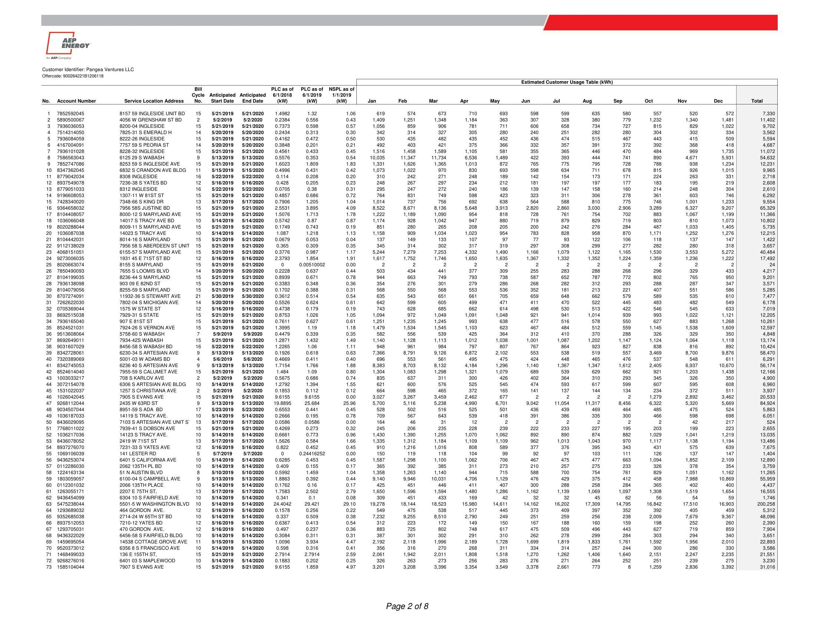

# Attachment A-1: Product and Pricing Summary 

Customer Identifier
Utility/EDC
No. of Service Location(s)

Pangea Ventures LLC
ComEd - IL
520

## Offer Information

Offer Generation Date
Offer Expiration Time
Billing Method
Days to Pay
Product Name
Earlest Anticipated Start Date**
Term
"Reference pg. 2 for Service Location-specific Anticipated Start Date(s)

Pangea Ventures LLC
ComEd - IL
520

## Pricing Details

## Energy Price

| 0.04243 |
| :-- | :-- |

## Pricing Notes

| Pricing Notes |  |
| :--: | :--: |
| Pricing |  |
| $\checkmark$ Energy | Included in Energy Price |
| $\checkmark$ Capacity | Included in Energy Price |
| $\checkmark$ Transmission | Included in Energy Price |
| $\checkmark$ Energy Losses | Included in Energy Price |
| $\checkmark$ Ancillaries | Included in Energy Price |
| $\checkmark$ RPS | Included in Energy Price |

## Additional Terms

Applicable only to the Service Location(s) served under this Attachment A-1.
The General Terms and Conditions and Exhibit A most recently executed between the parties on or prior to the date hereof are hereby incorporated herein by reference and become a part of, and govern, this Attachment A-1. The pricing on this Attachment A-1 does not include any EDC or otherwise non-bypassable charge or any applicable (and not expressly included) tax.

Pangea Ventures LLC
AEP Energy, Inc.

Customer Signature

Name (Print)

Title

Date

Signature
Scott D. Silsher

## Name

Chief Solutions Officer

Title

Date

The image is a photo of a detailed table titled "Estimated Customer Usage Table (kWh)." It contains multiple columns and rows with data related to energy usage. Key elements include:

- **Columns**: 
  - No.
  - Account Number
  - Service Location Address
  - Bill Type
  - Anticipated Start Date
  - Anticipated End Date
  - PLC as of 6/1/2019 (kW)
  - PLC as of 6/1/2020 (kW)
  - NSPL as of 6/1/2019 (kW)
  - Monthly columns from Jan to Dec
  - Total

- **Rows**: Each row corresponds to a different account with specific data for each column.

- **Header**: Includes the company logo "AP Energy" and customer identifier "Pangea Ventures LLC."

- **Footer**: Indicates "Page 2 of 8."

The table is densely packed with numerical data, showing monthly energy usage in kilowatt-hours (kWh) for various accounts.

| 74 | 8510204638 | 6200.64 S RULWARLE L ST | 9 | 8/13/2016 | 8/13/2020 | 1.0112 | 0.84 | 0.49 | 720 | 664 | 561 | 405 | 339 | 301 | 318 | 321 | 348 | 391 | 495 | 583 | 5.447 |
| --: | --: | --: | --: | --: | --: | --: | --: | --: | --: | --: | --: | --: | --: | --: | --: | --: | --: | --: | --: | --: | --: |
| 75 | 1822211046 | 1125 W UTTIH ST BD | 10 | 8/14/2016 | 8/14/2020 | 1.2049 | 1.2049 | 0.45 | 605 | 608 | 548 | 327 | 292 | 252 | 239 | 242 | 242 | 306 | 432 | 544 | 5.345 |
| 76 | 262093518 | 6400.92 S RULWARLE L H | 10 | 8/14/2016 | 8/14/2020 | 0.3098 | 0.229 | 0.25 | 484 | 398 | 357 | 335 | 341 | 306 | 313 | 318 | 301 | 354 | 305 | 293 | 4.096 |
| 77 | 1708537036 | 14100 S TRACC AVE | 10 | 8/14/2016 | 8/14/2020 | 0.1908 | 0.389 | 0.39 | 339 | 346 | 376 | 378 | 358 | 228 | 282 | 310 | 288 | 313 | 330 | 347 | 3.894 |
| 78 | 8342637083 | 6238.44 S RICOTENN AVE BLD | 9 | 8/13/2016 | 8/13/2020 | 0.7029 | 0.997 | 0.90 | 651 | 589 | 613 | 621 | 655 | 593 | 624 | 635 | 645 | 655 | 615 | 641 | 7.570 |
| 79 | 1712620048 | 101 MEMORIA L SN | 11 | 8/16/2016 | 8/16/2020 | 0.5592 | 0.316 | 0.10 | 191 | 179 | 171 | 156 | 115 | 111 | 126 | 147 | 160 | 155 | 186 | 200 | 1.895 |
| 80 | 8762248080 | 6210 S WHIPPLE ST I | 9 | 8/13/2016 | 8/13/2020 | 1.5521 | 1.765 | 1.74 | 762 | 597 | 598 | 792 | 919 | 829 | 1,006 | 1,158 | 1,046 | 925 | 950 | 981 | 10.636 |
| 81 | 1893253071 | 308 ELDABETH ST | 12 | 8/16/2016 | 8/16/2020 | 0.1456 | 0.146 | 0.10 | 259 | 240 | 247 | 219 | 191 | 133 | 133 | 145 | 150 | 267 | 304 | 301 | 2.587 |
| 82 | 12927 S-DESID | 12507 S-DESID | 8 | 8/13/2016 | 8/16/2020 | 0.213 | 0.358 | 0.25 | 553 | 532 | 429 | 365 | 347 | 271 | 407 | 444 | 454 | 505 | 524 | 458 | 5.330 |
| 83 | 2588026540 | 805 E DREXIS.. SQ | 11 | 8/23/2016 | 8/23/2020 | 0.4067 | 0.371 | 0.34 | 191 | 151 | 162 | 158 | 147 | 146 | 154 | 172 | 178 | 193 | 187 | 200 | 2.053 |
| 84 | 3811575553 | 2618 N-LARAME AVE BD | 12 | 8/16/2016 | 8/16/2020 | 0.2745 | 0.202 | 0.21 | 329 | 281 | 293 | 295 | 264 | 237 | 237 | 239 | 219 | 257 | 250 | 294 | 3.223 |
| 85 | 3980009098 | 391 FORDST BLV D | 5 | 8/7/2016 | 8/7/2020 | 0 | 0.32257502 | 0.00 | 196 | 173 | 169 | 147 | 137 | 123 | 131 | 145 | 145 | 24 | 21 | 22 | 1.433 |
| 86 | 3911887644 | 2618 N-LARAME AVE BD | 12 | 8/16/2016 | 8/16/2020 | 0.6194 | 1.028 | 1.02 | 67 | 9 | 14 | 9 | 21 | 150 | 272 | 297 | 168 | 77 | 54 | 103 | 1.205 |
| 87 | 3422020043 | 310 NMEMARO AVE BLDG | 11 | 8/15/2016 | 8/15/2020 | 0.5231 | 0.5231 | 0.59 | 533 | 494 | 479 | 441 | 489 | 419 | 424 | 460 | 442 | 510 | 516 | 517 | 5.726 |
| 88 | 3907204031 | 1633 HARMON AVE | 12 | 8/16/2016 | 8/16/2020 | 0.5479 | 0.05 | 0.05 | 62 | 59 | 63 | 63 | 61 | 47 | 58 | 62 | 52 | 66 | 68 | 67 |
| 89 | 3881078078 | 2618 N-LARAME AVE | 20 | 8/26/2016 | 8/26/2020 | 1.13 | 0.622 | 0.61 | 1,254 | 960 | 1,079 | 1,098 | 1,021 | 887 | 868 | 976 | 896 | 950 | 931 | 1,192 | 12.227 |
| 90 | 3222446129 | 12-18 N-LECLARIE AVE | 4 | 8/6/2016 | 8/6/2020 | 0.6249 | 2.626 | 3.08 | 3,970 | 3,853 | 3,612 | 3,449 | 3,540 | 902 | 918 | 933 | 894 | 2,248 | 2,760 | 2,933 | 28.113 |
| 91 | 3709449358 | 1685 S7ATE ST PN | 12 | 8/16/2016 | 8/16/2020 | 0.8929 | 0.358 | 0.37 | 872 | 725 | 753 | 743 | 639 | 485 | 505 | 511 | 461 | 606 | 630 | 722 | 7.849 |
| 92 | 3222594080 | 107-13 N-LARAME AVE | 5 | 8/7/2016 | 8/7/2020 | 1.0774 | 1.0774 | 0.90 | 1,612 | 1,441 | 852 | 707 | 758 | 661 | 670 | 517 | 418 | 475 | 947 | 1,885 | 10.941 |
| 93 | 3769278559 | 5658 S-PILONA | 7 | 8/6/2016 | 8/6/2020 | 0.1417 | 0.556 | 0.06 | 150 | 146 | 103 | 111 | 111 | 92 | 72 | 62 | 62 | 73 | 89 | 1.132 |
| 94 | 3307150187 | 5511 W COPICONAN PL | 10 | 8/14/2016 | 8/14/2020 | 0.3347 | 0.3347 | 0.00 | 27 | 41 | 52 | 46 | 34 | 10 | 2 | 2 | 2 | 2 | 2 | 2 | 221 |
| 95 | 1027163538 | 5800 S-ARTESIAN AVE UNIT BI | 6 | 8/10/2016 | 8/10/2020 | 0.367 | 0.16 | 0.16 | 683 | 1,105 | 1,714 | 866 | 360 | 219 | 256 | 269 | 296 | 374 | 533 | 612 | 7.327 |
| 96 | 5307484041 | 50-62 N-LARAME AVE | 4 | 8/6/2016 | 8/6/2020 | 1.3187 | 1.3187 | 0.52 | 375 | 426 | 359 | 843 | 206 | 208 | 103 | 239 | 253 | 293 | 436 | 749 | 4.490 |
| 97 | 104 509301037 | 7358 S-BLACKSTONIC AVE | 12 | 8/16/2016 | 8/16/2020 | 0.3403 | 0.411 | 0.41 | 418 | 327 | 352 | 326 | 292 | 241 | 298 | 318 | 274 | 358 | 355 | 388 | 3.857 |
| 98 | 5476236641 | 5509-17 WASHINGTON BD | 10 | 8/14/2016 | 8/14/2020 | 26.3592 | 11.077 | 11.64 | 10,559 | 13,642 | 14,296 | 9,222 | 5,791 | 5,335 | 8,036 | 6,237 | 5,027 | 4,528 | 4,181 | 4,367 | 89.219 |
| 99 | 5409405547 | 6854 W E.CALLARET AVE | 11 | 8/15/2016 | 8/15/2020 | 1.4235 | 1.786 | 1.54 | 4,939 | 3,969 | 3,448 | 2,766 | 2,889 | 1,151 | 818 | 749 | 667 | 550 | 1,803 | 4,512 | 27.162 |
| 100 | 5475755040 | W COPICONAN PL | 10 | 8/14/2016 | 8/14/2020 | 0.7082 | 1.7082 | 0.76 | 1,152 | 1,188 | 1,026 | 894 | 953 | 702 | 715 | 798 | 764 | 918 | 1,131 | 1,030 | 11.269 |
| 101 | 5558200049 | 345-99 S-TOKE ST | 11 | 8/17/2016 | 8/17/2020 | 0.3042 | 0.313 | 0.66 | 244 | 187 | 167 | 147 | 190 | 239 | 304 | 265 | 280 | 301 | 293 | 300 | 2.817 |
| 102 | 5558032026 | 330-44 N-PWE | 5 | 8/7/2016 | 8/7/2020 | 2.9029 | 1.271 | 1.42 | 3,609 | 3,015 | 2,028 | 1,660 | 1,149 | 1,525 | 1,063 | 806 | 803 | 1,455 | 1,822 | 1,710 | 20.847 |
| 103 | 5285190026 | 7356-58 S-SOINTJASITED AVE | 12 | 8/16/2016 | 8/16/2020 | 0.3785 | 0.456 | 0.46 | 3,545 | 5,350 | 5,381 | 3,469 | 3,461 | 672 | 591 | 346 | 432 | 1,188 | 2,689 | 3,354 | 28.408 |
| 104 | 5638311039 | 721 S-ST-LOUIS AVE | 2 | 8/2/2016 | 8/2/2020 | 0.2209 | 1.8 | 2.34 | 3,594 | 5,426 | 3,289 | 3,041 | 2,667 | 2,142 | 1,295 | 1,164 | 1,162 | 1,685 | 2,315 | 3,160 | 28.940 |
| 105 | 5051034074 | 729 N-COFFINA.. AVE, BLDG | 1 | 8/1/2016 | 8/1/2020 | 0.4456 | 0.509 | 0.55 | 117 | 593 | 613 | 575 | 589 | 495 | 493 | 546 | 513 | 588 | 655 | 669 | 7.347 |
| 106 | 5607694558 | 7057 W E-PHINOLTON AVE | 11 | 8/15/2016 | 8/15/2020 | 0.4336 | 0.297 | 0.27 | 547 | 476 | 464 | 423 | 388 | 334 | 358 | 425 | 412 | 492 | 485 | 505 | 5.288 |
| 107 | 5051405020 | 2157-57 S-CENTINA, PARA UN | 1 | 8/1/2016 | 8/1/2020 | 0.2653 | 0.173 | 0.18 | 844 | 594 | 220 | 195 | 318 | 292 | 119 | 129 | 125 | 146 | 167 | 284 | 3.433 |
| 108 | 5036354035 | 7400-02 PHECEEL | 1 | 8/16/2016 | 8/16/2020 | 0.6201 | 0.741 | 0.86 | 1,009 | 830 | 885 | 800 | 712 | 602 | 687 | 669 | 626 | 752 | 786 | 1,004 | 9.432 |
| 109 | 6069905036 | 702-10 N-MALLER AVE | 6 | 8/6/2016 | 8/6/2020 | 0.156 | 0.163 | 0.17 | 173 | 140 | 150 | 137 | 139 | 122 | 128 | 126 | 123 | 131 | 139 | 148 | 1.856 |
| 110 | 5071225531 | 7049 S3 ST-LAMRONZ AVE | 11 | 8/15/2016 | 8/15/2020 | 0.18 | 0.152 | 0.17 | 1,344 | 1,429 | 1,446 | 1,195 | 1,265 | 273 | 300 | 287 | 293 | 318 | 425 | 1,518 | 11.162 |
| 111 | 5060708085 | 5749-51 W CHICAIGO AVE | 6 | 8/6/2016 | 8/6/2020 | 0.2831 | 0.029 | 0.03 | 430 | 323 | 286 | 241 | 102 | 51 | 87 | 90 | 74 | 85 | 211 | 298 | 2.277 |
| 112 | 5663087134 | 7055-57 S-ST-LARARONZE AVE | 11 | 8/15/2016 | 8/15/2020 | 0.222 | 0.319 | 0.29 | 3,428 | 5,628 | 6,108 | 5,109 | 4,203 | 1,215 | 288 | 279 | 356 | 331 | 1,832 | 2,538 | 31.261 |
| 113 | 6065190035 | 751-53 N-MENAPO AVE | 6 | 8/6/2016 | 8/6/2020 | 0.1298 | 0.213 | 0.21 | 456 | 398 | 366 | 291 | 193 | 173 | 168 | 186 | 168 | 182 | 274 | 278 | 3.133 |
| 114 | 5364048584 | 6618 S-ARAAGH AVE UNIT H | 10 | 8/14/2016 | 8/14/2020 | 0.5321 | 0.016 | 0.02 | 206 | 176 | 187 | 170 | 146 | 75 | 84 | 52 | 50 | 136 | 169 | 183 | 1.611 |
| 115 | 6080259049 | 404 SOACOL ST | 12 | 8/16/2016 | 8/16/2020 | 0.8363 | 0.508 | 0.51 | 987 | 1,024 | 923 | 702 | 563 | 390 | 455 | 484 | 451 | 502 | 801 | 948 | 8.229 |
| 116 | 648096668 | 3501-06 W-ADAMS ST | 3 | 8/2/2016 | 8/2/2020 | 0.4481 | 7.905 | 7.09 | 26,832 | 26,261 | 26,776 | 14,727 | 4,635 | 4,366 | 4,415 | 4,260 | 2,467 | 1,774 | 9,795 | 27,855 | 154.164 |
| 117 | 6471403555 | 2150-06 S-KLDAME H | 1 | 8/1/2016 | 8/1/2020 | 0.1899 | 0.126 | 0.13 | 580 | 514 | 498 | 392 | 194 | 132 | 129 | 144 | 158 | 257 | 448 | 617 | 4.103 |
| 118 | 5477054108 | 3600-12 W-FRIMALAALS | 6 | 8/6/2016 | 8/6/2020 | 3.9792 | 2.519 | 2.99 | 3,488 | 3,188 | 2,695 | 2,448 | 1,886 | 1,355 | 1,459 | 1,360 | 1,326 | 1,416 | 1,637 | 1,953 | 24.152 |
| 119 | 6674756312 | 7748-55 S-EAST AND AVE UNF | 11 | 8/20/2016 | 8/20/2020 | 0.3112 | 0.171 | 0.25 | 302 | 349 | 330 | 276 | 271 | 193 | 189 | 195 | 225 | 287 | 281 | 270 | 3.169 |
| 120 | 252965395 | 805 E-DREXIS.. SQ | 6 | 8/6/2016 | 8/6/2020 | 2.1345 | 2.137 | 1.56 | 4,993 | 5,087 | 4,687 | 2,180 | 1,133 | 917 | 943 | 980 | 1,122 | 1,441 | 2,351 | 3,232 | 29.068 |
| 121 | 6674776022 | 3501-9 AGAMES PA 9, BLDG | 11 | 8/20/2016 | 8/20/2020 | 0.6324 | 0.308 | 0.29 | 478 | 430 | 323 | 291 | 278 | 247 | 243 | 276 | 318 | 321 | 371 | 402 | 3.977 |
| 122 | 807070632 | 801 E-DREXIS.. SQUARE | 6 | 8/6/2016 | 8/6/2020 | 0.7995 | 1.132 | 0.87 | 1,851 | 2,288 | 2,433 | 1,189 | 946 | 468 | 506 | 514 | 513 | 585 | 447 | 465 | 11.831 |
| 123 | 6730237051 | 1236-45 S-LAMRONZ AVE | 2 | 8/2/2016 | 8/2/2020 | 2.186 | 1.522 | 1.70 | 1,505 | 1,508 | 1,451 | 1,354 | 1,255 | 1,100 | 1,046 | 1,022 | 806 | 1,120 | 1,441 | 3,217 | 16.926 |
| 124 | 8417804059 | 4720-28 S-DREXIS.. BLVD | 5 | 8/7/2016 | 8/7/2020 | 2.2335 | 2.429 | 2.54 | 2,003 | 1,834 | 2,027 | 1,867 | 1,721 | 1,437 | 1,719 | 1,832 | 1,786 | 1,862 | 1,851 | 1,751 | 21.727 |
| 125 | 4615465613 | 4819 W COHTEZ ST | 14 | 8/20/2016 | 8/20/2020 | 1.5685 | 0.785 | 0.69 | 673 | 738 | 678 | 518 | 543 | 523 | 506 | 656 | 696 | 621 | 560 | 605 | 7.317 |
| 126 | 683619040 | 1012 S-2ND AVE | 12 | 8/16/2016 | 8/16/2020 | 0.7095 | 0.69 | 0.83 | 1,521 | 1,506 | 1,435 | 1,228 | 1,121 | 1,028 | 1,065 | 1,079 | 1,029 | 1,182 | 1,287 | 1,383 | 14.841 |
| 127 | 6505111016 | 12325-22528 | 5040-42 W QUMOY ST | 12 | 8/16/2016 | 8/16/2020 | 1.8892 | 0.634 | 0.69 | 1,086 | 949 | 1,085 | 1,269 | 825 | 918 | 918 | 895 | 879 | 859 | 1,109 | 1,057 | 11.928 |
| 128 | 5447707552 | 5401 W U-DEFINIE ST | 8 | 8/10/2016 | 8/10/2020 | 0.5831 | 0.299 | 0.56 | 12.792 | 13.605 | 5,797 | 11,412 | 8,769 | 5,929 | 4,743 | 2,910 | 765 | 472 | 5,233 | 10,842 | 90.459 |
| 129 | 38561861874 | 715-5 S-TLOUIS AVE | 2 | 8/2/2016 | 8/2/2020 | 0.3287 | 0.693 | 0.72 | 1,138 | 1,179 | 1,318 | 826 | 361 | 319 | 286 | 279 | 245 | 353 | 715 | 1,096 | 8.115 |
| 130 | 38562201885 | 1257 59 S-KLDAME AVE | 2 | 8/2/2016 | 8/2/2020 | 0.1508 | 0.152 | 0.18 | 583 | 548 | 513 | 467 | 429 | 421 | 331 | 289 | 287 | 315 | 354 | 374 | 5.154 |
| 131 | 7320507521 | 5036-38 W QUMOY BD | 4 | 8/6/2016 | 8/6/2020 | 0.5592 | 0.494 | 0.54 | 2,262 | 1,851 | 1,861 | 1,849 | 1,080 | 530 | 933 | 718 | 508 | 296 | 1,572 | 1,501 | 15.761 |
| 132 | 6569006530 | 327-28 S-CENTINA, PARA AVE | 3 | 8/2/2016 | 8/2/2020 | 0.5752 | 2.713 | 2.23 | 7,370 | 7,178 | 7,196 | 5,286 | 3,389 | 2,831 | 2,185 | 2,121 | 2,388 | 2,650 | 5,198 | 7,256 | 55.875 |
| 133 | 7320522528 | 5040-42 W QUMOY ST | 4 | 8/6/2016 | 8/6/2020 | 0.6221 | 0.662 | 0.69 | 2,964 | 3,069 | 3,138 | 2,488 | 481 | 446 | 401 | 440 | 584 | 1,303 | 1,880 | 1,929 | 19.123 |
| 134 | 6310292543 | 1248 S-FAVPOLD | 2 | 8/2/2016 | 8/2/2020 | 0.7895 | 1.45 | 1.89 | 5,828 | 5,477 | 4,778 | 5,358 | 3,818 | 1,619 | 1,162 | 1,074 | 1,109 | 1,127 | 1,671 | 2,696 | 4,487 | 37.847 |
| 135 | 7332813552 | 1606 N KWATON AVE, BLDG | 6 | 8/13/2016 | 8/13/2020 | 0 | 0.00403752 | 0.00 | 2 | 2 | 2 | 2 | 2 | 2 | 2 | 2 | 2 | 2 | 2 | 2 | 2 | 2 | 2 | 2 |
| 136 | 5723557518 | 819-21 S-INDIFENDEINCE BLV | 2 | 8/2/2016 | 8/2/2020 | 0.2344 | 0.885 | 0.75 | 890 | 1,078 | 481 | 118 | 200 | 276 | 415 | 433 | 314 | 209 | 242 | 629 | 545 | 588 | 259 |
| 137 | 7404111027 | 4-12 S-LEAMRADTON BD | 6 | 8/6/2016 | 8/6/2020 | 0.1544 | 0.228 | 0.21 | 140 | 225 | 322 | 262 | 225 | 219 | 211 | 245 | 249 | 349 | 403 | 302 | 302 | 2.151 | 258 |
| 138 | 6962231065 | 1257 59 S-KLDAME AVE | 2 | 8/2/2016 | 8/2/2020 | 0.1626 | 0.152 | 0.18 | 583 | 168 | 513 | 467 | 429 | 421 | 321 | 289 | 287 | 315 | 354 | 354 | 318 | 3.154 |
| 139 | 7404128037 | 16-05 S-LEAMRADTON AVE | 2 | 8/2/2016 | 8/2/2020 | 0.694 | 0.8941 | 0.80 | 978 | 1,024 | 737 | 556 | 344 | 300 | 297 | 317 | 309 | 354 | 583 | 825 | 625 | 6.924 |
| 140 | 74009295502 | 1800-49 S-KLDAME AVE | 1 | 8/1/2016 | 8/2/2020 | 0.5752 | 0.718 | 1.709 | 2.95 | 3,006 | 2,798 | 2,916 | 2,838 | 2,099 | 2,520 | 965 | 415 | 400 | 479 | 527 | 1.501 | 15.761 |
| 141 | 7404542650 | 225-28 S-DEFININC | 1 | 8/1/2016 | 8/2/2020 | 0.6321 | 0.718 | 0.253 | 5.27 | 1,113 | 1,128 | 1,103 | 7,190 | 2,286 | 3,389 | 2,831 | 2,193 | 2,121 | 2,092 | 2,650 | 5,198 | 7,258 |
| 142 | 7305523528 | 5040-42 W QUMOY ST | 2 | 8/2/2016 | 8/2/2020 | 0.1148 | 0.253 | 0.27 | 1,113 | 1,128 | 1,103 | 1,108 | 1,103 | 1,108 | 2,650 | 2,253 | 2,145 | 2,202 | 2,002 | 2,203 | 3,603 | 38.578 |
| 143 | 73055935510 | 715-5 S-TLOUUS AVE | 2 | 8/2/2016 | 8/2/2020 | 0.1337 | 0.853 | 4.23 | 5.370 | 3,243 | 3,444 | 3,359 | 3,656 | 3,079 | 2,121 | 1,930 | 1,907 | 2,476 | 2,570 | 3,603 | 3,820 | 34.767 |
| 144 | 6310292543 | 12-5 S-DEFININC | 2 | 8/2/2016 | 8/2/2020 | 0.1626 | 0.245 | 2.828 | 5.474 | 3,358 | 3,656 | 3,618 | 3,188 | 2,183 | 1,820 | 1,610 | 2,255 | 2,220 | 2,424 | 2,350 | 3,570 | 3,620 | 34.767 |
| 145 | 7320819555 | 10-5 S-DEFININC | 2 | 8/2/2016 | 8/2/2020 | 0.1626 | 0.245 | 2.828 | 5.474 | 3,358 | 2,428 | 2,258 | 2,188 | 2,188 | 1,188 | 1,160 | 2,120 | 2,180 | 2,424 | 2,500 | 3,570 | 4.250 |

| 163 | 7451085507 | 7741 S | N.CRNA-L | AVE\#4S | 21 | 0.003019 | 0.503020 | 0.3585 | 0.437 | 0.94 | 1.341 | 1.189 | 1.208 | 1.111 | 939 | 672 | 747 | 830 | 826 | 1.073 | 1.154 | 1.260 | 12.351 |
| :--: | :--: | :--: | :--: | :--: | :--: | :--: | :--: | :--: | :--: | :--: | :--: | :--: | :--: | :--: | :--: | :--: | :--: | :--: | :--: | :--: | :--: | :--: |
| 164 | 1903125143 | 3108 W | POLA ST | 2 | 0.03316 | 0.03520 | 0.0487 | 0.04 | 0.04 | 31 | 28 | 32 | 30 | 31 | 29 | 35 | 30 | 27 | 31 | 27 | 16 | 347 |
| 165 | 748843045 | 5326-30 W | HARRISON ST | 2 | 0.03519 | 0.03520 | 1.6255 | 0.558 | 0.56 | 689 | 606 | 668 | 595 | 560 | 546 | 570 | 617 | 597 | 661 | 683 | 726 | 7.643 |
| 166 | 0471054127 | 1224 S | TROY ST | 2 | 0.03519 | 0.03520 | 0 | 0.00573752 | 0.00 | 21 | 20 | 6 | 2 | 2 | 2 | 3 | 2 | 3 | 6 | 2 | 2 | 71 |
| 167 | 7514372098 | 7812-14 S | EINSTALS AVE | 14 | 0.003019 | 0.503020 | 0.9245 | 0.117 | 0.24 | 540 | 535 | 401 | 286 | 332 | 331 | 384 | 318 | 186 | 252 | 318 | 400 | 4.283 |
| 168 | 614946690 | 5959-69 W | MORRAY PARA | 6 | 0.03519 | 0.03520 | 1.8112 | 4.611 | 5.06 | 14,017 | 13,199 | 11,389 | 4,923 | 2,740 | 2,125 | 2,005 | 1,820 | 1,728 | 2,197 | 9,726 | 15,853 | 81.719 |
| 169 | 7529190026 | 7542 S | N.CRNA-L | AVE\#4S | 0.03520 | 0.3106 | 0.363 | 0.28 | 2.104 | 1.947 | 2,080 | 1,994 | 872 | 173 | 163 | 153 | 170 | 196 | 470 | 1,283 | 11.660 |
| 170 | 6233526541 | 703-11 N | AUSTA KAS | 6 | 0.03519 | 0.03520 | 0.3952 | 1.362 | 1.42 | 2,785 | 2,307 | 1,908 | 1,595 | 248 | 1,152 | 1,158 | 1,169 | 1,047 | 1,263 | 1,838 | 3.289 | 26.761 |
| 171 | 757294646 | S.LOTUS | 4 | 0.03519 | 0.03520 | 0.791 | 0.91 | 1.01 | 796 | 72 | 656 | 618 | 582 | 619 | 711 | 708 | 670 | 727 | 652 | 668 | 8.081 |
| 172 | 6233134039 | 737-47 N | AUSTA KAS | 6 | 0.03519 | 0.03520 | 1.6668 | 0.929 | 1.06 | 2,101 | 2,196 | 2,167 | 2,067 | 1,826 | 878 | 783 | 812 | 796 | 934 | 1,585 | 2,001 | 18.106 |
| 173 | 7596075032 | 6125 S | NIAKAS AVE | 13 | 0.173019 | 0.173020 | 1.096 | 0.665 | 0.65 | 1,255 | 1,183 | 1,296 | 1,247 | 1,109 | 950 | 670 | 471 | 500 | 945 | 1,231 | 1,153 | 12.269 |
| 174 | 5981675557 | 729 N | CENTRA | AVE | 6 | 0.03519 | 0.03520 | 0.3983 | 1.221 | 1.42 | 1,781 | 1,671 | 1,572 | 1,450 | 956 | 648 | 601 | 664 | 656 | 925 | 1,610 | 1,695 | 14.210 |
| 175 | 7656090128 | 5556-64 W | JACKSON | 4 | 0.03519 | 0.03520 | 0.398 | 0.3988 | 0.34 | 418 | 441 | 495 | 468 | 435 | 354 | 327 | 318 | 299 | 323 | 315 | 4.549 |
| 182 | 7740292547 | 13 S | AUSTA KAS | 12 | 0.163019 | 0.163020 | 1.6165 | 7.583 | 7.25 | 9,676 | 11,266 | 10,427 | 8,946 | 7,129 | 4,972 | 3,996 | 4,325 | 5,870 | 8,077 | 83.945 |
| 183 | 7852183073 | 7949-55 S | a-a-AAS_ BLOG | 10 | 0.213019 | 0.213020 | 1.6791 | 1.0791 | 0.41 | 4,994 | 6,244 | 4,337 | 1,044 | 332 | 283 | 228 | 223 | 235 | 395 | 2,916 | 5,212 | 26.444 |
| 184 | 1983038143 | 17 S | AASTAK BLOG | 17 | 0.163019 | 0.163020 | 0.0034 | 0.426 | 10.44 | 1,755 | 1,481 | 1,632 | 1,618 | 1,865 | 2,400 | 2,834 | 2,737 | 3,185 | 1,602 | 1,601 | 1,657 | 23.347 |
| 185 | 7898377015 | 8253 S | AIGLESSOL | AVE\#4S | 17 | 0.223019 | 0.223020 | 1.0226 | 0.514 | 0.52 | 614 | 660 | 746 | 728 | 561 | 432 | 451 | 469 | 448 | 555 | 571 | 578 | 8.834 |
| 186 | 2775597144 | 15 S | AASTAK BLOG | UNT STO | 17 | 0.163019 | 0.163020 | 0 | 0.00403752 | 0.00 | 2 | 2 | 2 | 2 | 2 | 2 | 2 | 2 | 2 | 2 | 2 | 24 |
| 187 | 7632273032 | 20 W | TING ST | 13 | 0.173019 | 0.173020 | 0.4329 | 0.232 | 0.28 | 614 | 627 | 577 | 473 | 368 | 287 | 309 | 271 | 208 | 284 | 471 | 569 | 5.056 |
| 188 | 7740219011 | 9 S | AUSTA KAS | 12 | 0.163019 | 0.163020 | 0 | 0.00403752 | 0.00 | 2 | 2 | 2 | 2 | 2 | 2 | 2 | 2 | 2 | 2 | 2 | 24 |
| 189 | 7604076032 | 1030 E | ATTH ST | 14 | 0.003019 | 0.003020 | 0.8817 | 0.724 | 0.76 | 872 | 814 | 816 | 763 | 767 | 716 | 783 | 796 | 724 | 782 | 784 | 830 | 9.446 |
| 190 | 6149143524 | 647-57 N | MAYFIELD | 6 | 0.03519 | 0.03520 | 0.007 | 0.296 | 0.25 | 319 | 280 | 233 | 151 | 186 | 188 | 207 | 198 | 156 | 188 | 303 | 2.817 |
| 200 | 6233219037 | 6949 W | SUPRION ST | 6 | 0.03519 | 0.03520 | 0.004 | 0.3966 | 0.34 | 418 | 441 | 495 | 456 | 393 | 350 | 302 | 303 | 304 | 529 | 573 | 7.146 |
| 192 | 3395024088 | 310 N | MENARO AVE | 5 | 0.073019 | 0.073020 | 2.8824 | 6.086 | 4.27 | 7,422 | 7,395 | 7,392 | 6,550 | 4,817 | 3,084 | 2,999 | 2,796 | 2,925 | 2,928 | 3,898 | 7.172 |
| 193 | 604833018 | 1516-20 W | TETH ST | 14 | 0.003019 | 0.003020 | 0.5557 | 0.92 | 0.56 | 320 | 292 | 282 | 247 | 237 | 209 | 221 | 240 | 254 | 243 | 216 | 267 | 2.997 |
| 194 | 3753077541 | 5956 W | NORTH AVE | 10 | 0.143019 | 0.143020 | 0.6234 | 0.641 | 0.97 | 757 | 682 | 661 | 640 | 862 | 639 | 540 | 588 | 582 | 722 | 723 | 784 | 8.180 |
| 195 | 7934831554 | 02 S | ASALAND AVE | 14 | 0.003019 | 0.003020 | 0.8189 | 0.925 | 0.63 | 602 | 614 | 558 | 511 | 454 | 386 | 401 | 449 | 390 | 300 | 332 | 468 | 5.463 |
| 196 | 3809408027 | 5956 W | NORTH AVE | UNT STO | 17 | 0.143019 | 0.143020 | 0 | 0.00403752 | 0.00 | 2 | 2 | 2 | 2 | 2 | 2 | 2 | 2 | 2 | 2 | 24 |
| 197 | 6018390015 | 7756 S | NARSHFUZ AVE | 14 | 0.003019 | 0.003020 | 0.6234 | 0.423 | 0.33 | 588 | 588 | 529 | 404 | 264 | 197 | 193 | 201 | 212 | 283 | 448 | 563 | 4.470 |
| 198 | 4848175538 | 1613 N | AUSTN | 10 | 0.143019 | 0.143020 | 0 | 0.00403752 | 0.00 | 2 | 2 | 2 | 2 | 2 | 2 | 2 | 2 | 2 | 2 | 2 | 24 |
| 199 | 8087125096 | 7034-36 S | GLARIACM7 AVE | 12 | 0.163019 | 0.163020 | 0.0271 | 0.296 | 0.25 | 319 | 280 | 233 | 151 | 186 | 188 | 207 | 198 | 156 | 188 | 303 | 2.817 |
| 200 | 6233219037 | 6949 W | SUPRION ST | 6 | 0.03519 | 0.03520 | 0.0044 | 0.84 | 0.93 | 636 | 589 | 593 | 578 | 588 | 528 | 532 | 528 | 525 | 574 | 579 | 578 | 6.839 |
| 201 | 6188414091 | 755 S | B313019 | 0.013020 | 0.7143 | 0.858 | 0.85 | 382 | 31 | 375 | 339 | 361 | 336 | 341 | 361 | 359 | 371 | 360 | 387 | 4.352 |
| 202 | 6233220030 | 5952-58 W | SUPREROF | 6 | 0.03519 | 0.03520 | 2.5876 | 3.677 | 3.22 | 3,240 | 3,098 | 3,264 | 2,998 | 2,794 | 1,874 | 2,646 | 2,917 | 2,806 | 2,967 | 2.957 | 3.025 |
| 203 | 6244007029 | 6618 S | NARANJIANJCAVIT H | 10 | 0.143019 | 0.143020 | 0.6115 | 0.023 | 0.02 | 303 | 268 | 267 | 257 | 279 | 133 | 79 | 76 | 78 | 220 | 263 | 2.515 |
| 204 | 5642006554 | 5732-4 W | NARJANIJTCN BLVO | 5 | 0.073019 | 0.073020 | 0.4568 | 0.638 | 0.52 | 11,174 | 10,876 | 11,136 | 9,893 | 6,649 | 731 | 389 | 399 | 410 | 729 | 8.526 | 11.696 |
| 205 | 6446631025 | 8901 S | COTTARLJ DROVE AVE | 17 | 0.033019 | 0.033020 | 0.1986 | 0.006 | 0.03 | 341 | 338 | 396 | 228 | 77 | 57 | 70 | 76 | 72 | 116 | 202 | 344 | 2.305 |
| 206 | 9439176051 | 212-26 S | 007H PL BLOG | 11 | 0.153019 | 0.153020 | 0.9745 | 0.009 | 0.01 | 286 | 288 | 166 | 80 | 13 | 9 | 12 | 12 | 84 | 10 | 1200 | 1.030 |
| 212 | 7613255036 | 222-34 W | 100TH ST | 20 | 0.093019 | 0.093020 | 0.9305 | 0.699 | 0.78 | 1,110 | 873 | 905 | 849 | 714 | 586 | 663 | 656 | 598 | 627 | 619 | 953 | 8.953 |
| 213 | 7607111019 | 5047-48 S | 12 AMEWOL | 5 | 0.073019 | 0.073020 | 2.1357 | 1.171 | 1.11 | 2,285 | 2,237 | 1,684 | 1,455 | 1,160 | 942 | 604 | 681 | 604 | 797 | 2,189 | 1,147 | 16.133 |
| 214 | 7613172032 | 234-36 S | 100TH ST | 20 | 0.093019 | 0.093020 | 0.3519 | 0.399 | 0.52 | 459 | 362 | 405 | 382 | 384 | 395 | 504 | 436 | 351 | 445 | 437 | 570 | 5.129 |
| 215 | 6900774552 | 6923-25 S | NONWA AVE | 20 | 0.093019 | 0.093020 | 1.6854 | 1.644 | 1.28 | 1,732 | 1,356 | 1,453 | 1,506 | 1,190 | 742 | 590 | 746 | 678 | 599 | 746 | 1,240 | 12.577 |
| 216 | 6725816182 | 6125 E | 12 STAES | 5 | 0.073019 | 0.073020 | 1.1028 | 1.1028 | 0.72 | 1,142 | 1,181 | 1,053 | 778 | 485 | 647 | 585 | 493 | 562 | 750 | 696 | 1,072 | 9.441 |
| 218 | 6041001039 | 11111 S | VERMON AVE | 20 | 0.093019 | 0.093020 | 1.2707 | 1.487 | 1.87 | 3,022 | 3,079 | 3,105 | 2,728 | 2,572 | 2,051 | 1,396 | 1,420 | 1,328 | 1,633 | 2,198 | 2,864 | 27.385 |
| 219 | 6007762552 | 5046 S | CHAMPSAN AVE | 5 | 0.073019 | 0.073020 | 0.7925 | 0.569 | 0.69 | 1,186 | 1,166 | 1,148 | 845 | 733 | 718 | 777 | 617 | 596 | 726 | 711 | 94 | 9.988 |
| 220 | 4129149035 | 13390 S | NIDAKA AVE | 5 | 0.083019 | 0.083020 | 0.2848 | 0.592 | 0.86 | 1,238 | 1,161 | 1,103 | 455 | 533 | 500 | 459 | 516 | 537 | 847 | 1,114 | 1,214 | 9.677 |
| 221 | 5980171015 | 5032-34 S | E1. AARRENCE | 5 | 0.073019 | 0.073020 | 0.7844 | 0.534 | 0.61 | 1,244 | 1,1200 | 1,067 | 864 | 765 | 513 | 457 | 434 | 505 | 713 | 826 | 912 | 9.487 |
| 222 | 9316016628 | 157 S | 130RD ST | 21 | 0.093019 | 0.093020 | 0.6442 | 3.046 | 3.31 | 19,941 | 19,174 | 16,105 | 11,874 | 6,896 | 3,852 | 3,358 | 3,563 | 3,559 | 4,741 | 6,142 | 9,084 | 107.089 |
| 223 | 8524437105 | 8040-42 S | VERMON AVE | 15 | 0.013019 | 0.013020 | 0.6564 | 0.308 | 0.34 | 468 | 363 | 384 | 305 | 360 | 346 | 288 | 357 | 328 | 363 | 360 | 360 | 4,548 |
| 224 | 3034100521 | 9047-27 S | MUNESLOA AVE | 17 | 0.033019 | 0.033020 | 0.4254 | 0.308 | 0.34 | 468 | 363 | 384 | 305 | 360 | 346 | 288 | 357 | 328 | 363 | 360 | 360 | 4,548 |
| 225 | 8030140519 | 8857 S | COTTARLJ DROVE AVE | 17 | 0.033019 | 0.033020 | 0.4264 | 0.213 | 0.23 | 398 | 808 | 284 | 131 | 158 | 186 | 186 | 196 | 182 | 213 | 210 | 212 | 3,167 |
| 226 | 7858534610 | 9043 S | CUNMAR | 17 | 0.033019 | 0.033020 | 0.8397 | 0.823 | 0.63 | 764 | 694 | 695 | 625 | 658 | 621 | 633 | 625 | 558 | 619 | 655 | 694 | 7.840 |
| 227 | 8530288047 | 8751 S | COTTARLJ DROVE AVE | 17 | 0.033019 | 0.033020 | 0.6564 | 0.043 | 0.04 | 327 | 328 | 338 | 263 | 145 | 72 | 84 | 70 | 76 | 189 | 296 | 292 | 2.340 |
| 228 | 7774464619 | 3009 S | 87H ST | 17 | 0.033019 | 0.033020 | 0.0378 | 0.049 | 0.05 | 97 | 66 | 66 | 60 | 67 | 59 | 75 | 63 | 52 | 51 | 54 | 57 | 731 |
| 229 | 8851697042 | 6943-61 COPARLJ | AVE | 11 | 0.153019 | 0.153020 | 0.1255 | 0.125 | 0.23 | 490 | 408 | 276 | 148 | 117 | 172 | 195 | 130 | 114 | 146 | 353 | 212 | 2,803 | 3.167 |
| 230 | 9441016529 | 1748-60 W | 71ST PL | 13 | 0.173019 | 0.173020 | 0.2006 | 0.198 | 0.21 | 172 | 142 | 153 | 144 | 154 | 142 | 157 | 159 | 139 | 139 | 131 | 142 | 1.773 | 2.238 |
| 231 | 8955126018 | 8806 S | COTTARLJ DROVE AVE | 5 | 0.073019 | 0.073020 | 2.6866 | 2.6886 | 0.37 | 1,364 | 1,411 | 1,501 | 1,278 | 1,308 | 964 | 818 | 639 | 702 | 571 | 503 | 503 | 11,593 | 1.540 |
| 232 | 9357612562 | 1734 S | TIND ST | 17 | 0.163019 | 0.163020 | 0.7971 | 0.217 | 0.17 | 391 | 298 | 278 | 195 | 106 | 66 | 140 | 210 | 159 | 125 | 188 | 280 | 2.435 | 2.109 |
| 233 | 8707512584 | 12095 S | CUNMAR | 20 | 0.163019 | 0.163020 | 2.9511 | 0.599 | 1.63 | 3,309 | 3,640 | 3,659 | 2,345 | 2,464 | 797 | 656 | 678 | 647 | 1,064 | 2,539 | 3,221 | 24,238 | 3.263 |
| 234 | 835762311 | 1742 56 S | TAND ST | 12 | 0.163019 | 0.163020 | 0.6891 | 0.562 | 0.63 | 764 | 694 | 695 | 625 | 658 | 621 | 633 | 625 | 558 | 519 | 561 | 563 | 634 | 7.840 |
| 235 | 8781026522 | 2542 S | TINARICA | AVE | 1 | 0.163019 | 0.163020 | 0.3097 | 0.276 | 0.34 | 207 | 189 | 215 | 155 | 216 | 207 | 233 | 208 | 205 | 225 | 201 | 222 | 2.706 |
| 236 | 8525409035 | 1511-13 S | TSRD ST | 12 | 0.163019 | 0.163020 | 0.3783 | 0.049 | 0.05 | 97 | 66 | 66 | 60 | 67 | 59 | 75 | 63 | 52 | 51 | 54 | 57 | 731 | 7.245 |
| 237 | 8851697042 | 6943-61 COPARLJ | AVE | 11 | 0.163019 | 0.163020 | 0.1267 | 0.433 | 0.41 | 400 | 296 | 309 | 316 | 441 | 344 | 292 | 360 | 260 | 378 | 383 | 426 | 4.269 |
| 238 | 9696166087 | 2045-51 S | TSTH ST | 13 | 0.173019 | 0.173020 | 0.2096 | 0.198 | 0.21 | 172 | 142 | 153 | 144 | 154 | 142 | 157 | 159 | 139 | 139 | 131 | 142 | 1.773 | 238 |
| 239 | 8970126006 | 7615-19 COLES | 21 | 0.093019 | 0.093020 | 0.0332 | 0.565 | 0.86 | 0.84 | 978 | 654 | 796 | 524 | 490 | 470 | 474 | 514 | 551 | 637 | 805 | 831 | 7.773 | 240 |
| 240 | 9696177053 | 2051 59 S | TSTH ST | 13 | 0.173019 | 0.173020 | 0.0787 | 0.217 | 0.17 | 391 | 298 | 278 | 195 | 106 | 66 | 140 | 210 | 159 | 125 | 185 | 280 | 283 | 2.435 |
| 241 | 9021146046 | 5130 S | KING ERW SR | 12 | 0.163019 | 0.163020 | 2.9511 | 0.595 | 0.63 | 3,639 | 3,640 | 3,659 | 2,345 | 2,464 | 797 | 656 | 678 | 647 | 1,064 | 2,539 | 3,221 | 24,238 |
| 242 | 8940124058 | 2826 E | TETH-PL | 13 | 0.173019 | 0.173020 | 0.6889 | 0.725 | 0.48 | 525 | 540 | 554 | 511 | 441 | 354 | 365 | 375 | 343 | 430 | 455 | 483 | 5.379 |
| 243 | 9035776036 | 7102 S | LUNL A | AVE | 14 | 0.093019 | 0.093020 | 0.3557 | 0.2 | 0.33 | 545 | 464 | 522 | 447 | 382 | 392 | 416 | 442 | 454 | 487 | 492 | 545 |
| 244 | 9024280327 | 7751 S | SACHARIGE AVE | 13 | 0.173019 | 0.173020 | 0.499 | 0.376 | 0.41 | 864 | 997 | 1,030 | 916 | 807 | 404 | 324 | 328 | 337 | 603 | 826 | 954 | 8.391 |
| 245 | 9028451022 | 7615 S | SAFERER | 15 | 0.093019 | 0.093020 | 1.188 | 0.766 | 1.74 | 871 | 1,101 | 1,067 | 929 | 718 | 674 | 600 | 808 | 782 | 823 | 817 | 765 | 10,156 |
| 246 | 8110068569 | 2225 E | EYTH ST | 10 | 0.093019 | 0.093020 | 0.3930 | 0.749 | 1.02 | 668 | 601 | 796 | 649 | 641 | 449 | 521 | 566 | 551 | 612 | 697 | 707 | 7.635 |
| 247 | 9103216543 | 7255 S | EYTH ST | 12 | 0.093019 | 0.093020 | 0.3930 | 0.433 | 1.41 | 400 | 296 | 309 | 316 | 440 | 294 | 263 | 352 | 356 | 324 | 342 | 372 | 383 | 429 |
| 248 | 9103247547 | 701 N | LOTUS AVEA | 15 | 0.163019 | 0.163020 | 0.2655 | 0.351 | 0.31 | 845 | 756 | 660 | 486 | 395 | 352 | 358 | 372 | 398 | 483 | 712 | 936 | 483 | 712 |
| 249 | 9103247547 | 701 N | LOTUS AVEA | 16 | 0.163019 | 0.163020 | 0.3930 | 0.433 | 0.633 | 0.63 | 554 | 446 | 524 | 354 | 358 | 362 | 392 | 394 | 398 | 424 | 442 | 462 | 482 |
| 250 | 9103247542 | 701 N | LOTUS AVEA | 17 | 0.163019 | 0.163020 | 0.3930 | 0.433 | 0.633 | 0.63 | 554 | 446 | 524 | 354 | 362 | 382 | 392 | 402 | 396 | 424 | 448 | 462 | 482 |
| 251 | 9103247543 | 701 N | LOTUS AVEA | 18 | 0.163019 | 0.163020 | 0.3930 | 0.433 | 0.633 | 0.63 | 554 | 444 | 524 | 354 | 364 | 382 | 392 | 402 | 412 | 434 | 462 | 482 | 492 |
| 252 | 9103247545 | 701 N | LOTUS AVEA | 19 | 0.163019 | 0.163020 | 0.3930 | 0.433 | 0.633 | 0.63 | 554 | 444 | 524 | 364 | 382 | 392 | 402 | 412 | 424 | 448 | 462 | 482 | 502 |
| 253 | 9103247548 | 701 N | LOTUS AVEA | 20 | 0.163019 | 0.163020 | 0.3930 | 0.433 | 0.633 | 0.63 | 554 | 444 | 524 | 364 | 382 | 392 | 402 | 412 | 424 | 448 | 464 | 482 | 502 |
| 254 | 9103247549 | 701 N | LOTUS AVEA | 21 | 0.163019 | 0.163020 | 0.3930 | 0.433 | 0.633 | 0.63 | 554 | 444 | 524 | 384 | 392 | 402 | 412 | 424 | 436 | 454 | 482 | 502 | 545 |
| 255 | 9103247545 | 701 N | LOTUS AVEA | 22 | 0.163019 | 0.163020 | 0.3930 | 0.433 | 0.633 | 0.63 | 554 | 444 | 524 | 384 | 392 | 402 | 412 | 434 | 448 | 464 | 492 | 502 | 545 |
| 256 | 9103247547 | 701 N | LOTUS AVEA | 23 | 0.163019 | 0.163020 | 0.3930 | 0.433 | 0.633 | 0.63 | 554 | 444 | 524 | 384 | 392 | 402 | 412 | 424 | 434 | 448 | 474 | 502 | 545 |
| 257 | 910324755 | 701 N | LOTUS AVEA | 24 | 0.163019 | 0.1630 | 0.3930 | 0.430 | 0.63 | 0.63 | 554 | 444 | 524 | 384 | 392 | 402 | 412 | 424 | 434 | 448 | 474 | 502 | 545 |
| 258 | 910324754 | 701 N | LOTUS AVEA | 25 | 0.163019 | 0.1630 | 0.3930 | 0.430 | 0.63 | 554 | 524 | 504 | 384 | 392 | 402 | 412 | 424 | 434 | 454 | 502 | 545 |
| 259 | 910324754 | 701 N | LOTUS AVEA | 21 | 0.163019 | 0.1630 | 0.430 | 0.630 | 0.63 | 554 | 524 | 544 | 464 | 482 | 418 | 424 | 434 | 448 | 464 | 502 | 545 |
| 260 | 910324754 | 701 N | LOTUS AVEA | 22 | 0.163019 | 0.430 | 0.430 | 0.630 | 0.630 | 554 | 524 | 544 | 482 | 418 | 42 | 434 | 448 | 454 | 464 | 492 | 502 | 545 |
| 261 | 910324754 | 701 N | LOTUS AVEA | 21 | 0.163019 | 0.430 | 0.630 | 0.630 | 554 | 524 | 544 | 504 | 424 | 442 | 432 | 444 | 454 | 462 | 474 | 502 | 542 | 562 |
| 262 | 910324754 | 701 N | LOTUS AVEA | 21 | 0.163019 | 0.430 | 0.630 | 0.630 | 554 | 524 | 544 | 504 | 442 | 454 | 42 | 43 | 42 | 44 | 432 | 44 | 502 | 54 | 54 |
| 263 | 910324754 | 701 N | LOTUS AVEA | 21 | 0.163019 | 0.430 | 0.630 | 0.630 | 554 | 524 | 54 | 504 | 44 | 44 | 42 | 41 | 42 | 43 | 44 | 45 | 48 | 50 | 54 |
| 279 | 910324754 | 701 N | LOTUS AVEA | 22 | 0.163019 | 0.430 | 0.630 | 0.630 | 554 | 524 | 544 | 504 | 42 |

| 250 | 4067055587 | 7031-33 S CHAPPEL | 11 | 0153010 | 0153020 | 0.2545 | 0.228 | 0.25 | 309 | 297 | 301 | 272 | 272 | 256 | 269 | 286 | 280 | 304 | 277 | 281 | 3,404 |
| :--: | :--: | :--: | :--: | :--: | :--: | :--: | :--: | :--: | :--: | :--: | :--: | :--: | :--: | :--: | :--: | :--: | :--: | :--: | :--: | :--: | :--: |
| 251 | 9160545028 | 50 S SAGNAW | 13 | 0173010 | 0173020 | 0.3708 | 0.329 | 0.32 | 370 | 275 | 288 | 281 | 293 | 265 | 283 | 284 | 266 | 290 | 283 | 311 | 3,489 |
| 252 | 9105545046 | 7317-25 CHAPPEL | 12 | 0163010 | 0163020 | 0.8882 | 0.851 | 0.81 | 916 | 846 | 845 | 779 | 744 | 664 | 678 | 658 | 612 | 702 | 780 | 866 | 9,094 |
| 253 | 9273023527 | 1935-5 T-57 S F FERL | 12 | 0163010 | 0163020 | 1.1636 | 0.897 | 0.93 | 638 | 684 | 704 | 655 | 713 | 578 | 662 | 657 | 574 | 580 | 567 | 583 | 7,596 |
| 254 | 8596055060 | 7026-36 CL-YDE BD | 11 | 0153010 | 0153020 | 1.8225 | 1.721 | 1.78 | 1,252 | 1,175 | 1,261 | 1,272 | 1,328 | 1,270 | 1,327 | 1,335 | 1,537 | 1,059 | 1,143 | 1,228 | 14,785 |
| 255 | 9364310528 | 701 N LOTUS AVEA S. | 15 | 0313010 | 0313020 | 0.9235 | 0.364 | 0.33 | 750 | 706 | 596 | 448 | 320 | 240 | 224 | 186 | 164 | 241 | 561 | 714 | 5,153 |
| 262 | 8940158060 | 7608-12 S COLES AVE | 13 | 0173010 | 0173020 | 0.6301 | 0.314 | 0.38 | 256 | 338 | 378 | 351 | 309 | 279 | 284 | 313 | 302 | 311 | 306 | 340 | 3,881 |
| 263 | 9525357527 | 6356 S FAMACIGCO AVE | 12 | 0163010 | 0163020 | 0.669 | 0.345 | 0.345 | 0.40 | 338 | 268 | 283 | 279 | 296 | 271 | 267 | 244 | 235 | 350 | 305 | 324 |
| 264 | 8940144554 | 7615-9 S COLES | 13 | 0173010 | 0173020 | 1.5965 | 0.814 | 0.86 | 915 | 791 | 846 | 767 | 726 | 698 | 727 | 796 | 761 | 724 | 732 | 784 | 8,374 |
| 265 | 9612555066 | 7914 S HERMTAGE AVE | 13 | 0173010 | 0173020 | 0.5107 | 0.995 | 8.31 | 5,049 | 4,173 | 4,161 | 3,834 | 3,337 | 3,385 | 4,075 | 4,506 | 3,845 | 3,542 | 4,370 | 5,308 | 46,403 |
| 266 | 8940027545 | 7825-30 COLES | 13 | 0173010 | 0173020 | 0.9075 | 0.484 | 0.58 | 780 | 636 | 693 | 629 | 587 | 548 | 621 | 633 | 511 | 506 | 629 | 745 | 7,517 |
| 267 | 9616055067 | 7938 S HERMTAGE AVE | 15 | 0313010 | 0313020 | 0.6722 | 0.18 | 0.14 | 160 | 250 | 225 | 213 | 191 | 90 | 79 | 88 | 81 | 86 | 96 | 107 | 1,843 |
| 268 | 4170009000 | 2845-5 T7TH ST | 13 | 0173010 | 0173020 | 2.3726 | 2.012 | 2.08 | 4,090 | 4,256 | 2,601 | 1,849 | 1,722 | 1,572 | 1,675 | 1,791 | 1,693 | 1,830 | 2,539 | 3,590 | 29,502 |
| 269 | 9696155075 | 2041-5 TOH IS #43 | 13 | 0173010 | 0173020 | 0.1567 | 0.154 | 0.17 | 413 | 331 | 326 | 361 | 354 | 296 | 371 | 358 | 283 | 271 | 280 | 351 | 3,995 |
| 270 | 9696555039 | 3102-5 60RD ST BD | 14 | 0303010 | 0303020 | 0.6944 | 0.925 | 5.03 | 6,540 | 7,125 | 7,101 | 5,885 | 4,630 | 3,427 | 2,164 | 749 | 437 | 2,265 | 5,202 | 6,848 | 52,372 |
| 271 | 9696167119 | 2045-5 TOH IS | 13 | 0173010 | 0173020 | 0.9629 | 0.026 | 0.03 | 154 | 117 | 80 | 50 | 19 | 10 | 14 | 14 | 32 | 406 | 302 | 127 | 1,325 |
| 272 | 9780646521 | 7850 S LOONSTAIGCE AVE | 13 | 0173010 | 0173020 | 0.8672 | 1.02 | 0.93 | 5,285 | 5,012 | 3,996 | 1,990 | 457 | 448 | 464 | 594 | 516 | 752 | 4,065 | 6,330 | 29,910 |
| 273 | 9796053025 | 701 N LOTUS AVEA S. | 21 | 0303010 | 0303020 | 1.0018 | 0.584 | 0.87 | 283 | 351 | 576 | 569 | 557 | 495 | 417 | 192 | 142 | 153 | 146 | 191 | 4,113 |
| 274 | 1423146523 | 14-25 S JENMASHA AVE | 16 | 0323010 | 0323020 | 0.3832 | 0.593 | 0.593 | 0.57 | 534 | 532 | 515 | 467 | 322 | 219 | 219 | 239 | 225 | 245 | 393 | 4,458 |
| 275 | 9858470040 | 7850 S LOONSTAIGCE AVE | 11 | 0153010 | 0153020 | 1.0688 | 1.96 | 2.05 | 1,109 | 1,125 | 1,154 | 1,054 | 965 | 851 | 844 | 841 | 817 | 889 | 892 | 950 | 11,481 |
| 276 | 9441850385 | 7120-28 S EAST ENO AVE | 12 | 0163010 | 0163020 | 2.19 | 0.664 | 0.70 | 6,324 | 6,144 | 6,904 | 3,740 | 1,420 | 745 | 677 | 704 | 658 | 1,243 | 4,379 | 5,887 | 40,825 |
| 277 | 9880696514 | 4212 LINGENMOCIO DR | 20 | 0306010 | 0306020 | 0.4491 | 0.261 | 0.26 | 187 | 153 | 174 | 162 | 169 | 160 | 171 | 194 | 209 | 231 | 222 | 273 | 2,305 |
| 278 | 9444926618 | 7802-96 S ESSEX AVE | 13 | 0173010 | 0173020 | 0.7212 | 0.72 | 0.78 | 1,757 | 2,052 | 1,960 | 1,705 | 1,182 | 823 | 922 | 958 | 915 | 1,071 | 1,195 | 1,248 | 15,770 |
| 279 | 0025046146 | 1123-25 N LARILER AVE | 6 | 0603010 | 0603020 | 0.3685 | 0.116 | 0.12 | 3,234 | 3,936 | 3,999 | 3,816 | 783 | 333 | 393 | 401 | 438 | 499 | 528 | 535 | 18,885 |
| 280 | 0000026520 | 7851-13 ESSEX | 13 | 0173010 | 0173020 | 1.3645 | 0.889 | 0.95 | 1,567 | 1,509 | 1,489 | 1,338 | 1,146 | 944 | 1,035 | 1,141 | 1,271 | 1,247 | 1,314 | 1,427 | 15,531 |
| 281 | 0048012086 | 7823 S ELICLID AVE | 13 | 0173010 | 0173020 | 0.305 | 0.144 | 0.15 | 151 | 135 | 143 | 142 | 141 | 131 | 137 | 144 | 136 | 150 | 146 | 149 | 1,705 |
| 282 | 901844040 | 7003-98 HARPKR | 11 | 0153010 | 0153020 | 0.746 | 0.554 | 0.55 | 828 | 831 | 778 | 655 | 603 | 527 | 548 | 592 | 567 | 624 | 698 | 743 | 8,007 |
| 283 | 0085076562 | 5011-15 W MAPPOLE AVE | 5 | 073010 | 073020 | 1.6763 | 1.747 | 2.05 | 1,788 | 1,276 | 1,035 | 934 | 923 | 914 | 1,123 | 1,348 | 1,412 | 1,899 | 1,566 | 1,519 | 15,636 |
| 284 | 9650233532 | 6751 S JEFPEPP BLVD | 11 | 0153010 | 0153020 | 18.8919 | 23.757 | 22.90 | 12,720 | 9,841 | 10,893 | 10,511 | 10,161 | 10,782 | 13,358 | 14,173 | 11,347 | 12,353 | 14,538 | 14,879 | 145,507 |
| 285 | 0789306583 | 1475 STATE ST | 12 | 0163010 | 0163020 | 0.1544 | 0.87941001 | 0.92 | 924 | 1,042 | 1,069 | 989 | 879 | 779 | 786 | 703 | 591 | 654 | 760 | 762 | 9,965 |
| 286 | 9189176556 | 1962-5 73RD PL BD | 12 | 0163010 | 0163020 | 1.7024 | 1.425 | 1.56 | 3,287 | 3,368 | 3,613 | 2,761 | 1,682 | 1,161 | 1,225 | 1,210 | 1,121 | 2,543 | 3,167 | 3,334 | 28,469 |
| 287 | 0870071079 | 5 TATES BLVD | 12 | 0163010 | 0163020 | 0.6322 | 0.722 | 0.64 | 603 | 565 | 517 | 432 | 384 | 363 | 398 | 375 | 342 | 331 | 367 | 496 | 5,173 |
| 288 | 9780007515 | 7850-54 JEFPEPP BD | 13 | 0173010 | 0173020 | 0.2125 | 0.224 | 0.22 | 427 | 409 | 444 | 371 | 347 | 234 | 244 | 249 | 270 | 231 | 228 | 332 | 3,897 |
| 289 | 8333069040 | BLOSUMO S Drexel Ave | 5 | 073010 | 073020 | 1.878 | 1.747 | 2.05 | 1,788 | 1,276 | 1,035 | 934 | 923 | 914 | 1,123 | 1,348 | 1,412 | 1,899 | 1,566 | 1,519 | 15,636 |
| 290 | 7834807045 | 1615-21 W T7TH ST | 14 | 0303010 | 0303020 | 0.1073 | 0.101 | 0.10 | 177 | 157 | 180 | 160 | 136 | 112 | 121 | 125 | 117 | 128 | 128 | 167 | 1,717 |
| 300 | 9270786516 | 7851-11 ANAGSTON | 13 | 0173010 | 0173020 | 0.8314 | 0.825 | 0.87 | 2,370 | 3,315 | 2,412 | 1,623 | 940 | 729 | 816 | 1,136 | 1,015 | 1,038 | 1,125 | 1,487 | 18,102 |
| 301 | 8518523359 | 7658-3 PALKAM ST | 14 | 0303010 | 0303020 | 0.2752 | 0.341 | 0.37 | 485 | 391 | 432 | 409 | 418 | 390 | 428 | 434 | 421 | 424 | 391 | 450 | 5,371 |
| 302 | 9009209077 | 7914-16 S HAMPLWAY | 14 | 0303010 | 0303020 | 0.4471 | 0.473 | 0.46 | 755 | 630 | 678 | 632 | 607 | 513 | 539 | 590 | 586 | 578 | 570 | 609 | 7,362 |
| 303 | 8018569043 | 7757 S HERMTAGE AVE | 14 | 0303010 | 0303020 | 0.4625 | 0.863 | 0.71 | 464 | 349 | 379 | 368 | 451 | 372 | 406 | 404 | 381 | 407 | 385 | 445 | 4,761 |
| 304 | 8942518584 | 8141-43 S HYAGSTON | 14 | 0303010 | 0303020 | 0.1395 | 0.06 | 0.08 | 176 | 180 | 164 | 159 | 231 | 192 | 180 | 197 | 173 | 158 | 154 | 164 | 2,138 |
| 305 | 8102042060 | 7656-5 KERMITAGE AVE | 14 | 0303010 | 0303020 | 0.6771 | 0.725 | 0.68 | 761 | 651 | 714 | 666 | 638 | 529 | 626 | 624 | 593 | 597 | 585 | 702 | 7,924 |
| 306 | 9027348559 | 7152 S LUELLA AVE | 12 | 0163010 | 0163020 | 0.6913 | 0.248 | 0.30 | 292 | 288 | 298 | 295 | 270 | 281 | 277 | 252 | 259 | 256 | 255 | 267 | 3,444 |
| 307 | 8102238039 | 1816-23 W T7TH ST | 14 | 0303010 | 0303020 | 0.3738 | 0.993 | 0.76 | 437 | 330 | 365 | 363 | 370 | 334 | 368 | 418 | 381 | 370 | 367 | 429 | 4,533 |
| 308 | 7348210076 | 7905 S LYARTHY | 14 | 0313010 | 0313020 | 2.2802 | 1.331 | 1.30 | 3,364 | 411 | 367 | 778 | 846 | 856 | 851 | 1,065 | 900 | 943 | 3,304 | 5,341 | 20,125 |
| 309 | 9280366528 | 1415-25 W 80TH ST | 15 | 0313010 | 0313020 | 1.1864 | 0.327 | 0.29 | 608 | 918 | 689 | 629 | 676 | 288 | 228 | 250 | 407 | 788 | 550 | 262 | 6,372 |
| 310 | 8858626045 | 7941-47 S HAMQUECTTE AVE | 15 | 0313010 | 0313020 | 1.1834 | 0.327 | 0.29 | 608 | 918 | 689 | 629 | 676 | 288 | 228 | 250 | 407 | 788 | 550 | 262 | 6,372 |
| 311 | 9364776526 | 1616-22 W 80TH ST | 15 | 0313010 | 0313020 | 0.1613 | 0.271 | 0.33 | 271 | 270 | 204 | 228 | 263 | 248 | 262 | 270 | 259 | 209 | 147 | 200 | 2,831 |
| 312 | 8431603328 | 6901-11 S MEPPAL AVE | 11 | 0303010 | 0303020 | 2.100 | 0.106 | 1.82 | 1,318 | 1,168 | 1,219 | 1,226 | 1,106 | 915 | 987 | 1,028 | 987 | 1,088 | 1,146 | 1,284 | 13,467 |
| 313 | 9280653531 | 1448-56 W 82RD ST | 15 | 0313010 | 0313020 | 0.0234 | 0.23 | 0.37 | 245 | 221 | 255 | 246 | 250 | 274 | 319 | 280 | 221 | 194 | 179 | 208 | 2,893 |
| 314 | 9369061013 | 7020-22 S MEPPAL | 13 | 0303010 | 0163020 | 0.1744 | 0.257 | 0.24 | 597 | 373 | 249 | 186 | 165 | 213 | 313 | 367 | 351 | 343 | 503 | 372 | 4,369 |
| 315 | 9451638028 | 8656-58 S HERMTAGE AVE | 16 | 0323010 | 0323020 | 0.1749 | 0.22 | 0.22 | 305 | 393 | 371 | 325 | 291 | 221 | 249 | 282 | 255 | 267 | 290 | 305 | 3,554 |
| 316 | 8011799083 | 6743-65 BL UGLESBY | 11 | 0153010 | 0153020 | 0.7937 | 0.623 | 0.68 | 733 | 606 | 528 | 519 | 444 | 381 | 433 | 420 | 393 | 680 | 763 | 6,854 |
| 317 | 9367220030 | 131807 W 84TH | 16 | 0323010 | 0323020 | 0.0055 | 0.109 | 3.18 | 2,608 | 2,708 | 2,867 | 2,835 | 2,405 | 1,718 | 2,185 | 2,399 | 2,157 | 2,278 | 2,634 | 2,922 | 29,535 |
| 318 | 7348548048 | 7901 S FRATON AVE | 15 | 0313010 | 0313020 | 1.1882 | 1.54 | 1.31 | 1,165 | 1,088 | 1,086 | 985 | 981 | 777 | 725 | 833 | 807 | 1,054 | 1,177 | 1,157 | 11,815 | 11,815 |
| 319 | 9364445951 | 8109-11 S ASALAND AVE | 15 | 0313010 | 0313020 | 0.1062 | 4.166 | 5.37 | 5,718 | 5,421 | 5,614 | 3,841 | 2,742 | 2,640 | 2,779 | 2,857 | 2,604 | 2,669 | 1,651 | 6,581 | 47,827 |
| 320 | 8937175047 | 7241-64 PHILJAN AVE | 12 | 0163010 | 0163020 | 0.7021 | 0.436 | 0.46 | 1,257 | 1,249 | 1,048 | 903 | 915 | 787 | 809 | 875 | 868 | 976 | 1,095 | 1,058 | 11,688 | 10,92 |
| 321 | 9364484959 | 8111 S ASALAND AVE | UNET 5 | 0313010 | 0313020 | 0.8507 | 4.313 | 3.18 | 754 | 660 | 660 | 664 | 849 | 1,035 | 1,292 | 1,385 | 1,355 | 868 | 975 | 866 | 1,056 | 1,095 | 11,688 |
| 322 | 9852854959 | 7417-25 S PHILJAN AVE | 12 | 0163010 | 0163020 | 1.5779 | 1.358 | 1.13 | 1,517 | 956 | 833 | 709 | 615 | 528 | 525 | 600 | 591 | 650 | 639 | 773 | 8,435 |
| 323 | 9028548517 | 8501-33 S CARPENTRY ST | 15 | 0313010 | 0313020 | 0.6356 | 0.258 | 0.42 | 1,629 | 1,733 | 1,561 | 905 | 328 | 226 | 229 | 229 | 212 | 227 | 700 | 1,408 | 9,447 |
| 324 | 8633476536 | 7445-64 S PHILJIPS AVE | 12 | 0163010 | 0313020 | 0.3085 | 0.255 | 0.26 | 222 | 184 | 227 | 244 | 240 | 203 | 210 | 225 | 211 | 206 | 178 | 196 | 2,545 |
| 325 | 9196567561 | 1216-22 W 82RD ST | 15 | 0313010 | 0313020 | 1.2612 | 0.604 | 0.46 | 370 | 302 | 300 | 414 | 555 | 382 | 273 | 289 | 273 | 300 | 323 | 354 | 4,135 |
| 326 | 9444696332 | 7826-31 PHILJIPS BD | 12 | 0173010 | 0173020 | 0.5184 | 0.541 | 0.57 | 239 | 1,254 | 234 | 234 | 234 | 224 | 224 | 224 | 224 | 224 | 224 | 224 | 224 |
| 327 | 9110809334 | 8515-S GNEEA ST | 16 | 0323010 | 0323020 | 0.6313 | 0.438 | 0.47 | 271 | 214 | 240 | 229 | 235 | 207 | 223 | 254 | 246 | 242 | 227 | 275 | 2,863 |
| 328 | 9267785542 | 7159-11 S PEDGEL AND AVE | 12 | 0163010 | 0163020 | 1.3131 | 0.906 | 0.84 | 1,491 | 1,534 | 2,263 | 1,124 | 2,092 | 1,124 | 2,052 | 2,258 | 2,428 | 1,416 | 1,452 | 14,859 |
| 329 | 9532798056 | 7914-S HERMTAGE AVE | 15 | 0313010 | 0313020 | 1.0148 | 1.809 | 1.19 | 5,059 | 4,887 | 5,063 | 3,134 | 1,142 | 7,555 | 839 | 1,062 | 1,683 | 4,096 | 5,281 | 5,528 | 38,939 |
| 330 | 9441172077 | 7110-20 S HIDGEL AND AVE | 12 | 0163010 | 0163020 | 0.9257 | 0.931 | 1.17 | 3,130 | 2,936 | 2,545 | 1,397 | 1,153 | 505 | 1,038 | 1,588 | 387 | 1,320 | 2,914 | 3,683 | 23,276 |
| 331 | 9532032035 | 7915-19 S HERMATAGE AVE | UP | 0313010 | 0313020 | 0.5338 | 0.344 | 0.32 | 452 | 372 | 379 | 345 | 323 | 291 | 307 | 163 | 342 | 351 | 356 | 362 | 441 | 4,300 |
| 332 | 9165620053 | 7756-S SAGANW | 13 | 0173010 | 0173020 | 0.6396 | 0.292 | 0.42 | 1,629 | 1,733 | 1,561 | 905 | 328 | 226 | 229 | 229 | 229 | 229 | 229 | 223 | 227 | 700 | 1,408 |
| 333 | 9616013069 | 7948-50 S HERMTAGE AVE | UP | 0313010 | 0313020 | 0.3085 | 0.255 | 0.26 | 222 | 184 | 227 | 244 | 240 | 203 | 210 | 225 | 211 | 206 | 178 | 196 | 2,545 |
| 334 | 9162390023 | 7851-50 S SAGNAW AVE | 13 | 0173010 | 0173020 | 0.9230 | 0.792 | 0.85 | 1,054 | 1,123 | 944 | 758 | 682 | 605 | 598 | 606 | 602 | 688 | 600 | 685 | 680 |
| 335 | 9367828327 | 8552-506 LAYLN BD | 16 | 0323010 | 0323020 | 0.4468 | 0.381 | 0.43 | 458 | 450 | 454 | 458 | 454 | 458 | 454 | 458 | 447 | 485 | 478 | 482 | 430 | 440 | 5,356 |
| 336 | 9454770350 | 9246-S SAGAW W AGE BLD 50 | 1 | 0323010 | 0323020 | 0.5427 | 0.677 | 0.611 | 0.310 | 2,733 | 2,548 | 2,254 | 445 | 648 | 878 | 720 | 717 | 1,077 | 4,187 | 7,154 | 29,497 |
| 337 | 9293810022 | 7751-57 S LOOMS BD | 14 | 0103010 | 0323020 | 0.558 | 0.167 | 0.217 | 1.310 | 1,108 | 11,183 | 9,269 | 4,406 | 1,258 | 1,168 | 1,247 | 1,377 | 1,185 | 1,247 | 1,328 | 1,169 |
| 338 | 8937346522 | 7131-45 S YATES | 12 | 0163010 | 0163020 | 0.9293 | 0.252 | 0.292 | 1.104 | 2,565 | 2,258 | 1,416 | 1,128 | 4,142 | 1,118 | 1,168 | 1,242 | 1,162 | 1,242 | 1,158 | 1,148 |
| 339 | 8954745030 | 7131-45 S YATES | 12 | 0163010 | 0163020 | 0.5358 | 0.242 | 0.223 | 1.104 | 2,565 | 2,258 | 1,118 | 1,108 | 1,108 | 1,168 | 1,188 | 1,242 | 1,188 | 1,168 | 1,158 | 1,168 |
| 340 | 8954745050 | 7131-45 S YATES | 13 | 0163010 | 0163020 | 0.5368 | 0.258 | 0.223 | 1.104 | 2,565 | 2,258 | 1,118 | 1,108 | 1,108 | 1,168 | 1,188 | 1,242 | 1,188 | 1,168 | 1,168 | 1,168 |
| 341 | 8954745050 | 7131-45 S YATES | 14 | 0163010 | 0163020 | 0.5398 | 0.256 | 0.212 | 1.104 | 2,565 | 2,258 | 1,118 | 1,108 | 1,108 | 1,168 | 1,188 | 1,242 | 1,188 | 1,168 | 1,168 | 1,168 |
| 342 | 8954745050 | 7131-45 S YATES | 15 | 0163010 | 0163020 | 0.5448 | 0.252 | 0.212 | 1.104 | 2,565 | 2,258 | 1,118 | 1,108 | 1,108 | 1,168 | 1,188 | 1,242 | 1,188 | 1,188 | 1,168 | 1,168 |
| 343 | 8954745050 | 7131-45 S YATES | 16 | 0163010 | 0163020 | 0.5468 | 0.254 | 0.212 | 1.104 | 2,565 | 2,258 | 1,118 | 1,108 | 1,108 | 1,168 | 1,188 | 1,242 | 1,188 | 1,188 | 1,168 |
| 344 | 8954745050 | 7131-45 S YATES | 17 | 0163010 | 0163020 | 0.5458 | 0.252 | 0.212 | 1.104 | 2,565 | 2,258 | 1,118 | 1,108 | 1,108 | 1,168 | 1,188 | 1,202 | 1,188 | 1,188 | 1,188 | 1,188 |
| 345 | 8954745050 | 7131-45 S YATES | 18 | 0163010 | 0.5468 | 0.252 | 0.212 | 0.210 | 1.104 | 2,565 | 2,258 | 1,118 | 1,108 | 1,108 | 1,168 | 1,188 | 1,242 | 1,188 | 1,188 | 1,188 |
| 346 | 8954745050 | 7131-45 S YATES | 19 | 0163010 | 0.5468 | 0.252 | 0.210 | 1.104 | 2,565 | 2,258 | 1,108 | 1,108 | 1,108 | 1,168 | 1,188 | 1,242 | 1,188 | 1,188 | 1,188 |
| 347 | 8954745050 | 7131-45 S YATES | 18 | 0163010 | 0.548 | 0.252 | 0.210 | 1.104 | 2,565 | 2,258 | 1,108 | 1,108 | 1,108 | 1,108 | 1,188 | 1,202 | 1,188 | 1,188 | 1,188 | 1,188 |
| 348 | 8954745050 | 716310 | 0.5468 | 0.252 | 0.252 | 0.210 | 0.210 | 1.104 | 2,565 | 2,258 | 1,108 | 1,108 | 1,108 | 1,108 | 1,188 | 1,188 | 1,242 | 1,188 | 1,188 | 1,188 |
| 359 | 8954745050 | 716310 | 0.548 | 0.252 | 0.252 | 0.210 | 0.210 | 1.104 | 2,565 | 2,258 | 1,108 | 1,108 | 1,108 | 1,108 | 1,108 | 1,188 | 1,188 | 1,188 | 1,188 | 1,188 | 1,188 |
| 369 | 895474505050 | 716310 | 0.5468 | 0.252 | 0.210 | 0.210 | 0.210 | 1,565 | 2,258 | 2,258 | 1,108 | 1,108 | 1,108 | 1,108 | 1,108 | 1,188 | 1,188 | 1,188 | 1,188 | 1,188 | 1,188 |
| 369 | 8954745050505050505

| 339 | 6018252052 | 7758 S MARSHFRELD AVE | 14 | 639/2016 | 639/2020 | 0.3545 | 0.311 | 0.23 | 5,906 | 6,465 | 6,762 | 8,868 | 6,616 | 1,377 | 145 | 152 | 170 | 191 | 3,771 | 6,808 | 43,329 |
| :--: | :--: | :--: | :--: | :--: | :--: | :--: | :--: | :--: | :--: | :--: | :--: | :--: | :--: | :--: | :--: | :--: | :--: | :--: | :--: | :--: | :--: |
| 340 | 8937556018 | 7240-42 YATES | 12 | 616/2016 | 616/2020 | 0.272 | 0.33 | 0.30 | 402 | 331 | 330 | 280 | 235 | 184 | 186 | 231 | 233 | 228 | 268 | 336 | 3,254 |
| 341 | 9449010034 | 8001 SS S MARSHFRELD | 15 | 631/2016 | 631/2020 | 0.4467 | 0.422 | 0.30 | 1,571 | 1,610 | 1,653 | 1,508 | 1,187 | 1,042 | 1,033 | 1,022 | 909 | 1,026 | 1,271 | 1,545 | 16,010 |
| 342 | 8937705030 | 7400 SS S YATES BLVD | 12 | 616/2016 | 616/2020 | 0.4146 | 0.496 | 0.38 | 828 | 805 | 466 | 278 | 254 | 228 | 243 | 249 | 242 | 260 | 291 | 578 | 4,721 |
| 343 | 9449006085 | 8057 SS S MARSHFRELD AVE | 12 | 631/2016 | 631/2020 | 0.4381 | 0.455 | 0.42 | 446 | 414 | 481 | 451 | 435 | 392 | 397 | 423 | 402 | 424 | 415 | 438 | 5,117 |
| 344 | 8952505010 | 7409 13 S YATES BD | 12 | 616/2016 | 616/2020 | 0.5976 | 0.592 | 0.61 | 1,036 | 670 | 874 | 1,125 | 1,155 | 820 | 664 | 624 | 677 | 987 | 1,122 | 1,308 | 11,062 |
| 345 | 9449118381 | 8105 SS S YATES BLVD | 15 | 631/2016 | 631/2020 | 0.2912 | 0.039 | 0.06 | 264 | 211 | 364 | 312 | 190 | 97 | 104 | 108 | 124 | 231 | 295 | 252 | 2,862 |
| 346 | 9528640010 | 7549 SS S YATES BLVD | 13 | 617/2016 | 617/2020 | 0.160 | 0.66 | 1.04 | 1,189 | 777 | 792 | 827 | 957 | 930 | 1,041 | 1,102 | 1,096 | 1,044 | 1,124 | 1,393 | 12,270 |
| 347 | 9449774024 | 8149 S S S MARSHFRELD | 15 | 631/2016 | 631/2020 | 0.5495 | 0.035 | 0.05 | 107 | 110 | 129 | 117 | 103 | 80 | 102 | 112 | 84 | 91 | 105 | 125 | 1,247 |
| 348 | 9529178037 | 7701 S YATES BLVD H | 13 | 617/2016 | 617/2020 | 0.2396 | 0.272 | 0.30 | 211 | 195 | 198 | 199 | 225 | 225 | 213 | 214 | 219 | 229 | 212 | 206 | 2,548 |
| 349 | 9449277039 | 8233 S MARSHFRELD AVE | 15 | 631/2016 | 631/2020 | 0.3345 | 0.262 | 0.30 | 239 | 208 | 299 | 247 | 239 | 200 | 212 | 225 | 213 | 206 | 211 | 215 | 2,802 |
| 350 | 9528022067 | 7801-11 S YATES BLVD | 13 | 617/2016 | 617/2020 | 0.939 | 0.888 | 0.89 | 1,762 | 1,842 | 1,719 | 1,479 | 1,105 | 731 | 702 | 730 | 766 | 1,170 | 1,557 | 1,790 | 15,354 |
| 351 | 0773121078 | 1116 W 77TH ST BLDS 1116 | 14 | 639/2016 | 639/2020 | 0.2938 | 0.447 | 0.33 | 323 | 272 | 267 | 202 | 228 | 212 | 228 | 323 | 302 | 295 | 344 | 365 | 3,383 |
| 352 | 4798312520 | 1200 N LENGNGON ST | 2 | 53/2016 | 53/2020 | 0.3702 | 0.2 | 0.32 | 367 | 412 | 336 | 287 | 321 | 307 | 274 | 217 | 204 | 237 | 237 | 251 | 3,450 |
| 353 | 7760-06114 | 7701-03 S MAY ST | 14 | 639/2016 | 639/2020 | 0.700 | 0.553 | 1.32 | 1,567 | 1,434 | 1,574 | 1,419 | 1,174 | 820 | 620 | 501 | 466 | 609 | 1,255 | 1,738 | 13,289 |
| 354 | 5981463071 | 617 19 N CENTRAL AVE | 6 | 58/2016 | 58/2020 | 0.8912 | 0.957 | 0.81 | 952 | 902 | 804 | 877 | 906 | 867 | 881 | 884 | 833 | 865 | 850 | 10,614 |
| 355 | 9410234057 | 8001-03S MAY | 15 | 631/2016 | 631/2020 | 0.1019 | 0.065 | 0.10 | 202 | 189 | 205 | 181 | 188 | 174 | 196 | 210 | 176 | 162 | 147 | 2,202 |
| 356 | 5981463040 | 5230-04 W HARRISON ST | 2 | 53/2016 | 53/2020 | 1.2124 | 0.962 | 1.25 | 871 | 812 | 814 | 863 | 864 | 692 | 721 | 776 | 720 | 696 | 678 | 683 | 3,790 |
| 357 | 7660535031 | 7657-59 S MORGAN ST | 15 | 631/2016 | 631/2020 | 1.1677 | 0.602 | 0.47 | 16,488 | 7,622 | 7,465 | 4,615 | 4,425 | 345 | 330 | 277 | 299 | 6,416 | 12,891 | 52,837 |
| 358 | 3579165042 | 5623 S ELLGAMETH ST | 8 | 610/2016 | 610/2020 | 0.771 | 0.627 | 0.65 | 593 | 630 | 621 | 527 | 427 | 282 | 306 | 302 | 322 | 388 | 480 | 489 | 5,368 |
| 367 | 603229060 | 8004-12 S PALLAM ST | 15 | 631/2016 | 631/2020 | 2.5572 | 2.562 | 2.34 | 11,491 | 11,763 | 10,127 | 4,514 | 1,029 | 915 | 957 | 1,123 | 1,114 | 1,204 | 6,851 | 12,511 | 63,608 |
| 368 | 7668420047 | 5600 S WOLCOTT AVE | 8 | 610/2016 | 610/2020 | 0.6429 | 0.09 | 0.05 | 153 | 127 | 117 | 81 | 58 | 44 | 51 | 47 | 43 | 210 | 228 | 190 | 1,350 |
| 369 | 7660551071 | 7608 S GANGANGON ST | 14 | 639/2016 | 639/2020 | 2.1921 | 0.079 | 0.06 | 2,191 | 2,535 | 2,317 | 1,801 | 813 | 63 | 71 | 83 | 62 | 79 | 1,389 | 2,259 | 13,662 |
| 370 | 0163039138 | 5541 S WOOD ST | 8 | 610/2016 | 610/2020 | 1.1588 | 0.098 | 0.10 | 142 | 148 | 102 | 62 | 47 | 67 | 82 | 54 | 45 | 65 | 114 | 115 | 1,022 |
| 371 | 708497023 | 7655-59 S WOLGAMON | 14 | 639/2016 | 639/2020 | 0.7185 | 0.506 | 0.69 | 2,265 | 1,991 | 1,757 | 1,359 | 702 | 534 | 575 | 606 | 608 | 1,283 | 2,087 | 2,430 | 16,196 |
| 372 | 4887073041 | 4114 W WASHINGTON BLVD | 8 | 611/2016 | 611/2020 | 0.10098 | 103.851 | 117.97 | 130,940 | 126,391 | 100,690 | 86,300 | 43,818 | 39,775 | 44,339 | 46,232 | 33,205 | 61,228 | 105,932 | 124,987 | 930,835 |
| 373 | 7398545037 | 7755 S GANGANGON | 14 | 639/2016 | 639/2020 | 1.364 | 0.726 | 0.93 | 558 | 587 | 581 | 504 | 499 | 465 | 445 | 511 | 487 | 500 | 481 | 458 | 6,164 |
| 374 | 6909447058 | 1250 56 N KLAWAS AVE | 8 | 610/2016 | 610/2020 | 0.2803 | 4.462 | 5.77 | 12,613 | 11,548 | 13,995 | 12,993 | 1,137 | 2,696 | 2,902 | 2,799 | 2,712 | 2,366 | 7,208 | 11,549 | 89,518 |
| 375 | 7346507084 | 7643-57 S STEMART AVE | 14 | 639/2016 | 639/2020 | 2.1656 | 2.059 | 2.41 | 2,071 | 2,247 | 2,520 | 2,096 | 1,206 | 952 | 1,146 | 1,543 | 1,273 | 960 | 1,491 | 2,031 | 19,658 |
| 376 | 3666605039 | 708 W GARPHELD BLVD | 6 | 58/2016 | 58/2020 | 0.0572 | 0.057 | 0.06 | 292 | 270 | 255 | 116 | 48 | 37 | 45 | 50 | 32 | 127 | 342 | 372 | 1,985 |
| 377 | 7346565078 | 7701 07 S STEMART AVE | 14 | 639/2016 | 639/2020 | 1.3815 | 0.873 | 1.21 | 1,978 | 2,117 | 1,750 | 1,435 | 1,012 | 687 | 654 | 690 | 697 | 1,170 | 1,943 | 2,128 | 16,263 |
| 378 | 7386195036 | 6022 S WOMAN AVE | 9 | 611/2016 | 611/2020 | 0.227 | 0.195 | 0.34 | 908 | 727 | 577 | 454 | 325 | 357 | 338 | 314 | 293 | 269 | 849 | 888 | 6,408 |
| 379 | 9616572027 | 7949-51 S WINGHOFSTER | 15 | 631/2016 | 631/2020 | 0.1831 | 0.155 | 0.17 | 160 | 184 | 191 | 178 | 190 | 155 | 147 | 139 | 133 | 140 | 159 | 167 | 1,922 |
| 380 | 9432696957 | 6101 07 S LANGLEY AVE | 8 | 610/2016 | 610/2020 | 0.7573 | 1.511 | 1.13 | 1,187 | 871 | 1,056 | 971 | 862 | 766 | 142 | 737 | 752 | 992 | 1,100 | 1,200 | 1,200 |
| 381 | 9616521039 | 7651 SS S WOLGON BLVD | 15 | 631/2016 | 631/2020 | 0.1271 | 0.073 | 0.07 | 213 | 202 | 257 | 238 | 225 | 164 | 126 | 140 | 151 | 172 | 164 | 172 | 2,286 |
| 382 | 9007326015 | 5130-35 S KING DR | 6 | 58/2016 | 58/2020 | 1.612 | 0.977 | 1.18 | 2,783 | 2,605 | 2,401 | 2,076 | 2,122 | 1,709 | 1,721 | 1,666 | 1,689 | 1,972 | 2,178 | 2,326 | 25,229 |
| 383 | 7499016554 | 5448 W AGAMO ST BLDS | 4 | 58/2016 | 58/2020 | 0.2943 | 0.315 | 0.33 | 3,297 | 3,214 | 2,925 | 1,602 | 2,715 | 287 | 283 | 282 | 282 | 415 | 2,027 | 3,794 | 18,776 |
| 384 | 9768429017 | 6224-35 S KING DR | 4 | 610/2016 | 610/2020 | 0.1841 | 1.337 | 2.00 | 1,595 | 1,456 | 1,194 | 1,010 | 1,035 | 1,015 | 1,048 | 950 | 975 | 1,034 | 1,049 | 1,171 | 13,530 |
| 385 | 5981146553 | 423.25 N CENTRAL AVE LWET | 6 | 58/2016 | 58/2020 | 0.7345 | 0.426 | 0.68 | 1,002 | 1,072 | 1,015 | 908 | 783 | 835 | 886 | 967 | 950 | 927 | 862 | 964 | 9,210 |
| 386 | 9175135032 | 5300 08 MCHGAIN BD | 6 | 58/2016 | 58/2020 | 1.2816 | 0.842 | 1.16 | 2,169 | 1,982 | 1,999 | 1,730 | 1,166 | 768 | 616 | 758 | 548 | 591 | 1,505 | 1,580 | 15,614 |
| 387 | 598005025 | 427.29 N CENTRAL H | 12 | 610/2016 | 610/2020 | 0.6937 | 0.091 | 0.45 | 827 | 833 | 244 | 218 | 211 | 193 | 214 | 243 | 249 | 291 | 1,746 | 3,682 | 8,385 |
| 388 | 9513433030 | 5854 58 S MCHIGAN AVE | 7 | 58/2016 | 58/2020 | 0.6456 | 0.052 | 0.06 | 1,602 | 932 | 300 | 45 | 43 | 40 | 45 | 623 | 1,016 | 1,426 | 1,534 | 1,823 | 2,453 |
| 402 | 5006335556 | 4834-38 W WESTERNL AVE UNI | 12 | 610/2016 | 610/2020 | 0.9217 | 0.061 | 0.04 | 84 | 84 | 84 | 92 | 82 | 88 | 71 | 88 | 90 | 81 | 75 | 80 | 84 |
| 404 | 0292531081 | 308 E 147TH ST | 10 | 610/2016 | 620/2020 | 0.6281 | 0.512 | 0.62 | 812 | 859 | 903 | 800 | 647 | 540 | 594 | 621 | 555 | 675 | 733 | 763 | 2,129 |
| 405 | 6907018038 | 11117 N LARLOR AVE | 6 | 58/2016 | 58/2020 | 0.8405 | 0.897 | 1.00 | 10,874 | 10,756 | 7,846 | 6,851 | 311 | 420 | 463 | 474 | 414 | 572 | 3,342 | 6,841 | 50,006 |
| 406 | 4986403556 | 102 S 17TH AVE | 11 | 610/2016 | 610/2020 | 0.6253 | 0.312 | 0.00 | 5,303 | 3,707 | 4,030 | 3,855 | 3,173 | 2,542 | 2,525 | 2,290 | 2,257 | 2,070 | 5,371 | 7,668 | 45,192 |
| 407 | 6907035550 | 1123 N LARLOR AVE | 6 | 58/2016 | 58/2020 | 0.4258 | 0.792 | 0.80 | 5,424 | 6,176 | 6,505 | 6,223 | 864 | 287 | 317 | 358 | 250 | 224 | 2,066 | 6,134 | 29,501 |
| 408 | 5910231069 | 812 S 19TH AVE BD | 11 | 610/2016 | 610/2020 | 0.2206 | 0.102 | 0.10 | 262 | 249 | 257 | 241 | 164 | 82 | 87 | 94 | 122 | 245 | 297 | 312 | 2,411 |
| 409 | 6901452036 | 1042 N LEAHIRITON AVE | 6 | 58/2016 | 58/2020 | 0.6583 | 0.641 | 0.63 | 4,788 | 4,507 | 4,656 | 4,528 | 4,735 | 4,372 | 4,707 | 4,645 | 4,562 | 4,627 | 4,608 | 4,648 | 55,575 |
| 410 | 5910203062 | 817 S 19TH AVE | 11 | 610/2016 | 610/2020 | 0.4405 | 0.129 | 0.13 | 199 | 200 | 202 | 166 | 137 | 94 | 103 | 103 | 104 | 169 | 195 | 209 | 1,881 |
| 411 | 6901461035 | 1048 N LEAVIRITON AVE | 12 | 610/2016 | 610/2020 | 0.5559 | 0.033 | 0.03 | 4,600 | 4,462 | 4,696 | 4,566 | 4,452 | 2,452 | 2,557 | 2,253 | 1,272 | 1,355 | 2,695 | 4,582 | 38,994 |
| 412 | 6080762078 | 404 S 47H AVE BD | 12 | 610/2016 | 610/2020 | 0.2249 | 0.256 | 0.21 | 559 | 499 | 506 | 469 | 478 | 448 | 480 | 510 | 516 | 592 | 575 | 565 | 6,187 |
| 413 | 6907645038 | 1101-05 N LEGLANE AVE | 6 | 58/2016 | 58/2020 | 0.229 | 0.587 | 0.42 | 12,673 | 12,810 | 12,939 | 5,557 | 883 | 397 | 385 | 452 | 447 | 489 | 5,525 | 11,477 | 84,044 |
| 414 | 6920139042 | 2115 S 24TH AVE | 12 | 610/2016 | 610/2020 | 0.7541 | 1.272 | 0.72 | 851 | 840 | 872 | 768 | 774 | 599 | 685 | 684 | 592 | 649 | 782 | 790 | 8,888 |
| 415 | 6920166061 | 1145 N LEAVIRITON AVE | 12 | 610/2016 | 610/2020 | 0.9316 | 0.496 | 0.60 | 7,640 | 8,025 | 8,525 | 7,556 | 6,206 | 575 | 247 | 244 | 249 | 255 | 3,654 | 8,292 | 47,972 |
| 416 | 6920186041 | 2125 N 4TH AVE | 12 | 610/2016 | 610/2020 | 0.6503 | 0.569 | 0.61 | 864 | 797 | 843 | 972 | 696 | 625 | 681 | 748 | 659 | 624 | 756 | 773 | 9,035 | 617 |
| 417 | 5957534061 | 701-03 N LOTUL BLDS | 6 | 58/2016 | 58/2020 | 0.4033 | 0.557 | 0.39 | 8,885 | 7,147 | 6,863 | 6,139 | 2,507 | 512 | 294 | 384 | 392 | 434 | 2,703 | 5,851 | 40,103 |
| 418 | 6920283063 | 2109 S 5TH AVE | 12 | 610/2016 | 610/2020 | 0.0584 | 0.023 | 0.03 | 254 | 185 | 227 | 228 | 219 | 202 | 242 | 242 | 206 | 219 | 225 | 256 | 2,706 |
| 419 | 7102313111 | 4823 MONROE | 4 | 58/2016 | 58/2020 | 2.777 | 2.569 | 2.84 | 3,133 | 2,932 | 2,120 | 2,870 | 2,146 | 1,851 | 1,986 | 1,786 | 1,750 | 2,432 | 2,876 | 3,043 | 29,970 |
| 420 | 6164660082 | 2110 S 5TH AVE | 12 | 610/2016 | 610/2020 | 0.3744 | 1.68 | 2.46 | 1.810 | 2,335 | 2,248 | 2,279 | 1,262 | 1,183 | 1,351 | 1,352 | 1,017 | 928 | 927 | 1,137 | 17,878 |
| 421 | 6920185078 | 404 S 47H AVE BD | 12 | 610/2016 | 610/2020 | 0.2249 | 0.256 | 0.21 | 559 | 499 | 506 | 499 | 478 | 448 | 480 | 510 | 516 | 592 | 575 | 565 | 6,187 |
| 422 | 6920190034 | 379 FOREDT BLVD | 5 | 57/2016 | 57/2020 | 0.1838 | 0.1838 | 0.00 | 157 | 105 | 16 | 2 | 2 | 2 | 2 | 2 | 2 | 2 | 2 | 2 | 2 | 2 | 2 |
| 423 | 700770034 | 1606 N MONTOA AVE | 9 | 610/2016 | 610/2020 | 610/2020 | 0.354 | 0.054 | 5.23 | 8,287 | 6,000 | 6,353 | 5,686 | 5,163 | 3,886 | 3,592 | 3,702 | 4,007 | 5,315 | 5,759 | 6,027 | 61,970 |
| 424 | 0211155127 | 22 HENLOCK ST PNG LITES | 5 | 57/2016 | 57/2020 | 0.1838 | 0.1838 | 0.00 | 255 | 189 | 184 | 169 | 158 | 165 | 141 | 151 | 166 | 197 | 227 | 222 | 244 | 2,323 |
| 425 | 700466072 | 5024-28 M GLERCY BD | 4 | 58/2016 | 58/2020 | 5.2936 | 0.783 | 0.72 | 3,135 | 3,121 | 3,241 | 3,144 | 2,200 | 1,223 | 439 | 412 | 574 | 758 | 2,619 | 4,469 | 25,662 |
| 426 | 0825732065 | 97 HENLOCK ST LITE | 5 | 57/2016 | 57/2020 | 0.1838 | 0.0512 | 0.025 | 35 | 25 | 25 | 24 | 22 | 21 | 19 | 25 | 21 | 24 | 28 | 25 | 22 | 297 |
| 427 | 7156074537 | 832 N LONG AVE UNT H | 6 | 58/2016 | 58/2020 | 0.28 | 0.485 | 0.36 | 511 | 439 | 433 | 430 | 433 | 315 | 283 | 282 | 279 | 308 | 296 | 319 | 4,327 |

418 7152313111 4823 MONROE 4 14 7 6 2016 5 11 4 2 2 2 2 2 4 2 2 2 2 2 2 2 2 2 2 2 2 2 2 2 2 2 2 2 2 2 2 2 2 2 2 2 2 2 2 2 2 2 2 2 2 2 2 2 2 2 2 2 2 2 2 2 2 2 2 2 2 2 2 2 2 2 2 2 2 2 2 2 2 2 2 2 2 2 2 2 2 2 2 2 2 2 2 2 2 2 2 2 2 2 2 2 2 2 2 2 2 2 2 2 2 2 2 2 2

| 428 | 0941492093 | 365 F59KEST BLVD | 5 | 5*3319 | 5*3320 | 2.4235 | 2.236 | 3.18 | 533 | 455 | 405 | 388 | 723 | 810 | 1,207 | 938 | 43 | 29 | 241 | 346 | 6,318 |
| :--: | :--: | :--: | :--: | :--: | :--: | :--: | :--: | :--: | :--: | :--: | :--: | :--: | :--: | :--: | :--: | :--: | :--: | :--: | :--: | :--: | :--: |
| 429 | 5307812143 | 5314 20 WASHINGTON H | 4 | 5*3319 | 5*3320 | 0.6153 | 0.268 | 0.27 | 486 | 491 | 437 | 253 | 86 | 98 | 112 | 110 | 112 | 154 | 559 | 954 | 3,852 |
| 430 | 1023649231 | 29 LSMAND RD LITE | 5 | 5*3319 | 5*3320 | 0 | 0.02927502 | 0.00 | 16 | 13 | 12 | 11 | 10 | 8 | 9 | 11 | 12 | 13 | 14 | 15 | 145 |
| 431 | 9119152078 | 9000-02 S.BOWOP-ST | 17 | 0.033018 | 0.033026 | 0.4188 | 0.427 | 0.45 | 649 | 157 | 168 | 163 | 171 | 169 | 94 | 182 | 186 | 166 | 160 | 427 | 2,773 |
| 432 | 1529076016 | 325 F59KEST BLVD | 5 | 5*3319 | 5*3320 | 0.7495 | 0.28 | 0.42 | 377 | 290 | 332 | 287 | 239 | 163 | 173 | 171 | 128 | 178 | 205 | 341 | 2,621 |
| 433 | 9118207078 | 9040-45 S.BOWOP-ST | 11 | 0.033018 | 0.033026 | 0.2572 | 0.346 | 0.34 | 100 | 118 | 115 | 128 | 107 | 123 | 144 | 161 | 120 | 105 | 109 | 113 | 1,441 |
| 434 | 1693988051 | 50 HOBALDOB-ST PHOLLITES | 5 | 5*3319 | 5*3320 | 0 | 0.29902502 | 0.00 | 177 | 138 | 134 | 119 | 111 | 100 | 109 | 114 | 134 | 140 | 146 | 160 | 1,574 |
| 435 | 8029721031 | 9400-04 S. LAKLIN ST | 5 | 0.043018 | 0.043026 | 0.3601 | 0.26 | 0.40 | 571 | 537 | 518 | 502 | 468 | 414 | 436 | 448 | 450 | 496 | 513 | 570 | 5,925 |
| 436 | 2799111023 | 187 LESTER HEDPIGLUTES | 5 | 5*3319 | 5*3320 | 0 | 0.09487502 | 0.00 |  |  |  |  |  |  |  |  |  |  |  |  |  |  |
| 437 | 6332195048 | 1400 BAYAAN OIR | 5 | 0.163018 | 0.163026 | 0.4597 | 1.386 | 0.92 | 1,099 | 915 | 906 | 795 | 666 | 557 | 634 | 704 | 691 | 899 | 1,123 | 1,261 | 10,250 |
| 438 | 2845496033 | 126 AGUANWUSSE BLVD LITE | 5 | 5*3319 | 5*3320 | 0 | 0 | 0.00 | 587 | 475 | 449 | 381 | 356 | 342 | 356 | 573 | 612 | 866 | 843 | 848 | 6,892 |
| 439 | 0610057264 | 320 24 S.48TH-ST | 5 | 5*3319 | 5*3320 | 0.9284 | 0.678 | 0.74 | 953 | 863 | 671 | 635 | 583 | 546 | 615 | 594 | 603 | 615 | 630 | 670 | 7,978 |
| 440 | 2971093120 | 391 F59KEST BLVD | 5 | 5*3319 | 5*3320 | 0 | 0 | 0.00 | 322 | 285 | 199 | 165 | 158 | 150 | 151 | 178 | 188 | 220 | 215 | 332 | 2,534 |
| 441 | 8837591043 | 4714 20 S.MCONGAN AVE | 5 | 5*3319 | 5*3320 | 1.0312 | 1.13 | 1.15 | 1,681 | 1,082 | 1,107 | 872 | 1,121 | 1,120 | 1,125 | 839 | 840 | 1,064 | 1,455 | 1,578 | 14,383 |
| 442 | 3219167051 | 3248 WESTERN AVE | 5 | 5*3319 | 5*3320 | 0 | 0 | 0.00 | 163 | 161 | 151 | 132 | 120 | 129 | 118 | 140 | 146 | 169 | 18 | 19 | 1,465 |
| 443 | 8837712060 | 4820-22 S.MCONGAN AVE | 5 | 5*3319 | 5*3320 | 0 | 0.615 | 0.512 | 0.53 | 4,405 | 4,667 | 3,677 | 3,170 | 1,632 | 776 | 688 | 419 | 544 | 2,258 | 3,804 | 4,087 | 29,876 |
| 444 | 3603018143 | 3230 WESTERN AVE LITE | 5 | 5*3319 | 5*3320 | 0 | 0 | 0.00 | 32 | 29 | 28 | 24 | 24 | 24 | 23 | 26 | 21 | 20 | 20 | 21 | 3,284 |
| 445 | 7483044621 | 215 E.68TH-ST | 11 | 0.153018 | 0.153026 | 2.1349 | 1.714 | 1.42 | 2,616 | 2,897 | 2,854 | 2,585 | 1,821 | 1,098 | 126 | 1,296 | 1,538 | 1,843 | 1,997 | 2,093 | 23,398 |
| 446 | 4001084512 | 862489800 BLVD BLDG BE | 5 | 5*3319 | 5*3320 | 0 | 0.00403752 | 0.00 |  |  |  |  |  |  |  |  |  |  |  |  |  |  |
| 447 | 1843165084 | 211-17 E.71ST-ST | 5 | 0.173018 | 0.173026 | 5.3926 | 0.198 | 0.12 | 544 | 58 | 97 | 72 | 31 | 52 | 87 | 109 | 281 | 640 | 711 | 703 | 3,395 |
| 448 | 4073023033 | 23 LSMAD RD | 5 | 5*3319 | 5*3320 | 0 | 0.34191252 | 0.00 | 219 | 173 | 171 | 169 | 138 | 123 | 132 | 147 | 160 | 180 | 192 | 1,067 |
| 449 | 7428775032 | 211 E.21ST-ST-STO | 13 | 0.173018 | 0.173026 | 5.1294 | 2.096 | 1.74 | 626 | 694 | 818 | 718 | 500 | 488 | 600 | 586 | 450 | 511 | 508 | 520 | 7,010 |
| 450 | 4329027024 | 116 LESTER RD | 5 | 5*3319 | 5*3320 | 0 | 0.24097502 | 0.00 | 161 | 177 | 123 | 107 | 98 | 87 | 83 | 104 | 113 | 130 | 136 | 151 | 1,429 |
| 451 | 7428775048 | 213 E.71ST-STO | 13 | 0.173018 | 0.173026 | 3.6342 | 3.259 | 2.54 | 1,074 | 1,063 | 1,031 | 930 | 853 | 736 | 839 | 955 | 792 | 745 | 809 | 896 | 10,723 |
| 452 | 5575152014 | 345 F59KEST BLVD | 10 | 0.143018 | 0.143026 | 0.9264 | 0.671 | 1.20 | 598 | 471 | 433 | 385 | 443 | 331 | 464 | 355 | 447 | 399 | 355 | 317 | 5,778 |
| 453 | 7428777081 | 219 E.71ST-ST | 13 | 0.173018 | 0.173026 | 5.9051 | 5.091 | 5.14 | 3,319 | 3,591 | 3,629 | 3,090 | 2,662 | 2,199 | 2,145 | 2,210 | 2,008 | 2,128 | 2,164 | 2,652 | 31,788 |
| 454 | 5905045548 | 33 HOBALDOX-ST PHOLLITES | 5 | 5*3319 | 5*3320 | 0 | 0.26316252 | 0.00 | 207 | 179 | 178 | 158 | 148 | 134 | 143 | 155 | 167 | 37 | 20 | 21 | 1,547 |
| 455 | 1299688548 | 753 E.78TH-ST | 5 | 5*3319 | 5*3320 | 0 | 0.729 | 0.913 | 0.95 | 402 | 390 | 540 | 469 | 476 | 368 | 398 | 407 | 348 | 361 | 406 | 1,421 |
| 456 | 7798034021 | 1403 S.54LIPHAR BLDG | 10 | 0.143018 | 0.143026 | 0.7276 | 1.012 | 0.77 | 852 | 822 | 813 | 777 | 616 | 431 | 527 | 529 | 661 | 715 | 857 | 814 | 8,368 |
| 457 | 7694455557 | 7901-11 S.0080ON AVE | 15 | 0.013018 | 0.013026 | 0.6352 | 0.728 | 0.84 | 1,127 | 1,021 | 1,288 | 1,240 | 1,211 | 950 | 805 | 731 | 681 | 788 | 823 | 1,000 | 11,664 |
| 470 | 1798279040 | 14123 S.SCHOLS, ST | 10 | 0.143018 | 0.143026 | 1.2442 | 1.119 | 1.15 | 907 | 896 | 846 | 779 | 637 | 487 | 542 | 510 | 487 | 626 | 664 | 813 | 8,109 |
| 471 | 7798039093 | 7953-59 S.0080ON AVE | 15 | 0.013018 | 0.013026 | 1.4147 | 1.168 | 1.50 | 1,070 | 827 | 949 | 1,060 | 1,060 | 862 | 744 | 867 | 899 | 978 | 1,032 | 1,076 | 11,434 |
| 472 | 1798295905 | 14128 S.524ST-ST BD | 10 | 0.143018 | 0.143026 | 0.7643 | 0.822 | 0.81 | 1,047 | 877 | 988 | 953 | 838 | 682 | 741 | 750 | 693 | 793 | 727 | 727 | 9,968 |
| 473 | 8020031072 | 7916 S.09EXS | 15 | 0.013018 | 0.013026 | 0.2672 | 0.579 | 0.60 | 464 | 544 | 545 | 456 | 424 | 350 | 242 | 238 | 232 | 323 | 365 | 389 | 4,572 |
| 474 | 1452564047 | 21825 JEXPINY AVE | 8 | 0.153018 | 0.153026 | 0.4003 | 0.158 | 0.16 | 312 | 295 | 345 | 328 | 214 | 128 | 186 | 107 | 183 | 250 | 262 | 292 | 2,887 |
| 475 | 7938597060 | 7917 29 S.09EXS, AVE | 15 | 0.013018 | 0.013026 | 0.887 | 2.709 | 2.74 | 1,551 | 1,566 | 1,425 | 1,359 | 1,269 | 1,130 | 1,132 | 1,159 | 1,079 | 1,136 | 1,220 | 1,414 | 15,440 |
| 476 | 1452615049 | 21613 JEXPINY AVE | 8 | 0.153018 | 0.153026 | 0.2794 | 0.063 | 0.06 | 661 | 646 | 368 | 320 | 244 | 272 | 269 | 248 | 270 | 290 | 317 | 4,534 |
| 477 | 8020165031 | 8000-04 S.09EXS, AVE | 15 | 0.013018 | 0.013026 | 0.6962 | 1.331 | 1.24 | 2,169 | 2,230 | 2,384 | 1,858 | 889 | 437 | 497 | 572 | 575 | 623 | 1,523 | 2,434 | 16,160 |
| 478 | 1452635046 | 21905 JEXPINY AVE | 8 | 0.153018 | 0.153026 | 0.2512 | 0.066 | 0.10 | 300 | 257 | 281 | 277 | 278 | 169 | 189 | 183 | 142 | 199 | 210 | 240 | 2,670 |
| 479 | 8020273355 | 8056-58 S.09EXS, | 15 | 0.013018 | 0.013026 | 0.2268 | 0.05 | 0.31 | 154 | 193 | 188 | 157 | 173 | 188 | 183 | 241 | 236 | 266 | 237 | 160 | 2,443 |
| 480 | 1452590083 | 21842 JEXPINY AVE | 8 | 0.153018 | 0.153026 | 0.4292 | 0.212 | 0.06 | 370 | 342 | 359 | 316 | 247 | 203 | 177 | 214 | 195 | 187 | 242 | 250 | 3,482 |
| 481 | 8020424040 | 8100 DREXEL BD | 15 | 0.013018 | 0.013026 | 0.1247 | 0.62 | 0.80 | 938 | 730 | 849 | 813 | 722 | 568 | 580 | 582 | 544 | 662 | 746 | 946 | 8,680 |
| 482 | 1452631045 | 21752 JEXPINY AVE | 8 | 0.153018 | 0.153026 | 0.1087 | 0.134 | 0.13 | 395 | 411 | 421 | 419 | 370 | 232 | 258 | 226 | 198 | 256 | 312 | 340 | 3,785 |
| 483 | 7938347042 | 900-10 S.00ND-ST BLDG | 15 | 0.013018 | 0.013026 | 0.3316 | 0.312 | 0.27 | 304 | 330 | 325 | 334 | 378 | 326 | 348 | 344 | 277 | 268 | 271 | 291 | 3,785 |
| 484 | 1452656041 | 21746 JEXPINY AVE | 8 | 0.153018 | 0.153026 | 0.2551 | 0.059 | 0.21 | 347 | 343 | 295 | 288 | 213 | 150 | 170 | 161 | 161 | 246 | 289 | 288 | 2,934 |
| 485 | 8779023020 | 8349 S.09EXS, AVE H | 16 | 0.023018 | 0.023026 | 0.2322 | 2.168 | 2.24 | 2,672 | 2,235 | 748 | 494 | 584 | 758 | 1,015 | 1,017 | 662 | 504 | 1,767 | 3,057 | 15,544 |
| 486 | 1452591057 | 21837 JEXPINY AVE BD | 8 | 0.153018 | 0.153026 | 0.2717 | 0.066 | 0.10 | 300 | 257 | 281 | 277 | 292 | 169 | 189 | 183 | 142 | 199 | 210 | 217 | 2,670 |
| 487 | 8779269026 | 8440 42 S.09EXS, BD | 16 | 0.023018 | 0.023026 | 0.2548 | 0.28 | 0.31 | 154 | 193 | 188 | 157 | 173 | 188 | 192 | 241 | 236 | 266 | 237 | 160 | 2,443 |
| 488 | 1452590083 | 21842 JEXPINY AVE | 8 | 0.153018 | 0.153026 | 0.4254 | 0.212 | 0.06 | 370 | 342 | 359 | 316 | 247 | 203 | 177 | 214 | 195 | 187 | 242 | 3,082 | 3,082 |
| 489 | 8440371057 | 448 56 S.80TH-ST BD | 15 | 0.013018 | 0.013026 | 0.4948 | 0.59 | 0.71 | 560 | 426 | 449 | 554 | 586 | 495 | 495 | 571 | 577 | 508 | 478 | 422 | 497 | 6,131 |
| 490 | 7952010039 | 7949 55 S.ELUS AVE | 15 | 0.013018 | 0.013026 | 0.5537 | 0.275 | 0.31 | 2,905 | 512 | 483 | 420 | 428 | 403 | 349 | 286 | 286 | 350 | 3,578 | 4,885 | 15,955 |
| 492 | 9616110036 | 1735 W.70TH-ST | 15 | 0.013018 | 0.013026 | 3.279 | 3.339 | 3.46 | 1,322 | 1,316 | 1,305 | 1,271 | 1,168 | 1,117 | 1,283 | 1,360 | 1,116 | 861 | 655 | 1,132 | 8,349 |
| 493 | 7768607573 | 8001 ELUS | 15 | 0.013018 | 0.013026 | 4.735 | 4.496 | 5.32 | 1,580 | 1,177 | 1,239 | 1,138 | 1,248 | 1,476 | 1,755 | 1,722 | 1,362 | 1,263 | 1,462 | 1,748 | 17,211 |
| 494 | 9616111140 | 1735 W.70TH-ST | 15 | 0.013018 | 0.013026 | 4.735 | 4.496 | 5.32 | 1,580 | 1,177 | 1,239 | 1,138 | 1,248 | 1,476 | 1,755 | 1,732 | 1,362 | 1,263 | 1,462 | 1,748 | 17,211 |
| 495 | 7768497040 | 8127 27 S.ELUS AVE | 15 | 0.013018 | 0.013026 | 0.8364 | 0.848 | 0.93 | 1,766 | 1,649 | 1,643 | 1,476 | 1,309 | 1,097 | 1,085 | 1,118 | 1,085 | 1,352 | 1,548 | 1,757 | 16,887 |
| 496 | 9280254550 | 7957 59 S.58SKOP-ST | 15 | 0.013018 | 0.013026 | 0.4555 | 0.309 | 0.31 | 1,173 | 2,577 | 3,124 | 1,766 | 513 | 332 | 297 | 322 | 366 | 488 | 660 | 778 | 12,388 |
| 497 | 7768362088 | 8231 S.ELUS AVE | 15 | 0.013018 | 0.013026 | 0.3622 | 0.221 | 0.24 | 369 | 352 | 358 | 327 | 383 | 279 | 213 | 215 | 204 | 294 | 362 | 402 | 3,759 |  |
| 498 | 9280725065 | 1444 50 W.81ST-ST BD | 15 | 0.013018 | 0.013026 | 0.5955 | 0.481 | 0.52 | 816 | 1,028 | 999 | 698 | 508 | 416 | 382 | 397 | 350 | 380 | 402 | 571 | 6,867 | 4,402 |
| 499 | 7768374042 | 8235 S.ELUS AVE | 15 | 0.013018 | 0.013026 | 0.1687 | 0.151 | 0.16 | 541 | 456 | 507 | 488 | 494 | 393 | 356 | 364 | 325 | 351 | 423 | 511 | 601 | 5,249 |
| 500 | 9280525041 | 8256-58 S.LOOBAE BD | 15 | 0.013018 | 0.013026 | 0.5445 | 0.512 | 0.54 | 1,279 | 1,106 | 891 | 545 | 388 | 366 | 416 | 438 | 375 | 403 | 460 | 492 | 5,052 |
| 501 | 7852662079 | 8238-45 S.ELUS AVE | 15 | 0.013018 | 0.013026 | 0.6925 | 0.947 | 1.04 | 9,573 | 11,502 | 10,638 | 6,321 | 1,702 | 1,070 | 1,004 | 983 | 868 | 879 | 7,823 | 9,675 | 65,027 |
| 502 | 8020701042 | 8206-16 S.09EXS, BD | 15 | 0.013018 | 0.013026 | 0.3625 | 0.293 | 0.28 | 578 | 339 | 591 | 401 | 295 | 227 | 228 | 284 | 319 | 352 | 384 | 408 | 34,188 |
| 503 | 7768381056 | 8241-146 S.ELUS AVE | 15 | 0.013018 | 0.013026 | 0.5832 | 0.605 | 0.70 | 629 | 605 | 637 | 635 | 603 | 540 | 608 | 635 | 565 | 557 | 514 | 573 | 7,102 | 7,105 |
| 504 | 8768371067 | 8251-826 S.ELUS AVE | 15 | 0.013018 | 0.013026 | 0.5820 | 0.920 | 0.35 | 640 | 656 | 688 | 581 | 488 | 443 | 343 | 357 | 360 | 335 | 382 | 422 | 423 | 5,478 |
| 515 | 7768745043 | 7930-46 S.NGLESGSF, AVE | 15 | 0.013018 | 0.013026 | 0.8308 | 0.481 | 0.93 | 1.489 | 1.51 | 1,152 | 975 | 1,080 | 1,102 | 1,120 | 1,047 | 1,068 | 1,102 | 1,027 | 1,072 | 1,044 | 1,121 |
| 516 | 1708215026 | 14122 S.SCHOLS, ST | 10 | 0.143018 | 0.143026 | 0.3938 | 0.487 | 0.51 | 731 | 596 | 617 | 531 | 509 | 474 | 518 | 511 | 471 | 579 | 544 | 614 | 6,695 |  |
|  |  |  |  |  |  |  |  |  |  |  |  |  |  |  |  |  |  |  |  |  |  |  |  |  |  |  |

| 517 | 7852200556 | 8051-05 S INGLESIDE | 15 | $0.21 / 2018 | $0.21 / 2020$ | 0.5383 | 0.44 | 0.86 | 681 | 635 | 617 | 566 | 569 | 550 | 560 | 574 | 523 | 597 | 625 | 663 | 7,158 |
| :--: | :--: | :--: | :--: | :--: | :--: | :--: | :--: | :--: | :--: | :--: | :--: | :--: | :--: | :--: | :--: | :--: | :--: | :--: | :--: | :--: | :--: |
| 518 | 9541139047 | 11145 S KING OR | 20 | $0.29 / 2018$ | $0.29 / 2020$ | 0.2712 | 0.497 | 0.54 | 500 | 387 | 265 | 411 | 343 | 350 | 372 | 424 | 376 | 303 | 198 | 325 | 4,254 |
| 519 | 7506307575 | 8146-96 S INGLESIDE AVE | 15 | $0.21 / 2018$ | $0.21 / 2020$ | 1.5423 | 1.344 | 1.47 | 1.929 | 1,948 | 1,804 | 1,806 | 1,455 | 1,234 | 1,219 | 1,273 | 1,241 | 1,548 | 1,731 | 1,856 | 18,847 |
| 520 | 8695606027 | 8640-46 S INGLESIDE AVE | 16 | $0.22 / 2018$ | $0.22 / 2020$ | 0.0887 | 0.117 | 0.12 | 299 | 366 | 633 | 492 | 364 | 229 | 142 | 134 | 136 | 197 | 237 | 285 | 3,514 |
| Total |  |  |  |  |  |  |  | 1,086,241 | 1,069,283 | 1,018,880 | 923,302 | 558,706 | 433,262 | 427,982 | 438,717 | 394,645 | 497,018 | 782,911 | 1,017,777 | 8,558,703 |

