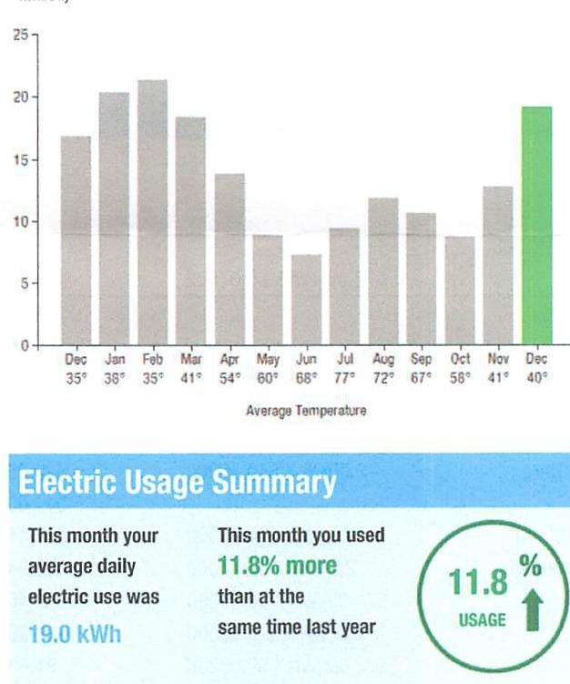
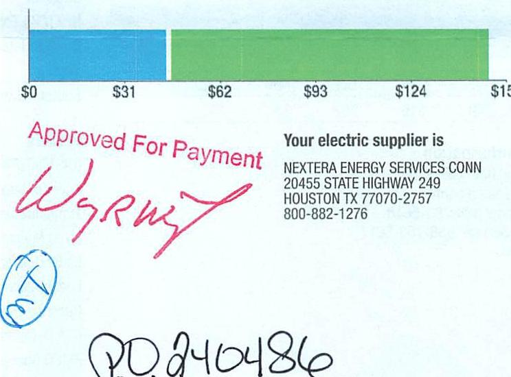
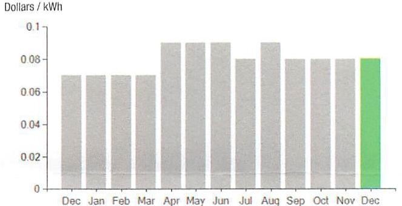
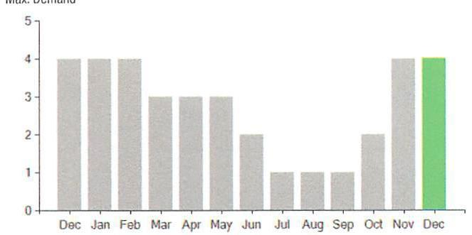

## EVERSEURCE

Account Number: $\quad 51270223027$
Statement Date: 12/14/23
Service Provided To:
TOWN OF BERLIN RECYCLING CENTE

## Electric Usage History - Edward Houts (kWh)

kWh/Day

The image is a bar chart.

- **Chart Type**: Bar chart
- **X-Axis**: Months with average temperatures labeled below each month (e.g., Dec 35°, Jan 38°, etc.).
- **Y-Axis**: kWh/Day, ranging from 0 to 25.
- **Data Points**:
  - December: ~15 kWh
  - January: ~20 kWh
  - February: ~22 kWh
  - March: ~15 kWh
  - April: ~10 kWh
  - May: ~8 kWh
  - June: ~10 kWh
  - July: ~8 kWh
  - August: ~12 kWh
  - September: ~10 kWh
  - October: ~12 kWh
  - November: ~15 kWh
  - December: ~20 kWh (highlighted in green)
- **Notable Styling**: The bar for December is highlighted in green.
- **Embedded Text**:
  - "Electric Usage Summary"
  - "This month your average daily electric use was 19.0 kWh"
  - "This month you used 11.8% more than at the same time last year"
  - "11.8% USAGE" (inside a green circle)

This provides a **yearly usage breakdown (monthly-based)**.

## Total Amount Due

by $02 / 12 / 24$
Amount Due On 12/11/23
Last Payment Received On 11/15/23
Balance Forward
Total Current Charges

## Current Charges for Electricity

| Supply | Delivery |
| :--: | :--: |
| \$44.74 | \$104.10 |
| Cost of electricity from NEXTERA ENERGY SERVICES CONN | Cost to deliver electricity from Eversource |

The image is a section of a document with a bar chart and text.

- **Chart Type**: Bar chart
- **X-Axis**: Dollar amounts labeled as $0, $31, $62, $93, $124, $155.
- **Bar Colors**: Blue and green sections.
- **Embedded Text**:
  - "Approved For Payment" (in red)
  - "Your electric supplier is"
  - "NEXTERA ENERGY SERVICES CONN"
  - "20455 STATE HIGHWAY 249"
  - "HOUSTON TX 77070-2757"
  - "800-882-1276"
- **Additional Markings**: 
  - Red signature or initials.
  - Blue circle with "MT" inside.
  - "PO 240486" written in black.

## News For You

A new discount for electric bills is available if you have a financial hardship status on your electric account. Based on your household income or receipt of a public assistance benefit, you may be eligible for a $10 \%$ or $50 \%$ discount off your electric bill per month. For example, if you have a $\$ 100$ monthly bill, it would be $\$ 10$ less if you receive a $10 \%$ discount or $\$ 50$ less if you receive the $50 \%$ discount. See how to enroll at eversource.com/billhelp.

Remit Payment To: Eversource, PO Box 56002, Boston, MA 02205-6002
CE_231214PR021.TAT/10475-600032289

## EVERSEURCE

Account Number: $\quad 51270223027$
Non-residential and residential non-hardship customers may be subject to a $1.00 \%$ late payment charge if the "Total Amount Due" is not received by 01/11/24.

Please make your check payable to Eversource and consider adding $\$ 1$ for Operation Fuel.
You can also add $\$ 2$ or $\$ 3$ when paying your bill online. $100 \%$ of your tax-deductible donation provides energy assistance grants. If mailing, please allow up to 5 business days to post.

## Total Amount Due

by $02 / 12 / 24$
Amount Enclosed
$48.84$

005238000032289
$11 / 1011111111111111111111111111111111111111111111111111111111111111111111111111111111111111111111111111111111111111111111111111111111111111111111111111111111111111111111111111111111111111111111111111111111

## EVERSEURCE

Account Number: 51270223027
Customer name key: BERL
Statement Date: 12/14/23
Service Provided To:
TOWN OF BERLIN RECYCLING CENTE

| Svc Addr: TOWN FARM IN BERLIN DT 88037 |  |  |  |  |  |
| :--: | :--: | :--: | :--: | :--: | :--: |
| Serv Ref: 269612008 |  |  | Bill Cycle: 10 |  |  |
| Service from 11/13/23 - 12/12/23 |  |  | 30 Days |  |  |
| Next read date on or about: Jan 15, 2024 |  |  |  |  |  |
| Meter   Number | Current Read | Previous Read | Current   Usage | Reading Type |  |
| 890812032 | 30124 | 29552 | 572 | Actual |  |

Total Demand Use $=4.00 \mathrm{KW}$

| Monthly kWh Use |  |  |  |  |  |
| :--: | :--: | :--: | :--: | :--: | :--: |
| Dec | Jan | Feb | Mar | Apr | May Jun |
| 505 | 671 | 596 | 532 | 415 | 257 |
| Jul | Aug | Sep | Oct | Nov | Dec |
| 280 | 379 | 319 | 252 | 396 | 572 |

Contact Information
Emergency: 800-286-2000
www.eversource.com
Pay by Phone: 888-783-6618
Customer Service: 888-783-6617

## Total Amount Due

by $02 / 12 / 24$

## Electric Account Summary

Amount Due On 12/11/23
Last Payment Received On 11/15/23
Balance Forward
Current Charges/Credits
Electric Supply Services
Delivery Services
Total Current Charges

Total Amount Due

Total Charges for Electricity

## Supplier

NEXTERA ENERGY
Service Reference: 269612008
Supply
Subtotal Supplier Services

## Delivery

(DISTRIBUTION RATE: 030)
Service Reference: 269612008
Transmission Demand Chrg
Fixed Monthly Charge
Local Delivery Demand Chrg
Local Delivery Improvements
Revenue Decoupling
CTA Demand Chrg
FMCC Charge
Comb Public Benefit Chrg
Subtotal Delivery Services
Total Cost of Electricity

Total Current Charges
\$234.51
$-$ \$90.69
\$143.82
\$44.74
\$104.10
\$148.84

## Total 66

\$44.74

## $44.74$

\$104.10
\$292.66

## $572.00 \mathrm{KWh} \times \$ 0.07822$

\$44.74
\$44.74

## $2.00 \mathrm{KW} \times \$ 10.46000$

\$20.92
\$44.00
\$28.44
\$4.54
\$0.46
\$0.26
\$1.65
\$4.35
\$104.10

Total Current Charges

# EVERSEURCE 

## Account Number: 51270223027

Customer name key: BERL
Statement Date: 12/14/23
Service Provided To:
TOWN OF BERLIN RECYCLING CENTE

Continued from previous page...

Supply Rate
Dollars / kWh

The image is a bar chart.

- **Chart Type**: Bar chart
- **X-Axis**: Months (Dec, Jan, Feb, Mar, Apr, May, Jun, Jul, Aug, Sep, Oct, Nov, Dec)
- **Y-Axis**: Dollars / kWh (ranging from 0 to 0.1)
- **Legend/Highlight**: The bar for December is highlighted in green.
- **Data Points**:
  - December (first): ~0.07
  - January: ~0.07
  - February: ~0.07
  - March: ~0.08
  - April: ~0.09
  - May: ~0.08
  - June: ~0.08
  - July: ~0.08
  - August: ~0.08
  - September: ~0.08
  - October: ~0.08
  - November: ~0.08
  - December (second): ~0.08

This represents a **yearly usage breakdown (monthly-based)** of the supply rate in dollars per kWh.

Demand Profile
Max. Demand

- **Chart Type**: Bar chart
- **X-Axis**: Months (Dec, Jan, Feb, Mar, Apr, May, Jun, Jul, Aug, Sep, Oct, Nov, Dec)
- **Y-Axis**: Max. Demand (ranging from 0 to 5)
- **Legend/Highlight**: The bar for December is highlighted in green.
- **Data Points**:
  - December (first): ~4.5
  - January: ~4.5
  - February: ~4.5
  - March: ~3.5
  - April: ~3.5
  - May: ~3.5
  - June: ~1.5
  - July: ~1
  - August: ~1
  - September: ~1.5
  - October: ~2
  - November: ~3
  - December (second): ~4.5

This represents a **yearly usage breakdown (monthly-based)** of the maximum demand.

