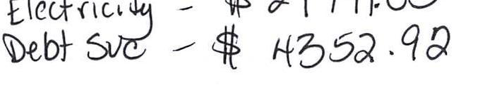

## EVERSEURCE

Account Number: 51592113005
Statement Date: $12 / 18 / 23$
Service Provided To:
TOWN OF BERLIN BOARD OF EDUCAT

## EICTICIH - \$ 2179103 Debt $3 / 8$ - \$ 4352.93



The image is a photo showing handwritten text. The text reads:

```
Electricity - $ 21711.00
Debt Svc - $ 4352.92
```

## Q2

Q2

## Q1

Q1

## Q2

Q3

Q4

Q5

Q6

Q7

Q8

Q9

Q10

Q21

Q22

Q33,407.17
\$0.00
\$33,407.17
\$32,143.95

Current Charges for Electricity
Supply
\$14,811.74
Cost of electricity from NEXTERA ENERGY SERVICES CONN

## Q2

\$3,560
\$11,120
\$16,680
\$22,240
\$27,800

Your electric supplier is
NEXTERA ENERGY SERVICES CONN
20455 STATE HIGRINAY 249
HOUSTON TX 77070-2757
800-882-1276

# Do 440264 

## News For You

A new discount for electric bills is available if you have a financial hardship status on your electric account. Based on your household income or receipt of a public assistance benefit, you may be eligible for a $10 \%$ or $50 \%$ discount off your electric bill per month. For example, if you have a $\$ 100$ monthly bill, it would be $\$ 10$ less if you receive a $10 \%$ discount or $\$ 50$ less if you receive the $50 \%$ discount. See how to enroll at eversource.com/billhelp.

Remit Payment To: Eversource, PO Box 56002, Boston, MA 02205-6002
CE_231218PACO.TXT-7179-00033964
Please make your check payable to Eversource and consider adding $\$ 1$ for Operation Fuel.
You can also add $\$ 2$ or $\$ 3$ when paying your bill online. $100 \%$ of your tax-deductible donation provides energy assistance grants. If mailing, please allow up to 5 business days to post.

Total Amount Due
by $02 / 16 / 24$
Amount Enclosed
$003590000033964$
d $\mathrm{d} / \mathrm{d} / \mathrm{d} / \mathrm{d} / \mathrm{d} / \mathrm{d} / 100,100 / 1 / 1 / 1 / 1 / 1 / 1 / 1 / 1 / 1 / 1 / 1 / 1 / 1 / 1 / 1 / 1 / 1 / 1 / 1 / 1 / 1 / 1 / 1 / 1 / 1 / 1 / 1 / 1 / 1 / 1 / 1 / 1 / 1 / 1 / 1 / 1 / 1 / 1 / 1 / 1 / 1 / 1 / 1 / 1 / 1 / 1 / 1 / 1 / 1 / 1 / 1 / 1 / 1 / 1 / 1 / 1 / 1 / 1 / 1 / 1 / 1 / 1 / 1 / 1 / 1 / 1 / 1

## EVERSEURCE

Account Number: 51592113005
Customer name key: BERL
Statement Date: 12/18/23
Service Provided To:
TOWN OF BERLIN BOARD OF EDUCAT

| Svc Add: 139 PATTERSON WAY BLLIN HIBRISHOUL NERSINGTON CT 06037 |  |  |  |  |  |
| :--: | :--: | :--: | :--: | :--: | :--: |
| Serv Ref: 440443004 |  |  |  | Bill Cycle: 13 32 Days |  |
| Service from 11/16/23 - 12/18/23 |  |  |  |  |  |
| Next road date on or about: Jan 19, 2024 |  |  |  |  |  |
| Meter <br> Number | Current <br> Read | Previous Read | Current Usage | Reading Type |  |
| 081241701 | 3401 | 3325 | 76 | On Peak |  |
| 081241701 | 7348 | 7161 | 187 | Off Peak |  |
| Cust provided ID: BERLIN HIGH SCHOOL |  |  |  |  |  |
| Total Demand Use $=383.80 \mathrm{~kW}$ |  |  |  |  |  |
| 76 X Meter Constant of $720=54720$ Billed Usage |  |  |  |  |  |
| 187 X Meter Constant of $720=134640$ Billed Usage |  |  |  |  |  |
| Max Off-Peak Demand: 383.8 kW |  |  |  |  |  |
| Max On-Peak Demand: 370.1 kW |  |  |  |  |  |
| Max Off-Peak Demand: 397.4 kVA |  |  |  |  |  |
| Max On-Peak Demand: 383 kVA |  |  |  |  |  |
| Monthly kWh Use - On Peak |  |  |  |  |  |
| Dec | Jan | Feb | Mar | Apr | May | Jun |
| 54720 | 56880 | 51120 | 52560 | 53280 | 55440 | 68400 |
| Jul | Aug | Sep | Oct | Nov | Dec |  |
| 75600 | 72720 | 81360 | 67680 | 58320 | 54720 |  |
| Monthly kWh Use - Off Peak |  |  |  |  |  |
| Dec | Jan | Feb | Mar | Apr | May | Jun |
| 131040 | 133920 | 126720 | 123120 | 135360 | 123840 | 154800 |
| Jul | Aug | Sep | Oct | Nov | Dec |  |
| 163440 | 156240 | 187200 | 149040 | 131760 | 134640 |  |

## Total Amount Due by 02/16/24

## Electric Account Summary

Amount Due On 12/15/23
Last Payment Received
\$33,407.17
\$0.00
Balance Forward
Current Charges/Credits
Electric Supply Services
Delivery Services
Loan Charges
Total Current Charges
Total Amount Due
Total Charges for Electricity

## Supplier

NEXTERA ENERGY
Service Reference: 448443004
Supply
Subtotal Supplier Services

## Delivery

(DISTRIBUTION RATE: 056)
Service Reference: 448443004
Prod/Trans Dmd Chrg
Fixed Monthly Charge
Local Delivery Demand Chrg
Local Delivery Improvements
Revenue Decoupling Peak
Revenue Decoupling Off-Peak
Prod/Trans CTA Dmd Chrg
FMCC Charge Peak
FMCC Charge Off-Peak
Combined PBC Peak
Combined PBC Off-Peak
Subtotal Delivery Services

| 383.00KVA X \$12.16000 | \$4,657.28 |
| :-- | --: |
|  | $\$ 350.00$ |
| 664.60KVA X \$7.91000 | $\$ 5,256.99$ |
| 664.60KVA X \$1.12000 | $\$ 744.35$ |
| 54720.00kWh X \$0.00080 | $\$ 43.78$ |
| 134640.00kWh X \$0.00080 | $\$ 107.71$ |
| 383.00KVA X \$ $\cdot 0.17000$ | $-\$ 65.11$ |
| 54720.00kWh X \$0.00595 | $\$ 325.58$ |
| 134640.00kWh X \$0.00131 | $\$ 176.38$ |
| 54720.00kWh X \$0.00730 | $\$ 399.46$ |
| 134640.00kWh X \$0.00730 | $\$ 982.87$ |

\$12,979.29

## EVERSEURCE

Account Number: 51592113005
Customer name key: BERL
Statement Date: 12/18/23
Service Provided To:
TOWN OF BERLIN BOARD OF EDUCAT

Continued from previous page...

## Contact Information

Emergency: 800-286-2000
www.eversource.com
Pay by Phone: 888-783-6618
Customer Service: 888-783-6617

## Total Amount Due

by 02/16/24

Continued from previous page...
Total Cost of Electricity
\$27,791.03
Energy Efficiency Loan
Total Current Charges
\$32,143.95

## Loan Summary

Energy Efficiency Loan - Service Ref \# 768024004
Initial Loan Amount
Amount Paid to Date
Loan Balance
\$208,940.59
\$87,058.40
\$121,882.19

