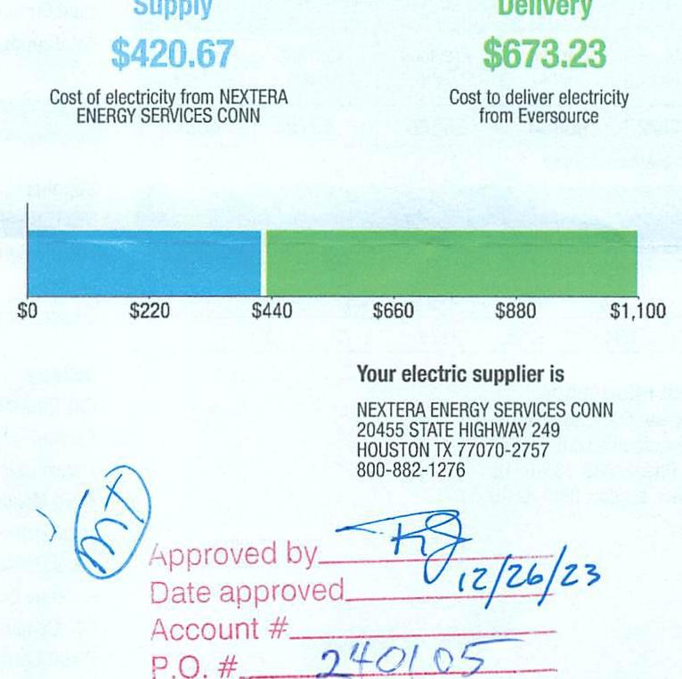

## EVERSEURCE

Account Number: 51448813089
Statement Date: 12/14/23
Service Provided To:
TOWN OF BERLIN WATER CONTROL C

The image is a photo or illustration showing a section of a document. It contains the text "Service Provided To: TOWN OF BERLIN WATER CONTROL C" and includes handwritten blue ink signatures or initials below the printed text.

Electric Usage History = Kilowatt Hours (kWh)

The image is a graph/chart.

- **Chart Type**: Bar chart
- **X-Axis**: Months with average temperatures (°F) labeled as follows:
  - Dec 35°
  - Jan 38°
  - Feb 35°
  - Mar 41°
  - Apr 54°
  - May 60°
  - Jun 68°
  - Jul 77°
  - Aug 72°
  - Sep 67°
  - Oct 58°
  - Nov 41°
  - Dec 40°
- **Y-Axis**: kWh/Day, ranging from 0 to 300
- **Data Points**: Bars representing kWh/day for each month, with a notable increase in October.
- **Styling**: The bar for December is highlighted in green.
- **Additional Text**:
  - "Electric Usage Summary"
  - "This month your average daily electric use was 179.0 kWh"
  - "This month you used 23.4% more than at the same time last year"
  - "23.4% USAGE" with an upward arrow

This represents a **yearly usage breakdown (monthly-based)**.

## 6066463 1-4-2024 \$10,559.83

| Total Amount Due   by $02 / 12 / 24$ | $\$ 1,093.90$ |
| :-- | --: |
| Amount Due On 12/11/23 | $\$ 815.33$ |
| Last Payment Received On 12/13/23 | $-\$ 815.33$ |
| Balance Forward | $\$ 0.00$ |
| Total Current Charges | $\$ 1,093.90$ |

Current Charges for Electricity

The image is a graph/chart.

- **Chart Type**: Bar chart
- **X-Axis**: No specific labels, but monetary values are indicated.
- **Y-Axis**: Not explicitly labeled.
- **Data Points**: 
  - Supply cost: $420.67
  - Delivery cost: $673.23
- **Styling**: 
  - The supply cost is represented in blue.
  - The delivery cost is represented in green.
- **Additional Text**:
  - "Cost of electricity from NEXTERA ENERGY SERVICES CONN"
  - "Cost to deliver electricity from Eversource"
  - "Your electric supplier is NEXTERA ENERGY SERVICES CONN"
  - Address: "20455 STATE HIGHWAY 249 HOUSTON TX 77070-2757"
  - Phone: "800-882-1276"
  - Handwritten text includes:
    - "MT" circled
    - "Approved by" with a signature
    - "Date approved 12/26/23"
    - "Account #" with "240105" written
    - "P.O. #" with a blank line

## News For You

A new discount for electric bills is available if you have a financial hardship status on your electric account. Based on your household income or receipt of a public assistance benefit, you may be eligible for a $10 \%$ or $50 \%$ discount off your electric bill per month. For example, if you have a $\$ 100$ monthly bill, it would be $\$ 10$ less if you receive a $10 \%$ discount or $\$ 50$ less if you receive the $50 \%$ discount. See how to enroll at eversource.com/billhelp.

Remit Payment To: Eversource, PO Box 56002, Boston, MA 02205-6002
OE_2312HPPOD.TXT-B227-099032827

## EVERSEURCE

Account Number: $\quad \$ 1448813089$
Non-residential and residential non-hardship customers may be subject to a $1.00 \%$ late payment charge if the "Total Amount Due" is not received by $01 / 11 / 24$.

Please make your check payable to Eversource and consider adding $\$ 1$ for Operation Fuel.
You can also add $\$ 2$ or $\$ 3$ when paying your bill online: $100 \%$ of your tax-deductible donation provides energy assistance grants. If mailing, please allow up to 5 business days to post.

## Total Amount Due

by $02 / 12 / 24$
Amount Enclosed
$1093.90$

004619 000032827

The image is a photo or illustration showing a section of a document. It contains a barcode at the top and the following text below it:

"Eversource  
PO Box 56002  
Boston, MA 02205-6002"

## EVERSEURCE

Account Number: 51448813089
Customer name key: BERL
Statement Date: 12/14/23
Service Provided To:
TOWN OF BERLIN WATER CONTROL C

| Svc Addr: 634 DEMING RD |  |  |  |  |  |
| :--: | :--: | :--: | :--: | :--: | :--: |
| BERLIN ET 06637 |  |  |  |  |  |
| Serv Ret: 054512000 |  |  |  | Bill Cycle: 10 |  |
| Service from 11/13/23 - 12/13/23 |  |  |  | 30 Days |  |
| Next road date on or about: Jan 15, 2024 |  |  |  |  |  |
| Meter   Number | Current   Read | Previous   Read | Current   Usage | Reading   Type |  |
| 890152522 | 90884 | 85506 | 5378 | Actual |  |
| Total Demand Use $=23.20$ kW |  |  |  |  |  |
| Monthly kWh Use |  |  |  |  |  |
| Dec | Jan | Feb | Mar | Apr | May | Jun |
| 4347 | 5680 | 5555 | 4823 | 5585 | 5117 | 4372 |
| Jul | Aug | Sep | Oct | Nov | Dec |  |
| 4407 | 5642 | 5253 | 8125 | 5172 | 5378 |  |

## Contact Information

Emergency: 800-286-2000
www.eversource.com
Pay by Phone: 888-783-6618
Customer Service: 888-783-6617

## Total Amount Due by 02/12/24

## $51,093.90

## Electric Account Summary

Amount Due On 12/11/23
Last Payment Received On 12/13/23
Balance Forward
Current Charges/Credits
Electric Supply Services
Delivery Services
Total Current Charges
Total Amount Due

## Total Charges for Electricity

## Supplier

NEXTERA ENERGY
Service Reference: 054512000
Supply
Subtotal Supplier Services

## Delivery

(DISTRIBUTION RATE: 030)
Service Reference: 054512000
Transmission Demand Chrg
Fixed Monthly Charge
Local Delivery Demand Chrg
Local Delivery Improvements
Revenue Decoupling
CTA Demand Chrg
FMCC Charge
Comb Public Benefit Chrg
Subtotal Delivery Services
Total Cost of Electricity

Total Current Charges
$21.20 KW X \$10.46000
21.20 KW X \$14.22000
21.20 KW X \$2.27000
5378.00 kWh X \$0.00080
21.20 KW X \$-0.13000
5378.00 kWh X \$0.00288
5378.00 kWh X \$0.00760
\$420.67
\$221.75
\$44.00
\$301.46
\$48.12
\$4.30
-52.76
\$15.49
\$40.87
\$673.23
\$1,093.90
\$1,093.90

