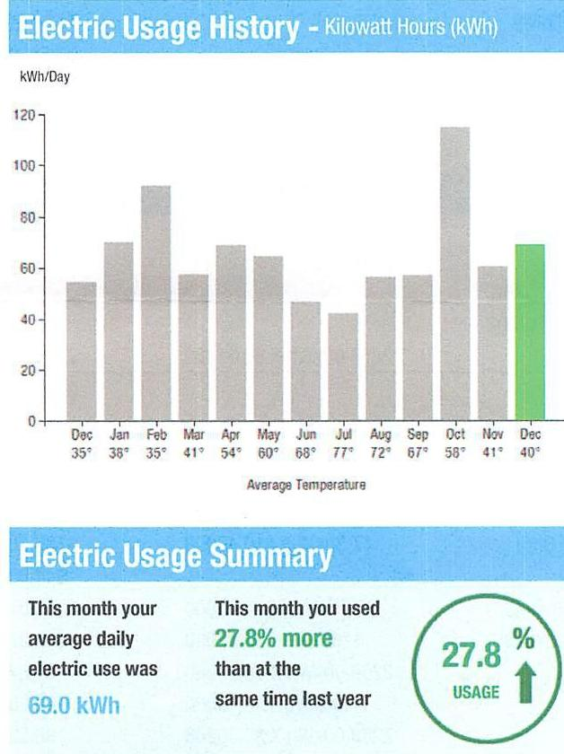

## EVERSEURCE

Account Number: 51434813051
Statement Date: 12/15/23
Service Provided To:
TOWN OF BERLIN WATER CONTROL C 440 N 440 N 440 N

The image is a bar chart titled "Electric Usage History - Kilowatt Hours (kWh)". 

- **Y-axis**: kWh/Day, ranging from 0 to 120.
- **X-axis**: Months with average temperatures:
  - Dec (35°)
  - Jan (38°)
  - Feb (41°)
  - Mar (35°)
  - Apr (41°)
  - May (54°)
  - Jun (60°)
  - Jul (69°)
  - Aug (77°)
  - Sep (72°)
  - Oct (58°)
  - Nov (41°)
  - Dec (40°)

The chart shows a yearly usage breakdown (monthly-based) with varying bar heights indicating kWh usage per day for each month. The December bar is highlighted in green.

Below the chart, there is a section titled "Electric Usage Summary" with the following text:
- "This month your average daily electric use was 69.0 kWh"
- "This month you used 27.8% more than at the same time last year"
- A circular graphic with "27.8% USAGE" and an upward arrow.

## Newss For You

A new discount for electric bills is available if you have a financial hardship status on your electric account. Based on your household income or receipt of a public assistance benefit, you may be eligible for a $10 \%$ or $50 \%$ discount off your electric bill per month. For example, if you have a $\$ 100$ monthly bill, it would be $\$ 10$ less if you receive a $10 \%$ discount or $\$ 50$ less if you receive the $50 \%$ discount. See how to enroll at eversource.com/billhelp.

Remit Payment To: Eversource, PO Box 56002, Boston, MA 02205-6002

## EVERSEURCE

Account Number: 51434813051
Non-residential and residential non-hardship customers may be subject to a $1.00 \%$ late payment charge if the "Total Amount Due" is not received by $01 / 12 / 24$.

## $440 \quad 440 \quad 440 \quad 440$

$1 / 12 / 24$ 000045679
$1 / 121 / 24$ 1/121/24 1/121/24 1/121/24
$240 \quad 440$ 000045679
$1 / 121 / 24$ 1/121/24 1/121/24 1/121/24
$240 \quad 440$ 000045679
$1 / 121 / 24$ 1/121/24 1/121/24 1/121/24
$240 \quad 440$ 000045679
$1 / 121 / 24$ 1/121/24 1/121/24 1/121/24
$240 \quad 440$ 000045679
$1 / 121 / 24$ 1/121/24 1/121/24 1/121/24
$240 \quad 440$ 000045679
$1 / 121 / 24$ 1/121/24 1/121/24 1/121/24
$240 \quad 440$ 000045679
$1 / 121 / 24$ 1/121/24 1/121/24 1/121/24
$240 \quad 440$ 000045679
$1 / 121 / 24$ 1/121/24 1/121/24 1/121/24
$240 \quad 440$ 000045679
$1 / 121 / 24$ 1/121/24 1/121/24 1/121/24
$240 \quad 440$ 000045679
$1 / 121 / 24$ 1/121/24 1/121/24 1/121/24
$240 \quad 440$ 000045679
$1 / 121 / 24$ 1/121/24 1/121/24 1/121/24
$240 \quad 440$ 000045679
$1 / 121 / 24$ 1/121/24 1/121/24 1/121/24 1/121/24
$240 \quad 440$ 000045679
$1 / 121 / 24$ 1/121/24 1/121/24 1/121/24 1/121/24
$240 \quad 440$ 000045679
$1 / 121 / 24$ 1/121/24 1/121/24 1/121/24 1/121/24
$240 \quad 440$ 000045679
$1 / 121 / 24$ 1/121/24 1/121/24 1/121/24 1/121/24
$240 \quad 440$ 000045679
$1 / 121 / 24$ 1/121/24 1/121/24 1/121/24 1/121/24 1/121/24
$240 \quad 440$ 000045679
$1 / 121 / 24$ 1/121/24 1/121/24 1/121/24 1/121/24 1/121/24
$240 \quad 440$ 000045679
$1 / 121 / 24$ 1/121/24 1/121/24 1/121/24 1/121/24 1/121/24
$240 \quad 440$ 000045679
$1 / 121 / 24$ 1/121/24 1/121/24 1/121/24 1/121/24 1/121/24 1/121/24
$240 \quad 440$ 000045679
$1 / 121 / 24$ 1/121/24 1/121/24 1/121/24 1/121/24 1/121/24 1/121/24 1/121/24
$240 \quad 440$ 000045679
$1 / 121 / 24$ 1/121/24 1/121/24 1/121/24 1/121/24 1/121/24 1/121/24 1/121/24
$240 \quad 440$ 000045679
$1 / 121 / 24$ 1/121/24 1/121/24 1/121/24 1/121/24 1/121/24 1/121/24 1/121/24 1/121/24 1/121/24 1/121/24 1/121/24 1/121/24 1/121/24 1/121/24 1/121/24 1/121/24 1/121/24 1/121/24 1/121/24 1/121/24 1/121/24 1/121/24 1/121/24 1/121/24 1/121/24 1/121/24 1/121/24 1/121/24 1/121/24 1/121/24 1/121/24 1/121/24 1/121/24 1/121/24 1/121/24 1/121/24 1/121/24 1/121/24 1/121/24 1/121/24 1/121/24 1/121/24 1/121/24 1/121/24 1/121/24 1/121/24 1/121/24 1/121/24 1/121/24 1/121/24 1/121/24 1/121/24 1/121/24 1/121/24 1/121/24 1/121/24 1/121/24 1/121/24 1/121/24 1/121/24 1/121/24 1/121/24 1/121/24 1/121/24 1/121/24 1/121/24 1/121/24 1/121/24 1/121/24 1/121/24 1/121/24 1/121/24 1/121/24 1/121/24 1/121/24 1/121/24 1/121/24 1/121/24 1/121/24 1/121/24 1/121/24 1/121/24 1/121/24 1/121/24 1/121/24 1/121/24 1/121/24 1/121/24 1/121/24 1/121/24 1/121/24 1/121/24 1/121/24 1/121/24 1/121/24 1/121/24 1/121/24 1/121/24 1/121/24 1/121/24 1/121/24 1/121/24 1/121/24 1/121/24 1/121/24 1/121/24 1/121/24 1/121/24 1/121/24 1/121/24 1/121/24 1/121/24 1/121/24 1/121/24 1/121/24 1/121/24 1/121/24 1/121/24 1/121/24 1/121/24 1/121/24 1/121/24 1/121/24 1/121/24 1/121/24 1/121/24 1/121/24 1/121/24 1/121/24 1/121/24 1/121/24 1/121/24 1/121/24 1/121/24 1/121/24 1/121/24 1/121/24 1/121/24 1/121/24 1/121/24 1/121/24 1/121/24 1/121/24 1/121/24 1/121/24 1/121/24 1/121/24 1/121/24 1/121/24 1/121/24 1/121/24 1/121/24 1/121/24 1/121/24 1/121/24 1/121/24 1/121/24 1/121/24 1/121/24 1/121/24 1/121/24 1/121/24 1/121/24 1/121/24 1/121/24 1/121/24 1/121/24 1/121/24 1/121/24 1/121/24 1/121/24 1/121/24 1/121/24 1/121/24 1/121/24 1/121/24 1/121/24 1/121/24 1/121/24 1/121/24 1/121/24 1/121/24 1/121/24 1/121/24 1/121/24 1/121/24 1/121/24 1/121/24 1/121/24 1/121/24 1/121/24 1/121/24 1/121/24 1/121/24 1/121/24 1/121/24 1/121/24 1/121/24 1/121/24 1/121/24 1/121/24 1/121/24 1/121/24 1/121/24 1/121/24 1/121/24 1/121/24 1/121/24 1/121/24 1/121/24 1/121/24 1/121/24 1/121/24 1/121/24 1/121/24 1/121/24 1/121/24 1/121/24 1/121/24 1/121/24 1/121/24 1/121/24 1/121/24 1/121/24 1/121/24 1/121/24 1/121/24 1/121/24 1/121/24 1/121/24 1/121/24 1/121/24 1/121/24 1/121/24 1/121/24 1/121/24 1/121/24 1/121/24 1/121/24 1/121/24 1/121/24 1/121/24 1/121/24 1/121/24 1/121/24 1/121/24 1/121/24 1/121/24 1/121/24 1/121/24 1/121/24 1/121/24 1/121/24 1/121/24 1/121/24 1/121/24 1/121/24 1/121/24 1/121/24 1/121/24 1/121/24 1/121/24 1/121/24 1/121/24 1/121/24 1/121/24 1/121/24 1/121/24 1/121/24 1/121/24 1/121/24 1/121/24 1/121/24 1/121/24 1/121/24 1/121/24 1/121/24 1/121/24 1/121/24 1/121/24 1/121/24 1/121/24 1/121/24 1/121/24 1/121/24 1/121/24 1/121/24 1/121/24 1/121/24 1/121/24 1/121/24 1/121/24 1/121/24 1/121/24 1/121/24 1/121/24 1/121/24 1/121/24 1/121/24 1/121/24 1/121/24 1/121/24 1/121/24 1/121/24 1/121/24 1/121/24 1/121/24 1/121/24 1/121/24 1/121/24 1/121/24 1/121/24 1/121/24 1/121/24 1/121/24 1/121/24 1/121/24 1/121/24 1/121/24 1/121/24 1/121/24 1/121/24 1/121/24 1/121/24 1/121/24 1/121/24 1/121/24 1/121/24 1/121/24 1/121/24 1/121/24 1/121/24 1/121/24 1/121/24 1/121/24 1/121/24 1/121/24 1/121/24 1/121/24 1/121/24 1/121/24 1/121/24 1/121/24 1/121/24 1/121/24 1/121/24 1/121/24 1/121/24 1/121/24 1/121/24 1/121/24 1/121/24 1/121/24 1/121/24 1/121/24 1/121/24 1/121/24 1/121/24 1/121/24 1/121/24 1/121/24 1/121/24 1/121/24 1/121/24 1/121/24 1/121/24 1/121/24 1/121/24 1/121/24 1/121/24 1/121/24 1/121/24 1/121/24 1/121/24 1/121/24 1/121/24 1/121/24 1/121/24 1/121/24 1/121/24 1/121/24 1/121/24 1/121/24 1/121/24 1/121/24 1/121/24 1/121/24 1/121/24 1/121/24 1/121/24 1/121/24 1/121/24 1/121/24 1/121/24 1/121/24 1/121/24 1/121/24 1/121/24 1/121/24 1/121/24 1/121/24 1/121/24 1/121/24 1/121/24 1/121/24 1/121/24 1/121/24 1/121/24 1/121/24 1/121/24 1/121/24 1/121/24 1/121/24 1/121/24 1/121/24 1/121/24 1/121/24 1/121/24 1/121/24 1/121/24 1/121/24 1/121/24 1/121/24 1/121/24 1/121/24 1/121/24 1/121/24 1/121/24 1/121/24 1/121/24 1/121/24 1/121/24 1/121/24 1/121/24 1/121/24 1/121/24 1/121/24 1/121/24 1/121/24 1/121/24 1/121/24 1/121/24 1/121/24 1/121/24 1/121/24 1/121/24 1/121/24 1/121/24 1/121/24 1/121/24 1/121/24 1/121/24 1/121/24 1/121/24 1/121/24 1/121/24 1/121/24 1/121/24 1/121/24 1/121/24 1/121/24 1/121/24 1/121/24 1/121/24 1/121/24 1/121/24 1/121/24 1/121/24 1/121/24 1/121/24 1/121/24 1/121/24 1/121/24 1/121/24 1/121/24 1/121/24 1/121/24 1/121/24 1/121/24 1/121/24 1/121/24 1/121/24 1/121/24 1/121/24 1/121/24 1/121/24 1/121/24 1/121/24 1/121/24 1/121/24 1/121/24 1/121/24 1/121/24 1/121/24 1/121/24 1/121/24 1/121/24 1/121/24 1/121/24 1/121/24 1/121/24 1/121/24 1/121/24 1/121/24 1/121/24 1/121/24 1/121/24 1/121/24 1/121/24 1/121/24 1/121/24 1/121/24 1/121/24 1/121/24 1/121/24 1/121/24 1/121/24 1/121/24 1/121/24 1/121/24 1/121/24 1/121/24 1/121/24 1/121/24 1/121/24 1/121/24 1/121/24 1/121/24 1/121/24 1/121/24 1/121/24 1/121/24 1/121/24 1/121/24 1/121/24 1/121/24 1/121/24 1/121/24 1/121/24 1/121/24 1/121/24 1/121/24 1/121/24 1/121/24 1/121/24 1/121/24 1/121/24 1/121/24 1/121/24 1/121/24 1/121/24 1/121/24 1/121/24 1/121/24 1/121/24 1/121/24 1/121/24 1/121/24 1/121/24 1/121/24 1/121/24 1/121/24 1/121/24 1/121/24 1/121/24 1/121/24 1/121/24 1/121/24 1/121/24 1/121/24 1/121/24 1/121/24 1/121/24 1/121/24 1/121/24 1/121/24 1/121/24 1/121/24 1/121/24 1/121/24 1/121/24 1/121/24 1/121/24 1/121/24 1/121/24 1/121/24 1/121/24 1/121/24 1/121/24 1/121/24 1/121/24 1/121/24 1/121/24 1/121/24 1/121/24 1/121/24 1/121/24 1/121/24 1/121/24 1/121/24 1/121/24 1/121/24 1/121/24 1/121/24 1/121/24 1/121/24 1/121/24 1/121/24 1/121/24 1/121/24 1/121/24 1/121/24 1/121/24 1/121/24 1/121/24 1/121/24 1/121/24 1/121/24 1/121/24 1/121/24 1/121/24 1/121/24 1/121/24 1/121/24 1/121/24 1/121/24 1/121/24 1/121/24 1/121/24 1/121/24 1/121/24 1/121/24 1/121/24 1/121/24 1/121/24 1/121/24 1/121/24 1/121/24 1/121/24 1/121/24 1/121/24 1/121/24 1/121/24 1/121/24 1/121/24 1/121/24 1/121/24 1/121/24 1/121/24 1/121/24 1/121/24 1/121/24 1/121/24 1/121/24 1/121/24 1/121/24 1/121/24 1/121/24 1/121/24 1/121/24 1/121/24 1/121/24 1/121/24 1/121/24 1/121/24 1/121/24 1/121/24 1/121/24 1/121/24 1/121/24 1/121/24 1/121/24 1/121/24 1/121/24 1/121/24 1/121/24 1/121/24 1/121/24 1/121/24 1/121/24 1/121/24 1/121/24 1/121/24 1/121/24 1/121/24 1/121/24 1/121/24 1/121/24 1/121/24 1/121/24 1/121/24 1/121/24 1/121/24 1/121/24 1/121/24 1/121/24 1/121/24 1/121/24 1/121/24 1/121/24 1/121/24 1/121/24 1/121/24 1/121/24 1/121/24 1/121/24 1/121/24 1/121/24 1/121/24 1/121/24 1/121/24 1/121/24 1/121/24 1/121/24 1/121/24 1/121/24 1/121/24 1/121/24 1/121/24 1/121/24 1/121/24 1/121/24 1/121/24 1/121/24 1/121/24 1/121/24 1/121/24 1/121/24 1/121/24 1/121/24 1/121/24 1/121/24 1/121/24 1/121/24 1/121/24 1/121/24 1/121/24 1/121/24 1/121/24 1/121/24 1/121/24 1/121/24 1/121/24 1/121/24 1/121/24 1/121/24 1/121/24 1/121/24 1/121/24 1/121/24 1/121/24 1/121/24 1/121/24 1/121/24 1/121/24 1/121/24 1/121/24 1/121/24 1/121/24 1/121/24 1/121/24 1/121/24 1/121/24 1/121/24 1/121/24 1/121/24 1/121/24 1/121/24 1/121/24 1/121/24 1/121/24 1/121/24 1/121/24 1/121/24 1/121/24 1/121/24 1/121/24 1/121/24 1/121/24 1/121/24 1/121/24 1/121/24 1/121/24 1/121/24 1/121/24 1/121/24 1/121/24 1/121/24 1/121/24 1/121/24 1/121/24 1/121/24 1/121/24 1/121/24 1/121/24 1/121/24 1/121/24 1/121/24 1/121/24 1/121/24 1/121/24 1/121/24 1/121/24 1/121/24 1/121/24 1/121/24 1/121/24 1/121/24 1/121/24 1/121/24 1/121/24 1/121/24 1/121/24 1/121/24 1/121/24 1/121/24 1/121/24 1/121/24 1/121/24 1/121/24 1/121/24 1/121/24 1/121/24 1/121/24 1/121/24 1/121/24 1/121/24 1/121/24 1/121/24 1/121/24 1/121/24 1/121/24 1/121/24 1/121/24 1/121/24 1/121/24 1/121/24 1/121/24 1/121/24 1/121/24 1/121/24 1/121/24 1/121/24 1/121/24 1/121/24 1/121/24 1/121/24 1/121/24 1/121/24 1/121/24 1/121/24 1/121/24 1/121/24 1/121/24 1/121/24 1/121/24 1/121/24 1/121/24 1/121/24 1/121/24 1/121/24 1/121/24 1/121/24 1/121/24 1/121/24 1/121/24 1/121/24 1/121/24 1/121/24 1/121/24 1/121/24 1/121/24 1/121/24 1/121/24 1/121/24 1/121/24 1/121/24 1/121/24 1/121/24 1/121/24 1/121/24 1/121/24 1/121/24 1/121/24 1/121/24 1/121/24 1/121/24 1/121/24 1/121/24 1/121/24 1/121/24 1/121/24 1/121/24 1/121/24 1/121/24 1/121/24 1/121/24 1/121/24 1/121/24 1/121/24 1/121/24 1/121/24 1/121/24 1/121/24 1/121/24 1/121/24 1/121/24 1/121/24 1/121/24 1/121/24 1/121/24 1/121/24 1/121/24 1/121/24 1/121/24 1/121/24 1/121/24 1/121/24 1/121/24 1/121/24 1/121/24 1/121/24 1/121/24 1/121/24 1/121/24 1/121/24 1/121/24 1/121/24 1/121/24 1/121/24 1/121/24 1/121/24 1/121/24 1/121/24 1/121/24 1/121/24 1/121/24 1/121/24 1/121/24 1/121/24 1/121/24 1/121/24 1/121/24 1/121/24 1/121/24 1/121/24 1/121/24 1/121/24 1/121/24 1/121/24 1/121/24 1/121/24 1/121/24 1/121/24 1/121/24 1/121/24 1/121/24 1/121/24 1/121/24 1/121/24 1/121/24 1/121/24 1/121/24 1/121/24 1/121/24 1/121/24 1/121/24 1/121/24 1/121/24 1/121/24 1/121/24 1/121/24 1/121/24 1/121/24 1/121/24 1/121/24 1/121/24 1/121/24 1/121/24 1/121/24 1/121/24 1/121/24 1/121/24 1/121/24 1/121/24 1/121/24 1/121/24 1/121/24 1/121/24 1/121/24 1/121/24 1/121/24 1/121/24 1/121/24 1/121/24 1/121/24 1/121/24 1/121/24 1/121/24 1/121/24 1/121/24 1/121/24 1/121/24 1/121/24 1/121/24 1/121/24 1/121/24 1/121/24 1/121/24 1/121/24 1/121/24 1/121/24 1/121/24 1/121/24 1/121/24 1/121/24 1/121/24 1/121/24 1/121/24 1/121/24 1/121/24 1/121/24 1/121/24 1/121/24 1/121/24 1/121/24 1/121/24 1/121/24 1/121/24 1/121/24 1/121/24 1/121/24 1/121/24 1/121/24 1/121/24 1/121/24 1/121/24 1/121/24 1/121/24 1/121/24 1/121/24 1/121/24 1/121/24 1/121/24 1/121/24 1/121/24 1/121/24 1/121/24 1/121/24 1/121/24 1/121/24 1/121/24 1/121/24 1/121/24 1/121/24 1/121/24 1/121/24 1/121/24 1/121/24 1/121/24 1/121/24 1/121/24 1/121/24 1/121/24 1/121/24 1/121/24 1/121/24 1/121/24 1/121/24 1/121/24 1/121/24 1/121/24 1/121/24 1/121/24 1/121/24 1/121/24 1/121/24 1/121/24 1/121/24 1/121/24 1/121/24 1/121/24 1/121/24 1/121/24 1/121/24 1/121/24 1/121/24 1/121/24 1/121/24 1/121/24 1/121/24 1/121/24 1/121/24 1/121/24 1/121/24 1/121/24 1/121/24 1/121/24 1/121/24 1/121/24 1/121/24 1/121/24 1/121/24 1/121/24 1/121/24 1/121/24 1/121/24 1/121/24 1/121/24 1/121/24 1/121/24 1/121/24 1/121/24 1/121/24 1/121/24 1/121/24 1/121/24 1/121/24 1/121/24 1/121/24 1/121/24 1/121/24 1/121/24 1/121/24 1/121/24 1/121/24 1/121/24 1/121/24 1/121/24 1/121/24 1/121/24 1/121/24 1/121/24 1/121/24 1/121/24 1/121/24 1/121/24 1/121/24 1/121/24 1/121/24 1/121/24 1/121/24 1/121/24 1/121/24 1/121/24 1/121/24 1/121/24 1/121/24 1/121/24 1/121/24 1/121/24 1/121/24 1/121/24 1/121/24 1/121/24 1/121/24 1/121/24 1/121/24 1/121/24 1/121/24 1/121/24 1/121/24 1/121/24 1/121/24 1/121/24 1/121/24 1/121/24 1/121/24 1/121/24 1/121/24 1/121/24 1/121/24 1/121/24 1/121/24 1/121/24 1/121/24 1/121/24 1/121/24 1/121/24 1/121/24 1/121/24 1/121/24 1/121/24 1/121/24 1/121/24 1/121/24 1/121/24 1/121/24 1/121/24 1/121/24 1/121/24 1/121/24 1/121/24 1/121/24 1/121/24 1/121/24 1/121/24 1/121/24 1/121/24 1/121/24 1/124 1/121/24 1/124 1/124 1/121/24 1/121/24 1/121/24 1/121/24 1/124 1/124 1/124 1/121/24 1/121/24 1/121/24 1/121/24 1/121/24 1/121/24 1/121/24 1/121/24 1/121/24 1/121/24 1/124 1/124 1/124 1/121/24 1/121/24 1/121/24 1/124 1/124 1/124 1/124 1/124 1/124 1/124 1/124 1/124 1/124 1/124 1/124 1/124 1/124 1/124 1/124 1/124 1/124 1/121/24 1/124 1/124 1/124 1/124 1/124 1/124 1/124 1/124 1/124 1/124 1/124 1/124 1/124 1/124 1/124 1/124 1/124 1

## EVERSEURCE

Account Number: 51434813051
Customer name key: BERL
Statement Date: 12/15/23
Service Provided To:
TOWN OF BERLIN WATER CONTROL C

| Svc Addr: 440 MIDDLETOWN RD BERLIN O: 06037 |  |  |  |  |  |
| :--: | :--: | :--: | :--: | :--: | :--: |
| Serv Rel: 325412002 |  |  |  | Gill Cycle: 09 |  |
| Service from 11/09/23 - 12/12/23 |  |  |  | 33 Days |  |
| Next road date on or about: Jan 12, 2024 |  |  |  |  |  |
| Meter   Number | Current   Read | Previous   Read | Current   Usage |  | Reading   Type |
| 890535512 | 37924 | 35655 | 2269 |  | Actual |
| Total Demand Use $=19.30 \mathrm{~kW}$ |  |  |  |  |  |

| Monthly AWh Use |  |  |  |  |  |
| :--: | :--: | :--: | :--: | :--: | :--: |
| Dec | Jan | Feb | Mar | Apr | May |
| 1797 | 2165 | 2580 | 1785 | 2070 | 1873 |
| Jul | Aug | Sep | Oct | Nov | Dec |
| 1256 | 1809 | 1709 | 3335 | 1694 | 2269 |

## Contact Information

Emergency: 800-286-2000
www.eversource.com
Pay by Phone: 888-783-6618
Customer Service: 888-783-6617

## Total Amount Due by 02/13/23

## Electric Account Summary

| Amount Due On 12/11/23 | $\$ 305.58$ |
| :-- | --: |
| Last Payment Received On 12/13/23 | $-\$ 305.58$ |
| Balance Forward | $\$ 0.00$ |
| Current Charges/Credits | $\$ 177.48$ |
| Electric Supply Services | $\$ 533.58$ |
| Delivery Services | $\$ 711.06$ |
| Total Current Charges | $\$ 711.06$ |

Total Amount Due
Total Charges for Electricity

## Supplier

NEXTERA ENERGY
Service Reference: 325412002
Supply
Subtotal Supplier Services

## Delivery

(DISTRIBUTION RATE: 030)
Service Reference: 325412002
Transmission Demand Chrg
Fixed Monthly Charge
Local Delivery Demand Chrg
Local Delivery Improvements
Revenue Decoupling
CTA Demand Chrg
FMCC Charge
Comb Public Benefit Chrg
Subtotal Delivery Services

Total Cost of Electricity

Total Current Charges

## \$711.06

\$180.96
\$44.00
\$246.01
\$39.27
\$1.82
\$2.25
\$6.53
\$17.24
\$533.58
\$711.06

## $2269.00 \mathrm{kWh} \times \$ 0.00760$

Total Cost of Electricity

Total Current Charges

