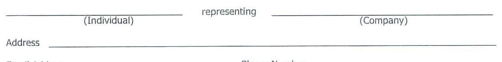
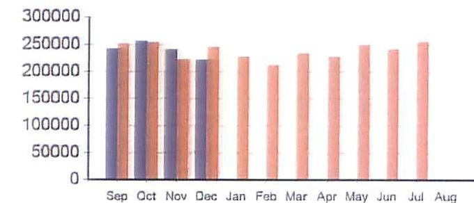

# CUSTOMER USAGE INFORMATION AUTHORIZATION 

I hereby authorize my energy utility to act in my behalf for the purpose of obtaining information about my historical energy usage and billing information and consent to the release of same so that the Company named herein may evaluate my energy usage patterns and make me an offer to supply energy. The utility considers all customer usage information to be confidential.

This authorization in no way binds me to the purchase of any service or product from the Company named herein and is to be used for the sole purpose of determining my offer price of energy service or the provision of other energy-related services.

## Supplier/Consultant Information (please print):



The image is a form with the following text:

```
_________________________ representing _________________________
          (Individual)                              (Company)

Address _______________________________________________________

Phone Number _________________________________________________
```

Type of Data Requested (If you select both, you will be charged for each):
Sixty (60) minute interval data (if available) provided in ASCII text file
Monthly billing information (will be provided if 60 minute interval data is unavailable)
NOTE: Billing information will typically cover the most recent twelve-month period.

## Operating Company Information (please print):


The image is a photo of a form section with handwritten and printed text. The text reads:

"My Utility __Direct Energy__  
Company Name __Pasadena Hospital Association, LTD DBA Huntington Hospital__"

Address 720 Fairmont Avenue
City Pasadena
State CA
Zip 91105
Business Contact Name
Telephone Number

## Lh. 118

Signature
$11 / 11 / 2$
Date

This authorization is valid for 90 days from the above date, unless otherwise indicated. I wish to have this authorization valid until $\qquad$ (date \& initial).

## Account Number(s)

See Account Schedule Attached

# ACCOUNT SCHEDULE 

For: Pasadena Hospital Association, LTD DBA Huntington Hospital

| UDC | UDC Account Number | Service Address |
| :-- | :-- | :-- |
|  | 18242092001503 | 720 Fairmont Avenue Pasadena CA 91105 |
|  |  |  |
|  |  |  |
|  |  |  |
|  |  |  |
|  |  |  |
|  |  |  |
|  |  |  |
|  |  |  |
|  |  |  |
|  |  |  |
|  |  |  |
|  |  |  |
|  |  |  |
|  |  |  |
|  |  |  |
|  |  |  |
|  |  |  |
|  |  |  |

Direct
Energy.
Business

## CUSTOMER INFORMATION

Company: PASADENA HOSPITAL ASSOCIATION Ltd.
DBA Huntington Memorial Hospital

Billing Address: 720 Fairmont Avenue PASADENA, CA 91105

## USAGE HISTORY

Monthly Gas (THERMS)


The image is a bar chart.

- **Chart Type**: Bar chart
- **X-Axis**: Months (Sep, Oct, Nov, Dec, Jan, Feb, Mar, Apr, May, Jun, Jul, Aug)
- **Y-Axis**: No title, but numerical values ranging from 0 to 300,000
- **Legend Entries**: "Prev Year" and "Curt Year"
- **Data Points**: 
  - Two sets of bars for each month, one for the previous year and one for the current year.
  - Values appear to be consistent across months, with slight variations.
- **Styling**: 
  - The bars for the previous year are in a darker color, while the current year bars are in a lighter color.
  - The chart shows a **yearly usage breakdown (monthly-based)** for gas usage in therms.

Sep Oct Nov Dec Jan Feb Mar Apr May Jun Jul Aug
Prev Year
Curt Year

## MESSAGE CENTER

GO PAPERLESS TODAY

Citaiy to Pay Charles Lumboy

Erecil in papertess billing today and help reduce your cartons (tastiontial directenergybusiness.com/papertess.

Director
of Plant Services

Direct
Energy.
Business

DBA Huntington Memorial Hospital
720 Fairmont Avenue
PASADENA, CA 91105

| Involca \#: | HS23175804 |
| :-- | --: |
| Account \#: | 767679 - 937317 |
| Involca Date: | 08/09/2022 |
| Payment Due Date: | 09/03/2022 |

## INVOCLE SUMMARY

Previous Balance
$177,744.81
Payment Received (Aug 02, 2022)
$($ \$177,744.81)
Total Balance Forward
Adjustments
Late Payment Charge
Current Usage Charges
Taxes
Total Current Charges
Amount Due by Sep 03, 2022
Amount Due by Sep 03, 2022
$\$ 188,580.57$

## PAYMENT OPTIONS

By web
By phone
By mail
myaccount.directenergy.com
Remittance slip below

## QUESTIONS?

Visit Us
My account.directenergy.com
Call Us
$1,888,925,9115$
$45000.67800$
$445000.67800$

Detech here and return this portion with check or money order. Do not staple or fold.

| Involca \#: | HS23175804 |
| :-- | --: |
| Account \#: | $767679-937317$ |
| Amount Due by Sep 03, 2022 | $\$ 188,580.57$ |

Amount Enclosed
Please write your account number on your check or money order made payable to Direct Energy Business.

Check Remittance To:
Direct Energy Business
P.O. Box 32179

New York,NY 10087-2179

# IF YOU SUSPECT A NATURAL GAS LEAK, SMELL GAS OR HAVE ANY OTHER GAS RELATED EMERGENCIES, PLEASE DIAL 911 OR CONTACT YOUR LOCAL DISTRIBUTION UTILITY COMPANY. 

## OENERGE INECIPANTIOIV

If you end your service with Direct Energy prior to the end of your agreement term, you may be charged an early termination fee. Please refer to your agreement for additional information.

In the event that the Term of your Agreement has expired, your account will be invoiced at a Market Based Rate or dropped.

## REEINITIONS

Board of Public Utilities - State agency responsible for regulating local utility companies. (May also be called Public Service Commission).

Burner Tip - Point where natural gas is ultimately used by the customer (the meter).

CCF - 100 cubic feet. This is a measure of gas usage.
City Gate - Physical connection of an interstate pipeline and the pipeline of the local natural gas utility.

Community Charge - The cost of natural gas provided to you during the billing period.

G\&A (Gas Settlement Adjustment) - charge or credit for the value of natural gas usage that differs from contracted volume.

Late Payment Charges - Charges for payment of a billed amount after the due date specified on the customer's invoice. Late payment charges may apply as specified in your contract with Direct Energy.

## REEINITIONS COUNTRUCE

Line Lags - The difference between the amount of natural gas brought to the city gate, versus the amount of natural gas usage report at the meter (burner tip). Line loss was previously included in your local pricing. Line loss is a regulated charge based on percentages determined by each utility to compensate for the utility's pipeline system loss.

Local Distribution Company (LDC) Charges - The fee assessed by the local utility for delivery of natural gas to the customer's home or business through the utility's distribution lines. In most cases this charge is billed separately by the utility.

MCF - 1,000 cubic feet or 10 CCFs. This is a measure of gas usage.
Meter - A device for measuring levels and volumes of a customer's natural gas usage. The local utility retains responsibility for reading and maintaining these meters.

MMISTU - Million British thermal units, which is a heating equivalent measure for natural gas and is an alternative measure of natural gas reserves.

Service Period - The time period associated with when the Utility reads or estimates the customer's natural gas usage for billing purposes. The customer's service period is established by the Utility.

Therm - One hundred thousand (100,000 British thermal units (1 Therm $=100,000$ BTU).

| Involve #: | HS23175804 |  |  | Contract Volumes: | 24,500 MMBTU |
| :--: | :--: | :--: | :--: | :--: | :--: |
| Statement Group \#: | 937317 |  |  | Swing: <br> Billing Unit: |  | 0\% <br> MMBTU |
| Serv Loc ID: 767730 |  | Description | Deal ID | Data From - To | Volume | Unit Price | Total |
| Service Period: 07/01/2022-07/31/2022 |  | Contract Volume | 2511401 | 07/01/2022-07/31/2022 | 24,500.00 | $\$ 6.786$ | $\$ 166,257.00$ |
| Utility Name: | Southern California Gas Company | GSA Charges | 2511401 |  | 1,154.80 | $\$ 7.374844$ | $\$ 8,516.47$ |
| Pool/Point: | Social NonCore - 5234 | Local Utility Users Tax |  |  |  | 7.9000\% | \$13,807.10 |
| Utility Aect \#: | 18243DB200-1503 | Pasadena |  |  |  |  |  |
| PO \#: |  |  | Total : |  | 25,854.80 |  | $\$ 188,588.57$ |
| Address: | 720 Fairmount Ave, <br> PASADENA, CA 91105 |  |  |  |  |  |  |

| GSA Daily Calculation |  |  |  |  |  |  |
| :--: | :--: | :--: | :--: | :--: | :--: | :--: |
| Deal ID: 2511401 | July 2022 |  |  | Over/Under |  | Over/Under |
| Gas Day | Contract Volume | Usage Volume | Swing Volume | Variance volume | GSA Rate | GSA Cost |
| 7/1/2022 | 790.32 | 838.80 | 0.00 | 48.48 | $\$ 6.395000$ | $\$ 310.03$ |
| 7/2/2022 | 790.32 | 812.40 | 0.00 | 22.08 | $\$ 5.405000$ | $\$ 119.34$ |
| 7/3/2022 | 790.32 | 818.30 | 0.00 | 27.98 | $\$ 5.405000$ | $\$ 151.23$ |
| 7/4/2022 | 790.32 | 842.00 | 0.00 | 51.68 | $\$ 5.405000$ | $\$ 279.33$ |
| 7/5/2022 | 790.32 | 857.80 | 0.00 | 67.48 | $\$ 5.405000$ | $\$ 364.73$ |
| 7/6/2022 | 790.32 | 862.00 | 0.00 | 71.68 | $\$ 5.475000$ | $\$ 392.45$ |
| 7/7/2022 | 790.32 | 816.30 | 0.00 | 25.98 | $\$ 5.460000$ | $\$ 141.85$ |
| 7/8/2022 | 790.32 | 835.00 | 0.00 | 44.68 | $\$ 5.890000$ | $\$ 263.17$ |
| 7/9/2022 | 790.32 | 824.50 | 0.00 | 34.18 | $\$ 6.515000$ | $\$ 222.68$ |
| 7/10/2022 | 790.32 | 810.60 | 0.00 | 20.28 | $\$ 6.515000$ | $\$ 132.12$ |
| 7/11/2022 | 790.32 | 807.40 | 0.00 | 17.08 | $\$ 6.515000$ | $\$ 111.28$ |
| 7/12/2022 | 790.32 | 820.30 | 0.00 | 29.98 | $\$ 7.425000$ | $\$ 222.60$ |
| 7/13/2022 | 790.32 | 819.90 | 0.00 | 29.58 | $\$ 7.795000$ | $\$ 230.58$ |
| 7/14/2022 | 790.32 | 837.70 | 0.00 | 47.38 | $\$ 7.720000$ | $\$ 365.77$ |
| 7/15/2022 | 790.32 | 847.70 | 0.00 | 57.38 | $\$ 8.015000$ | $\$ 459.90$ |
| 7/16/2022 | 790.32 | 842.80 | 0.00 | 52.48 | $\$ 7.390000$ | $\$ 387.83$ |
| 7/17/2022 | 790.32 | 835.10 | 0.00 | 44.78 | $\$ 7.390000$ | $\$ 330.92$ |
| 7/18/2022 | 790.32 | 825.60 | 0.00 | 35.28 | $\$ 7.390000$ | $\$ 260.72$ |
| 7/19/2022 | 790.32 | 811.70 | 0.00 | 21.38 | $\$ 8.680000$ | $\$ 185.58$ |
| 7/20/2022 | 790.32 | 820.50 | 0.00 | 30.18 | $\$ 8.955000$ | $\$ 270.26$ |
| 7/21/2022 | 790.32 | 815.00 | 0.00 | 24.68 | $\$ 8.790000$ | $\$ 216.94$ |
| 7/22/2022 | 790.32 | 825.60 | 0.00 | 35.28 | $\$ 8.780000$ | $\$ 309.76$ |
| 7/23/2022 | 790.32 | 831.70 | 0.00 | 41.38 | $\$ 8.655000$ | $\$ 358.14$ |
| 7/24/2022 | 790.32 | 829.50 | 0.00 | 39.18 | $\$ 8.655000$ | $\$ 339.10$ |
| 7/25/2022 | 790.32 | 822.90 | 0.00 | 32.58 | $\$ 8.655000$ | $\$ 281.98$ |
| 7/26/2022 | 790.32 | 821.70 | 0.00 | 31.38 | $\$ 9.250000$ | $\$ 290.27$ |
| 7/27/2022 | 790.32 | 820.10 | 0.00 | 29.78 | $\$ 9.915000$ | $\$ 295.27$ |
| 7/28/2022 | 790.32 | 816.00 | 0.00 | 27.68 | $\$ 9.065000$ | $\$ 250.92$ |
| 7/29/2022 | 790.32 | 831.00 | 0.00 | 40.68 | $\$ 8.610000$ | $\$ 350.25$ |
| 7/30/2022 | 790.32 | 830.30 | 0.00 | 39.98 | $\$ 8.610000$ | $\$ 344.23$ |
| 7/31/2022 | 790.40 | 822.60 | 0.00 | 32.20 | $\$ 8.610000$ | $\$ 277.24$ |
| TOTAL | 34,500.00 | 25,654.80 | 0.00 | 1,154.60 | $\$ 7.374844$ | $\$ 8,518.47$ |

